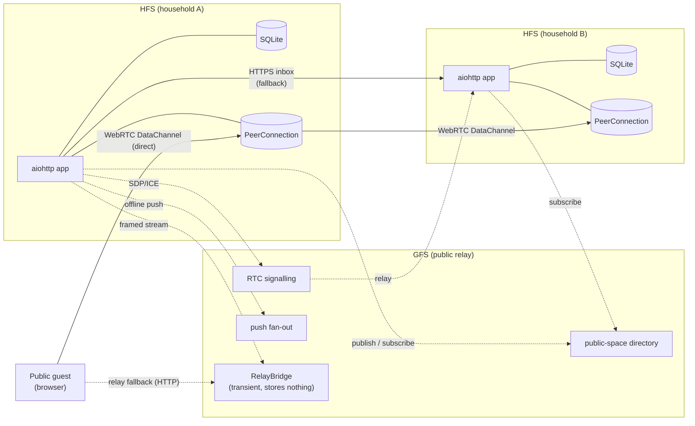
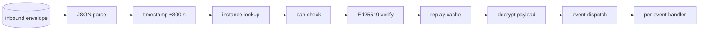

# Architecture

How Social Home fits together. Distilled from §4 of `spec_work.md`
plus the current code under `socialhome/`.

For the wire-level federation protocol — envelopes, validation
pipeline, per-feature flows — see [`protocol/README.md`](./protocol/README.md).
This page covers the **system shape** behind that protocol: who runs
what, how identity works, how peers stay in sync, how spaces stay
encrypted across membership churn, and how the system recovers when
peers go offline.

## Topology

Each household runs one **Household Federation Server (HFS)**.
Households talk to each other directly, peer-to-peer. A central
**Global Federation Server (GFS)** is consulted only for tasks that
genuinely need a meeting point: public-space discovery, push fan-out
to offline peers, and WebRTC signalling bootstrap. The GFS sees
routing metadata only — never plaintext content, and (since the
anonymous relay) not even which household relayed a public/global space
event: `/gfs/publish` is authorized purely by the space-authority
signature inside the opaque payload.

For public-content delivery (public highlights and the public moments
index) the GFS adds a **lazy-relay fallback tier**: a guest browser
always tries a direct WebRTC DataChannel to the author's SH first, and
only when that can't connect does the GFS proxy the framed stream over
HTTP — pushing a `relay_offer` to the still-online author, who streams
the byte-identical frames back through the GFS to the guest. The fallback
is author-online only; an offline author still yields "unavailable". One
framing module and one transient in-memory `RelayBridge` serve both
highlights and moments, and **the GFS stores zero highlight/moment
content bytes** — the bridge is a pure pipe, never an at-rest copy.

A single HFS can run in three platform modes, selected by `SH_MODE`:

| Mode | Adapter | When |
|---|---|---|
| `standalone` | `StandaloneAdapter` | Direct deploy: local users, password auth, no Home Assistant. |
| `ha` | `HaAdapter` | HA Core + REST: SH talks to a Home Assistant install via REST, but is *not* itself an add-on. |
| `haos` | `HaosAdapter` | HA Supervisor add-on: runs inside HAOS with Ingress auth and Supervisor APIs. |

Mode-specific code lives in `socialhome/platform/{standalone,ha,haos}/`.
Route handlers and services consume the adapter through Provider
Protocols (`AuthProvider`, `UserDirectory`, `PushProvider`, …) plus
a `capabilities` set, never by branching on `config.mode`. See
`socialhome/platform/adapter.py`.

Push (§25.3) fans out to every registered surface: Web Push (browsers,
VAPID) and the platform adapter's `PushProvider`. In `ha` / `haos` mode
that provider targets the user's **HA Companion app** via the notify
service they set per-user in Settings → Notifications
(`preferences.ha_notify_service`, e.g. `notify.mobile_app_<device>`).
HA names that service after the *device*, not the username, so there is
no auto-derived default — an unset value skips HA-app push for that user,
and a configured-but-wrong service is logged at WARNING (not silently
dropped).

## Identity (§4.1)

Every identity in Social Home — instance and user — is bound to an
Ed25519 public key. Identifiers are deterministic 32-character base32
strings derived from a SHA-256 of that key, so any party can verify a
claimed `instance_id` or `user_id` by recomputing the digest. No
central registry is involved.

- **`instance_id`** — derived from the HFS's long-term Ed25519 public
  key (`derive_instance_id(public_key_bytes)`). Generated once on first
  startup and never reassigned. Stored in `instance_identity`.
- **`user_id`** — derived from the **home instance's** public key plus
  the user's immutable **`identity_anchor`**, with a null-byte separator
  (`derive_user_id(instance_pk, identity_anchor)`, v_26). The anchor is a
  uuid4 for users created on v_26+ (standalone) and the **frozen username**
  for existing rows, for haos users, and for the first admin of a standalone
  / ha household (all three re-mirror deterministically, so the derivation
  input has to be stable) — so `user_id` is bound to an opaque per-user
  value, **not** the human name. Every local minting path goes through the
  one helper `identity_bootstrap.derive_local_user_id` (username-anchored) or
  `UserService.provision` (uuid4-anchored); a `user_id` is **never**
  synthesised from a string, and migration `0049` repairs the installs where
  it once was. This frees the human name for a later
  mutable login + `@handle` without re-keying the user's federated identity
  (a rename leaves `user_id` stable). Globally unique, cryptographically
  bound to the home instance, and survives across spaces and DMs.
- **`UserIdentityAssertion`** — when an instance refers to one of
  its users in a federation event (`USERS_SYNC`, embedded in space
  events, etc.), it ships a signed assertion binding the `user_id`
  to the username + display name. Receivers verify the signature
  with the home instance's public key on every inbound event.
- **`username`** — a **mutable login label** distinct from the
  cryptographic `user_id`. Standalone users rename it via
  `POST /api/me/username`; HA-mode usernames follow the HA person
  name on every boot. Renames cascade locally (migration `0042`
  adds `ON UPDATE CASCADE` to all referencing foreign keys) and
  federate via `USER_UPDATED` events so peers keep their
  `remote_users.username` in sync. The cryptographic identity
  (`user_id` / `identity_anchor`) is unaffected by a rename.
- **`handle`** — a **public `@handle`** (distinct from both the
  cryptographic `user_id` and the login `username`). A mutable,
  per-household-unique, case-insensitive display name set via
  `POST /api/me/handle` by any local user (including HA-managed).
  Unsigned public display metadata (federated on `USER_UPDATED` /
  `USERS_SYNC` alongside `display_name` and `picture`, never part of
  the signed identity binding). On remote instances cached in
  `remote_users.handle` (per-peer COALESCE-sticky so older peers or
  non-handle edits never null the cached value).

#### Instance identity vs. per-user identity

The two identities above play different roles:

- **Instance identity** (the `instance_id` key) is the **transport +
  trust root**. It signs every federation envelope, anchors pairing, and
  is what `from_instance` is bound to. It belongs to the *household*, not
  to any one member.
- **Per-user identity** (independent user identity, **Phase 1** —
  capability v_25) gives each household member their **own** Ed25519
  keypair, distinct from the instance key. A household publishes a
  user's public key plus a *dual-signed binding* (instance signature
  vouching for the specific key + user self-signature proving
  possession) inside the existing `USERS_SYNC` / `USER_UPDATED` payloads;
  receivers verify it against the sender's pinned instance key and store
  the remote user's public key on `remote_users`.

Phase 1 is **behaviour-neutral and portable-by-design**: the legacy
`user_id` (`derive_user_id(home_instance_pk, username)`) stays the
*canonical* address for every user-scoped surface, and the per-user key
is additive metadata — a peer that ignores it works exactly as before.
**Phase 2** (capability v_26) takes the first portability step: `user_id`
now derives from an immutable `identity_anchor` (uuid for new users, frozen
username for existing/haos) instead of the mutable username, so the human
name can later become a mutable login + `@handle` without re-keying. The
anchor is carried in the binding and committed into **both** signatures;
verify re-derives `user_id` from it (sub-v_26 falls back to username — see
*Migration tail* in the protocol doc). The remaining roadmap intent is
later-phase: resolve / cache the binding on demand, then make a user's
identity fully **portable** so a member can move out of one household and
carry their key. Migrations `0040_user_identity_keys.sql` (key columns) and
`0041_user_identity_anchor.sql` (the `identity_anchor` columns) provision
the storage; `infrastructure/user_identity.py` mints the keys and
`services/user_service.py` mints the anchor. See
[`protocol/user-identity.md`](protocol/user-identity.md).

### Post-quantum migration (§25.8)

Identity is **classical Ed25519 by default**, with optional **ML-DSA-65
hybrid signatures** wired in. When `federation_sig_suite =
'ed25519+mldsa65'` is set, every signed payload carries both an
Ed25519 and an ML-DSA-65 signature; receivers verify both. The
fallback to classical happens automatically per-peer based on what
each side advertised at pairing — see `remote_instances.sig_suite`.

The PQ key material lives alongside the classical key in
`instance_identity` (columns `pq_algorithm`, `pq_private_key`,
`pq_public_key`); peer PQ keys live in `remote_instances.remote_pq_*`.
Key generation is done by `socialhome/federation/pq_signer.py` and
the bootstrap is in `infrastructure/key_manager.py`.

### Implementation pointers

- `socialhome/federation/crypto_suite.py` — derive_instance_id /
  derive_user_id, signature verification, hybrid suite selection.
- `socialhome/infrastructure/key_manager.py` — first-startup keypair
  generation, KEK encryption of private key material at rest.
- `socialhome/repositories/federation_repo.py` — `instance_identity`
  + `remote_instances` reads/writes.
- `socialhome/infrastructure/user_identity.py` +
  `socialhome/services/user_identity_binding.py` — per-user identity key
  minting/backfill and the outbound binding fields (Phase 1).
- See [`protocol/pairing.md`](./protocol/pairing.md) for the
  pairing handshake that bootstraps trust between two instances, and
  [`protocol/user-identity.md`](./protocol/user-identity.md) for the
  per-user identity binding carried on the roster.

## Progressive sync (§4.2)

Federation traffic is split across three transports based on what the
event needs and whether the peer is reachable:

| Tier | Transport | Used for |
|---|---|---|
| 1 — hot | WebRTC DataChannel `fed-v1` | Routine, real-time envelopes once the P2P channel is up. |
| 2 — warm | WebRTC DataChannel `sync-v1` | Bulk content sync (initial sync after pairing, recovery after long offline). |
| 3 — cold | HTTPS inbox `POST /federation/inbox/{id}` | Fallback before/while DataChannel is down, and for peers behind a blocked UDP path. |
| 4 — no address | Connection-server envelope relay `POST {gfs}/gfs/envelope` | Households seated from an invite link (§D2b): the pair never exchanged an address, so tiers 1-3 have nothing to dial. |

Tier 4 is a `TransportStrategy` like the others
(`federation/gfs_relay_transport.GfsRelayTransport`), selected in
`FederationTransport.send` on `source = space_session` and never for a
peer that has an address. Because the connection server is a third party
— not a household — the whole §24.11 envelope (its routing fields are
plaintext by construction) is sealed to the peer's static X25519 key-wrap
key before the relay sees it, so the relay holds `(to_instance, time,
size)` and nothing else. See
[`protocol/invites.md`](./protocol/invites.md) for the wire shape and
[`principles.md`](./principles.md) for the metadata that concedes.

The Connections page renders the current per-peer transport tier as
an inline glyph (⚡ for WebRTC, ☁ for HTTPS), updated live via the
`peer.transport_changed` WS frame. The Manage detail panel adds a
plain-English explanation of which tier is active and, for peers
that recently received a relayed DM, the relay path. The signal is
strictly diagnostic — federation behaviour is identical at every
tier; only the latency differs.

All tiers run their inbound traffic through the same §24.11
validation pipeline (parse → timestamp → instance lookup → ban check
→ Ed25519 verify → replay cache → decrypt → dispatch). Whether an
envelope arrives over RTC, HTTPS or the connection-server relay is
invisible to the per-event handlers; every path lands in
`federation/inbound_validator.InboundPipeline`.

### Federation map — peer home location

The HA and HAOS adapters fetch `latitude` / `longitude` from HA Core's
`GET /api/config` during `on_startup` and persist them (truncated to 4dp)
to `instance_identity.home_lat` / `home_lon`. Persistence fires a
`LocalHomeLocationUpdated` bus event, which two subscribers consume:

- **`FederationService`** fans out `LOCAL_HOME_LOCATION_CHANGED` to every
  confirmed peer whose `proto_version ≥ 5` (capability v5). The peer stores
  the coordinates on `remote_instances.home_lat` / `home_lon` and publishes
  `PeerHomeChanged`.
- **`RealtimeService`** pushes a `local.home_changed` WS frame to every
  connected client so the SPA's Connections Map tab updates the own-household
  pin without a page reload.

Inbound `LOCAL_HOME_LOCATION_CHANGED` triggers the same `PeerHomeChanged`
event, which `RealtimeService` broadcasts as a `peer.home_changed` WS frame
so the Map tab can move or add the peer's pin. The `PAIRING_PEER_ACCEPT`
bootstrap message also carries `home_lat` / `home_lon` when available, so
the map is populated immediately after pairing without waiting for a
subsequent broadcast.

The Connections page exposes a **List | Map** tab toggle. The Map tab
renders an OpenStreetMap canvas (Leaflet) with one pin per household — own
household marked distinctly, peers marked with transport-indicator badges
(WebRTC / HTTPS). Tapping a pin opens a popup with distance and 8-point
compass bearing. Peers without coordinates appear in a "Not on map" footer
below the canvas. Standalone and third-party instances never have a
home location unless the operator configures one explicitly; the UI
degrades gracefully in that case.

See [`protocol/home-location.md`](./protocol/home-location.md) for the
full wire protocol and sequence diagram.

### Outbox and retries

Outbound envelopes go to `federation_outbox` first
(`socialhome/repositories/outbox_repo.py`). The
`infrastructure/outbox_processor.py` scheduler walks the table on a
fixed cadence, picks the best transport for each peer (RTC if open,
HTTPS otherwise), and retries with exponential backoff. Structural /
security-critical events have `expires_at = NULL` and never age out;
ordinary events have a 7-day TTL (§4.4.7). A delivered envelope's row is
**deleted on success** (`mark_delivered`) — the receiver's 2xx satisfies
at-least-once and nothing reads delivered rows, so the queue never keeps
a tombstone per delivered event. The processor also runs a periodic
retention sweep folded into the same loop with two phases:
`expire_past_retention` flips undelivered ordinary events to `failed` at
7 days (NEVER_DROP events keep retrying indefinitely), and
`purge_terminal` DELETEs terminal (`delivered`/`failed`) rows older than
`TERMINAL_GRACE` (24 h) in bounded batches. Together these bound the
table: failures are kept 24 h for operator diagnostics then purged, and
the pre-change historical `delivered`/`failed` backlog is reclaimed over
successive sweep ticks. A hard **per-peer pending cap**
(`MAX_PENDING_PER_PEER`, default 1000) bounds the table independently of
the TTL: when a peer is at/over the cap, `enqueue` evicts that peer's
oldest *droppable* (non-NEVER_DROP) pending row before inserting the new
one, so a permanently-offline peer plus a busy space can't flood the
outbox. NEVER_DROP rows are never evicted — if the backlog is entirely
NEVER_DROP the new row is still inserted over the cap rather than dropping
a security/structural event.

### Bulk sync

Initial content sync after pairing (and recovery sync after a long
outage) runs over the dedicated `sync-v1` DataChannel label so the
chunky Tier-2 traffic doesn't head-of-line block routine Tier-1
envelopes. The orchestration lives in
`socialhome/federation/sync_manager.py` and the per-feature
chunkers under `socialhome/federation/sync/space/` and
`socialhome/federation/sync/dm_history/`. Wire details are in
[`protocol/sync.md`](./protocol/sync.md).

## Space cryptographic identity (§4.3)

Every space has its own Ed25519 keypair and a per-epoch AES-256
content key. Members who can read the space hold the current epoch's
content key; members who left or were banned cannot — because the
**epoch advances** on member removal, and the new key is delivered
only to remaining members.

- `spaces.identity_public_key` — the space's permanent Ed25519
  public key, derived once at creation.
- `space_keys(space_id, epoch)` — one row per epoch holding the
  KEK-encrypted AES-256 content key.
- Membership change → rekey: when a member is removed or banned,
  `space_crypto_service.py` derives a new content key, increments
  `epoch`, and ships a `SPACE_KEY_ROTATED` event encrypted to each
  remaining member's identity key.

Detailed flow with diagrams is in
[`protocol/spaces.md`](./protocol/spaces.md). The space-level
`config_sequence` column on `spaces` provides last-writer-wins
ordering for non-key config changes.

### Implementation pointers

- `socialhome/services/space_crypto_service.py` — key derivation,
  rekey orchestration.
- `socialhome/repositories/space_key_repo.py` — `space_keys` reads
  and writes.
- `socialhome/services/space_service.py` — membership churn that
  triggers rekey.

## Resilience and outage recovery (§4.4)

Federation is asynchronous: peers go offline, networks partition,
addons get restarted. The system is designed so that none of this
loses data, and every event is processed at most once.

### Disaster recovery (Recovery Kit)

A household's identity *is* its `instance_identity` row (Ed25519 keypair,
KEK-wrapped); peers pin its public key, so total disk loss would otherwise
mean re-pairing with everyone in person. Two recovery paths, selected by
capability (never `config.mode`):

- **haos:** the HA Supervisor backup already captures the add-on's
  `{data_dir}` — both the SQLite DB and `.kek_salt` — so restoring an HA
  backup reconstitutes the same `instance_id` with no SH-specific step.
- **standalone / ha:** a **Recovery Kit** (`.shrk`) — a passphrase-sealed
  export of the *trust layer* (`instance_identity`, `remote_instances`,
  `spaces`, `space_keys`) plus the `.kek_salt`. The shareable data backup
  deliberately excludes all of these (`NEVER_EXPORT`), so the Kit is the only
  artifact that brings identity + peer trust back. Wire format + crypto:
  `docs/crypto.md` "Recovery Kit"; impl: `services/recovery_crypto.py` +
  `services/recovery_kit_service.py`.

Build via admin `POST /api/recovery-kit`. Restore on a fresh box via the
setup wizard (`POST /api/setup/recovery/restore`): the box auto-mints a
throwaway identity at startup, so the endpoint validates the Kit, wipes the
throwaway trust rows, restores the Kit's, marks setup complete, and triggers
a process restart so the restored identity/KEK load cleanly. Because the same
Ed25519 key returns, the first post-restart boot fans a signed `URL_UPDATED`
out to every restored peer (`services/recovery_reconnect_service.py`, triggered
by the `recovery.recovered_at` marker and guarded by a `recovery.reconnected_at`
marker so it fires exactly once) so peers re-point at the possibly-new inbox
URL; the §4.4 sync below then re-pulls content over the re-established
transport.

### Replay cache

Every accepted envelope's `msg_id` lands in `federation_replay_cache`
with a received-at timestamp. Inbound validation rejects any envelope
whose `msg_id` is already cached (idempotency at the federation
boundary). The
`infrastructure/replay_cache_scheduler.py` evicts entries older than
the §24.11 horizon on a slow cadence so the table doesn't grow
unboundedly.

### Idempotency keys

Mutating HTTP routes accept an `Idempotency-Key` header; the
`infrastructure/idempotency.py` middleware deduplicates by
`(user_id, key)`. Combined with the replay cache, this means
both API callers and federation peers can retry safely.

### Reconnect queue

When a peer flips from `unreachable` → `confirmed`, the
`infrastructure/reconnect_queue.py` flushes any envelopes that
piled up in `federation_outbox` for that peer in dependency order.
This is what makes "long offline → come back online" recover
without operator intervention.

### Schedulers (the `_stop: asyncio.Event` pattern)

Every background loop in `socialhome/infrastructure/` follows the
same lifecycle: `_stop: asyncio.Event` set in `stop()`, drained in
`start()`, body is `while not self._stop.is_set()`. Reference
template: `replay_cache_scheduler.py`. Schedulers cover replay-cache
eviction, outbox processing, calendar reminders, page-lock expiry,
post-draft GC, pairing-relay flush, post-rotation tasks, space
retention, task deadlines, recurring-task spawning, password-reset-token
GC, auth-audit-log pruning (`auth_audit_cleanup_scheduler.py` drops
`auth_audit_log` rows older than 90 days hourly, so the append-only trail
can't be grown without bound by repeated failed logins), and
notification-feed GC (`notification_cleanup_scheduler.py` drops
`notifications` rows older than 90 days hourly).

The GFS runs its own periodic maintenance sweep
(`global_server/maintenance.py`, same `_stop: asyncio.Event` lifecycle as
`global_server/cluster.py`): hourly it purges expired `admin_sessions`,
expired `gfs_highlight_publications`, and aged `gfs_pair_tokens`, each
prune best-effort and independently guarded. Before this loop the GFS had
no recurring cleanup — only a boot-time session purge and the cluster
heartbeat — so those tables grew unbounded on a long-running process.

### Async media transcoding

Video uploads transcode in the background instead of blocking the
request. `POST /api/media/upload` (and gallery video upload) stashes
the raw source bytes in a temp file, enqueues one `media_transcode_jobs`
row keyed by the eventual output filename, and returns immediately with
`media_status:"processing"` so the SPA renders a "Processing…"
placeholder. `MediaTranscodeService`
(`socialhome/services/media_transcode_service.py`) drains the queue —
mirroring the DM media-sync outbox/scheduler pattern: it claims each due
job, transcodes the source to a VP9/Opus `.webm` plus a WebP poster,
writes both under the media root, deletes the row (readiness == absent
row), and publishes `MediaTranscodeReady`. The realtime service turns
that event into a `media.ready` WS frame pushed to the uploader so its
SPA swaps the placeholder for the player; other viewers pick up
readiness via the `media_status` field on their next list fetch
(`'processing'` / `'failed'` / `'ready'`, absent ⇒ ready). It uses the
same `_stop`/`_wake` `asyncio.Event` scheduler family as the other
background services, with jittered exponential backoff that flips a job
to `status='failed'` after its retry budget.

### Page conflict resolution

Concurrent edits to a space page produce a `space_page_snapshots`
row with `conflict=1`. The space's editing UI offers
`mine | theirs | merged_content` resolution before further edits are
allowed. Lives in `socialhome/services/page_conflict_service.py`.

### Implementation pointers

- `socialhome/infrastructure/replay_cache_scheduler.py` (template).
- `socialhome/infrastructure/outbox_processor.py`.
- `socialhome/infrastructure/idempotency.py`.
- `socialhome/infrastructure/reconnect_queue.py`.
- `socialhome/services/page_conflict_service.py`.

## Social Home Apps

Social Home supports admin-installed embedded JS apps sourced from the
separate `socialhome-apps` GitHub repository. The catalog and bundles
are **release-fetched**: `AppService` downloads `catalog.json` from the
configured release URL (`apps_catalog_url` / `SH_APPS_CATALOG_URL`),
and on install downloads the bundle tarball, verifies its `sha256`
against the catalog entry, and unpacks it with a path-traversal guard
under `apps_path/<app_id>/<version>/` (`apps_path` / `SH_APPS_PATH`,
default `<data_dir>/apps` — a dedicated app directory separate from user
media, so on HAOS it persists at `/data/apps`). A mismatch aborts the
install — a bundle is never unpacked until its digest is confirmed.

The registry lives in `installed_apps` (see `database.md` → **Apps**)
with the service/repo pair `AppService` / `SqliteAppRepo`
(`socialhome/services/app_service.py`,
`socialhome/repositories/app_repo.py`). Routes are under
`socialhome/routes/apps.py`.

**PR2** adds `app_kv` (per-user key-value storage per app).

### Sandbox runtime (PR3)

Two routes power the sandbox execution path:

- `GET /api/apps/{app_id}/runtime` — bearer-authed member endpoint.
  Returns `{app_id, name, entry_url, self_user_id, capabilities}` where
  `entry_url` is a short-lived signed bundle URL. 404 when not installed;
  403 when disabled.
- `GET /api/apps/{app_id}/bundle/{tail}` — serves the bundle's static
  files. Authorization uses the media-signer signature baked into the
  `entry_url` (`?exp=&sig=`); on first access those query parameters are
  exchanged for a short-lived HttpOnly path-scoped cookie so relative
  sub-resources load without carrying credentials. No bearer token is
  required or accepted. Every response carries a strict Content-Security-Policy
  (`connect-src 'none'`, `worker-src 'none'`, `frame-ancestors 'self'`, etc.)
  and `X-Frame-Options: SAMEORIGIN`. Path traversal is guarded and the route
  re-checks that the app is still enabled on every request.

The `secure_cookies` config key (`SH_SECURE_COOKIES`, default `false`) adds
the `Secure` attribute to the bundle cookie — set it true whenever the server
is behind TLS.

The SPA loads the app bundle inside `<iframe sandbox="allow-scripts">`. The
absence of `allow-same-origin` gives the iframe an opaque origin so it cannot
read the parent's DOM, localStorage, or cookies. App code can't reach the
network because of the `connect-src 'none'` CSP, and the bearer token is never
passed into the iframe. The only host interface is a postMessage bridge: the
SPA host validates `event.source === iframe.contentWindow` before relaying
messages (origin checking is unreliable — sandboxed iframes expose an opaque
`"null"` origin, so only the source reference identifies our iframe), and the
bridge exposes only the documented per-user store API — never the raw bearer
token.

Real-time events are delivered via the existing `/api/ws` WebSocket: the server
routes `app.message` frames to the SPA connection that has the matching app
launched.  The host bridge forwards qualifying frames into the iframe as
`MessageEvent`s.

### App-to-app federation (PR4, capability v_17; person-to-person v_18)

`AppFederationService` (`socialhome/services/app_federation_service.py`)
bridges between the federation layer and the SPA:

- **Session control** (`APP_SESSION`, verb `"open"/"accept"/"close"`) always
  rides the JSON federation event path over `fed-v1` or the HTTPS inbox, so
  sessions open and close correctly even against pre-v17 peers.
- **App messages** take the fast path when the peer is v_17+ CONFIRMED with an
  open `fed-app-v1` DataChannel: AES-256-GCM-sealed binary frames with a
  `payload_sha256` binding (same security model as the v_14 media channel).
  Otherwise `FederationService.send_app_message` falls back transparently to
  an `APP_MESSAGE` JSON event.
- **Person-to-person sessions (v_18):** `open_session` and `send_message`
  target a specific person (local or remote) via a `target` dict
  (`{instance_id, user_ref, is_local}`). Local-loopback sessions deliver a
  frame straight to the target and initiator over WebSocket — no federation
  send. Remote sessions include `to_user`/`from_user` in the JSON event when
  the peer is v_18+, so the receiver can route to the addressed person instead
  of fanning out to all local users. An `AppChallengeReceived` domain event
  fires for the addressed user (→ bell row + title-only push per §25.3).
- **Contact roster** (`GET /api/apps/{app_id}/contacts`): the same
  block-aware, pairing-scoped person set as `/api/friends` and DMs. Both
  `open_session` and `send_message` gate on `_assert_target_allowed` (→
  `AppContactNotFoundError`, HTTP 403) — the send cannot address anyone
  outside this roster.
- **Inbound delivery** (both paths): after §24.11 validation and decryption,
  `_deliver` routes to the addressed user (v_18+ JSON path) or fans the
  `app.message` WS frame to every local user (legacy / binary path). The
  binary `fed-app-v1` frame format (v1) carries no routing slot.
- **REST:** `GET /api/apps/{app_id}/peers`, `GET /api/apps/{app_id}/contacts`,
  `POST /api/apps/{app_id}/sessions`, `POST /api/apps/{app_id}/messages`.

See [`protocol/apps.md`](./protocol/apps.md) for the wire protocol and
sequence diagram, and [`docs/crypto.md`](./crypto.md) for the `fed-app-v1`
AEAD suite details.

## Map tiles

Every map surface (location pins, space zones, the Federation map) renders
raster tiles through the backend, never straight from the browser.

The reason is a hard constraint, not a preference. The OpenStreetMap
Foundation's tile usage policy requires each request to identify itself via
`User-Agent` or `Referer`, and a browser can supply neither — both are
forbidden header names, so a page cannot set them, and OSM rejects
referer-less browser requests with HTTP 403. Pointing `L.tileLayer` at
`tile.openstreetmap.org` therefore produces a grey map. Home Assistant Core
reached the same conclusion and added its own tile proxy for the same reason.

How it works:

- `MapTileService` (`socialhome/services/map_tile_service.py`) fetches
  upstream with an identifying `User-Agent`, validates the coordinates,
  bounds the response size and the number of concurrent fetches, and keeps a
  byte-capped in-memory LRU cache. The cache is memory-only on purpose —
  hosts commonly run from SD cards. A stale entry is never dropped for age:
  while upstream is unreachable an old tile is what keeps the map readable.
- `GET /api/map/config` hands the SPA a **relative**, already-signed tile
  template (`api/map/tiles?z={z}&x={x}&y={y}&exp=…&sig=…`). Relative because
  the document base under HA Supervisor ingress is
  `/api/hassio_ingress/<token>/`; an origin-anchored URL breaks haos.
- `GET /api/map/tiles` is authorised by the existing `MediaUrlSigner`
  (`SignedMediaStrategy`). Leaflet loads tiles with an ``, which cannot
  carry `Authorization: Bearer`, and under ingress the SPA holds no token at
  all — a signed URL is the only mechanism that works in all three modes.
  The coordinates ride in the unsigned query string, so one signature
  authorises the whole tile endpoint; unlike the per-resource media
  signatures this capability is deliberately broad, and it exposes no user
  data.
- `map_tile_url` / `SH_MAP_TILE_URL` lets an operator point at their own
  tile server. Its query string is treated as a secret (third-party
  providers put API keys there) and is scrubbed from logs and error text.

Do not "simplify" this back into a direct tile URL in the SPA — that is the
bug this replaced.

## Where things live

| Concern | Path |
|---|---|
| Domain types (frozen dataclasses) | `socialhome/domain/` |
| Repositories (the only place SQL lives) | `socialhome/repositories/` |
| Services (business logic) | `socialhome/services/` |
| Federation (envelope, signing, transport, sync) | `socialhome/federation/` |
| Routes (`BaseView` subclasses) | `socialhome/routes/` |
| Background schedulers | `socialhome/infrastructure/` |
| Platform adapters (HA / HAOS / standalone) | `socialhome/platform/` |
| DB layer + Unit of Work | `socialhome/db/` |
| Schema | `socialhome/migrations/0001_initial.sql` |

The repository layer never imports from services; services depend on
`Abstract*Repo` Protocols, never on `Sqlite*Repo` concretes. `BaseView`
maps domain exceptions to HTTP responses centrally
(`socialhome/routes/base.py`). See `CLAUDE.md` for the full set of
architectural rules.

## Spec references

- §2 — design principles (mirrored in [`principles.md`](./principles.md))
- §4 — architecture overview (this page)
- §4.1 — identity system
- §4.2 — progressive sync and DataChannel
- §4.3 — space cryptographic identity
- §4.4 — resilience and outage recovery
- §11 — instance pairing
- §13 — spaces
- §24.11 — inbound validation pipeline
- §25.8 — post-quantum signature migration
