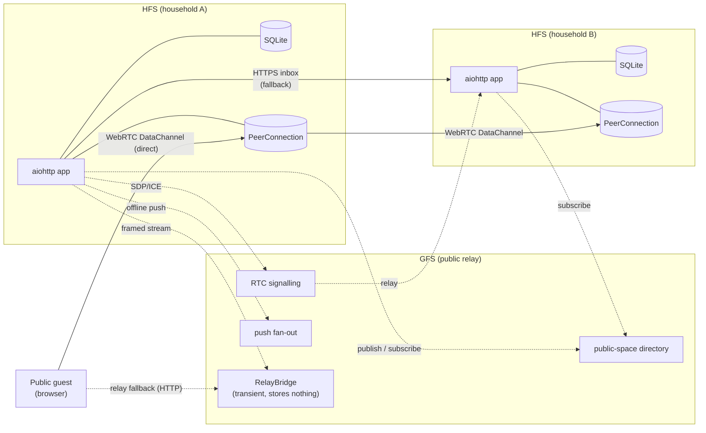
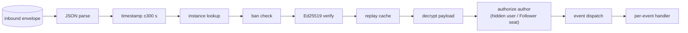
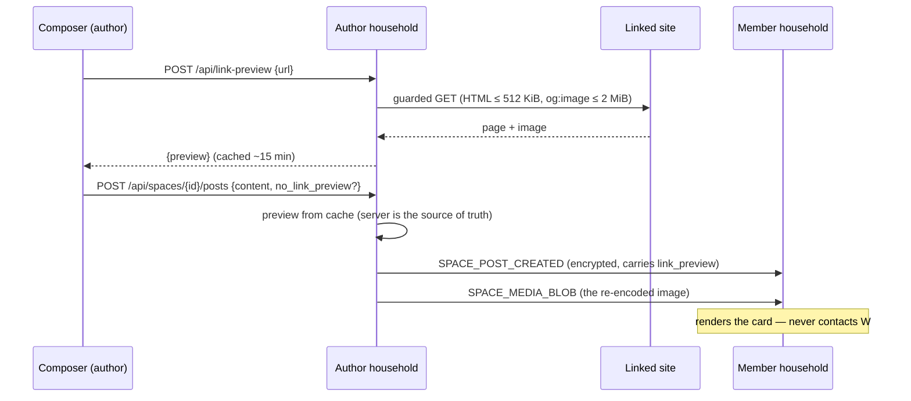

# Architecture

How Social Home fits together. Distilled from §4 of `spec_work.md`
plus the current code under `socialhome/`.

For the wire-level federation protocol — envelopes, validation
pipeline, per-feature flows — see [`protocol/README.md`](./protocol/README.md).
This page covers the **system shape** behind that protocol: who runs
what, how identity works, how peers stay in sync, how spaces stay
encrypted across membership churn, and how the system recovers when
peers go offline.

## Topology

Each household runs one **Household Federation Server (HFS)**.
Households talk to each other directly, peer-to-peer. A central
**Global Federation Server (GFS)** is consulted only for tasks that
genuinely need a meeting point: public-space discovery, push fan-out
to offline peers, and WebRTC signalling bootstrap. The GFS sees
routing metadata only — never plaintext content, and (since the
anonymous relay) not even which household relayed a public/global space
event: `/gfs/publish` is authorized purely by the space-authority
signature inside the opaque payload.

For public-content delivery (public highlights and the public moments
index) the GFS adds a **lazy-relay fallback tier**: a guest browser
always tries a direct WebRTC DataChannel to the author's SH first, and
only when that can't connect does the GFS proxy the framed stream over
HTTP — pushing a `relay_offer` to the still-online author, who streams
the byte-identical frames back through the GFS to the guest. The fallback
is author-online only; an offline author still yields "unavailable". One
framing module and one transient in-memory `RelayBridge` serve both
highlights and moments, and **the GFS stores zero highlight/moment
content bytes** — the bridge is a pure pipe, never an at-rest copy.

```mermaid
flowchart LR
    subgraph HFS_A["HFS (household A)"]
        A_app["aiohttp app"]
        A_db[(SQLite)]
        A_pc[("PeerConnection")]
        A_app --- A_db
        A_app --- A_pc
    end
    subgraph HFS_B["HFS (household B)"]
        B_app["aiohttp app"]
        B_db[(SQLite)]
        B_pc[("PeerConnection")]
        B_app --- B_db
        B_app --- B_pc
    end
    subgraph GFS["GFS (public relay)"]
        G_dir["public-space directory"]
        G_rtc["RTC signalling"]
        G_push["push fan-out"]
        G_bridge["RelayBridge<br/>(transient, stores nothing)"]
    end
    V_pub["Public guest<br/>(browser)"]

    A_pc -- "WebRTC DataChannel" --> B_pc
    A_app -- "HTTPS inbox<br/>(fallback)" --> B_app

    A_app -. "publish / subscribe" .-> G_dir
    B_app -. "subscribe" .-> G_dir
    A_app -. "SDP/ICE" .-> G_rtc
    G_rtc -. "relay" .-> B_app
    A_app -. "offline push" .-> G_push

    V_pub -- "WebRTC DataChannel (direct)" --> A_pc
    V_pub -. "relay fallback (HTTP)" .-> G_bridge
    A_app -. "framed stream" .-> G_bridge
```

A single HFS can run in three platform modes, selected by `SH_MODE`:

| Mode | Adapter | When |
|---|---|---|
| `standalone` | `StandaloneAdapter` | Direct deploy: local users, password auth, no Home Assistant. |
| `ha` | `HaAdapter` | HA Core + REST: SH talks to a Home Assistant install via REST, but is *not* itself an add-on. |
| `haos` | `HaosAdapter` | HA Supervisor add-on: runs inside HAOS with Ingress auth and Supervisor APIs. |

Mode-specific code lives in `socialhome/platform/{standalone,ha,haos}/`.
Route handlers and services consume the adapter through Provider
Protocols (`AuthProvider`, `UserDirectory`, `PushProvider`, …) plus
a `capabilities` set, never by branching on `config.mode`. See
`socialhome/platform/adapter.py`.

Push (§25.3) fans out to every registered surface: Web Push (browsers,
VAPID) and the platform adapter's `PushProvider`. In `ha` / `haos` mode
that provider targets the user's **HA Companion app** via the notify
service they set per-user in Settings → Notifications
(`preferences.ha_notify_service`, e.g. `notify.mobile_app_<device>`).
HA names that service after the *device*, not the username, so there is
no auto-derived default — an unset value skips HA-app push for that user,
and a configured-but-wrong service is logged at WARNING (not silently
dropped).

## Identity (§4.1)

Every identity in Social Home — instance and user — is bound to an
Ed25519 public key. Identifiers are deterministic 32-character base32
strings derived from a SHA-256 of that key, so any party can verify a
claimed `instance_id` or `user_id` by recomputing the digest. No
central registry is involved.

- **`instance_id`** — derived from the HFS's long-term Ed25519 public
  key (`derive_instance_id(public_key_bytes)`). Generated once on first
  startup and never reassigned. Stored in `instance_identity`.
- **`user_id`** — derived from the **home instance's** public key plus
  the user's immutable **`identity_anchor`**, with a null-byte separator
  (`derive_user_id(instance_pk, identity_anchor)`, v_26). The anchor is a
  uuid4 for users created on v_26+ (standalone) and the **frozen username**
  for existing rows, for haos users, and for the first admin of a standalone
  / ha household (all three re-mirror deterministically, so the derivation
  input has to be stable) — so `user_id` is bound to an opaque per-user
  value, **not** the human name. Every local minting path goes through the
  one helper `identity_bootstrap.derive_local_user_id` (username-anchored) or
  `UserService.provision` (uuid4-anchored); a `user_id` is **never**
  synthesised from a string, and migration `0049` repairs the installs where
  it once was. This frees the human name for a later
  mutable login + `@handle` without re-keying the user's federated identity
  (a rename leaves `user_id` stable). Globally unique, cryptographically
  bound to the home instance, and survives across spaces and DMs.
- **`UserIdentityAssertion`** — when an instance refers to one of
  its users in a federation event (`USERS_SYNC`, embedded in space
  events, etc.), it ships a signed assertion binding the `user_id`
  to the username + display name. Receivers verify the signature
  with the home instance's public key on every inbound event.
- **`username`** — a **mutable login label** distinct from the
  cryptographic `user_id`. Standalone users rename it via
  `POST /api/me/username`; HA-mode usernames follow the HA person
  name on every boot. Renames cascade locally (migration `0042`
  adds `ON UPDATE CASCADE` to all referencing foreign keys) and
  federate via `USER_UPDATED` events so peers keep their
  `remote_users.username` in sync. The cryptographic identity
  (`user_id` / `identity_anchor`) is unaffected by a rename.
- **`handle`** — a **public `@handle`** (distinct from both the
  cryptographic `user_id` and the login `username`). A mutable,
  per-household-unique, case-insensitive display name set via
  `POST /api/me/handle` by any local user (including HA-managed).
  Unsigned public display metadata (federated on `USER_UPDATED` /
  `USERS_SYNC` alongside `display_name` and `picture`, never part of
  the signed identity binding). On remote instances cached in
  `remote_users.handle` (per-peer COALESCE-sticky so older peers or
  non-handle edits never null the cached value).

#### Instance identity vs. per-user identity

The two identities above play different roles:

- **Instance identity** (the `instance_id` key) is the **transport +
  trust root**. It signs every federation envelope, anchors pairing, and
  is what `from_instance` is bound to. It belongs to the *household*, not
  to any one member.
- **Per-user identity** (independent user identity, **Phase 1** —
  capability v_25) gives each household member their **own** Ed25519
  keypair, distinct from the instance key. A household publishes a
  user's public key plus a *dual-signed binding* (instance signature
  vouching for the specific key + user self-signature proving
  possession) inside the existing `USERS_SYNC` / `USER_UPDATED` payloads;
  receivers verify it against the sender's pinned instance key and store
  the remote user's public key on `remote_users`.

Phase 1 is **behaviour-neutral and portable-by-design**: the legacy
`user_id` (`derive_user_id(home_instance_pk, username)`) stays the
*canonical* address for every user-scoped surface, and the per-user key
is additive metadata — a peer that ignores it works exactly as before.
**Phase 2** (capability v_26) takes the first portability step: `user_id`
now derives from an immutable `identity_anchor` (uuid for new users, frozen
username for existing/haos) instead of the mutable username, so the human
name can later become a mutable login + `@handle` without re-keying. The
anchor is carried in the binding and committed into **both** signatures;
verify re-derives `user_id` from it (sub-v_26 falls back to username — see
*Migration tail* in the protocol doc). The remaining roadmap intent is
later-phase: resolve / cache the binding on demand, then make a user's
identity fully **portable** so a member can move out of one household and
carry their key. Migrations `0040_user_identity_keys.sql` (key columns) and
`0041_user_identity_anchor.sql` (the `identity_anchor` columns) provision
the storage; `infrastructure/user_identity.py` mints the keys and
`services/user_service.py` mints the anchor. See
[`protocol/user-identity.md`](protocol/user-identity.md).

### Post-quantum migration (§25.8)

Identity is **classical Ed25519 by default**, with optional **ML-DSA-65
hybrid signatures** wired in. When `federation_sig_suite =
'ed25519+mldsa65'` is set, every signed payload carries both an
Ed25519 and an ML-DSA-65 signature; receivers verify both. The
fallback to classical happens automatically per-peer based on what
each side advertised at pairing — see `remote_instances.sig_suite`.

The PQ key material lives alongside the classical key in
`instance_identity` (columns `pq_algorithm`, `pq_private_key`,
`pq_public_key`); peer PQ keys live in `remote_instances.remote_pq_*`.
Key generation is done by `socialhome/federation/pq_signer.py` and
the bootstrap is in `infrastructure/key_manager.py`.

### Implementation pointers

- `socialhome/federation/crypto_suite.py` — derive_instance_id /
  derive_user_id, signature verification, hybrid suite selection.
- `socialhome/infrastructure/key_manager.py` — first-startup keypair
  generation, KEK encryption of private key material at rest.
- `socialhome/repositories/federation_repo.py` — `instance_identity`
  + `remote_instances` reads/writes.
- `socialhome/infrastructure/user_identity.py` +
  `socialhome/services/user_identity_binding.py` — per-user identity key
  minting/backfill and the outbound binding fields (Phase 1).
- See [`protocol/pairing.md`](./protocol/pairing.md) for the
  pairing handshake that bootstraps trust between two instances, and
  [`protocol/user-identity.md`](./protocol/user-identity.md) for the
  per-user identity binding carried on the roster.

## Progressive sync (§4.2)

Federation traffic is split across three transports based on what the
event needs and whether the peer is reachable:

| Tier | Transport | Used for |
|---|---|---|
| 1 — hot | WebRTC DataChannel `fed-v1` | Routine, real-time envelopes once the P2P channel is up. |
| 2 — warm | WebRTC DataChannel `sync-v1` | Bulk content sync (initial sync after pairing, recovery after long offline). |
| 3 — cold | HTTPS inbox `POST /federation/inbox/{id}` | Fallback before/while DataChannel is down, and for peers behind a blocked UDP path. |
| 4 — no address | Connection-server envelope relay `POST {gfs}/gfs/envelope` | Households seated from an invite link (§D2b): the pair never exchanged an address, so tiers 1-3 have nothing to dial. |

**Redirects.** Every outbound POST to a household inbox — tier 3, outbox
redelivery, and the connection server's HTTPS-inbox fan-out — goes through
`socialhome/peer_http.post_to_peer`, which never lets aiohttp follow a `3xx`.
At most one hop is followed by hand, and only when it stays on the stored
address: same host, same scheme and port or an `http`→`https` upgrade (a
downgrade is refused), a target that passes `validate_peer_url`, status
301/302/307/308. Anything else is a failed delivery, logged at WARNING with
host names only. Calls to a connection server (and GFS cluster peers) pass
`allow_redirects=False` outright; `tests/test_peer_http.py` guards both.

Tier 4 is a `TransportStrategy` like the others
(`federation/gfs_relay_transport.GfsRelayTransport`), selected in
`FederationTransport.send` on `source = space_session` and never for a
peer that has an address. Because the connection server is a third party
— not a household — the whole §24.11 envelope (its routing fields are
plaintext by construction) is sealed to the peer's static X25519 key-wrap
key before the relay sees it, so the *wire* carries only `(to_instance,
time, size)` — no sender, no space, no event type, no token. That is a
statement about the request body, not about the socket: the sending
household's IP is still in the connection server's HTTP access log. See
[`protocol/invites.md`](./protocol/invites.md) for the wire shape and
[`principles.md`](./principles.md) for that residual and the rest of the
metadata this tier concedes.

A tier-4 success is an **acceptance, not a delivery**: the relay answers
a uniform `202` whether the recipient is online, offline or not one of
its clients (anything else would be a presence oracle), so
`DeliveryResult.via="gfs_relay"` never calls `mark_reachable`. What the
operator sees instead is `FederationService.last_relay_accepted_at` — an
in-memory, local-only timestamp — surfaced on `/api/connections` and the
diagnostics bundle beside `last_reachable_at`, with a derived
`relay_only` flag when the relay has taken traffic more recently than any
proven delivery. The Manage panel renders it as a "Connection server"
row with a *Relay only* chip.

The Connections page renders the current per-peer transport tier as
an inline glyph (⚡ for WebRTC, ☁ for HTTPS), updated live via the
`peer.transport_changed` WS frame. The Manage detail panel adds a
plain-English explanation of which tier is active and, for peers
that recently received a relayed DM, the relay path. The signal is
strictly diagnostic — federation behaviour is identical at every
tier; only the latency differs.

All tiers run their inbound traffic through the same §24.11
validation pipeline (parse → timestamp → instance lookup → ban check
→ Ed25519 verify → replay cache → decrypt → authorize → dispatch).
Whether an envelope arrives over RTC, HTTPS or the connection-server
relay is invisible to the per-event handlers; every path lands in
`federation/inbound_validator.InboundPipeline`.

The authorize steps run **after** the replay-id is persisted, so a
dropped envelope still answers 200 and the sender's outbox stops
redelivering: `check_deprovisioned_author` drops user-scoped events
from a remote user we have hidden, `check_space_archived` drops a
space-content write into a space that is archived here (read-only to peers
as it is locally — see [`protocol/spaces.md`](./protocol/spaces.md#an-archived-space-is-read-only-to-peers-too)),
and `check_space_writer` drops a
space-content write from a household that holds only read-only
Follower seats in that space (`space_remote_members.role =
'subscriber'`) — or only tombstoned ones.

`check_space_writer` is **household-level and keyed on the signed
`from_instance`**, never on a payload author field the sender writes,
and it runs on **every receiving household, not only the space's
host**: space content fans out peer-to-peer from the *originating*
household (`broadcast_to_space_members`), so a member household
receives a follower's writes directly. It covers the whole write
vocabulary (`SPACE_WRITE_EVENT_TYPES` — posts, comments, pages, tasks,
polls, stickies, calendar events, RSVPs, schedules, gallery albums and items,
bazaar listings / bids / offers, zones, location pins, media blobs,
and every `*_UPDATED` / `*_DELETED` sibling), with one opt-in:
`SPACE_COMMENT_CREATED` when the space has `allow_subscriber_comment`
on and the payload's author names a live `subscriber` seat of that
same household. A household the receiver holds **no** roster row for
(the space host excepted) is not a writer: its write is held in a bounded
buffer and replayed through the same gates once a seat for it lands —
roster convergence, not trust — and a removed household is read back
**including its tombstones**, so it is refused, never held. The same gates re-run on the inner event
of a `SPACE_ROUTED` envelope after the mesh unwrap
(`run_post_decrypt_gates`), which would otherwise dispatch without
passing through the pipeline at all.

```mermaid
flowchart LR
    inbound[("inbound envelope")]
    inbound --> parse["JSON parse"]
    parse --> ts["timestamp ±300 s"]
    ts --> instance["instance lookup"]
    instance --> ban["ban check"]
    ban --> sig["Ed25519 verify"]
    sig --> replay["replay cache"]
    replay --> decrypt["decrypt payload"]
    decrypt --> authz["authorize author<br/>(hidden user / Follower seat)"]
    authz --> dispatch["event dispatch"]
    dispatch --> handler["per-event handler"]
```

### Federation map — peer home location

The HA and HAOS adapters fetch `latitude` / `longitude` from HA Core's
`GET /api/config` during `on_startup` and persist them (truncated to 4dp)
to `instance_identity.home_lat` / `home_lon`. Persistence fires a
`LocalHomeLocationUpdated` bus event, which two subscribers consume:

- **`FederationService`** fans out `LOCAL_HOME_LOCATION_CHANGED` to every
  confirmed peer whose `proto_version ≥ 5` (capability v5). The peer stores
  the coordinates on `remote_instances.home_lat` / `home_lon` and publishes
  `PeerHomeChanged`.
- **`RealtimeService`** pushes a `local.home_changed` WS frame to every
  connected client so the SPA's Connections Map tab updates the own-household
  pin without a page reload.

Inbound `LOCAL_HOME_LOCATION_CHANGED` triggers the same `PeerHomeChanged`
event, which `RealtimeService` broadcasts as a `peer.home_changed` WS frame
so the Map tab can move or add the peer's pin. The `PAIRING_PEER_ACCEPT`
bootstrap message also carries `home_lat` / `home_lon` when available, so
the map is populated immediately after pairing without waiting for a
subsequent broadcast.

The Connections page exposes a **List | Map** tab toggle. The Map tab
renders an OpenStreetMap canvas (Leaflet) with one pin per household — own
household marked distinctly, peers marked with transport-indicator badges
(WebRTC / HTTPS). Tapping a pin opens a popup with distance and 8-point
compass bearing. Peers without coordinates appear in a "Not on map" footer
below the canvas. Standalone and third-party instances never have a
home location unless the operator configures one explicitly; the UI
degrades gracefully in that case.

See [`protocol/home-location.md`](./protocol/home-location.md) for the
full wire protocol and sequence diagram.

### Outbox and retries

Outbound envelopes go to `federation_outbox` first
(`socialhome/repositories/outbox_repo.py`). The
`infrastructure/outbox_processor.py` scheduler walks the table on a
fixed cadence, picks the best transport for each peer (RTC if open,
HTTPS otherwise), and retries with exponential backoff. Structural /
security-critical events have `expires_at = NULL` and never age out;
ordinary events have a 7-day TTL (§4.4.7). A delivered envelope's row is
**deleted on success** (`mark_delivered`) — the receiver's 2xx satisfies
at-least-once and nothing reads delivered rows, so the queue never keeps
a tombstone per delivered event. The processor also runs a periodic
retention sweep folded into the same loop with two phases:
`expire_past_retention` flips undelivered ordinary events to `failed` at
7 days (NEVER_DROP events keep retrying indefinitely), and
`purge_terminal` DELETEs terminal (`delivered`/`failed`) rows older than
`TERMINAL_GRACE` (24 h) in bounded batches. Together these bound the
table: failures are kept 24 h for operator diagnostics then purged, and
the pre-change historical `delivered`/`failed` backlog is reclaimed over
successive sweep ticks. A hard **per-peer pending cap**
(`MAX_PENDING_PER_PEER`, default 1000) bounds the table independently of
the TTL: when a peer is at/over the cap, `enqueue` evicts that peer's
oldest *droppable* (non-NEVER_DROP) pending row before inserting the new
one, so a permanently-offline peer plus a busy space can't flood the
outbox. NEVER_DROP rows are never evicted — if the backlog is entirely
NEVER_DROP the new row is still inserted over the cap rather than dropping
a security/structural event.

**What a redelivery response means.** 2xx is delivered. 5xx, a timeout or
a network error is transient (backoff). **429 is transient too** — a rate
limit is back-pressure ("later"), never a refusal: the receiving inbox
answers its per-IP throttle with a delta-seconds `Retry-After`, and the
outbox honours it as a *floor* on the next backoff delay (never sooner than
the peer asked; capped at the 4 h ceiling so a peer cannot park an entry,
then jittered upward by up to 30 % so a throttled burst does not come back on
one tick). A 429 still costs an attempt, so a
peer that throttles forever is bounded exactly like an offline one —
`MAX_ATTEMPTS`, the 7-day TTL and the per-peer pending cap — and a 429 never
paints the household unreachable. Every other 4xx (410 replay / skew, 403
bad signature, 400 malformed) is permanent and dropped; 404 is
retried briefly for the pair-window race (`PAIR_WINDOW_404_ATTEMPTS`).
Treating 429 as permanent once turned a single echo storm into the silent
loss of unrelated envelopes (an `UNPAIR`, a replayed highlight).

**The mesh path has no outbox.** A space broadcast to a mesh-only member
(`broadcast_to_space_members` → `send_with_mesh_fallback` →
`SPACE_ROUTED`) that the mesh cannot reach right now is **deferred, not
lost**. Three misses qualify (`DEFERRABLE_MESH_ERRORS`): `route_cooldown`
(route discovery was inside its 30 s negative cooldown, so the attempt never
reached the wire), `no_route` (a real probe found nothing — a relay may come
back, or the member reconnect, seconds later) and `routed_send_failed` (a
route was found but the relay failed on the cached and on a freshly probed
path). The broadcast then opens a **per-target FIFO** for that member and
reports it as `mesh_retry_scheduled` (not a terminal failure). While the
FIFO exists, every later broadcast to the same member queues behind it
instead of overtaking, so the member sees events in broadcast order. One
task per target sends the queue in order from the head, on a private copy of
the exact payload variant that member was sent (legacy / relay variants
included). A delivered item is popped and the next goes; a deferrable miss
keeps the head first and **backs off**: re-send *n* waits at least
`MESH_DEFERRED_RETRY_BACKOFF_S[n-1]` (0 s, 60 s, 120 s, 240 s), never inside
the target's negative route cooldown, plus a 5 s margin — roughly 35 s,
65 s, 125 s, 245 s after a `no_route`, ~8 minutes in all. Each re-send after
a cooldown is a fresh route discovery. A **route learned** for that member
(`RouteDiscoveryService.add_route_learned_listener` →
`FederationService.on_route_learned`, fired whenever a route is cached,
including a late `SPACE_ROUTE_FOUND`) or the member **coming back online**
(`ConnectionReachable` for that household — it is a direct peer again)
cuts the current wait short, so the queue drains the moment a path exists. Progress resets the budget (it is per
outage); after four re-sends in a row miss, the whole queue is given up with
one WARNING naming each lost event and its space. Before each send it
re-reads membership, so a household that left or was removed meanwhile gets
no space content (the drop logs a WARNING) — except for the two broadcast
events that remove their own recipient (`SPACE_DISSOLVED`,
`SPACE_MEMBER_LEFT`), which go to the members as they were at broadcast time
minus any household banned since: `dissolve_space` purges `space_instances`
right after its broadcast, and a re-read would lose the very event that tells
the member. A re-send that fails for a reason waiting cannot fix
(`not_confirmed`) or raises costs only that item. Concurrent broadcasts that
miss together join the same queue — one queue and one drain task per target,
ever. Bounds: 64 queued sends per target, 256 deferred targets and a 16 MiB
byte budget across all queues (serialized payload size); a single payload
over 256 KiB is never deferred (WARNING). Past any of them the broadcast
reports `mesh_retry_queue_full` as a terminal miss, logged once per target.
A wake raised by the drain's OWN re-send (its re-discovery caches a route and
fires `on_route_learned` for the same target) is ignored — the wake event is
cleared after each pass — so the backoff is never skipped by itself. `FederationService.stop()` cancels pending queues and
refuses new ones; app cleanup runs it before the routed handler and the
transport stop. What the budget does not bridge is healed by §25.6 sync.

**GFS publishes are retried in memory.** `POST /gfs/publish`
(`GfsConnectionService.publish_space_event`, the identity-free relay of a
public/global space event) is not a peer envelope, so the outbox does not
carry it. A *transient* failure — transport error, timeout, 408, 429, 5xx —
goes to `services/gfs_publish_retry.py`'s `GfsPublishRetryQueue`: a
per-connection FIFO retried with backoff (5 s, 30 s, 2 min, 10 min — four
retries, ~13 minutes), honouring a 429's delta-seconds `Retry-After` as the
floor of the next wait (capped at 15 minutes). Any other 4xx, or an
unfollowed redirect, is permanent and not retried. While a connection has
retries pending, a new publish to it queues behind them, so subscribers see
order. A queued item is exactly `{space_id, event_type, payload}` — there is
no slot for `from_instance` or a household signature, so a retry cannot add
identity. **There is no identified body at all any more:** a publish goes
only to a GFS that has proved `anonymous_publish` under its signed capability
block. A cold cache with `/gfs/info` unreachable puts the publish straight
into the retry queue (nothing is sent until the capability is proven); a
reachable GFS without the proof — an older build — **receives no space
publishes until it upgrades**, with one WARNING per connection. Before each
retry the sender re-checks that the space is still published to that
connection and re-checks the capability the same way. **Why in memory:** the outbox
row is keyed by a recipient instance and re-signed on redelivery — a GFS
publish has neither — so carrying it there, or in a new table, would be a
migration for a payload that is already authority-signed public ciphertext,
deduped by post id on the subscriber side, and only worth retrying for
minutes. A restart loses the queue (logged), which costs no more than before
the queue existed. Bounded at 256 pending publishes, at most 64 per
connection so one dead GFS cannot crowd out the others. A GFS already known
to lack the capability stays "unsupported" even if a later `/gfs/info`
refresh fails; only a connection with no answer at all is "unknown". The
publish and its retries ride a **separate cookie-less `aiohttp` session**
(`DummyCookieJar`), so a sticky load-balancer cookie from the household's
authenticated GFS calls can never be replayed on an anonymous publish. The
loop follows the
`_stop: asyncio.Event` scheduler pattern and is started / stopped with the
app.

### Bulk sync

Initial content sync after pairing (and recovery sync after a long
outage) runs over the dedicated `sync-v1` DataChannel label so the
chunky Tier-2 traffic doesn't head-of-line block routine Tier-1
envelopes. The orchestration lives in
`socialhome/federation/sync_manager.py` and the per-feature
chunkers under `socialhome/federation/sync/space/` and
`socialhome/federation/sync/dm_history/`. Wire details are in
[`protocol/sync.md`](./protocol/sync.md).

A sync session is **requester-initiated and pinned end to end**. The
requester records every `SPACE_SYNC_BEGIN` it sends
(`SyncSessionManager.record_sync_request`); a `SPACE_SYNC_OFFER` is only
an answer, so one naming a `sync_id` nobody here issued — or arriving
from a household we did not ask — is dropped. The session then carries
the provider it belongs to, and every chunk is checked against both that
provider and the session's own `space_id`. Without those three pins an
unsolicited offer minted a session with no provider and no space, and its
chunks wrote members (role included), bans and content for any space the
sender named.

**A sync tells the GFS nothing.** The OFFER, ANSWER and every ICE candidate
ride the signed household-to-household path (or `SPACE_ROUTED` over the mesh);
the GFS is not on the sync path at all. Households used to call
`POST /cluster/signaling-session` (and `/release`) on their GFS before and
after every direct sync, with `from_instance` and a household signature, so
the GFS logged which household started a direct sync, when, and how long its
ICE phase ran. The `signaling_node` URL it returned rode in the OFFER but no
receiver ever used it. Households no longer make that call, the OFFER carries
no `signaling_node`, and `FederationService` holds no GFS client at all
(tripwire: `tests/protocol/test_gfs_no_sync_signaling.py`). The GFS still
answers the endpoint so an older household keeps working; a newer requester
ignores the field in an older provider's OFFER.

## Space cryptographic identity (§4.3)

Every space has its own Ed25519 keypair and a per-epoch AES-256
content key. Members who can read the space hold the current epoch's
content key; members who left or were banned cannot — because the
**epoch advances** on member removal, and the new key is delivered
only to remaining members.

- `spaces.identity_public_key` — the space's Ed25519 authority public
  key, minted at creation. It is no longer permanent (v_44): when an admin
  household that held the seed is revoked (or delegation is turned off)
  the owner rotates it, bumping `spaces.authority_key_epoch` and announcing
  the new key with a cert signed by the owner HOUSEHOLD's identity key
  (`authority_cert.py`). Every receiver — member, admin, subscriber, GFS —
  re-pins only from a cert that binds to the space's owner and carries a
  higher epoch (`services/space_authority_pin.py`), and every
  authority-signature verifier then reads the new pin.
- `space_keys(space_id, epoch)` — one row per epoch holding the
  KEK-encrypted AES-256 content key.
- Membership change → rekey: when a member is removed or banned,
  `space_crypto_service.py` derives a new content key, increments
  `epoch`, and ships a `SPACE_KEY_ROTATED` event encrypted to each
  remaining member's identity key.

Detailed flow with diagrams is in
[`protocol/spaces.md`](./protocol/spaces.md). The space-level
`config_sequence` column on `spaces` provides last-writer-wins
ordering for non-key config changes.

### Implementation pointers

- `socialhome/services/space_crypto_service.py` — key derivation,
  rekey orchestration.
- `socialhome/repositories/space_key_repo.py` — `space_keys` reads
  and writes.
- `socialhome/services/space_service.py` — membership churn that
  triggers rekey.
- `socialhome/services/space_authority_rotation_service.py` — the owner's
  authority-key rotation on admin revocation and the member-side
  `SPACE_AUTHORITY_ROTATED` handler (v_44).

## Resilience and outage recovery (§4.4)

Federation is asynchronous: peers go offline, networks partition,
addons get restarted. The system is designed so that none of this
loses data, and every event is processed at most once.

### Disaster recovery (Recovery Kit)

A household's identity *is* its `instance_identity` row (Ed25519 keypair,
KEK-wrapped); peers pin its public key, so total disk loss would otherwise
mean re-pairing with everyone in person. Two recovery paths, selected by
capability (never `config.mode`):

- **haos:** the HA Supervisor backup already captures the add-on's
  `{data_dir}` — both the SQLite DB and `.kek_salt` — so restoring an HA
  backup reconstitutes the same `instance_id` with no SH-specific step.
- **standalone / ha:** a **Recovery Kit** (`.shrk`) — a passphrase-sealed
  export of the *trust layer* (`instance_identity`, `remote_instances`,
  `spaces`, `space_keys`) plus the `.kek_salt`. The shareable data backup
  deliberately excludes all of these (`NEVER_EXPORT`), so the Kit is the only
  artifact that brings identity + peer trust back. Wire format + crypto:
  `docs/crypto.md` "Recovery Kit"; impl: `services/recovery_crypto.py` +
  `services/recovery_kit_service.py`.

Build via admin `POST /api/recovery-kit`. Restore on a fresh box via the
setup wizard (`POST /api/setup/recovery/restore`): the box auto-mints a
throwaway identity at startup, so the endpoint validates the Kit, wipes the
throwaway trust rows, restores the Kit's, marks setup complete, and triggers
a process restart so the restored identity/KEK load cleanly. Because the same
Ed25519 key returns, the first post-restart boot fans a signed `URL_UPDATED`
out to every restored peer (`services/recovery_reconnect_service.py`, triggered
by the `recovery.recovered_at` marker and guarded by a `recovery.reconnected_at`
marker so it fires exactly once) so peers re-point at the possibly-new inbox
URL; the §4.4 sync below then re-pulls content over the re-established
transport.

### Replay cache

Every accepted envelope's `msg_id` lands in `federation_replay_cache`
with a received-at timestamp. Inbound validation rejects any envelope
whose `msg_id` is already cached (idempotency at the federation
boundary). The
`infrastructure/replay_cache_scheduler.py` evicts entries older than
the §24.11 horizon on a slow cadence so the table doesn't grow
unboundedly.

That horizon (`crypto.REPLAY_CACHE_WINDOW`) is **25 h**, and it is set by
the widest timestamp window any transport allows, not by the outbox's
~5.2 h redelivery cadence. A §D2b envelope carried by the connection
server's store-and-forward relay may be drained up to 24 h after it was
signed, so the timestamp step accepts `24 h + 300 s` for that transport
(`RELAY_TIMESTAMP_SKEW_SECONDS`). A timestamp window is only as safe as
the replay memory behind it — anywhere the two diverge a captured
envelope can be replayed into the gap — so the retention is held
strictly above it and a test asserts the inequality.

### Idempotency keys

Mutating HTTP routes accept an `Idempotency-Key` header; the
`infrastructure/idempotency.py` middleware deduplicates by
`(user_id, key)`. Combined with the replay cache, this means
both API callers and federation peers can retry safely.

### Reconnect queue

When a peer flips from `unreachable` → `confirmed`, the
`infrastructure/reconnect_queue.py` flushes any envelopes that
piled up in `federation_outbox` for that peer in dependency order.
This is what makes "long offline → come back online" recover
without operator intervention.

### Schedulers (the `_stop: asyncio.Event` pattern)

Every background loop in `socialhome/infrastructure/` follows the
same lifecycle: `_stop: asyncio.Event` set in `stop()`, drained in
`start()`, body is `while not self._stop.is_set()`. Reference
template: `replay_cache_scheduler.py`. Schedulers cover replay-cache
eviction, outbox processing, calendar reminders, page-lock expiry,
post-draft GC, pairing-relay flush, post-rotation tasks, space
retention, task deadlines, recurring-task spawning, password-reset-token
GC, auth-audit-log pruning (`auth_audit_cleanup_scheduler.py` drops
`auth_audit_log` rows older than 90 days hourly, so the append-only trail
can't be grown without bound by repeated failed logins), and
notification-feed GC (`notification_cleanup_scheduler.py` drops
`notifications` rows older than 90 days hourly), and the space moderation
queue sweep (`moderation_expiry_scheduler.py`, hourly: pending items past
their 7-day window expire, and decided / expired items lose their content
7 days later).

The GFS runs its own periodic maintenance sweep
(`global_server/maintenance.py`, same `_stop: asyncio.Event` lifecycle as
`global_server/cluster.py`): hourly it purges expired `admin_sessions`,
expired `gfs_highlight_publications`, and aged `gfs_pair_tokens`, each
prune best-effort and independently guarded. Before this loop the GFS had
no recurring cleanup — only a boot-time session purge and the cluster
heartbeat — so those tables grew unbounded on a long-running process.

### Space moderation queue (§4.3 `moderated`)

`services/space_moderation_service.py` — `SpaceModerationService` owns the
review queue for every access-levelled feature: submit, list,
the submitter's own items, approve, reject, expire. It is a **registry**:
each content service registers a `ModerationHandler` per
`(feature, action)` in `app._build_space_moderation` (`validate` the
payload with the live path's codecs, `snapshot` the live row, `apply` the
write, `preview` it for the SPA). Content services stay decoupled from it:
they hold only the narrow `ModerationSubmitter` protocol, and
`ContentAccessMixin._submit_for_review` turns a QUEUE decision into a
stored item plus `ContentQueuedForReview`, which `BaseView` answers 202 —
so no caller can mistake a queued write for a persisted one, and without
an attached queue the write fails closed. Approval replays the write
through the content service's normal persist path with `approved_by` (the
gate then judges the approver), after a conditional claim of the row so
it is applied once. Posts carry their attachments (poll, schedule poll,
Bazaar listing) through the queue (`space_post_moderation.py`) so they are
created with the post.

**Federated moderation (v_43).** The queue is held by every household that
reviews: the submitter's own household, the host, and every household with
a live admin / moderator seat. `services/space_moderation_federation.py`
(`SpaceModerationFederation`, bound to the queue in
`app._build_space_moderation`) sends a new item to those households only —
one targeted sealed `SPACE_MODERATION_SUBMITTED` per household through
`send_with_mesh_fallback` (`SPACE_ROUTED`-sealed on the mesh), never
`broadcast_to_space_members` — and decisions as `SPACE_MODERATION_DECIDED`;
its inbound handlers run the receiver checks and store items through the
queue (`store_received`, `apply_decision` — approve beats reject). Any
reviewer household decides; an approval made off the host is sent to the
host (`send_release_request`), and only the host applies an item, from its
own stored copy (`release_remote`): the apply runs inside
`services/moderation_release.py`'s `release_scope` (a `contextvars` value
the bus carries to every subscriber, since it awaits them in the
publishing task), and each content outbound bridge adds the approval block
via `with_release`. Receivers judge that block with
`SpaceAuthorship.may_author_approved` — from the host only; a household
holding the item checks that the release equals it in every applied field
(`federation/moderation_approval.py`), against its own copy of the row for
an edit.

### Database writer (write coalescing)

Every process (household or GFS node) owns one `AsyncDatabase`
(`socialhome/db/database.py`): WAL-mode SQLite, reads straight on the
connection, writes through `enqueue()` into a queue drained by a single
sentinel-driven writer task (`_writer_loop`, the documented exception to the
`_stop` scheduler pattern). The writer takes the first queued statement,
then waits up to the **write-batch window** for companions (or until
`batch_max`, 50, are queued), and only then opens `BEGIN IMMEDIATE`, runs
each statement under its own `SAVEPOINT` (one bad statement fails only its
own caller) and commits. No transaction or file lock is held while the
window runs, so on a GFS cluster (several nodes sharing one `gfs.db`, with
`busy_timeout` = 5 s) the window never blocks another node — a node only
waits for another node's short flush.

The window *is* a floor on every write that arrives alone, and each
sequential `enqueue` a request makes pays it again. It defaults to 5 ms
(`DEFAULT_WRITE_BATCH_WINDOW_MS`); it was 500 ms, which made creating a post
take ~2 s and every GFS write half a second. A burst still coalesces at 5 ms
(the drain takes whatever is queued, up to `batch_max`). Knobs: household
`db_write_batch_timeout_ms` / `SH_DB_WRITE_BATCH_TIMEOUT_MS`; GFS
`[server] write_batch_window_ms` / `GFS_WRITE_BATCH_WINDOW_MS`. `0` commits
each statement alone (slower under a burst). Multi-statement atomic steps
use `transact()` / `UnitOfWork`, which bypass the window.

### Async media transcoding

Video uploads transcode in the background instead of blocking the
request. `POST /api/media/upload` (and gallery video upload) stashes
the raw source bytes in a temp file, enqueues one `media_transcode_jobs`
row keyed by the eventual output filename, and returns immediately with
`media_status:"processing"` so the SPA renders a "Processing…"
placeholder. `MediaTranscodeService`
(`socialhome/services/media_transcode_service.py`) drains the queue —
mirroring the DM media-sync outbox/scheduler pattern: it claims each due
job, transcodes the source to a VP9/Opus `.webm` plus a WebP poster,
writes both under the media root, deletes the row (readiness == absent
row), and publishes `MediaTranscodeReady`. The realtime service turns
that event into a `media.ready` WS frame pushed to the uploader so its
SPA swaps the placeholder for the player; other viewers pick up
readiness via the `media_status` field on their next list fetch
(`'processing'` / `'failed'` / `'ready'`, absent ⇒ ready). It uses the
same `_stop`/`_wake` `asyncio.Event` scheduler family as the other
background services, with jittered exponential backoff that flips a job
to `status='failed'` after its retry budget.

### Host-sequenced documents (space pages, v_48)

A space page is shared by every member household, and any writer may
edit it while others are offline. A decentralised merge, where each
household merges what it receives, cannot guarantee convergence: merges
are not associative, an undo looks like an old version, history caps
create spurious conflicts, and households end up holding different
conflict sets. Space pages therefore have **one sequencer, the space's
host**, which is already the roster and moderation authority:

- **Members propose.** A local edit is an optimistic draft
  (`space_pages.pending_base_seq`). `PageProposalForwarder` sends it to
  the host alone, stop and wait: one outstanding proposal per page,
  nothing while the host is unreachable, a flush on `ConnectionReachable`,
  at startup and every 30 min.
- **The host decides.** `PageConflictService.sequence` gates the
  proposal and either fast-forwards it, merges it three-way against its
  base (a bounded Myers diff with an ops budget, run in a thread under
  the page lock) or keeps it as a conflict side (one per user, capped,
  overflow to history; conflicts never block edits). Each commit bumps
  `space_pages.seq` and is broadcast with the conflict list.
- **Members mirror by `seq`** (`PageConflictService.mirror`). A newer
  version applies (over a draft only when it answers that draft), an
  older one is ignored, and versions from anyone but the host never touch
  a held page. Sync and resume carry `seq` the same way.

A host below v_48 keeps last write wins. Lives in
`socialhome/services/page_conflict_service.py` and
`socialhome/services/page_proposal_forwarder.py`. The space wiki's own
writes (create / update with the stale-update check / delete /
resolve-conflict / versions, each by mode) live in
`socialhome/services/space_page_service.py` (`SpacePageService`). That
covers path-space scoping, the writer seat, the `pages` access level and
the `PageCreated` / `PageUpdated` / `PageDeleted` events with their actor,
so `routes/pages.py` stays thin. Protocol:
[`protocol/pages.md`](./protocol/pages.md).

### Implementation pointers

- `socialhome/infrastructure/replay_cache_scheduler.py` (template).
- `socialhome/infrastructure/outbox_processor.py`.
- `socialhome/infrastructure/idempotency.py`.
- `socialhome/infrastructure/reconnect_queue.py`.
- `socialhome/services/page_conflict_service.py`,
  `socialhome/services/page_proposal_forwarder.py`.

## Social Home Apps

Social Home supports admin-installed embedded JS apps sourced from the
separate `socialhome-apps` GitHub repository. The catalog and bundles
are **release-fetched**: `AppService` downloads `catalog.json` from the
configured release URL (`apps_catalog_url` / `SH_APPS_CATALOG_URL`),
and on install downloads the bundle tarball, verifies its `sha256`
against the catalog entry, and unpacks it with a path-traversal guard
under `apps_path/<app_id>/<version>/` (`apps_path` / `SH_APPS_PATH`,
default `<data_dir>/apps` — a dedicated app directory separate from user
media, so on HAOS it persists at `/data/apps`). A mismatch aborts the
install — a bundle is never unpacked until its digest is confirmed.

The registry lives in `installed_apps` (see `database.md` → **Apps**)
with the service/repo pair `AppService` / `SqliteAppRepo`
(`socialhome/services/app_service.py`,
`socialhome/repositories/app_repo.py`). Routes are under
`socialhome/routes/apps.py`.

**PR2** adds `app_kv` (per-user key-value storage per app).

### Sandbox runtime (PR3)

Two routes power the sandbox execution path:

- `GET /api/apps/{app_id}/runtime` — bearer-authed member endpoint.
  Returns `{app_id, name, entry_url, self_user_id, capabilities}` where
  `entry_url` is a short-lived signed bundle URL. 404 when not installed;
  403 when disabled.
- `GET /api/apps/{app_id}/bundle/{tail}` — serves the bundle's static
  files. Authorization uses the media-signer signature baked into the
  `entry_url` (`?exp=&sig=`); on first access those query parameters are
  exchanged for a short-lived HttpOnly path-scoped cookie so relative
  sub-resources load without carrying credentials. No bearer token is
  required or accepted. Every response carries a strict Content-Security-Policy
  (`connect-src 'none'`, `worker-src 'none'`, `frame-ancestors 'self'`, etc.)
  and `X-Frame-Options: SAMEORIGIN`. Path traversal is guarded and the route
  re-checks that the app is still enabled on every request.

The `secure_cookies` config key (`SH_SECURE_COOKIES`, default `false`) adds
the `Secure` attribute to the bundle cookie — set it true whenever the server
is behind TLS.

The SPA loads the app bundle inside `<iframe sandbox="allow-scripts">`. The
absence of `allow-same-origin` gives the iframe an opaque origin so it cannot
read the parent's DOM, localStorage, or cookies. App code can't reach the
network because of the `connect-src 'none'` CSP, and the bearer token is never
passed into the iframe. The only host interface is a postMessage bridge: the
SPA host validates `event.source === iframe.contentWindow` before relaying
messages (origin checking is unreliable — sandboxed iframes expose an opaque
`"null"` origin, so only the source reference identifies our iframe), and the
bridge exposes only the documented per-user store API — never the raw bearer
token.

Real-time events are delivered via the existing `/api/ws` WebSocket: the server
routes `app.message` frames to the SPA connection that has the matching app
launched.  The host bridge forwards qualifying frames into the iframe as
`MessageEvent`s.

### App-to-app federation (PR4, capability v_17; person-to-person v_18)

`AppFederationService` (`socialhome/services/app_federation_service.py`)
bridges between the federation layer and the SPA:

- **Session control** (`APP_SESSION`, verb `"open"/"accept"/"close"`) always
  rides the JSON federation event path over `fed-v1` or the HTTPS inbox, so
  sessions open and close correctly even against pre-v17 peers.
- **App messages** take the fast path when the peer is v_17+ CONFIRMED with an
  open `fed-app-v1` DataChannel: AES-256-GCM-sealed binary frames with a
  `payload_sha256` binding (same security model as the v_14 media channel).
  Otherwise `FederationService.send_app_message` falls back transparently to
  an `APP_MESSAGE` JSON event.
- **Person-to-person sessions (v_18):** `open_session` and `send_message`
  target a specific person (local or remote) via a `target` dict
  (`{instance_id, user_ref, is_local}`). Local-loopback sessions deliver a
  frame straight to the target and initiator over WebSocket — no federation
  send. Remote sessions include `to_user`/`from_user` in the JSON event when
  the peer is v_18+, so the receiver can route to the addressed person instead
  of fanning out to all local users. An `AppChallengeReceived` domain event
  fires for the addressed user (→ bell row + title-only push per §25.3).
- **Contact roster** (`GET /api/apps/{app_id}/contacts`): the same
  block-aware, pairing-scoped person set as `/api/friends` and DMs. Both
  `open_session` and `send_message` gate on `_assert_target_allowed` (→
  `AppContactNotFoundError`, HTTP 403) — the send cannot address anyone
  outside this roster.
- **Inbound delivery** (both paths): after §24.11 validation and decryption,
  `_deliver` routes to the addressed user (v_18+ JSON path) or fans the
  `app.message` WS frame to every local user (legacy / binary path). The
  binary `fed-app-v1` frame format (v1) carries no routing slot.
- **REST:** `GET /api/apps/{app_id}/peers`, `GET /api/apps/{app_id}/contacts`,
  `POST /api/apps/{app_id}/sessions`, `POST /api/apps/{app_id}/messages`.

See [`protocol/apps.md`](./protocol/apps.md) for the wire protocol and
sequence diagram, and [`docs/crypto.md`](./crypto.md) for the `fed-app-v1`
AEAD suite details.

## Map tiles

Every map surface (location pins, space zones, the Federation map) renders
raster tiles through the backend, never straight from the browser.

The reason is a hard constraint, not a preference. The OpenStreetMap
Foundation's tile usage policy requires each request to identify itself via
`User-Agent` or `Referer`, and a browser can supply neither — both are
forbidden header names, so a page cannot set them, and OSM rejects
referer-less browser requests with HTTP 403. Pointing `L.tileLayer` at
`tile.openstreetmap.org` therefore produces a grey map. Home Assistant Core
reached the same conclusion and added its own tile proxy for the same reason.

How it works:

- `MapTileService` (`socialhome/services/map_tile_service.py`) fetches
  upstream with an identifying `User-Agent`, validates the coordinates,
  bounds the response size and the number of concurrent fetches, and keeps a
  byte-capped in-memory LRU cache. The cache is memory-only on purpose —
  hosts commonly run from SD cards. A stale entry is never dropped for age:
  while upstream is unreachable an old tile is what keeps the map readable.
- `GET /api/map/config` hands the SPA a **relative**, already-signed tile
  template (`api/map/tiles?z={z}&x={x}&y={y}&exp=…&sig=…`). Relative because
  the document base under HA Supervisor ingress is
  `/api/hassio_ingress/<token>/`; an origin-anchored URL breaks haos.
- `GET /api/map/tiles` is authorised by the existing `MediaUrlSigner`
  (`SignedMediaStrategy`). Leaflet loads tiles with an ``, which cannot
  carry `Authorization: Bearer`, and under ingress the SPA holds no token at
  all — a signed URL is the only mechanism that works in all three modes.
  The coordinates ride in the unsigned query string, so one signature
  authorises the whole tile endpoint; unlike the per-resource media
  signatures this capability is deliberately broad, and it exposes no user
  data.
- `map_tile_url` / `SH_MAP_TILE_URL` lets an operator point at their own
  tile server. Its query string is treated as a secret (third-party
  providers put API keys there) and is scrubbed from logs and error text.

Do not "simplify" this back into a direct tile URL in the SPA — that is the
bug this replaced.

## Link previews and the outbound fetch guard

A `text` post whose content contains a web link shows a preview card
(title, description, site name, image). The card is built **once, on the
author's household**, and then travels inside the post:

```mermaid
sequenceDiagram
    participant C as Composer (author)
    participant A as Author household
    participant W as Linked site
    participant M as Member household
    C->>A: POST /api/link-preview {url}
    A->>W: guarded GET (HTML ≤ 512 KiB, og:image ≤ 2 MiB)
    W-->>A: page + image
    A-->>C: {preview} (cached ~15 min)
    C->>A: POST /api/spaces/{id}/posts {content, no_link_preview?}
    A->>A: preview from cache (server is the source of truth)
    A->>M: SPACE_POST_CREATED (encrypted, carries link_preview)
    A->>M: SPACE_MEDIA_BLOB (the re-encoded image)
    Note over M: renders the card — never contacts W
```

- `LinkPreviewService` (`socialhome/services/link_preview_service.py`)
  owns the cache (per normalised URL, negative results too), in-flight
  dedupe, a per-member and per-household fetch budget, and the admin switch
  (`preferences.allow_link_preview`). The client never supplies card
  fields; it can only opt a post out (`no_link_preview`).
- The page's `og:image` is decoded under a pixel cap and re-encoded to a
  fresh WebP with no metadata (`ImageProcessor.link_preview`, in
  `asyncio.to_thread`), stored as ordinary local media and referenced as
  `api/media/<name>` — the card never hot-links the site.
- Receivers (`FederationInboundService._post_from_payload`, the space-sync
  receiver, `SpacePublicInbound`) re-validate every field
  (`wire_link_preview`: lengths, `http(s)`-only URL, image kept only as a
  local media ref) and never fetch. On the GFS public relay the card rides
  inside the encrypted inner under its own suite-tagged author signature
  (`space_public_author.verified_link_preview`), so subscribers that predate
  it still verify the post.

**`socialhome/outbound_fetch.py`** is the SSRF guard every user-supplied URL
goes through (today only link previews; use it for any future "fetch what a
user typed"):

- `http` / `https` only, ports 80 / 443 only, no user-info;
- the host is resolved by the guard and **every** answer must be globally
  routable (`is_public_address`: `is_global`, plus explicit refusal of
  loopback, RFC 1918, link-local incl. cloud metadata, CGNAT, multicast,
  unspecified, reserved, IPv6 ULA / site-local, and IPv4 embedded in IPv6 —
  mapped, 6to4, Teredo); legacy numeric IPv4 spellings (`2130706433`,
  `0x7f.1`, `0177.0.0.1`) are parsed as the address they name;
- the connection is **pinned** to the vetted addresses by a resolver that
  answers only that host, so DNS rebinding between check and connect is
  impossible; TLS still verifies against the host name;
- redirects are followed by hand (≤ 3), each hop re-vetted from scratch;
- one 5 s deadline for the whole fetch (DNS included), 3 s connect and
  per-read timeouts, bodies read in chunks and never past the cap
  (`LinkPreviewService` shares one 5 s budget between the page and its
  image, so a post create waits at most that long on the network);
- the host that is vetted is the one aiohttp connects to (`yarl`'s
  IDNA/UTS46 `raw_host`), and a host aiohttp would treat as an IP literal
  must parse as one — Unicode digit look-alikes cannot turn a "name" into
  an unvetted literal;
- NAT64 / DNS64 answers (`64:ff9b::/96`) count as non-global and are
  refused, so a v6-only network behind NAT64 gets no previews (fails
  safe);
- no cookies, no `Authorization`, no proxy from the environment, a generic
  `User-Agent`.

## Security headers and Content-Security-Policy

The SPA's bearer token lives in `localStorage`, so a single injected script
is an account takeover. DOMPurify and Preact's escaping are the first line;
the Content-Security-Policy on the SPA shell is the second — even if markup
lands in the DOM unsanitised, the browser refuses to run inline or foreign
script.

- **Where it is built:** `socialhome/csp.py`. `SPA_CSP_DIRECTIVES` is the
  directive table; `build_spa_csp()` renders it once (cached) — the policy
  is the same in every platform mode.
  `SpaIndexView` / `SpaCatchallView` (`routes/spa.py`) serve it, enforced
  (not report-only), on every response that carries the shell.
- **The policy:** `default-src 'self'`, `script-src 'self'` (no
  `'unsafe-inline'`, no `'unsafe-eval'`, no hashes), `object-src 'none'`,
  `base-uri 'self'`, `form-action 'self'`, `connect-src 'self'` (fetch +
  same-host WebSocket), `worker-src 'self'` (push service worker),
  `frame-src 'self'` (sandboxed app bundles, which carry their own stricter
  CSP from `routes/app_bundle.py`), `media-src 'self' blob:`. Relaxations,
  each for one reason: `img-src` adds `data:` (QR codes, Leaflet sprites),
  `blob:` (local upload previews) and `https:` (external images in Pages /
  event markdown); `style-src-attr 'unsafe-inline'` for the `style="…"`
  attributes in Leaflet pin / popup HTML (`<style>` elements stay blocked);
  `fonts.googleapis.com` / `fonts.gstatic.com` for the Google Fonts
  stylesheet. Map tiles and link-preview images are proxied/stored locally,
  so no tile host is ever needed, whatever `map_tile_url` says.
- **Same-origin framing in every mode:** the shell is
  `frame-ancestors 'self'`, and the global `X-Frame-Options: SAMEORIGIN`
  from `hardening.py` agrees with it (the SPA sets no override). HA's
  add-on panel frames `/api/hassio_ingress/<token>/` on HA's own origin
  (`haos`), and an `ha` install may sit behind a same-origin path-prefix
  proxy framed by an HA `panel_iframe`; a same-origin framer gives an
  attacker nothing, and every other origin is refused. All responses keep
  the global headers from `hardening.py` (`X-Frame-Options: SAMEORIGIN`,
  `Permissions-Policy`, `nosniff`, `Referrer-Policy`). Those go on in an
  `on_response_prepare` hook (`install_security_headers`), not a
  middleware, so streamed responses that `prepare()` themselves
  (`/api/media/*`, app bundles) carry them too; a header a handler sets
  explicitly wins.
- **Stored media is sandboxed:** a stored `.svg` / `.html` opened directly
  would otherwise run as a document on our origin.
  `csp.media_response_headers()` shapes every stored-file response
  (`/api/media/{filename}`, which serves feed / DM / gallery / link-preview
  files; the GFS picture proxy `/api/gfs/{gfs_id}/moments/users/{user_id}/picture`;
  the GFS's own `/gfs/moments/users/{user_id}/picture`). Only
  `image/jpeg|png|webp|gif|avif`, `application/pdf`, `text/plain`,
  `text/csv` and the audio / video the server writes itself
  (`PLAYABLE_MEDIA_TYPES`: `video/webm` from the transcoder, voice notes
  as `audio/ogg` / `.webm` / `audio/mp4` (`.m4a`), and `audio/webm`) are
  served inline. Anything else (SVG, HTML, XML, JS, `.mp3` / `.mov` /
  playlists stored through the file passthrough, unknown) becomes
  `Content-Type: application/octet-stream` +
  `Content-Disposition: attachment`, so it downloads. Every response
  carries `default-src 'none'; img-src 'self' data:; media-src 'self';
  style-src 'unsafe-inline'; form-action 'none'; sandbox` (`MEDIA_CSP`;
  `form-action` is spelled out because it does not fall back to
  `default-src`). The exception is `PLAYABLE_MEDIA_TYPES`, which drop
  `sandbox` (`PLAYABLE_MEDIA_CSP`):
  Chromium's sandboxed (opaque-origin) media document re-fetches its own
  `src` cross-origin and fails CORS, so the file would not play. A media
  document runs no page script, and `default-src 'none'` still refuses
  any. PDFs preview under `sandbox` in Chromium's PDF viewer. Profile /
  space pictures (always re-encoded `image/webp`) carry `MEDIA_CSP` as
  well. App bundles (`routes/app_bundle.py`) keep their own policy.

Rules:

- **No inline scripts.** `client/index.html` loads the pre-paint theme
  bootstrap from `public/assets/theme-boot.js`; the STT AudioWorklet is a
  Vite-emitted file, not a Blob URL (and `vite.config.ts` never inlines a
  script asset as `data:`). `tests/routes/test_spa.py` fails on any inline
  `<script>` in the template or the built shell. Don't add `eval` /
  `new Function` either.
- **New external hosts go through the builder.** A new CDN, font host,
  embed or API origin is a reviewed edit to `SPA_CSP_DIRECTIVES` with a
  one-line reason in the `csp.py` docstring — never a header string in a
  route, never a meta tag. Prefer proxying through the backend (like map
  tiles) over adding a host.
- **GFS pages are separate:** the GFS (`global_server/`) serves its own
  public HTML and does not use this policy.

## Where things live

| Concern | Path |
|---|---|
| Domain types (frozen dataclasses) | `socialhome/domain/` |
| Repositories (the only place SQL lives) | `socialhome/repositories/` |
| Services (business logic) | `socialhome/services/` |
| Federation (envelope, signing, transport, sync) | `socialhome/federation/` |
| Routes (`BaseView` subclasses) | `socialhome/routes/` |
| Background schedulers | `socialhome/infrastructure/` |
| Platform adapters (HA / HAOS / standalone) | `socialhome/platform/` |
| DB layer + Unit of Work | `socialhome/db/` |
| Schema | `socialhome/migrations/0001_initial.sql` |

The repository layer never imports from services; services depend on
`Abstract*Repo` Protocols, never on `Sqlite*Repo` concretes. `BaseView`
maps domain exceptions to HTTP responses centrally
(`socialhome/routes/base.py`). See `CLAUDE.md` for the full set of
architectural rules.

**Space-content repositories carry the space boundary.** Every mutator on
a space-content table (`space_posts`, `space_post_comments`, `space_tasks`,
`space_task_lists`, `space_pages`, `stickies`, `space_calendar_events`,
`space_calendar_rsvps`, the `space_poll_*` / `space_schedule_*` family,
`gallery_albums`, `gallery_items`, `space_zones`, `bazaar_listings`, `bazaar_bids`) takes a
`space_id` and scopes its statement with it — `AND space_id = ?`, an
`ON CONFLICT` clause that never rewrites `space_id` and refuses a row of
another space, or, for a child row, a parent check inside the same
statement or transaction. The mutator reports whether a row was affected
so the caller can refuse and log. Authorisation for a federated write is
checked against one space id (see
[`docs/protocol/spaces.md`](protocol/spaces.md)); putting the predicate in
the repository is what makes the write land in that same space. Tables
whose rows can also be household-owned take `space_id: str | None`
(`None` = the household's own row, never passed by a federation handler);
repositories shared with a household surface (polls, gallery) expose the
scoped federation writes as separate `*_in_space` methods.

**Federated writes are bound to the sending household's members.** Inside
the gated space, every inbound content handler resolves the users a
payload names (author, creator, voter, seller …) — or, for an edit or
delete, the stored row's owner — and requires a live seat for that user on
the envelope's signed `from_instance` in `space_remote_members`
(`socialhome/federation/space_authorship.py`). Moderators (the host, or a
household holding a live `admin` seat) may edit and delete owned rows;
collaborative rows (tasks, pages, stickies, calendar events) accept any
writer household; the host may relay a remote member's create. The §25.6
catch-up stream is held to the same rules unless it comes from the host.
Because every author is bound to the roster mirror, the mirror must heal on
its own: the host sends a v_32 roster snapshot on seat, on a member's
upgrade and on the periodic sync tick, and a write that beat the gossip
seating its author or household waits in a bounded in-memory buffer until
the seat lands. The per-family table is in
[`docs/protocol/spaces.md`](protocol/spaces.md).

**Per-feature access levels are enforced on every household (v_42).** A
space's `posts` / `pages` / `tasks` / `stickies` / `calendar` access level
(`open` / `moderated` / `admin_only`) is decided by the pure
`SpaceFeatures.access_decision` and asked twice: by each local write path
through the behaviour-only `ContentAccessMixin`
(`socialhome/services/content_access.py`, composed into `SpaceService`,
`SpaceTaskService`, `StickyService`, `SpaceCalendarService`,
`SpacePageService` and the bot bridge) against the household's own copy of
the features, and by every receiver — inbound handlers and non-host sync
records — through `SpaceAuthorship.access_admits`, which binds the
payload's `actor_user_id` to the sending household before checking its
seat. See [`docs/protocol/spaces.md`](protocol/spaces.md#feature-access-levels-v_42).

## Spec references

- §2 — design principles (mirrored in [`principles.md`](./principles.md))
- §4 — architecture overview (this page)
- §4.1 — identity system
- §4.2 — progressive sync and DataChannel
- §4.3 — space cryptographic identity
- §4.4 — resilience and outage recovery
- §11 — instance pairing
- §13 — spaces
- §24.11 — inbound validation pipeline
- §25.8 — post-quantum signature migration
