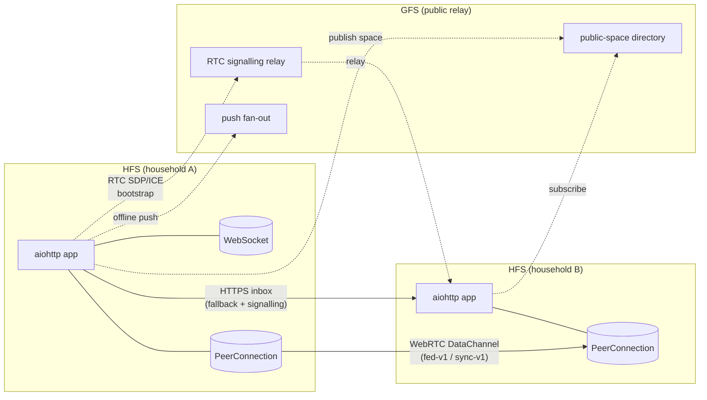
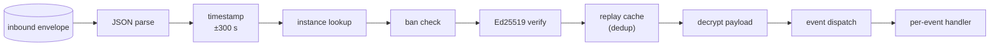

# Social Home — Federation Protocol

Social Home is a federated social network. Every household runs a
**Household Federation Server (HFS)**; households talk to each other
directly, peer-to-peer. A **Global Federation Server (GFS)** is only
consulted for public-space discovery, push fan-out to offline peers,
and WebRTC signalling bootstrap — it never sees private content.

> **Higher-level system shape** — identity, three-tier sync, space
> crypto, resilience — lives in [`../architecture.md`](../architecture.md).
> This page is the wire-level protocol reference. Start with
> `architecture.md` if you want the "how does it all fit together?"
> picture; come here for envelope shapes and per-feature flows.

## Architecture

## Envelope & validation pipeline

Every federation event is an **envelope** — a signed, AES-256-GCM-
encrypted JSON payload. All inbound envelopes, whether they arrive over
HTTPS inbox or over a WebRTC DataChannel, flow through the same
validation pipeline (§24.11):

Each step is an independently-testable async callable composed via
`InboundPipeline` (`federation/inbound_validator.py`). New validation
steps are appended to the chain — `handle_inbound_envelope` is not
edited. The same chain runs for RTC-delivered envelopes.

## Transports

| Transport | When it's used |
|---|---|
| **WebRTC DataChannel** (`fed-v1`) | Primary: routine envelopes once the peer-to-peer channel is up. |
| **WebRTC DataChannel** (`sync-v1`) | Bulk content sync chunks. Distinct label from `fed-v1` so routine + sync traffic don't interfere. |
| **HTTPS inbox** | Fallback: before the DataChannel is negotiated, when it's closed or failing, and for peers behind a blocked UDP path. |

## Encryption-first rule (§25.8.21)

Every field in every outgoing federation event is encrypted unless the
federation service needs it in plaintext to route or validate the
event. Only routing metadata (`event_type`, `from_instance`,
`to_instance`, `space_id`, `epoch`) stays plaintext; everything else
— content, names, counts, choices — is inside the encrypted payload.

If `SpaceContentEncryption` isn't configured, the outbound path raises
`RuntimeError`. There is no plaintext fallback.

## Feature pages

- **Handshake**
  - [Pairing](./pairing.md) — one-time QR-based identity + session key exchange.
- **Spaces**
  - [Spaces](./spaces.md) — create/dissolve, membership events, per-space key exchange.
  - [Invites](./invites.md) — cross-household invites and join requests.
  - [Sync](./sync.md) — initial bulk content sync (Tier 2/3).
  - [Discovery](./discovery.md) — GFS-brokered public-space directory.
- **Content**
  - [Feeds](./feeds.md) — posts, comments, reactions.
  - [Pages](./pages.md) — space pages (wiki-style, lock-protected).
  - [Tasks](./tasks.md) — task lists and tasks.
  - [Calendar](./calendar.md) — calendar events and RSVPs.
- **Realtime**
  - [Direct messages](./dm.md) — 1:1 and group conversations.
  - [Presence](./presence.md) — online/away/home + truncated location.
  - [Calls](./calls.md) — WebRTC voice/video signalling.
- **Relay**
  - [Push & RTC relay](./push-relay.md) — GFS-mediated push fan-out and RTC signalling bootstrap.

## Conventions

Each feature page uses this shape:

1. **Summary** — one paragraph on what the feature does.
2. **Scope** — HFS role and GFS role in one line each.
3. **Event types** — the `FederationEventType` values that belong to
   this feature (defined in `socialhome/domain/federation.py`).
4. **Flow** — a Mermaid sequence diagram of the happy path.
5. **Implementation** — pointers into `socialhome/` for the services,
   repos, routes, and inbound handlers.
6. **Spec references** — "§NN" section numbers in `spec_work.md`.
