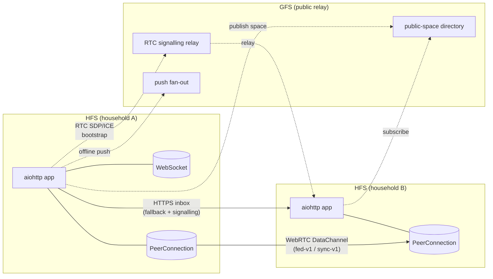
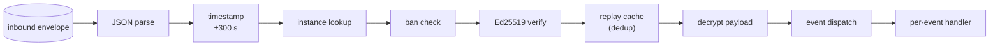

# Social Home — Federation Protocol

Social Home is a federated social network. Every household runs a
**Household Federation Server (HFS)**; households talk to each other
directly, peer-to-peer. A **Global Federation Server (GFS)** is only
consulted for public-space discovery, push fan-out to offline peers,
and WebRTC signalling bootstrap — it never sees private content.

> **Higher-level system shape** — identity, three-tier sync, space
> crypto, resilience — lives in [`../architecture.md`](../architecture.md).
> This page is the wire-level protocol reference. Start with
> `architecture.md` if you want the "how does it all fit together?"
> picture; come here for envelope shapes and per-feature flows.

## Architecture

```mermaid
flowchart LR
    subgraph HFS_A["HFS (household A)"]
        A_app["aiohttp app"]
        A_ws[("WebSocket")]
        A_pc[("PeerConnection")]
        A_app --- A_ws
        A_app --- A_pc
    end
    subgraph HFS_B["HFS (household B)"]
        B_app["aiohttp app"]
        B_pc[("PeerConnection")]
        B_app --- B_pc
    end
    subgraph GFS["GFS (public relay)"]
        G_dir["public-space directory"]
        G_rtc["RTC signalling relay"]
        G_push["push fan-out"]
    end

    A_pc -- "WebRTC DataChannel<br/>(fed-v1 / sync-v1)" --> B_pc
    A_app -- "HTTPS inbox<br/>(fallback + signalling)" --> B_app

    A_app -. "publish space" .-> G_dir
    B_app -. "subscribe" .-> G_dir
    A_app -. "RTC SDP/ICE<br/>bootstrap" .-> G_rtc
    G_rtc -. "relay" .-> B_app
    A_app -. "offline push" .-> G_push
```

## Envelope & validation pipeline

Every federation event is an **envelope** — a signed, AES-256-GCM-
encrypted JSON payload. All inbound envelopes, whether they arrive over
HTTPS inbox or over a WebRTC DataChannel, flow through the same
validation pipeline (§24.11):

```mermaid
flowchart LR
    inbound[("inbound envelope")]
    inbound --> parse["JSON parse"]
    parse --> ts["timestamp<br/>±300 s"]
    ts --> instance["instance lookup"]
    instance --> ban["ban check"]
    ban --> sig["Ed25519 verify"]
    sig --> replay["replay cache<br/>(dedup)"]
    replay --> decrypt["decrypt payload"]
    decrypt --> dispatch["event dispatch"]
    dispatch --> handler["per-event handler"]
```

Each step is an independently-testable async callable composed via
`InboundPipeline` (`federation/inbound_validator.py`). New validation
steps are appended to the chain — `handle_inbound_envelope` is not
edited. The same chain runs for RTC-delivered envelopes.

**A gate that drops a valid envelope answers like a dispatch.** The
post-signature gates (idempotent duplicate, space ban, deprovisioned author,
archived space, reader / non-member write, write held for a seat) all
short-circuit through `inbound_validator.drop()`, which answers the one
body `{"status": "ok"}` — the same a dispatched envelope gets. A distinct
reason (or a `403` for a ban) would let any signed sender, member or not,
learn whether a space exists, is hosted here, is archived or has banned it.
The reason is kept server-side (`InboundContext.drop_reason` and the gate's
log line). Over the DataChannel and the GFS relay the answer is not sent
back at all.

The signature step **also binds `from_instance` to the verified signing
identity**: an envelope whose `from_instance` claim does not match the
instance whose public key passed verification is rejected with
`Invalid envelope signature`. Without this binding, peer A holding a
valid signing key could spoof messages from peer B and downstream the
ban check, replay cache, and event dispatch would consume the
unauthenticated claim.

## Transports

| Transport | When it's used |
|---|---|
| **WebRTC DataChannel** (`fed-v1`) | Primary: routine envelopes once the peer-to-peer channel is up. |
| **WebRTC DataChannel** (`sync-v1`) | Bulk content sync chunks. Distinct label from `fed-v1` so routine + sync traffic don't interfere. |
| **WebRTC DataChannel** (`fed-media-v1`) | Binary media chunks (DM + space) — capability v14. No base64. |
| **WebRTC DataChannel** (`fed-app-v1`) | Binary app messages (chess moves, whiteboard ops, mini-app payloads) — capability v17. 1 MiB payload cap; JSON `APP_MESSAGE` fallback for sub-v17 peers. |
| **HTTPS inbox** | Fallback: before the DataChannel is negotiated, when it's closed or failing, and for peers behind a blocked UDP path. |

## Encryption-first rule (§25.8.21)

Every field in every outgoing federation event is encrypted unless the
federation service needs it in plaintext to route or validate the
event. Only routing metadata (`event_type`, `from_instance`,
`to_instance`, `space_id`, `epoch`) stays plaintext; everything else
— content, names, counts, choices — is inside the encrypted payload.

If `SpaceContentEncryption` isn't configured, the outbound path raises
`RuntimeError`. There is no plaintext fallback.

## Feature pages

- **Handshake**
  - [Pairing](./pairing.md) — one-time QR-based identity + session key exchange.
  - [GFS relay for paired households](./gfs-relay.md) — last-resort relay through a connection server two paired households both use, and the probe / ack that finds those shared servers without either side naming one (`GFS_RELAY_PROBE` / `GFS_RELAY_PROBE_ACK`, capability v_53).
  - [Capabilities](./capabilities.md) — monotonic `proto_version` exchange so senders can gate optional fields on what the receiving peer's build actually understands.
  - [Independent user identity](./user-identity.md) — per-user Ed25519 key + dual-signed binding carried on `USERS_SYNC` / `USER_UPDATED` (Phase 1, capability v_25); behaviour-neutral, legacy `user_id` stays canonical.
  - [Move-out](./move-out.md) — signed link redirecting `old_id@old_home` → `new_id@new_home` for a person who left a household (`USER_MOVED` push + `USER_IDENTITY_RESOLVE` pull backstop, capability v_27); `user_id` stays household-scoped, dual consent to accept.
  - [Home location](./home-location.md) — household GPS coordinates broadcast to peers for the Connections Map view (`LOCAL_HOME_LOCATION_CHANGED`, capability v5).
- **Spaces**
  - [Spaces](./spaces.md) — create/dissolve, membership events, per-space key exchange.
  - [Invites](./invites.md) — cross-household invites and join requests.
  - [Sync](./sync.md) — initial bulk content sync (Tier 2/3).
  - [Discovery](./discovery.md) — GFS-brokered public-space directory.
- **Content**
  - [Feeds](./feeds.md) — posts, comments, reactions.
  - [Pages](./pages.md) — space pages (wiki-style; host-sequenced — the host merges or keeps conflicting edits, v_48).
  - [Tasks](./tasks.md) — task lists and tasks.
  - [Calendar](./calendar.md) — calendar events and RSVPs.
  - [Space chat](./space-chat.md) — the chat next to a space's feed: the space's writers only (never a follower-only household), owner-bound message ids, every field but the routing ones encrypted, text + replies + mentions in v1, recent messages by catch-up (`SPACE_CHAT_*`, capability v_55).
  - [Space timetables](./timetables.md) — admin-maintained shared timetables (a class *Stundenplan*), one upserted aggregate per timetable, member households only (capability v_39).
  - [Federated moderation](./moderation.md) — "Reviewed" across households: pending items go only to the host and the admin / moderator households, any of them approves, the approved content federates as the submitter's with an approval block (capability v_43). Space reports (`SPACE_REPORT`, `SPACE_REPORT_DECIDED`, v_45) go the same way: host + admin / moderator households only, triaged by the space's content authority, decisions synced.
- **Realtime**
  - [Direct messages](./dm.md) — 1:1 and group conversations.
  - [DM media — pictures, videos, files](./dm-media.md) — `image` / `video` / `file` attachments, preview-now-sync-later for cross-household.
  - [Media transport — the binary `fed-media-v1` channel](./media.md) — second DataChannel carrying DM + space media chunks as binary frames (no base64), capability v14.
  - [Presence](./presence.md) — online/away/home + truncated location.
  - [Calls](./calls.md) — WebRTC voice/video signalling.
  - [Highlights](./highlights.md) — per-author per-day frame bag with author-controlled retention and audience.
  - [Highlights — public sharing](./highlights_public.md) — GFS-brokered public URL for a single highlight; data flows author → viewer over WebRTC, GFS holds zero highlight data.
  - [Momentum](./momentum.md) — short-lived household-broadcast posts with 3-hop relay.
  - [Momentum — public sharing](./momentum_public.md) — GFS-brokered follow graph for public moment fan-out beyond the household mesh; recipients dedupe with the household relay path.
- **Apps**
  - [Social Home Apps](./apps.md) — cross-household app-to-app federation via a dedicated `fed-app-v1` binary DataChannel (v_17) with JSON event fallback; AES-256-GCM sealed payloads delivered as `app.message` WS frames.
- **Relay**
  - [Push & RTC relay](./push-relay.md) — GFS-mediated push fan-out and RTC signalling bootstrap.

## Conventions

Each feature page uses this shape:

1. **Summary** — one paragraph on what the feature does.
2. **Scope** — HFS role and GFS role in one line each.
3. **Event types** — the `FederationEventType` values that belong to
   this feature (defined in `socialhome/domain/federation.py`).
4. **Flow** — a Mermaid sequence diagram of the happy path.
5. **Implementation** — pointers into `socialhome/` for the services,
   repos, routes, and inbound handlers.
6. **Spec references** — "§NN" section numbers in `spec_work.md`.
