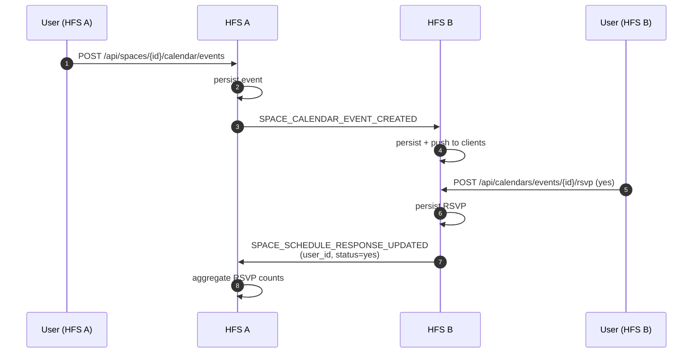

# Calendar

Calendar events inside a space — meetings, birthdays, shared
household events — plus per-user RSVPs that federate back.

## Scope

- **HFS**: both sides. Creates events, federates edits, records
  RSVPs.
- **GFS**: uninvolved.

## Event types

`SPACE_CALENDAR_EVENT_CREATED`, `SPACE_CALENDAR_EVENT_UPDATED`,
`SPACE_CALENDAR_EVENT_DELETED`,
`SPACE_SCHEDULE_RESPONSE_UPDATED` (RSVP).

## Flow — create event + RSVP

## iCal interop

`POST /api/calendars/{id}/import_ics` parses an iCal file and creates
one event per `VEVENT`. Each resulting event federates individually
— there is no iCal-level federation envelope.

Export works the same way:
`GET /api/calendar/{calendar_id}/export.ics` emits the caller's view
of the calendar, including federated events from remote HFS instances
the caller is peered with.

## Recurring events

Events carry an optional RRULE. The authoritative event row lives on
the host HFS; when a user RSVPs to a single occurrence of a recurring
event, the RSVP carries an `occurrence_date` so the host can store
per-occurrence responses without duplicating the event.

## AI-assisted import

`import_image` and `import_prompt` endpoints call an LLM to extract
event data from an uploaded poster or a free-text prompt. The
resulting events are created via the same code path as manual events,
so they federate identically.

## Implementation

- `socialhome/services/calendar_service.py`,
  `schedule_poll_service.py`.
- `socialhome/services/federation_inbound/space_content.py` —
  `SPACE_CALENDAR_EVENT_*` and `SPACE_SCHEDULE_RESPONSE_UPDATED`.
- `socialhome/repositories/calendar_repo.py`.
- `socialhome/routes/calendar_routes.py`.

## Spec references

§13.8 (space calendar),
§13.8.5 (RSVPs),
§23.56 (AI-assisted imports).
