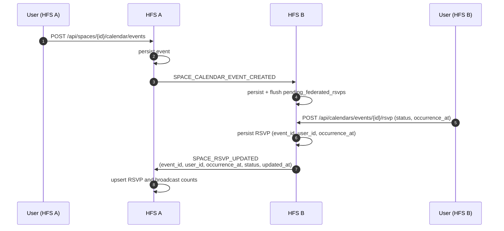

# Calendar

Calendar events inside a space — meetings, birthdays, shared
household events — plus per-user RSVPs that federate back.

## Scope

- **HFS**: both sides. Creates events, federates edits, records
  RSVPs.
- **GFS**: uninvolved.

## Event types

`SPACE_CALENDAR_EVENT_CREATED`, `SPACE_CALENDAR_EVENT_UPDATED`,
`SPACE_CALENDAR_EVENT_DELETED`, `SPACE_RSVP_UPDATED`,
`SPACE_RSVP_DELETED`.

`SPACE_SCHEDULE_RESPONSE_UPDATED` is unrelated — it's for schedule-poll
votes (Doodle-style availability), not calendar event RSVPs.

## Flow — create event + RSVP

## RSVP propagation

`SPACE_RSVP_UPDATED` carries `{event_id, user_id, occurrence_at,
status, updated_at}` in the encrypted payload (routing fields stay
plaintext per §25.8.21). The receiver's inbound handler tries to
`upsert_rsvp` directly; if the event hasn't propagated yet (FK miss
on `event_id`), the RSVP is buffered in `pending_federated_rsvps` and
flushed when the event lands. `SPACE_RSVP_DELETED` follows the same
shape and buffers as `status="removed"` so an out-of-order delete is
honoured at flush time rather than resurrected.

The buffer is bounded by a periodic GC sweep that drops rows older
than 24 h whose event still hasn't arrived (e.g. cancelled upstream).

## Feed surface (Phase B)

A calendar event auto-creates a `PostType.EVENT` post in the space feed
via :class:`CalendarFeedBridge`. The bridge subscribes to
`CalendarEventCreated` / `CalendarEventUpdated` /
`CalendarEventDeleted` on the bus and:

* **Created**: writes a single `Post(type=EVENT, linked_event_id=<id>,
  content=
)`. Idempotent — duplicate creates (e.g. local +
  federation replay) are no-ops.
* **Updated**: rewrites the post body when the title changes (otherwise
  no-op).
* **Deleted**: soft-deletes the linked post; the row + comment thread
  remain readable as history.

Recurring events get **one** post per series, not per occurrence — the
feed card is the entry point and members RSVP per occurrence via the
existing endpoint.

`space_posts.linked_event_id` is a plain TEXT column with a partial
index (`idx_space_posts_linked_event`); no FK because an `ON DELETE SET
NULL` cascade would race the bridge's own soft-delete handler.

## iCal interop

`POST /api/calendars/{id}/import_ics` parses an iCal file and creates
one event per `VEVENT`. Each resulting event federates individually
— there is no iCal-level federation envelope.

Export works the same way:
`GET /api/calendar/{calendar_id}/export.ics` emits the caller's view
of the calendar, including federated events from remote HFS instances
the caller is peered with.

## Recurring events

Events carry an optional RRULE. The authoritative event row lives on
the host HFS; when a user RSVPs to a single occurrence of a recurring
event, the RSVP carries an `occurrence_at` (UTC ISO-8601) and the
service stores one row per `(event_id, user_id, occurrence_at)` —
each instance has its own response. For non-recurring events,
`occurrence_at` defaults to `event.start`. Recurring-event RSVPs
without `occurrence_at` are rejected at the service layer; the
frontend always sends one (defaulting to the next-upcoming
occurrence).

## AI-assisted import

`import_image` and `import_prompt` endpoints call an LLM to extract
event data from an uploaded poster or a free-text prompt. The
resulting events are created via the same code path as manual events,
so they federate identically.

## Implementation

- `socialhome/services/calendar_service.py`,
  `schedule_poll_service.py`.
- `socialhome/services/federation_inbound/space_content.py` —
  `SPACE_CALENDAR_EVENT_*` and `SPACE_SCHEDULE_RESPONSE_UPDATED`.
- `socialhome/repositories/calendar_repo.py`.
- `socialhome/routes/calendar_routes.py`.

## Spec references

§13.8 (space calendar),
§13.8.5 (RSVPs),
§23.56 (AI-assisted imports).
