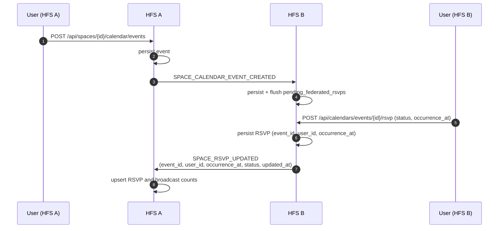
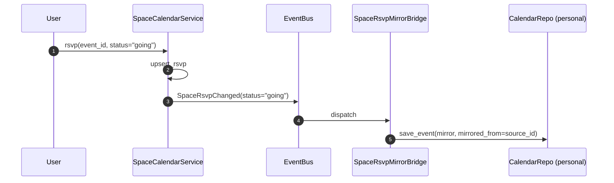
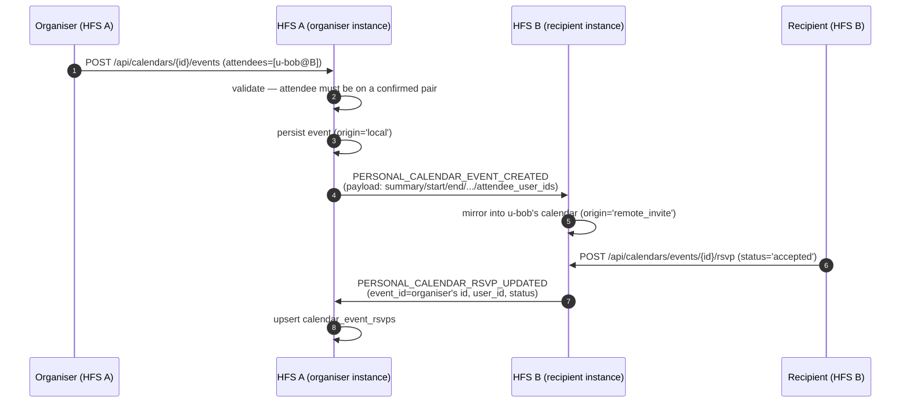

# Calendar

Calendar events inside a space — meetings, birthdays, shared
household events — plus per-user RSVPs that federate back.

## Scope

- **HFS**: both sides. Creates events, federates edits, records
  RSVPs.
- **GFS**: uninvolved.

## Event types

Space-scoped:
`SPACE_CALENDAR_EVENT_CREATED`, `SPACE_CALENDAR_EVENT_UPDATED`,
`SPACE_CALENDAR_EVENT_DELETED`, `SPACE_RSVP_UPDATED`,
`SPACE_RSVP_DELETED`.

Personal-calendar (cross-household invites — §23.60):
`PERSONAL_CALENDAR_EVENT_CREATED`,
`PERSONAL_CALENDAR_EVENT_UPDATED`,
`PERSONAL_CALENDAR_EVENT_DELETED`,
`PERSONAL_CALENDAR_RSVP_UPDATED`,
`PERSONAL_CALENDAR_RSVP_DELETED`.

`SPACE_SCHEDULE_RESPONSE_UPDATED` is unrelated — it's for schedule-poll
votes (Doodle-style availability), not calendar event RSVPs.

## Flow — create event + RSVP

```mermaid
sequenceDiagram
    autonumber
    participant U as User (HFS A)
    participant A as HFS A
    participant B as HFS B
    participant V as User (HFS B)
    U->>A: POST /api/spaces/{id}/calendar/events
    A->>A: persist event
    A->>B: SPACE_CALENDAR_EVENT_CREATED
    B->>B: persist + flush pending_federated_rsvps
    V->>B: POST /api/calendars/events/{id}/rsvp (status, occurrence_at)
    B->>B: persist RSVP (event_id, user_id, occurrence_at)
    B->>A: SPACE_RSVP_UPDATED<br/>(event_id, user_id, occurrence_at, status, updated_at)
    A->>A: upsert RSVP and broadcast counts
```

## Creator-bound event ids (v_36)

A new space event's id is **owner-bound** to its `created_by` and space
(`federation/owner_bound_id.py`, kind `space-calendar-event`), so only the
creator's household can announce it: `SPACE_CALENDAR_EVENT_CREATED` /
`_UPDATED` for an event not held yet, and the §25.6 sync receiver, refuse
(WARNING) a bound id claimed for anybody else or for another space. A host
relay or resume replay stays valid; an edit keeps the stored attribution;
a legacy (uuid4) id keeps the first-come rule. See
[`spaces.md`](./spaces.md) and the v_36 row in
[`capabilities.md`](./capabilities.md).

## RSVP propagation

`SPACE_RSVP_UPDATED` carries `{event_id, user_id, occurrence_at,
status, updated_at}` in the encrypted payload (routing fields stay
plaintext per §25.8.21). The receiver's inbound handler tries to
`upsert_rsvp` directly; if the event hasn't propagated yet (FK miss
on `event_id`), the RSVP is buffered in `pending_federated_rsvps` and
flushed when the event lands. `SPACE_RSVP_DELETED` follows the same
shape and buffers as `status="removed"` so an out-of-order delete is
honoured at flush time rather than resurrected.

The buffer is bounded by a periodic GC sweep that drops rows older
than 24 h whose event still hasn't arrived (e.g. cancelled upstream).

### Personal-calendar RSVPs answer one invite

`PERSONAL_CALENDAR_RSVP_UPDATED` / `_DELETED` flow from an invitee's
household back to the organiser's, carrying the organiser's local
`event_id` and the responding `user_id`. The organiser applies one only
when all of these hold, and otherwise drops it with a WARNING:

- the event exists here and was organised here (never an inbound
  `origin='remote_invite'` mirror — replies flow organiser-ward only);
- `user_id` is on the event's `attendees` — the list the invite was
  fanned out from, so the event was actually shared with that user's
  household;
- `user_id`'s home household (`remote_users.instance_id`) is the
  envelope's `from_instance` — so a household never answers for a local
  member or for another household's invitee.

No extra table records the invitation: the attendee list plus each
remote user's home instance already prove it
(`PersonalCalendarInboundHandlers._authorised_rsvp_event`;
`tests/protocol/test_personal_calendar_rsvp_scope.py`).

## Feed surface (Phase B) — opt-in (§23.15)

A calendar event can mirror to the space feed as a `PostType.EVENT` post
via :class:`CalendarFeedBridge`, but the mirror is **opt-in**: events live
in the Calendar tab and only post to the feed when the creator ticks
"announce in feed" (`CalendarEvent.announce_in_feed`, default False —
matching the Bazaar tab). The flag federates on the calendar event so a
member household's bridge makes the same decision; **absent on an older
sender it defaults to True** (the historic always-mirror behaviour), so
events from un-upgraded peers still surface in the feed. The bridge
subscribes to `CalendarEventCreated` / `CalendarEventUpdated` /
`CalendarEventDeleted` on the bus and:

* **Created**: when `announce_in_feed` is True, writes a single
  `Post(type=EVENT, linked_event_id=<id>, content=
)`. Idempotent
  — duplicate creates (e.g. local + federation replay) are no-ops. When
  False, no post is written.
* **Updated**: rewrites the post body when the title changes (otherwise
  no-op).
* **Deleted**: soft-deletes the linked post; the row + comment thread
  remain readable as history.

Recurring events get **one** post per series, not per occurrence — the
feed card is the entry point and members RSVP per occurrence via the
existing endpoint.

`space_posts.linked_event_id` is a plain TEXT column with a partial
index (`idx_space_posts_linked_event`); no FK because an `ON DELETE SET
NULL` cascade would race the bridge's own soft-delete handler.

## iCal export (Phase F)

Members can subscribe to a space calendar in their native calendar
app via `GET /api/spaces/{id}/calendar/export.ics?token=<feed-token>`.
The token is per-(user, space), revocable, and the only credential
the URL carries — the auth middleware is configured with a public
path pattern matching `/api/spaces/[^/]+/calendar/export.ics$` so
desktop calendar clients can refresh without OAuth.

The serializer (`socialhome/serialization/ics.py`) emits RFC 5545
VCALENDAR with VEVENT (UID = event_id, DTSTART/DTEND, SUMMARY,
DESCRIPTION, RRULE pass-through) and VALARM blocks populated from
the caller's `space_calendar_rsvp_reminders` rows. ATTENDEE lines are
deliberately omitted — leaking handles to third-party calendar apps
crosses a privacy line. RSVPs stay in-app.

Per-event download — `GET /api/calendars/events/{id}/export.ics` —
is member-only via the standard auth flow (no token in URL).

Conditional GET via strong ETag (`sha256` of body, truncated). Apple
Calendar / Google Calendar honour the `Cache-Control: max-age=900`
header and skip refetches within the window.

## iCal interop

`POST /api/calendars/{id}/import_ics` parses an iCal file and creates
one event per `VEVENT`. Each resulting event federates individually
— there is no iCal-level federation envelope.

Re-importing is idempotent per `VEVENT`: the importer derives the
event's `client_event_uuid` as `uuid5(namespace, UID + "\x1f" +
RECURRENCE-ID)` (32 lowercase hex; `calendar_import_service.ics_import_key`),
so the same `UID` lands on the existing row through the normal
create-as-update path (`ux_calendar_events_fanout`) and federates as
`PERSONAL_CALENDAR_EVENT_UPDATED` rather than a second
`PERSONAL_CALENDAR_EVENT_CREATED` (attendees, RSVP toggle and cover
set in the app are kept, so invitees keep receiving the update).
`RECURRENCE-ID` is part of the key so
a series and its per-occurrence overrides stay separate rows. A `VEVENT`
without a `UID` keeps the always-insert behaviour, and events removed
from the file are not deleted (import is not a sync). Events imported
before this key existed have none, so their first re-import adds one
more copy; after that it converges.

Export works the same way:
`GET /api/calendar/{calendar_id}/export.ics` emits the caller's view
of the calendar, including federated events from remote HFS instances
the caller is peered with.

## Capacity, request-to-join and waitlist (Phase C)

`space_calendar_events.capacity` is an optional per-occurrence cap.

* **NULL** — open RSVP, the original three-state flow (going / maybe /
  declined). No host approval involved.
* **INTEGER >= 0** — capped event. A member's "going" RSVP becomes
  `requested` (pending host approval). On approval, the row is promoted
  to `going` if a seat is free, otherwise to `waitlist`. Declined / removed
  "going" RSVPs auto-promote the oldest `waitlist` row. Raising the
  capacity (`update_event`) also drains the waitlist.

The event creator is auto-RSVP'd as `going` for the first occurrence at
create time, even on a capped event — they're implicitly attending and
shouldn't have to approve themselves.

The approver gate is **event creator OR space admin/owner**, enforced
in the route layer (`POST /api/calendars/events/{id}/approve`). The
service layer does not own a "who can approve" check because it would
need a circular dependency on `SpaceService`.

`maybe` never counts toward capacity — it's an "interested but not
committed" signal.

## Reminders + cancellation/update push (Phase D)

`space_calendar_rsvp_reminders` stores per-(event, user, occurrence,
offset) reminders. `SpaceCalendarReminderScheduler` polls fire_at on a
30 s cadence and emits `EventReminderDue` events; the notification
service translates each into a push + an in-app row.

`CalendarEventDeleted` snapshots the cohort of "still-attending"
RSVPs (`going` / `waitlist` / `requested`) before the FK CASCADE wipes
them. The notification service uses that snapshot to push "Event
cancelled: …" to affected members.

`CalendarEventUpdated` carries `material_changes` — a tuple of field
names that changed (`summary`, `start`, `end`, or `capacity_down`).
The push handler skips cosmetic-only updates (description, attendees,
rrule, all_day, capacity_up) so members don't get notification spam
from incidental edits.

## Personal-calendar mirror for "going" RSVPs

Accepting "going" on a space calendar event drops a mirror onto the
member's personal calendar so their own calendar reads as a single
view of "everything I'm committed to" — household events plus space
commitments — without flipping back to the space surface to check.
Switching the RSVP back to maybe / declined / waitlist (or removing
it entirely) drops the mirror; deleting the source event drops every
mirror; editing the source flows through to every mirror.

```mermaid
sequenceDiagram
    autonumber
    participant U as User
    participant S as SpaceCalendarService
    participant Bus as EventBus
    participant Bridge as SpaceRsvpMirrorBridge
    participant Cal as CalendarRepo (personal)
    U->>S: rsvp(event_id, status="going")
    S->>S: upsert_rsvp
    S->>Bus: SpaceRsvpChanged(status="going")
    Bus->>Bridge: dispatch
    Bridge->>Cal: save_event(mirror, mirrored_from=source_id)
```

The mirror id is deterministic (`sm_<user>_<source>`), so a
re-delivered RSVP collapses onto the same row instead of duplicating.
``requested`` (capped-event request-to-join) also produces a mirror —
otherwise a member's pending request would be invisible on their own
calendar. ``waitlist`` does not.

Recurring events are mirrored as the seed row (rrule preserved) — v1
limitation: per-occurrence partial attendance isn't reflected on the
personal calendar, the list expansion shows the whole series. The
authoritative per-occurrence RSVP state stays on the space side.

Local-only — the mirror exists on the RSVP-er's home instance.
Remote users RSVPing on our hosted spaces do NOT get a mirror written
locally; their own instance handles the mirror when it processes the
matching `SPACE_RSVP_UPDATED`.

Implementation: `socialhome/services/space_rsvp_mirror_bridge.py` —
subscribes to `SpaceRsvpChanged`, `CalendarEventUpdated`,
`CalendarEventDeleted` on the in-process event bus.

## Recurring events

Events carry an optional RRULE. The authoritative event row lives on
the host HFS; when a user RSVPs to a single occurrence of a recurring
event, the RSVP carries an `occurrence_at` (UTC ISO-8601) and the
service stores one row per `(event_id, user_id, occurrence_at)` —
each instance has its own response. For non-recurring events,
`occurrence_at` defaults to `event.start`. Recurring-event RSVPs
without `occurrence_at` are rejected at the service layer; the
frontend always sends one (defaulting to the next-upcoming
occurrence).

## Deleting a space event

A space event delete — local, or a live `SPACE_CALENDAR_EVENT_DELETED` —
keeps the row as a tombstone (migration 0085): `deleted_at` /
`deleted_by` (the deleter, or the approver of a reviewed delete) set,
summary / times / description / location / cover blanked. Its RSVPs and
RSVP reminders go with it (trigger), and the feed bridge removes the
announcement post. A recurring event is one row, so the tombstone covers
the whole series; RSVPs are per occurrence and all go. No read returns a
tombstone and no create, update, RSVP or sync record brings the id back.

A household that missed the delete learns it from the §25.6
`calendar_deleted` resource (`{id, created_by, created_at,
actor_user_id}` — never content), applied under the live delete rule: a
writer household, the space's `calendar` level for the actor. Only the
host's stream stubs an event never held here, and only for an id
owner-bound to its `created_by` in this space. See
[`sync.md`](./sync.md#sticky-calendar-event-gallery-and-zone-tombstones).

## AI-assisted import

`import_image` and `import_prompt` endpoints call an LLM to extract
event data from an uploaded poster or a free-text prompt. The
resulting events are created via the same code path as manual events,
so they federate identically.

## Personal calendar invites (§23.60)

Personal calendars are per-household-member. Events authored on a
member's calendar stay local unless the organiser invites a
**cross-household** friend — i.e. a member of a confirmed paired
peer instance. Local household members never appear in the invite
picker; coordinating with a household member is done by switching
the dialog's "Add to calendar" target to that member's personal
calendar (any active household member may write to any other
member's personal calendar — the household is the unit of trust).

```mermaid
sequenceDiagram
    autonumber
    participant U as Organiser (HFS A)
    participant A as HFS A (organiser instance)
    participant B as HFS B (recipient instance)
    participant V as Recipient (HFS B)
    U->>A: POST /api/calendars/{id}/events (attendees=[u-bob@B])
    A->>A: validate — attendee must be on a confirmed pair
    A->>A: persist event (origin='local')
    A->>B: PERSONAL_CALENDAR_EVENT_CREATED<br/>(payload: summary/start/end/.../attendee_user_ids)
    B->>B: mirror into u-bob's calendar (origin='remote_invite')
    V->>B: POST /api/calendars/events/{id}/rsvp (status='accepted')
    B->>A: PERSONAL_CALENDAR_RSVP_UPDATED<br/>(event_id=organiser's id, user_id, status)
    A->>A: upsert calendar_event_rsvps
```

Inbound mirrors materialise as `calendar_events` rows with:
- `origin = 'remote_invite'` (default is `'local'`)
- `remote_event_id` = the organiser's local id (for RSVP routing back)
- `remote_instance_id` = the organiser's instance id

Row id is deterministic — `_mint_event_id(remote_instance,
remote_event, recipient_user_id)` — so a redelivered envelope
collapses onto the same row.

#### Receiver rules

`PERSONAL_CALENDAR_EVENT_CREATED` / `_UPDATED` / `_DELETED` may touch
only the sending household's own mirror of its own event. The row id is
a truncated derivation, so it is a lookup key, never proof of
ownership — the stored row's provenance is. The receiver drops the
event (or that recipient's part of it) with a WARNING when:

- `organizer_user_id`'s home household is not the envelope's
  `from_instance` — a local member, a third household's user, or an id
  this household doesn't know. Honest senders always publish their own
  local author (`event.created_by`), known here via `USERS_SYNC` /
  `USER_UPDATED`; an author hidden from this household by the sender's
  per-peer visibility list is therefore unknown and their invite is
  dropped (fail closed);
- a row already exists at the derived id but is not a
  `origin='remote_invite'` mirror with `remote_instance_id =
  from_instance` and `remote_event_id` = the payload's `event_id`
  (a local event, another household's mirror, or a mirror of a
  different remote event) — for create, update and delete alike;
- on create/update, that existing mirror is not on one of the
  recipient's own personal calendars.

Only local users get a mirror (and the default `tentative` RSVP): an
attendee id that isn't in this household's `users` table — the
sender's own users, a third household's users, unknown ids — produces
no row. The attendee-less delete fallback looks the mirror up by
`(from_instance, remote_event_id)`, so it is bound by construction
(`PersonalCalendarInboundHandlers._foreign_row_reason`;
`tests/protocol/test_personal_calendar_event_scope.py`).

A shared household event is fanned out as one `POST` per picked
calendar, every row carrying the same client-minted
`client_event_uuid`. Since migration `0047` that pair is unique per
calendar (`ux_calendar_events_fanout`), so a **re-POST** of an
existing `(calendar_id, client_event_uuid)` resolves to an update of
the stored row rather than a second copy — and therefore emits
`PERSONAL_CALENDAR_EVENT_UPDATED` where it previously emitted
`PERSONAL_CALENDAR_EVENT_CREATED`. No wire shape changed and no
capability bump is needed: `PersonalCalendarInboundHandlers.attach_to`
registers the same handler for both event types and upserts on the
deterministic row id above, so a peer that never saw the original
create still materialises the mirror from the update.

Validation rejects local user_ids (422 — household members
coordinate via the calendar selector, not the invite picker), unknown
user_ids, and remote user_ids whose home instance isn't a confirmed
pair.

### Covers from other households

A received event's `cover_url` (space events and personal-calendar
invites) is kept only when it is a local media reference
(`api/media/<name>`, verbatim); a third-party URL is stored as no cover,
so it never becomes an `` that leaks members' IPs.

## Implementation

- `socialhome/services/calendar_service.py`,
  `schedule_poll_service.py`.
- `socialhome/services/federation_inbound/space_content.py` —
  `SPACE_CALENDAR_EVENT_*` and `SPACE_SCHEDULE_RESPONSE_UPDATED`.
- `socialhome/services/federation_inbound/personal_calendar.py` —
  `PERSONAL_CALENDAR_EVENT_*` and `PERSONAL_CALENDAR_RSVP_*`.
- `socialhome/repositories/calendar_repo.py`.
- `socialhome/federation/sync/space/exporters/calendar_deleted.py` and
  `receiver.py` (`_persist_calendar_tombstones`) — the event tombstones.
- `socialhome/routes/calendar_routes.py`.

## Spec references

§13.8 (space calendar),
§13.8.5 (RSVPs),
§23.56 (AI-assisted imports).
