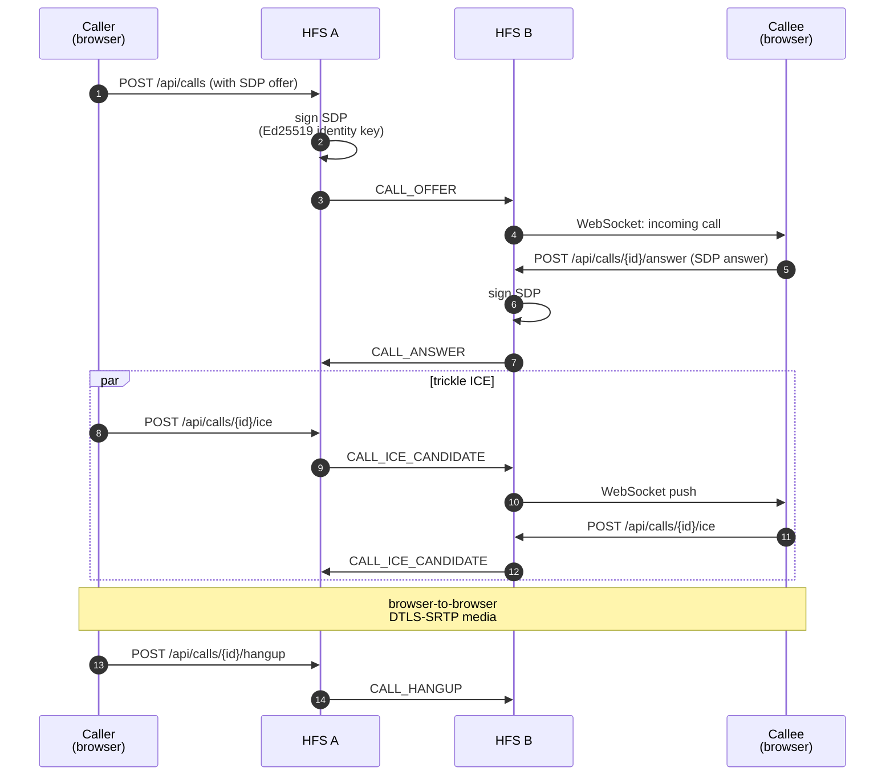

# Voice & Video Calls

WebRTC-based voice and video between users. The two HFS instances
relay SDP + ICE for signalling; the actual media (DTLS-SRTP) flows
browser-to-browser without ever touching the servers.

## Scope

- **HFS**: signalling relay. Signs and forwards SDP offer/answer and
  trickle ICE between the two callers' browsers.
- **GFS**: uninvolved in private calls. Only used when the two
  participants aren't peered — then GFS acts as an opaque relay
  identical to the pattern in [push-relay](./push-relay.md).

## Event types

`CALL_OFFER`, `CALL_ANSWER`, `CALL_DECLINE`, `CALL_BUSY`,
`CALL_HANGUP`, `CALL_END`, `CALL_ICE`, `CALL_ICE_CANDIDATE`,
`CALL_QUALITY`.

## Flow — direct (paired peers)

## SDP signature (§26.8)

The SDP offer and answer are signed by the sending HFS's Ed25519
identity key before federation. The receiving HFS verifies the
signature against the peer's pinned identity key before forwarding
to its user's browser. This blocks a compromised signalling relay
from injecting a modified SDP that redirects media to a third party.

## Missed calls

If the callee doesn't answer within 90 s the offerer sends
`CALL_HANGUP`; both sides record a `type=call_event` message in the
corresponding DM conversation so the user has a record of the missed
call.

## Call quality metrics

At hangup the offerer may emit `CALL_QUALITY` with RTT, jitter,
packet-loss, and codec summaries. The event is opt-in per-instance
(disabled by default) — quality metrics are otherwise private.

## Rate limiting

- `POST /api/calls` — 10/min (creation)
- `POST /api/calls/{id}/decline` — 10/min
- `POST /api/calls/{id}/hangup` — 30/min

These limits are per-user, enforced at the route layer.

## Implementation

- `socialhome/services/call_service.py`,
  `socialhome/federation/sdp_signing.py`.
- `socialhome/services/federation_inbound/calls.py` — inbound
  handlers.
- `socialhome/repositories/call_repo.py`.
- `socialhome/routes/call_routes.py`,
  `socialhome/routes/webrtc_routes.py` (ICE server config).

## Spec references

§26 (Voice & Video Calling),
§26.8 (SDP integrity verification),
§26.11 (rate limits).
