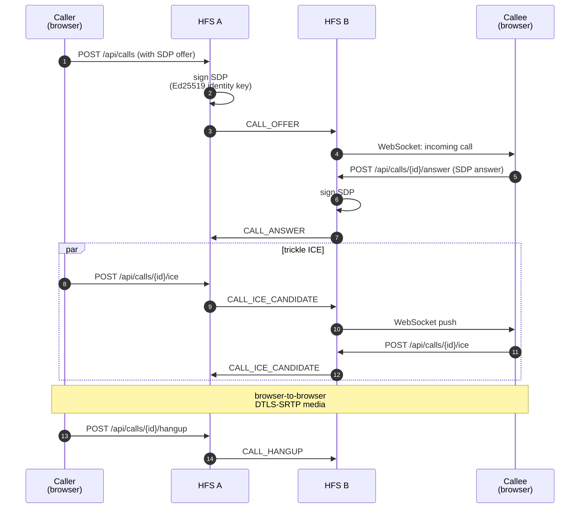

# Voice & Video Calls

WebRTC-based voice and video between users. The two HFS instances
relay SDP + ICE for signalling; the actual media (DTLS-SRTP) flows
browser-to-browser without ever touching the servers.

## Scope

- **HFS**: signalling relay. Signs and forwards SDP offer/answer and
  trickle ICE between the two callers' browsers.
- **GFS**: uninvolved in private calls. Only used when the two
  participants aren't peered — then GFS acts as an opaque relay
  identical to the pattern in [push-relay](./push-relay.md).

## Event types

`CALL_OFFER`, `CALL_ANSWER`, `CALL_DECLINE`, `CALL_BUSY`,
`CALL_HANGUP`, `CALL_END`, `CALL_ICE`, `CALL_ICE_CANDIDATE`,
`CALL_QUALITY`.

## Flow — direct (paired peers)

```mermaid
sequenceDiagram
    autonumber
    participant UC as Caller<br/>(browser)
    participant A as HFS A
    participant B as HFS B
    participant UB as Callee<br/>(browser)
    UC->>A: POST /api/calls (with SDP offer)
    A->>A: sign SDP<br/>(Ed25519 identity key)
    A->>B: CALL_OFFER
    B->>UB: WebSocket: incoming call
    UB->>B: POST /api/calls/{id}/answer (SDP answer)
    B->>B: sign SDP
    B->>A: CALL_ANSWER
    par trickle ICE
        UC->>A: POST /api/calls/{id}/ice
        A->>B: CALL_ICE_CANDIDATE
        B->>UB: WebSocket push
        UB->>B: POST /api/calls/{id}/ice
        B->>A: CALL_ICE_CANDIDATE
    end
    Note over UC,UB: browser-to-browser<br/>DTLS-SRTP media
    UC->>A: POST /api/calls/{id}/hangup
    A->>B: CALL_HANGUP
```

## Browser side

The SPA owns the only `RTCPeerConnection`
(`client/src/features/calls/callSession.ts`); the backend relays
whatever SDP / ICE the browsers produce and never touches media.

- **Caller** — `getUserMedia` (audio + camera, audio-only fallback when
  there is no camera; audio calls send the camera track disabled so it
  can be switched on without renegotiation) → `createOffer` /
  `setLocalDescription` → `POST /api/calls {sdp_offer}`. Local ICE
  candidates gathered before the `call_id` exists are held and flushed
  once the POST returns. `call.answered.signed_sdp.sdp` becomes the
  remote description.
- **Callee** — `call.ringing.signed_sdp.sdp` is the offer. On Accept:
  `getUserMedia` → `setRemoteDescription(offer)` → `createAnswer` /
  `setLocalDescription` → `POST /api/calls/{id}/answer {sdp_answer}`.
  Local candidates go out only after the answer is posted.
- **Trickle ICE** — `call.ice_candidate` frames are queued from the moment
  they land (the callee receives the caller's candidates while still
  ringing) and applied once a remote description exists.
- **STUN / TURN** — `GET /api/calls/ice-servers` (time-limited TURN
  credentials when `webrtc_turn_secret` is set).
- **Ending** — hangup / decline / `call.ended` / `call.declined` close the
  peer connection and stop the local tracks; an ICE/DTLS `failed` state
  fails the call and posts a hangup so the other side is released.

The security headers allow `camera=(self), microphone=(self)` in
`Permissions-Policy`; with `()` the browser rejects `getUserMedia` before
the user is even prompted.

## Callee-side state

Both households keep a `call_sessions` row next to the in-memory routing
record, and inbound events move it through the same states as local ones:

- `CALL_OFFER` persists the callee-side row (`ringing`). Every per-call
  route (`answer`, `ice`, `decline`, `hangup`) authorises against it and
  the stale-call sweep marks it missed. Because the offer is stored, it is
  only accepted for a call the household would accept from its own
  members: a known `call_type`, a caller hosted by the sending household
  (`remote_users`), a callee this household hosts, both in the named
  conversation, and at most `MAX_CALLS_PER_USER` ringing calls per callee.
  Anything else is dropped with a WARNING and never rings. A repeat
  `call_id` (a second local callee of a group call, or a `late_join`) is
  merged into the existing call — it can never reset one.
- `CALL_ANSWER` moves the caller-side row to `active` (otherwise the sweep
  would mark the live call missed after 90 s).
- `CALL_HANGUP` / `CALL_END` close the row as `ended` (with a duration);
  `CALL_DECLINE` / `CALL_BUSY` as `declined`.
- `CALL_ANSWER`, `CALL_ICE_CANDIDATE` and the terminal events are only
  accepted from a household that hosts one of the call's participants.
- Only the first answer wins: a second `POST /answer` gets 409, and the
  answerer's other devices receive `call.answered` so they stop ringing.

Group calls still share one offer across all callees and the browser holds
a single peer connection, so today only 1:1 calls connect reliably.

## SDP signature (§26.8)

The SDP offer and answer are signed by the sending HFS's Ed25519
identity key before federation. The receiving HFS verifies the
signature against the peer's pinned identity key before forwarding
to its user's browser. This blocks a compromised signalling relay
from injecting a modified SDP that redirects media to a third party.

## Missed calls

If the callee doesn't answer within 90 s the offerer sends
`CALL_HANGUP`; both sides record a `type=call_event` message in the
corresponding DM conversation so the user has a record of the missed
call.

## Call quality metrics

At hangup the offerer may emit `CALL_QUALITY` with RTT, jitter,
packet-loss, and codec summaries. The event is opt-in per-instance
(disabled by default) — quality metrics are otherwise private.

## Receiver rules

Every call signal names the participant it speaks for. The receiver
honours `CALL_HANGUP` / `CALL_END` / `CALL_DECLINE` / `CALL_BUSY`
(`hanger_user` / `decliner_user`), `CALL_ICE` / `CALL_ICE_CANDIDATE`
(`from_user`) and `CALL_QUALITY` (`reporter_user`) only when that user is
a participant of a call held here **and** homed on the sending household;
anything else is logged at WARNING and changes nothing. `CALL_OFFER`
binds the caller to the sender and the callee to the conversation.
`tests/protocol/test_call_signal_scope.py`.

## Rate limiting

- `POST /api/calls` — 10/min (creation)
- `POST /api/calls/{id}/decline` — 10/min
- `POST /api/calls/{id}/hangup` — 30/min

These limits are per-user, enforced at the route layer.

## Implementation

- `socialhome/services/call_service.py` — signalling relay, including
  `handle_federated_signal` (inbound `CALL_*`, registered by
  `FederationService.attach_call_signaling`);
  `socialhome/federation/sdp_signing.py`.
- `socialhome/repositories/call_repo.py`.
- `socialhome/routes/calls.py` — `/api/calls/*` routes and the ICE
  server config.
- `client/src/features/calls/callSession.ts` — browser WebRTC session;
  `client/src/store/calls.ts` — `call.*` WS frames;
  `client/src/features/calls/InCallPage.tsx` /
  `IncomingCallDialog.tsx` — UI.

## Spec references

§26 (Voice & Video Calling),
§26.8 (SDP integrity verification),
§26.11 (rate limits).
