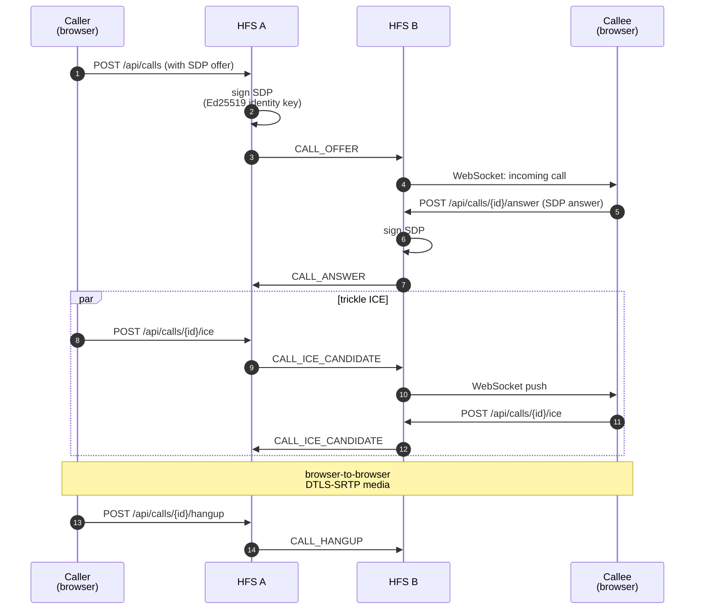
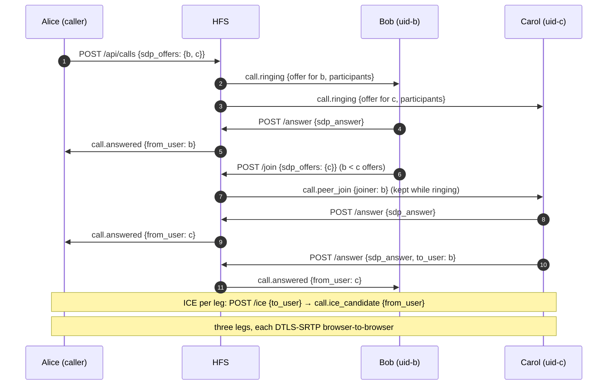
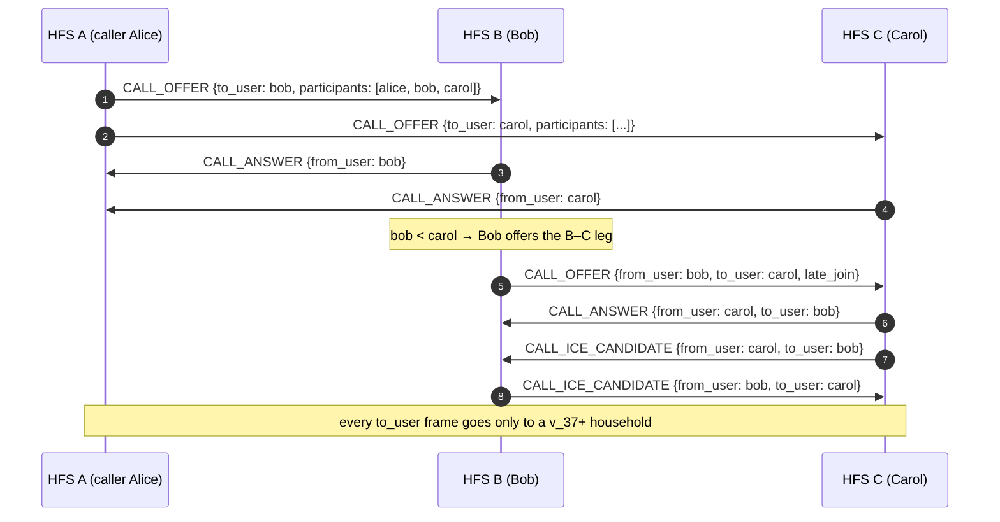

# Voice & Video Calls

WebRTC-based voice and video between users. The two HFS instances
relay SDP + ICE for signalling; the actual media (DTLS-SRTP) flows
browser-to-browser without ever touching the servers.

## Scope

- **HFS**: signalling relay. Signs and forwards SDP offer/answer and
  trickle ICE between the two callers' browsers.
- **GFS**: uninvolved in private calls. Only used when the two
  participants aren't peered — then GFS acts as an opaque relay
  identical to the pattern in [push-relay](./push-relay.md).

## Event types

`CALL_OFFER`, `CALL_ANSWER`, `CALL_DECLINE`, `CALL_BUSY`,
`CALL_HANGUP`, `CALL_END`, `CALL_ICE`, `CALL_ICE_CANDIDATE`,
`CALL_QUALITY`.

## Flow — direct (paired peers)

```mermaid
sequenceDiagram
    autonumber
    participant UC as Caller<br/>(browser)
    participant A as HFS A
    participant B as HFS B
    participant UB as Callee<br/>(browser)
    UC->>A: POST /api/calls (with SDP offer)
    A->>A: sign SDP<br/>(Ed25519 identity key)
    A->>B: CALL_OFFER
    B->>UB: WebSocket: incoming call
    UB->>B: POST /api/calls/{id}/answer (SDP answer)
    B->>B: sign SDP
    B->>A: CALL_ANSWER
    par trickle ICE
        UC->>A: POST /api/calls/{id}/ice
        A->>B: CALL_ICE_CANDIDATE
        B->>UB: WebSocket push
        UB->>B: POST /api/calls/{id}/ice
        B->>A: CALL_ICE_CANDIDATE
    end
    Note over UC,UB: browser-to-browser<br/>DTLS-SRTP media
    UC->>A: POST /api/calls/{id}/hangup
    A->>B: CALL_HANGUP
```

## Browser side

The SPA owns the `RTCPeerConnection`s — one per remote participant, so a
1:1 call has one (`client/src/features/calls/callSession.ts`; group calls
below); the backend relays whatever SDP / ICE the browsers produce and
never touches media. The steps below are for one leg.

- **Caller** — `getUserMedia` → `createOffer` /
  `setLocalDescription` → `POST /api/calls {sdp_offer}`. Local ICE
  candidates gathered before the `call_id` exists are held and flushed
  once the POST returns. `call.answered.signed_sdp.sdp` becomes the
  remote description.
- **Callee** — `call.ringing.signed_sdp.sdp` is the offer. On Accept:
  `getUserMedia` → `setRemoteDescription(offer)` → `createAnswer` /
  `setLocalDescription` → `POST /api/calls/{id}/answer {sdp_answer}`.
  Local candidates go out only after the answer is posted.
- **Trickle ICE** — `call.ice_candidate` frames are queued from the moment
  they land (the callee receives the caller's candidates while still
  ringing) and applied once a remote description exists.
- **STUN / TURN** — `GET /api/calls/ice-servers` (time-limited TURN
  credentials when `webrtc_turn_secret` is set).
- **Media** — an audio call asks for `{audio: true, video: false}`: no
  camera prompt, no camera light, and no camera to switch on mid-call
  (that would need a renegotiation the signalling doesn't carry, so the
  toggle is disabled). A video call asks for `{audio: true, video: true}`
  and falls back to audio-only when there is no usable camera.
- **Ending** — hangup / decline / `call.ended` / `call.declined` close the
  peer connection and stop the local tracks; an ICE/DTLS `failed` state
  fails the call and posts a hangup so the other side is released.
  "Back to chats" on the *Call not connected on this device* page (after
  a reload or from a stale link) also posts a hangup, so the other side
  stops ringing or waiting.

### Headers and embedding (HAOS ingress)

The security headers allow `camera=(self), microphone=(self)` in
`Permissions-Policy`; with `()` the browser rejects `getUserMedia` before
the user is even prompted. `X-Frame-Options` is `SAMEORIGIN`.

Under `haos` the SPA runs inside Home Assistant's add-on ingress panel
(home-assistant/frontend `src/panels/app/ha-panel-app.ts`, checked at
`16183f9`): `<iframe src=${addon.ingress_url}>` with **no `allow`
attribute**. `ingress_url` is `/api/hassio_ingress/<token>/` on HA's own
origin, and the Supervisor and Core ingress proxies forward our response
headers unchanged (`_response_header` only drops the transfer headers).
So:

- the frame is same-origin with its parent and inherits the default
  `'self'` allowlist — camera and microphone are available, and our
  `(self)` (here: HA's origin) agrees;
- `X-Frame-Options: DENY` would make the browser refuse to show the
  frame at all, which is why the header is `SAMEORIGIN`.

HA's Webpage dashboard / `panel_iframe`
(`src/panels/iframe/ha-panel-iframe.ts`) and the iframe card
(`hui-iframe-card.ts`, default) set `allow="fullscreen"` only. Pointed at
Social Home's direct URL they are cross-origin, and `SAMEORIGIN` keeps
Social Home out of them entirely (it was already `DENY`). So the only
frames that can render Social Home have all-same-origin ancestors, and
the microphone is only denied there when a same-origin ancestor narrows
the policy (e.g. `allow="microphone 'none'"`). For that case the SPA
detects the denial (`client/src/features/calls/embedPolicy.ts`:
`document.permissionsPolicy` on Chromium; a framed `NotAllowedError`
elsewhere) and shows *Open Social Home in its own tab* with a link to the
current page instead of a generic error. A ringing device that can't
answer for this reason stops ringing without declining, so the user's
other devices keep ringing.

## Callee-side state

Both households keep a `call_sessions` row next to the in-memory routing
record, and inbound events move it through the same states as local ones:

- `CALL_OFFER` persists the callee-side row (`ringing`). Every per-call
  route (`answer`, `ice`, `decline`, `hangup`) authorises against it and
  the stale-call sweep marks it missed. Because the offer is stored, it is
  only accepted for a call the household would accept from its own
  members: a known `call_type`, a caller hosted by the sending household
  (`remote_users`), a callee this household hosts, both in the named
  conversation, no guardian block (§CP.F2) between caller and callee, and
  at most `MAX_CALLS_PER_USER` ringing calls per callee.
  Anything else is dropped with a WARNING and never rings. Locally a
  guardian block refuses a 1:1 call either way (403 — the blocked caller
  sees a personal block's `Recipient has you blocked.`) and the protected
  account's late join into a call seating the other person; in a group call
  the blocked person isn't rung by the other, and no mesh leg (offer or
  answer) ever opens between the two. A repeat
  `call_id` (a second local callee of a group call, or a `late_join`) is
  merged into the existing call — it can never reset one.
- `CALL_ANSWER` moves the caller-side row to `active` (otherwise the sweep
  would mark the live call missed after 90 s).
- `CALL_HANGUP` / `CALL_END` close the row as `ended` (with a duration);
  `CALL_DECLINE` / `CALL_BUSY` as `declined`.
- `CALL_ANSWER`, `CALL_ICE_CANDIDATE` and the terminal events are only
  accepted from a household that hosts one of the call's participants.
- Only the first answer wins: a second `POST /answer` gets 409, and the
  answerer's other devices receive `call.answered` so they stop ringing.

## Group calls (full mesh)

A group call is a full WebRTC mesh: every browser holds one
`RTCPeerConnection` ("leg") per other participant and sends its own
audio/video on each. There is no media server, so each extra person costs
every participant one more upload — calls are capped at
**`MAX_CALL_PARTICIPANTS` = 6 people** (caller included). A larger
conversation gets 422 `too_many_participants`; the SPA refuses before
touching the network. A 1:1 call is simply a mesh with one leg and keeps
its original wire shape (single `sdp_offer`).

- **Caller → callees.** The caller creates one offer per callee and posts
  `POST /api/calls {sdp_offers: {user_id: sdp}}`. Each callee rings with
  its own offer; `call.ringing` carries `participants` (everyone invited,
  caller included). A callee with no offer is not rung.
- **Answers.** Every callee answers the caller once
  (`POST /answer {sdp_answer}`); `call.answered` names `from_user` so the
  caller applies it to the right leg. A second answer from the *same*
  callee (another of their devices) is 409.
- **Callee ↔ callee legs.** Of each callee pair, the one with the lower
  `user_id` offers, right after answering the caller, through
  `POST /api/calls/{id}/join {sdp_offers}`. The other gets
  `call.peer_join {joiner_user_id, signed_sdp}` — kept while it is still
  ringing — and answers with `POST /answer {sdp_answer, to_user}`, which
  is relayed to the offering callee only.
- **ICE per leg.** `POST /ice {candidate, to_user}` goes to that
  participant only; `call.ice_candidate` names `from_user`. Without
  `to_user` (older clients) a candidate still fans out to everyone.
- **Leaving.** Hangup / decline in a group call takes only the leaver out;
  the others get `call.ended` / `call.declined` with `by` (drop that leg)
  and `over` (the whole call is finished for them). The call closes once
  fewer than two participants are left. When the caller leaves, invites
  nobody has answered are withdrawn, so a still-ringing callee stops
  ringing. A leg nobody answers is dropped by the browser after the 90 s
  ringing TTL.
- **Authorization.** `answer`, `ice` and `join` only accept participants
  of the call, and `to_user` must be another participant (403 otherwise).
- **Cross-household (v_37).** A group conversation can seat people from
  several households (see [DMs](./dm.md#group-conversations-across-households)),
  so callees sit on different households:
  - The `CALL_OFFER` ring carries `participants` (everyone invited). The
    callee's household keeps only the ids seated in the conversation there
    and forwards them on `call.ringing`, so the callee opens its legs to
    the other callees exactly as in a local group.
  - A callee-to-callee answer addressed to a remote callee goes out as
    `CALL_ANSWER {from_user, to_user, signed_sdp}` to that callee's
    household; a leg's ICE candidate as `CALL_ICE_CANDIDATE {from_user,
    to_user, candidate}`. The receiver hands it to `to_user` only when that
    user is a participant it hosts and `from_user` is a participant homed
    on the sending household; it never marks the caller's call answered.
    An answer without `to_user` (the ring's answer) is honoured only on the
    caller's household.
  - Both go only to a v_37+ household: an older one's handler would hand
    them to the caller, so that one leg stays unconnected instead
    (WARNING). An older household can't sit in a cross-household group in
    the first place.
  - A remote participant's `CALL_HANGUP` / `CALL_DECLINE` in a group call
    takes only them out (`call.ended {by, over}`), as a local hangup does.
  - Legs only run between households that are directly paired (call
    signalling is direct `send_event`); a group member on a household the
    caller never paired with is not rung.

  `CALL_ANSWER` also carries an informational `from_user` for the ring's
  answer (ignored by older receivers); without it the answer is attributed
  to the only unanswered callee the sending household hosts.

```mermaid
sequenceDiagram
    autonumber
    participant A as Alice (caller)
    participant S as HFS
    participant B as Bob (uid-b)
    participant C as Carol (uid-c)
    A->>S: POST /api/calls {sdp_offers: {b, c}}
    S->>B: call.ringing {offer for b, participants}
    S->>C: call.ringing {offer for c, participants}
    B->>S: POST /answer {sdp_answer}
    S->>A: call.answered {from_user: b}
    B->>S: POST /join {sdp_offers: {c}}  (b < c offers)
    S->>C: call.peer_join {joiner: b} (kept while ringing)
    C->>S: POST /answer {sdp_answer}
    S->>A: call.answered {from_user: c}
    C->>S: POST /answer {sdp_answer, to_user: b}
    S->>B: call.answered {from_user: c}
    Note over A,C: ICE per leg: POST /ice {to_user} → call.ice_candidate {from_user}
    Note over A,C: three legs, each DTLS-SRTP browser-to-browser
```

Across households (v_37) — Alice on HFS A, Bob on HFS B, Carol on HFS C,
all three households paired:

```mermaid
sequenceDiagram
    autonumber
    participant A as HFS A (caller Alice)
    participant B as HFS B (Bob)
    participant C as HFS C (Carol)
    A->>B: CALL_OFFER {to_user: bob, participants: [alice, bob, carol]}
    A->>C: CALL_OFFER {to_user: carol, participants: [...]}
    B->>A: CALL_ANSWER {from_user: bob}
    C->>A: CALL_ANSWER {from_user: carol}
    Note over B: bob < carol → Bob offers the B–C leg
    B->>C: CALL_OFFER {from_user: bob, to_user: carol, late_join}
    C->>B: CALL_ANSWER {from_user: carol, to_user: bob}
    C->>B: CALL_ICE_CANDIDATE {from_user: carol, to_user: bob}
    B->>C: CALL_ICE_CANDIDATE {from_user: bob, to_user: carol}
    Note over A,C: every to_user frame goes only to a v_37+ household
```

## SDP signature (§26.8)

The SDP offer and answer are signed by the sending HFS's Ed25519
identity key before federation. The receiving HFS verifies the
signature against the peer's pinned identity key before forwarding
to its user's browser. This blocks a compromised signalling relay
from injecting a modified SDP that redirects media to a third party.

## Missed calls

If the callee doesn't answer within 90 s the offerer sends
`CALL_HANGUP`; both sides record a `type=call_event` message in the
corresponding DM conversation so the user has a record of the missed
call.

## Call quality metrics

At hangup the offerer may emit `CALL_QUALITY` with RTT, jitter,
packet-loss, and codec summaries. The event is opt-in per-instance
(disabled by default) — quality metrics are otherwise private.

## Receiver rules

Every call signal names the participant it speaks for. The receiver
honours `CALL_HANGUP` / `CALL_END` / `CALL_DECLINE` / `CALL_BUSY`
(`hanger_user` / `decliner_user`), `CALL_ICE` / `CALL_ICE_CANDIDATE`
(`from_user`) and `CALL_QUALITY` (`reporter_user`) only when that user is
a participant of a call held here **and** homed on the sending household;
anything else is logged at WARNING and changes nothing. `CALL_OFFER`
binds the caller to the sender and the callee to the conversation.
`tests/protocol/test_call_signal_scope.py`.

## Rate limiting

- `POST /api/calls` — 10/min (creation)
- `POST /api/calls/{id}/decline` — 10/min
- `POST /api/calls/{id}/hangup` — 30/min
- `POST /api/calls/{id}/ice` — 300/min (a mesh trickles several candidates
  per leg within seconds; the 10/min `/api/calls` limit used to 429 them)

These limits are per-user, enforced at the route layer.

## Implementation

- `socialhome/services/call_service.py` — signalling relay, including
  `handle_federated_signal` (inbound `CALL_*`, registered by
  `FederationService.attach_call_signaling`);
  `socialhome/federation/sdp_signing.py`.
- `socialhome/repositories/call_repo.py`.
- `socialhome/routes/calls.py` — `/api/calls/*` routes and the ICE
  server config.
- `client/src/features/calls/callSession.ts` — browser WebRTC session
  (one leg per remote participant);
  `client/src/store/calls.ts` — `call.*` WS frames;
  `client/src/features/calls/InCallPage.tsx` /
  `IncomingCallDialog.tsx` — UI.

## Spec references

§26 (Voice & Video Calling),
§26.8 (SDP integrity verification),
§26.11 (rate limits).
