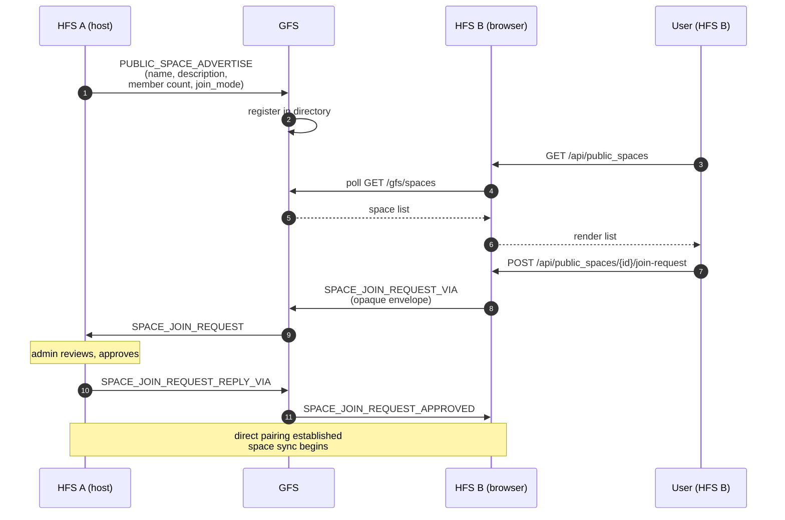

# Public-Space Discovery

How a user on one household finds a public space hosted on a
household they've never heard of. GFS is the directory; it holds
metadata, not content.

## Scope

- **HFS**: publishes a space it wants to make public; subscribes to
  the GFS directory to browse others; relays join requests through
  GFS to hosts it's not yet paired with.
- **GFS**: maintains the global registry of published spaces,
  serves `GET /gfs/spaces`, and forwards opaque `_VIA` envelopes
  between unpaired instances.

## Event types

`PUBLIC_SPACE_ADVERTISE`, `PUBLIC_SPACE_WITHDRAWN`,
`SPACE_DIRECTORY_SYNC` (peer-to-peer snapshot, distinct from GFS).

Join-request events belong to the [invites](./invites.md) flow but
ride on the same `_VIA` relay pattern.

## Flow — publish + browse + join

## Peer directory sync (§D1a)

In parallel with the GFS directory, paired peers exchange their own
lists of public spaces via `SPACE_DIRECTORY_SYNC`. This builds a
decentralised directory — a user browsing on HFS B sees both spaces
their GFS knows about and spaces their directly-paired peers know
about. The peer directory is authoritative for the households that
publish it; GFS is authoritative only for the spaces that explicitly
advertised to that specific GFS.

## Withdrawal

`PUBLIC_SPACE_WITHDRAWN` removes a space from the GFS directory and
from peer directories on the next `SPACE_DIRECTORY_SYNC`. Members
already in the space keep their membership — withdrawal only affects
discoverability, not existing peering.

## Blocking

A local admin can block a specific GFS instance:
`POST /api/public_spaces/blocked_instances/{instance_id}`. Blocked
GFS instances are not polled; any space listed only there becomes
invisible. Useful for refusing a GFS whose moderation policy you
disagree with.

## Moderation path

GFS operators can accept / reject / ban both spaces (bad listings)
and instances (bad actors) via the admin portal
(`/admin/api/spaces`, `/admin/api/clients`). Banned spaces stop
federating advertisements; banned instances are dropped from the
relay. `POST /api/gfs/connections/{gfs_id}/appeal` lets an HFS admin
contest a ban.

## Implementation

- `socialhome/services/public_space_service.py` — client side.
- `socialhome/global_server/public.py`,
  `socialhome/global_server/federation.py` — GFS directory.
- `socialhome/federation/peer_directory_handler.py` — peer
  directory sync on HFS.
- `socialhome/global_server/routes/public.py`,
  `socialhome/global_server/routes/admin/*.py` — GFS REST +
  admin API.

## Spec references

§24 (GFS protocol),
§D1a (peer directory sync),
§24.6 (moderation & appeals).
