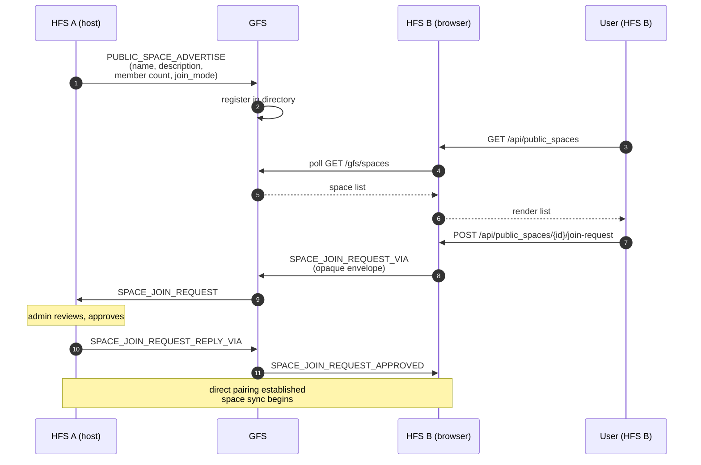

# Public-Space Discovery

How a user on one household finds a public space hosted on a
household they've never heard of. GFS is the directory; it holds
metadata, not content.

## Scope

- **HFS**: publishes a space it wants to make public; subscribes to
  the GFS directory to browse others; relays join requests through
  GFS to hosts it's not yet paired with.
- **GFS**: maintains the global registry of published spaces,
  serves `GET /gfs/spaces`, and forwards opaque `_VIA` envelopes
  between unpaired instances.

## Event types

`PUBLIC_SPACE_ADVERTISE`, `PUBLIC_SPACE_WITHDRAWN`,
`SPACE_DIRECTORY_SYNC` (peer-to-peer snapshot, distinct from GFS).

Join-request events belong to the [invites](./invites.md) flow but
ride on the same `_VIA` relay pattern.

## Transport (SH ↔ GFS)

The Social Home ↔ GFS link is split by direction:

- **SH → GFS** is plain HTTPS REST under `/gfs/*` (`register`,
  `publish`, `subscribe`, `report`, `appeal`, `spaces`). Synchronous
  request / response with explicit status codes; no shared session
  state. **Every mutating call is Ed25519-signed by the originating
  instance and verified against its registered public key** — there is
  no unsigned path:
  - `publish` (relay event) and `spaces/{id}/publish` (space metadata)
    require a mandatory household signature over their canonical body; an
    empty / malformed / invalid signature is rejected with `403`, so a
    registered peer can never overwrite another household's listing or fan
    out under its name.
  - `spaces/{id}/unpublish` is the **owner's withdrawal** of a listing and is
    signed the same way (`{action: "unpublish", owning_instance, space_id, ts}`,
    ±300 s replay guard). The signature proves *which* household is calling, so
    the GFS additionally checks that the caller **is** the space's
    `owning_instance` — a registered peer that learned a space id (they travel
    in discovery links) cannot delist someone else's space. Withdrawal is a
    **distinct, reversible state** from a moderator ban: it sets `withdrawn` and
    never touches `status`, so the owner's next signed publish restores the
    listing, while a GFS admin's `status='banned'` stays sticky against
    re-publish. The restoring publish must be **fresh**: `publish` carries an
    optional `ts` inside its signed canonical body, replay-guarded ±300 s, and
    only a publish carrying one clears `withdrawn`. A publish without `ts` (an
    older household, kept working on purpose so an upgraded GFS doesn't 403
    the whole fleet) still refreshes metadata but leaves `withdrawn` as-is —
    otherwise one captured publish body would re-list a delisted space forever.
    Once every household ships `ts` it becomes mandatory. Withdrawal affects **discoverability only** — the space drops
    off `GET /gfs/spaces`, `GET /gfs/spaces/{id}` and the public pages, while
    the relay (`publish`) and existing subscribers are untouched.
  - `spaces/{id}/publish` additionally carries the space's Ed25519
    **authority** verify key (`identity_public_key`, hex). The GFS
    **TOFU-pins** it on the first publish and holds it immutable — a later
    publish offering a different key keeps the pinned one.
  - `publish` (relay) is authorized by **either** the owner path
    (`from_instance` == the space's owning instance) **or** a valid
    **space-authority signature** carried in `payload` (`authority_sig` +
    `authority_sig_suite`) verified against the pinned `identity_public_key`.
    Because any seed-holder — the owner or a delegated admin — can produce that
    signature, a space keeps relaying while its owner is offline (the
    owner-offline-spaces epic). The GFS stays blind to space content: it
    verifies the signature over the opaque `payload` and fans out, never
    decrypting. The authority path authorizes a fixed set of event types
    (`AUTHORITY_RELAY_EVENT_TYPES`): `space_post_public` (Phase 5a) and
    `space_subscriber_key_handoff` (Phase 5b-b — see below); the signature is
    always verified under the caller's **wire** `event_type`, which must be in
    that set, so a payload signed for one type can't be replayed under another.
    Fail-closed — a present-but-invalid authority sig, an unknown suite, a
    non-owner relaying a space with no pinned pubkey, **or a non-owner whose
    wire `event_type` is not in the authorized set** are each rejected with
    `403`. The owner path is exempt and may relay any `event_type`.
  - **Replay / dedupe contract.** The authority signature binds the space id
    and the (opaque) `payload`, but **no timestamp, nonce, or epoch**, and the
    GFS keeps **no replay cache**, so `publish` relay is idempotent /
    at-least-once: a captured authority-signed payload can be re-POSTed and
    re-fanned-out (a property the owner relay already had under #598, widened
    by the non-owner authority path). The GFS deliberately adds **no** replay
    machinery — it is content-blind and can't read the post id inside the
    encrypted payload. The content-layer backstop is **subscriber-side dedupe
    by the post id** carried inside the payload, enforced by the HFS
    `space_public_inbound` consumer (the same way moments dedupe by
    `moment_id`).
  - `subscribe` and `unsubscribe` each require a signature over
    `{action, instance_id, space_id, ts}` (replay-guarded ±300 s on `ts`).
    The `action` is inside the signed bytes (domain separation), so a
    subscribe signature can't be replayed as an unsubscribe or vice versa.
    The signature binds the request to `instance_id`, so a caller can only
    (un)subscribe **itself**, and a subscribe's target space must already
    be published — the GFS no longer mints a pending row from an
    (unauthenticated) subscribe.
- **GFS → SH** is a persistent WebSocket the SH opens to
  `wss://<gfs>/gfs/ws`. The first frame is a signed hello
  `{type:"hello", instance_id, ts, sig}`; once accepted the GFS pushes
  `{type:"relay", space_id, event_type, payload, from_instance}`
  frames as fan-out happens. When no WebSocket is open the GFS falls
  back to an HTTPS POST callback to the instance's registered
  `inbox_url`. The GFS also pushes a `{type:"new_subscriber", space_id,
  subscriber:{instance_id, identity_public_key, keywrap_public_key,
  kem_suite, keywrap_sig}}` frame to a space **owner** when a household
  subscribes, so a seed-holder can hand the new subscriber the content key
  (Phase 5b-b, below). This frame is best-effort — dropped if the owner has
  no socket; the 5b-c reconcile backstops an offline owner.

### Subscriber-side on-ramp (local space mirror)

Before a household can subscribe to a space it discovered through a GFS, it
needs a **local `spaces` row** for it: `space_subscribers` fan-out only helps
if the receiver has the space's Ed25519 authority pubkey to verify relayed
frames against, and `SpaceService.subscribe_to_space` refuses an unknown
space id.

`services/gfs_space_mirror_service.py` closes that gap. On a subscribe to an
id with no local row it walks the active GFS connections, fetches
`GET {gfs}/gfs/spaces/{space_id}`, and seats a remote **stub** row via the
shared `stub_space_from_metadata` helper (`space_type=global`,
`join_mode=invite_only` — a mirror is not locally joinable; joining still
goes through `POST /api/public_spaces/{id}/join-request`).

- **Fail-closed validation.** The listing must be `status: "active"` and must
  carry a well-formed 32-byte-hex `identity_public_key`; anything else is
  skipped rather than mirrored. A stub with an unverifiable pin would accept
  forged relay frames.
- **The pin is TOFU at the household.** A space id is a `uuid4`, not derived
  from the authority key, so the served pin cannot be self-certified. The
  repository is what makes it stick: `SqliteSpaceRepo.save` excludes
  `identity_public_key` from its upsert, so a later refresh — from this GFS or
  another — can never move a pin. A hostile GFS can therefore fabricate a
  space it controls the authority key for, but cannot hijack one already
  pinned, and no other trust path (direct peers, §D1b invites) is affected.
  `owning_instance` from the listing is *not* an authenticated envelope
  sender, which is why every inbound relay verifies against the pinned key,
  never the claimed owner.
- **Ordering.** The GFS-side `subscribe` is sent only after every local
  refusal (public-tier check, ban, §CP.F1 age gate) has passed, so a
  locally-refused user is never registered on the relay.
- **Teardown.** When the last local subscriber of a mirrored space leaves,
  the household unsubscribes from every paired GFS (best-effort — a down GFS
  never blocks the local leave) and purges the stub; the `spaces` cascade
  takes `space_keys` with it, so the content key doesn't outlive the mirror.

### HFS producer + consumer for public space content (Phase 5a2)

The GFS only *relays* — the HFS owns the encryption and authorship
boundary on both ends:

- **Producer** (`services/space_public_outbound.py`) subscribes to
  `SpacePostCreated`. When a post lands in a **PUBLIC/GLOBAL** space on a
  household that **holds the space seed** (owner or delegated admin), it
  builds an inner content payload — `{post_id, space_id, author_user_id,
  author_pk, author_username, content, media refs, created_at, author_sig,
  …}` — and AES-256-GCM-encrypts it under the space's **existing** content
  key (`space_crypto_service.encrypt`, no new key). `author_sig` is a
  **per-author** Ed25519 signature: the author's **household identity seed**
  signs the canonical, domain-separated bytes over the attributable inner
  fields (`services/space_public_author.py:author_signing_bytes`, prefix
  `space-post-author:v1:`, sorted compact JSON, excluding `author_sig`
  itself). It rides **inside** the ciphertext, so the GFS never sees it. The
  wire envelope is only `{space_id, epoch, encrypted_payload, authority_sig,
  authority_sig_suite}` — **no plaintext content, author, or author_sig ever
  leaves the household**, so the GFS and any relay stay content-blind
  (Encryption-First Rule). The envelope is **space-authority**-signed with
  the space seed under `space_post_public` and POSTed to every GFS the space
  is published to (`gfs_connection_service.publish_space_event`). Skipped: a
  household without the seed, a non-public space, and an inbound-driven
  (`origin_instance_id` set) event with no relay hint (pure loop guard).

  Two independent signatures protect a relayed post: the **space-authority**
  signature on the envelope (a seed-holder, verified against the pinned space
  key — proves the relay is authorised) and the **per-author** `author_sig`
  on the inner content (the author's household key, verified against
  `author_pk` — proves the named author wrote it). The self-cert only binds
  `author_pk ↔ author_user_id`; both are public, so without `author_sig` a
  seed-holder could attribute any post to any member. The per-author signing
  bytes cover `hidden_from_feed` too, so a relay can't flip a post's
  feed-presentation intent.

- **Remote-author relay** (owner-offline-capable). A plain member's public
  post no longer waits for the owner: when **any** member creates a
  public/global-space post, the author's household builds the same per-author
  signed inner (`space_public_author.build_signed_author_inner`) and attaches
  it as a `public_relay` hint on the member-to-member `SPACE_POST_CREATED`
  broadcast (public/global spaces only — a private space never attaches one).
  Any **seed-holding** household (owner or delegated admin) that receives the
  broadcast (`space_public_outbound`, inbound-driven branch) verifies the hint
  end-to-end — the author's `author_sig` + self-cert
  (`verify_signed_author_inner`) **and** that the inner's signed `space_id`
  matches the event's space (cross-space injection guard) — then relays the
  inner **verbatim** to the GFS under **its own** space-authority envelope
  signature. So a member's public post reaches subscribers even when the
  owner *and* the author are offline. The relay stays content-blind (it never
  re-signs the author bytes, only the envelope), the GFS stays content-blind,
  and subscribers dedupe by `post_id` (a post relayed by several seed-holders
  imports once). The `public_relay` field is **fail-soft** — an older peer
  that doesn't understand it simply ignores it and the broadcast still
  delivers; no new event type and no capability bump.
- **Consumer** (`services/space_public_inbound.py`) handles the relayed
  `space_post_public` frame off the SH↔GFS WebSocket. Defence-in-depth —
  the GFS already verified, but the relay is never trusted: it (1)
  re-verifies the authority signature against the locally-mirrored
  `spaces.identity_public_key`, (2) decrypts under the per-space content
  key for the stated epoch (dropping gracefully — including a tampered
  ciphertext whose AEAD tag fails — if the key isn't held yet; a GFS
  subscriber receives its content key via the Phase-5b-b handoff below),
  (3) **self-certifies the author**
  (`derive_user_id(author_pk, username) == author_user_id` — binds pk↔user_id
  only), (4) **verifies the per-author `author_sig`** against `author_pk` over
  `author_signing_bytes` (fail-closed if missing, malformed, or invalid — this
  is what actually prevents a seed-holder from forging authorship), (5)
  **dedupes by `post_id`** (the at-least-once relay's content-layer
  backstop), then persists to `space_posts` and republishes
  `SpacePostCreated` (with `origin_instance_id` set) so realtime/search
  light up and the federation outbound bridge skips re-fanning.

```mermaid
sequenceDiagram
    autonumber
    participant AUTH as HFS author (plain member; owner offline)
    participant SH as HFS seed-holder (owner or delegated admin)
    participant G as GFS (content-blind)
    participant SUB as HFS subscriber
    AUTH->>AUTH: build_signed_author_inner (author_sig + self-cert)
    AUTH->>SH: SPACE_POST_CREATED broadcast<br/>(public_relay hint attached; fail-soft)
    SH->>SH: verify author_sig + self-cert + space_id binding
    SH->>SH: encrypt inner under space content key + authority-sign envelope
    SH->>G: publish space_post_public<br/>(authority-signed; ciphertext only)
    G->>G: verify authority sig vs pinned pubkey
    G->>SUB: relay space_post_public
    SUB->>SUB: re-verify authority sig + decrypt + self-cert + author_sig
    SUB->>SUB: dedupe by post_id, persist
```

The HTTPS-inbox fallback for relayed `space_post_public` events is a
follow-up; today the consumer is wired on the WebSocket path (mirroring
the public-moments inbound).

### Subscriber content-key handoff (Phase 5b-b)

A Phase-5a relay reaches a GFS subscriber, but the subscriber **drops** it —
it has no content key to decrypt. Phase 5b-b delivers that key, **GFS-blind**,
on a fast path driven by the GFS `new_subscriber` notify (the owner-offline
RECONCILE — a seed-holder pulling the subscriber list to catch up missed
deliveries — is **Phase 5b-c**, below):

1. **GFS notify.** On a successful `subscribe`, the GFS pushes a
   `new_subscriber` frame to the space **owner** carrying the new subscriber's
   registered Ed25519 `identity_public_key` + its published key-wrap pubkey /
   suite / self-signature (`keywrap_public_key`, `kem_suite`, `keywrap_sig`).
   Only the owner is notified (the GFS authoritatively knows `owning_instance`;
   a delegated admin catches up via 5b-c). Offline owner → frame dropped, the
   subscribe still succeeds.
2. **Seed-holder seals + relays** (`services/space_subscriber_key_outbound.py`).
   Acting only if this household **holds the space seed** and the space is
   PUBLIC/GLOBAL, it first **verifies the key-wrap binding** end-to-end
   (`federation/keywrap_seal.py:verify_keywrap_binding` — `derive_instance_id`
   + the key-wrap key's self-signature + 32-byte check). This is the
   **anti-substitution gate**: the key-wrap pubkey was learned *from the GFS*,
   so a malicious GFS could substitute one it controls; a failed binding →
   **DROP, never seal**. It then `export_current_key`s the per-space content
   key, builds the standard `{space_content_key:{key_suite, epoch, key_base64,
   rotated_by}}` meta (the same shape `apply_space_content_key_from_metadata`
   consumes), **seals** it to the verified key-wrap pubkey
   (`seal_to_keywrap` → `{kem_suite, eph_pk, ciphertext}`), wraps
   `{space_id, target_instance_id, sealed}` and **authority-signs** it with the
   space seed under `space_subscriber_key_handoff`, and relays it through the
   content-blind GFS (`publish_space_event`). **No plaintext key ever leaves
   the household** — only the sealed ciphertext travels; the GFS authorizes the
   relay by the space-authority signature (same path as `space_post_public`)
   and fans it out. Non-target subscribers it reaches drop it
   (`target_instance_id` ≠ self, and they can't `open_keywrap` it anyway).
3. **Subscriber unseals + imports**
   (`services/space_subscriber_key_inbound.py`). On the relayed
   `space_subscriber_key_handoff` frame: drop unless `target_instance_id` is
   us; **re-verify** the space-authority signature against the
   locally-mirrored `spaces.identity_public_key` (never trust the relay/GFS) —
   a forged signature → drop, no import; `open_keywrap` with our key-wrap
   private key (a payload sealed to a different key → `InvalidTag` → dropped
   gracefully); parse the meta and `apply_space_content_key_from_metadata`
   (idempotent per epoch — a double delivery imports once). After the import
   the subscriber can decrypt the Phase-5a relay (a later relay/backfill
   decodes; backfill is out of scope).

```mermaid
sequenceDiagram
    autonumber
    participant SUB as HFS subscriber
    participant G as GFS (content-blind)
    participant SH as HFS seed-holder (owner)
    SUB->>G: POST /gfs/subscribe (signed)
    G->>G: add_subscriber
    G->>SH: new_subscriber<br/>(subscriber identity + keywrap pub + sig)
    SH->>SH: verify_keywrap_binding (anti-substitution)
    SH->>SH: export_current_key + seal_to_keywrap
    SH->>G: publish space_subscriber_key_handoff<br/>(authority-signed; sealed ciphertext only)
    G->>G: verify authority sig vs pinned pubkey
    G->>SUB: relay space_subscriber_key_handoff
    SUB->>SUB: re-verify authority sig (local pinned key)
    SUB->>SUB: open_keywrap + import_key
    Note over SUB: can now decrypt Phase-5a relay
```

### Owner-offline reconcile (Phase 5b-c)

The 5b-b notify reaches **only the owner** (the GFS authoritatively knows
`owning_instance`, so that's the only socket it pushes to). If the owner is
offline when a household subscribes — or the notify is simply missed — the
content key is never delivered on the fast path. Phase 5b-c closes the gap with
a **pull-based reconcile** that any seed-holder can run, so a **delegated admin
delivers the key while the owner is offline**:

1. **Trigger.** On each GFS-WS `(re)connect` (`gfs_ws_client` `on_connected`),
   the seed-holder runs `space_subscriber_key_outbound.reconcile(gfs_id)`.
2. **Enumerate "spaces I hold the seed for on this GFS."** It lists every space
   **published to that GFS** (`gfs_connection_repo.list_publications(gfs_id)`)
   and keeps those that are **PUBLIC/GLOBAL** *and* whose **seed this household
   holds** (`get_space_seed` non-None). A private/household space, or a space it
   doesn't hold the seed for, is skipped (its key must never leave via the GFS,
   and only a seed-holder can authority-sign the query).
3. **Pull the subscriber list under a space-authority signature.** It signs
   `{space_id, ts}` with the space seed under `space_subscribers_query` and
   `GET /gfs/spaces/{id}/subscribers?ts=&authority_sig=&authority_sig_suite=`.
   The GFS verifies that signature against the space's TOFU-pinned
   `identity_public_key` (the same key that authorizes relay) and a ±300 s
   replay guard, then returns each subscriber's already-registered
   `{instance_id, identity_public_key, keywrap_public_key, keywrap_sig}` — no
   inbox URL, no private data. A forged / stale / unknown-suite signature, an
   unknown space, or a space with no pinned pubkey → **403** (fail-closed).
4. **Re-seal per subscriber.** For each subscriber it runs the **identical**
   verified-seal+relay as 5b-b (`verify_keywrap_binding` anti-substitution gate
   → `seal_to_keywrap` → authority-sign under `space_subscriber_key_handoff` →
   relay through the content-blind GFS). A subscriber with no key-wrap key
   (older HFS) or a forged binding is skipped — never sealed-to.

The reconcile is **idempotent**: the subscriber's `import_key` is per-epoch
idempotent, so re-sealing on every reconnect is harmless (a re-import is a
no-op). It is bounded to one pass per connect and fail-soft at every level (an
unknown/inactive GFS, a per-space transport error, or a per-subscriber seal
failure is logged and skipped). The `GET` is a **query, not a relay** —
`space_subscribers_query` is deliberately kept out of the GFS's
`AUTHORITY_RELAY_EVENT_TYPES`, so a query-signed payload can never be replayed
onto the relay fan-out (the signing bytes bind the event type).

```mermaid
sequenceDiagram
    autonumber
    participant SUB as HFS subscriber
    participant G as GFS (content-blind)
    participant ADM as HFS seed-holder (delegated admin; owner offline)
    Note over ADM: GFS-WS (re)connect → reconcile(gfs_id)
    ADM->>ADM: list published spaces I hold the seed for
    ADM->>G: GET /gfs/spaces/{id}/subscribers<br/>(authority-signed {space_id, ts})
    G->>G: verify authority sig vs pinned pubkey + ±300 s ts
    G-->>ADM: subscribers [{instance_id, identity_pk, keywrap_pk, keywrap_sig}…]
    loop each subscriber
        ADM->>ADM: verify_keywrap_binding + seal_to_keywrap
        ADM->>G: publish space_subscriber_key_handoff<br/>(authority-signed; sealed ciphertext only)
        G->>SUB: relay space_subscriber_key_handoff
        SUB->>SUB: re-verify + open_keywrap + import_key (idempotent)
    end
```

WebRTC is **not** used for the SH↔GFS leg — the GFS is publicly
reachable, so NAT traversal buys nothing while DTLS plus per-connection
PeerConnection state would be much more resource-hungry than a plain
WebSocket. WebRTC stays for §4.2.3 SH↔SH direct sync and §26 calls
(both genuinely peer-to-peer). See spec §24.12 for the full transport
specification.

## Flow — publish + browse + join

```mermaid
sequenceDiagram
    autonumber
    participant HA as HFS A (host)
    participant G as GFS
    participant HB as HFS B (browser)
    participant UB as User (HFS B)
    HA->>G: PUBLIC_SPACE_ADVERTISE<br/>(name, description,<br/>member count, join_mode)
    G->>G: register in directory
    UB->>HB: GET /api/public_spaces
    HB->>G: poll GET /gfs/spaces
    G-->>HB: space list
    HB-->>UB: render list
    UB->>HB: POST /api/public_spaces/{id}/join-request
    HB->>G: SPACE_JOIN_REQUEST_VIA<br/>(opaque envelope)
    G->>HA: SPACE_JOIN_REQUEST
    Note over HA: admin reviews, approves
    HA->>G: SPACE_JOIN_REQUEST_REPLY_VIA
    G->>HB: SPACE_JOIN_REQUEST_APPROVED
    Note over HA,HB: direct pairing established<br/>space sync begins
```

## Peer directory sync (§D1a)

In parallel with the GFS directory, paired peers exchange their own
lists of public spaces via `SPACE_DIRECTORY_SYNC`. This builds a
decentralised directory — a user browsing on HFS B sees both spaces
their GFS knows about and spaces their directly-paired peers know
about. The peer directory is authoritative for the households that
publish it; GFS is authoritative only for the spaces that explicitly
advertised to that specific GFS.

## Withdrawal

`PUBLIC_SPACE_WITHDRAWN` removes a space from the GFS directory and
from peer directories on the next `SPACE_DIRECTORY_SYNC`. Members
already in the space keep their membership — withdrawal only affects
discoverability, not existing peering.

## Blocking

A local admin can block a specific GFS instance:
`POST /api/public_spaces/blocked_instances/{instance_id}`. Blocked
GFS instances are not polled; any space listed only there becomes
invisible. Useful for refusing a GFS whose moderation policy you
disagree with.

## Moderation path

GFS operators can accept / reject / ban both spaces (bad listings)
and instances (bad actors) via the admin portal
(`/admin/api/spaces`, `/admin/api/clients`). Banned spaces stop
federating advertisements; banned instances are dropped from the
relay. `POST /api/gfs/connections/{gfs_id}/appeal` lets an HFS admin
contest a ban.

## Implementation

- `socialhome/services/public_space_service.py` — client side.
- `socialhome/global_server/public.py`,
  `socialhome/global_server/federation.py` — GFS directory.
- `socialhome/federation/peer_directory_handler.py` — peer
  directory sync on HFS.
- `socialhome/services/space_public_outbound.py`,
  `socialhome/services/space_public_inbound.py` — Phase 5a public
  space-content relay producer/consumer.
- `socialhome/services/space_subscriber_key_outbound.py`,
  `socialhome/services/space_subscriber_key_inbound.py` — Phase 5b-b
  subscriber content-key handoff (seal + relay / unseal + import).
- `socialhome/federation/keywrap_seal.py` — `seal_to_keywrap` /
  `open_keywrap` / `verify_keywrap_binding` (static-recipient sealed box).
- `socialhome/global_server/routes/public.py`,
  `socialhome/global_server/routes/admin/*.py` — GFS REST +
  admin API.

## Spec references

§24 (GFS protocol),
§D1a (peer directory sync),
§24.6 (moderation & appeals).
