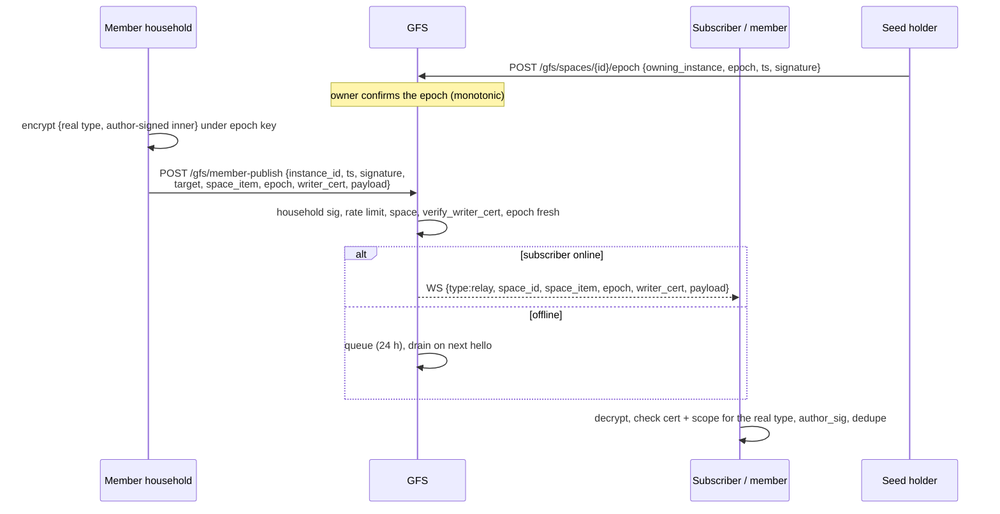
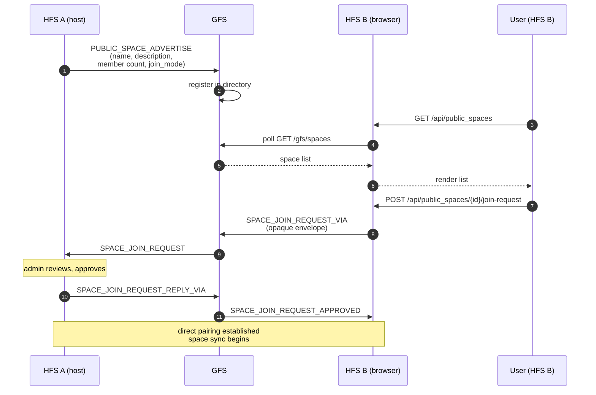

# Public-Space Discovery

How a user on one household finds a public space hosted on a
household they've never heard of. GFS is the directory; it holds
metadata, not content.

## Scope

- **HFS**: publishes a space it wants to make public; subscribes to
  the GFS directory to browse others; relays join requests through
  GFS to hosts it's not yet paired with.
- **GFS**: maintains the global registry of published spaces,
  serves `GET /gfs/spaces`, and forwards opaque `_VIA` envelopes
  between unpaired instances.

## Event types

`PUBLIC_SPACE_ADVERTISE`, `PUBLIC_SPACE_WITHDRAWN`,
`SPACE_DIRECTORY_SYNC` (peer-to-peer snapshot, distinct from GFS).

Join-request events belong to the [invites](./invites.md) flow but
ride on the same `_VIA` relay pattern.

GFS fan-out event types (connection-server wire, not
`FederationEventType`): `space_post_public` and
`space_subscriber_key_handoff` (authority-relayed via `/gfs/publish`), and
`space_item` (v_49, a member-published item via `/gfs/member-publish` — the
real item type is inside the ciphertext).

## Transport (SH ↔ GFS)

The Social Home ↔ GFS link is split by direction:

- **SH → GFS** is plain HTTPS REST under `/gfs/*` (`register`,
  `publish`, `subscribe`, `report`, `appeal`, `spaces`). Synchronous
  request / response with explicit status codes; no shared session
  state. **Every mutating call that names a household is Ed25519-signed by
  that household and verified against its registered public key** — there is
  no unsigned path. The one deliberate exception is the content relay
  `publish`, which names no household at all (see below):
  - `spaces/{id}/publish` (space metadata) requires a mandatory household
    signature over its canonical body; an empty / malformed / invalid
    signature is rejected with `403`, so a registered peer can never
    overwrite another household's listing.
  - `spaces/{id}/unpublish` is the **owner's withdrawal** of a listing and is
    signed the same way (`{action: "unpublish", owning_instance, space_id, ts}`,
    ±300 s replay guard). The signature proves *which* household is calling, so
    the GFS additionally checks that the caller **is** the space's
    `owning_instance` — a registered peer that learned a space id (they travel
    in discovery links) cannot delist someone else's space. Withdrawal is a
    **distinct, reversible state** from a moderator ban: it sets `withdrawn` and
    never touches `status`, so the owner's next signed publish restores the
    listing, while a GFS admin's `status='banned'` stays sticky against
    re-publish. The restoring publish must be **fresh**: `publish` carries an
    optional `ts` inside its signed canonical body, replay-guarded ±300 s, and
    only a publish carrying one clears `withdrawn`. A publish without `ts` (an
    older household, kept working on purpose so an upgraded GFS doesn't 403
    the whole fleet) still refreshes metadata but leaves `withdrawn` as-is —
    otherwise one captured publish body would re-list a delisted space forever.
    Once every household ships `ts` it becomes mandatory. Withdrawal affects **discoverability only** — the space drops
    off `GET /gfs/spaces`, `GET /gfs/spaces/{id}` and the public pages, while
    the relay (`publish`) and existing subscribers are untouched. Withdrawal
    also **deletes every invite link** minted for the space
    (`gfs_invite_tokens`): those are standing public URLs already sitting in
    other people's chats, so leaving them live would keep a working side door
    into a delisted listing. Re-publishing restores the listing, not the old
    links — the owner mints fresh ones.
  - `spaces/{id}/publish` also carries **two independent dials**, both inside
    the same signed canonical body — so no on-path party can flip either:

    | Field | What it governs | Values |
    |---|---|---|
    | `join_mode` | how a person becomes a **member who can post** | `invite_only` / `open` / `request` |
    | `allow_subscribers` | whether **strangers may follow read-only** — i.e. whether the listing is publicly **readable** | `true` / `false` |

    Readability is `allow_subscribers`, and *only* `allow_subscribers`. All
    four combinations are meaningful: `invite_only` + `true` is a broadcast
    space (invited people write, anyone may read), `open` + `false` is
    joinable but not publicly readable.

    | `allow_subscribers` | Listed in the directory | Publicly readable |
    |---|---|---|
    | `true` | yes | yes — `POST /gfs/subscribe` seats the caller, content relays |
    | `false` | **yes** | **no** — subscribe is refused `403`, no content relay, no content key; any seats it already had are purged |

    A space with followers off is therefore an *advert*: people can find it
    and ask to be let in, but nothing inside it is published. Enforcement
    is symmetric on both sides of the wire — the host relays nothing, and
    the GFS refuses to seat a subscriber.

    Both fields are **optional on the wire** for the mixed-version window and
    each is folded into the signed bytes only when present (an older household
    signs a body without the key; stripping either in transit only moves the value
    towards the *more* restrictive one). A missing or unknown `join_mode`
    stores the fail-closed `invite_only` and a missing `allow_subscribers`
    stores the fail-closed `false`; so do the `0009` / `0010` migrations'
    column defaults for rows published before each field existed. That is a
    deliberate choice over a backfill: an unreadable-but-listed space is the
    safe error, and the truth arrives by itself one reconnect later, because
    every GFS-WS (re)connect re-publishes the metadata of every space this
    household published to that server (the NULL-pin self-heal below).
    When a publish carries an **explicit** `allow_subscribers: false`, the
    GFS also **drops that space's subscriber rows** (logged at INFO with the
    count): the owner has withdrawn readability, and seats taken while the
    space was readable would otherwise linger forever on a space that relays
    nothing. An **absent** key does *not* purge. It gates (the stored `0`
    refuses every new subscribe) but keeps the existing seats: absent means
    "this household does not know the field", not "the owner withdrew
    readability", and evicting on it would mass-evict every reader on a
    mixed-version server the moment one un-upgraded household re-published.
    The gate reverses itself on the owner's next publish; a purge does not.
  - `spaces/{id}/invite` (+ `invite/{gfs_token}`) mint and revoke those links,
    owner-signed with an `action` discriminator inside the signed bytes. The
    public half is `GET /join/{gfs_token}`, which renders the space's
    already-public directory metadata next to a `socialhome://invite#<blob>`
    code the visitor pastes into their own Social Home. The blob is opaque to
    the server and the page **writes nothing** — see
    [invites.md](invites.md#the-mint--landing-leg--where-the-blob-comes-from).
  - `spaces/{id}/publish` additionally carries the space's Ed25519
    **authority** verify key (`identity_public_key`, hex). The GFS
    **TOFU-pins** it on the first publish. After that the pin moves **only on
    an owner-certified rotation** (v_44): when the owner revokes an admin
    household it rotates the key and its publish carries `authority_cert`
    (inside the signed body, which must then carry a fresh signed `ts`). The
    GFS re-pins only when the cert verifies against the owner's REGISTERED
    key (`client_instances.public_key`, which must derive to
    `owning_instance`), names exactly the offered key, and has a higher
    `key_epoch` than the cert it stored (`global_spaces.authority_cert`,
    migration `0013`; none = epoch 0). Anything else keeps the pin and logs a
    warning. The cert names no member and no reason: the GFS learns that a
    rotation happened, and when. It stays inside the GFS (ordering and
    cluster sync); the public directory serves only the key and the GFS's own
    re-pin counter (`authority_rotation_seq`, migration `0013`). An ordinary upsert — including a cluster
    `NODE_SYNC_SPACE` — never moves a set pin; a peer node's sync re-pins only
    through the same cert check, and max-merges the peer's
    `authority_rotation_seq` for the pin it now holds, so a node never serves
    a lower seq than its peer did. The seq is capped at 2^63−1; a node that
    reaches the cap stops advancing it, so a hostile cluster peer that gossips
    the cap freezes follower re-pins on that GFS (mirrors need a strictly
    higher seq). Cluster peers are trusted operator nodes, so this is a
    documented residual, not a gate. A GFS advertises the feature as
    `authority_rotation: true` in its signed `/gfs/info` capability block; a
    household sends a GFS without it no cert (an older GFS would fail the
    signature over a field it doesn't know) and warns that the old key keeps
    authorizing relays there.
  - `publish` (relay) is **anonymous**. The canonical body is exactly
    `{space_id, event_type, payload}` — no household identity — and the only
    authenticator is the **space-authority signature** carried inside the
    opaque `payload` (`authority_sig` + `authority_sig_suite`), verified
    against the TOFU-pinned `identity_public_key`. A connection server must
    not learn WHICH household relayed a public/global-space event, and it
    does not need to: the signature authorizes the relay and `space_id`
    routes it. Because any seed-holder — the owner or a delegated admin —
    can produce that signature, a space keeps relaying while its owner is
    offline (the owner-offline-spaces epic). The GFS stays blind to the
    content: it verifies a signature over opaque bytes and fans out, never
    decrypting.

    The **owner path is gone** — there is no longer a
    `from_instance == owning_instance` shortcut that relays any unsigned
    `event_type`. The authorized event types are exactly
    `AUTHORITY_RELAY_EVENT_TYPES`: `space_post_public` (Phase 5a) and
    `space_subscriber_key_handoff` (Phase 5b-b — see below). The signature
    is always verified under the caller's **wire** `event_type`, which must
    be in that set, so a payload signed for one type can't be replayed under
    another. Fail-closed — a missing / present-but-invalid authority sig, an
    unknown suite, an unpublished or banned space, a space with no pinned
    pubkey, or a wire `event_type` outside the set are each rejected.

    **Legacy bodies are tolerated, never trusted.** An older household still
    POSTs `{…, from_instance, signature}`. When either field is present the
    household transport signature is verified exactly as before (a bogus
    legacy field must not be a free pass) and the identity is then
    *discarded*: it authorizes nothing, never enters the fan-out frame, and
    is never logged.

    A sibling hardening pass makes the response `{"status":"published",
    "delivered_to": <count>}` (no subscriber ids), collapses every
    authorization failure into one uniform `403` body so the endpoint is not
    a space-existence / ban / pin oracle, adds a per-IP rate limiter that
    honours `X-Forwarded-For` only from trusted proxies, and caps the request
    body. The exact limits and setting names live in
    [`docs/api.md`](../api.md).
  - **Capability discovery — signed.** The GFS↔HFS leg has no `proto_version`
    negotiation, so capabilities ride `GET /gfs/info`. That endpoint is
    unauthenticated, so the capability itself is **signed**: the response
    carries

    ```json
    {"capabilities": {"anonymous_publish": true},
     "capabilities_sig": "<b64url Ed25519>",
     "capabilities_sig_suite": "ed25519"}
    ```

    signed with the GFS's **own identity key** — the one already published in
    the same response as `public_key` and pinned (TOFU) by every paired
    household. That key is random per deployment: the GFS mints a 32-byte seed
    on first boot and persists it as `<data_dir>/gfs_identity.seed` (0600), or
    takes `[server] signing_seed_hex` / `GFS_SIGNING_SEED` when an operator
    manages the secret externally. It used to be *derived* from
    `gfs_instance_id`, which `/gfs/info` serves in the clear — anyone could
    recompute the private key and sign their own capability block, so the
    signature proved nothing. Signing bytes are `b"gfs-capabilities:v1:"` + canonical JSON
    (`sort_keys`, compact separators) of
    `{"gfs_instance_id": …, "capabilities": {…}}`, so a block can't be lifted
    onto another server or another statement that key signs
    (`socialhome/capabilities_sig.py`; suite tag per the
    crypto-suite rule, unknown suite → rejected, never defaulted). The
    top-level `anonymous_publish` mirror stays for readability and is
    **informational only**.

    **There is no identified fallback — the household fails closed.** A
    household never sends `from_instance` or a household transport signature
    to a GFS, whatever `/gfs/info` says. On a COLD cache it cannot tell a
    stripping MITM from an old GFS (both show no verifiable block), so both
    get the same answer: **no publish**, plus one WARNING per connection
    naming the GFS. An old GFS build therefore receives no space publishes
    until it upgrades. An unreachable `/gfs/info` is "unknown", not "no": the
    publish waits in the household's retry queue, which re-checks the
    capability before every attempt and sends the identity-free body once it
    is proven. Stripping on-path now buys an attacker a denied relay, never
    an identity.

    **What signing buys:** the capability cannot be *forged* toward a GFS
    that would `403` the anonymous body, a tampered-but-present block is
    named as tampering rather than age, and a valid `true` latches (the
    ratchet below), so a later strip cannot stop the relay mid-life.

    A GFS **rollback** to a pre-capability build interacts with that latch the
    other way: a household that already latched `true` keeps sending the
    identity-free body, which the rolled-back server `403`s, until that
    household's process restarts (the ratchet is RAM-only). Rolling a GFS
    backwards is therefore a breaking change for latched households, not a
    graceful degrade.

    The household caches the verified answer per connection (RAM only — it is
    a property of the remote server's build, so a column would go stale the
    moment an operator upgrades), refreshing it at pair time, on every GFS-WS
    reconnect, and once on demand when a publish finds it unknown. Three rules
    guard the cache:

    - **Only a verified block sets it.** Missing block, bad signature or an
      unknown suite → `False` (no publish) plus **one** WARNING per
      connection, worded so an operator can tell "older GFS / stripped in
      transit" from "block FAILED verification against the pinned key".
    - **It ratchets up.** Once seen `true` under a valid signature, a later
      fetch without it does **not** downgrade it for the rest of the process:
      "capability downgrade ignored" is logged and relays stay identity-free.
      A GFS cannot legitimately lose a capability its build has. The ratchet
      is RAM-only — a restart starts from unknown again.
    - **A failed probe is negative-cached for 30 s**
      (`GFS_INFO_NEGATIVE_TTL_S`) — never as `False`, only as "don't re-probe
      yet", so a GFS whose `/gfs/info` is down while `/gfs/publish` is up
      costs one 10 s timeout per 30 s instead of one per publish.

    Unknown → legacy is the safe default, because the legacy body is accepted
    by **both** an old and a new GFS while the identity-free one would `403`
    on an old one. The rollout matrix:

    | | **New GFS** (signed `anonymous_publish`) | **Old GFS** |
    |---|---|---|
    | **New household** | identity-free body; nothing to learn | legacy body + **one** WARNING per connection naming the *server* (never the space) |
    | **Old household** | legacy body accepted: verified, then discarded | legacy body, as before |
  - **`https://` at pair time.** A GFS URL (from the QR or pasted) and the
    household's own federation base must be `https://` unless the host is
    loopback, `localhost`, RFC1918, `fc00::/7` or `fe80::/10` — a LAN or
    demo-harness GFS on `http://127.0.0.1:<port>` stays allowed, a public one
    must be TLS. Enforced before the first byte leaves
    (`GfsConnectionService.pair`); DNS is never resolved, so the check can't
    be turned into a rebinding oracle. Without it the very fetch that pins the
    key and reads the signed block is rewritable on-path.
  - **NULL-pin self-heal.** A space whose GFS row pinned no authority key
    `403`s every relay, and nothing else re-publishes its metadata. So on
    every GFS-WS (re)connect the household re-publishes the metadata of each
    space it has published to that server. This is idempotent (the pin only
    moves on an owner-certified rotation, which the re-publish also carries),
    sequential, and fail-soft per space.
  - **Replay / dedupe contract.** The authority signature binds the space id
    and the (opaque) `payload`, but **no timestamp, nonce, or epoch**, so a
    captured authority-signed payload stays valid forever and anyone who saw
    one can re-POST it. The GFS bounds the resulting burst with a
    **content-blind dedupe**: it remembers a BLAKE2b digest of each authorized
    payload — over the same canonical JSON the authority signature covers — for
    **5 minutes**, and answers a byte-identical re-POST with `200` /
    `delivered_to: 0` and no fan-out. It still can't dedupe on the post id:
    that lives inside the encrypted payload.

    That cache is in-memory and **per GFS node**, so it is a burst bound, not
    a content-id store. Past the TTL, after a restart, or on a sibling node the
    same bytes fan out once more — in a cluster of N nodes behind one address a
    replay burst is suppressed only **1-in-N**, since each node must see the
    bytes once before it starts suppressing them. The standing content-layer
    backstop is therefore still **subscriber-side dedupe by the post id**
    carried inside the payload, enforced by the HFS `space_public_inbound`
    consumer (the same way moments dedupe by `moment_id`), and the relay stays
    at-least-once.
  - `subscribe` and `unsubscribe` each require a signature over
    `{action, instance_id, space_id, ts}` (replay-guarded ±300 s on `ts`).
    The `action` is inside the signed bytes (domain separation), so a
    subscribe signature can't be replayed as an unsubscribe or vice versa.
    The signature binds the request to `instance_id`, so a caller can only
    (un)subscribe **itself**, and a subscribe's target space must already
    be published — the GFS no longer mints a pending row from an
    (unauthenticated) subscribe. A subscribe also requires the target
    space to be publicly readable: `allow_subscribers == false` → `403`
    (`space is not publicly readable`). Note this is **not** `join_mode` —
    an `invite_only` space that allows subscribers seats them normally.
- **GFS → SH** is a persistent WebSocket the SH opens to
  `wss://<gfs>/gfs/ws`. The first frame is a signed hello
  `{type:"hello", instance_id, ts, sig}`; once accepted the GFS pushes
  `{type:"relay", space_id, event_type, payload}` frames as fan-out
  happens — **four keys, no `from_instance` and no GFS-added target id**.
  The frame goes to **every** subscriber: having never learned who
  published, the GFS can no longer exclude the publisher, and a household
  that gets its own post back drops it on the self-echo guard. When no
  WebSocket is open the GFS falls back to an HTTPS POST callback to the
  instance's registered `inbox_url` with the same body minus `type`. The GFS also pushes a `{type:"new_subscriber", space_id,
  subscriber:{instance_id, identity_public_key, keywrap_public_key,
  kem_suite, keywrap_sig}}` frame to a space **owner** when a household
  subscribes, so a seed-holder can hand the new subscriber the content key
  (Phase 5b-b, below). This frame is best-effort — dropped if the owner has
  no socket; the 5b-c reconcile backstops an offline owner, and the
  subscriber's own (re)connect re-triggers the notify (Phase 5b-d).

### Subscriber-side on-ramp (local space mirror)

Before a household can subscribe to a space it discovered through a GFS, it
needs a **local `spaces` row** for it: `space_subscribers` fan-out only helps
if the receiver has the space's Ed25519 authority pubkey to verify relayed
frames against, and `SpaceService.subscribe_to_space` refuses an unknown
space id.

`services/gfs_space_mirror_service.py` closes that gap. On a subscribe to an
id with no local row it walks the active GFS connections, fetches
`GET {gfs}/gfs/spaces/{space_id}`, and seats a remote **stub** row via the
shared `stub_space_from_metadata` helper (`space_type=global`, with the
owner's real `join_mode` and `features.allow_subscribers` copied off the
directory body — a mirror is not locally joinable; joining still goes through
`POST /api/public_spaces/{id}/join-request`). Both are read strictly
(`normalize_join_mode`; `is True` for the flag) so an older or hostile GFS
cannot widen access through a missing field or Python truthiness.

- **Fail-closed validation.** The listing must be `status: "active"` and must
  carry a well-formed 32-byte-hex `identity_public_key`; anything else is
  skipped rather than mirrored. A stub with an unverifiable pin would accept
  forged relay frames.
- **The pin is TOFU at the household.** A space id is a `uuid4`, not derived
  from the authority key, so the served pin cannot be self-certified. The
  repository is what makes it stick: `SqliteSpaceRepo.save` excludes
  `identity_public_key` from its upsert, so a later refresh — from this GFS or
  another — can never move a pin. A hostile GFS can therefore fabricate a
  space it controls the authority key for, but cannot hijack one already
  pinned. `owning_instance` from the listing is *not* an authenticated
  envelope sender, which is why every inbound relay verifies against the
  pinned key, never the claimed owner.
- **A follower heals its pin from the GFS listing (v_44).** When the owner
  rotates the space authority key, the GFS re-pins only after verifying the
  owner's `authority_cert` against the owner's registered key — and keeps
  the cert to itself: it names the owner household's identity key and
  carries the rotation time, neither of which belongs on an unauthenticated
  page — and so does the cert's wall-clock-based epoch, which would date the
  revocation. `GET /gfs/spaces` and `GET /gfs/spaces/{id}` serve only the
  current `identity_public_key` and `authority_rotation_seq`, the GFS's OWN
  counter (+1 per accepted, cert-verified re-pin). A household that merely
  FOLLOWS a public / global space (at least one local `subscriber` seat and
  no other) re-pins from that pair when a relayed `space_post_public` /
  `space_subscriber_key_handoff` fails the authority check (re-fetched at
  most once a minute per space, then verified once more) and on every GFS-WS
  reconnect — but only from the GFS connection that SEATED the mirror
  (`spaces.mirror_gfs_id`, recorded at seat time) and only to a strictly
  HIGHER seq than the one it stored (`spaces.gfs_rotation_seq`). **Trust
  model:** the same trust a follower already places in that one GFS for its
  first (TOFU) pin; the seq bound stops it from rolling the pin back, and no
  other connection server can move it. A household with a real seat, or a
  private stub (a pending invite), never takes a pin from a GFS — it re-pins
  from the owner's own cert, delivered over federation (`spaces.md`). A
  mirror seated before v_44 has no recorded provenance and does not heal
  from a GFS until it is re-mirrored.
- **Known gap — a GFS can poison a space this household hasn't met yet.**
  "Cannot hijack one already pinned" only helps once a pin exists. A hostile
  GFS can list a *real* space id (ids are harvestable from any public
  directory) with the real `owning_instance` but an authority key it
  controls; a local subscribe then seats that pin. A later legitimate §D1b
  `SPACE_PRIVATE_INVITE` from the real host passes `can_seat_remote_stub`
  (the owner matches) and re-saves the row, but the upsert excludes
  `identity_public_key` — so the attacker's pin stays permanently: genuine
  space-authority frames fail verification (a permanent DoS for that space
  at this household) while the hostile GFS's forged frames verify. The blast
  radius is therefore "spaces this household first learned about through
  that GFS", not "spaces only that GFS knows about". The fix — recording
  mirror provenance on the row so an authenticated §D1b sender outranks a
  GFS listing when re-pinning — is tracked as a TODO at the seating site in
  `services/gfs_space_mirror_service.py`.
- **Ordering.** The GFS-side `subscribe` is sent only after every local
  refusal (public-tier check, ban, §CP.F1 age gate) has passed, so a
  locally-refused user is never registered on the relay.
- **Teardown, on positive evidence only.** When the last local subscriber of
  a mirrored space leaves, the household unsubscribes from every paired GFS
  (best-effort — a down GFS never blocks the local leave) and purges the
  stub; the `spaces` cascade takes `space_keys` with it, so the content key
  doesn't outlive the mirror. Both steps run **only** when the row is
  provably a GFS mirror: `space_type=global`, owned by another instance, no
  space seed held, no local member left, *and* a `public_space_cache` row for
  the id (the directory poll is that table's only writer). A public/global
  stub learned from a direct peer matches the first four and must not be
  touched — the signed, identity-bound unsubscribe would disclose to every
  GFS operator a relationship with a space they never knew about, and the
  purge would destroy content nobody asked us to forget. Without the
  evidence, only the local member row goes.

### `allow_subscribers: false` — listed, never relayed

Being listed in the directory and being publicly readable are two different
things, and so are being *joinable* and being *readable*. A **public/global
space whose `features.allow_subscribers` is off is published to the GFS
directory but its content is never relayed to it, and its content key is
never sealed to a subscriber.** The listing is deliberate: name, description
and icon are how someone discovers the space and asks to be let in. Only the
content stream stops.

`join_mode` has **no** say here. It answers a different question — how a
person becomes a member who can post — and every combination is legitimate:

| `join_mode` | `allow_subscribers` | What it is |
|---|---|---|
| `invite_only` | `true` | a broadcast space — invited people post, anyone may follow |
| `invite_only` | `false` | a private group, listed so people can ask for an invite |
| `open` | `false` | joinable by anyone, but readable only once you have joined |
| `open` / `request` | `true` | today's public space |

The gate is enforced **host-side**, at the two places where content would
otherwise leave, plus the hint that enables the first:

| Seam | Effect when `allow_subscribers` is off |
|---|---|
| `services/space_public_outbound.py` | No `space_post_public` envelope is produced — neither for a locally-authored post nor on the owner-offline remote-author relay. |
| `services/space_subscriber_key_outbound.py` | No content key is sealed to a subscriber — on the `new_subscriber` push and on every reconcile entry point (the gate sits *before* the subscriber-list round-trip, so the GFS is never even asked who subscribed). |
| `services/space_post_outbound.py` | The pre-signed `public_relay` hint is omitted from the member broadcast — it exists only so a seed-holding member can run the GFS relay, which is dead here, so nothing is signed or shipped. |

Two layers, both fail-closed: **no ciphertext** (nothing is relayed) and
**no key** (nothing sealed), so even a subscriber that obtained a frame out
of band holds an unopenable blob.

A third layer sits on the subscribe path itself:
`SpaceService.subscribe_to_space` refuses locally
(`this space does not allow subscribers`) and the GFS refuses
`POST /gfs/subscribe` with a `403`. The household check is safe even on a
GFS-discovered stub, because the mirror now carries the owner's truthful
flag.

**Members are unaffected.** Member households receive space content through
`broadcast_to_space_members` over `space_instances` (mesh-only members via
`SPACE_ROUTED`), a path that neither consults the `public_relay` hint nor
touches the GFS. The metadata publish path is likewise untouched: a space
that disappears from the directory is a regression, not the rule.

**Only the owner may flip it.** `allow_subscribers` is `_require_owner`-gated
in `SpaceService.update_config`, exactly like `delegated_admin_authority`: a
delegated remote admin holds the space seed for day-to-day config while the
owner is offline, but exposing the space's content to strangers — or
withdrawing it — is the owner's decision. The gate is enforced on all three
paths that can reach the config: the local edit, the forwarded
`SPACE_REMOTE_ADMIN_ACTION` (the host re-executes it *as the owner*, so
`_run_admin_action` pins the flag to the stored value), and the inbound
authority-signed `SPACE_CONFIG_CHANGED` (a seed holder's signed `features`
block is accepted, but on the household that HOSTS the space both owner-only
flags are pinned to the stored values before the row is saved — logged at
INFO; a household merely *mirroring* the space applies the value it is told,
since it is not the authority for that space).

**Changing the flag re-publishes.** Flipping `allow_subscribers` (or
`join_mode`) on a global space re-publishes its metadata to every paired GFS
immediately, rather than waiting for the owner's next WS reconnect — and a
publish that lands the flag as explicitly off is what PURGES the seats taken
while it was on. The owner's own household drops its **local**
`role='subscriber'` rows in the same edit, publishing the usual member-left
event, so a follower is never left reading out of the local DB a space that
was withdrawn from them.

**Readers re-register on reconnect.** The GFS seat is registered only on a
household's first-ever subscribe, so a purged seat would otherwise never come
back — the household would show "subscribed" forever and receive nothing.
Every GFS-WS (re)connect therefore re-POSTs `/gfs/subscribe` for each local
subscription mirrored from that server
(`GfsSpaceMirrorService.resubscribe_all`, wired beside the pin self-heal). The
GFS's `add_subscriber` is an upsert, so a seat we still hold is a no-op, and a
`403` (the owner really did withdraw readability) is swallowed at DEBUG. This
is what makes the purge recoverable: turn the flag back on and the readers
return by themselves.

### HFS producer + consumer for public space content (Phase 5a2)

The GFS only *relays* — the HFS owns the encryption and authorship
boundary on both ends:

- **Producer** (`services/space_public_outbound.py`) subscribes to
  `SpacePostCreated`. When a post lands in a **PUBLIC/GLOBAL** space on a
  household that **holds the space seed** (owner or delegated admin), it
  builds an inner content payload — `{post_id, space_id, author_user_id,
  author_pk, author_username, content, media refs, created_at, author_sig,
  …}` — and AES-256-GCM-encrypts it under the space's **existing** content
  key (`space_crypto_service.encrypt`, no new key). `author_sig` is a
  **per-author** Ed25519 signature: the author's **household identity seed**
  signs the canonical, domain-separated bytes over the attributable inner
  fields (`services/space_public_author.py:author_signing_bytes`, prefix
  `space-post-author:v1:`, sorted compact JSON, excluding `author_sig`
  itself). It rides **inside** the ciphertext, so the GFS never sees it. The
  wire envelope is only `{space_id, epoch, encrypted_payload, authority_sig,
  authority_sig_suite}` — **no plaintext content, author, or author_sig ever
  leaves the household**, so the GFS and any relay stay content-blind
  (Encryption-First Rule). The envelope is **space-authority**-signed with
  the space seed under `space_post_public` and POSTed to every GFS the space
  is published to (`gfs_connection_service.publish_space_event`). Skipped: a
  household without the seed, a non-public space, and an inbound-driven
  (`origin_instance_id` set) event with no relay hint (pure loop guard).

  Two independent signatures protect a relayed post: the **space-authority**
  signature on the envelope (a seed-holder, verified against the pinned space
  key — proves the relay is authorised) and the **per-author** `author_sig`
  on the inner content (the author's household key, verified against
  `author_pk` — proves the named author wrote it). The self-cert only binds
  `author_pk ↔ author_user_id`; both are public, so without `author_sig` a
  seed-holder could attribute any post to any member. The per-author signing
  bytes cover `hidden_from_feed` too, so a relay can't flip a post's
  feed-presentation intent.

  **`identity_anchor` and cross-version compatibility.** The inner may carry
  the author's `identity_anchor` (v_26 — the `user_id` derivation input, see
  [`user-identity.md`](./user-identity.md)); when present it is signed, and
  the receiver self-certifies with
  `derive_user_id(author_pk, identity_anchor if present else author_username)`.
  The GFS relay path has **no proto-version negotiation**, so
  `build_signed_author_inner` keeps the v_25 wire shape for username-anchored
  authors by construction. Every `users` row has a non-NULL anchor — migration
  `0041` backfilled `identity_anchor = username` for pre-existing users, and
  `derive_local_user_id` still mints `= username` for every admin-mirror and
  HA-person row, so this is a permanent class of authors, not a rollout tail.
  The builder — not the callers — treats `anchor == username` (or an empty
  anchor) as *absent* and writes/signs **no** `identity_anchor` key, so such an
  author's signed bytes are byte-identical to the pre-anchor layout and verify
  on a sub-v_26 subscriber; only an author whose anchor differs from their
  username (uuid4-provisioned on v_26+) carries the key, and those posts
  verify on v_26+ receivers only. Neither direction is forgeable: adding
  `identity_anchor: <username>` to a username-anchored inner breaks the sig on
  v_26+ and is ignored on v_25; stripping a uuid author's anchor makes the
  derivation fall back to the username, which no longer matches
  `author_user_id`.

- **Remote-author relay** (owner-offline-capable). A plain member's public
  post no longer waits for the owner: when **any** member creates a
  public/global-space post, the author's household builds the same per-author
  signed inner (`space_public_author.build_signed_author_inner`) and attaches
  it as a `public_relay` hint on the member-to-member `SPACE_POST_CREATED`
  broadcast (public/global spaces only — a private space never attaches one).
  Any **seed-holding** household (owner or delegated admin) that receives the
  broadcast (`space_public_outbound`, inbound-driven branch) verifies the hint
  end-to-end — the author's `author_sig` + self-cert
  (`verify_signed_author_inner`) **and** that the inner's signed `space_id`
  matches the event's space (cross-space injection guard) — then relays the
  inner **verbatim** to the GFS under **its own** space-authority envelope
  signature. So a member's public post reaches subscribers even when the
  owner *and* the author are offline. The relay stays content-blind (it never
  re-signs the author bytes, only the envelope), the GFS stays content-blind,
  and subscribers dedupe by `post_id` (a post relayed by several seed-holders
  imports once). The `public_relay` field is **fail-soft** — an older peer
  that doesn't understand it simply ignores it and the broadcast still
  delivers; no new event type and no capability bump.
- **Consumer** (`services/space_public_inbound.py`) handles the relayed
  `space_post_public` frame off the SH↔GFS WebSocket. Defence-in-depth —
  the GFS already verified, but the relay is never trusted: it (1)
  re-verifies the authority signature against the locally-mirrored
  `spaces.identity_public_key`, (2) decrypts under the per-space content
  key for the stated epoch (dropping gracefully — including a tampered
  ciphertext whose AEAD tag fails — if the key isn't held yet; a GFS
  subscriber receives its content key via the Phase-5b-b handoff below),
  (3) **self-certifies the author**
  (`derive_user_id(author_pk, username) == author_user_id` — binds pk↔user_id
  only), (4) **verifies the per-author `author_sig`** against `author_pk` over
  `author_signing_bytes` (fail-closed if missing, malformed, or invalid — this
  is what actually prevents a seed-holder from forging authorship), (5)
  **dedupes by `post_id`** (the at-least-once relay's content-layer
  backstop), then persists to `space_posts` and republishes
  `SpacePostCreated` (with `origin_instance_id` set) so realtime/search
  light up and the federation outbound bridge skips re-fanning.

```mermaid
sequenceDiagram
    autonumber
    participant AUTH as HFS author (plain member; owner offline)
    participant SH as HFS seed-holder (owner or delegated admin)
    participant G as GFS (content-blind)
    participant SUB as HFS subscriber
    AUTH->>AUTH: build_signed_author_inner (author_sig + self-cert)
    AUTH->>SH: SPACE_POST_CREATED broadcast<br/>(public_relay hint attached; fail-soft)
    SH->>SH: verify author_sig + self-cert + space_id binding
    SH->>SH: encrypt inner under space content key + authority-sign envelope
    SH->>G: POST /gfs/publish {space_id, event_type, payload}<br/>(no from_instance; authority-signed ciphertext)
    opt transient failure (network, timeout, 408, 429, 5xx)
        SH->>SH: queue {space_id, event_type, payload}<br/>(in memory, FIFO per GFS)
        SH->>G: POST /gfs/publish — byte-identical body<br/>after backoff or the 429's Retry-After
    end
    G->>G: verify authority sig vs pinned pubkey<br/>(the ONLY authenticator)
    G->>SUB: {type:"relay", space_id, event_type, payload}<br/>(to every subscriber)
    SUB->>SUB: re-verify authority sig + decrypt + self-cert + author_sig
    SUB->>SUB: dedupe by post_id, persist
```

**A failed publish is retried, identity-free.** A transient failure of
`POST /gfs/publish` (transport error, timeout, 408, 429, 5xx) is queued per
GFS connection and re-POSTed with backoff (5 s, 30 s, 2 min, 10 min),
honouring a 429's `Retry-After`; any other 4xx is permanent and not retried.
The queue holds exactly `{space_id, event_type, payload}` — a retry is the
byte-identical identity-free body and can never add `from_instance` or a
household signature. Before each retry the household re-checks that the
space is still published there and that the GFS has proved
`anonymous_publish`; a GFS that does not support it gets no retry at all
(it never got the first attempt either). A retry whose first attempt did land
is a no-op on the GFS (the 5-minute replay dedupe) and on subscribers (the
`post_id` dedupe). The publish and its retries ride a separate cookie-less HTTP session
(`aiohttp.DummyCookieJar`), so a sticky load-balancer cookie from the
household's authenticated GFS calls cannot link them. The queue is in
memory and bounded (`services/gfs_publish_retry.py`); see
[`architecture.md`](../architecture.md#outbox-and-retries).

The HTTPS-inbox fallback for relayed `space_post_public` events is a
follow-up; today the consumer is wired on the WebSocket path (mirroring
the public-moments inbound).

**Receiver rules for an identity-free relay.** Since the frame no longer
names anybody, receivers derive everything from the sealed inner:

- **Attribution comes from the inner only.** `origin_instance_id` is read
  from the decrypted, authority-signed inner payload. An outer
  `from_instance` from an old GFS is never read and never logged.
- **Self-echo guard.** The GFS fans out to every subscriber including the
  publisher, so a household drops its own post — matched on the inner
  `origin_instance_id` (our own id), at DEBUG, before any write. The
  `post_id` dedupe is a *separate*, later step and would not cover this: an
  echo arriving after a local delete would otherwise resurrect the post from
  our own copy.
- **Seal-as-gate for a key handoff.** A `space_subscriber_key_handoff`
  carries **no** `target_instance_id` and is gated by the seal itself: if
  `open_keywrap` fails, the frame was not for us and is dropped quietly at
  DEBUG (every subscriber sees every other subscriber's handoff, so anything
  louder would be pure noise). A legacy frame from an older seed-holder that
  still carries the field keeps the explicit gate — which is why dropping it
  was a producer-only change.

### What the GFS does and does not learn

State this precisely; do not soften it:

1. **The guarantee is "does not require, store, log or forward".** The GFS
   never receives the relaying household's identity on `/gfs/publish`. It is
   **not** "the GFS cannot learn it": a household normally holds an
   authenticated WebSocket to the same server from the same IP, so an
   operator can correlate a publish's source IP, timing and size with that
   session. No protocol change closes that short of a mix/onion egress.
2. **A key handoff names nobody.** A `space_subscriber_key_handoff` is
   exactly `{space_id, sealed, authority_sig, authority_sig_suite}` — the GFS
   and the other subscribers it is fanned out to learn neither the relaying
   household nor the one being onboarded. The seal is the gate. (A legacy
   sender's `target_instance_id` is still accepted by receivers, so no
   deployment is stranded.)
3. **Per-instance GFS bans cannot gate an anonymous relay.** The
   space-level ban (`status='banned'`) is the only moderation lever left on
   the relay path.
4. **The GFS still sees `space_id`, `event_type`, payload size and timing**,
   plus the subscriber set — it is the directory.

The whole shape is pinned by the §27.9 release blocker
`tests/protocol/test_gfs_payload_minimization.py`, which drives the real
producers, the real sender and the real GFS with real crypto and asserts the
exact cleartext key set of each payload.

### Subscriber content-key handoff (Phase 5b-b)

A Phase-5a relay reaches a GFS subscriber, but the subscriber **drops** it —
it has no content key to decrypt. Phase 5b-b delivers that key, **GFS-blind**,
on a fast path driven by the GFS `new_subscriber` notify (the owner-offline
RECONCILE — a seed-holder pulling the subscriber list to catch up missed
deliveries — is **Phase 5b-c**, below):

1. **GFS notify.** On a successful `subscribe`, the GFS pushes a
   `new_subscriber` frame to the space **owner** carrying the new subscriber's
   registered Ed25519 `identity_public_key` + its published key-wrap pubkey /
   suite / self-signature (`keywrap_public_key`, `kem_suite`, `keywrap_sig`).
   Only the owner is notified (the GFS authoritatively knows `owning_instance`;
   a delegated admin catches up via 5b-c). Offline owner → frame dropped, the
   subscribe still succeeds.
2. **Seed-holder seals + relays** (`services/space_subscriber_key_outbound.py`).
   Acting only if this household **holds the space seed** and the space is
   PUBLIC/GLOBAL, it first **verifies the key-wrap binding** end-to-end
   (`federation/keywrap_seal.py:verify_keywrap_binding` — `derive_instance_id`
   + the key-wrap key's self-signature + 32-byte check). This is the
   **anti-substitution gate**: the key-wrap pubkey was learned *from the GFS*,
   so a malicious GFS could substitute one it controls; a failed binding →
   **DROP, never seal**. It then `export_current_key`s the per-space content
   key, builds the standard `{space_content_key:{key_suite, epoch, key_base64,
   rotated_by}}` meta (the same shape `apply_space_content_key_from_metadata`
   consumes), **seals** it to the verified key-wrap pubkey
   (`seal_to_keywrap` → `{kem_suite, eph_pk, ciphertext}`), wraps
   `{space_id, sealed}` and **authority-signs** it with the
   space seed under `space_subscriber_key_handoff`, and relays it through the
   content-blind GFS (`publish_space_event`). **No plaintext key ever leaves
   the household** — only the sealed ciphertext travels; the GFS authorizes the
   relay by the space-authority signature (same path as `space_post_public`)
   and fans it out. The envelope is **identity-free** — the target household
   is used locally to pick and verify the key-wrap key, never put on the
   wire — so the non-target subscribers it reaches simply can't
   `open_keywrap` it and drop it quietly.
3. **Subscriber unseals + imports**
   (`services/space_subscriber_key_inbound.py`). On the relayed
   `space_subscriber_key_handoff` frame: **re-verify** the space-authority
   signature against the
   locally-mirrored `spaces.identity_public_key` (never trust the relay/GFS) —
   a forged signature → drop, no import; `open_keywrap` with our key-wrap
   private key — this is the gate, a payload sealed to a different key →
   `InvalidTag` → dropped quietly at DEBUG (a legacy frame that names a
   `target_instance_id` other than us is still dropped by the explicit gate,
   before any unseal); parse the meta and `apply_space_content_key_from_metadata`
   (idempotent per epoch — a double delivery imports once). After the import
   the subscriber can decrypt the Phase-5a relay (a later relay/backfill
   decodes; backfill is out of scope).

```mermaid
sequenceDiagram
    autonumber
    participant SUB as HFS subscriber
    participant G as GFS (content-blind)
    participant SH as HFS seed-holder (owner)
    SUB->>G: POST /gfs/subscribe (signed)
    G->>G: add_subscriber
    G->>SH: new_subscriber<br/>(subscriber identity + keywrap pub + sig)
    SH->>SH: verify_keywrap_binding (anti-substitution)
    SH->>SH: export_current_key + seal_to_keywrap
    SH->>G: publish space_subscriber_key_handoff<br/>(authority-signed; sealed ciphertext only)
    G->>G: verify authority sig vs pinned pubkey
    G->>SUB: relay space_subscriber_key_handoff
    SUB->>SUB: re-verify authority sig (local pinned key)
    SUB->>SUB: open_keywrap + import_key
    Note over SUB: can now decrypt Phase-5a relay
```

### Owner-offline reconcile (Phase 5b-c)

The 5b-b notify reaches **only the owner** (the GFS authoritatively knows
`owning_instance`, so that's the only socket it pushes to). If the owner is
offline when a household subscribes — or the notify is simply missed — the
content key is never delivered on the fast path. Phase 5b-c closes the gap with
a **pull-based reconcile** that any seed-holder can run, so a **delegated admin
delivers the key while the owner is offline**:

1. **Trigger.** On each GFS-WS `(re)connect` (`gfs_ws_client` `on_connected`),
   the seed-holder runs `space_subscriber_key_outbound.reconcile(gfs_id)`.
   A **content-key rotation** triggers it too, scoped to the rotated space:
   after the forward-secrecy rekey a member removal / ban / §D1b kick mints
   (`_rotate_and_distribute_space_key`), the member fan-out targets
   `space_instances` — which subscribers are never in — so the rotation also
   runs `reconcile_space_everywhere(space_id)` (per published GFS:
   `reconcile_space(gfs_id, space_id)`, same guards, same seal path). Without
   it a subscriber stays dark, silently dropping every relayed frame, until
   its next reconnect. Fail-soft: a GFS that is down never fails the removal.
2. **Enumerate "spaces I hold the seed for on this GFS."** It lists every space
   **published to that GFS** (`gfs_connection_repo.list_publications(gfs_id)`)
   and keeps those that are **PUBLIC/GLOBAL** *and* whose **seed this household
   holds** (`get_space_seed` non-None). A private/household space, or a space it
   doesn't hold the seed for, is skipped (its key must never leave via the GFS,
   and only a seed-holder can authority-sign the query).
3. **Pull the subscriber list under a space-authority signature.** It signs
   `{space_id, ts}` with the space seed under `space_subscribers_query` and
   `GET /gfs/spaces/{id}/subscribers?ts=&authority_sig=&authority_sig_suite=`.
   The GFS verifies that signature against the space's TOFU-pinned
   `identity_public_key` (the same key that authorizes relay) and a ±300 s
   replay guard, then returns each subscriber's already-registered
   `{instance_id, identity_public_key, keywrap_public_key, keywrap_sig}` — no
   inbox URL, no private data. A forged / stale / unknown-suite signature, an
   unknown space, or a space with no pinned pubkey → **403** (fail-closed).
4. **Re-seal per subscriber.** For each subscriber it runs the **identical**
   verified-seal+relay as 5b-b (`verify_keywrap_binding` anti-substitution gate
   → `seal_to_keywrap` → authority-sign under `space_subscriber_key_handoff` →
   relay through the content-blind GFS). A subscriber with no key-wrap key
   (older HFS) or a forged binding is skipped — never sealed-to.

The reconcile is **idempotent**: the subscriber's `import_key` is per-epoch
idempotent, so re-sealing on every reconnect is harmless (a re-import is a
no-op). It is bounded to one pass per connect and fail-soft at every level (an
unknown/inactive GFS, a per-space transport error, or a per-subscriber seal
failure is logged and skipped). The `GET` is a **query, not a relay** —
`space_subscribers_query` is deliberately kept out of the GFS's
`AUTHORITY_RELAY_EVENT_TYPES`, so a query-signed payload can never be replayed
onto the relay fan-out (the signing bytes bind the event type).

```mermaid
sequenceDiagram
    autonumber
    participant SUB as HFS subscriber
    participant G as GFS (content-blind)
    participant ADM as HFS seed-holder (delegated admin; owner offline)
    Note over ADM: GFS-WS (re)connect → reconcile(gfs_id)<br/>or key rotation → reconcile_space(gfs_id, space_id)
    ADM->>ADM: list published spaces I hold the seed for
    ADM->>G: GET /gfs/spaces/{id}/subscribers<br/>(authority-signed {space_id, ts})
    G->>G: verify authority sig vs pinned pubkey + ±300 s ts
    G-->>ADM: subscribers [{instance_id, identity_pk, keywrap_pk, keywrap_sig}…]
    loop each subscriber
        ADM->>ADM: verify_keywrap_binding + seal_to_keywrap
        ADM->>G: publish space_subscriber_key_handoff<br/>(authority-signed; sealed ciphertext only)
        G->>SUB: relay space_subscriber_key_handoff
        SUB->>SUB: re-verify + open_keywrap + import_key (idempotent)
    end
```

### Subscriber-reconnect re-notify (Phase 5b-d)

Both paths above assume the **subscriber's** GFS socket is up when the sealed
handoff is fanned out. It is relayed back over that socket, and if it is down
the key is simply **lost** — the subscriber stays keyless for the epoch and
silently drops every relayed post. Nothing retries, and 5b-c does not cover it:
that reconcile fires when a **seed-holder** reconnects, not the subscriber.

The HTTPS-inbox fallback does **not** cover relay frames today. A household
registers `inbox_url` as `<base>/federation/inbox`, but its actual route is
`/federation/inbox/{inbox_id}` (no match), and the fallback posts a bare relay
frame rather than a signed §24.11 envelope, which `FederationInboxView` would
reject anyway. So a relay frame to an offline household is structurally
undeliverable — the GFS logs it at DEBUG, not WARNING. Fixing the URL/envelope
mismatch is a separate design change.

Phase 5b-d closes the gap from the subscriber's side: when a household's
`/gfs/ws` socket connects — **after** the hello is verified and the socket
registered, never before — the GFS re-emits the **same** `new_subscriber` frame
to the owner of every space that household subscribes to
(`GfsFederationService.on_subscriber_connected`). The owner then runs the
identical verified seal-and-relay as 5b-b, this time with the subscriber's
socket up to receive it.

No new table, event type, endpoint or key: the GFS is content-blind, so it
never saw the sealed payload and cannot store or replay it — asking the owner
to re-seal is the only content-blind repair. It is idempotent (the subscriber's
`import_key` is per-epoch idempotent, so a duplicate handoff is a no-op),
dispatched as a background task so the WebSocket handshake never waits on it,
fail-soft at every step (missing space, owner with no socket, repo/send error →
logged and skipped), skips a space the connecting instance itself owns, and is
capped at `MAX_RECONNECT_NOTIFIES` (50) spaces per connect — beyond the cap the
5b-c reconcile still backstops, so the cap costs latency, never correctness.

WebRTC is **not** used for the SH↔GFS leg — the GFS is publicly
reachable, so NAT traversal buys nothing while DTLS plus per-connection
PeerConnection state would be much more resource-hungry than a plain
WebSocket. WebRTC stays for §4.2.3 SH↔SH direct sync and §26 calls
(both genuinely peer-to-peer). See spec §24.12 for the full transport
specification.

### Member publish, trusted mode (v_49)

Before v_49 only a seed holder (the host or a delegated admin) could put a
space item on the GFS relay, so a member's post reached subscribers only
when a seed holder was online to re-sign it, and a link-joined member
reached nobody but the host live. With a **writer cert** (the space
authority key's per-epoch statement that a household may write — see
[`crypto.md`](../crypto.md)) a member household publishes its own items.

**Trusted mode** is the owner-decided default: the request is identified by
the household's registered GFS identity, and the GFS authorizes it with the
plaintext writer cert. The GFS learns *which household published into which
space, at which epoch, and when* — never the content or the real item type
(signed off in [`principles.md`](../principles.md)). A household uses this
path only against a GFS whose signed `/gfs/info` block carries
`member_publish_trusted: true`.

```
POST /gfs/member-publish
{instance_id, gfs_instance_id, ts, signature, target: <space_id>, event_type: "space_item",
 epoch, writer_cert: {…}, payload: <ciphertext>}
```

- `payload` is AES-256-GCM under the space's epoch content key and carries
  the real item type plus the author-signed inner. The outer type is always
  `space_item`.
- `signature` is the household identity signature over canonical JSON of
  the other fields plus `action: "gfs-member-publish:v1"`.
  `gfs_instance_id` is the server id pinned from `/gfs/info`; the server
  refuses any other, so a request can't be replayed to another GFS.
- The GFS checks, in order: the household signature against its registered
  key (±300 s, instance active, addressed to this server); a
  per-(household, space) and a per-space rate limit; the
  space is listed, not banned, publicly readable and pinned;
  `verify_writer_cert(cert, space_pubkey=pinned, space_id=target,
  epoch=epoch, author_pk=<registered key>, required_scope="comment")`;
  epoch freshness. Every refusal is the same 403.
- **Scope is the receivers' job.** The GFS cannot see whether a
  `space_item` is a post (needs `write`) or a comment (needs `comment`), so
  it requires only `comment`. Receivers decrypt, read the real type and run
  the full writer-cert check for it (cert, freshness, scope) plus the author
  signature; a follower that dresses a post up as a `space_item` is relayed
  and then dropped everywhere.
- **Epoch freshness at the GFS.** Receivers accept only the newest content
  epoch they hold (or the previous one for 600 s). The GFS can tell the
  space **owner** apart (its registered household key) but not a legitimate
  delegated admin from a demoted one whose seed still matches until the
  re-pin, so it keeps two tiers (GFS migration `0014`):
  - the **confirmed** epoch moves only on the owner's household-signed
    notice — `POST /gfs/spaces/{id}/epoch` with `{owning_instance,
    gfs_instance_id, epoch, ts, signature}` — by any amount up to
    `max(confirmed + 1000, now + 1 day)` (the v_44 post-restore jump to unix
    seconds lands). The confirmed epoch before it stays open for 600 s;
  - the **current** epoch is raised by seed-only statements — a delegated
    admin's notice (`{epoch, authority_sig, authority_sig_suite}`, signed
    over `{space_id, epoch}` under `space_epoch_notice`) or the plaintext
    `epoch` of an authorized `space_post_public` relay — by exactly +1, at
    most once a minute, and only once the owner confirmed an epoch;
  - **writer certs never raise anything.**

  A cert is relayed from the confirmed epoch up to `current + 1`, or back to
  the previous confirmed epoch during the grace. No seed holder can lock
  writers out: seed-only raises never move the floor, and certs never move
  anything (two +1 certs used to raise `previous` past the real writers).
  **The cost, stated plainly:** a writer removed by a *delegated admin's*
  rotation stays relayable here — receivers still drop its items — until
  the owner confirms the new epoch, which an owner household does on every
  GFS (re)connection. The state is cleared when the space authority key is
  re-pinned.
- **Fan-out** runs in the background after the 200 (bounded workers and
  backlog — `503` when full, at most 8 live pushes in flight) and goes to
  every active subscriber except the publisher, as
  `{type:"relay", space_id, event_type:"space_item", epoch, writer_cert,
  payload}` — no `from_instance`: receivers authenticate the item by the
  cert and the inner author signature. Each space is pinned to one worker,
  so its items go out in publish order, and one space may hold only a
  bounded share of the backlog. An offline subscriber's frame waits in the
  GFS queue for 24 h (shared with `/gfs/envelope`, separately capped) and is
  drained on its next hello — but only for a subscriber that held a WS
  session for at least 60 s within those 24 h (a bare hello earns nothing).
  Room is made by fair-share eviction: a recipient's own oldest item at its
  per-recipient cap, the largest holder's oldest item at the server-wide
  cap, in the same transaction as the insert. One registered household may
  hold at most 500 subscriptions. Subscribers dedupe by item id, as for
  host-relayed copies.

**Household side** (`services/gfs_member_publish_service.py`):

- **Who publishes.** A household holding a `write` writer cert for the
  current epoch and NOT the space seed (seed holders keep relaying with the
  authority signature), in a PUBLIC/GLOBAL space with `allow_subscribers`,
  to every active connection server that lists the space (`GET
  /gfs/spaces/{id}`, cached 10 min) AND proves `member_publish_trusted` in
  its signed capability block. Without the capability nothing identified is
  sent: the post takes today's path — the member broadcast, from which a
  seed holder relays it.
- **What it sends.** The ciphertext of `{"item_type": "post", "inner":
  <the author-signed inner, as in the host relay hint, + our writer cert
  for the sealing epoch>}`. Each attempt is signed afresh (`ts`,
  `gfs_instance_id` = the id pinned from that server's `/gfs/info`);
  transient failures (transport, 408, 429, 5xx incl. a busy GFS's 503) are
  retried through a `GfsPublishRetryQueue`.
- **Host dedupe rule.** Before the member broadcast goes out, the author
  writes the `gfs_instance_id`s it is about to publish to into the encrypted
  relay hint (`public_relay.gfs_published`, outside the author signature).
  A seed holder relaying that post skips exactly those servers and relays
  to the rest; the field never travels on. A v_48 author sends no field and
  is relayed as before. If the author's own publish later fails
  permanently, followers on that server catch the post up through space
  sync; a duplicate would be harmless anyway (dedupe by post id).
- **Auto-subscribe.** A household with a local writer seat (and no seed)
  subscribes to the fan-out of the space on every capable server listing it
  — when the seat is created (`SpaceMemberJoined`), when it first
  publishes, and on every GFS (re)connect — so other members' items arrive
  live.
- **Receiving** a `space_item` (`SpacePublicInbound`): decrypt; read the
  real type (only `post` in this release — anything else is dropped); drop
  our own echo; verify the author signature, self-cert and owner-bound post
  id; require the inner cert to equal the frame's, and run
  `SpaceWriterCertService.check_item` — signature against the pinned space
  key, this space, the frame's epoch, the inner's `author_pk`, the scope the
  REAL type needs (`write` for a post) and epoch freshness; then dedupe by
  post id against the federated / host-relayed copy.
- **Epoch notices** (`announce_epoch`): sent before the subscriber
  re-seal at every content-key rotation (`SpaceService
  ._rotate_and_distribute_space_key` — kick, ban, leave, scope drop), right
  after an authority re-pin (`SpaceAuthorityRotationService._refresh_gfs`),
  and for every seed-held space on each GFS (re)connect. The owner sends the
  household-signed form, a delegated admin the authority-signed one.

**Operator notes (connection server).**

- **Public servers: turn `auto_accept_clients` off** (`[policy]` in
  `global_server.toml`) and approve households in the admin console. Every
  registered household can subscribe to listed spaces; registrations are
  the unit every per-household limit counts.
- **Offline delivery is best effort.** Queued member items are shared
  fairly — the largest holder's oldest item makes room at the server-wide
  cap — but a crowd of registered, connected households that subscribe to
  many spaces still dilutes every recipient's share. What is evicted is
  caught up through space sync; live delivery is unaffected. This residual
  is accepted, not a guarantee.

**Hard requirements on households** (the GFS check is only as sound as
these; adversarial review of PR 2):

1. **Epoch notice at every rotation.** A seed holder sends the epoch
   notice for the new epoch — the owner's household-signed form when the
   owner rotates (it may jump), a delegated admin's authority-signed form
   (+1) otherwise — to EVERY GFS the space is listed on, at every content-key rotation — kick, ban, leave, scope drop
   (demotion, follower comments turned off) — through the GFS publish retry
   queue, and BEFORE it re-seals the content key to subscribers. Until the
   notice lands, a writer removed by that rotation can still be relayed
   (receivers drop its items, but the relay amplifies them).
2. **Re-send after every authority re-pin, and on every GFS connection.**
   A re-pin clears the GFS epoch state, so the owner re-sends the current
   epoch's (owner-signed) notice right after any authority-key rotation,
   and on each GFS (re)connect, which also confirms rotations a delegated
   admin made while the owner was away.
3. **`gfs_instance_id` in every signed request** — the id pinned from that
   server's `/gfs/info`, never a value from another server.
4. **Strict mode (PR 4) moves `writer_cert` inside the ciphertext.** In
   trusted mode it is plaintext only because the server authorizes with it;
   strict mode authorizes with the writer group key, so the cert (which
   names the household) must not stay visible.
5. **Edit and delete over this relay (PR 3) must not depend on arrival
   order.** The GFS delivers one space's items in publish order, but the
   host path, the queue and space sync interleave with it, so a receiver
   must tolerate a delete (or an edit) that arrives before its create —
   e.g. a tombstone that a later create honours.


```mermaid
sequenceDiagram
    participant M as Member household
    participant G as GFS
    participant S as Subscriber / member
    participant O as Seed holder
    O->>G: POST /gfs/spaces/{id}/epoch {owning_instance, epoch, ts, signature}
    Note over G: owner confirms the epoch (monotonic)
    M->>M: encrypt {real type, author-signed inner} under epoch key
    M->>G: POST /gfs/member-publish {instance_id, ts, signature,<br/>target, space_item, epoch, writer_cert, payload}
    G->>G: household sig, rate limit, space, verify_writer_cert, epoch fresh
    alt subscriber online
        G-->>S: WS {type:relay, space_id, space_item, epoch, writer_cert, payload}
    else offline
        G->>G: queue (24 h), drain on next hello
    end
    S->>S: decrypt, check cert + scope for the real type, author_sig, dedupe
```

## Flow — publish + browse + join


```mermaid
sequenceDiagram
    autonumber
    participant HA as HFS A (host)
    participant G as GFS
    participant HB as HFS B (browser)
    participant UB as User (HFS B)
    HA->>G: PUBLIC_SPACE_ADVERTISE<br/>(name, description,<br/>member count, join_mode)
    G->>G: register in directory
    UB->>HB: GET /api/public_spaces
    HB->>G: poll GET /gfs/spaces
    G-->>HB: space list
    HB-->>UB: render list
    UB->>HB: POST /api/public_spaces/{id}/join-request
    HB->>G: SPACE_JOIN_REQUEST_VIA<br/>(opaque envelope)
    G->>HA: SPACE_JOIN_REQUEST
    Note over HA: admin reviews, approves
    HA->>G: SPACE_JOIN_REQUEST_REPLY_VIA
    G->>HB: SPACE_JOIN_REQUEST_APPROVED
    Note over HA,HB: direct pairing established<br/>space sync begins
```

## Peer directory sync (§D1a)

In parallel with the GFS directory, paired peers exchange their own
lists of public spaces via `SPACE_DIRECTORY_SYNC`. This builds a
decentralised directory — a user browsing on HFS B sees both spaces
their GFS knows about and spaces their directly-paired peers know
about. The peer directory is authoritative for the households that
publish it; GFS is authoritative only for the spaces that explicitly
advertised to that specific GFS.

## Withdrawal

`PUBLIC_SPACE_WITHDRAWN` removes a space from the GFS directory and
from peer directories on the next `SPACE_DIRECTORY_SYNC`. Members
already in the space keep their membership — withdrawal only affects
discoverability, not existing peering.

## Blocking

A local admin can block a specific GFS instance:
`POST /api/public_spaces/blocked_instances/{instance_id}`. Blocked
GFS instances are not polled; any space listed only there becomes
invisible. Useful for refusing a GFS whose moderation policy you
disagree with.

## Moderation path

GFS operators can accept / reject / ban both spaces (bad listings)
and instances (bad actors) via the admin portal
(`/admin/api/spaces`, `/admin/api/clients`). Banned spaces stop
federating advertisements; banned instances are dropped from the
relay. `POST /api/gfs/connections/{gfs_id}/appeal` lets an HFS admin
contest a ban.

## Implementation

- `socialhome/services/public_space_service.py` — client side.
- `socialhome/global_server/public.py`,
  `socialhome/global_server/federation.py` — GFS directory.
- `socialhome/federation/peer_directory_handler.py` — peer
  directory sync on HFS.
- `socialhome/services/space_public_outbound.py`,
  `socialhome/services/space_public_inbound.py` — Phase 5a public
  space-content relay producer/consumer.
- `socialhome/services/space_subscriber_key_outbound.py`,
  `socialhome/services/space_subscriber_key_inbound.py` — Phase 5b-b
  subscriber content-key handoff (seal + relay / unseal + import).
- `socialhome/domain/gfs_member_publish.py` — v_49 trusted-mode
  member-publish wire codec (request, signing bytes, `space_item` frame).
- `socialhome/global_server/member_publish.py`,
  `socialhome/global_server/routes/member_publish.py` — GFS side of
  `/gfs/member-publish` and the epoch notice; queued delivery via
  `GfsEnvelopeRelay.fan_out_relay` (`envelope_relay.py`).
- `socialhome/federation/keywrap_seal.py` — `seal_to_keywrap` /
  `open_keywrap` / `verify_keywrap_binding` (static-recipient sealed box).
- `socialhome/global_server/routes/public.py`,
  `socialhome/global_server/routes/admin/*.py` — GFS REST +
  admin API.

## Spec references

§24 (GFS protocol),
§D1a (peer directory sync),
§24.6 (moderation & appeals).
