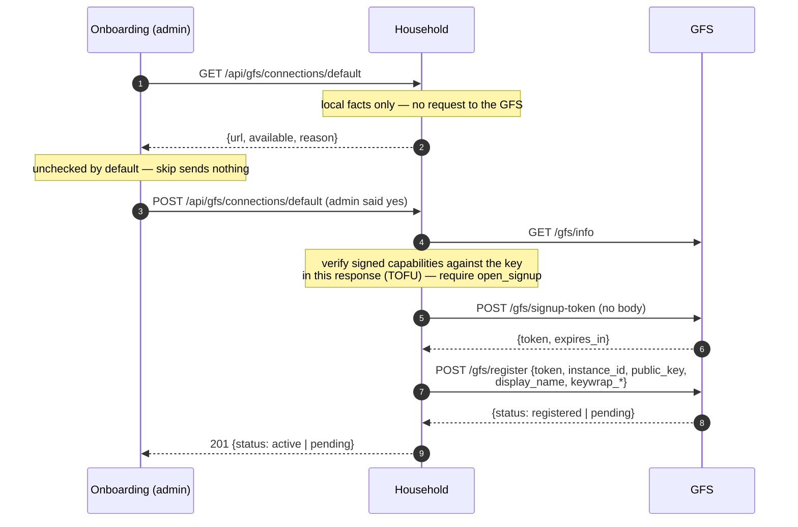
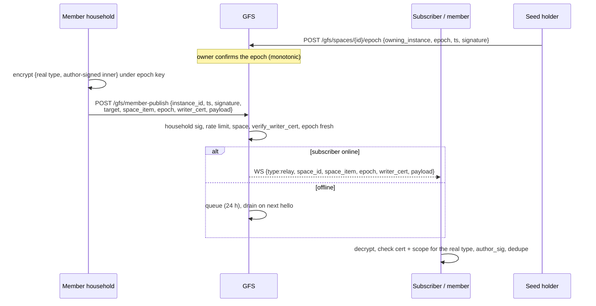
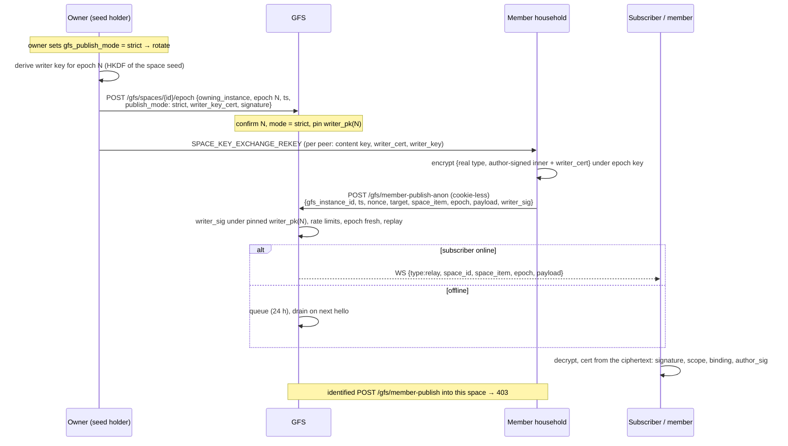
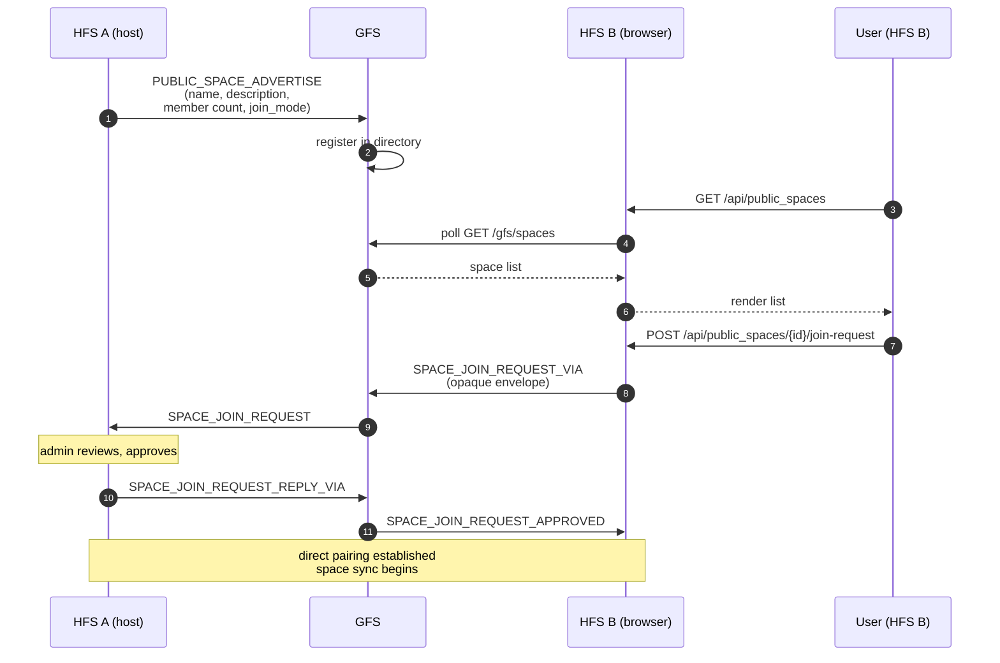

# Public-Space Discovery

How a user on one household finds a public space hosted on a
household they've never heard of. GFS is the directory; it holds
metadata, not content.

## Scope

- **HFS**: publishes a space it wants to make public; subscribes to
  the GFS directory to browse others; relays join requests through
  GFS to hosts it's not yet paired with.
- **GFS**: maintains the global registry of published spaces,
  serves `GET /gfs/spaces`, and forwards opaque `_VIA` envelopes
  between unpaired instances.

## Event types

`PUBLIC_SPACE_ADVERTISE`, `PUBLIC_SPACE_WITHDRAWN`,
`SPACE_DIRECTORY_SYNC` (peer-to-peer snapshot, distinct from GFS).

Join-request events belong to the [invites](./invites.md) flow but
ride on the same `_VIA` relay pattern.

GFS fan-out event types (connection-server wire, not
`FederationEventType`): `space_post_public` and
`space_subscriber_key_handoff` (authority-relayed via `/gfs/publish`), and
`space_item` (v_49, a member-published item via `/gfs/member-publish` — the
real item type is inside the ciphertext).

## Transport (SH ↔ GFS)

The Social Home ↔ GFS link is split by direction:

- **SH → GFS** is plain HTTPS REST under `/gfs/*` (`register`,
  `publish`, `subscribe`, `report`, `appeal`, `spaces`). Synchronous
  request / response with explicit status codes; no shared session
  state. **Every mutating call that names a household is Ed25519-signed by
  that household and verified against its registered public key** — there is
  no unsigned path. The one deliberate exception is the content relay
  `publish`, which names no household at all (see below):
  - `spaces/{id}/publish` (space metadata) requires a mandatory household
    signature over its canonical body; an empty / malformed / invalid
    signature is rejected with `403`, so a registered peer can never
    overwrite another household's listing.
  - `spaces/{id}/unpublish` is the **owner's withdrawal** of a listing and is
    signed the same way (`{action: "unpublish", owning_instance, space_id, ts}`,
    ±300 s replay guard). The signature proves *which* household is calling, so
    the GFS additionally checks that the caller **is** the space's
    `owning_instance` — a registered peer that learned a space id (they travel
    in discovery links) cannot delist someone else's space. Withdrawal is a
    **distinct, reversible state** from a moderator ban: it sets `withdrawn` and
    never touches `status`, so the owner's next signed publish restores the
    listing, while a GFS admin's `status='banned'` stays sticky against
    re-publish. The restoring publish must be **fresh**: `publish` carries an
    optional `ts` inside its signed canonical body, replay-guarded ±300 s, and
    only a publish carrying one clears `withdrawn`. A publish without `ts` (an
    older household, kept working on purpose so an upgraded GFS doesn't 403
    the whole fleet) still refreshes metadata but leaves `withdrawn` as-is —
    otherwise one captured publish body would re-list a delisted space forever.
    Once every household ships `ts` it becomes mandatory. Withdrawal affects **discoverability only** — the space drops
    off `GET /gfs/spaces`, `GET /gfs/spaces/{id}` and the public pages, while
    the relay (`publish`) and existing subscribers are untouched. Withdrawal
    also **deletes every invite link** minted for the space
    (`gfs_invite_tokens`): those are standing public URLs already sitting in
    other people's chats, so leaving them live would keep a working side door
    into a delisted listing. Re-publishing restores the listing, not the old
    links — the owner mints fresh ones.
  - `spaces/{id}/publish` also carries **two independent dials**, both inside
    the same signed canonical body — so no on-path party can flip either:

    | Field | What it governs | Values |
    |---|---|---|
    | `join_mode` | how a person becomes a **member who can post** | `invite_only` / `open` / `request` |
    | `allow_subscribers` | whether **strangers may follow read-only** — i.e. whether the listing is publicly **readable** | `true` / `false` |

    Readability is `allow_subscribers`, and *only* `allow_subscribers`. All
    four combinations are meaningful: `invite_only` + `true` is a broadcast
    space (invited people write, anyone may read), `open` + `false` is
    joinable but not publicly readable.

    | `allow_subscribers` | Listed in the directory | Publicly readable |
    |---|---|---|
    | `true` | yes | yes — `POST /gfs/subscribe` seats the caller, content relays |
    | `false` | **yes** | **no** — subscribe is refused `403`, no content relay, no content key; any seats it already had are purged |

    A space with followers off is therefore an *advert*: people can find it
    and ask to be let in, but nothing inside it is published. Enforcement
    is symmetric on both sides of the wire — the host relays nothing, and
    the GFS refuses to seat a subscriber.

    Both fields are **optional on the wire** for the mixed-version window and
    each is folded into the signed bytes only when present (an older household
    signs a body without the key; stripping either in transit only moves the value
    towards the *more* restrictive one). A missing or unknown `join_mode`
    stores the fail-closed `invite_only` and a missing `allow_subscribers`
    stores the fail-closed `false`; so do the `0009` / `0010` migrations'
    column defaults for rows published before each field existed. That is a
    deliberate choice over a backfill: an unreadable-but-listed space is the
    safe error, and the truth arrives by itself one reconnect later, because
    every GFS-WS (re)connect re-publishes the metadata of every space this
    household published to that server (the NULL-pin self-heal below).
    When a publish carries an **explicit** `allow_subscribers: false`, the
    GFS also **drops that space's subscriber rows** (logged at INFO with the
    count): the owner has withdrawn readability, and seats taken while the
    space was readable would otherwise linger forever on a space that relays
    nothing. An **absent** key does *not* purge. It gates (the stored `0`
    refuses every new subscribe) but keeps the existing seats: absent means
    "this household does not know the field", not "the owner withdrew
    readability", and evicting on it would mass-evict every reader on a
    mixed-version server the moment one un-upgraded household re-published.
    The gate reverses itself on the owner's next publish; a purge does not.
  - `spaces/{id}/invite` (+ `invite/{gfs_token}`) mint and revoke those links,
    owner-signed with an `action` discriminator inside the signed bytes. The
    public half is `GET /join/{gfs_token}`, which renders the space's
    already-public directory metadata next to a `socialhome://invite#<blob>`
    code the visitor pastes into their own Social Home. The blob is opaque to
    the server and the page **writes nothing** — see
    [invites.md](invites.md#the-mint--landing-leg--where-the-blob-comes-from).
  - `spaces/{id}/publish` additionally carries the space's Ed25519
    **authority** verify key (`identity_public_key`, hex). The GFS
    **TOFU-pins** it on the first publish. After that the pin moves **only on
    an owner-certified rotation** (v_44): when the owner revokes an admin
    household it rotates the key and its publish carries `authority_cert`
    (inside the signed body, which must then carry a fresh signed `ts`). The
    GFS re-pins only when the cert verifies against the owner's REGISTERED
    key (`client_instances.public_key`, which must derive to
    `owning_instance`), names exactly the offered key, and has a higher
    `key_epoch` than the cert it stored (`global_spaces.authority_cert`,
    migration `0013`; none = epoch 0). Anything else keeps the pin and logs a
    warning. The cert names no member and no reason: the GFS learns that a
    rotation happened, and when. It stays inside the GFS (ordering and
    cluster sync); the public directory serves only the key and the GFS's own
    re-pin counter (`authority_rotation_seq`, migration `0013`). An ordinary upsert — including a cluster
    `NODE_SYNC_SPACE` — never moves a set pin; a peer node's sync re-pins only
    through the same cert check, and max-merges the peer's
    `authority_rotation_seq` for the pin it now holds, so a node never serves
    a lower seq than its peer did. The seq is capped at 2^63−1; a node that
    reaches the cap stops advancing it, so a hostile cluster peer that gossips
    the cap freezes follower re-pins on that GFS (mirrors need a strictly
    higher seq). Cluster peers are trusted operator nodes, so this is a
    documented residual, not a gate. A GFS advertises the feature as
    `authority_rotation: true` in its signed `/gfs/info` capability block; a
    household sends a GFS without it no cert (an older GFS would fail the
    signature over a field it doesn't know) and warns that the old key keeps
    authorizing relays there.
  - `publish` (relay) is **anonymous**. The canonical body is exactly
    `{space_id, event_type, payload}` — no household identity — and the only
    authenticator is the **space-authority signature** carried inside the
    opaque `payload` (`authority_sig` + `authority_sig_suite`), verified
    against the TOFU-pinned `identity_public_key`. A connection server must
    not learn WHICH household relayed a public/global-space event, and it
    does not need to: the signature authorizes the relay and `space_id`
    routes it. Because any seed-holder — the owner or a delegated admin —
    can produce that signature, a space keeps relaying while its owner is
    offline (the owner-offline-spaces epic). The GFS stays blind to the
    content: it verifies a signature over opaque bytes and fans out, never
    decrypting.

    The **owner path is gone** — there is no longer a
    `from_instance == owning_instance` shortcut that relays any unsigned
    `event_type`. The authorized event types are exactly
    `AUTHORITY_RELAY_EVENT_TYPES`: `space_post_public` (Phase 5a) and
    `space_subscriber_key_handoff` (Phase 5b-b — see below). The signature
    is always verified under the caller's **wire** `event_type`, which must
    be in that set, so a payload signed for one type can't be replayed under
    another. Fail-closed — a missing / present-but-invalid authority sig, an
    unknown suite, an unpublished or banned space, a space with no pinned
    pubkey, or a wire `event_type` outside the set are each rejected.

    **Legacy bodies are tolerated, never trusted.** An older household still
    POSTs `{…, from_instance, signature}`. When either field is present the
    household transport signature is verified exactly as before (a bogus
    legacy field must not be a free pass) and the identity is then
    *discarded*: it authorizes nothing, never enters the fan-out frame, and
    is never logged.

    A sibling hardening pass makes the response `{"status":"published",
    "delivered_to": <count>}` (no subscriber ids), collapses every
    authorization failure into one uniform `403` body so the endpoint is not
    a space-existence / ban / pin oracle, adds a per-IP rate limiter that
    honours `X-Forwarded-For` only from trusted proxies, and caps the request
    body. The exact limits and setting names live in
    [`docs/api.md`](../api.md).
  - **Capability discovery — signed.** The GFS↔HFS leg has no `proto_version`
    negotiation, so capabilities ride `GET /gfs/info`. That endpoint is
    unauthenticated, so the capability itself is **signed**: the response
    carries

    ```json
    {"capabilities": {"anonymous_publish": true},
     "capabilities_sig": "<b64url Ed25519>",
     "capabilities_sig_suite": "ed25519"}
    ```

    signed with the GFS's **own identity key** — the one already published in
    the same response as `public_key` and pinned (TOFU) by every paired
    household. That key is random per deployment: the GFS mints a 32-byte seed
    on first boot and persists it as `<data_dir>/gfs_identity.seed` (0600), or
    takes `[server] signing_seed_hex` / `GFS_SIGNING_SEED` when an operator
    manages the secret externally. It used to be *derived* from
    `gfs_instance_id`, which `/gfs/info` serves in the clear — anyone could
    recompute the private key and sign their own capability block, so the
    signature proved nothing. Signing bytes are `b"gfs-capabilities:v1:"` + canonical JSON
    (`sort_keys`, compact separators) of
    `{"gfs_instance_id": …, "capabilities": {…}}`, so a block can't be lifted
    onto another server or another statement that key signs
    (`socialhome/capabilities_sig.py`; suite tag per the
    crypto-suite rule, unknown suite → rejected, never defaulted). The
    top-level `anonymous_publish` mirror stays for readability and is
    **informational only**.

    **There is no identified fallback — the household fails closed.** A
    household never sends `from_instance` or a household transport signature
    to a GFS, whatever `/gfs/info` says. On a COLD cache it cannot tell a
    stripping MITM from an old GFS (both show no verifiable block), so both
    get the same answer: **no publish**, plus one WARNING per connection
    naming the GFS. An old GFS build therefore receives no space publishes
    until it upgrades. An unreachable `/gfs/info` is "unknown", not "no": the
    publish waits in the household's retry queue, which re-checks the
    capability before every attempt and sends the identity-free body once it
    is proven. Stripping on-path now buys an attacker a denied relay, never
    an identity.

    **What signing buys:** the capability cannot be *forged* toward a GFS
    that would `403` the anonymous body, a tampered-but-present block is
    named as tampering rather than age, and a valid `true` latches (the
    ratchet below), so a later strip cannot stop the relay mid-life.

    A GFS **rollback** to a pre-capability build interacts with that latch the
    other way: a household that already latched `true` keeps sending the
    identity-free body, which the rolled-back server `403`s, until that
    household's process restarts (the ratchet is RAM-only). Rolling a GFS
    backwards is therefore a breaking change for latched households, not a
    graceful degrade.

    The household caches the verified answer per connection (RAM only — it is
    a property of the remote server's build, so a column would go stale the
    moment an operator upgrades), refreshing it at pair time, on every GFS-WS
    reconnect, and once on demand when a publish finds it unknown. Three rules
    guard the cache:

    - **Only a verified block sets it.** Missing block, bad signature or an
      unknown suite → `False` (no publish) plus **one** WARNING per
      connection, worded so an operator can tell "older GFS / stripped in
      transit" from "block FAILED verification against the pinned key".
    - **It ratchets up.** Once seen `true` under a valid signature, a later
      fetch without it does **not** downgrade it for the rest of the process:
      "capability downgrade ignored" is logged and relays stay identity-free.
      A GFS cannot legitimately lose a capability its build has. The ratchet
      is RAM-only — a restart starts from unknown again.
    - **A failed probe is negative-cached for 30 s**
      (`GFS_INFO_NEGATIVE_TTL_S`) — never as `False`, only as "don't re-probe
      yet", so a GFS whose `/gfs/info` is down while `/gfs/publish` is up
      costs one 10 s timeout per 30 s instead of one per publish.

    Unknown → legacy is the safe default, because the legacy body is accepted
    by **both** an old and a new GFS while the identity-free one would `403`
    on an old one. The rollout matrix:

    | | **New GFS** (signed `anonymous_publish`) | **Old GFS** |
    |---|---|---|
    | **New household** | identity-free body; nothing to learn | legacy body + **one** WARNING per connection naming the *server* (never the space) |
    | **Old household** | legacy body accepted: verified, then discarded | legacy body, as before |
  - **`https://` at pair time.** A GFS URL (from the QR or pasted) must be
    `https://` unless the host is loopback, `localhost`, RFC1918, `fc00::/7`
    or `fe80::/10` — a LAN or demo-harness GFS on `http://127.0.0.1:<port>`
    stays allowed, a public one must be TLS. Enforced before the first byte
    leaves (`GfsConnectionService.pair`); DNS is never resolved, so the
    check can't be turned into a rebinding oracle. Without it the very fetch
    that pins the key and reads the signed block is rewritable on-path. The
    household's own address is not part of the exchange — registration
    carries no `inbox_url`.
  - **NULL-pin self-heal.** A space whose GFS row pinned no authority key
    `403`s every relay, and nothing else re-publishes its metadata. So on
    every GFS-WS (re)connect the household re-publishes the metadata of each
    space it has published to that server. This is idempotent (the pin only
    moves on an owner-certified rotation, which the re-publish also carries),
    sequential, and fail-soft per space.
  - **Replay / dedupe contract.** The authority signature binds the space id
    and the (opaque) `payload`, but **no timestamp, nonce, or epoch**, so a
    captured authority-signed payload stays valid forever and anyone who saw
    one can re-POST it. The GFS bounds the resulting burst with a
    **content-blind dedupe**: it remembers a BLAKE2b digest of each authorized
    payload — over the same canonical JSON the authority signature covers — for
    **5 minutes**, and answers a byte-identical re-POST with `200` /
    `delivered_to: 0` and no fan-out. It still can't dedupe on the post id:
    that lives inside the encrypted payload.

    That cache is in-memory and **per GFS node**, so it is a burst bound, not
    a content-id store. Past the TTL, after a restart, or on a sibling node the
    same bytes fan out once more — in a cluster of N nodes behind one address a
    replay burst is suppressed only **1-in-N**, since each node must see the
    bytes once before it starts suppressing them. The standing content-layer
    backstop is therefore still **subscriber-side dedupe by the post id**
    carried inside the payload, enforced by the HFS `space_public_inbound`
    consumer (the same way moments dedupe by `moment_id`), and the relay stays
    at-least-once.
  - `subscribe` and `unsubscribe` each require a signature over
    `{action, instance_id, space_id, ts}` (replay-guarded ±300 s on `ts`).
    The `action` is inside the signed bytes (domain separation), so a
    subscribe signature can't be replayed as an unsubscribe or vice versa.
    The signature binds the request to `instance_id`, so a caller can only
    (un)subscribe **itself**, and a subscribe's target space must already
    be published — the GFS no longer mints a pending row from an
    (unauthenticated) subscribe. A subscribe also requires the target
    space to be publicly readable: `allow_subscribers == false` → `403`
    (`space is not publicly readable`). Note this is **not** `join_mode` —
    an `invite_only` space that allows subscribers seats them normally.
- **GFS → SH** is a persistent WebSocket the SH opens to
  `wss://<gfs>/gfs/ws`. The first frame is a signed hello
  `{type:"hello", instance_id, ts, sig}`; once accepted the GFS pushes
  `{type:"relay", space_id, event_type, payload}` frames as fan-out
  happens — **four keys, no `from_instance` and no GFS-added target id**.
  The frame goes to **every** subscriber: having never learned who
  published, the GFS can no longer exclude the publisher, and a household
  that gets its own post back drops it on the self-echo guard. That socket
  is the **only** delivery path: the GFS holds no household address (GFS
  migration `0018` dropped the `inbox_url` it once registered, together with
  an HTTPS-inbox fallback that could never succeed), so a frame for a
  household whose socket is down is not delivered and waits for the
  household to reconnect (Phase 5b-d below re-triggers the key handoff; a
  missed post is recovered by the subscriber-side refresh, never by the
  GFS). The GFS also pushes a `{type:"new_subscriber", space_id,
  subscriber:{instance_id, identity_public_key, keywrap_public_key,
  kem_suite, keywrap_sig}}` frame to a space **owner** when a household
  subscribes, so a seed-holder can hand the new subscriber the content key
  (Phase 5b-b, below). This frame is best-effort — dropped if the owner has
  no socket; the 5b-c reconcile backstops an offline owner, and the
  subscriber's own (re)connect re-triggers the notify (Phase 5b-d).
- **A rejected hello names no reason that leaks registration.** An unknown
  or inactive `instance_id` and a bad (or undecodable) signature for a
  registered one both close `4401` with the single reason `auth-failed`, and
  the unknown branch still runs one Ed25519 verify (against a fixed dummy key
  nothing signs with), so neither the close reason nor the time to it tells a
  prober whether an id is registered. Older GFS builds sent `unknown-instance`
  / `bad-signature`; households treat all three as "re-pair needed".
  Freshness and shape failures (`ts-skew`, `hello-timeout`, `missing-fields`
  …) keep their own reasons — they are about the caller's bytes, not the id.
- **Queued frames reach a household on any cluster node.** Cluster nodes
  share one database — so one `gfs_envelope_queue` — but each knows only its
  own sockets. A node that queues an envelope or member item for a household
  it holds no socket for sends one coalesced, fire-and-forget
  `NODE_DRAIN_HINT {instances:[…]}` (ids only; ≤ 0.5 s of batching, ≤ 256 ids
  a frame) to its member peers; the node that does hold the household's
  socket drains its queue right away instead of on the next reconnect.
  Drains are serialised per household, so a hello drain and a hint drain
  never deliver a row twice.

### Connecting a household: QR code or open sign-up

A household pairs with a GFS by registering with a **single-use pairing
token** (10-minute TTL). There are two ways to get one:

- **QR code / pairing code** — scanned or pasted from the GFS landing page
  (`socialhome://gfs-pair/{base_url}?token=…`, see
  [pairing](./pairing.md)); an admin adds it in Settings → Connections.
- **Open sign-up** — the GFS operator turns on `[policy] open_signup`
  (`GFS_OPEN_SIGNUP`, **off by default**) and the GFS hands out tokens over
  `POST /gfs/signup-token`. This is what the one-click **"Connect to the
  GFS"** step in household onboarding uses, against the household's
  `[gfs] default_url` (`SH_GFS_DEFAULT_URL`, default
  `https://gfs.social-home.io`; empty hides the step).

The onboarding step is **opt-out and pre-ticked** (owner decision
2026-10-08): the box is ticked by default, but nothing is sent to any GFS
until an admin reaches the step and presses Connect — unticking it, or
skipping the tour, connects nothing (`tests/protocol/
test_gfs_onboarding_opt_in.py` pins that the household never contacts the
GFS on its own). It needs no External URL: the GFS relays
over the WebSocket the household opens, so registration carries no household
address — which is what lets the Home Assistant App connect during first-run
onboarding, before it has any public URL. The household learns whether to
offer the step from local facts only (`GET /api/gfs/connections/default`:
`reason` is `disabled` or `already_connected`, else the step is available)
— it never probes the GFS to decide.


```mermaid
sequenceDiagram
    autonumber
    participant SPA as Onboarding (admin)
    participant H as Household
    participant G as GFS
    SPA->>H: GET /api/gfs/connections/default
    Note over H: local facts only — no request to the GFS
    H-->>SPA: {url, available, reason}
    Note over SPA: unchecked by default — skip sends nothing
    SPA->>H: POST /api/gfs/connections/default (admin said yes)
    H->>G: GET /gfs/info
    Note over H: verify signed capabilities against the key<br/>in this response (TOFU) — require open_signup
    H->>G: POST /gfs/signup-token (no body)
    G-->>H: {token, expires_in}
    H->>G: POST /gfs/register {token, instance_id, public_key,<br/>display_name, keywrap_*}
    G-->>H: {status: registered | pending}
    H-->>SPA: 201 {status: active | pending}
```

What the household checks and sends:

- **Identity pin for the default GFS.** The household refuses a server
  whose `/gfs/info` presents another public key ("This doesn't look like the
  Social Home GFS. Check the address in settings.", `422
  GFS_IDENTITY_MISMATCH`) before anything else is sent; the key is compared
  in constant time, hex, lowercase-normalized. With the shipped
  `default_url` (`https://gfs.social-home.io`) the project GFS's key
  `33cf798c8c8a7ae04d06a5978242b189c421fb66b2faf61749154070aa12ab0e` is
  pinned — it changes only with an app update or an operator override. The
  instance id is not pinned by default (on the project GFS it is a label,
  `gfs-2`, not derived from the key). An operator who overrides
  `default_url` gets no pin unless they set their own `[gfs]
  default_public_key` (`SH_GFS_DEFAULT_PUBLIC_KEY`; optionally
  `default_instance_id`).
- **Same trust as a QR scan.** `/gfs/info` is fetched **once**; the signed
  capability block is verified against the `public_key` in that same
  response — the key the household then pins (TOFU, https unless loopback /
  LAN). A bare, unsigned or wrongly-signed `open_signup` counts as "closed",
  and the household never asks for a token. The pinned key is the verified
  one: there is no second descriptor fetch to swap.
- **Nothing new reaches the GFS.** The token request has no body. The
  registration body is built by the same code as QR pairing: instance id,
  public key, display name, and the key-wrap public key + its
  self-signature — what any paired household already sends. No household
  address: the GFS keeps none (an `inbox_url` an older household still
  sends is ignored — never validated, stored or echoed).
- **Approval still applies.** With `auto_accept_clients = false` the
  registration lands `pending` and onboarding says "waiting for the GFS to
  approve"; the connection turns active once the operator approves.
- **Plain errors.** Unreachable, sign-up closed, busy (rate-limited) and
  refused map to fixed household-side sentences; the GFS's own error text
  never reaches the screen.

The household↔GFS leg has no `proto_version`: `open_signup` is a signed
capability, not an `OURS` bump.

### Subscriber-side on-ramp (local space mirror)

Before a household can subscribe to a space it discovered through a GFS, it
needs a **local `spaces` row** for it: `space_subscribers` fan-out only helps
if the receiver has the space's Ed25519 authority pubkey to verify relayed
frames against, and `SpaceService.subscribe_to_space` refuses an unknown
space id.

`services/gfs_space_mirror_service.py` closes that gap. On a subscribe to an
id with no local row it walks the active GFS connections and, from the first
one whose **whole** directory (`GET {gfs}/gfs/spaces`) lists the id, fetches
`GET {gfs}/gfs/spaces/{space_id}` and seats a remote **stub** row via the
shared `stub_space_from_metadata` helper (`space_type=global`, with the
owner's real `join_mode` and `features.allow_subscribers` copied off the
directory body — a mirror is not locally joinable; joining still goes through
`POST /api/public_spaces/{id}/join-request`). Both are read strictly
(`normalize_join_mode`; `is True` for the flag) so an older or hostile GFS
cannot widen access through a missing field or Python truthiness.

- **No per-space probe of a server that doesn't list the space.** The detail
  GET names the space, so sending it to every paired GFS would tell each
  operator (and hand it the household's address) which space this household
  is after. The directory read is non-specific — the same request the
  discovery poll makes — and comes from one cache shared with member publish
  (`services/gfs_directory.py`, over the cookie-less publish session): the
  servers' directories are read concurrently, each kept 10 min (an empty one
  1 min, an unreadable one 5 s), concurrent misses share one download, and a
  directory over 50 000 ids is refused (logged) rather than truncated. A
  cached copy lacking the id is re-read once it is 5 s old, so a space
  published a moment ago is followable at once. An unreadable directory
  proves no listing: that server gets no detail GET.
- **Fail-closed validation.** The listing must be `status: "active"` and must
  carry a well-formed 32-byte-hex `identity_public_key`; anything else is
  skipped rather than mirrored. A stub with an unverifiable pin would accept
  forged relay frames.
- **The pin is TOFU at the household.** A space id is a `uuid4`, not derived
  from the authority key, so the served pin cannot be self-certified. The
  repository is what makes it stick: `SqliteSpaceRepo.save` excludes
  `identity_public_key` from its upsert, so a later refresh — from this GFS or
  another — can never move a pin. A hostile GFS can therefore fabricate a
  space it controls the authority key for, but cannot hijack one already
  pinned. `owning_instance` from the listing is *not* an authenticated
  envelope sender, which is why every inbound relay verifies against the
  pinned key, never the claimed owner.
- **A follower heals its pin from the GFS listing (v_44).** When the owner
  rotates the space authority key, the GFS re-pins only after verifying the
  owner's `authority_cert` against the owner's registered key — and keeps
  the cert to itself: it names the owner household's identity key and
  carries the rotation time, neither of which belongs on an unauthenticated
  page — and so does the cert's wall-clock-based epoch, which would date the
  revocation. `GET /gfs/spaces` and `GET /gfs/spaces/{id}` serve only the
  current `identity_public_key` and `authority_rotation_seq`, the GFS's OWN
  counter (+1 per accepted, cert-verified re-pin). A household that merely
  FOLLOWS a public / global space (at least one local `subscriber` seat and
  no other) re-pins from that pair when a relayed `space_post_public` /
  `space_subscriber_key_handoff` fails the authority check (re-fetched at
  most once a minute per space, then verified once more) and on every GFS-WS
  reconnect — but only from the GFS connection that SEATED the mirror
  (`spaces.mirror_gfs_id`, recorded at seat time) and only to a strictly
  HIGHER seq than the one it stored (`spaces.gfs_rotation_seq`). **Trust
  model:** the same trust a follower already places in that one GFS for its
  first (TOFU) pin; the seq bound stops it from rolling the pin back, and no
  other connection server can move it. A disconnect + re-pair of that same
  server mints a new local connection id; on the next reconnect the anchor
  moves to it only when the new pairing has the same `gfs_instance_id` AND
  pins the same server public key as the connection the seat was taken over
  (both kept on the `gfs_space_seats` row, since the old connection row is
  deleted). A re-pair under a different key inherits nothing — that mirror
  keeps its old anchor and no longer heals. A household with a real seat, or a
  private stub (a pending invite), never takes a pin from a GFS — it re-pins
  from the owner's own cert, delivered over federation (`spaces.md`). A
  mirror seated before v_44 has no recorded provenance and does not heal
  from a GFS until it is re-mirrored.
- **Known gap — a GFS can poison a space this household hasn't met yet.**
  "Cannot hijack one already pinned" only helps once a pin exists. A hostile
  GFS can list a *real* space id (ids are harvestable from any public
  directory) with the real `owning_instance` but an authority key it
  controls; a local subscribe then seats that pin. A later legitimate §D1b
  `SPACE_PRIVATE_INVITE` from the real host passes `can_seat_remote_stub`
  (the owner matches) and re-saves the row, but the upsert excludes
  `identity_public_key` — so the attacker's pin stays permanently: genuine
  space-authority frames fail verification (a permanent DoS for that space
  at this household) while the hostile GFS's forged frames verify. The blast
  radius is therefore "spaces this household first learned about through
  that GFS", not "spaces only that GFS knows about". The fix — recording
  mirror provenance on the row so an authenticated §D1b sender outranks a
  GFS listing when re-pinning — is tracked as a TODO at the seating site in
  `services/gfs_space_mirror_service.py`.
- **Ordering.** The GFS-side `subscribe` is sent only after every local
  refusal (public-tier check, ban, §CP.F1 age gate) has passed, so a
  locally-refused user is never registered on the relay.
- **Teardown, on positive evidence only.** When the last local subscriber of
  a mirrored space leaves, the household unsubscribes from every server
  that seats it (below; best-effort — a down GFS never blocks the local
  leave) and purges the stub; the `spaces` cascade takes `space_keys` with it, so the content key
  doesn't outlive the mirror. Both steps run **only** when the row is
  provably a GFS mirror: `space_type=global`, owned by another instance, no
  space seed held, no local member left, *and* a `public_space_cache` row for
  the id (the directory poll is that table's only writer). A public/global
  stub learned from a direct peer matches the first four and must not be
  touched — the signed, identity-bound unsubscribe would disclose to every
  GFS operator a relationship with a space they never knew about, and the
  purge would destroy content nobody asked us to forget. Without the
  evidence, only the local member row goes.
- **(Un)subscribes go only where the seat is.** The household's
  `/gfs/subscribe` (subscribe or unsubscribe) is signed and identity-bound,
  so sending it to a GFS that never seated the subscription would tell that
  operator the household follows the space. Every subscribe — a follower's,
  the reconnect self-heal's, a member's auto-subscribe — therefore records
  the seat in `gfs_space_seats` (0092) under the server's own
  `gfs_instance_id`, which survives a disconnect + re-pair (the local
  connection id does not). Teardown and re-subscribe reach exactly the
  recorded servers:
  - when the **last local user** of a space leaves (follower unsubscribe,
    member leave or removal — `SpaceMemberLeft`), every recorded seat is
    released; a server that is not connected right now keeps its row until
    it reconnects;
  - each GFS-WS **reconnect** re-takes that server's recorded seats still
    wanted and releases those no local user wants any more (a leave missed
    while it was down);
  - a pre-v44 mirror (no provenance, no recorded seat) falls back to the
    servers whose **whole** directory lists the space, and contacts none
    when it can't be read;
  - **reactive teardown**: a seat nothing local records — such a mirror
    whose space was withdrawn from the directory (the GFS keeps its relay and
    subscribers), a connection re-paired away before 0092 — shows itself when
    that server relays the space. A relay frame for a space no local user is
    seated in proves that server seats us, so it — and only it — gets an
    unsubscribe, at most once per 10 min per (server, space). A seat taken in
    the last 2 min is spared (the local member row is written after the
    subscribe succeeds).

### `allow_subscribers: false` — listed, never relayed

Being listed in the directory and being publicly readable are two different
things, and so are being *joinable* and being *readable*. A **public/global
space whose `features.allow_subscribers` is off is published to the GFS
directory but its content is never relayed to it, and its content key is
never sealed to a subscriber.** The listing is deliberate: name, description
and icon are how someone discovers the space and asks to be let in. Only the
content stream stops.

`join_mode` has **no** say here. It answers a different question — how a
person becomes a member who can post — and every combination is legitimate:

| `join_mode` | `allow_subscribers` | What it is |
|---|---|---|
| `invite_only` | `true` | a broadcast space — invited people post, anyone may follow |
| `invite_only` | `false` | a private group, listed so people can ask for an invite |
| `open` | `false` | joinable by anyone, but readable only once you have joined |
| `open` / `request` | `true` | today's public space |

The gate is enforced **host-side**, at the two places where content would
otherwise leave, plus the hint that enables the first:

| Seam | Effect when `allow_subscribers` is off |
|---|---|
| `services/space_public_outbound.py` | No `space_post_public` envelope is produced — neither for a locally-authored post nor on the owner-offline remote-author relay. |
| `services/space_subscriber_key_outbound.py` | No content key is sealed to a subscriber — on the `new_subscriber` push and on every reconcile entry point (the gate sits *before* the subscriber-list round-trip, so the GFS is never even asked who subscribed). |
| `services/space_post_outbound.py` | The pre-signed `public_relay` hint is omitted from the member broadcast — it exists only so a seed-holding member can run the GFS relay, which is dead here, so nothing is signed or shipped. |

Two layers, both fail-closed: **no ciphertext** (nothing is relayed) and
**no key** (nothing sealed), so even a subscriber that obtained a frame out
of band holds an unopenable blob.

A third layer sits on the subscribe path itself:
`SpaceService.subscribe_to_space` refuses locally
(`this space does not allow subscribers`) and the GFS refuses
`POST /gfs/subscribe` with a `403`. The household check is safe even on a
GFS-discovered stub, because the mirror now carries the owner's truthful
flag.

**Members are unaffected.** Member households receive space content through
`broadcast_to_space_members` over `space_instances` (mesh-only members via
`SPACE_ROUTED`), a path that neither consults the `public_relay` hint nor
touches the GFS. The metadata publish path is likewise untouched: a space
that disappears from the directory is a regression, not the rule.

**Only the owner may flip it.** `allow_subscribers` is `_require_owner`-gated
in `SpaceService.update_config`, exactly like `delegated_admin_authority`: a
delegated remote admin holds the space seed for day-to-day config while the
owner is offline, but exposing the space's content to strangers — or
withdrawing it — is the owner's decision. The gate is enforced on all three
paths that can reach the config: the local edit, the forwarded
`SPACE_REMOTE_ADMIN_ACTION` (the host re-executes it *as the owner*, so
`_run_admin_action` pins the flag to the stored value), and the inbound
authority-signed `SPACE_CONFIG_CHANGED` (a seed holder's signed `features`
block is accepted, but on the household that HOSTS the space both owner-only
flags are pinned to the stored values before the row is saved — logged at
INFO; a household merely *mirroring* the space applies the value it is told,
since it is not the authority for that space).

**Changing the flag re-publishes.** Flipping `allow_subscribers` (or
`join_mode`) on a global space re-publishes its metadata to every paired GFS
immediately, rather than waiting for the owner's next WS reconnect — and a
publish that lands the flag as explicitly off is what PURGES the seats taken
while it was on. The owner's own household drops its **local**
`role='subscriber'` rows in the same edit, publishing the usual member-left
event, so a follower is never left reading out of the local DB a space that
was withdrawn from them.

**Readers re-register on reconnect.** The GFS seat is registered only on a
household's first-ever subscribe, so a purged seat would otherwise never come
back — the household would show "subscribed" forever and receive nothing.
Every GFS-WS (re)connect therefore re-POSTs `/gfs/subscribe` for each seat
recorded on that server (and the spaces this household writes in that it
lists) — and only those: a space seated from another GFS is never
re-subscribed here (`GfsSpaceMirrorService.resubscribe_all`, wired beside the
pin self-heal). The
GFS's `add_subscriber` is an upsert, so a seat we still hold is a no-op, and a
`403` (the owner really did withdraw readability) is swallowed at DEBUG. This
is what makes the purge recoverable: turn the flag back on and the readers
return by themselves.

### HFS producer + consumer for public space content (Phase 5a2)

The GFS only *relays* — the HFS owns the encryption and authorship
boundary on both ends:

- **Producer** (`services/space_public_outbound.py`) subscribes to
  `SpacePostCreated`. When a post lands in a **PUBLIC/GLOBAL** space on a
  household that **holds the space seed** (owner or delegated admin), it
  builds an inner content payload — `{post_id, space_id, author_user_id,
  author_pk, author_username, content, media refs, created_at, author_sig,
  …}` — and AES-256-GCM-encrypts it under the space's **existing** content
  key (`space_crypto_service.encrypt`, no new key). `author_sig` is a
  **per-author** Ed25519 signature: the author's **household identity seed**
  signs the canonical, domain-separated bytes over the attributable inner
  fields (`services/space_public_author.py:author_signing_bytes`, prefix
  `space-post-author:v1:`, sorted compact JSON, excluding `author_sig`
  itself). It rides **inside** the ciphertext, so the GFS never sees it. The
  wire envelope is only `{space_id, epoch, encrypted_payload, authority_sig,
  authority_sig_suite}` — **no plaintext content, author, or author_sig ever
  leaves the household**, so the GFS and any relay stay content-blind
  (Encryption-First Rule). The envelope is **space-authority**-signed with
  the space seed under `space_post_public` and POSTed to every GFS the space
  is published to (`gfs_connection_service.publish_space_event`). Skipped: a
  household without the seed, a non-public space, and an inbound-driven
  (`origin_instance_id` set) event with no relay hint (pure loop guard).

  Two independent signatures protect a relayed post: the **space-authority**
  signature on the envelope (a seed-holder, verified against the pinned space
  key — proves the relay is authorised) and the **per-author** `author_sig`
  on the inner content (the author's household key, verified against
  `author_pk` — proves the named author wrote it). The self-cert only binds
  `author_pk ↔ author_user_id`; both are public, so without `author_sig` a
  seed-holder could attribute any post to any member. The per-author signing
  bytes cover `hidden_from_feed` too, so a relay can't flip a post's
  feed-presentation intent.

  **`identity_anchor` and cross-version compatibility.** The inner may carry
  the author's `identity_anchor` (v_26 — the `user_id` derivation input, see
  [`user-identity.md`](./user-identity.md)); when present it is signed, and
  the receiver self-certifies with
  `derive_user_id(author_pk, identity_anchor if present else author_username)`.
  The GFS relay path has **no proto-version negotiation**, so
  `build_signed_author_inner` keeps the v_25 wire shape for username-anchored
  authors by construction. Every `users` row has a non-NULL anchor — migration
  `0041` backfilled `identity_anchor = username` for pre-existing users, and
  `derive_local_user_id` still mints `= username` for every admin-mirror and
  HA-person row, so this is a permanent class of authors, not a rollout tail.
  The builder — not the callers — treats `anchor == username` (or an empty
  anchor) as *absent* and writes/signs **no** `identity_anchor` key, so such an
  author's signed bytes are byte-identical to the pre-anchor layout and verify
  on a sub-v_26 subscriber; only an author whose anchor differs from their
  username (uuid4-provisioned on v_26+) carries the key, and those posts
  verify on v_26+ receivers only. Neither direction is forgeable: adding
  `identity_anchor: <username>` to a username-anchored inner breaks the sig on
  v_26+ and is ignored on v_25; stripping a uuid author's anchor makes the
  derivation fall back to the username, which no longer matches
  `author_user_id`.

- **Remote-author relay** (owner-offline-capable). A plain member's public
  post no longer waits for the owner: when **any** member creates a
  public/global-space post, the author's household builds the same per-author
  signed inner (`space_public_author.build_signed_author_inner`) and attaches
  it as a `public_relay` hint on the member-to-member `SPACE_POST_CREATED`
  broadcast (public/global spaces only — a private space never attaches one).
  Any **seed-holding** household (owner or delegated admin) that receives the
  broadcast (`space_public_outbound`, inbound-driven branch) verifies the hint
  end-to-end — the author's `author_sig` + self-cert
  (`verify_signed_author_inner`) **and** that the inner's signed `space_id`
  matches the event's space (cross-space injection guard) — then relays the
  inner **verbatim** to the GFS under **its own** space-authority envelope
  signature. So a member's public post reaches subscribers even when the
  owner *and* the author are offline. The relay stays content-blind (it never
  re-signs the author bytes, only the envelope), the GFS stays content-blind,
  and subscribers dedupe by `post_id` (a post relayed by several seed-holders
  imports once). The `public_relay` field is **fail-soft** — an older peer
  that doesn't understand it simply ignores it and the broadcast still
  delivers; no new event type and no capability bump.
- **Consumer** (`services/space_public_inbound.py`) handles the relayed
  `space_post_public` frame off the SH↔GFS WebSocket. (An inner with no
  `author_sig` is a removal notice; an approved post carries the authority's
  mark — see
  [Moderation outcomes on the host relay](#moderation-outcomes-on-the-host-relay).) Defence-in-depth —
  the GFS already verified, but the relay is never trusted: it (1)
  re-verifies the authority signature against the locally-mirrored
  `spaces.identity_public_key`, (2) decrypts under the per-space content
  key for the stated epoch (dropping gracefully — including a tampered
  ciphertext whose AEAD tag fails — if the key isn't held yet; a GFS
  subscriber receives its content key via the Phase-5b-b handoff below),
  (3) **self-certifies the author**
  (`derive_user_id(author_pk, username) == author_user_id` — binds pk↔user_id
  only), (4) **verifies the per-author `author_sig`** against `author_pk` over
  `author_signing_bytes` (fail-closed if missing, malformed, or invalid — this
  is what actually prevents a seed-holder from forging authorship), (5)
  **dedupes by `post_id`** (the at-least-once relay's content-layer
  backstop), then persists to `space_posts` and republishes
  `SpacePostCreated` (with `origin_instance_id` set) so realtime/search
  light up and the federation outbound bridge skips re-fanning.

```mermaid
sequenceDiagram
    autonumber
    participant AUTH as HFS author (plain member; owner offline)
    participant SH as HFS seed-holder (owner or delegated admin)
    participant G as GFS (content-blind)
    participant SUB as HFS subscriber
    AUTH->>AUTH: build_signed_author_inner (author_sig + self-cert)
    AUTH->>SH: SPACE_POST_CREATED broadcast<br/>(public_relay hint attached; fail-soft)
    SH->>SH: verify author_sig + self-cert + space_id binding
    SH->>SH: encrypt inner under space content key + authority-sign envelope
    SH->>G: POST /gfs/publish {space_id, event_type, payload}<br/>(no from_instance; authority-signed ciphertext)
    opt transient failure (network, timeout, 408, 429, 5xx)
        SH->>SH: queue {space_id, event_type, payload}<br/>(in memory, FIFO per GFS)
        SH->>G: POST /gfs/publish — byte-identical body<br/>after backoff or the 429's Retry-After
    end
    G->>G: verify authority sig vs pinned pubkey<br/>(the ONLY authenticator)
    G->>SUB: {type:"relay", space_id, event_type, payload}<br/>(to every subscriber)
    SUB->>SUB: re-verify authority sig + decrypt + self-cert + author_sig
    SUB->>SUB: dedupe by post_id, persist
```

**A failed publish is retried, identity-free.** A transient failure of
`POST /gfs/publish` (transport error, timeout, 408, 429, 5xx) is queued per
GFS connection and re-POSTed with backoff (5 s, 30 s, 2 min, 10 min),
honouring a 429's `Retry-After`; any other 4xx is permanent and not retried.
The queue holds exactly `{space_id, event_type, payload}` — a retry is the
byte-identical identity-free body and can never add `from_instance` or a
household signature. Before each retry the household re-checks that the
space is still published there and that the GFS has proved
`anonymous_publish`; a GFS that does not support it gets no retry at all
(it never got the first attempt either). A retry whose first attempt did land
is a no-op on the GFS (the 5-minute replay dedupe) and on subscribers (the
`post_id` dedupe). The publish and its retries ride a separate cookie-less HTTP session
(`aiohttp.DummyCookieJar`), so a sticky load-balancer cookie from the
household's authenticated GFS calls cannot link them. The queue is in
memory and bounded (`services/gfs_publish_retry.py`); see
[`architecture.md`](../architecture.md#outbox-and-retries).

Relay delivery is WebSocket-only — there is no HTTPS-inbox path for a
relayed `space_post_public` (the GFS holds no household address); the
consumer is wired on the WebSocket path (mirroring the public-moments
inbound).

**Receiver rules for an identity-free relay.** Since the frame no longer
names anybody, receivers derive everything from the sealed inner:

- **Attribution comes from the inner only.** `origin_instance_id` is read
  from the decrypted, authority-signed inner payload. An outer
  `from_instance` from an old GFS is never read and never logged.
- **Self-echo guard.** The GFS fans out to every subscriber including the
  publisher, so a household drops its own post — matched on the inner
  `origin_instance_id` (our own id), at DEBUG, before any write. The
  `post_id` dedupe is a *separate*, later step and would not cover this: an
  echo arriving after a local delete would otherwise resurrect the post from
  our own copy.
- **Seal-as-gate for a key handoff.** A `space_subscriber_key_handoff`
  carries **no** `target_instance_id` and is gated by the seal itself: if
  `open_keywrap` fails, the frame was not for us and is dropped quietly at
  DEBUG (every subscriber sees every other subscriber's handoff, so anything
  louder would be pure noise). A legacy frame from an older seed-holder that
  still carries the field keeps the explicit gate — which is why dropping it
  was a producer-only change.

### What the GFS does and does not learn

State this precisely; do not soften it:

1. **The guarantee is "does not require, store, log or forward".** The GFS
   never receives the relaying household's identity on `/gfs/publish`. It is
   **not** "the GFS cannot learn it": a household normally holds an
   authenticated WebSocket to the same server from the same IP, so an
   operator can correlate a publish's source IP, timing and size with that
   session. No protocol change closes that short of a mix/onion egress.
2. **A key handoff names nobody.** A `space_subscriber_key_handoff` is
   exactly `{space_id, sealed, authority_sig, authority_sig_suite}` — the GFS
   and the other subscribers it is fanned out to learn neither the relaying
   household nor the one being onboarded. The seal is the gate. (A legacy
   sender's `target_instance_id` is still accepted by receivers, so no
   deployment is stranded.)
3. **Per-instance GFS bans cannot gate an anonymous relay.** The
   space-level ban (`status='banned'`) is the only moderation lever left on
   the relay path.
4. **Nobody learns from the GFS which households use it, or are online.**
   `POST /gfs/envelope` answers every well-formed request with the same
   `202` body, and answers it before the recipient is even looked up (the
   lookup / push / enqueue runs in the background), so neither the response
   nor its latency separates online, offline and unregistered recipients.
   The `/gfs/ws` hello fails with one `auth-failed` reason after the same
   verify work whether the id is unknown or the signature is wrong.
5. **The GFS still sees `space_id`, `event_type`, payload size and timing**,
   plus the subscriber set — it is the directory. Payload size is a bucket:
   every host-relay plaintext is padded to `ITEM_SIZE_BUCKETS`, and removal
   notices and approved posts ride the same `space_post_public` type, so a
   moderation looks like a short post.

The whole shape is pinned by the §27.9 release blocker
`tests/protocol/test_gfs_payload_minimization.py`, which drives the real
producers, the real sender and the real GFS with real crypto and asserts the
exact cleartext key set of each payload.

### Subscriber content-key handoff (Phase 5b-b)

A Phase-5a relay reaches a GFS subscriber, but the subscriber **drops** it —
it has no content key to decrypt. Phase 5b-b delivers that key, **GFS-blind**,
on a fast path driven by the GFS `new_subscriber` notify (the owner-offline
RECONCILE — a seed-holder pulling the subscriber list to catch up missed
deliveries — is **Phase 5b-c**, below):

1. **GFS notify.** On a successful `subscribe`, the GFS pushes a
   `new_subscriber` frame to the space **owner** carrying the new subscriber's
   registered Ed25519 `identity_public_key` + its published key-wrap pubkey /
   suite / self-signature (`keywrap_public_key`, `kem_suite`, `keywrap_sig`).
   Only the owner is notified (the GFS authoritatively knows `owning_instance`;
   a delegated admin catches up via 5b-c). Offline owner → frame dropped, the
   subscribe still succeeds.
2. **Seed-holder seals + relays** (`services/space_subscriber_key_outbound.py`).
   Acting only if this household **holds the space seed** and the space is
   PUBLIC/GLOBAL, it first **verifies the key-wrap binding** end-to-end
   (`federation/keywrap_seal.py:verify_keywrap_binding` — `derive_instance_id`
   + the key-wrap key's self-signature + 32-byte check). This is the
   **anti-substitution gate**: the key-wrap pubkey was learned *from the GFS*,
   so a malicious GFS could substitute one it controls; a failed binding →
   **DROP, never seal**. It then `export_current_key`s the per-space content
   key, builds the standard `{space_content_key:{key_suite, epoch, key_base64,
   rotated_by}}` meta (the same shape `apply_space_content_key_from_metadata`
   consumes), **seals** it to the verified key-wrap pubkey
   (`seal_to_keywrap` → `{kem_suite, eph_pk, ciphertext}`), wraps
   `{space_id, sealed}` and **authority-signs** it with the
   space seed under `space_subscriber_key_handoff`, and relays it through the
   content-blind GFS (`publish_space_event`). **No plaintext key ever leaves
   the household** — only the sealed ciphertext travels; the GFS authorizes the
   relay by the space-authority signature (same path as `space_post_public`)
   and fans it out. The envelope is **identity-free** — the target household
   is used locally to pick and verify the key-wrap key, never put on the
   wire — so the non-target subscribers it reaches simply can't
   `open_keywrap` it and drop it quietly.
3. **Subscriber unseals + imports**
   (`services/space_subscriber_key_inbound.py`). On the relayed
   `space_subscriber_key_handoff` frame: **re-verify** the space-authority
   signature against the
   locally-mirrored `spaces.identity_public_key` (never trust the relay/GFS) —
   a forged signature → drop, no import; `open_keywrap` with our key-wrap
   private key — this is the gate, a payload sealed to a different key →
   `InvalidTag` → dropped quietly at DEBUG (a legacy frame that names a
   `target_instance_id` other than us is still dropped by the explicit gate,
   before any unseal); parse the meta and `apply_space_content_key_from_metadata`
   (idempotent per epoch — a double delivery imports once). After the import
   the subscriber can decrypt the Phase-5a relay (a later relay/backfill
   decodes; backfill is out of scope).

```mermaid
sequenceDiagram
    autonumber
    participant SUB as HFS subscriber
    participant G as GFS (content-blind)
    participant SH as HFS seed-holder (owner)
    SUB->>G: POST /gfs/subscribe (signed)
    G->>G: add_subscriber
    G->>SH: new_subscriber<br/>(subscriber identity + keywrap pub + sig)
    SH->>SH: verify_keywrap_binding (anti-substitution)
    SH->>SH: export_current_key + seal_to_keywrap
    SH->>G: publish space_subscriber_key_handoff<br/>(authority-signed; sealed ciphertext only)
    G->>G: verify authority sig vs pinned pubkey
    G->>SUB: relay space_subscriber_key_handoff
    SUB->>SUB: re-verify authority sig (local pinned key)
    SUB->>SUB: open_keywrap + import_key
    Note over SUB: can now decrypt Phase-5a relay
```

### Owner-offline reconcile (Phase 5b-c)

The 5b-b notify reaches **only the owner** (the GFS authoritatively knows
`owning_instance`, so that's the only socket it pushes to). If the owner is
offline when a household subscribes — or the notify is simply missed — the
content key is never delivered on the fast path. Phase 5b-c closes the gap with
a **pull-based reconcile** that any seed-holder can run, so a **delegated admin
delivers the key while the owner is offline**:

1. **Trigger.** On each GFS-WS `(re)connect` (`gfs_ws_client` `on_connected`),
   the seed-holder runs `space_subscriber_key_outbound.reconcile(gfs_id)`.
   A **content-key rotation** triggers it too, scoped to the rotated space:
   after the forward-secrecy rekey a member removal / ban / §D1b kick mints
   (`_rotate_and_distribute_space_key`), the member fan-out targets
   `space_instances` — which subscribers are never in — so the rotation also
   runs `reconcile_space_everywhere(space_id)` (per published GFS:
   `reconcile_space(gfs_id, space_id)`, same guards, same seal path). Without
   it a subscriber stays dark, silently dropping every relayed frame, until
   its next reconnect. Fail-soft: a GFS that is down never fails the removal.
2. **Enumerate "spaces I hold the seed for on this GFS."** It lists every space
   **published to that GFS** (`gfs_connection_repo.list_publications(gfs_id)`)
   and keeps those that are **PUBLIC/GLOBAL** *and* whose **seed this household
   holds** (`get_space_seed` non-None). A private/household space, or a space it
   doesn't hold the seed for, is skipped (its key must never leave via the GFS,
   and only a seed-holder can authority-sign the query).
3. **Pull the subscriber list under a space-authority signature.** It signs
   `{space_id, ts}` with the space seed under `space_subscribers_query` and
   `GET /gfs/spaces/{id}/subscribers?ts=&authority_sig=&authority_sig_suite=`.
   The GFS verifies that signature against the space's TOFU-pinned
   `identity_public_key` (the same key that authorizes relay) and a ±300 s
   replay guard, then returns each subscriber's already-registered
   `{instance_id, identity_public_key, keywrap_public_key, keywrap_sig}` — no
   household address (the GFS holds none), no private data. A forged / stale / unknown-suite signature, an
   unknown space, or a space with no pinned pubkey → **403** (fail-closed).
4. **Re-seal per subscriber.** For each subscriber it runs the **identical**
   verified-seal+relay as 5b-b (`verify_keywrap_binding` anti-substitution gate
   → `seal_to_keywrap` → authority-sign under `space_subscriber_key_handoff` →
   relay through the content-blind GFS). A subscriber with no key-wrap key
   (older HFS) or a forged binding is skipped — never sealed-to.

The reconcile is **idempotent**: the subscriber's `import_key` is per-epoch
idempotent, so re-sealing on every reconnect is harmless (a re-import is a
no-op). It is bounded to one pass per connect and fail-soft at every level (an
unknown/inactive GFS, a per-space transport error, or a per-subscriber seal
failure is logged and skipped). The `GET` is a **query, not a relay** —
`space_subscribers_query` is deliberately kept out of the GFS's
`AUTHORITY_RELAY_EVENT_TYPES`, so a query-signed payload can never be replayed
onto the relay fan-out (the signing bytes bind the event type).

```mermaid
sequenceDiagram
    autonumber
    participant SUB as HFS subscriber
    participant G as GFS (content-blind)
    participant ADM as HFS seed-holder (delegated admin; owner offline)
    Note over ADM: GFS-WS (re)connect → reconcile(gfs_id)<br/>or key rotation → reconcile_space(gfs_id, space_id)
    ADM->>ADM: list published spaces I hold the seed for
    ADM->>G: GET /gfs/spaces/{id}/subscribers<br/>(authority-signed {space_id, ts})
    G->>G: verify authority sig vs pinned pubkey + ±300 s ts
    G-->>ADM: subscribers [{instance_id, identity_pk, keywrap_pk, keywrap_sig}…]
    loop each subscriber
        ADM->>ADM: verify_keywrap_binding + seal_to_keywrap
        ADM->>G: publish space_subscriber_key_handoff<br/>(authority-signed; sealed ciphertext only)
        G->>SUB: relay space_subscriber_key_handoff
        SUB->>SUB: re-verify + open_keywrap + import_key (idempotent)
    end
```

### Subscriber-reconnect re-notify (Phase 5b-d)

Both paths above assume the **subscriber's** GFS socket is up when the sealed
handoff is fanned out. It is relayed back over that socket, and if it is down
the key is simply **lost** — the subscriber stays keyless for the epoch and
silently drops every relayed post. Nothing retries, and 5b-c does not cover it:
that reconcile fires when a **seed-holder** reconnects, not the subscriber.

There is no other delivery path. The GFS holds no household address: GFS
migration `0018` dropped the `inbox_url` a household once registered, together
with the HTTPS-inbox fallback that used it (it could never succeed — the
registered URL was `<base>/federation/inbox` while the household's route is
`/federation/inbox/{inbox_id}`, and it posted a bare relay frame rather than a
signed §24.11 envelope). So a relay frame to an offline household is
undeliverable by design and simply waits for the socket to come back.

Phase 5b-d closes the gap from the subscriber's side: when a household's
`/gfs/ws` socket connects — **after** the hello is verified and the socket
registered, never before — the GFS re-emits the **same** `new_subscriber` frame
to the owner of every space that household subscribes to
(`GfsFederationService.on_subscriber_connected`). The owner then runs the
identical verified seal-and-relay as 5b-b, this time with the subscriber's
socket up to receive it.

No new table, event type, endpoint or key: the GFS is content-blind, so it
never saw the sealed payload and cannot store or replay it — asking the owner
to re-seal is the only content-blind repair. It is idempotent (the subscriber's
`import_key` is per-epoch idempotent, so a duplicate handoff is a no-op),
dispatched as a background task so the WebSocket handshake never waits on it,
fail-soft at every step (missing space, owner with no socket, repo/send error →
logged and skipped), skips a space the connecting instance itself owns, and is
capped at `MAX_RECONNECT_NOTIFIES` (50) spaces per connect — beyond the cap the
5b-c reconcile still backstops, so the cap costs latency, never correctness.

WebRTC is **not** used for the SH↔GFS leg — the GFS is publicly
reachable, so NAT traversal buys nothing while DTLS plus per-connection
PeerConnection state would be much more resource-hungry than a plain
WebSocket. WebRTC stays for §4.2.3 SH↔SH direct sync and §26 calls
(both genuinely peer-to-peer). See spec §24.12 for the full transport
specification.

### Member publish, trusted mode (v_49)

Before v_49 only a seed holder (the host or a delegated admin) could put a
space item on the GFS relay, so a member's post reached subscribers only
when a seed holder was online to re-sign it, and a link-joined member
reached nobody but the host live. With a **writer cert** (the space
authority key's per-epoch statement that a household may write — see
[`crypto.md`](../crypto.md)) a member household publishes its own items.

**Trusted mode** is the owner-decided default: the request is identified by
the household's registered GFS identity, and the GFS authorizes it with the
plaintext writer cert. The GFS learns *which household published into which
space, at which epoch, and when* — never the content or the real item type
(signed off in [`principles.md`](../principles.md)). A household uses this
path only against a GFS whose signed `/gfs/info` block carries
`member_publish_trusted: true`.

```
POST /gfs/member-publish
{instance_id, gfs_instance_id, ts, signature, target: <space_id>, event_type: "space_item",
 epoch, writer_cert: {…}, payload: <ciphertext>}
```

- `payload` is AES-256-GCM under the space's epoch content key and carries
  the real item type plus the author-signed inner. The outer type is always
  `space_item`.
- `signature` is the household identity signature over canonical JSON of
  the other fields plus `action: "gfs-member-publish:v1"`.
  `gfs_instance_id` is the server id pinned from `/gfs/info`; the server
  refuses any other, so a request can't be replayed to another GFS.
- The GFS checks, in order: the household signature against its registered
  key (±300 s, instance active, addressed to this server); a
  per-(household, space) and a per-space rate limit; the
  space is listed, not banned, publicly readable and pinned;
  `verify_writer_cert(cert, space_pubkey=pinned, space_id=target,
  epoch=epoch, author_pk=<registered key>, required_scope="comment")`;
  epoch freshness. Every refusal is the same 403.
- **Scope is the receivers' job.** The GFS cannot see whether a
  `space_item` is a post (needs `write`) or a comment (needs `comment`), so
  it requires only `comment`. Receivers decrypt, read the real type and run
  the full writer-cert check for it (cert, freshness, scope) plus the author
  signature; a follower that dresses a post up as a `space_item` is relayed
  and then dropped everywhere.
- **Epoch freshness at the GFS.** Receivers accept only the newest content
  epoch they hold (or the previous one for 600 s). The GFS can tell the
  space **owner** apart (its registered household key) but not a legitimate
  delegated admin from a demoted one whose seed still matches until the
  re-pin, so it keeps two tiers (GFS migration `0014`):
  - the **confirmed** epoch moves only on the owner's household-signed
    notice — `POST /gfs/spaces/{id}/epoch` with `{owning_instance,
    gfs_instance_id, epoch, ts, signature}` — by any amount up to
    `max(confirmed + 1000, now + 1 day)` (the v_44 post-restore jump to unix
    seconds lands). The confirmed epoch before it stays open for 600 s;
  - the **current** epoch is raised by seed-only statements — a delegated
    admin's notice (`{epoch, authority_sig, authority_sig_suite}`, signed
    over `{space_id, epoch}` under `space_epoch_notice`) or the plaintext
    `epoch` of an authorized `space_post_public` relay — by exactly +1, at
    most once a minute, and only once the owner confirmed an epoch;
  - **writer certs never raise anything.**

  A cert is relayed from the confirmed epoch up to `current + 1`, or back to
  the previous confirmed epoch during the grace. No seed holder can lock
  writers out: seed-only raises never move the floor, and certs never move
  anything (two +1 certs used to raise `previous` past the real writers).
  **The cost, stated plainly:** a writer removed by a *delegated admin's*
  rotation stays relayable here — receivers still drop its items — until
  the owner confirms the new epoch, which an owner household does on every
  GFS (re)connection. The state is cleared when the space authority key is
  re-pinned.
- **Fan-out** runs in the background after the 200 (bounded workers and
  backlog — `503` when full, at most 8 live pushes in flight) and goes to
  every active subscriber except the publisher, as
  `{type:"relay", space_id, event_type:"space_item", epoch, writer_cert,
  payload}` — no `from_instance`: receivers authenticate the item by the
  cert and the inner author signature. Each space is pinned to one worker,
  so its items go out in publish order, and one space may hold only a
  bounded share of the backlog. An offline subscriber's frame waits in the
  GFS queue for 24 h (shared with `/gfs/envelope`, separately capped) and is
  drained on its next hello, or at once by the cluster node holding its
  socket (`NODE_DRAIN_HINT`, see Transport above) — but only for a subscriber that held a WS
  session for at least 60 s within those 24 h (a bare hello earns nothing).
  Room is made by fair-share eviction: a recipient's own oldest item at its
  per-recipient cap, the largest holder's oldest item at the server-wide
  cap, in the same transaction as the insert. One registered household may
  hold at most 500 subscriptions. Subscribers dedupe by item id, as for
  host-relayed copies.

**Household side** (`services/gfs_member_publish_service.py`):

- **Who publishes.** A household NOT holding the space seed (seed holders
  keep relaying with the authority signature) whose cert for the current
  epoch lets THIS author post — `write` scope and a v2 user binding naming
  them — the binding itself rides only inside the ciphertext; the plaintext
  `writer_cert` the server sees is the v1 fields alone, and the server
  refuses any other key — (so a plain member of a `MODERATED` or `ADMIN_ONLY` space never
  member-publishes: its post goes to the host, into the queue or refused;
  an approved one reaches followers on the host's authority — see
  [Moderation outcomes on the host relay](#moderation-outcomes-on-the-host-relay)) —
  in a PUBLIC/GLOBAL space with `allow_subscribers`, to every active
  connection server that lists the space AND proves
  `member_publish_trusted` in its signed capability block. "Lists" is read
  from the server's WHOLE public directory (`GET /gfs/spaces`, cached 10 min,
  over the cookie-less publish session) — never a space-specific probe,
  which would tell a server which spaces the household cares about. Without the capability nothing identified is
  sent: the post takes today's path — the member broadcast, from which a
  seed holder relays it.
- **What it sends.** The ciphertext of `{"item_type": "post", "inner":
  <an author-signed inner that ALSO binds `item_type` and `item_target` in
  the author signature, + our writer cert for the sealing epoch>}`. Each attempt is signed afresh (`ts`,
  `gfs_instance_id` = the id pinned from that server's `/gfs/info`);
  transient failures (transport, 408, 429, 5xx incl. a busy GFS's 503) are
  retried through a `GfsPublishRetryQueue`.
- **The host relays as before; receivers dedupe.** The member publish runs
  in the background after the member broadcast (post creation never waits
  on a connection server). The host keeps relaying the post to every GFS as
  `space_post_public`, because followers on an older build ignore
  `space_item` and read only that copy. A follower that reads both gets the
  post twice and drops the second by post id — one duplicate frame per
  post. This can be revisited (the host skipping servers the author
  published to) once followers advertise `space_item` support.
- **Auto-subscribe.** A household with a local writer seat (and no seed)
  subscribes to the fan-out of the space on every capable server listing it
  — when the seat is created (`SpaceMemberJoined`), when it first
  publishes, and on every GFS (re)connect — so other members' items arrive
  live.
- **Receiving** a `space_item` (`SpacePublicInbound`): decrypt; read the
  real type (one of the item types below — anything else is dropped); drop
  our own echo; verify the author signature and self-cert (the post inner
  of a `post` / `post_edit` also its owner-bound post id; the generic inner
  of every other type its own domain and suite); require the author-bound
  `item_type` (and `item_target`) to match; require
  `origin_instance_id == derive_instance_id(author_pk)` (also on the host
  relay path); require the inner cert's v1 fields to equal the frame cert, and run
  `SpaceWriterCertService.check_item` — signature against the pinned space
  key, this space, the frame's epoch, the inner's `author_pk`, the scope the
  REAL type needs (table below) and epoch freshness; require the v2
  user binding (on the inner copy) to name the author; on a MEMBER household (it holds the
  roster and the access levels) also run the roster check of the table;
  then apply by type — a post dedupes by post id against the federated /
  host-relayed copy.
- **Epoch notices** (`announce_epoch`): sent before the subscriber
  re-seal at every content-key rotation (`SpaceService
  ._rotate_and_distribute_space_key` — kick, ban, leave, scope drop), right
  after an authority re-pin (`SpaceAuthorityRotationService._refresh_gfs`),
  and for every seed-held space on each GFS (re)connect. The owner sends the
  household-signed form, a delegated admin the authority-signed one. Any
  publish that re-pins the space key at a server (it carries the owner's
  authority cert) is followed at once by the epoch notice to that server,
  whichever path made the re-pin land (the rotation, a later retry, the
  reconnect heal).

**Operator notes (connection server).**

- **Public servers: turn `auto_accept_clients` off** (`[policy]` in
  `global_server.toml`) and approve households in the admin console. Every
  registered household can subscribe to listed spaces; registrations are
  the unit every per-household limit counts.
- **Open sign-up (`[policy] open_signup`) makes registration self-service.**
  Off by default. When on, anyone can ask `POST /gfs/signup-token` for a
  pairing token — no QR code, no landing-page visit — so households can
  connect from their onboarding in one click. **With `open_signup` on, set
  `auto_accept_clients = false`** and approve households in the admin
  console; onboarding tells the household it is waiting for approval. The
  token endpoint is rate-limited (5 / min per address, 30 / min
  server-wide, one token per address per 30 s), but at the global limit that
  is still about 43 000 registrations a day, and a determined operator of
  many addresses can register many households — approval is your lever.
  Turn `auto_accept_clients` on only for a GFS whose audience you already
  trust. The server-wide window is shared: about six addresses at the
  per-address limit use it up, and real households then see "the GFS is
  busy" for a minute. That is acceptable — onboarding falls back to the QR
  code / pairing code in Settings → Connections, which does not use this
  window. Each token registers **exactly one** household (consumed with one
  atomic database update), and `POST /gfs/register` itself is limited to
  10 / min per address. Turning open sign-up off again stops new tokens at
  once (one uniform `404`); tokens already handed out still work for their
  10 minutes. The capability is advertised (signed) as `open_signup` on
  `/gfs/info`, so a household only offers the one-click path when it is
  proven.
- **Offline delivery is best effort.** Queued member items are shared
  fairly — the largest holder's oldest item makes room at the server-wide
  cap — but a crowd of registered, connected households that subscribe to
  many spaces still dilutes every recipient's share. What is evicted is
  caught up through space sync; live delivery is unaffected. This residual
  is accepted, not a guarantee.

**Hard requirements on households** (the GFS check is only as sound as
these; adversarial review of PR 2):

1. **Epoch notice at every rotation.** A seed holder sends the epoch
   notice for the new epoch — the owner's household-signed form when the
   owner rotates (it may jump), a delegated admin's authority-signed form
   (+1) otherwise — to EVERY GFS the space is listed on, at every content-key rotation — kick, ban, leave, scope drop
   (demotion, follower comments turned off) — through the GFS publish retry
   queue, and BEFORE it re-seals the content key to subscribers. Until the
   notice lands, a writer removed by that rotation can still be relayed
   (receivers drop its items, but the relay amplifies them).
2. **Re-send after every authority re-pin, and on every GFS connection.**
   A re-pin clears the GFS epoch state, so the owner re-sends the current
   epoch's (owner-signed) notice right after any authority-key rotation,
   and on each GFS (re)connect, which also confirms rotations a delegated
   admin made while the owner was away.
3. **`gfs_instance_id` in every signed request** — the id pinned from that
   server's `/gfs/info`, never a value from another server.
4. **Strict mode moves `writer_cert` inside the ciphertext** (done in v_50,
   see [Member publish, strict mode](#member-publish-strict-mode-v_50)). In
   trusted mode it is plaintext only because the server authorizes with it;
   strict mode authorizes with the writer group key, so the cert (which
   names the household) never leaves the ciphertext. Strict mode never
   subscribes with a request that differs from a follower's — the member
   auto-subscribe is the very same signed subscribe a follower sends — and
   never subscribes on the spot right before an anonymous publish.
5. **Edit and delete over this relay must not depend on arrival
   order.** The GFS delivers one space's items in publish order, but the
   host path, the queue and space sync interleave with it, so a receiver
   must tolerate a delete (or an edit) that arrives before its create —
   met by the tombstone and last-writer-wins rules of
   [Comments, reactions and own edits / deletes](#comments-reactions-and-own-edits--deletes-v_49)
   below.

### Comments, reactions and own edits / deletes (v_49)

The member relay carries more than posts. Every item rides the same generic
`space_item` (the GFS sees no difference), with the real type and the id it
acts on bound inside the author signature:

| Item type | Inner | Cert scope | Who may | Member household also checks |
|---|---|---|---|---|
| `post` | post (`space_public_author`) | `write` | the author | `posts` access level (`item_access_admits`) |
| `post_edit` | post — full snapshot + signed `edited_at` | `write` | the post's author only | `posts` access level |
| `post_delete` | generic (`space_item_author`) | `write` | the post's author only | `posts` access level |
| `comment` | generic | `comment` (`write` implies it) | anyone whose cert binds them; id owner-bound to them | live writer seat on the origin, or a follower seat while `allow_subscriber_comment` is on |
| `comment_edit` | generic — full snapshot | `comment` | the comment's author only | any live seat on the origin (own row) |
| `comment_delete` | generic | `comment` | the comment's author only | any live seat on the origin (own row) |
| `reaction_add` / `reaction_remove` | generic | `comment` — at a follower `write`, unless the space lets followers react | the reactor | live writer seat, or a follower seat while `allow_subscriber_react` is on |

- **Never more permissive than the host path.** The rules mirror the
  federated `SPACE_COMMENT_*`, `SPACE_POST_UPDATED` / `DELETED` handlers and
  the local service. A post edit or delete needs the post's own right
  (`write`), so a comment-only household — a follower, or a plain member
  under a `MODERATED` / `ADMIN_ONLY` posts level — edits or deletes its post
  on the host path. Moderators and admins acting on someone else's item
  stay on the host path too (`SPACE_*` events); the relay carries only an
  author's own changes. Comments have no access level of their own (they
  follow the seat and `allow_subscriber_comment`), so the cert entitlement
  is unchanged: the `write`-scope binding names the users who may post, and
  a comment-only user of a `write` household is not bound — their comment
  takes the host path.
- **Author-only, target in this space.** For an edit or delete, the stored
  row's author must be the signed author and the row must live in this
  space. For a row not held yet, the id must be owner-bound (v_36) to the
  signed author — else a household could pre-empt someone else's row.
  New comment ids must be owner-bound to their author.
- **Followers rely on the cert.** They hold no roster: the scope plus the v2
  user binding is the whole check — except a reaction, where a follower
  cannot tell a comment-only member from a follower, so it accepts a
  `comment`-scope reaction only while its copy of the space lets followers
  react.

**Ordering independence.**

- **Delete before create → tombstone.** A delete for a row not held yet
  leaves a soft-deleted row under the id — the same `deleted=1` row a normal
  delete leaves, no new state or table. The later create is a duplicate on
  every path: this relay and the host relay dedupe by id, the federated post
  create keeps a deleted row deleted, the federated comment create refuses
  an id it holds, and space sync now skips a post deleted here (before, a
  sync from a provider that missed a delete resurrected it).
- **Edits → last writer wins.** An edit is the author's full signed snapshot
  plus its signed time stamp (`edited_at` for a post, `ts` for a comment,
  at most 5 minutes ahead of the receiver's clock). It lands only over an
  older stored `edited_at` (stored as naive UTC with microseconds, the
  column's shape), never on a deleted row. An edit that overtakes its create
  IS the create, at its newest content, under the create's own rules; the
  later create is a duplicate. Member households also apply the federated
  `SPACE_*_UPDATED` copy, which stamps its own clock and applies in arrival
  order — each path is ordered on its own, so both converge on the author's
  last edit.
- **Reactions** are ordered per `(post, user, emoji)` by their signed `ts`,
  persisted next to the reactions in the same transaction
  (`space_posts.reaction_stamps_json`, migration `0075`; local writes stamp
  now). A duplicate `reaction_add` from a second connection server, a
  queued copy drained later, or one arriving after a restart cannot undo a
  later remove. A removal's tombstone is kept 48 h — past the GFS's 24 h
  queue plus retries — then dropped; a per-user cap keeps one user from
  pushing out another's. (Space reactions are no federated event — the
  relay is their only cross-household path. A §25.6 sync carries each
  post's reactions to a joiner, but never overwrites the reactions of a
  post already held, which the stamps order.) **Clock edge:** stamps come
  from the reactor's clock; if it steps backwards (an NTP correction), that
  user's next change to the same reaction looks stale and is dropped until
  a later change passes the old stamp.
- **Size padding.** The item plaintext is padded to 1 / 4 / 16 / 64 /
  128 KiB (`ITEM_SIZE_BUCKETS`) before encryption, in a `_pad` JSON field —
  inside the AEAD, ignored by every receiver, including those from before
  padding (they read `item_type` / `inner` and skip other keys). Items
  above 128 KiB go unpadded, so their size is their own — a residual for
  the rare very large post.
- A comment, reaction or edit whose post is not held here yet is dropped;
  the federated copy (members) or a later sync carries it.

**Outbound.** The member publisher (`plan_item` / `schedule_item`) runs
for a local user's comment, comment edit / delete, own post edit / delete
and reaction in a PUBLIC/GLOBAL space with `allow_subscribers`, when the
household's cert for the current epoch grants the type's scope and binds
the user. Unlike posts, seed holders publish these too: the host relays
posts with the authority signature, but nothing else reached followers.
Otherwise the write takes the host path silently.

**Followers before this release** received only posts (`space_post_public`);
comments, reactions, edits and deletes never reached a GFS follower. The
member relay is the only path that carries them, so followers on an older
build simply don't see them (a v_49 receiver from before this release drops
the unknown item types — logged, never misapplied). No protocol bump:
nothing an older receiver could silently mishandle reaches it, and members
keep the federated copy.

**Residuals, stated plainly** (trusted mode; listed for sign-off in
[`principles.md`](../principles.md)). The plaintext cert names its scope: a
`comment`-scope publisher can't post, so the connection server can tell its
items are comments, reactions or comment edits / deletes (not which), and
that the household is a follower or a plain member under a restricted posts
level. The size bucket separates long items from short ones. Strict mode
(the cert moves inside the ciphertext) removes the scope residuals.

**Moderators' removals** of someone else's item stay on the host path
toward members (`SPACE_POST_DELETED` / `SPACE_COMMENT_DELETED`); they reach
followers through the host relay as authority-signed removal notices — see
[Moderation outcomes on the host relay](#moderation-outcomes-on-the-host-relay).


```mermaid
sequenceDiagram
    participant M as Member household
    participant G as GFS
    participant S as Subscriber / member
    participant O as Seed holder
    O->>G: POST /gfs/spaces/{id}/epoch {owning_instance, epoch, ts, signature}
    Note over G: owner confirms the epoch (monotonic)
    M->>M: encrypt {real type, author-signed inner} under epoch key
    M->>G: POST /gfs/member-publish {instance_id, ts, signature,<br/>target, space_item, epoch, writer_cert, payload}
    G->>G: household sig, rate limit, space, verify_writer_cert, epoch fresh
    alt subscriber online
        G-->>S: WS {type:relay, space_id, space_item, epoch, writer_cert, payload}
    else offline
        G->>G: queue (24 h), drain on next hello
    end
    S->>S: decrypt, check cert + scope for the real type, author_sig, dedupe
```

### Moderation outcomes on the host relay

Two things a follower needs never travel on the author-only member relay:
the **removal** of a post or comment on the host path (a moderator's, an
admin's, the owner's, or the author's own when it could not use the member
relay), and a post **approved** from the review queue of a `MODERATED`
space (its author's household holds only a `comment`-scope cert there). The
space authority already vouches for content to followers, so both ride the
host relay (`services/space_public_authority.py`).

**Same wire shape as a post.** Both are `space_post_public` relays: the
envelope `{space_id, epoch, encrypted_payload, authority_sig,
authority_sig_suite}`, authority-signed with the space seed, POSTed to
`/gfs/publish` like any post. The GFS sees the same event type, the same
cleartext keys and a ciphertext in the same size bucket — it cannot tell a
removal or an approval from a post, and never sees the item id, the author,
the moderator or the content. The GFS needed no change and no capability:
`space_post_public` is already in `AUTHORITY_RELAY_EVENT_TYPES`, and a new
event type would only have told it that a moderation happened.

**Size padding, both relays.** Every host-relay plaintext — posts,
removals, approved posts — is now padded to the `ITEM_SIZE_BUCKETS` of the
member relay (1 / 4 / 16 / 64 / 128 KiB, `_pad` inside the AEAD). The pad
sits outside the fixed field list of every author signature, so a follower
from before padding still verifies and shows the post.

**The inner (inside the ciphertext only).**

| Kind | Inner | Who sends it | Follower checks |
|---|---|---|---|
| removal | `{authority_kind: "removal", space_id, target: "post" \| "comment", item_id, post_id, author_user_id?}` — never who removed it or why | any seed holder (the owner or a delegated admin) that applies a space post / comment delete it holds — local, or a federated delete from a moderator household | authority signature; inner `space_id` = envelope's |
| approved post | the **author-signed** post inner the submitter's household made when it submitted the item, plus — outside the author signature — `authority_kind: "approved_post"` and the author household's `writer_cert` | the host, which applies an approved item (a delegated admin's approval reaches the host first; a link-joined admin acts through the host) | every check of a relayed post (authority signature, author signature and self-cert, owner-bound post id, origin = the author key's household, inner `space_id`); the writer cert REQUIRED — pinned space key, this space, the envelope's epoch, `author_pk` — at `comment` scope at least |

**Approved posts keep the author's signature.** When a plain member's
household submits a post to the queue of a public / global space with
followers, it signs the post inner (`build_signed_author_inner`, with
`created_at` = the submission time) and sends it **next to** the queue
payload as `public_relay` in `SPACE_MODERATION_SUBMITTED`. The host keeps
it in its queue row only when it verifies for that space, post id and
submitter; anything under that key inside the payload itself is dropped.
When the host applies the approved item, it relays that copy only if every
content field equals the post it publishes — followers see exactly what
the reviewers approved — drops the link card, re-stamps the household's
cert for the relay epoch (its live seat; none → not relayed) and adds the
mark. The mark is the authority's statement that the post was approved;
it is what lets a follower accept a `comment`-scope cert for a post. A seed
holder refuses to relay a member's own `public_relay` that already names an
authority kind, so only a seed holder sets it. No signed copy (a submitter
from before this release) → nothing is relayed: a seed holder never
attributes a post on its own word. The follower's copy shows the
submission time; the members' copy the approval time.

**Removals have no author signature.** That absence is what receivers key
on: an inner WITHOUT `author_sig` can only be a removal (anything else
unsigned is dropped), and an inner WITH one is always verified as an
author-signed post. A member's pre-signed inner therefore can never pass as
a removal; the member relay (`space_item`) names only member item types;
and a household without the space seed can't sign the envelope — the GFS
refuses it, and so does every follower.

**Applying a removal** (`SpaceItemInbound.apply_authority_removal`). Not
author-bound — the space authority may remove anyone's item, as a moderator
may on the host path — but ordered like a member delete:

- held in this space → soft-deleted (a comment's count goes down, and it
  must be on the named post), and `PostDeleted` / `CommentDeleted`
  published with the space's owner household as origin, so it is never
  fanned back out and never credited to anyone;
- not held yet → the soft-deleted tombstone under the id, but **only when
  the id is owner-bound to the notice's `author_user_id` in this space**
  (and, for a comment, its post is held here) — so a removal that overtakes
  its create keeps the item gone, and a seed holder of one space can never
  pre-empt another space's row on a household that follows both;
- already deleted → nothing (duplicates from several seed holders or
  connection servers are harmless).

**Seed holders relay every delete they apply** to an item they hold, the
author's own included, so a follower also loses a post whose author could
not use the member relay (a plain member of a `MODERATED` space). Nothing is
relayed for an item the seed holder never held, a calendar-derived post, or
an archived space. A follower may get the same removal more than once (the
author's `post_delete`, the host's notice, other seed holders); the repeat
changes nothing. A comment removal that arrives before its post is held is
dropped; if the comment then arrives over the member relay it shows until
the next sync. Media a removed post referenced stays on a follower's disk
until it is pruned, as for every other remote delete path.

**Versions.** No OURS bump and no GFS capability: the GFS leg has no proto
negotiation. A follower from before this release drops a removal (its
author check fails closed) and keeps the item; it drops an approved post's
`comment`-scope cert (it requires `write` on a relayed post), so it never
shows it — exactly as before, nothing is misapplied. A submitter from
before this release attaches no signed copy; its approved posts still reach
members only. A host from before this release keeps ignoring the copy
(older peers ignore unknown payload fields).

### Member publish, strict mode (v_50)

**Opt-in, per space, owner-only**: `SpaceFeatures.gfs_publish_mode =
"strict"` (default `"trusted"`). In a strict space a member household
publishes over the connection server **without identifying itself**: the GFS
learns that *some* publisher of the space posted, never which household, and
never the content or the real type (as in trusted mode).

**The writer group key.** One Ed25519 key per (space, content epoch),
derived from the space authority seed (HKDF, see
[`crypto.md`](../crypto.md)) — so every seed holder derives the same one and
no seed holder stores it. It is shared by every household allowed to publish
anything (`write` and `comment` scopes alike, so the GFS cannot tell a
poster from a commenter) and by nobody else. A seed holder delivers it as
`writer_key` next to each publisher's writer cert, sealed per peer, in the
four channels that carry the cert — the rekey `per_peer` copy, the roster
snapshot, the redeem ACK and the v_44 rotation bundle — only to v_50
households in a strict space (a mesh-only member household by the version it
claimed over the mesh, see [`spaces.md`](spaces.md#writer-certificates-v_49));
the member verifies it against the pinned
space key and keeps it KEK-wrapped (`space_keys.writer_key`). Because it is
per epoch, **every revocation that rotates the content key (kick, ban,
leave, scope narrowing, user removal, access narrowing) retires it**, and
the switch to strict itself rotates, so members never sit in a strict space
without a key.

**Pinning it at the GFS** — the epoch notice carries an authority-signed
`writer_key_cert {writer_key_suite, space_id, epoch, writer_pk, cert_sig}`
(no new endpoint), bound to the epoch tiers so no seed holder can pin a key
for an inflated epoch:

- the **owner's** notice (household-signed, which also covers the new
  fields) carries `publish_mode` and the cert of the epoch it confirms, and
  may correct a pin of that epoch;
- a **delegated admin's** notice (authority-signed) may carry the cert only
  for an epoch the +1 rule already let `current` reach (`confirmed <= epoch
  <= current`), above the newest pin, and never over an existing pin;
- the current and previous pins are kept (the previous one for the same
  600 s grace as certs); both are cleared on an authority re-pin, the mode
  is not;
- a household adds the v_50 fields only for a server whose signed
  `/gfs/info` proves `member_publish_strict` (an older server verifies the
  owner signature without them and would refuse the notice).

**Ordering at a rotation**: mint (derivation, instant) → GFS notice with the
new pin → member rekey with the new key → subscriber re-seal. The GFS
notice goes first (as in trusted mode, so a removed writer stops being
relayed as early as possible), which also means the pin is there before any
member can sign at the new epoch; members still on the previous epoch keep
publishing under the previous pin for the 600 s grace.

```
POST /gfs/member-publish-anon
{gfs_instance_id, ts, nonce, target: <space_id>, event_type: "space_item",
 epoch, payload: <ciphertext>, writer_sig, writer_sig_suite: "ed25519"}
```

- No `instance_id`, no household signature, no plaintext `writer_cert` —
  the cert rides inside the ciphertext. A body carrying any of them is a
  400.
- `writer_sig` is the writer key's signature over
  `b"gfs-member-publish-anon:v1:"` + canonical JSON of every other field.
- The GFS checks: addressed to this server; `ts` within ±300 s; the space
  listed, not banned, publicly readable, pinned; a writer key pinned for
  `epoch`; `writer_sig` verifies (unknown suite refused); 30/min per
  (space, client address), then 120/min per space and 120/min per writer
  key; epoch freshness; no exact replay within 600 s. Every refusal is the
  same 403.
- **Abuse inside a strict space is unattributable.** Every publisher holds
  the same key — a comment-scope follower too — so a key holder can send
  valid garbage, and nothing tells the server (or the owner) who. The
  per-(space, address) limit is what keeps one such household from burning
  the space-wide budget and starving the other writers (the address is the
  only handle there is, and IP correlation is already the stated residual).
  Rotating the key does **not** help: the rotation hands the abuser the new
  key too. The owner's remedies are to switch the space back to **trusted**
  mode, which attributes every publish to its household, or to remove
  households until it stops.
- Fan-out as in trusted mode, to every subscriber (the publisher is unknown,
  so it receives its own echo and drops it by the origin inside the
  ciphertext), frame `{type:"relay", space_id, event_type:"space_item",
  epoch, payload}` — no cert.

**Mode enforcement at the GFS.** The owner's notice tells the server the
mode (stored per space, moved only forward in the notice's `ts`). In a
**strict** space `POST /gfs/member-publish` is refused, so a v_49 household
or a misconfigured one can't publish identified into it. In a **trusted**
space both endpoints are accepted — the anonymous one wherever a writer key
is pinned — because it never reveals more than the identified one, and a
member that learned of a switch before the server did is then not refused
in either direction.

**Household side** (`services/gfs_member_publish_service.py`):

- **Anonymous when the key is held.** A member holding the writer key for
  the epoch it seals under publishes anonymously — over the household's
  **cookie-less publish session**, never the identified WS or the shared
  session — to every server proving `member_publish_strict` that lists the
  space. The key is only ever handed out in a strict space, so holding one
  is reason enough even before the config change arrives. Each attempt is
  signed afresh (`ts`, `nonce`); a retry re-reads the key and is dropped,
  never downgraded, once it is gone.
- **Never identified in a strict space.** A strict space without the key for
  the current epoch (an older household, a rekey still in flight) or
  without a strict-capable server sends nothing to any server; an
  identified item queued before the switch is dropped at its next attempt.
  A 403 is final.
- **The host path always carries the item.** The member broadcast (members
  and the host) runs before and independent of any GFS publish, and the host
  keeps relaying posts to followers as `space_post_public` (authority-signed,
  identity-free). So a v_49 household, a missing key or a refusing GFS costs
  live delivery while the host is offline — never the post.
- **Auto-subscribe looks like a follower.** The member auto-subscribe (on a
  seat and on every GFS (re)connect) is the very same signed
  `{action:"subscribe", instance_id, space_id, ts}` a follower sends on
  follow and on every reconnect — nothing in it says "writer" — and strict
  publishing never subscribes on the spot. On a reconnect the writer spaces
  ride the SAME batch as the followed ones (`resubscribe_all(also=…)`),
  de-duplicated and shuffled, so neither order nor timing separates them.
- **No clock fingerprint.** An anonymous request's `ts` is whole seconds
  plus a random jitter of up to ±60 s (well inside the server's ±300 s
  window), so a household's sub-second clock offset can't link its
  requests.
- **The listing says strict.** The public directory a household already
  fetches over its cookie-less session (`GET /gfs/spaces`) carries each
  space's `member_publish_mode`. A household never plans or sends an
  identified publish to a server whose listing says `strict` — whatever its
  own (possibly lagging) copy of the setting says. Its cached directory is
  dropped on every content-key import (the switch to strict rotates) and
  every config change, so the next decision re-reads it. The seed
  holder's subscriber reconcile seals the content key to every subscriber
  alike, members included.
- **Inbound.** A strict frame carries no cert; the receiver takes it from
  inside the ciphertext and runs the same checks as for a trusted frame
  (signature against the pinned space key, epoch freshness, the scope the
  real type needs, the v2 user binding naming the author, the author
  signature, the roster check on a member household).

**What the GFS learns in strict mode**, stated plainly:

- that some publisher of the space posted, at which content epoch, when, and
  the size bucket of the item;
- the space's subscriber set — households that follow it *or* write in it,
  indistinguishable from each other;
- when the space key rotates (epoch notices), and that the owner chose
  strict mode;
- **residuals**: the anonymous publish comes from the household's IP
  address, as does its identified WS — IP and timing correlation with the
  household's authenticated connection is the accepted, stated limit of
  every anonymous GFS path. A link-joined member's host path is an
  anonymous `/gfs/envelope` to the host sent at the same moment, so the
  timing of the two can be correlated in the same way. An identified request
  into a freshly switched space is now possible only in the moment between
  the owner's switch and the member's next look at the listing — the GFS
  learns the mode from the owner's notice before the rotation's rekey
  reaches any member, and that rekey drops the member's cached listing; a
  request in that moment is refused but seen. **Delegated pin at an
  unconfirmed epoch — bounded.** A delegated admin can pin the writer key of
  the next epoch (`current + 1`, through the +1 rule) before the owner
  confirms it; a seed holder whose seed still matches can therefore pin a
  bogus key there. It gains nothing it doesn't already have — any seed
  holder can derive the real key and sign certs — and the owner's notice
  for that epoch replaces the pin; until then members' anonymous publishes
  at that epoch are refused and their items take the host path.


```mermaid
sequenceDiagram
    participant O as Owner (seed holder)
    participant G as GFS
    participant M as Member household
    participant S as Subscriber / member
    Note over O: owner sets gfs_publish_mode = strict → rotate
    O->>O: derive writer key for epoch N (HKDF of the space seed)
    O->>G: POST /gfs/spaces/{id}/epoch {owning_instance, epoch N, ts,<br/>publish_mode: strict, writer_key_cert, signature}
    Note over G: confirm N, mode = strict, pin writer_pk(N)
    O->>M: SPACE_KEY_EXCHANGE_REKEY (per peer: content key, writer_cert, writer_key)
    M->>M: encrypt {real type, author-signed inner + writer_cert} under epoch key
    M->>G: POST /gfs/member-publish-anon (cookie-less)<br/>{gfs_instance_id, ts, nonce, target, space_item, epoch, payload, writer_sig}
    G->>G: writer_sig under pinned writer_pk(N), rate limits, epoch fresh, replay
    alt subscriber online
        G-->>S: WS {type:relay, space_id, space_item, epoch, payload}
    else offline
        G->>G: queue (24 h), drain on next hello
    end
    S->>S: decrypt, cert from the ciphertext: signature, scope, binding, author_sig
    Note over M,G: identified POST /gfs/member-publish into this space → 403
```

### Private spaces: opaque channels (v_51)

Everything above keys the connection server's state by the `space_id` of a
PUBLIC/GLOBAL space it lists. A **private** space is never listed — yet a
private space whose members include households seated through an invite link
(`InstanceSource.SPACE_SESSION`, which reach the host only over
[`/gfs/envelope`](./invites.md#the-relay-leg--post-gfsenvelope)) had the
same single point of failure: a link-joined member's post reached the other
members only once the host was online to relay it. v_51 gives such spaces
member publishing through an **opaque channel** that tells the server
nothing about the space: not its id, not its name, not its authority key,
not its owner.

**The owner's option: "use the connection server for this space"
(`SpaceFeatures.private_gfs`, owner decision 2026-10-04).** A private space
touches a connection server only when its owner turned this on. It is
owner-only (a host-local admin, a remote admin's forwarded edit and a
delegated admin's authority-signed config all leave it alone — pinned on
host inbound and taken only from the owner household everywhere else,
exactly like `gfs_publish_mode`), federated in `SPACE_CONFIG_CHANGED`, and
OFF for every new private space. Migration 0079 turned it ON only for the
existing private spaces that already have a link-joined household (or, on
a member, a stored channel); a space with only live invite links starts OFF
and its links are grandfathered — the first household that joins through
one over the relay turns the option ON (see
[`invites.md`](./invites.md#the-link-type-gfs-or-internal)). Older peers
that omit the field read OFF.

- **OFF:** the space never touches a GFS — no channel, no grant, no seat, no
  publish, and no invite link that redeems through the relay (an invite
  link of type `gfs` is refused with `409 PRIVATE_GFS_OFF`; the default
  type is `internal`, see [`invites.md`](./invites.md#the-link-type-gfs-or-internal)).
- **ON:** `gfs`-type invite links are allowed, the owner registers the
  channel below, and **every member household connected to the channel's
  server takes a seat — link-joined, paired and mesh-only alike** — so all
  of them receive each other's posts, comments and reactions while the host
  is offline. This reverses v_51's "only link-joined households take a
  seat" for spaces whose owner opted in.
- **Turning it OFF** is refused (`409 PRIVATE_GFS_LINK_MEMBERS`, naming the
  households) while households that joined through an invite link are still
  members — they have no other route to the host; the owner removes them
  first. Otherwise the host deletes every `gfs`-type link (taking a parked
  blob down), unregisters the channel at every server (which drops its
  seats), and rotates the content key: the new epoch carries no grant, so
  members stop using the channel and every channel credential of the old
  epoch dies at the server's epoch tiers.

**Which spaces get a channel — automatically, and only these.** A PRIVATE
space with `private_gfs` ON, whose owner household holds the seed (matching
the pin), that has at least one live remote member household, while at
least one active connection server proves `private_channels` in its signed
`/gfs/info` block. The owner checks this (`GfsChannelService.reconcile`)
when the owner turns the option on (`GfsChannelService.enable`: reconcile,
announce, hand every member its grant by roster snapshot), when a remote
seat goes live (`SpaceRemoteSeatLive`), at every content-key rotation
(before the member rekey, so the rekey carries the grants) and on every GFS
(re)connect. A space that stops qualifying — the option turned off, its last
remote member left (a leave or kick rotates the key, and the rotation
reconciles), or it is no longer private — has its channel unregistered at
every server and forgotten; members get no grant for the next epoch, which
ends their use of it.

**The channel** (keys and statements: [`crypto.md`](../crypto.md)):

- `channel_id` — 128 random bits (32 hex), minted by the owner. Never
  derived from the `space_id`. It reaches member households only inside the
  encrypted per-peer payloads that already carry the content key.
- the **channel key** — HKDF of the space authority seed with its own salt
  (`socialhome-gfs-channel-key:v1`, info `space_id:channel_id`), so every
  seed holder derives it and nobody stores it; the server pins its public
  half. The space public key never reaches a server for a private space
  (invite links are minted only for listed spaces — `POST
  /gfs/spaces/{id}/invite` requires an active listing — and a pasted private
  code is never parked), and even where a server learned it (a space that
  was public once), HKDF makes the two unlinkable.
- **Not rotated with the content epoch.** A per-epoch channel id would buy
  nothing against the server — the same household set unsubscribes from one
  id and subscribes to the next a moment later, trivially linkable — and
  would make every member re-subscribe and leave stragglers on the old id.
  What a rotation must cut off is cut off without it: the removed writer's
  cert dies at the GFS epoch tiers, and its seat dies with its pass epoch
  (below). The id **is** replaced when the seed changes (a v_44 authority
  rotation): the owner unregisters the old channel while it can still sign
  for it, right before the seed is swapped, and starts a fresh one — there
  is no re-pin (the revoked seed holder still derives the old channel key
  and could race any re-pin chained to it; a future suite migration also
  starts a fresh channel).

**Registration and pins** — `POST /gfs/channels/register`, anonymous over
the cookie-less publish session, signed by the channel key itself (proof of
possession): `{channel_suite, channel_id, channel_pk, gfs_instance_id, ts,
nonce, channel_sig}`. A new id pins `channel_pk` (trust on first use); the
same key refreshes; another key is a `409`, always — there is no re-pin
(a body carrying a `repin_cert` is a `400`). **No household identity** is
needed or sent. What anonymous registrations can cost is bounded by a
per-address limit (10 / min), a server-wide cap on live channel rows
(`MAX_CHANNELS`, `503` past it), a 24 h sweep of channels that never got a
notice or a seat, and a 30-day idle sweep of used ones. The `nonce` only
makes each signature unique: a replay inside the ±300 s `ts` window is a
harmless no-op, so it is not cached.

**Epoch notices — one tier, channel-key-signed, time-bounded.** The public
path tells the owner's household-signed notice apart from a delegated
admin's; a channel cannot without telling the server which household owns
it. So channel notices (`POST /gfs/channels/epoch`, `{channel_suite,
channel_id, gfs_instance_id, ts, nonce, epoch, publish_mode,
writer_key_cert?, channel_sig}`) are all channel-key-signed and equal, and
inflation is bounded by **time** instead of identity: the first notice after
registration sets any epoch up to 2^62 (channel epochs carry a secret offset,
see below); after that the epoch
rises by at most one per 60 s since the last raise (a notice ahead of that
allowance gets `429` + `Retry-After`, and the household's retry queue lands
it). A seed holder — the only party with the channel key — can therefore
inflate by at most 1 440 epochs a day, and only until an authority rotation
starts a fresh channel; anything it gains it already had (it can derive
every writer key). Certs, passes and anonymous publishes are admitted at the
current epoch, the next one (a rotation whose notice is still on its retry),
or the previous one for 600 s after the raise. `publish_mode` moves only
with a notice that RAISES the epoch (every mode switch rotates the content
key in a channel space, both directions), then forward in its exact `ts`;
a replay or a lagging seed holder at the current epoch never flips it.
`writer_key_cert` (`{writer_key_suite, channel_suite, channel_id, epoch,
writer_pk, cert_sig}`, channel-key-signed) pins the channel writer key of the
current epoch, first pin per epoch wins (the key is deterministic, so an
honest retry repeats it). Notices are still sent at **every rotation, before
the member rekey**, after every fresh channel, and on every GFS (re)connect.

**Channel epochs, not content epochs, on the wire.** Every pass, cert,
writer key, notice, request and frame carries `content epoch +
epoch_offset`, a 40-bit offset HKDF-derived from the seed per channel (and
bound into the grant). A server that saw the space's content epochs
elsewhere — the space was public once, or a post-restore epoch in unix
seconds — cannot match them to the channel; members shift a frame's epoch
back before decrypting.

**Self-heal against a take-over.** The server answers a notice with what
it holds (`{epoch, writer_pk}`) — only a channel-key holder ever sees that.
Every seed holder holds the channel key, so one of them (a delegated admin,
or a revoked one before its rotation landed) can step the epoch +1 a minute
past the members' real epoch, or pin a bogus writer key first, and lock the
members out. When the owner's own notice finds the server's epoch above its
**current** one (re-read when the answer arrives, so a rotation that landed
since a notice was queued counts), or the writer key pinned for exactly its
epoch is not the one it derives, the owner starts a fresh channel
automatically and re-grants its members by roster snapshot. The answer is
untrusted server output, so the heal is bounded:

- **No heal while catching up.** An answer counts only once the owner has
  been running, and connected to that server, for `HEAL_GRACE_S` (5 min):
  a delegated admin's rotation that happened while the owner was offline
  lands (rekey, sync) first, after which the server is no longer ahead.
  The reconnect path itself never heals.
- **A missing or malformed field is no information** — an epoch that is
  not an integer in `[0, 2^62]`, or a `writer_pk` that is not a non-empty
  string, is never evidence of a take-over.
- **At most one replacement per space per 24 h** (`HEAL_COOLDOWN_S`),
  shared with the squatted-id (`409`) path and persisted on the space row
  (`spaces.gfs_channel_healed_at`), so a restart does not reset it. A
  suppressed heal is logged at WARNING; the channel is kept.

**Residual:** the lock-out lasts until the owner's next notice past the
grace (every rotation and every GFS reconnect), at most one fresh channel
a day; a seed holder that keeps holding the seed can repeat it on the fresh
channel — the remedy is revoking that admin (an authority rotation retires
its seed). A lying server costs at most one needless fresh channel a day —
churn, never a leak.

**Grants — what a member household is handed.** Per member household and
epoch, a seed holder whose seed matches the pin issues `gfs_channel:
{channel_suite, space_id, channel_id, channel_pk, epoch, gfs_ids,
epoch_offset, binding_sig_suite, binding_sig, channel_pass?, channel_cert?,
writer_key?}` — a channel cert for a household with a writer scope in a
trusted space, the channel writer key (and no cert) in a strict space, and
a `channel_pass` for **every member household** of a space with
`private_gfs` ON (a reader gets a pass-only grant). The wire shape is
unchanged from v_51; only who gets a pass changed. (A v_51 owner — no
option — still hands a pass only to link-joined households; their paired
members' grants are publish-only, as before.)
`binding_sig` is the space AUTHORITY key over the routing fields, so a member
verifies the grant against the space key it already pins and no other member
can hand it a channel of its choosing. It rides inside the per-peer payloads
of the four writer-cert channels (rekey `per_peer`, roster snapshot, redeem
ACK `space_meta`, v_44 rotation bundle), only to v_51 households — the
first link-joined member's arrives in the roster snapshots the owner sends
right after creating the channel. The owner itself holds no grant: it never
subscribes or publishes to its own channel (it receives everything over
federation), so channel traffic never names it — no seed holder issues
the owner household a grant (a delegated admin's rekey reaches the owner
too), and an owner refuses to hold one.

**Squatting.** A grant names only the servers that confirmed the owner's
registration. Should a server answer `409` for the owner's own channel id
(a member that learned the id pre-registered it there — after a failed
first registration, on a server the owner connects to later, or after the
30-day idle sweep), the owner never fights over it: it starts a fresh
channel, which the next grants carry.

**Subscription** — `POST /gfs/channels/subscribe`, household-signed like a
follower's subscribe, with the household's `channel_pass` for an open epoch,
on every server the grant names that the household is connected to. The
seat remembers the pass epoch; a seat whose epoch is no longer open gets
nothing. The seats are therefore **the member households connected to the
channel's server** — the owner's opt-in — and a household removed at a
rotation (no new pass) drops out after the grace even though its row
remains. They re-subscribe when a new grant arrives and on every GFS
(re)connect. The server needs no change for this: a pass is a pass.

**Members follow the owner's option, defensively.** A member never takes a
seat on, or publishes into, the channel of a private space whose stored
`private_gfs` is OFF, whatever grant it holds (a grant that arrives before
the owner's config is kept, and the seat is taken once the config says ON).
When the owner's `SPACE_CONFIG_CHANGED` turns it OFF, or a rekey arrives
without a grant while an earlier epoch's grant seated it, the member
unsubscribes at the servers the last grant named and forgets the channel
(`GfsChannelService.drop_stale`; a second `SPACE_CONFIG_CHANGED` handler
that runs after the inbound one and reads only the stored, already-pinned
config).

**Members without a usable seat catch up from the host.** A member household
that holds no seat on a server it is connected to — it is not connected to
the channel's server, or its grant came from a v_51 seed holder and is
publish-only — gets the others' items from the host: their envelopes reach
the host (queued at the server while it is away), and the member catches up
by §25.6 sync. When the host is back — it re-advertises its capabilities to
every peer on startup (`PeerCapabilitiesAdvertised`), or its DataChannel
reopens after a blip — such a member asks it for a catch-up sync 15 s later
(`HOST_RETURN_SYNC_DELAY_S`, time for the host to drain its relay queue);
the periodic sync (30 min) is the backstop. A seated member skips it.

**Publishing** — a member household with a grant for the current epoch
whose space writer cert lets this author publish this item type:

- **trusted** (`POST /gfs/channels/publish`): household-signed, with the
  `channel_cert` — `{channel_suite, channel_id, epoch, instance_pk, scope,
  issued_at, cert_sig}`, which names no space. The server verifies it
  against the pinned channel key for this channel, the epoch and the
  publisher's registered key (scope `comment` at least), refuses it in a
  strict channel, and fans out to every open seat except the publisher —
  so a paired member's trusted publish names it to the server as a
  publisher, never as a subscriber;
- **strict** (`POST /gfs/channels/publish-anon`): no identity, `writer_sig`
  under the channel writer key pinned for that epoch; fanned out to every
  open seat (the publisher drops its own echo). A strict space without the
  channel writer key sends nothing — never the identified path.

Both carry the same `payload` as a strict public-space item: the real type
and the author-signed inner with the **space** writer cert inside the
AES-GCM ciphertext under the epoch content key. The fan-out frame is the
same in both modes — `{type:"relay", channel_id, event_type:"space_item",
epoch, payload}` — and offline seats are queued 24 h on the member-publish
queue. The member broadcast to the host still runs first, always.

**Receiving.** The household maps `channel_id` to its local space
(`spaces.gfs_channel_id`) — several spaces may name one id (no first-come
claim: the owner of another space we belong to must not be able to block
this space's grant by binding its own to our id), so each candidate whose
current grant names the channel is tried, and the item decrypts and matches
its signed `space_id` only in its own space. It drops a frame for an unknown
channel or a non-private space, and runs exactly the strict-frame checks
(`SpacePublicInbound.handle_channel_item`): decrypt, the real type, the
author signature, the space writer cert from inside the ciphertext against
the pinned space key, the inner's signed `space_id` equal to the mapped
space, epoch freshness, the user binding and the roster. A channel frame can
never land in another space. A late grant for an older epoch never moves a
member back to a channel the owner has since replaced.

**Fallback.** A member household below v_51 gets no grant, so its items keep
the host path and it receives the others' items from the host. A member
household the host reaches only over the mesh (no peer row) is judged by the
version it claimed over the mesh, exactly like writer certs (see
[`spaces.md`](spaces.md#writer-certificates-v_49), "Mesh-only member
households"): at v_51 it gets the same grant a paired member gets (with a
pass, the option being ON), sealed to it end to end over `SPACE_ROUTED`;
one that never claimed, or claimed below v_51, gets none and keeps the host
path. A v_51 member handles a pass in a paired grant correctly (it
subscribes and receives, exactly like a link-joined member), so the
option needs no protocol version bump. A server
without `private_channels` gets no channel. The SPA shows the owner the
trusted / strict choice on a private space once it uses a channel
(`GET /api/spaces/{id}` → `gfs_private_channel`).

```mermaid
sequenceDiagram
    participant O as Owner (host, seed)
    participant G as GFS
    participant E as Link-joined member
    participant D as Paired member
    Note over O: owner turns private_gfs ON (space has remote members)
    O->>G: POST /gfs/channels/register {channel_id, channel_pk, channel_sig}
    O->>G: POST /gfs/channels/epoch {channel_id, epoch, publish_mode, channel_sig}
    O-->>E: roster snapshot / rekey (sealed): grant with channel_pass
    O-->>D: roster snapshot / rekey (sealed): grant with channel_pass
    E->>G: POST /gfs/channels/subscribe {instance_id, channel_pass, signature}
    D->>G: POST /gfs/channels/subscribe {instance_id, channel_pass, signature}
    Note over O: host goes offline
    D->>D: seal {real type, author-signed inner + space writer cert}
    alt trusted
        D->>G: POST /gfs/channels/publish {instance_id, channel_cert, payload, signature}
    else strict
        D->>G: POST /gfs/channels/publish-anon {channel_id, payload, writer_sig}
    end
    G-->>E: WS {type:relay, channel_id, space_item, epoch, payload}
    E->>E: channel_id → local space; strict-frame checks; apply
    E->>G: POST /gfs/channels/publish {…} — E's own post
    G-->>D: WS {type:relay, channel_id, space_item, epoch, payload}
    E->>G: POST /gfs/envelope {to_instance: O, sealed post} (queued for O)
    Note over O: host back online — catches both posts up
    Note over D: a member with no usable seat asks O for a §25.6 catch-up instead
    Note over G: never sees space id, name, space key or owner id
```

**What the GFS learns for a private channel**, stated plainly (signed off
in [`principles.md`](../principles.md)):

- that a channel exists, its key, when its epoch moves and its mode;
- **its member households connected to it** — link-joined, paired and
  mesh-only alike, the owner's `private_gfs` opt-in — the set's size and
  changes, and the timing and size bucket of every item;
- in trusted mode, which member household published each item; in strict
  mode, only that some publisher did;
- **never** the space id, its name, its authority key or its content.

**Residuals.** The owner is not named by any channel request, but the
server already sees its instance id as the recipient of every link-joined
member's `/gfs/envelope`, it registers and announces from the IP of its own
authenticated WebSocket, and a member's channel publish leaves at the same
moment as its envelope to the host — IP and timing correlation can tie the
owner to the channel (the accepted limit of every anonymous GFS path). A
member's subscribe and its WS share an IP, like everywhere else. A member
whose own copy of the mode lags a switch to strict may send one identified
request the server then refuses (but sees). The take-over lock-out above
lasts until the owner's next notice, and replacements are capped at one per
space per day. There is no per-address cap on live channel rows: the server
would have to store the registering address beside each row, which links a
household's IP to its channels at rest; the per-address registration rate
(10 / min), the server-wide row cap and the 24 h sweep of unused channels
bound what one address can hold instead (at most ~14 400 unused rows a day,
under the server-wide cap).

**Hard requirements on households** (as for public spaces, adapted):

1. **A channel notice at every rotation, before the member rekey**, to every
   server the channel lives on, through the retry queue (`429` → retried).
2. **A fresh channel after every authority rotation**: the old one is
   unregistered before the seed is swapped, and the new one announced before
   the bundles that carry its grants go out (`SpaceAuthorityRotationService
   ._distribute` reconciles first).
3. **`gfs_instance_id` in every signed request**, the id pinned from that
   server's `/gfs/info`.
4. **No space id in any channel request** — the space writer cert stays
   inside the ciphertext in both modes, and every request has an exact key
   set (a `space_id` field is a 400).
5. **The owner never subscribes to or publishes into its own channel**, and
   no private space whose owner left `private_gfs` OFF ever gets a channel,
   a grant, a seat or a `gfs`-type invite link.
6. **The owner replaces a channel another key holder moved past it**
   (self-heal above).

## Flow — publish + browse + join


```mermaid
sequenceDiagram
    autonumber
    participant HA as HFS A (host)
    participant G as GFS
    participant HB as HFS B (browser)
    participant UB as User (HFS B)
    HA->>G: PUBLIC_SPACE_ADVERTISE<br/>(name, description,<br/>member count, join_mode)
    G->>G: register in directory
    UB->>HB: GET /api/public_spaces
    HB->>G: poll GET /gfs/spaces
    G-->>HB: space list
    HB-->>UB: render list
    UB->>HB: POST /api/public_spaces/{id}/join-request
    HB->>G: SPACE_JOIN_REQUEST_VIA<br/>(opaque envelope)
    G->>HA: SPACE_JOIN_REQUEST
    Note over HA: admin reviews, approves
    HA->>G: SPACE_JOIN_REQUEST_REPLY_VIA
    G->>HB: SPACE_JOIN_REQUEST_APPROVED
    Note over HA,HB: direct pairing established<br/>space sync begins
```

## Peer directory sync (§D1a)

In parallel with the GFS directory, paired peers exchange their own
lists of public spaces via `SPACE_DIRECTORY_SYNC`. This builds a
decentralised directory — a user browsing on HFS B sees both spaces
their GFS knows about and spaces their directly-paired peers know
about. The peer directory is authoritative for the households that
publish it; GFS is authoritative only for the spaces that explicitly
advertised to that specific GFS.

## Withdrawal

`PUBLIC_SPACE_WITHDRAWN` removes a space from the GFS directory and
from peer directories on the next `SPACE_DIRECTORY_SYNC`. Members
already in the space keep their membership — withdrawal only affects
discoverability, not existing peering.

## Blocking

A local admin can block a specific GFS instance:
`POST /api/public_spaces/blocked_instances/{instance_id}`. Blocked
GFS instances are not polled; any space listed only there becomes
invisible. Useful for refusing a GFS whose moderation policy you
disagree with.

## Moderation path

GFS operators can accept / reject / ban both spaces (bad listings)
and instances (bad actors) via the admin portal
(`/admin/api/spaces`, `/admin/api/clients`). Banned spaces stop
federating advertisements; banned instances are dropped from the
relay. `POST /api/gfs/connections/{gfs_id}/appeal` lets an HFS admin
contest a ban.

## Implementation

- `socialhome/services/public_space_service.py` — client side.
- `socialhome/global_server/public.py`,
  `socialhome/global_server/federation.py` — GFS directory.
- `socialhome/federation/peer_directory_handler.py` — peer
  directory sync on HFS.
- `socialhome/services/space_public_outbound.py`,
  `socialhome/services/space_public_inbound.py` — Phase 5a public
  space-content relay producer/consumer.
- `socialhome/services/space_public_authority.py` — the authority kinds of
  that relay (the approved-post mark; removal notices are
  `domain/space_item.AuthorityRemoval`, applied by
  `SpaceItemInbound.apply_authority_removal`); the submitter's signed copy
  is attached in `services/space_moderation_federation.py`.
- `socialhome/services/space_subscriber_key_outbound.py`,
  `socialhome/services/space_subscriber_key_inbound.py` — Phase 5b-b
  subscriber content-key handoff (seal + relay / unseal + import).
- `socialhome/domain/gfs_member_publish.py` — v_49 trusted-mode
  member-publish wire codec (request, signing bytes, `space_item` frame).
- `socialhome/domain/space_item.py` — member item types, the scope each
  needs, signed stamps; `socialhome/services/space_item_author.py` — the
  generic author-signed inner; `socialhome/services/space_item_inbound.py`
  — applying comments, deletes and reactions (authorship, tombstones,
  last writer wins).
- `socialhome/global_server/member_publish.py`,
  `socialhome/global_server/routes/member_publish.py` — GFS side of
  `/gfs/member-publish`, `/gfs/member-publish-anon` (v_50) and the epoch
  notice (mode + writer-key pins); queued delivery via
  `GfsEnvelopeRelay.fan_out_relay` (`envelope_relay.py`).
- `socialhome/writer_key.py`, `socialhome/domain/writer_key.py` — v_50
  writer group key (derivation, `writer_key_cert`, grant, `writer_sig`);
  `SpaceWriterCertService` issues / accepts / holds it next to the cert.
- `socialhome/domain/gfs_channel.py`, `socialhome/gfs_channel.py` — v_51
  private-space channel wire shapes and keys (derivation, certs, passes,
  grants, request signatures); `socialhome/services/gfs_channel_service.py`
  — household side (create / retire, notices, grants, seats, publish,
  inbound routing); `socialhome/global_server/channels.py`,
  `socialhome/global_server/routes/channels.py` — GFS side (pins, the
  one-tier epoch, seats, relay), GFS migration `0016`.
- `socialhome/federation/keywrap_seal.py` — `seal_to_keywrap` /
  `open_keywrap` / `verify_keywrap_binding` (static-recipient sealed box).
- `socialhome/global_server/routes/public.py`,
  `socialhome/global_server/routes/admin/*.py` — GFS REST +
  admin API.

## Spec references

§24 (GFS protocol),
§D1a (peer directory sync),
§24.6 (moderation & appeals).
