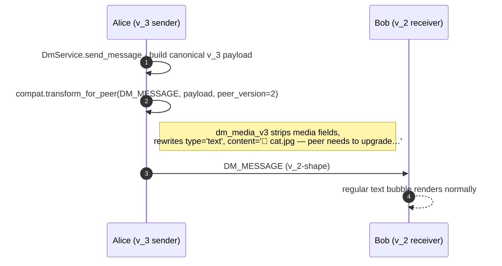

# DM media — pictures, videos, files

## Summary

`MESSAGE_TYPES` carries the canonical scope of a Social Home DM:

```
text · image · video · file · transcript · location
```

The first three of those — **image**, **video**, and **file** — share
one wire shape (a `media_url` plus the new `file_name` / `mime_type`
/ `file_size_bytes` metadata triple) and a two-tier delivery path
that lets cross-household attachments render *immediately* via a
small preview embedded in the encrypted envelope while the full
bytes follow on a separate
[`DM_MEDIA_BLOB`](../../socialhome/domain/federation.py) event.

## Scope

- **Federated-only.** Media attachments are allowed when the
  conversation's remote participants are all reachable through a
  *direct confirmed pairing* with the sender's household. A DM whose
  path requires the multi-hop `DM_RELAY` route (the bazaar-style
  "contact a seller through a mutual friend" flow) **rejects** media
  with `HTTP 422 MEDIA_REQUIRES_DIRECT_PAIRING`. Operator decision:
  relays are explicitly the lower-trust path and shouldn't shuttle
  picture / video / file bytes through third-party households.
- **Bytes ride encrypted.** Both the preview embedded in
  `DM_MESSAGE` and the full bytes ridden by `DM_MEDIA_BLOB` sit
  inside the §25.8.21 encryption envelope. Routing fields stay
  plaintext; everything else (filename, MIME, sizes, preview pixels)
  is encrypted under the conversation key.
- **Same processing as feed media.** Uploads ride through
  `POST /api/media/upload` (the existing endpoint posts use). Size
  caps + transcoding (`ImageProcessor`, `VideoProcessor`) come from
  [`socialhome/domain/media_constraints.py`](../../socialhome/domain/media_constraints.py).
  Image ≤ 20 MiB, longest side 2560 px → WebP @ Q82. Video ≤ 200 MiB,
  1080p, 60 sec max, CRF 25 → WebM. Files (`type='file'`) pass
  through bytes unchanged.

## Event types

| Event | When | Carries |
|---|---|---|
| `DM_MESSAGE` (v_3-shape) | Always — same envelope as a text DM | `type` ∈ {`image`, `video`, `file`}, `media_url` (local-signed for same-household, embedded preview ref for cross-household), `file_name`, `mime_type`, `file_size_bytes`, `media_blob_id` |
| `DM_MEDIA_BLOB` | Cross-household only, fired by sender's outbox after a successful `DM_MESSAGE`. May ship as one or N sequenced events — see chunking below. | `media_blob_id` (matches the `DM_MESSAGE` it follows), `message_id`, `conversation_id`, `file_name`, `mime_type`, `file_size_bytes`, `bytes_b64` (the chunk's bytes, base64), `chunk_index` (0-based), `chunk_count` (total), `final` (last chunk flag). Single-chunk legacy payloads (`chunk_count=1`) and missing-field back-compat both supported on the receiver. |

## Flow

### Same-household DM with an attachment

```mermaid
sequenceDiagram
  autonumber
  participant Alice as Alice (SPA)
  participant Backend as SocialHome backend
  participant Bob as Bob (SPA)

  Alice->>Backend: POST /api/media/upload (multipart)
  Backend->>Backend: ImageProcessor / VideoProcessor
  Backend-->>Alice: { url, signed_url, filename }
  Alice->>Backend: POST /api/conversations/{id}/messages<br/>{ type, media_url, file_name, … }
  Backend->>Backend: DmService.send_message · save row · publish DmMessageCreated
  Backend-->>Bob: WS frame dm.message (with media_url signed for Bob)
  Bob-->>Bob: bubble renders &lt;img&gt; / &lt;video&gt; / file pill inline
```

### Cross-household DM with an attachment — preview-now, sync-later

```mermaid
sequenceDiagram
  autonumber
  participant Alice as Alice (sender's HFS)
  participant Bob as Bob (receiver's HFS)

  Note over Alice: SPA upload via /api/media/upload<br/>then POST to /messages

  Alice->>Alice: Build small preview (320 px WebP @ Q60 for image; first frame extracted via PyAV for video; null for file → receiver renders glyph)
  Alice->>Bob: DM_MESSAGE (v_3, encrypted)<br/>{ media_blob_id, file_name, mime_type, preview_bytes_b64 }
  Bob-->>Bob: Save preview to local cache;<br/>bubble renders immediately with media_sync_status='pending'
  Note over Alice,Bob: ─── background ───
  Alice->>Bob: DM_MEDIA_BLOB chunks (1..N, base64; final flag on last)
  Bob-->>Bob: Each chunk → part file under media_dir;<br/>on final, concat in order + rename to <msg_id>.<ext>;<br/>update conversation_messages.media_url +<br/>media_sync_status=NULL
  Bob-->>Bob: WS push dm.media_ready → SPA<br/>swaps preview src for full media
```

### Sub-v_3 peer (§319 ¶5 `fallback`)



## Chunking

The federation transport (HTTPS inbox / RTC DataChannel) has a
soft ~1 MiB per-event ceiling on the serialised JSON. A 200 MiB
video would exceed that as a single base64-encoded payload, so
``DM_MEDIA_BLOB`` is split:

- Files **≤ `SINGLE_CHUNK_BYTES_THRESHOLD` (1 MiB raw)** ship as
  one event with `chunk_count=1` and `final=true`. Typical phone
  photos and short clips take this fast path — no chunking
  overhead.
- **Larger files** split into `ceil(size / MAX_BLOB_CHUNK_BYTES)`
  chunks, where each chunk carries up to 256 KiB raw (≈ 360 KB
  after base64 inflation, well under the per-event budget). Each
  chunk carries its `chunk_index`, the shared `chunk_count`, and a
  `final` flag set only on the last.

**Receiver side**: each chunk writes to `<msg_id>.part<idx>` under
the media root. When `final=true` arrives, the receiver
concatenates parts 0…N−1 in order into a temp file, moves it to
`<msg_id>.<ext>` write-once (see below), deletes the parts, then swaps
`media_url` and broadcasts `dm.media_ready` as in the single-chunk
case. A re-send from a sender restart overwrites the same part
files idempotently; a missing chunk at finalisation time logs +
bails (the outbox retry will resend it).

**Scope + write-once.** The receiver only lands bytes a household was
entitled to send:

- `message_id` must be a single safe file-name component and
  `chunk_index` / `chunk_count` must be in range, else the chunk is
  dropped. The same rule applies to the `DM_MESSAGE` itself: its
  `message_id` names the `<msg_id>.preview.webp` and `<msg_id>.<ext>`
  files, so a `DM_MESSAGE` whose id is absolute, contains a separator or
  starts with `.` is dropped with a WARNING before anything is stored.
  Every media path built from a peer id is also checked to sit directly
  in the media root (`inbound_media_store.media_file_path`).
- If the `conversation_messages` row is already here, the blob must
  carry the `media_blob_id` that message announced and come from the
  household the message was sent from (the sender's
  `remote_users.instance_id` equals `from_instance`). A blob for a local
  member's message, or from another household in the same group DM, is
  refused with a WARNING.
- If the row isn't here yet (the blob overtook its `DM_MESSAGE`), the
  bytes are accepted — safe because the final file is **write-once**: it
  is moved into place with a hard link that fails on an existing name
  (`services/inbound_media_store.py:publish_once`), so an existing
  `<msg_id>.<ext>` is never replaced. A re-delivery of an attachment
  that already landed just re-adopts the file on disk.

**Backwards compatibility**: payloads without the `chunk_*` /
`final` fields (older builds, or any caller that doesn't emit
them) read as a single-chunk transfer — the fast path takes over.

Single envelope is the only path active for files smaller than 1
MiB; chunks above that. Chunked encryption is the same as the
non-chunked case — every envelope rides through the federation
transport's encryption layer.

## Resilience

A handful of paths beyond the happy flow above:

- **In-flight reaper on startup.** `DmMediaSyncService.start()` calls
  `reclaim_in_flight()` first thing — any row stuck in
  `status='in_flight'` from a sender crash gets flipped back to
  `pending` with a 10 s delay. Otherwise `list_due` would silently
  skip the row forever.
- **DM_MEDIA_BLOB-before-DM_MESSAGE reordering.** Federation
  envelopes can race. If the full file lands before the
  `conversation_messages` row exists, the blob handler still writes
  the bytes to `<msg_id>.<ext>`; when the matching `DM_MESSAGE`
  arrives later, `_receive_media_preview` adopts the pre-arrived
  file directly (clearing `media_sync_status`) instead of
  overwriting it with a preview.
- **MIME magic-byte sniff.** `_on_dm_media_blob` checks the leading
  bytes of the assembled file against the declared `mime_type`.
  Only `image/webp` and `video/webm` have signatures we'd ever
  produce upstream; anything else in `image/*` or `video/*` is
  treated as suspicious and the row flips to
  `media_sync_status='failed'` (the file still stores so the user
  can inspect manually). Direct-trust between paired households is
  the primary safety net; this is hardening for the
  "sender's instance got compromised" scenario.
- **Failed-delivery footnote.** When the outbox retry budget for any
  paired peer is exhausted, the matching row flips to
  `media_sync_status='failed'` and the sender's bubble renders an
  inline warning ("Couldn't deliver this media to one or more
  paired households — the file is still on your device."). The
  recipient sees nothing — there's nothing to act on for them.
- **Media-orphan janitor.** `DmGcScheduler._sweep_media_orphans`
  runs on the hourly conversation-GC tick: enumerates
  `<msg_id>.preview.webp` and `<msg_id>.part<idx>` files,
  groups by message id, drops anything without a backing live
  `conversation_messages` row.

## Server-side validation

- `DmService.send_message` rejects media on a relay-only conversation
  via `MediaRequiresDirectPairingError` → HTTP 422 with code
  `MEDIA_REQUIRES_DIRECT_PAIRING`. The SPA surfaces a clear copy
  ("only paired households can receive media") and keeps the
  staged attachment around so the user can drop it and resend as
  text.
- Size + MIME caps are enforced inside `MediaUploadView` before
  `media_url` ever reaches the DM POST. Three branches:
  `image/*` → `ImageProcessor`, `video/*` → `VideoProcessor`,
  everything else → passthrough (25 MiB cap,
  `FILE_DENIED_EXTENSIONS` deny-list of execute-on-default-handler
  extensions, UUID filename + sanitised extension). The DM route
  trusts the uploaded blob's signed URL.
- The receiver's `_on_dm_message` upserts on
  `conversation_messages.id` so a v_3 message arriving twice (the
  envelope + a redelivery) produces a single row.
- A peer-supplied `media_url` (on `DM_MESSAGE` without a
  `media_blob_id`, and on every `DM_HISTORY_CHUNK` row) is kept only in
  the local upload shape `api/media/<name>` (`local_media_ref` in
  `services/inbound_media_store.py`; a leading `/` and `?query` are
  dropped). Anything else — a remote URL, `javascript:` / `data:`, a
  path escape — is stored as `null` with a WARNING log. The SPA puts
  `media_url` in the file pill's `href`, so a raw value would be a
  click-to-run script.

## SPA render

[`DmThreadPage.tsx`](../../client/src/features/dms/DmThreadPage.tsx)
renders three message-bubble shapes based on `mime_type` (or the
explicit `type` when `mime_type` is `null`):

- `image/*` → ``
- `video/*` → `<video class="sh-message-media sh-message-media--video" controls preload="metadata">`
- everything else → file pill (`a.sh-message-file`) with a `📎`
  glyph + filename + size, the anchor's `href` is the signed media
  URL with `download={file_name}` so the user gets a real save
  prompt. The `href` passes `safeHref` (`client/src/utils/safeHref.ts`)
  — anything but http(s), an app path, `api/…` or `mailto:` renders
  no link.

When `media_sync_status === 'pending'`, the media gets a `--pending`
modifier class that adds a subtle brightness pulse — the visual cue
for the cross-household "preview now, full bytes coming" state.
Once the matching `DM_MEDIA_BLOB` lands, the backend's
`dm.media_ready` WS frame swaps `media_url` to the local full-bytes
URL and the modifier is removed.

## Implementation pointers

- `socialhome/domain/conversation.py` — `MESSAGE_TYPES`, the
  `ConversationMessage` dataclass with the new media columns.
- `socialhome/migrations/0003_dm_media.sql` — schema delta + the
  `dm_media_outbox` table for the cross-household scheduler.
- `socialhome/services/dm_service.py` — `send_message` accepts the
  new fields; `_reject_media_on_relay_only_conversation` enforces
  the federated-only gate; `_fan_to_remote` runs every outbound
  through `compat.transform_for_peer`.
- `socialhome/federation/compat/` — version-aware payload
  transforms. New compat tree introduced in this feature; see the
  package docstring + `dm_media_v3.py` for the canonical shape.
- `socialhome/domain/federation.py` — `DM_MEDIA_BLOB` enum entry.
- `socialhome/services/dm_media_sync_service.py` — preview
  builder, ``dm_media_outbox`` enqueue, and scheduler loop
  (asyncio.Event lifecycle per CLAUDE.md template).
- `socialhome/repositories/dm_media_outbox_repo.py` — outbox CRUD
  with exp-backoff reschedule + retry-budget exhaustion.
- `socialhome/services/federation_inbound_service.py` —
  `_receive_media_preview` decodes the inline preview at
  `DM_MESSAGE` time; `_on_dm_media_blob` writes the full bytes,
  updates `media_url`, and fans `dm.media_ready` via the realtime
  service.
- `client/src/features/dms/DmThreadPage.tsx` — paperclip attach
  button, pre-send preview tile, bubble renderers.
- `client/src/components/UploadProgress.tsx` — shared
  `uploadWithProgress` used by both feed posts and DM attachments.

## Spec refs

- §5.2 — DM scope and `MESSAGE_TYPES` definition.
- §25.8.21 — encryption-first rule: every field that isn't a routing
  primitive sits inside the encrypted payload, including the
  preview bytes and `DM_MEDIA_BLOB`'s full bytes.
- [Issue #319](https://github.com/social-home-io/socialhome/issues/319),
  paragraph 5 — per-feature degraded-shape policy. DM media: `fallback`.
