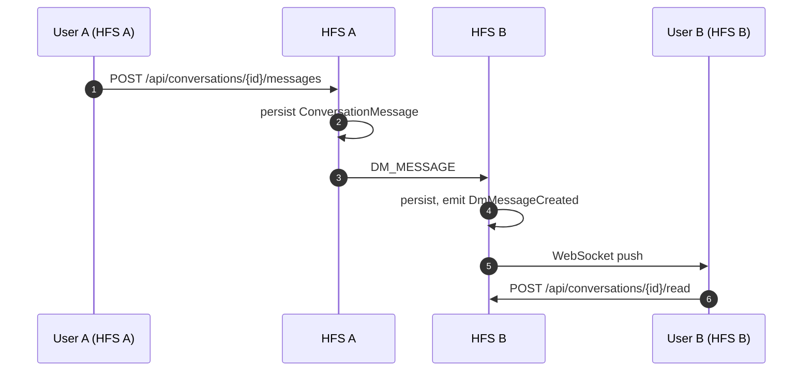
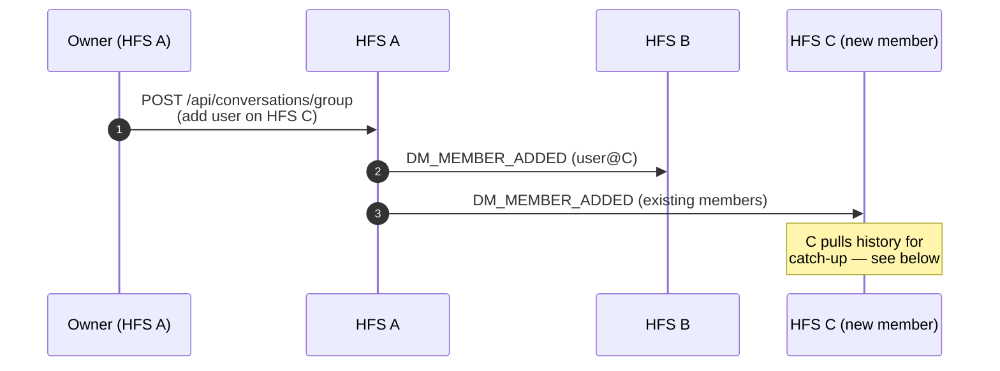
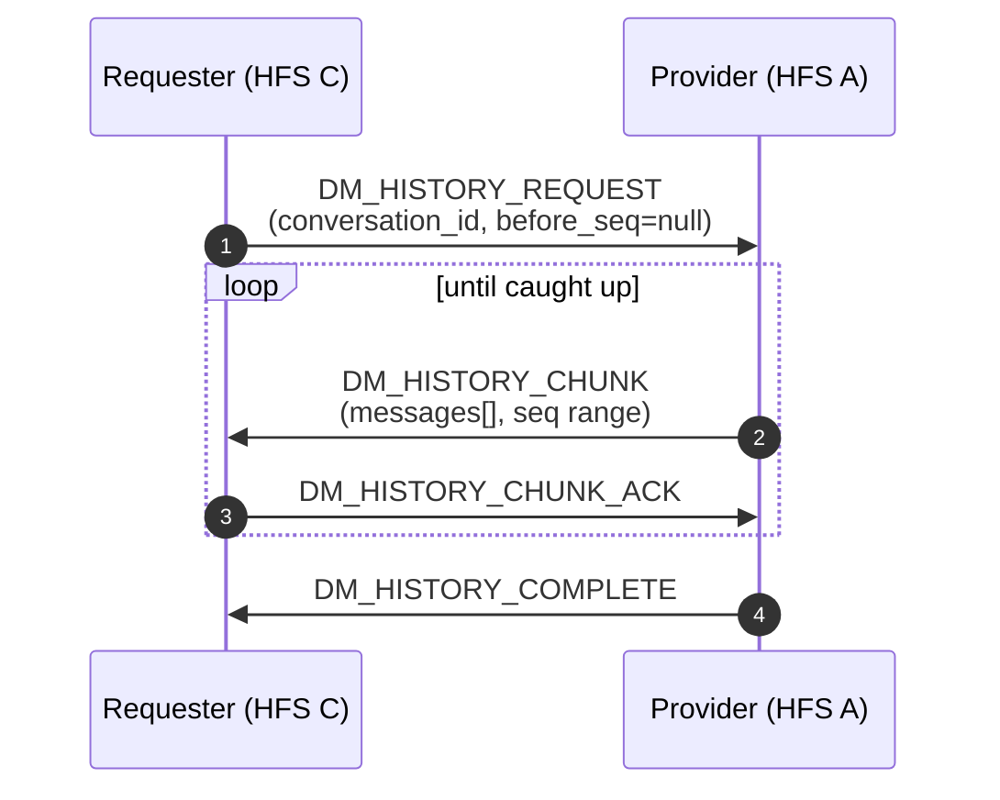

# Direct Messages

1:1 and group conversations between users. Unlike space content, DMs
are scoped to the conversation's participants — there is no space
envelope and no admin hierarchy. Every participant's HFS holds a full
copy of the conversation history.

## Scope

- **HFS**: both sides. Sends, receives, persists, requests history
  from a peer.
- **GFS**: only for optional contact discovery
  (`DM_CONTACT_REQUEST` routed via GFS between unpaired users) and
  push fan-out when a recipient is offline (see
  [push-relay](./push-relay.md)).

## DM E2E is transport-only

Federation envelopes carrying DM payloads are AES-256-GCM encrypted
in transit, per the encryption-first rule. **Once decrypted on the
receiver, DM content is stored as plaintext in local SQLite** — the
same way posts, comments, and every other content type is stored.
There is no separate message-at-rest encryption. Rationale: the
threat model is an HFS operator who already has filesystem access; an
additional encryption layer against them would be theatre.

## Event types

**Messages**

`DM_MESSAGE`, `DM_MESSAGE_DELETED`, `DM_MESSAGE_REACTION`,
`DM_USER_TYPING`, `DM_RELAY` (relay wrapper for group DMs).

**Membership**

`DM_MEMBER_ADDED`, `DM_CONTACT_REQUEST`, `DM_CONTACT_ACCEPTED`,
`DM_CONTACT_DECLINED`.

**History pull**

`DM_HISTORY_REQUEST`, `DM_HISTORY_CHUNK`, `DM_HISTORY_CHUNK_ACK`,
`DM_HISTORY_COMPLETE`.

## Flow — 1:1 DM

## Flow — group DM, member added

## Flow — history pull

New members and re-installed clients need history. The requester
pulls chunks from any one existing participant (usually the most
recent writer).

## Contact requests

`DM_CONTACT_REQUEST` lets a user on HFS A ask a user on HFS B for
permission to DM. If A and B are already paired the envelope goes
directly; if not, it's routed via a mutually-paired intermediary (a
GFS or a common peer HFS) using the `_VIA` pattern. The payload
includes the sender's display name and a short message; recipients
can `DM_CONTACT_ACCEPTED` or `DM_CONTACT_DECLINED`.

## Push privacy (§25.3)

Push notifications for DMs carry the title only — no message body.
This applies even when the push notification service is GFS-mediated.

## Implementation

- `socialhome/services/dm_service.py` — CRUD + history.
- `socialhome/services/federation_inbound/dm.py` — inbound handlers.
- `socialhome/federation/sync/dm_history/` — history pull machinery.
- `socialhome/repositories/conversation_repo.py`,
  `conversation_message_repo.py`.
- `socialhome/routes/conversation_routes.py`.

## Spec references

§23.47 (DM UX),
§25.3 (push privacy),
feedback: DM E2E is transport-only
(`~/.claude/projects/…/memory/feedback_dm_e2e_transport_only.md`).
