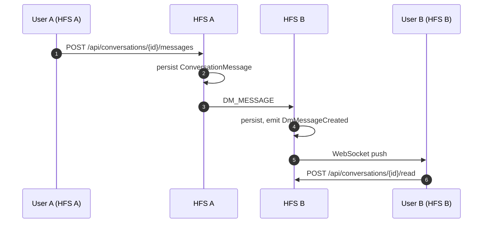
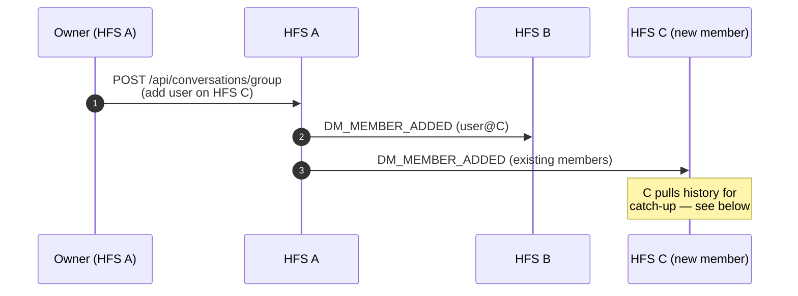
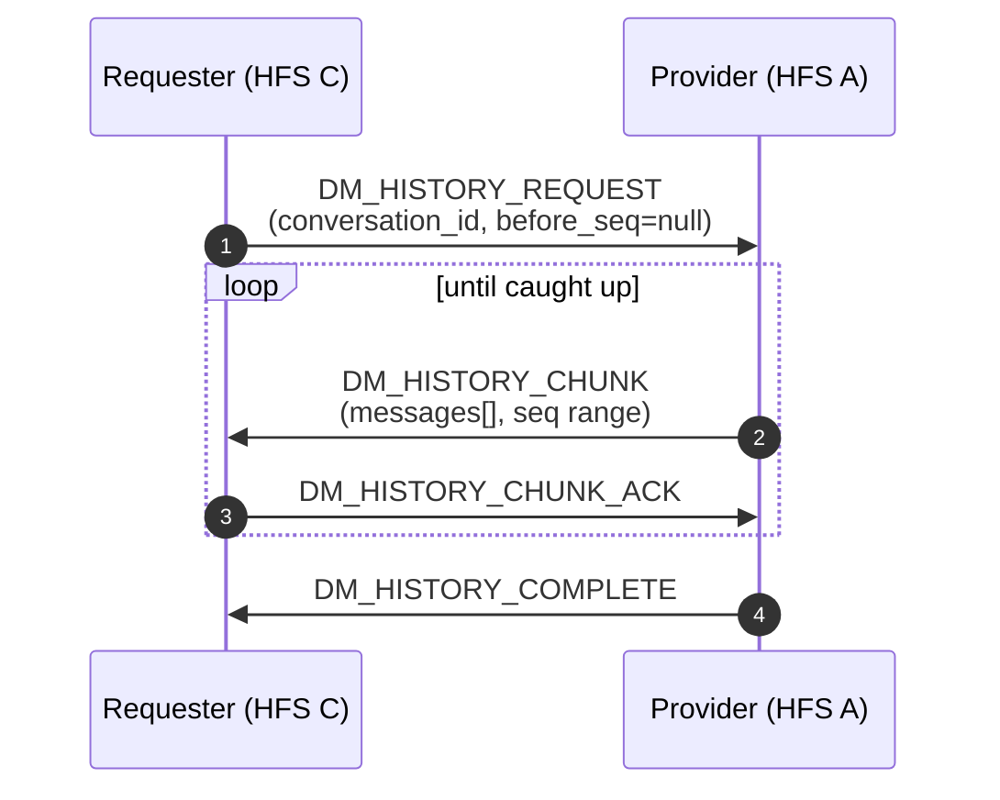
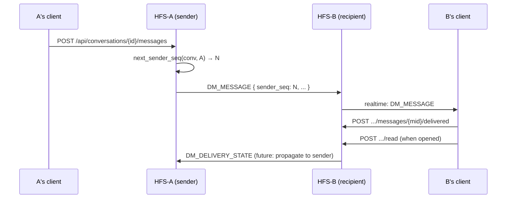

# Direct Messages

1:1 and group conversations between users. Unlike space content, DMs
are scoped to the conversation's participants — there is no space
envelope and no admin hierarchy. Every participant's HFS holds a full
copy of the conversation history.

## Scope

- **HFS**: both sides. Sends, receives, persists, requests history
  from a peer.
- **GFS**: only for optional contact discovery
  (`DM_CONTACT_REQUEST` routed via GFS between unpaired users) and
  push fan-out when a recipient is offline (see
  [push-relay](./push-relay.md)).

## DM E2E is transport-only

Federation envelopes carrying DM payloads are AES-256-GCM encrypted
in transit, per the encryption-first rule. **Once decrypted on the
receiver, DM content is stored as plaintext in local SQLite** — the
same way posts, comments, and every other content type is stored.
There is no separate message-at-rest encryption. Rationale: the
threat model is an HFS operator who already has filesystem access; an
additional encryption layer against them would be theatre.

## Event types

**Messages**

`DM_MESSAGE`, `DM_MESSAGE_DELETED`, `DM_MESSAGE_REACTION`,
`DM_USER_TYPING`, `DM_RELAY` (relay wrapper for group DMs).

**Membership**

`DM_MEMBER_ADDED`, `DM_CONTACT_REQUEST`, `DM_CONTACT_ACCEPTED`,
`DM_CONTACT_DECLINED`.

**History pull**

`DM_HISTORY_REQUEST`, `DM_HISTORY_CHUNK`, `DM_HISTORY_CHUNK_ACK`,
`DM_HISTORY_COMPLETE`.

## Flow — 1:1 DM



## Flow — group DM, member added



## Flow — history pull

New members and re-installed clients need history. The requester
pulls chunks from any one existing participant (usually the most
recent writer).



## Reliability — read receipts + delivery state (§12.5)

Each DM_MESSAGE envelope stamps a monotonic `sender_seq` per
`(conversation_id, sender_user_id)`. Recipients record one row per
seen message in `conversation_delivery_state`: first `delivered`
(acked from the browser once the frame lands), then `read` when the
user opens the conversation. `read` supersedes `delivered` — the
upsert never downgrades.

Read receipts are end-to-end, not routing-layer. The browser sends a
`POST /api/conversations/{id}/read` on "mark all read" which
bulk-upserts `read` state for every visible message from other
participants. A `POST /api/conversations/{id}/messages/{mid}/delivered`
covers the single-message ack path.



## Reliability — sequence-gap detection

When HFS-B's inbound handler sees `sender_seq = N` but `last_seq < N-1`
for `(conv, A)`, every missing value between them is persisted to
`conversation_message_gaps`. The client polls
`GET /api/conversations/{id}/gaps` and shows a "some messages may be
missing" banner above the oldest gap. Out-of-order arrivals that fill
a gap call `resolve_gap` automatically so the banner clears.

```mermaid
sequenceDiagram
    participant SH_A as HFS-A (sender)
    participant SH_B as HFS-B (recipient)
    Note over SH_A,SH_B: Normal: seq 1, 2, 3, 4 arrive in order
    SH_A->>SH_B: DM_MESSAGE seq=5
    SH_B->>SH_B: last_seen=4 → no gap, save
    Note over SH_A,SH_B: Transport drops seq=7 (routing failure)
    SH_A->>SH_B: DM_MESSAGE seq=8
    SH_B->>SH_B: last_seen=5, incoming=8 → gap [6,7]
    SH_B->>SH_B: insert_gaps([6,7])
    SH_A->>SH_B: DM_MESSAGE seq=6 (delayed relay)
    SH_B->>SH_B: incoming=6 <= last_seen=8 → resolve_gap(6)
    Note over SH_A,SH_B: seq=7 still missing; UI banner persists
```

Gap-fill back-pressure (asking the sender to resend a specific seq
range) lands in a follow-up — the current revision persists the gaps
and surfaces them to the UI, which is enough for users to notice
and ask the sender to repost.

## Relay-path diagnostics

`conversation_relay_paths` records the sticky primary route chosen by
`DmRoutingService.select_conversation_path` for each `(conversation,
target_instance)`. `GET /api/me/relay-paths?conversation_id=…` (future)
and `dm_routing_repo.list_relay_paths` expose it for a future
diagnostics UI.

## Contact requests

`DM_CONTACT_REQUEST` lets a user on HFS A ask a user on HFS B for
permission to DM. If A and B are already paired the envelope goes
directly; if not, it's routed via a mutually-paired intermediary (a
GFS or a common peer HFS) using the `_VIA` pattern. The payload
includes the sender's display name and a short message; recipients
can `DM_CONTACT_ACCEPTED` or `DM_CONTACT_DECLINED`.

## Push privacy (§25.3)

Push notifications for DMs carry the title only — no message body.
This applies even when the push notification service is GFS-mediated.

## Implementation

- `socialhome/services/dm_service.py` — CRUD + history.
- `socialhome/services/federation_inbound/dm.py` — inbound handlers.
- `socialhome/federation/sync/dm_history/` — history pull machinery.
- `socialhome/repositories/conversation_repo.py`,
  `conversation_message_repo.py`.
- `socialhome/routes/conversation_routes.py`.

## Spec references

§23.47 (DM UX),
§25.3 (push privacy),
feedback: DM E2E is transport-only
(`~/.claude/projects/…/memory/feedback_dm_e2e_transport_only.md`).
