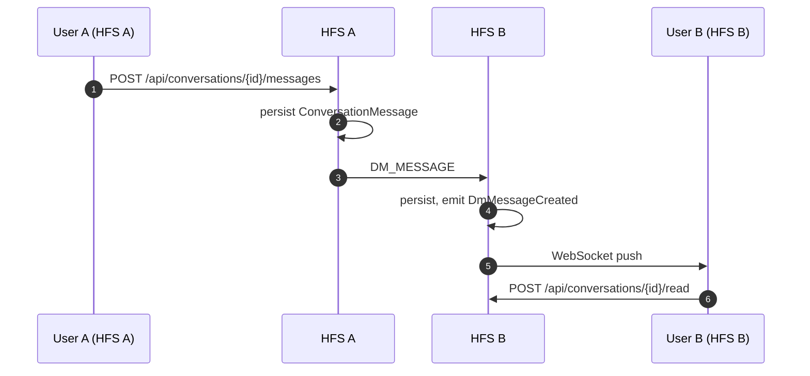
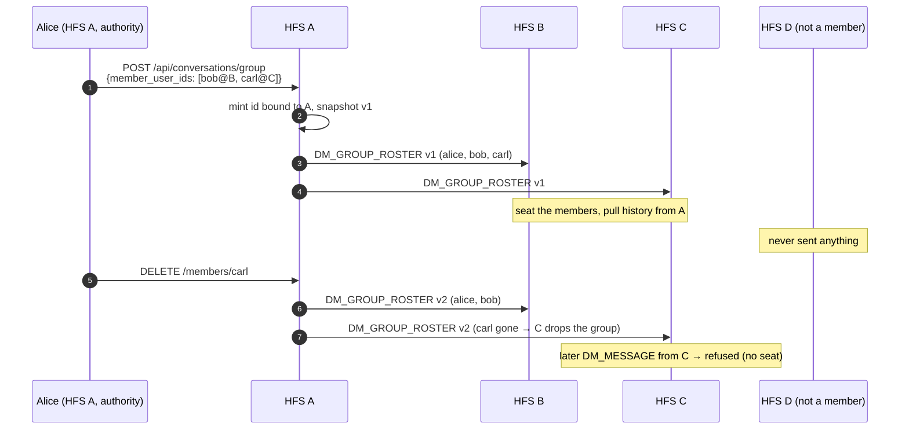
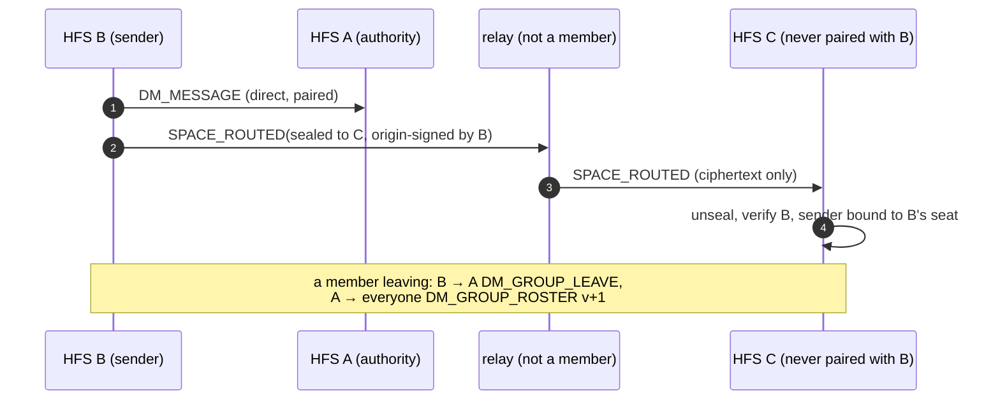
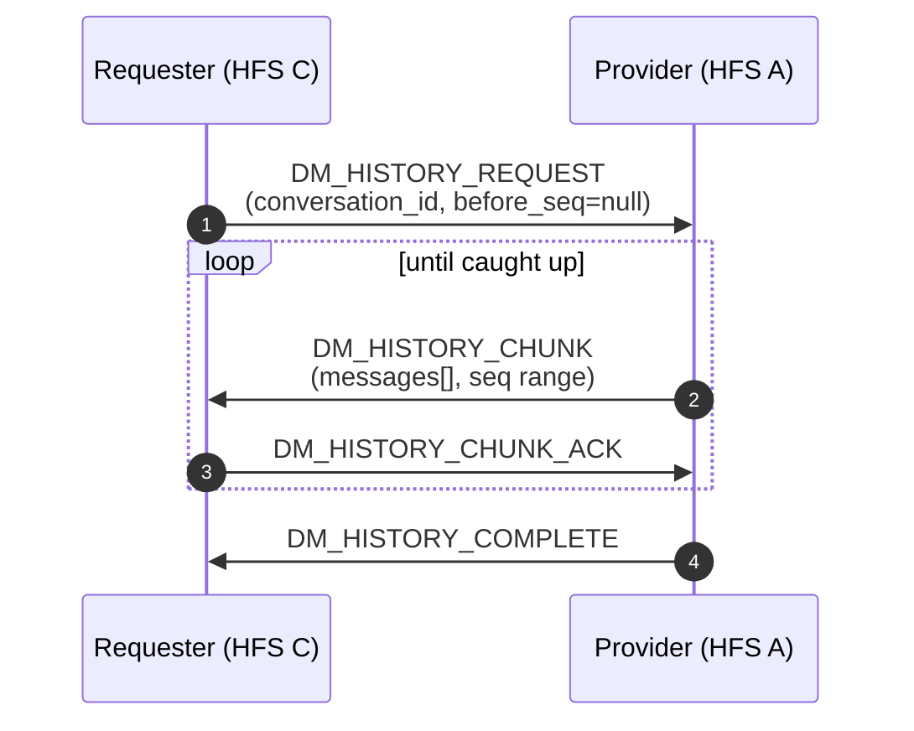
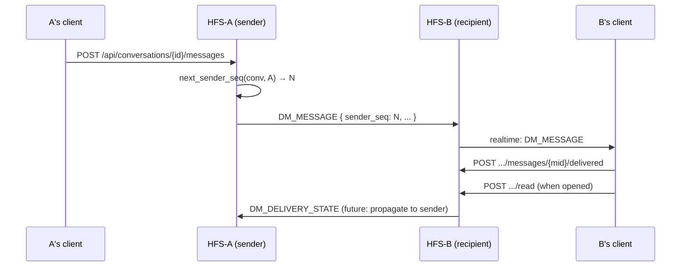
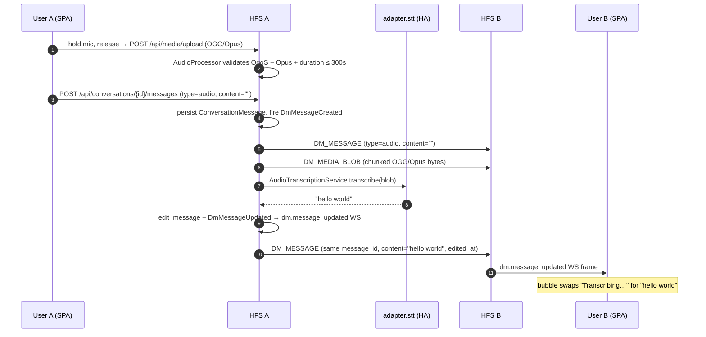
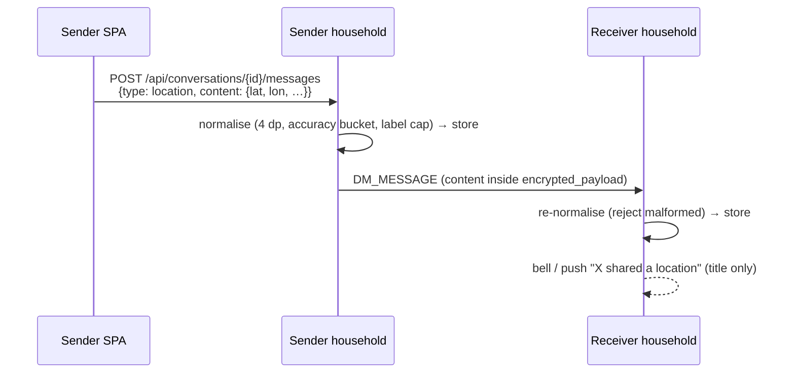

# Direct Messages

1:1 and group conversations between users. Unlike space content, DMs
are scoped to the conversation's participants — there is no space
envelope and no admin hierarchy. Every participant's HFS holds a full
copy of the conversation history.

## Scope

- **HFS**: both sides. Sends, receives, persists, requests history
  from a peer.
- **GFS**: only for optional contact discovery
  (`DM_CONTACT_REQUEST` routed via GFS between unpaired users) and
  push fan-out when a recipient is offline (see
  [push-relay](./push-relay.md)).

## DM E2E is transport-only

Federation envelopes carrying DM payloads are AES-256-GCM encrypted
in transit, per the encryption-first rule. **Once decrypted on the
receiver, DM content is stored as plaintext in local SQLite** — the
same way posts, comments, and every other content type is stored.
There is no separate message-at-rest encryption. Rationale: the
threat model is an HFS operator who already has filesystem access; an
additional encryption layer against them would be theatre.

## Event types

**Messages**

`DM_MESSAGE`, `DM_MESSAGE_DELETED`, `DM_MESSAGE_REACTION`,
`DM_USER_TYPING`, `DM_RELAY` (relay wrapper for group DMs),
`DM_MEDIA_BLOB` (v_3+, full-bytes follow-up for cross-household
picture / video / file / **voice-note** attachments — see
[DM media](./dm-media.md)).

**Membership**

`DM_GROUP_ROSTER` and `DM_GROUP_LEAVE` (v_37, see
[Group conversations across households](#group-conversations-across-households)),
`DM_CONTACT_REQUEST`, `DM_CONTACT_ACCEPTED`, `DM_CONTACT_DECLINED`.
`DM_MEMBER_ADDED` is a reserved name with no handler — group membership
travels only as `DM_GROUP_ROSTER`.

**History pull**

`DM_HISTORY_REQUEST`, `DM_HISTORY_CHUNK`, `DM_HISTORY_CHUNK_ACK`,
`DM_HISTORY_COMPLETE`.

## Receiver rules

Every DM event names a conversation, a message and a person; the
receiver binds each to the household that signed the envelope
(`from_instance`), using only what it already stores — the user's home
household and the conversation's remote seats
(`conversation_remote_members`). It drops the event with a WARNING when:

- **`DM_MESSAGE`** — the sender is not a user of `from_instance` (a
  local member, a third household's user, or unknown) nor seated on it
  by a group roster; the message id
  already exists in another conversation or from another sender (an edit
  or transcript re-send is honoured only for the sender's own message);
  the conversation exists here but the sender holds no seat in it; the
  conversation is new and its id is a group id (a group arrives only with
  its roster — the roster's catch-up pull fetches a message that overtook
  it); or the conversation is new and no recipient is a local user. The
  sender's `recipient_user_ids` never pick who is notified here: that is
  the conversation's seated local members. An existing
  conversation's seats are never changed by an inbound message — except
  an older 1:1 whose remote seat was never written: it is restored for a
  sender homed on `from_instance` who already wrote in it (exactly one
  local member, no remote seat). A DM whose sender this household has no
  user row for yet is not dropped: it is held (bounded, expiring, in
  memory) and replayed through these same rules once that user syncs.
- **`DM_MESSAGE_DELETED`** — the message was not sent by a user of
  `from_instance`, or it is not in the named conversation.
- **`DM_MESSAGE_REACTION`** — the reactor is not a seated user of
  `from_instance` in the message's conversation.
- **`DM_USER_TYPING`** — the typist is not a seated user of
  `from_instance`; the frame carries the username this household holds
  for them, not the payload's.
- **`DM_HISTORY_REQUEST`** — `from_instance` holds no seat in the
  conversation (nothing is sent back, not even `DM_HISTORY_COMPLETE`).
- **`DM_HISTORY_CHUNK` / `_COMPLETE`** — `from_instance` holds no seat;
  per message, the sender is not a seated user of `from_instance` — except
  that a group's authority may hand over rows of members seated on other
  households (a newly added household catches up from it), never a row
  claimed for one of our own users. Such a relayed row only fills a gap:
  it never updates a row already here (no rewrite, un-delete or rollback
  of what the member's own household delivered).
- **`USER_REMOVED`** — for a group the departed user was in, the group
  stays: their messages in it are cleared, and on the group's authority
  their seat is taken out with the next roster. (A 1:1 with them is
  purged, as before.)
- **`DM_GROUP_ROSTER`** — `from_instance` is not the household the
  group id commits to, or is not a directly paired, social household
  (a mesh stranger can mint an id bound to itself; an invite-link or
  unpairing row doesn't count either); the version is not a whole number
  in `1 … 2^53` or not newer than the one held; the conversation exists
  here as a 1:1; or it is new and seats no local user. Per entry: a local
  entry naming a `user_id` we don't have, or a remote entry naming a
  person this household knows as homed on another household (or here),
  is dropped. An entry seating a user on the authority itself that the
  authority never synced to us holds the whole roster (bounded, expiring)
  until that user's profile lands, then it is applied by these same
  rules — the authority's own seats are the ones it could speak for.
- **`DM_GROUP_LEAVE`** — this household is not the group's authority,
  or the leaver is not a user seated on `from_instance`.
  A message is inserted when absent; one already here is updated from the
  chunk (the sender's later edit or delete) only when the stored row has
  the same sender in the same conversation.
- Known limitation: after a `USER_MOVED`, conversations seated under the
  user's old household keep that seat, so messages from the new home are
  refused there until the conversation is re-seated.

### Guardian blocks (§CP.F2)

A guardian can block a person (local or on another household) for a
protected account. The block never leaves the household — the sender's
household learns nothing — and it is enforced where the message lands, on
top of the rules above (WARNING `guardian block`, ids only):

- **`DM_MESSAGE`** from a blocked sender: refused outright — nothing is
  stored and no conversation is opened — when the protected account is the
  message's only local audience (a 1:1, a conversation that isn't here yet,
  or a group whose every local member blocked the sender). In a group with
  other local members it is stored for them and withheld from the protected
  account (no WS frame, no bell, hidden from its message list).
- **`DM_MEDIA_BLOB`** for a message refused that way is refused too, and any
  bytes that overtook the message are never linked to it (the media orphan
  sweep reaps them).
- **`DM_HISTORY_CHUNK`** rows from a blocked sender follow the same rule.
- **`CALL_OFFER`** from a blocked caller never rings (no call row).
- `DM_RELAY` delivers nothing at its destination today, so it needs no gate.

Locally the pair can't open or continue a 1:1, share a group (creating or
adding refuses, and the block steps the protected account out of every group
the two share), react, or call — in either direction. The 403 the blocked
person gets reads exactly like a personal block (`Recipient has you
blocked.`). A roster from another household can still seat both; the
protected account then can't post there and never sees the blocked person's
messages, reactions or media.

Implementation: `socialhome/federation/dm_scope.py` (`DmScope`),
`socialhome/services/dm_group_service.py`; guardian blocks in
`socialhome/services/protection_gate.py` (`ProtectionGateMixin`) as used by
`DmService`, `FederationInboundService`, `DmHistoryReceiver`,
`CallSignalingService` and `NotificationService`;
`tests/protocol/test_dm_scope.py`, `tests/protocol/test_dm_group_scope.py`,
`tests/protocol/test_guardian_blocks.py`.

## Flow — 1:1 DM


```mermaid
sequenceDiagram
    autonumber
    participant UA as User A (HFS A)
    participant A as HFS A
    participant B as HFS B
    participant UB as User B (HFS B)
    UA->>A: POST /api/conversations/{id}/messages
    A->>A: persist ConversationMessage
    A->>B: DM_MESSAGE
    B->>B: persist, emit DmMessageCreated
    B->>UB: WebSocket push
    UB->>B: POST /api/conversations/{id}/read
```

## Group conversations across households

A group conversation (v_37) can seat people from several households.

**The authority.** The household that creates the group is its
authority. The conversation id is an owner-bound id
(`federation/owner_bound_id.py`, kind `group-conversation`) committing to
that household's `instance_id`, so every member household can tell from
the id alone whose member list counts — no column records it. Only people
on the authority household add, remove or rename (anyone else gets 403);
anyone can leave. The authority can only seat people it knows directly: a
local user, or a person mirrored from a directly paired household at
v_37+ (anyone else is refused with 422 `GROUP_MEMBER_UNSUPPORTED` and a
reason the new-group picker shows). A group created before v_37 has a
plain uuid id: it binds no authority, stays local-only, and can't take
people from other households.

**The roster.** Every membership change — create, add, remove, rename, a
member leaving — is applied on the authority as a new snapshot with the
next `membership_version` and shipped as `DM_GROUP_ROSTER`
`{conversation_id, version, name, members: [{user_id, instance_id,
username, display_name, since}]}` to every member household, plus once more to a
household the change took out — to that one with an empty member list,
so it drops every seat and learns nothing about who stays. It travels
direct (the authority is paired with every member household — it seated
them), encrypted per peer like every envelope. A receiver applies it only
from the household the id commits to and only when the version is newer
(atomically — `apply_group_roster`), so a reordered or replayed roster
never rolls membership back. It is the **only** thing that ever seats
anyone in a group: a message never does (#734's rule).

**Leaving.** A member on another household steps out locally and sends
`DM_GROUP_LEAVE {conversation_id, user_id}` to the authority, which
accepts it only for a user seated on the sending household and answers
with the next roster.

A roster the authority built *before* it saw that leave can still arrive
afterwards — newer than anything held, still listing the leaver. Each
entry's `since` (the version at which the authority last seated that
member) settles it: the leaving household remembers the version it held
when its user left (`left_version`), and an entry whose `since` is not
newer is stale — the user stays out, the rest of the roster applies, and
the leave is sent again. Only an explicit re-add after the leave (a newer
`since`) seats them back. An entry without `since` (an authority predating
the field) seats them as before. Additive and ungated: an older receiver
ignores `since`.

**Seats name their user.** A member household may never have paired with
another member household (both only know the authority), so it holds no
`remote_users` row for those people. A roster seat therefore carries the
member's `user_id` and display name (`conversation_remote_members`); a
message, reaction, typing frame or delete from that member binds to the
seat — and so to the household that must sign the envelope.

**Delivery — members only.** Messages, edits, deletes and reactions fan
out from the sending household to every member household itself: direct
when the two are paired, otherwise over the mesh as `SPACE_ROUTED`,
E2E-sealed to the member household and origin-signed, so the relays in
between (never members) see only ciphertext. A household that is not a
member never gets group content, and a removed one stops getting it with
the roster that removed it. A member household we are unpairing from, or
share only a space with (an invite-link row), is not reached at all.
Typing indicators and calls go direct only (ephemeral), and media stays
on the direct-pairing rule: a group with a member household the sender
isn't paired with refuses attachments (`MEDIA_REQUIRES_DIRECT_PAIRING`).

**History.** A household newly seated by a roster pulls the backlog from
the authority (`DM_HISTORY_REQUEST`, below) — the same full history a
local member added to a local group sees. The authority's chunks may carry
other members' rows; the receiver takes those only from the authority and
never a row claimed for one of its own users.

**Trust.** The authority is trusted for the member list and for the
catch-up copy of other members' messages, the way a space host is for its
roster; it can't speak live for a member on another household (their live
messages must be signed by their own household) or for a receiver's own
users, and its catch-up rows never overwrite what a member's own household
delivered.

**Known limits.** Only people on the authority household change the
member list; if they all leave, the list is frozen (the others keep
chatting). Mesh-routed deliveries have no outbox — a message to a
member household reached only over the mesh that finds no route is not
retried (logged at WARNING).
The per-pair hide list filters what a household sends to a peer, not who
the authority lists in a roster.


```mermaid
sequenceDiagram
    autonumber
    participant UA as Alice (HFS A, authority)
    participant A as HFS A
    participant B as HFS B
    participant C as HFS C
    participant D as HFS D (not a member)
    UA->>A: POST /api/conversations/group<br/>{member_user_ids: [bob@B, carl@C]}
    A->>A: mint id bound to A, snapshot v1
    A->>B: DM_GROUP_ROSTER v1 (alice, bob, carl)
    A->>C: DM_GROUP_ROSTER v1
    Note over B,C: seat the members, pull history from A
    Note over D: never sent anything
    UA->>A: DELETE /members/carl
    A->>B: DM_GROUP_ROSTER v2 (alice, bob)
    A->>C: DM_GROUP_ROSTER v2 (carl gone → C drops the group)
    Note over C: later DM_MESSAGE from C → refused (no seat)
```


```mermaid
sequenceDiagram
    autonumber
    participant B as HFS B (sender)
    participant A as HFS A (authority)
    participant R as relay (not a member)
    participant C as HFS C (never paired with B)
    B->>A: DM_MESSAGE (direct, paired)
    B->>R: SPACE_ROUTED(sealed to C, origin-signed by B)
    R->>C: SPACE_ROUTED (ciphertext only)
    C->>C: unseal, verify B, sender bound to B's seat
    Note over B,C: a member leaving: B → A DM_GROUP_LEAVE,<br/>A → everyone DM_GROUP_ROSTER v+1
```

## Flow — history pull

New members and re-installed clients need history. The requester
pulls chunks from any one existing participant (usually the most
recent writer).


```mermaid
sequenceDiagram
    autonumber
    participant R as Requester (HFS C)
    participant P as Provider (HFS A)
    R->>P: DM_HISTORY_REQUEST<br/>(conversation_id, before_seq=null)
    loop until caught up
        P->>R: DM_HISTORY_CHUNK<br/>(messages[], seq range)
        R->>P: DM_HISTORY_CHUNK_ACK
    end
    P->>R: DM_HISTORY_COMPLETE
```

## Reliability — read receipts + delivery state (§12.5)

Each DM_MESSAGE envelope stamps a monotonic `sender_seq` per
`(conversation_id, sender_user_id)`. Recipients record one row per
seen message in `conversation_delivery_state`: first `delivered`
(acked from the browser once the frame lands), then `read` when the
user opens the conversation. `read` supersedes `delivered` — the
upsert never downgrades.

Read receipts are end-to-end, not routing-layer. The browser sends a
`POST /api/conversations/{id}/read` on "mark all read" which
bulk-upserts `read` state for every visible message from other
participants. A `POST /api/conversations/{id}/messages/{mid}/delivered`
covers the single-message ack path.


```mermaid
sequenceDiagram
    participant A as A's client
    participant SH_A as HFS-A (sender)
    participant SH_B as HFS-B (recipient)
    participant B as B's client
    A->>SH_A: POST /api/conversations/{id}/messages
    SH_A->>SH_A: next_sender_seq(conv, A) → N
    SH_A->>SH_B: DM_MESSAGE { sender_seq: N, ... }
    SH_B->>B: realtime: DM_MESSAGE
    B->>SH_B: POST .../messages/{mid}/delivered
    B->>SH_B: POST .../read (when opened)
    SH_B->>SH_A: DM_DELIVERY_STATE (future: propagate to sender)
```

## Reliability — sequence-gap detection

When HFS-B's inbound handler sees `sender_seq = N` but `last_seq < N-1`
for `(conv, A)`, every missing value between them is persisted to
`conversation_message_gaps`. The client polls
`GET /api/conversations/{id}/gaps` and shows a "some messages may be
missing" banner above the oldest gap. Out-of-order arrivals that fill
a gap call `resolve_gap` automatically so the banner clears.

```mermaid
sequenceDiagram
    participant SH_A as HFS-A (sender)
    participant SH_B as HFS-B (recipient)
    Note over SH_A,SH_B: Normal: seq 1, 2, 3, 4 arrive in order
    SH_A->>SH_B: DM_MESSAGE seq=5
    SH_B->>SH_B: last_seen=4 → no gap, save
    Note over SH_A,SH_B: Transport drops seq=7 (routing failure)
    SH_A->>SH_B: DM_MESSAGE seq=8
    SH_B->>SH_B: last_seen=5, incoming=8 → gap [6,7]
    SH_B->>SH_B: insert_gaps([6,7])
    SH_A->>SH_B: DM_MESSAGE seq=6 (delayed relay)
    SH_B->>SH_B: incoming=6 <= last_seen=8 → resolve_gap(6)
    Note over SH_A,SH_B: seq=7 still missing; UI banner persists
```

Gap-fill back-pressure (asking the sender to resend a specific seq
range) lands in a follow-up — the current revision persists the gaps
and surfaces them to the UI, which is enough for users to notice
and ask the sender to repost.

## Relay-path diagnostics

`conversation_relay_paths` records the sticky primary route chosen by
`DmRoutingService.select_conversation_path` for each `(conversation,
target_instance)`. `GET /api/me/relay-paths?conversation_id=…` (future)
and `dm_routing_repo.list_relay_paths` expose it for a future
diagnostics UI.

## Audio messages (voice notes)

WhatsApp-style hold-to-record voice notes. Captured by the SPA via
`MediaRecorder`, 24 kbps mono, 5-minute hard cap. The container is
whichever the browser's `MediaRecorder` produces — Firefox emits
OGG/Opus, Chromium-based browsers emit WebM/Opus, and Safari emits
MP4/AAC. All three are accepted; server-side PyAV decodes them
losslessly to PCM before STT and all three play back natively in
every modern browser.

Uploaded through the standard media pipeline, federated via the
existing v_3 cross-household media path (`DM_MESSAGE` envelope with
`type="audio"` plus a follow-up `DM_MEDIA_BLOB` carrying the full
bytes when the recipient is on another household). Same federated-
only rule as image / video / file media — relayed conversations
reject the send with `MEDIA_REQUIRES_DIRECT_PAIRING`.

The wire-shape addition is in `content`: for voice notes,
`ConversationMessage.content` carries the **STT transcript**. It is
empty when the message lands; the sender's HA STT runs on the
just-uploaded blob and patches the row a moment later, federating
the update via a second `DM_MESSAGE` carrying the same `message_id`
+ the new content + an `edited_at` field. The receiver's inbound
handler detects the existing row and publishes `DmMessageUpdated`
instead of `DmMessageCreated`, which fans the change out to open
thread tabs as a `dm.message_updated` WS frame.

If a remote sender shipped audio without a transcript (no STT
configured on their side), the recipient's
`AudioTranscriptScheduler` polls for empty-transcript audio rows
younger than one hour, runs the **recipient's** local STT, and
patches the same way — so a household with HA STT can fill in
transcripts for messages it receives from households without STT.


```mermaid
sequenceDiagram
    autonumber
    participant UA as User A (SPA)
    participant A as HFS A
    participant STT as adapter.stt (HA)
    participant B as HFS B
    participant UB as User B (SPA)
    UA->>A: hold mic, release → POST /api/media/upload (OGG/Opus)
    A->>A: AudioProcessor validates OggS + Opus + duration ≤ 300s
    UA->>A: POST /api/conversations/{id}/messages (type=audio, content="")
    A->>A: persist ConversationMessage, fire DmMessageCreated
    A->>B: DM_MESSAGE (type=audio, content="")
    A->>B: DM_MEDIA_BLOB (chunked OGG/Opus bytes)
    A->>STT: AudioTranscriptionService.transcribe(blob)
    STT-->>A: "hello world"
    A->>A: edit_message + DmMessageUpdated → dm.message_updated WS
    A->>B: DM_MESSAGE (same message_id, content="hello world", edited_at)
    B->>UB: dm.message_updated WS frame
    Note over UB: bubble swaps "Transcribing…" for "hello world"
```

```mermaid
sequenceDiagram
    autonumber
    participant A as HFS A (no STT)
    participant B as HFS B (HA STT)
    participant SCH as AudioTranscriptScheduler (B)
    A->>B: DM_MESSAGE (type=audio, content="")
    A->>B: DM_MEDIA_BLOB (chunked OGG/Opus bytes)
    Note over B: row persisted with empty transcript
    SCH->>B: every 30s, find pending audio < 1h, remote sender
    SCH->>SCH: read local blob, run adapter.stt.transcribe
    SCH->>B: edit_message + DmMessageUpdated → dm.message_updated WS
    Note over B: B's open tabs now show the transcript;<br/>A is unaffected
```

Implementation pointers:

- `socialhome/media/audio_processor.py` — OggS / Opus / duration cap
- `socialhome/services/audio_transcription_service.py` — OGG→PCM
  decode + fail-silent adapter wrap
- `socialhome/services/dm_service.py` — `send_message(type="audio")`
  + the fire-and-forget transcribe-and-patch path
- `socialhome/infrastructure/audio_transcript_scheduler.py` —
  receiver-side fallback STT
- `client/src/components/VoiceRecordButton.tsx` — hold-to-record
  with slide-up-to-lock
- `client/src/components/AudioBubble.tsx` — inline `<audio>` +
  transcript line

## Location messages

A `type: "location"` message shares a one-shot pin (attach menu →
Location in the SPA, in 1:1 and group conversations alike). It rides
the ordinary `DM_MESSAGE` — no new event type — with the pin as a JSON
object in `content`, the same `{lat, lon, label}` shape as a location
post plus an optional accuracy:

```json
{"lat": 52.3702, "lon": 4.8952, "label": "Marina", "accuracy_m": 50}
```

- `lat` ∈ [-90, 90], `lon` ∈ [-180, 180], finite numbers — **rounded to
  4 decimal places** (~11 m).
- `accuracy_m` — optional; rounded *up* to a coarse bucket (25, 50, 100,
  250, 500, 1000, 2500, 5000, 10000 m; larger clamps to 10000) so it
  never claims more precision than the fix had.
- `label` — optional, trimmed, control characters stripped, max 80
  characters; blank becomes `null`. Other keys are dropped.

`socialhome/domain/dm_location.py` (`normalise_location_content`) is the
single authority, and it runs on **every** path before a row is stored
or anything leaves the household: the local send and edit
(`DmService`), an inbound `DM_MESSAGE` (first delivery and edit re-fan)
and each `DM_HISTORY_CHUNK` row. A receiver never trusts the sender's
rounding: it re-rounds, and refuses a malformed pin outright (WARNING;
nothing stored, no conversation created; a malformed history row is
skipped). The pin travels only inside the encrypted payload, like all
DM content. The bell row / push reads "*X* shared a location" — title
only, no coordinates or label — and search indexes the label only.

Older peers already accept `location` as a message type; one that
predates the card renders the JSON as text, so no capability bump is
needed.


```mermaid
sequenceDiagram
    participant SPA as Sender SPA
    participant A as Sender household
    participant B as Receiver household
    SPA->>A: POST /api/conversations/{id}/messages<br/>{type: location, content: {lat, lon, …}}
    A->>A: normalise (4 dp, accuracy bucket, label cap) → store
    A->>B: DM_MESSAGE (content inside encrypted_payload)
    B->>B: re-normalise (reject malformed) → store
    B-->>B: bell / push "X shared a location" (title only)
```

Tests: `tests/domain/test_dm_location.py`,
`tests/protocol/test_dm_location_precision.py` (decrypts the outbound
envelope and asserts no raw precision in it or the DB; inbound re-round
and refusal).

## Contact requests

`DM_CONTACT_REQUEST` lets a user on HFS A ask a user on HFS B for
permission to DM. If A and B are already paired the envelope goes
directly; if not, it's routed via a mutually-paired intermediary (a
GFS or a common peer HFS) using the `_VIA` pattern. The payload
includes the sender's display name and a short message; recipients
can `DM_CONTACT_ACCEPTED` or `DM_CONTACT_DECLINED`.

## Push privacy (§25.3)

Push notifications for DMs carry the title only — no message body.
This applies even when the push notification service is GFS-mediated.

## Implementation

- `socialhome/services/dm_service.py` — CRUD + history.
- `socialhome/services/federation_inbound/dm.py` — inbound handlers.
- `socialhome/federation/sync/dm_history/` — history pull machinery.
- `socialhome/repositories/conversation_repo.py`,
  `conversation_message_repo.py`.
- `socialhome/routes/conversation_routes.py`.

## Spec references

§23.47 (DM UX),
§25.3 (push privacy),
feedback: DM E2E is transport-only
(`~/.claude/projects/…/memory/feedback_dm_e2e_transport_only.md`).
