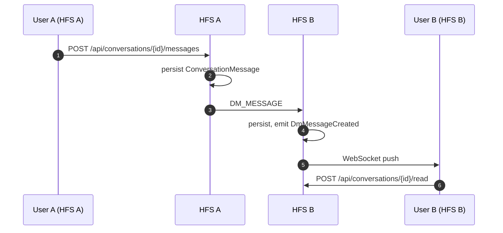
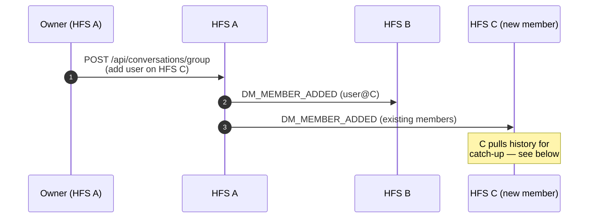
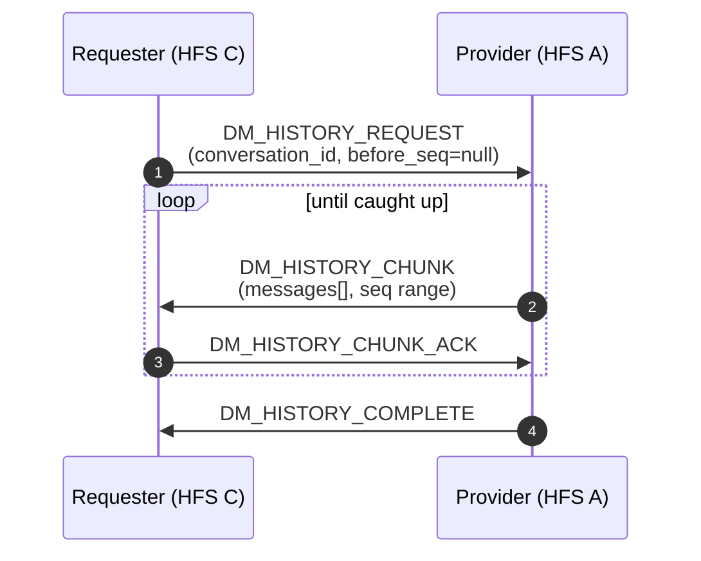
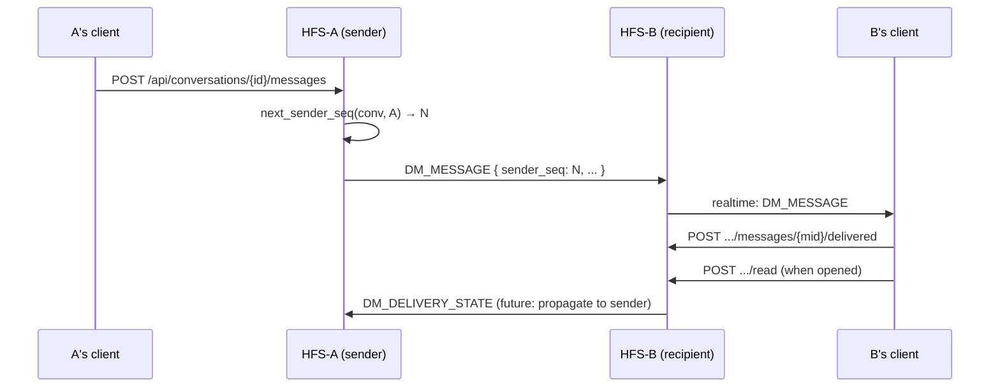
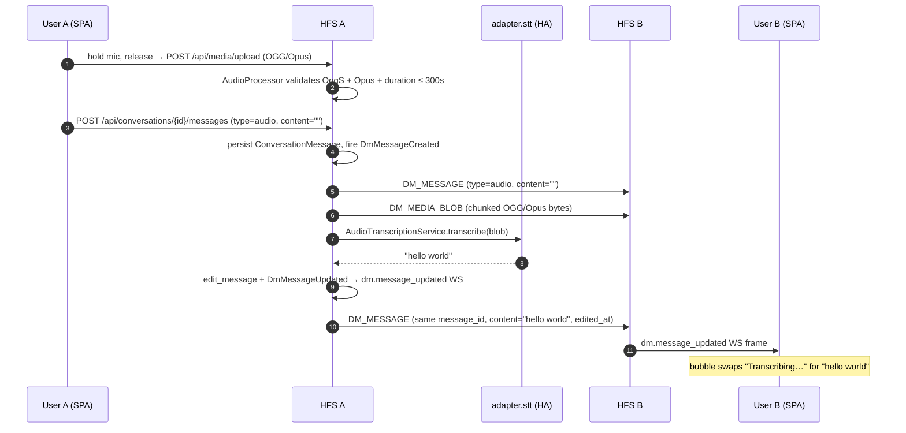

# Direct Messages

1:1 and group conversations between users. Unlike space content, DMs
are scoped to the conversation's participants — there is no space
envelope and no admin hierarchy. Every participant's HFS holds a full
copy of the conversation history.

## Scope

- **HFS**: both sides. Sends, receives, persists, requests history
  from a peer.
- **GFS**: only for optional contact discovery
  (`DM_CONTACT_REQUEST` routed via GFS between unpaired users) and
  push fan-out when a recipient is offline (see
  [push-relay](./push-relay.md)).

## DM E2E is transport-only

Federation envelopes carrying DM payloads are AES-256-GCM encrypted
in transit, per the encryption-first rule. **Once decrypted on the
receiver, DM content is stored as plaintext in local SQLite** — the
same way posts, comments, and every other content type is stored.
There is no separate message-at-rest encryption. Rationale: the
threat model is an HFS operator who already has filesystem access; an
additional encryption layer against them would be theatre.

## Event types

**Messages**

`DM_MESSAGE`, `DM_MESSAGE_DELETED`, `DM_MESSAGE_REACTION`,
`DM_USER_TYPING`, `DM_RELAY` (relay wrapper for group DMs),
`DM_MEDIA_BLOB` (v_3+, full-bytes follow-up for cross-household
picture / video / file / **voice-note** attachments — see
[DM media](./dm-media.md)).

**Membership**

`DM_MEMBER_ADDED`, `DM_CONTACT_REQUEST`, `DM_CONTACT_ACCEPTED`,
`DM_CONTACT_DECLINED`.

**History pull**

`DM_HISTORY_REQUEST`, `DM_HISTORY_CHUNK`, `DM_HISTORY_CHUNK_ACK`,
`DM_HISTORY_COMPLETE`.

## Receiver rules

Every DM event names a conversation, a message and a person; the
receiver binds each to the household that signed the envelope
(`from_instance`), using only what it already stores — the user's home
household and the conversation's remote seats
(`conversation_remote_members`). It drops the event with a WARNING when:

- **`DM_MESSAGE`** — the sender is not a user of `from_instance` (a
  local member, a third household's user, or unknown); the message id
  already exists in another conversation or from another sender (an edit
  or transcript re-send is honoured only for the sender's own message);
  the conversation exists here but the sender holds no seat in it; or the
  conversation is new and no recipient is a local user. An existing
  conversation's seats are never changed by an inbound message — except
  an older 1:1 whose remote seat was never written: it is restored for a
  sender homed on `from_instance` who already wrote in it (exactly one
  local member, no remote seat). A DM whose sender this household has no
  user row for yet is not dropped: it is held (bounded, expiring, in
  memory) and replayed through these same rules once that user syncs.
- **`DM_MESSAGE_DELETED`** — the message was not sent by a user of
  `from_instance`, or it is not in the named conversation.
- **`DM_MESSAGE_REACTION`** — the reactor is not a seated user of
  `from_instance` in the message's conversation.
- **`DM_USER_TYPING`** — the typist is not a seated user of
  `from_instance`; the frame carries the username this household holds
  for them, not the payload's.
- **`DM_HISTORY_REQUEST`** — `from_instance` holds no seat in the
  conversation (nothing is sent back, not even `DM_HISTORY_COMPLETE`).
- **`DM_HISTORY_CHUNK` / `_COMPLETE`** — `from_instance` holds no seat;
  per message, the sender is not a seated user of `from_instance`.
  A message is inserted when absent; one already here is updated from the
  chunk (the sender's later edit or delete) only when the stored row has
  the same sender in the same conversation.
- Known limitation: after a `USER_MOVED`, conversations seated under the
  user's old household keep that seat, so messages from the new home are
  refused there until the conversation is re-seated.

Implementation: `socialhome/federation/dm_scope.py` (`DmScope`);
`tests/protocol/test_dm_scope.py`.

## Flow — 1:1 DM

```mermaid
sequenceDiagram
    autonumber
    participant UA as User A (HFS A)
    participant A as HFS A
    participant B as HFS B
    participant UB as User B (HFS B)
    UA->>A: POST /api/conversations/{id}/messages
    A->>A: persist ConversationMessage
    A->>B: DM_MESSAGE
    B->>B: persist, emit DmMessageCreated
    B->>UB: WebSocket push
    UB->>B: POST /api/conversations/{id}/read
```

## Flow — group DM, member added

```mermaid
sequenceDiagram
    autonumber
    participant OA as Owner (HFS A)
    participant A as HFS A
    participant B as HFS B
    participant C as HFS C (new member)
    OA->>A: POST /api/conversations/group<br/>(add user on HFS C)
    A->>B: DM_MEMBER_ADDED (user@C)
    A->>C: DM_MEMBER_ADDED (existing members)
    Note over C: C pulls history for<br/>catch-up — see below
```

## Flow — history pull

New members and re-installed clients need history. The requester
pulls chunks from any one existing participant (usually the most
recent writer).

```mermaid
sequenceDiagram
    autonumber
    participant R as Requester (HFS C)
    participant P as Provider (HFS A)
    R->>P: DM_HISTORY_REQUEST<br/>(conversation_id, before_seq=null)
    loop until caught up
        P->>R: DM_HISTORY_CHUNK<br/>(messages[], seq range)
        R->>P: DM_HISTORY_CHUNK_ACK
    end
    P->>R: DM_HISTORY_COMPLETE
```

## Reliability — read receipts + delivery state (§12.5)

Each DM_MESSAGE envelope stamps a monotonic `sender_seq` per
`(conversation_id, sender_user_id)`. Recipients record one row per
seen message in `conversation_delivery_state`: first `delivered`
(acked from the browser once the frame lands), then `read` when the
user opens the conversation. `read` supersedes `delivered` — the
upsert never downgrades.

Read receipts are end-to-end, not routing-layer. The browser sends a
`POST /api/conversations/{id}/read` on "mark all read" which
bulk-upserts `read` state for every visible message from other
participants. A `POST /api/conversations/{id}/messages/{mid}/delivered`
covers the single-message ack path.

```mermaid
sequenceDiagram
    participant A as A's client
    participant SH_A as HFS-A (sender)
    participant SH_B as HFS-B (recipient)
    participant B as B's client
    A->>SH_A: POST /api/conversations/{id}/messages
    SH_A->>SH_A: next_sender_seq(conv, A) → N
    SH_A->>SH_B: DM_MESSAGE { sender_seq: N, ... }
    SH_B->>B: realtime: DM_MESSAGE
    B->>SH_B: POST .../messages/{mid}/delivered
    B->>SH_B: POST .../read (when opened)
    SH_B->>SH_A: DM_DELIVERY_STATE (future: propagate to sender)
```

## Reliability — sequence-gap detection

When HFS-B's inbound handler sees `sender_seq = N` but `last_seq < N-1`
for `(conv, A)`, every missing value between them is persisted to
`conversation_message_gaps`. The client polls
`GET /api/conversations/{id}/gaps` and shows a "some messages may be
missing" banner above the oldest gap. Out-of-order arrivals that fill
a gap call `resolve_gap` automatically so the banner clears.

```mermaid
sequenceDiagram
    participant SH_A as HFS-A (sender)
    participant SH_B as HFS-B (recipient)
    Note over SH_A,SH_B: Normal: seq 1, 2, 3, 4 arrive in order
    SH_A->>SH_B: DM_MESSAGE seq=5
    SH_B->>SH_B: last_seen=4 → no gap, save
    Note over SH_A,SH_B: Transport drops seq=7 (routing failure)
    SH_A->>SH_B: DM_MESSAGE seq=8
    SH_B->>SH_B: last_seen=5, incoming=8 → gap [6,7]
    SH_B->>SH_B: insert_gaps([6,7])
    SH_A->>SH_B: DM_MESSAGE seq=6 (delayed relay)
    SH_B->>SH_B: incoming=6 <= last_seen=8 → resolve_gap(6)
    Note over SH_A,SH_B: seq=7 still missing; UI banner persists
```

Gap-fill back-pressure (asking the sender to resend a specific seq
range) lands in a follow-up — the current revision persists the gaps
and surfaces them to the UI, which is enough for users to notice
and ask the sender to repost.

## Relay-path diagnostics

`conversation_relay_paths` records the sticky primary route chosen by
`DmRoutingService.select_conversation_path` for each `(conversation,
target_instance)`. `GET /api/me/relay-paths?conversation_id=…` (future)
and `dm_routing_repo.list_relay_paths` expose it for a future
diagnostics UI.

## Audio messages (voice notes)

WhatsApp-style hold-to-record voice notes. Captured by the SPA via
`MediaRecorder`, 24 kbps mono, 5-minute hard cap. The container is
whichever the browser's `MediaRecorder` produces — Firefox emits
OGG/Opus, Chromium-based browsers emit WebM/Opus, and Safari emits
MP4/AAC. All three are accepted; server-side PyAV decodes them
losslessly to PCM before STT and all three play back natively in
every modern browser.

Uploaded through the standard media pipeline, federated via the
existing v_3 cross-household media path (`DM_MESSAGE` envelope with
`type="audio"` plus a follow-up `DM_MEDIA_BLOB` carrying the full
bytes when the recipient is on another household). Same federated-
only rule as image / video / file media — relayed conversations
reject the send with `MEDIA_REQUIRES_DIRECT_PAIRING`.

The wire-shape addition is in `content`: for voice notes,
`ConversationMessage.content` carries the **STT transcript**. It is
empty when the message lands; the sender's HA STT runs on the
just-uploaded blob and patches the row a moment later, federating
the update via a second `DM_MESSAGE` carrying the same `message_id`
+ the new content + an `edited_at` field. The receiver's inbound
handler detects the existing row and publishes `DmMessageUpdated`
instead of `DmMessageCreated`, which fans the change out to open
thread tabs as a `dm.message_updated` WS frame.

If a remote sender shipped audio without a transcript (no STT
configured on their side), the recipient's
`AudioTranscriptScheduler` polls for empty-transcript audio rows
younger than one hour, runs the **recipient's** local STT, and
patches the same way — so a household with HA STT can fill in
transcripts for messages it receives from households without STT.

```mermaid
sequenceDiagram
    autonumber
    participant UA as User A (SPA)
    participant A as HFS A
    participant STT as adapter.stt (HA)
    participant B as HFS B
    participant UB as User B (SPA)
    UA->>A: hold mic, release → POST /api/media/upload (OGG/Opus)
    A->>A: AudioProcessor validates OggS + Opus + duration ≤ 300s
    UA->>A: POST /api/conversations/{id}/messages (type=audio, content="")
    A->>A: persist ConversationMessage, fire DmMessageCreated
    A->>B: DM_MESSAGE (type=audio, content="")
    A->>B: DM_MEDIA_BLOB (chunked OGG/Opus bytes)
    A->>STT: AudioTranscriptionService.transcribe(blob)
    STT-->>A: "hello world"
    A->>A: edit_message + DmMessageUpdated → dm.message_updated WS
    A->>B: DM_MESSAGE (same message_id, content="hello world", edited_at)
    B->>UB: dm.message_updated WS frame
    Note over UB: bubble swaps "Transcribing…" for "hello world"
```

```mermaid
sequenceDiagram
    autonumber
    participant A as HFS A (no STT)
    participant B as HFS B (HA STT)
    participant SCH as AudioTranscriptScheduler (B)
    A->>B: DM_MESSAGE (type=audio, content="")
    A->>B: DM_MEDIA_BLOB (chunked OGG/Opus bytes)
    Note over B: row persisted with empty transcript
    SCH->>B: every 30s, find pending audio < 1h, remote sender
    SCH->>SCH: read local blob, run adapter.stt.transcribe
    SCH->>B: edit_message + DmMessageUpdated → dm.message_updated WS
    Note over B: B's open tabs now show the transcript;<br/>A is unaffected
```

Implementation pointers:

- `socialhome/media/audio_processor.py` — OggS / Opus / duration cap
- `socialhome/services/audio_transcription_service.py` — OGG→PCM
  decode + fail-silent adapter wrap
- `socialhome/services/dm_service.py` — `send_message(type="audio")`
  + the fire-and-forget transcribe-and-patch path
- `socialhome/infrastructure/audio_transcript_scheduler.py` —
  receiver-side fallback STT
- `client/src/components/VoiceRecordButton.tsx` — hold-to-record
  with slide-up-to-lock
- `client/src/components/AudioBubble.tsx` — inline `<audio>` +
  transcript line

## Contact requests

`DM_CONTACT_REQUEST` lets a user on HFS A ask a user on HFS B for
permission to DM. If A and B are already paired the envelope goes
directly; if not, it's routed via a mutually-paired intermediary (a
GFS or a common peer HFS) using the `_VIA` pattern. The payload
includes the sender's display name and a short message; recipients
can `DM_CONTACT_ACCEPTED` or `DM_CONTACT_DECLINED`.

## Push privacy (§25.3)

Push notifications for DMs carry the title only — no message body.
This applies even when the push notification service is GFS-mediated.

## Implementation

- `socialhome/services/dm_service.py` — CRUD + history.
- `socialhome/services/federation_inbound/dm.py` — inbound handlers.
- `socialhome/federation/sync/dm_history/` — history pull machinery.
- `socialhome/repositories/conversation_repo.py`,
  `conversation_message_repo.py`.
- `socialhome/routes/conversation_routes.py`.

## Spec references

§23.47 (DM UX),
§25.3 (push privacy),
feedback: DM E2E is transport-only
(`~/.claude/projects/…/memory/feedback_dm_e2e_transport_only.md`).
