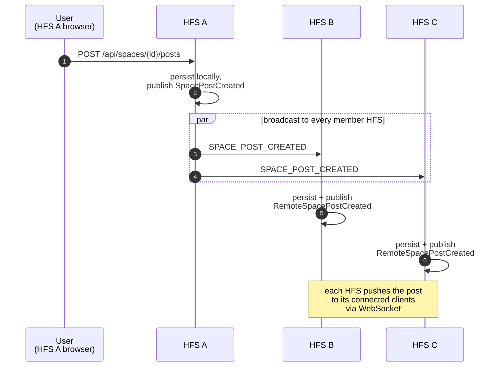
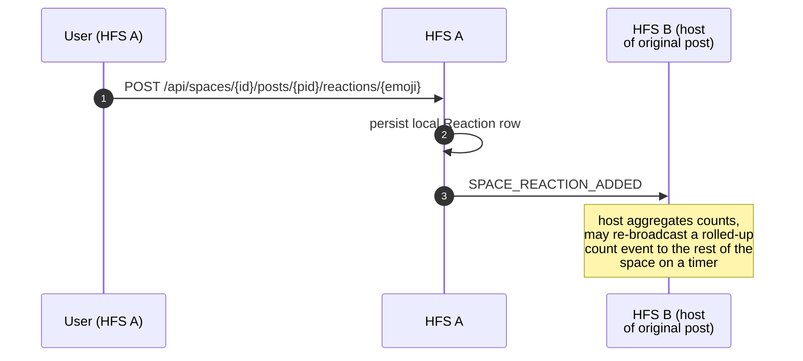

# Feeds — Posts, Comments, Reactions

Once a space is live and synced, every new post, comment, and reaction
is broadcast to every member instance. These are the highest-volume
federation events.

## Scope

- **HFS**: origin broadcasts; every peer member instance applies.
- **GFS**: only involved when a peer is offline and opted into push
  fan-out — see [push-relay](./push-relay.md). Never for spaces marked
  private.

## Event types

**Household feed (same HFS only; not federated but included here for
symmetry with UI)** — not a federation event type.

**Space feed**

`SPACE_POST_CREATED`, `SPACE_POST_UPDATED`, `SPACE_POST_DELETED`,
`SPACE_COMMENT_CREATED`, `SPACE_COMMENT_UPDATED`,
`SPACE_COMMENT_DELETED`, `SPACE_REACTION_ADDED`,
`SPACE_REACTION_REMOVED`.

**Space-wide poll + schedule-poll (carried inside posts)**

`SPACE_POLL_CREATED`, `SPACE_POLL_VOTE_CAST`, `SPACE_POLL_CLOSED`.

## Flow — new post fan-out

## Flow — reaction

## Edit & delete

`_UPDATED` carries the new content and a fresh `updated_at`. `_DELETED`
carries the `post_id` or `comment_id` only — content is already gone
on the sender side. The receiver idempotently updates or removes by
ID; if the receiver has never seen the ID (e.g. missed the create
event during a network partition), the `_UPDATED` / `_DELETED` is
dropped silently.

## Polls

A poll lives inside a post. `SPACE_POLL_CREATED` announces the poll
options when a post of type `poll` is federated;
`SPACE_POLL_VOTE_CAST` carries one vote; `SPACE_POLL_CLOSED` ends the
voting window.

Votes are encrypted: the envelope payload includes only the vote's
`option_id` and the voter's `user_id`, which stay inside the space's
encrypted payload. GFS cannot tally votes even on public spaces.

## Implementation

- `socialhome/services/post_service.py` — space and household post CRUD.
- `socialhome/services/comment_service.py` — comment CRUD.
- `socialhome/services/reaction_service.py` — reaction toggling.
- `socialhome/services/poll_service.py`,
  `schedule_poll_service.py` — polls.
- `socialhome/services/federation_inbound/space_content.py` —
  inbound handlers for all of the above.
- `socialhome/routes/post_routes.py`, `comment_routes.py`,
  `reaction_routes.py` — REST endpoints.

## Spec references

§13.4 (space feed semantics),
§25.8.21 (poll-vote encryption),
§27.5 (integration tests for fan-out).
