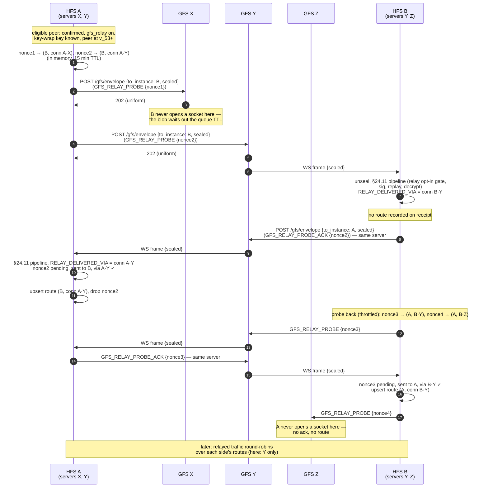
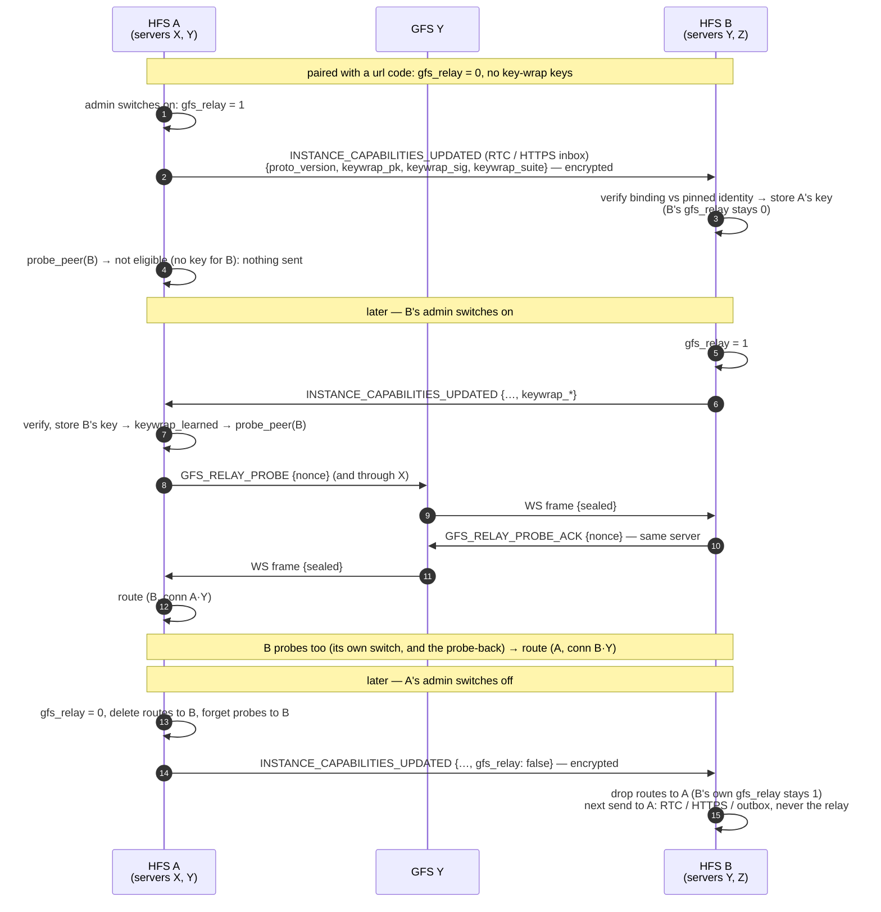

# GFS relay for paired households

The last-resort transport between two **paired** households: when neither
the WebRTC DataChannel nor the HTTPS inbox reaches the peer, an ordinary
§24.11 envelope is sealed to the peer's static key-wrap key and handed to a
connection server (GFS) that **both** households use, which pushes it down
the peer's WebSocket. This page covers how the two households find those
shared servers (v_53) without either one ever naming a server to the
other. The relay wire shape itself (`{to_instance, sealed}`, size buckets)
is documented in [`invites.md`](./invites.md); the transport tiers are in
[`architecture.md`](../architecture.md#progressive-sync-42).

## Scope

- **HFS**: full participant. Per peer, the admin opts into the relay
  (`remote_instances.gfs_relay`, local-only, never federated). Each
  household probes the peer through each of its own servers, answers
  probes, and keeps its own list of confirmed routes
  (`peer_gfs_routes` — each route is THIS household's own
  `gfs_connections.id`).
- **GFS**: content-blind relay. It sees two more identity-free relay
  bodies per probe round and answers `202` to all of them, exactly as for
  any other relayed blob. It takes no part in discovery and cannot tell a
  probe from any other envelope.
- **Paired peers only** (`source = manual`). A household seated from an
  invite link (`space_session`) already rides the one server that
  introduced it; the probe and ack types are not in its allow-list, so the
  §24.11 peer-class gate refuses them.

## Event types

`GFS_RELAY_PROBE`, `GFS_RELAY_PROBE_ACK`.

Both carry exactly `{nonce}` — 128 random bits, `secrets.token_urlsafe(16)`
— inside the AES-256-GCM federation payload. The plaintext envelope fields
are the usual routing set (`from_instance`, `to_instance`, `event_type`,
`msg_id`, `timestamp`, `space_id = null`); no server URL, server id,
connection id or inbox id appears anywhere, in the clear or encrypted
(pinned by `tests/protocol/test_gfs_relay_route_discovery.py`).

Gated on `FederationCapability.MIN_FOR_GFS_RELAY_ROUTES` (v_53): a peer
below it is never probed, holds no routes, and so never gets the relay
fallback.

## Flow — probe and ack

Household A uses servers X and Y; household B uses Y and Z. Only Y is
shared.

### Rules

- **Probe only through our own servers.** A probes through each of its own
  active `gfs_connections` whose server proved the `envelope_relay`
  capability on its signed `/gfs/info` block — never through a server it is
  not registered with. The relay sender enforces the same (it resolves
  the URL against our own connections).
- **A route comes only from an ack to one of OUR OWN probes**, through the
  server that probe was sent on — or, once, from a pairing code that
  named the server ([Bootstrap route](#bootstrap-route-from-a-pairing-code)). Receiving a probe records nothing: the
  relay body is identity-free, so a malicious server the prober uses can
  re-post the sealed probe onto another server the receiver uses but the
  prober never reads. Had the receiver recorded that server, its relayed
  traffic would go where the relay answers `202` and nobody collects it —
  a silent loss the attacker could keep alive every round. Instead the
  receiver acks and **probes back** (throttled per peer), so both sides
  confirm their own direction.
- **A probe is answered only if it arrived over the relay.** The relay
  inbound leg (`services/gfs_relay_inbound.py`) binds
  `RELAY_DELIVERED_VIA` to B's own connection id for the duration of the
  dispatch; the handler reads it synchronously. A probe that arrived over
  RTC or the HTTPS inbox (or through a server that is not one of B's
  active connections) is ignored.
- **The ack goes back through the same server.** B answers through the
  connection that carried the probe, explicitly — not round-robin — so
  the ack tests the same server in the other direction.
- **The prober accepts an ack only if** the nonce is pending (not
  expired), was sent to the sender of the ack, and the ack arrived over
  the very connection the probe was sent through. Anything else is ignored
  at DEBUG and the nonce stays pending (a wrong-peer or wrong-server ack
  cannot burn the genuine one).
- **Both payloads are `{nonce}` only.** Each side stores only its own
  connection ids; the intersection is learnt by what arrived where, never
  by what was said.
- **A peer we did not opt in with cannot probe us.** The §24.11 relay
  opt-in gate (`make_check_relay_opt_in`) drops a relayed envelope from a
  paired peer whose `gfs_relay` is off before any handler runs — so no
  ack is sent.

### Round-robin

Once routes exist, `FederationTransport` reaches the paired peer
RTC → HTTPS inbox → relay, and the relay tier round-robins over the
peer's routes (resolved to the base URLs of our currently active
connections), trying each at most once per send. Probes and acks
themselves never round-robin: they use
`FederationService.send_event_via_gfs`, which seals exactly like
`send_event` but delivers through one named server, best-effort (no
outbox, no reachability change; a `202` is acceptance, not delivery). Nor
is a probe's `202` recorded as a relay acceptance: every server answers
`202` to every probe, so it would mark a healthy direct peer "relay only"
after each round.

### Refresh, triggers and expiry

- **Every 24 h ± 1 h** (`GfsRouteDiscoveryScheduler`) every eligible peer
  is re-probed. Only an accepted ack refreshes a route (`last_ack_at`);
  a received probe makes the receiver probe back, which refreshes its
  side.
- **On our own GFS (re)connect** an early round is requested. Triggers
  within 30 s coalesce into one round, a triggered round never starts
  within 10 min of the previous round, and each peer is probed at most
  once a minute — so a reconnect storm or a flapping socket costs one
  round per 10 min. A scheduler stop lands between peers, never mid-POST.
- **On demand:** `probe_peer(instance_id)` probes one peer at once (for
  a fresh pairing or a newly enabled opt-in; same per-peer cap). The
  admin switching the fallback from off to on (v_54) probes past that
  window — even right after another probe — and opens none: its probe
  usually goes unanswered (the other side has not switched on yet), and
  our probe-back when the other side does must not be swallowed by it. A
  repeated "on" is an ordinary, throttled probe. Either side switching
  off clears the probe and answer windows for that peer, so the next
  switch-on starts fresh.
- **Expiry:** a route whose `last_ack_at` is older than 72 h (three
  intervals) is deleted, so one missed round never costs a working route
  but a peer that left a server stops being relayed there. Until then —
  up to 72 h, on either side, since both sides keep routes — a relayed
  send through that server is answered `202` and lost (the relay cannot
  say the recipient is gone without becoming a presence oracle). Removing
  one of OUR connection servers deletes its routes at once (FK cascade).
  A peer switching its fallback **off** does not wait for expiry: it tells
  us (`gfs_relay: false`, below) and we drop our routes to it at once.
- **Caps:** at most 1024 outstanding probes (oldest forgotten first, with
  a WARNING — its ack will be ignored), a
  15 min ack window, and at most one ack per peer per server every 30 s —
  a paired peer cannot make us spend unbounded relay posts.

### Bootstrap route from a pairing code

A pair made from a pairing code with a GFS reach
([`pairing.md`](./pairing.md#reach--pairing-through-a-gfs)) needs a
route before discovery can run: when one side has no URL, the pairing
confirm and the first §24.11 envelopes (capabilities, profiles) can only
ride the relay. So whoever writes the peer's row during the handshake —
the scanner on scan, the code owner on the accept — sets `gfs_relay`,
stores the peer's verified key-wrap key and **seeds one route**: its own
connection to the server the code named (`last_ack_at` = now) — only
when the peer provably reads that server. The scanner always does (the
code owner is on it). The code owner does when the accept arrived
through that server or the scanner has no URL (such a scanner refuses a
code whose server it is not on); a scanner that answered at the inbox
with its own URL gets no seeded route, since a route through a server
it never reads turns every fallback into a silent `202` — discovery
finds the servers the two really share.

This does not reopen the hole the ack rule closes. The rule exists
because a received relay frame proves nothing about which server the
SENDER reads; a seeded route never comes from where a frame arrived.
It comes from the code — exchanged out of band, verified against the
code owner's identity key — and from our own registration with that
same server (matched by its pinned `gfs_instance_id`). After the pair
confirms, each side calls `probe_peer`, so discovery confirms or adds
routes; a seeded route that no ack ever refreshes expires after 72 h
like any other. The code and the signed peer-accept carry each side's
`proto_version`, so the v_53 gate on probing already holds at confirm
time.

## Turning the fallback on for an existing pair

A pair made with a plain `url` code — or before the relay existed — has
`gfs_relay = 0` on both sides and neither holds the other's key-wrap
key, so neither can seal anything to the other. Each admin can switch
the fallback on later, per connection
(`PATCH /api/pairing/connections/{id}` `{gfs_relay: true}`, see
[`api.md`](../api.md); the Connections → Manage panel's "Use the GFS as
a fallback" switch). Since v_54
(`FederationCapability.MIN_FOR_GFS_RELAY_KEY_EXCHANGE`).

- **The key rides the capabilities announcement.** No new event: to a
  directly paired peer we opted in with, `INSTANCE_CAPABILITIES_UPDATED`
  also carries `keywrap_pk` / `keywrap_sig` / `keywrap_suite` — our
  static key-wrap key (the one `/gfs/info` and a GFS-reach code carry),
  its identity binding signature and the `"x25519"` suite tag — inside
  the AES-256-GCM payload, next to `gfs_relay: true`. Switching on sends
  it to that one peer at once; the startup fan-out repeats it while the
  switch stays on. A peer we did not opt in with never gets the key — its
  announcement says `gfs_relay: false` instead.
- **The receiver checks it against the pinned identity.** The suite must
  be known (unknown or missing → refused, never defaulted) and the key
  self-signed by the identity key pinned for that household at pairing
  (`verified_peer_keywrap`); anything else is dropped at WARNING and the
  stored key stays. Only `source = manual` rows take a key this way. A
  stored key does **not** opt the receiver in — that stays its own
  admin's switch.
- **Both sides must switch on.** Probing needs the peer's key, and the
  §24.11 relay opt-in gate refuses relayed envelopes from a household we
  did not opt in with — so with only one side on, no relay body is ever
  posted. When the second side switches on, its key reaches the first
  side, which probes at once (a newly learned key triggers `probe_peer`);
  the second side probes too. Discovery then runs exactly as above. A
  probe that overtakes the announcement carrying its sender's key (the
  probe rides the GFS, the key the direct link) cannot be acked — we have
  nothing to seal to — so it is ignored without opening the 30 s answer
  window; the sender's next probe, triggered by ours, is answered.
- **Off** clears our opt-in, deletes that peer's routes and our probes in
  flight to it (a late ack re-creates nothing — the ack handler re-reads
  the opt-in), and re-sends our capabilities with `gfs_relay: false`. The
  receiver (directly paired peers only; an explicit `false`, never a
  missing field) drops **its** routes to us and its probe state for us,
  without touching its own opt-in. Without that it would keep relaying to
  us for up to 72 h: the relay answers `202`, so those envelopes count as
  delivered and are never queued, while our gate refuses every one. Now
  its next send takes RTC / the HTTPS inbox and, failing those, its
  outbox. The keys stay (public, bound to the identity key, needed if the
  switch comes back on); switching on again runs the key / probe flow and
  restores the routes on both sides.
- **Older peers.** A v_53 peer never sends its key, so the switch cannot
  complete with it unless we already hold its key from a GFS-reach
  pairing; the connections API says so (`gfs_relay_available: false`)
  and the SPA tells the admin the other household needs a newer Social
  Home. The status line otherwise reads "reachable through N GFS"
  (`gfs_routes`), "waiting for the other household" (on, peer key
  unknown) or "no GFS you both use found yet" (on, keys known, no route).
  Which GFS the two share is never shown — only counted.

## Privacy — who learns what

| Party | Learns |
|---|---|
| A (prober) | Which of ITS OWN servers B also uses (the intersection) — nothing about B's other servers. |
| B (receiver) | The same intersection, from which of its own sockets the probe arrived on — nothing about A's other servers. |
| A server both use (Y) | Relay bodies `{to_instance, sealed}` both ways, padded to a size bucket like any relayed envelope: recipient, time, size bucket. The content is opaque, but a probe followed within seconds by a small blob in the other direction — and a probe back — may be recognisable as a probe / ack exchange by timing and size alone; that reveals only that the two households exchange relayed envelopes through it, which the relay fallback concedes anyway (below). |
| A server only A uses (X) | One relay body addressed to B's instance id, which it queues and never delivers (B is not its client). It learns that *someone* addressed B — the same as any relayed envelope. |
| A server only B uses (Z) | The same, mirrored: B's probe back, addressed to A, queued and never delivered. |

### Residuals

- **A malicious server cannot plant a route.** A server one household
  uses (X) may re-post that household's sealed probe onto another server
  the peer uses (Z). The peer then acks through Z, where the prober never
  reads, and records nothing — at most it is made to spend one ack (and
  its throttled probe back) on a server that leads nowhere. Pinned by
  `test_a_malicious_gfs_replaying_a_probe_elsewhere_creates_no_route`.

- **A paired peer can test a server it is not on.** A malicious paired
  peer could `POST /gfs/envelope` a probe through an arbitrary server it is
  *not* registered with (the relay body is identity-free, so nothing stops
  it) — our ack, queued there for it, tells it that we use that server
  once it connects to collect it. We also record that server as a route
  to the peer until it expires. This is inherent to any intersection
  scheme that lets two parties confirm a shared server, and is limited to
  households we paired with and opted into the relay with (anyone else's
  probe is refused by the §24.11 pipeline before the handler runs). Our
  own sender never does this.
- **A server can correlate the posting IP.** The relay body is
  identity-free, but the HTTP request that carries it still comes from the
  sender's address, and the sender holds its own WebSocket to the same
  server — so the server can link a `POST /gfs/envelope` to the household
  that owns that socket. Accepted as a documented limit (owner decision
  2026-10-08); see [`principles.md`](../principles.md) for the relay's
  metadata concessions.

## Implementation

- `socialhome/services/peer_gfs_relay_service.py` — `PeerGfsRelayService`:
  the per-connection switch (on: opt in, send our key, probe; off: opt
  out, drop routes) and the probe on a newly learned peer key (v_54).
- `socialhome/services/capabilities_outbound.py` — our key-wrap fields
  in `INSTANCE_CAPABILITIES_UPDATED` for opted-in paired peers;
  `socialhome/services/federation_inbound/pairing.py` —
  `_apply_peer_keywrap` on the receiving side.
- `socialhome/services/gfs_route_discovery_service.py` —
  `GfsRouteDiscoveryService`: `probe_peer` / `probe_all`, the probe and
  ack handlers (registered in `attach_to`), pending-nonce map, throttles,
  `expire_stale_routes`.
- `socialhome/infrastructure/gfs_route_discovery_scheduler.py` —
  `GfsRouteDiscoveryScheduler`: 24 h ± 1 h timer, coalesced `trigger()`,
  `_stop: asyncio.Event` lifecycle.
- `socialhome/federation/federation_service.py` —
  `send_event_via_gfs` (seal like `send_event`, deliver via one server).
- `socialhome/federation/transport.py` — `FederationTransport
  .send_via_gfs_url` (one named server) and the round-robin relay tier.
- `socialhome/services/gfs_relay_inbound.py` — `RELAY_DELIVERED_VIA`;
  relayed pairing bodies (`pairing_peer_accept` / `_confirm`).
- `socialhome/federation/pairing_coordinator.py` /
  `socialhome/federation/pairing_gfs_reach.py` — the bootstrap route
  seeded from a pairing code (`_seat_relay`).
- `socialhome/federation/inbound_validator.py` —
  `make_check_relay_opt_in`.
- `socialhome/repositories/federation_repo.py` — `upsert_gfs_route`,
  `list_gfs_routes`, `delete_gfs_routes_older_than`
  (`peer_gfs_routes`, migration 0081).
- `socialhome/app.py` — `_build_gfs_route_discovery`; the GFS
  `on_connected` hook calls `trigger()`.

## Spec references

§24.11 (inbound pipeline), §24.12 (transport tiers), §D2b (connection-server
envelope relay), §25.8.21 (encryption-first).
