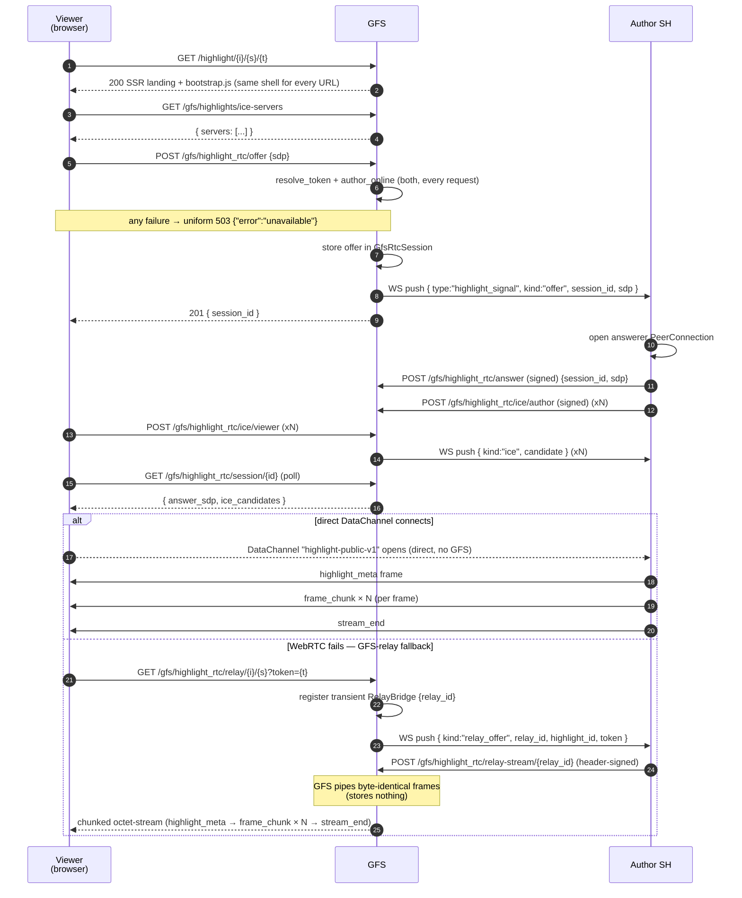

# Highlights — public sharing via GFS

A highlight author can opt a single highlight into public sharing through a
paired Global Federation Server (GFS). The GFS mints a revocable URL
the author can paste into Twitter / email / SMS; anyone visiting the
URL gets a public landing page. The page bootstraps a WebRTC
DataChannel **directly to the author's instance** — highlight bytes never
transit GFS. GFS only relays SDP/ICE during the handshake.

This is the only path in Social Home where a non-Social-Home browser
can view a highlight. The author's existing audience and retention rules
still apply: a publication can never outlive `highlights.expires_at`, and
revoking a token (or unpublishing) takes effect on the next request.

## Scope

- **HFS** runs :class:`HighlightPublicationService` (publish / revoke /
  unpublish) and (PR2) :class:`HighlightSignalingHandler` for the WebRTC
  answerer side.
- **GFS** runs :class:`HighlightPublicationRegistry` and serves the
  ``/highlight/{instance}/{highlight}/{token}`` public landing page. PR2 adds
  the public ``/gfs/highlight_rtc/*`` signalling endpoints.

## URL shape

```
https://{gfs_host}/highlight/{instance_id}/{highlight_id}/{token}
```

* ``instance_id`` — author's HFS instance id.
* ``highlight_id`` — opaque highlight id on that instance.
* ``token`` — 32-byte urlsafe-base64. Revocable, multiple per
  publication. Authoritative; the GFS resolves it against
  ``gfs_highlight_tokens`` and rejects mismatched ``(instance_id, highlight_id)``
  tuples in the URL.

## Wire endpoints

Author SH → GFS (Ed25519-signed body, same `_rtc_authenticate`
middleware as `/gfs/rtc/*`):

| Method | Path | Purpose |
|---|---|---|
| POST | `/gfs/highlights/{highlight_id}/publish` | Record a publication and mint the first share token. Body: `{highlight_id, instance_id, expires_at, label?, signature}`. Returns `201 {token, url, label}`. |
| POST | `/gfs/highlights/{highlight_id}/tokens` | Mint another token under an existing publication. Body: `{label?, signature}`. Returns `201 {token, url, label}`. |
| POST | `/gfs/highlight_tokens/{token}/revoke` | Revoke a single token. Body must come from the publishing instance — guards against cross-instance revoke. |
| POST | `/gfs/highlights/{highlight_id}/unpublish` | Drop the publication; CASCADE revokes every token under it. |

Public (no signature):

| Method | Path | Purpose |
|---|---|---|
| GET | `/highlight/{instance_id}/{highlight_id}/{token}` | SSR landing page. Always `200` with the same viewer shell and `Cache-Control: no-store` (the URL carries the share token). The GFS does not look up the token or check whether the author is online here (see "Not a presence oracle" below). The viewer's offer call is the first point that consults state. |

Public-viewer WebRTC signalling (added in PR2):

| Method | Path | Purpose |
|---|---|---|
| GET | `/gfs/highlights/ice-servers` | Anonymous list of STUN/TURN URLs the browser bootstrap feeds into `RTCPeerConnection`. |
| POST | `/gfs/highlight_rtc/offer` | Anonymous. Body: `{instance_id, highlight_id, token, sdp}`. GFS verifies the token, stores the offer in :class:`GfsRtcSession`, and pushes a `highlight_signal` WS frame to the author's instance. Returns `201 {session_id}`. Every non-success state (unknown / revoked / expired token, URL mismatch, unpublished, author offline) gets the one uniform `503 {"error":"unavailable"}`. |
| GET | `/gfs/highlight_rtc/session/{session_id}` | Anonymous. Browser polls until `answer_sdp` and any author-side ICE candidates land. |
| POST | `/gfs/highlight_rtc/ice/viewer` | Anonymous. Body: `{session_id, candidate}`. Forwards to the author's WS as a `highlight_signal kind=ice` frame. |
| POST | `/gfs/highlight_rtc/answer` | Author SH only (Ed25519-signed). Body: `{instance_id, session_id, sdp, signature}`. Authority guard: `session.initiator_id` must match the signing instance. |
| POST | `/gfs/highlight_rtc/ice/author` | Author SH only (signed). Same authority guard; appends to `ice_candidates` so the next viewer poll sees it. |

GFS-relay fallback (used when the direct DataChannel can't connect — see
"GFS-relay fallback" below):

| Method | Path | Purpose |
|---|---|---|
| GET | `/gfs/highlight_rtc/relay/{instance_id}/{highlight_id}?token=...` | Anonymous, token-gated (same token as the offer flow). Chunked `application/octet-stream`: the GFS pushes a `highlight_signal kind=relay_offer` to the author and pipes the framed bytes the author streams back. Every non-success state (bad / expired token, URL mismatch, author offline, relay capacity, author never connects) gets the uniform `503 {"error":"unavailable"}`, sent at once (only the never-connects branch waits its 30 s budget). `422` (missing token). |
| POST | `/gfs/highlight_rtc/relay-stream/{relay_id}` | Author SH only. Header-auth: `X-SH-Instance` + `X-SH-Signature` (Ed25519 over canonical `{"instance_id","relay_id"}`); body is the raw framed byte stream. `403` (relay's target instance != signer), `404` (unknown relay), `401` (bad signature), `422` (missing headers). |

The viewer DataChannel has label `highlight-public-v1` and uses the
length-prefixed JSON-header / binary-payload framing detailed below. The
GFS-relay fallback streams the **identical** framed bytes over HTTP.

## Retention

* Per-publication: `gfs_highlight_publications.expires_at` is a unix
  epoch mirroring the author's `highlights.expires_at`. The GFS cron
  call `prune_expired(now)` drops past-cap rows; `lookup_active`
  filters live too.
* Per-token: `revoked_at` is `NULL` while active; setting it to a
  unix epoch makes `resolve_token` return `None` immediately.
* Author can revoke any individual token without affecting other
  tokens under the same publication.
* No follower / viewer extension — the same retention rule that
  governs the in-mesh viewer governs the public viewer.

## Not a presence oracle

A publication can only be streamed while the author's instance has a live
SH↔GFS WebSocket, because the offer and the relay are pushed over it. The
GFS must not let an outsider use that as an "is this household online?"
probe ([`principles.md`](../principles.md#the-gfs-is-not-an-author-presence-oracle)):

* The landing page is the same shell for every URL. It does no token lookup
  and no `is_connected` check.
* The offer and the relay GET fold token resolution and the author's
  connection into one boolean
  (`routes/highlight_rtc.py:_servable`). Both checks run on every branch,
  and every failure gets `global_server/public_unavailable.py`'s uniform
  `503 {"error":"unavailable"}` + `Cache-Control: no-store`. Unknown,
  revoked and offline can't be told apart.
  Failures are answered at once, with no added delay. A delay would hide
  nothing, because the matching offer already answers `201` or `503`
  immediately, and it would let anonymous callers hold a socket open for
  30 s. Only the relay's never-streams branch waits, for its 30 s connect
  budget.
* The landing page itself is sent with `Cache-Control: no-store`, because
  its URL carries the share token.
* The viewer renders it as "This isn't available right now." in a
  `role="alert"` region and moves focus to a *Try again* button. It retries
  on its own after 10 s, 30 s and 60 s, then stops. The old offline page
  reloaded every 10 s forever, and that page was itself the oracle.

**Residual:** success shows that the author's household was connected at
that moment. That means a `201` offer (answered or not), or a relay that
streams bytes. Live content from the author's household can't hide this.

## GFS-relay fallback

The direct DataChannel is always tried first. When WebRTC can't connect
(symmetric NAT, blocked UDP, a browser that never gathers a usable
candidate) the viewer bootstrap falls back to a chunked HTTP GET against
`/gfs/highlight_rtc/relay/{instance_id}/{highlight_id}`:

1. The GFS resolves the token, checks that the author's SH↔GFS WS is
   live, and registers a transient in-memory `RelayBridge` keyed by a fresh
   `relay_id`.
2. It pushes a `highlight_signal` WS frame `kind: "relay_offer"`
   (`{relay_id, highlight_id, token}`) to the author.
3. The author opens `POST /gfs/highlight_rtc/relay-stream/{relay_id}` and
   streams the **byte-identical** framed payload (same
   `highlight-public-v1` framing as the DataChannel) back to the GFS.
4. The GFS pipes those bytes straight through to the still-open viewer
   GET and tears the bridge down at `stream_end`.

The GFS stores **zero** content bytes — the `RelayBridge` is purely an
in-memory pipe between the inbound author POST and the outbound viewer
GET. If the token doesn't resolve, the author is offline (no live WS),
relay capacity is full, or the author never connects the relay-stream,
the viewer GET returns the same uniform `503`. It is sent at once, except
on the never-connects branch, which first waits the 30 s budget. See "Not a
presence oracle" above.

## DataChannel framing

Single ordered DataChannel labelled `highlight-public-v1`. Every frame on
the wire is:

```
[u32 header_len BE][header_json][u32 payload_len BE][payload_bytes]
```

`header_json` is UTF-8 JSON with a `kind` field. Reserved kinds (v1):

| `kind` | Direction | Header fields | Payload |
|---|---|---|---|
| `highlight_meta` | author → viewer (first frame) | `highlight` (full Highlight dict), `frames` (manifest: `[{frame_id, sequence, content_type, byte_length, caption_text, caption_emoji, duration_ms}, …]`) | empty |
| `frame_chunk` | author → viewer | `frame_id`, `sequence`, `chunk_index`, `is_last_chunk`, `byte_length` | up to `CHUNK_SIZE` (64 KiB) bytes |
| `stream_end` | author → viewer (terminator) | `kind` only | empty |
| `error` | author → viewer | `error` (one of `expired`, `unauthorized`, `backpressure`) | empty |

Backpressure: author waits on `RTCDataChannel.bufferedAmount <
SEND_HWM_BYTES` (1 MiB) before pushing the next chunk. Reference
encoder + decoder: `socialhome/services/highlight_public_framing.py`;
golden-bytes test in `tests/protocol/test_highlight_public_framing.py`
(release-blocker per CLAUDE.md §27.9).

## Sequence (public viewer flow)



## Public viewer bundle

The viewer that the GFS landing serves is a Preact component built
from `client/gfs/public_highlight.tsx` via a separate Vite config
(`client/vite.gfs.config.ts`) that emits a single self-contained
IIFE bundle to `socialhome/global_server/static/highlight_public_viewer.js`.
Sharing the SPA's Preact + Vite tooling gives us one component model
across both surfaces; future GFS UI work (admin portal port, public
global-space pages) plugs in as additional rollup inputs without a
second toolchain. Run `pnpm build:gfs` from `client/` to rebuild the
GFS bundle alone, or `pnpm build` for both.

## Implementation pointers

- Schema (SH side): `socialhome/migrations/0001_initial.sql` —
  `highlights.public_gfs_id`, `highlights.public_published_at`.
- Schema (GFS side): `socialhome/global_server/migrations/0001_initial.sql`
  — `gfs_highlight_publications`, `gfs_highlight_tokens`.
- Domain: `socialhome/domain/highlight.py` (`Highlight.public_*` fields);
  `socialhome/global_server/domain.py` (`GfsHighlightPublication`,
  `GfsHighlightToken`).
- Repos: `socialhome/repositories/highlight_repo.py`
  (`mark_published` / `mark_unpublished` / `list_published_for`);
  `socialhome/global_server/repositories.py`
  (`SqliteGfsHighlightPublicationRepo`, `SqliteGfsHighlightTokenRepo`).
- Services: `socialhome/services/highlight_publication_service.py` (SH);
  `socialhome/global_server/highlight_publications.py` (GFS registry).
- Routes: `socialhome/routes/highlight_publications.py` (SH);
  `socialhome/global_server/routes/highlights.py` (GFS);
  `socialhome/global_server/routes/highlight_rtc.py` (public + author RTC).
- Author-side answerer: `socialhome/services/highlight_signaling_handler.py`.
- Framing: `socialhome/services/highlight_public_framing.py` +
  `tests/protocol/test_highlight_public_framing.py` (golden-bytes test).
- Public viewer: `client/gfs/public_highlight.tsx` + the matching Vite
  config at `client/vite.gfs.config.ts`.

## Security notes

- Encryption-first carve-out: this is the one Social Home surface
  where content is intentionally readable without a household
  identity. The carve-out is per-highlight and author-initiated; nothing
  becomes public without the author flipping the toggle.
- Signed publish: every `/gfs/highlights/*` mutation is Ed25519-signed
  by the author's instance and verified against the GFS-side
  `client_instances.public_key`. A bad actor cannot publish someone
  else's highlight.
- Token-vs-URL match: the landing handler rejects URLs whose
  `(instance_id, highlight_id)` segment doesn't agree with the resolved
  token, so a stolen token cannot be used to enumerate other
  highlights on the same instance.
- Per-IP rate-limit on the public landing path uses the existing
  `build_listing_rate_limit()` middleware (30/min/IP).
- Author can pull every token instantly via `unpublish`. There's no
  revoke-key-rotation step — the row's deletion is the revoke.
- GFS-relay carries **plaintext** framed bytes — but only of content the
  author has already opted into public sharing, so the relay sees nothing
  the public URL doesn't already expose. The GFS is a transient in-memory
  pipe (`RelayBridge`) and **persists nothing**; there is no at-rest copy
  to leak. The relay-stream POST is still Ed25519 header-signed and the
  bridge rejects a signer whose instance != the relay's target, so a
  third party can't inject bytes into someone else's stream.
