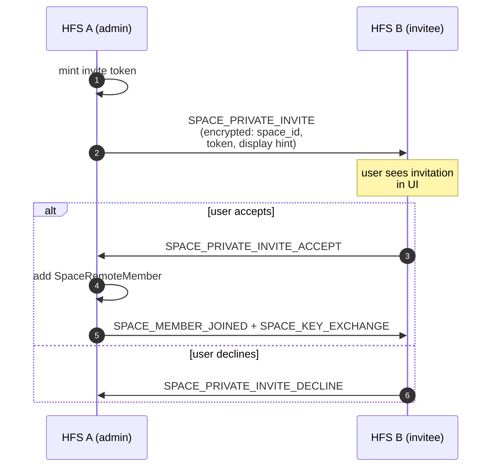
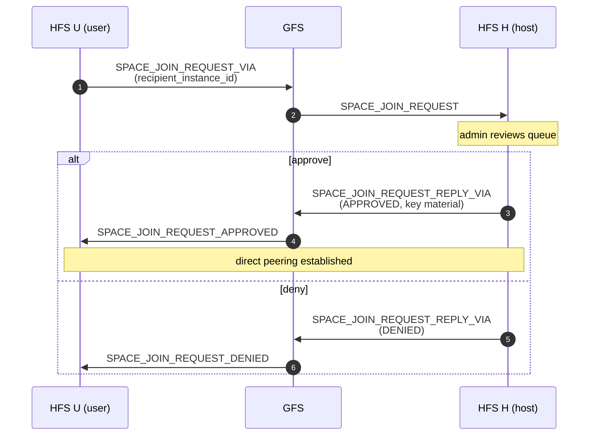

# Invites & Join Requests

Cross-household membership — how a user on HFS A ends up as a member
of a space hosted on HFS B. Two flows: admin-initiated private invites
and user-initiated join requests. Both are designed so GFS can relay
without ever seeing which space, which user, or which household.

## Scope

- **HFS**: mints invite tokens, stores pending invitations, handles
  accept/decline, publishes the resulting `SPACE_MEMBER_JOINED` event.
- **GFS**: only acts as an opaque relay for `_VIA` events between
  instances that are not yet directly paired.

## Event types

**Private invites** (admin → specific remote user)

`SPACE_PRIVATE_INVITE`, `SPACE_PRIVATE_INVITE_ACCEPT`,
`SPACE_PRIVATE_INVITE_DECLINE`, `SPACE_REMOTE_MEMBER_REMOVED`.

**Open invites / join requests**

`SPACE_INVITE`, `SPACE_INVITE_VIA`, `SPACE_ACCEPT`,
`SPACE_JOIN_REQUEST`, `SPACE_JOIN_REQUEST_VIA`,
`SPACE_JOIN_REQUEST_REPLY_VIA`, `SPACE_JOIN_REQUEST_APPROVED`,
`SPACE_JOIN_REQUEST_DENIED`, `SPACE_JOIN_REQUEST_EXPIRED`,
`SPACE_JOIN_REQUEST_WITHDRAWN`.

## Flow — private invite (paired peers)

## Flow — join request via GFS relay

Used when a user wants to join a public space hosted on an HFS they
aren't paired with. The GFS forwards the opaque `_VIA` envelope
without ever decrypting it.

## Zero-leak guarantee (§D1b)

Every field that would identify which space, which invitee, or which
admin is inside the encrypted payload. GFS sees only:

- `event_type` (category, not target)
- `from_instance` / `to_instance` (routing)
- `epoch` (for replay cache)

This holds even when both the inviter and invitee are brand-new to
each other — the invitation carries enough material for the invitee
to pair with the host after accepting, not before.

## Removal

`SPACE_REMOTE_MEMBER_REMOVED` is the counterpart to
`SPACE_MEMBER_LEFT` for cross-household membership: when an admin
removes a remote user, the host broadcasts this event to the user's
home instance so the UI clears local state.

## Implementation

- `socialhome/services/federation_inbound/space_invites.py` —
  inbound handlers.
- `socialhome/federation/private_invite_handler.py` — encrypted
  private-invite logic.
- `socialhome/services/space_service.py` —
  `invite_remote_user()`, `accept_remote_invite()`,
  `decline_remote_invite()`, `request_join_remote()`.
- `socialhome/repositories/space_invitation_repo.py` — pending
  invitations.

## Spec references

§D1b (zero-leak cross-household invites),
§25.8.20 (session keys in accepted invites),
§25.8.21 (encryption-first rule).
