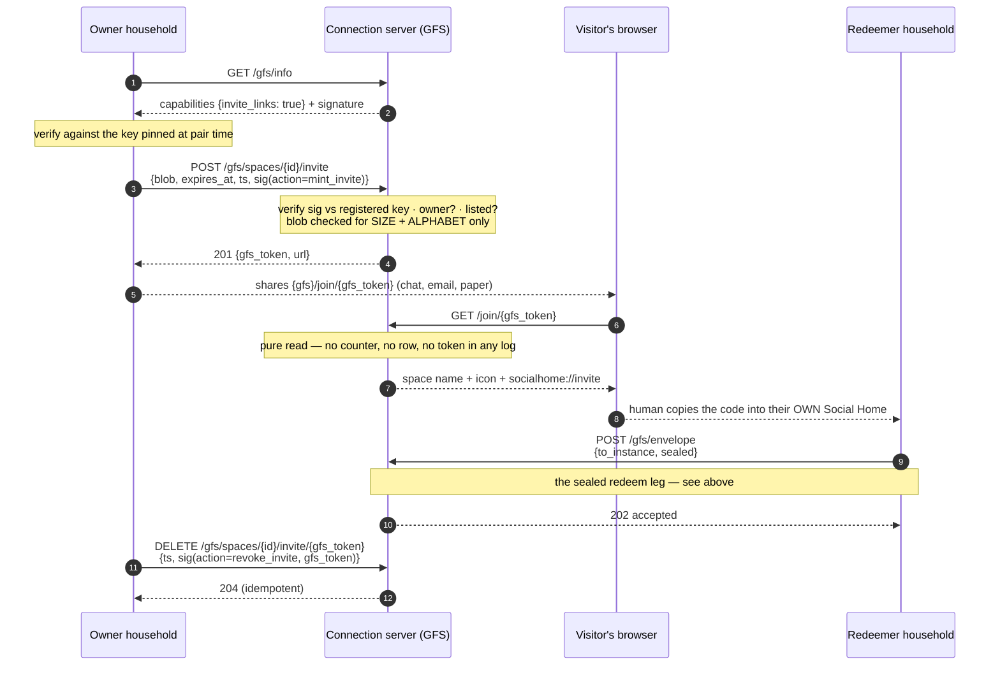
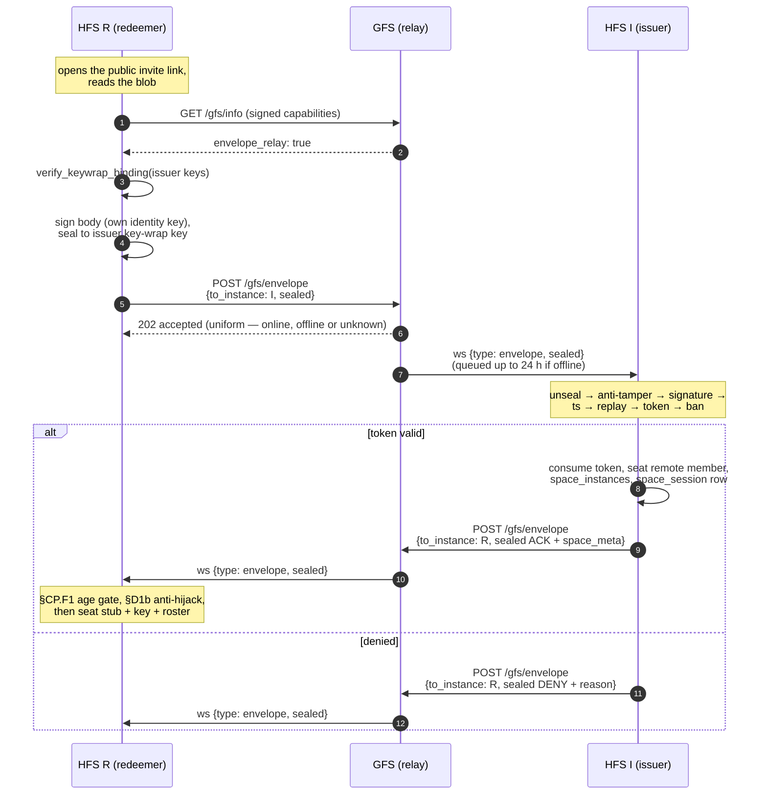
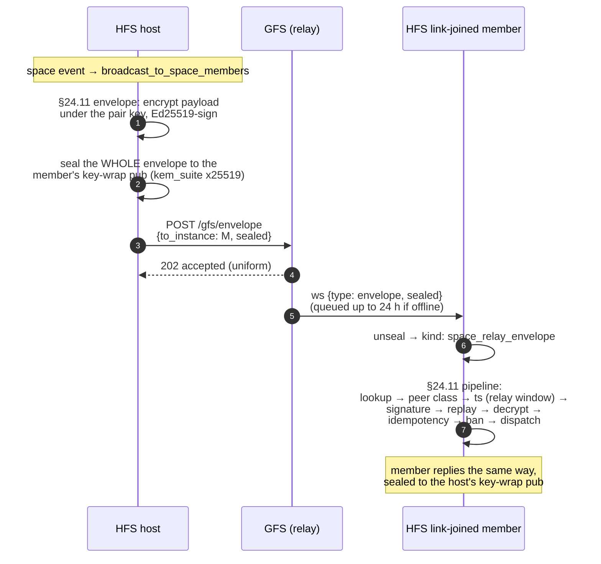
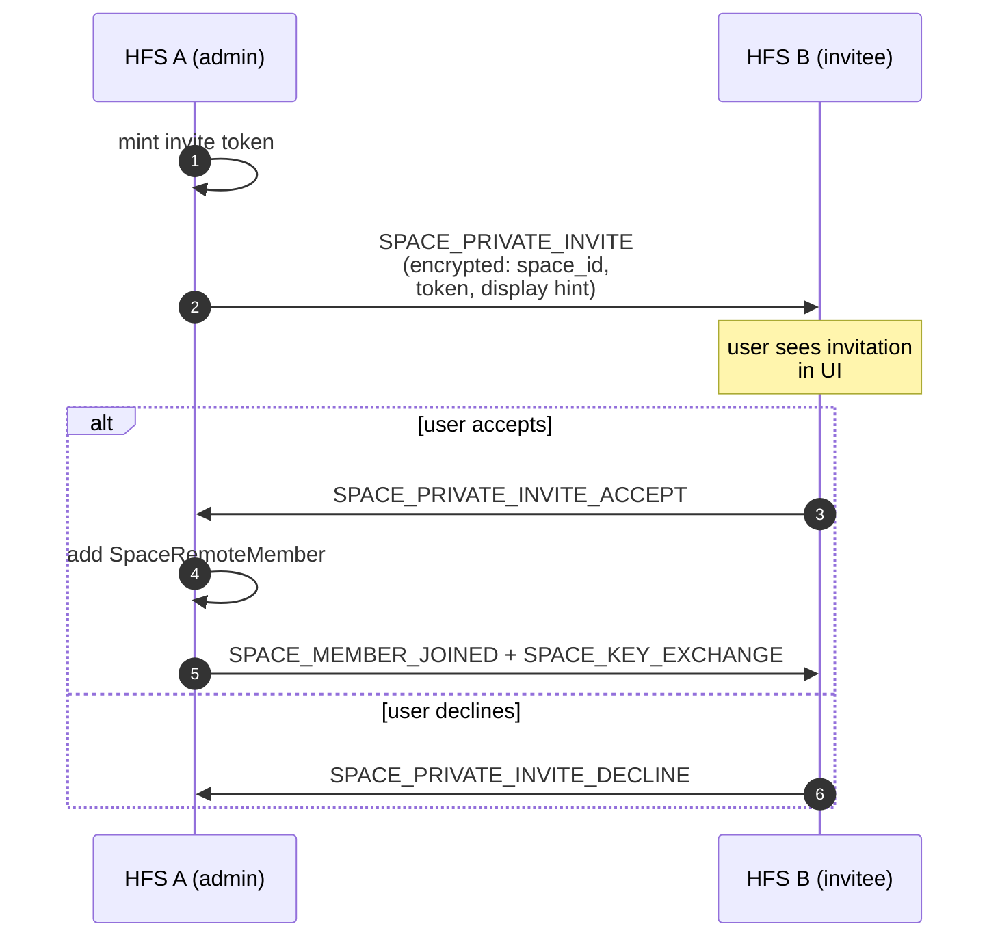
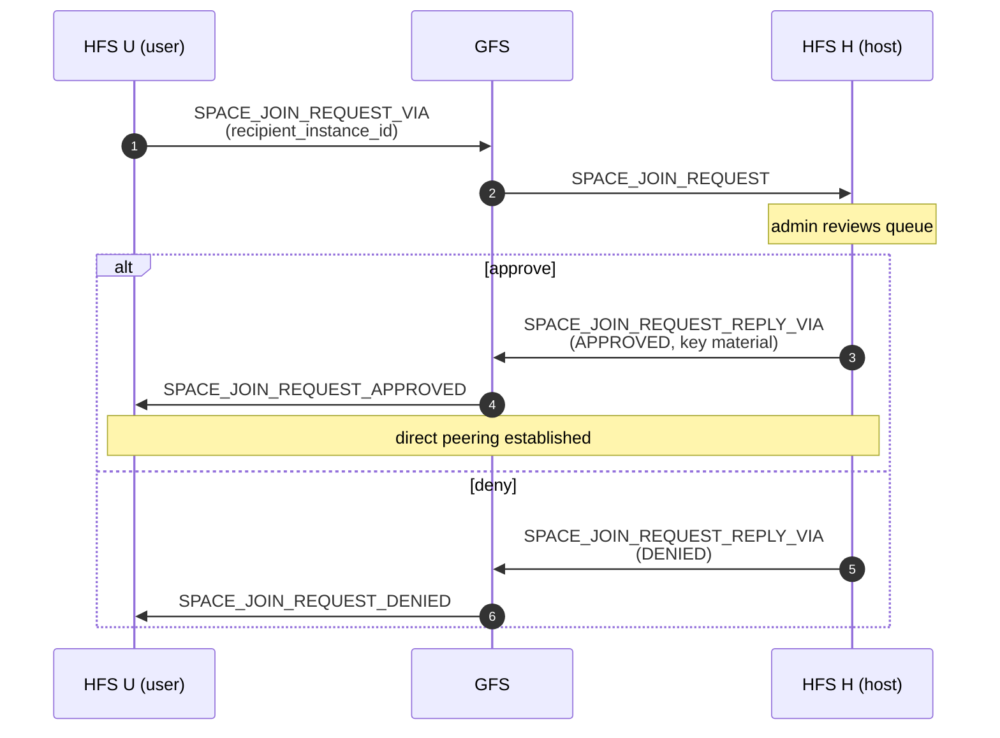

# Invites & Join Requests

Cross-household membership — how a user on HFS A ends up as a member
of a space hosted on HFS B. Two flows: admin-initiated private invites
and user-initiated join requests. Both are designed so GFS can relay
without ever seeing which space, which user, or which household.

## Scope

- **HFS**: mints invite tokens, stores pending invitations, handles
  accept/decline, publishes the resulting `SPACE_MEMBER_JOINED` event.
- **GFS**: only acts as an opaque relay between instances that are not
  yet directly paired — `POST /gfs/envelope` for the built §D2b
  bootstrap path (see [The relay leg](#the-relay-leg--post-gfsenvelope)),
  and the documented-but-unbuilt `_VIA` events it supersedes.

## Event types

**Private invites** (admin → specific remote user)

`SPACE_PRIVATE_INVITE`, `SPACE_PRIVATE_INVITE_ACCEPT`,
`SPACE_PRIVATE_INVITE_DECLINE`, `SPACE_REMOTE_MEMBER_REMOVED`.

**Open invites / join requests**

`SPACE_INVITE`, `SPACE_INVITE_VIA`, `SPACE_ACCEPT`,
`SPACE_JOIN_REQUEST`, `SPACE_JOIN_REQUEST_VIA`,
`SPACE_JOIN_REQUEST_REPLY_VIA`, `SPACE_JOIN_REQUEST_APPROVED`,
`SPACE_JOIN_REQUEST_DENIED`, `SPACE_JOIN_REQUEST_EXPIRED`,
`SPACE_JOIN_REQUEST_WITHDRAWN`.

**Token-based invite redeem** (receiver-initiated, no admin approval —
the token IS the approval)

`SPACE_INVITE_TOKEN_REDEEM`, `SPACE_INVITE_TOKEN_REDEEM_ACK`,
`SPACE_INVITE_TOKEN_REDEEM_DENY`.

**Bootstrap invite redeem** (no pre-existing relationship at all — §D2b,
v_29; see ["Bootstrap redeem"](#bootstrap-redeem--an-invite-link-from-a-stranger-d2b-v_29))

`SPACE_INVITE_BOOTSTRAP_REDEEM`, `SPACE_INVITE_BOOTSTRAP_REDEEM_ACK`,
`SPACE_INVITE_BOOTSTRAP_REDEEM_DENY`.

Used when a member shares a `socialhome://invite#…` code with someone
on a paired peer instance. The receiver pastes the code locally; their
backend recognises ``issuer_instance_id`` as a CONFIRMED peer and
sends ``SPACE_INVITE_TOKEN_REDEEM`` to the issuer carrying the token
and the receiving user's identity. The issuer validates the token
(exists, not expired, ``uses_remaining > 0``), atomically decrements,
seats the receiver as a ``SpaceRemoteMember`` + records the
``(space, instance)`` mapping, then sends ``SPACE_INVITE_TOKEN_REDEEM_ACK``
back with ``{space_id, role, space_meta}`` — where ``space_meta`` is the
full ``build_space_snapshot_for_federation`` blob (config + cover/icon
bytes + content key + member roster). Any failure (token unknown, expired,
exhausted, banned, persistence error) → ``SPACE_INVITE_TOKEN_REDEEM_DENY``
with a string ``reason``.

The receiver awaits the ACK on a nonce-keyed Future inside the
``POST /api/spaces/join`` handler (10 s timeout). On success it seats the
join **locally** from the ACK's ``space_meta``: a stub ``spaces`` row
(``stub_space_from_metadata``), the cover/icon bytes, the content key, its
own ``space_members`` row, the ``(space, instance)`` mapping, and the rest
of the roster as ``SpaceRemoteMember`` rows — so ``/api/spaces`` shows the
space immediately. (An older issuer that ships no ``space_meta`` falls back
to the mapping-only behaviour.) The endpoint returns ``{space_id, role}``
like the local path; on DENY returns 422 with the reason; on timeout 504.

**§CP.F1 age gate:** the receiver enforces the host's ``min_age`` (carried
in ``space_meta``) against the redeeming user **before** persisting
anything — a protected minor below the bar is refused locally (nothing
seated: no stub, content key, membership, or mapping) and the handler
returns 403 ``"This space is restricted to users aged N+."`` The
redeemer's household is the only party that knows the redeemer's declared
age, so it must run this check; the host's per-token seat of the remote
member is inert without the receiver's mapping + key.

**§D1b anti-hijack:** before seating, the receiver refuses any ACK (and any
``SPACE_PRIVATE_INVITE``) whose ``space_id`` collides with a space it
**already holds under a different host** — otherwise a malicious issuer
could ship a snapshot that clobbers that space's config + imports a foreign
content key. The check (``can_seat_remote_stub``) compares the
**authenticated** envelope sender against the existing row's
``owner_instance_id``, never the issuer-controlled ``meta.owner_instance_id``
(which a malicious host could spoof). A brand-new space, or a re-seat by the
same owning host, is always allowed. Mirrors the host-authority guard on the
``SPACE_CONFIG_CHANGED`` inbound path. The stub's stored ``owner_instance_id``
is likewise the authenticated sender, **not** the snapshot's claimed owner
(``stub_space_from_metadata`` ignores ``meta.owner_instance_id``) — so a
forged owner can't be stamped on a new stub and later trusted by the guard.

When the receiving HFS is **not** directly paired with the issuer
(the user pasted a code from a friend-of-a-friend), the redeem flows
through the federation mesh — see [`spaces.md` → "Mesh routing
(SPACE_ROUTED)"](spaces.md#mesh-routing-space_routed). The
``SPACE_INVITE_TOKEN_REDEEM`` envelope is sealed under an ephemeral
X25519 key only the issuer can read; relays forward the opaque
ciphertext along a source-route discovered via
``SPACE_FIND_ROUTE`` / ``SPACE_ROUTE_FOUND``. The ACK / DENY rides
the reply leg of the same envelope so the discovery cost is paid
once per redeem regardless of hop count.

## Bootstrap redeem — an invite link from a stranger (§D2b, v_29)

Everything above assumes the two households already know each other:
the token redeem needs the issuer to be a CONFIRMED peer, or to sit at
the end of a mesh chain of confirmed peers. Somebody who is handed an
invite link by a household they have never federated with satisfies
neither, and used to get *"no route to issuer — pair with them, or with
one of their household's peers"*.

**Possession of a valid, unexpired, unexhausted invite token IS the
authorization.** The space owner minted it deliberately, so the redeem
runs straight through — no approval prompt, no admin queue.

This path supersedes the `SPACE_INVITE_VIA` / `SPACE_JOIN_REQUEST_VIA`
design above **for the invite-link case**. Those `_VIA` flows are
documented but unbuilt; a bootstrap redeem is not a request for
permission, so it has no reply-to-admin leg at all.

### Event types

`SPACE_INVITE_BOOTSTRAP_REDEEM`, `SPACE_INVITE_BOOTSTRAP_REDEEM_ACK`,
`SPACE_INVITE_BOOTSTRAP_REDEEM_DENY`.

These are **not** §24.11 envelopes. They are the `kind` discriminators
of a JSON body sealed inside an opaque blob (see the wire shape below);
the enum entries exist so the wire strings live in one place.

### Transport — an opaque blob through the connection server

The invite blob is served from a **public** page on the connection
server (GFS) to anyone who opens the link, so it must not carry the
issuer's `inbox_url` — that would publish a household's network address
to strangers. Neither side ever learns the other's address on this path.

The blob carries `{invite_token, space_id, display_hint,
issuer_instance_id, issuer_identity_pk, issuer_keywrap_pk,
issuer_keywrap_sig, issuer_proto_version, expires_at}` plus the base URL
of the connection server that serves it (`via_gfs.gfs_url` in the
`socialhome://invite#…` code). The two key fields are public keys, not
addresses: the Ed25519 identity key that the instance id is derived from,
and the static X25519 **key-wrap** key with its self-signature under that
identity.

The redeeming household seals its request to that key-wrap key and hands
the ciphertext to the GFS addressed to `issuer_instance_id`; the GFS
pushes it to that household over its existing socket. The issuer opens
it, validates, and replies through the same relay, sealed to the
redeemer's key-wrap key — which rode *inside* the request.

### Client leg — the household side of the relay

- **Out:** `POST {gfs_base}/gfs/envelope` with exactly
  `{"to_instance", "sealed"}` (`services/gfs_envelope_sender.py`). The body
  is rebuilt from the recipient id + the sealed box rather than forwarded,
  so no caller can add a third field; there is no `from_instance` and no
  household transport signature, the same identity-free discipline
  `POST /gfs/publish` follows. The answer is a uniform
  `202 {"status":"accepted"}` for anything well-formed — a sender learns
  nothing about the recipient — with `400` / `413` / `429` for malformed,
  oversize or throttled. Every non-2xx is a transport failure, logged at
  INFO with the server's name and never the blob.
- **In:** the GFS pushes `{"type":"envelope","sealed":{…}}` on `/gfs/ws`;
  `services/gfs_ws_client.py` routes it to
  `SpaceInviteTokenRedeemCoordinator.handle_relayed_envelope`, which opens
  and validates it (the fail-closed order below). Unknown frame types keep
  being ignored at DEBUG.
- **Which server:** the blob is minted per connection server, so the
  redeemer hands its request to the one that served the invite
  (`InviteBootstrapHint.gfs_url`) and the issuer answers on the one the
  request arrived on — a household paired with several servers never
  replies somewhere the requester isn't listening.
- **Capability gate:** the household relays only through a server whose
  **signed** `/gfs/info` capability block (verified against the key pinned
  for that pairing) carries `envelope_relay: true`. An older server has no
  such route, so the redeem fails immediately with *"this connection server
  can't relay invites yet"* instead of a 404 behind a ten-second timeout.
  A server the redeeming household isn't connected to at all fails the same
  way, naming that instead.

### Wire shape

Outer (all the relay sees):

```json
{"to_instance": "<32 hex>",
 "sealed": {"kem_suite": "x25519", "eph_pk": "…", "ciphertext": "…"}}
```

Inner (the sealed plaintext — JSON, Ed25519-signed over its canonical
sorted-key bytes with the sender's own identity key):

```json
{"kind": "space_invite_bootstrap_redeem",
 "sig_suite": "ed25519",
 "invite_token": "…", "space_id": "…",
 "redeem_nonce": "<hex>", "ts": "<tz-aware ISO-8601>",
 "instance_id": "…", "identity_pk": "<hex>",
 "keywrap_pk": "<hex>", "keywrap_sig": "<b64url>",
 "display_name": "…", "proto_version": 29,
 "redeemer_user_id": "…", "redeemer_public_key": "…",
 "redeemer_display_name": "…",
 "signature": "<hex>"}
```

The reply mirrors it with the issuer's identity + key-wrap material and
either `{space_id, role, space_meta}` (ACK — the same
`build_space_snapshot_for_federation` blob the §D2 path returns,
content key and roster included) or `{reason}` (DENY).

The routing envelope is **identity-free** — the #677 lesson. The
sender's identity, the token, the space, the users, the nonce and the
signature all live inside the ciphertext, so the relay sees a recipient
id, a blob size and a timing, and nothing else. Both `sig_suite` and
`kem_suite` are validated against a supported set with no
default-on-missing (`docs/crypto.md` → "The suite contract").

**Why the key-wrap key and not the identity key?** An Ed25519 key can't
do ECDH, and this codebase has no Ed25519→X25519 conversion.
`federation/keywrap_seal.py` is the static-recipient sealed box built
for exactly this situation ("seal to a household that is not a paired
peer, using a key learned from the GFS"), and it ships
`verify_keywrap_binding` to defeat a GFS substituting a key-wrap key it
controls. `routed_crypto.py`'s sealing is the wrong tool here: it
negotiates a *target ephemeral* key over an online `SPACE_FIND_ROUTE`
round-trip, and there is no mesh path to run one over.

### The mint + landing leg — where the blob comes from

The transport above starts with a blob in a stranger's hands. That blob
gets there through the connection server's **bulletin board**: the owner
parks it, a visitor's browser picks it up.

| | |
|---|---|
| `POST /gfs/spaces/{id}/invite` | Owner parks a blob. Body `{owning_instance, blob, expires_at, ts, signature}`, signed over canonical `{action:"mint_invite", owning_instance, space_id, ts}` and verified against the household's registered instance key (±300 s). Returns `201 {gfs_token, url}`. |
| `GET /join/{gfs_token}` | Public HTML page. Shows the space's already-public directory metadata and the `socialhome://invite#<blob>` code — copyable text **and** a QR of the same string. |
| `DELETE\|POST /gfs/spaces/{id}/invite/{gfs_token}` | Owner takes it down. Signed over `{action:"revoke_invite", gfs_token, owning_instance, space_id, ts}`. `204`, idempotent. |

The `action` discriminator lives inside the signed bytes on both verbs,
so a captured mint signature is not a revoke signature and the reverse —
the same domain separation `subscribe` / `unsubscribe` / `unpublish`
already use. On revoke the **token** is inside them too, so a revoke for
one link can't be redirected at another.

**What the connection server is here.** A bulletin board and nothing
more. It holds an opaque string it never parses (size ≤ 4 KiB and
base64url alphabet are the only checks — a household must be able to
grow a field in the payload, or move to a Phase-2 PQ suite, without any
server being redeployed). It shows a space name it already publishes on
`/spaces/{id}` and `GET /gfs/spaces`. And it hands the string to whoever
asks.

**It must never learn who redeemed.** `GET /join/{token}` writes
*nothing* into the database: no use counter, no fetch row, nothing that
outlives the request. `gfs_invite_tokens` has carried `uses` / `max_uses` columns
since GFS migration `0001`; they stay dead forever, and the repo's SQL
never names them (`tests/global_server/test_repositories.py` asserts
that against the compiled statements, not the prose). Whether an invite
may still be redeemed is decided by the **issuing household** — the only
party that can decide it without building a record of who joined what.
The redeem itself is authorised end-to-end by that household anyway, so
a server-side counter would buy nothing and cost the property the whole
feature rests on.

**The access log is the honest residual, and it is not nothing.** The
statement above is about what the *application* persists; it is not a
statement about the socket. `GET /join/{token}` is an ordinary HTTP
request, and aiohttp's access log records the request line — token and
all — next to the visitor's IP and the timestamp. An operator willing to
read their own access log can therefore recover *visitor IP → token →
time*, which for a link shared with a handful of people is close to the
record the database deliberately refuses to keep. This is the same shape
of concession `POST /gfs/envelope` and `POST /gfs/publish` already make
and has the same answer: closing it needs a mix/onion egress and is out
of scope. It is signed off in
[`../principles.md`](../principles.md) alongside those. **Operator
note:** if this matters for your deployment, redact the path component
of `/join/` lines at the front end (or drop them entirely) and keep
access-log retention short — Social Home itself never needs them.

**Nor may the blob carry an address.** The page is served to anyone with
the link, so the payload holds public keys and ids only — the redeem
travels by instance id through `POST /gfs/envelope` (above). This is the
same constraint stated in "Transport", enforced at the other end.

**Listing state gates the link.** A mint is refused unless the caller
owns the space *and* the space is `status='active'` and not `withdrawn`.
Withdrawing a listing deletes every invite for it: `withdrawn` is
reversible, but an invite link is a standing public URL already sitting
in other people's chats, and leaving it live would keep a working side
door into a listing its owner deliberately delisted. Re-publishing
restores the listing, not the old links.

**Capability-gated.** `GET /gfs/info`'s SIGNED capability block carries
`invite_links: true`. A household refuses to mint against a server that
hasn't proved it, rather than handing the owner a URL that 404s for
everyone they send it to.


```mermaid
sequenceDiagram
    autonumber
    participant O as Owner household
    participant G as Connection server (GFS)
    participant B as Visitor's browser
    participant R as Redeemer household

    O->>G: GET /gfs/info
    G-->>O: capabilities {invite_links: true} + signature
    Note over O: verify against the key pinned at pair time
    O->>G: POST /gfs/spaces/{id}/invite<br/>{blob, expires_at, ts, sig(action=mint_invite)}
    Note over G: verify sig vs registered key · owner? · listed?<br/>blob checked for SIZE + ALPHABET only
    G-->>O: 201 {gfs_token, url}
    O-->>B: shares {gfs}/join/{gfs_token} (chat, email, paper)

    B->>G: GET /join/{gfs_token}
    Note over G: pure read — no counter, no row, no token in any log
    G-->>B: space name + icon + socialhome://invite#<blob> + QR
    B-->>R: human copies the code into their OWN Social Home

    R->>G: POST /gfs/envelope<br/>{to_instance, sealed}
    Note over G,R: the sealed redeem leg — see above
    G-->>R: 202 accepted

    O->>G: DELETE /gfs/spaces/{id}/invite/{gfs_token}<br/>{ts, sig(action=revoke_invite, gfs_token)}
    G-->>O: 204 (idempotent)
```

**Why no clickable "Open in Social Home" button.** The visitor has to
redeem from *their own* household, and a deep link can only ever open
the issuer's — the wrong instance, where they have no account. The SPA's
own wrong-instance fallback (`SpaceJoinLanding.tsx`) reaches the same
conclusion and renders the same code. The page that used to sit at this
URL offered `sh://gfs-invite/…`, a scheme no client has ever registered:
a CTA that did nothing on every device it was clicked on. The per-space
page's `sh://join-space/…` was the same bug and is gone with it.

### The relay leg — `POST /gfs/envelope`

The connection server half of the transport above. It is what the
`_VIA` relay design at the top of this page described but never built,
and it **supersedes** it: `SPACE_INVITE_VIA` /
`SPACE_JOIN_REQUEST_VIA` / `SPACE_JOIN_REQUEST_REPLY_VIA` wrapped a
§24.11 envelope (with its `from_instance`) in a GFS hop; this carries an
end-to-end sealed blob whose routing envelope names **only the
recipient**. New work uses this leg; the `_VIA` event types stay
documented and unimplemented.

Request:

```json
POST /gfs/envelope
{"to_instance": "<instance id>",
 "sealed": {"kem_suite": "x25519", "eph_pk": "…", "ciphertext": "…"}}
```

Response, always:

```json
202 {"status": "accepted"}
```

**Unauthenticated on purpose.** The sender is deliberately anonymous —
the point of the relay is that neither household learns the other's
address and the server learns neither's relationship to the other. There
is no identity on the wire to authenticate, so a per-IP sliding window
(`ENVELOPE_MAX_PER_MINUTE`, 600/min → 429) is the accountability handle,
the same posture `POST /gfs/publish` takes.

**Why 600 and not 30.** The first number treated this relay as a
sideband for the redeem handshake. It is not: for a link-joined
household it is the *only* transport, so every federation envelope to
that peer rides it — each space post, each reaction, each calendar
event, each sync chunk — and a single space catch-up backfill is
hundreds of chunks on its own. At 30/min the relay throttled all of a
household's federation traffic to a trickle and a first sync could not
finish. 600/min is still a ceiling on what one household can push
through a relay it does not own, and the durable cost stays bounded at
the other end by the per-recipient queue caps below.

**A 429 is a cooldown, not a verdict.** The requesting household treats
it as back-off-and-retry rather than as a failed send, so a burst that
brushes the window delays traffic instead of dropping it.

**The 202 is uniform.** Recipient online, recipient offline, recipient
not registered on that server at all — byte-identical response in every
case. Anything else would be a presence/existence oracle: an anonymous
caller could walk instance ids and learn which households use the server
and which are awake. An envelope for an unknown, pending or banned
recipient is dropped server-side, logged at DEBUG, and stored nowhere.
Malformed bodies are a 400 and anything over
`ENVELOPE_MAX_BODY_BYTES` (320 KiB, sized from the ACK's `space_meta`
under the household's own 256 KiB sealed-blob cap) a 413 — both are
about the bytes the caller sent, so neither says anything about the
recipient.

**Store and forward.** A live `/gfs/ws` socket receives
`{"type": "envelope", "sealed": {…}}` and nothing else. Otherwise the
blob waits in `gfs_envelope_queue` for `ENVELOPE_QUEUE_TTL_SECONDS`
(24 h — an issuer household may simply be asleep overnight, and dropping
would make an invite link fail for exactly that reason), capped at
`ENVELOPE_QUEUE_MAX_PER_RECIPIENT` (2000) and
`ENVELOPE_QUEUE_MAX_BYTES_PER_RECIPIENT` (64 MiB) — at either ceiling
the NEW envelope is **tail-dropped** (never evict-oldest: on an
anonymous endpoint, evicting the oldest hands a stranger a delete
primitive over a sleeping household's mail), logged at WARNING with
the recipient and the depth, and still answered with the same uniform
`202`. Queued envelopes are drained
in order on that household's next authenticated hello, each row deleted
only after its frame went out. Expired rows are swept by the GFS
maintenance loop.

**What the server must never do**, and what its tests pin: parse or log
the sealed content, store or log any sender attribute (there is none),
return anything that distinguishes one recipient from another, or
forward a frame to anybody but `to_instance`. The `sealed` dict is
checked for exactly its three non-empty string keys — an extra key is a
400, so no routing hint or sender id rides along — and the suite tag is
never validated server-side, since it is the recipient's to enforce and
a relay that gated on it would have to be redeployed before households
could move to the Phase-2 hybrid suite.

A household discovers the leg from the **signed** capability block on
`GET /gfs/info` (`"envelope_relay": true`, verified against the GFS key
it pinned at pair time), so it only attempts a bootstrap redeem against
a server that proved it can carry one.

Implementation: `global_server/envelope_relay.py` (constants,
validation, deliver-or-queue), `global_server/routes/envelope.py` (the
HTTP surface), `global_server/routes/ws.py` (the drain on hello),
`global_server/migrations/0011_envelope_queue.sql`.

### Fail-closed order (issuer side)

Cheapest check first; every rung has its own regression test.

1. **Process-wide rate limit** — before the unseal, so a flood costs a
   list append rather than an AES-GCM open. It is the only bucket
   available at that point, because which family a blob belongs to is
   inside the ciphertext.
1b. **Per-family rate limit**, once the blob is open: bootstrap bodies
   and relayed §24.11 envelopes draw on separate allowances. They share
   this socket but not their cadences — an active space's relayed traffic
   is orders of magnitude more frequent than invite redeems, so one
   shared budget let either starve the other.
2. **Size / shape caps** on the sealed blob.
3. **Unseal** with our key-wrap private key; an unknown `kem_suite` is
   rejected outright, never defaulted.
4. **Shape caps** on the plaintext, JSON parse, known `kind`,
   right-leg `kind`.
5. **Signature suite** against `SUPPORTED_BOOTSTRAP_SIG_SUITES`.
6. **Anti-tamper identity check** (§4.1.2) —
   `derive_instance_id(identity_pk)` must equal the claimed
   `instance_id`, so nobody can keep a victim's id while signing with
   their own keypair.
7. **Signature** over the canonical bytes, verified against the body's
   own `identity_pk` (TOFU — the token is the authorization; the key
   only has to be self-consistent). On the reply leg the identity is
   additionally **pinned** to the one the invite blob advertised.
8. **Timestamp** — tz-aware, ±300 s, same window as §24.11.
9. **Replay** — the `redeem_nonce` goes through the same
   `crypto.ReplayCache` + durable `federation_replay_cache` table the
   §24.11 pipeline uses, namespaced `invite-bootstrap:<nonce>` so it
   can never collide with an envelope `msg_id`.
10. **Per-sender rate limit**, once the signature has proven who the
    sender is.
11. **Key-wrap binding** of the redeemer's own key — we refuse to seal
    a space snapshot (content key included) to a key nobody vouched for.
12. **Token + ban, in one statement** — `consume_invite_token`, a single
    atomic UPDATE guarding `uses_remaining > 0`, the expiry, **and** the
    §13.7 ban (`NOT EXISTS (SELECT 1 FROM space_bans …)` correlated on
    the token's own space). Unknown / expired / exhausted / banned →
    DENY. The ban used to be a second query run *after* the consume with
    no refund, so a banned household could spend a twenty-use link in
    twenty requests — and the distinct reason told it its own ban status
    one attempt at a time. Inside the statement the counter never moves.
13. **§CP.F1 age gate** — run by the *redeemer* against the host's
    `min_age` from the ACK's `space_meta`, before any local
    persistence, exactly as on the §D2 path.

Every denial ships the existing DENY shape with **one opaque
`reason`** (`REDEEM_DENY_REASON`). Unknown token, expired, exhausted,
banned and an issuer storage fault at any stage are byte-identical on the
wire: the differences are all facts about the issuer's private state, and
reporting them separately let anybody holding a public link enumerate
them. The detail stays in the issuer's own `log.exception`. On the
redeemer side the issuer's string is logged and then **replaced** with a
fixed local message before it reaches the SPA — on this leg the issuer is
a household we met through a public link, and rendering its text verbatim
would put an unknown party's string in our UI. A failed DENY is logged and
swallowed (the redeemer then just times out, which is what a dropped
frame looks like anyway).

### Why the §24.11 pipeline is bypassed

The pipeline resolves signing keys from a CONFIRMED `remote_instances`
row, which by definition does not exist for a stranger. §11 pairing has
the identical problem and solves it the same way — a self-signed,
TOFU-verified body dispatched ahead of the pipeline (see
[`pairing.md`](pairing.md)). The pipeline itself is untouched; no
ordinary event gets a weaker check.

This applies to the **redeem handshake only**. Once the pair is seated
the row exists, and every envelope that then rides the same relay goes
through the pipeline unchanged — see *Delivery afterwards* below.

### What this deliberately does NOT create

A bootstrap redeem seats a **space-scoped** `remote_instances` row —
`InstanceSource.space_session`, the value the schema has carried since
§13 and nothing had ever used. It is CONFIRMED (the space needs a keyed
instance row to federate against) but it is **not a social peer**:

The table has two columns because the two directions are enforced by
different code and were not, at first, enforced equally. **Send** is what
our outbound fan-outs will address to such a row — `list_social_instances`
excludes it, so every non-space fan-out skips it. **Receive** is what the
§24.11 inbound pipeline will accept *from* it: the `check_peer_class` step
(`federation/inbound_validator.py`) rejects any `event_type` outside
`SPACE_SESSION_ALLOWED_EVENT_TYPES` (`domain/federation.py`). Deny by
default — a federation event type added tomorrow is refused from this peer
class until somebody classifies it on purpose.

| Surface | Send (we → them) | Receive (them → we) |
|---|---|---|
| DM send / relay graph | excluded | rejected |
| Profile sync (`USER_UPDATED`), user roster (`USERS_SYNC`) | excluded | rejected |
| Presence (`USER_ONLINE` / `IDLE` / `OFFLINE`, `PRESENCE_UPDATED`) | excluded | rejected |
| Calls (`CALL_*`) | excluded | rejected |
| Friends constellation, calendar invitee picker, app peer picker | excluded | rejected |
| Moments, highlights ("all paired" audience) | excluded | rejected |
| URL change (`URL_UPDATED`), network discovery (`NETWORK_SYNC`) | excluded | rejected |
| Home GPS (`LOCAL_HOME_LOCATION_CHANGED`) | excluded, and the seat is written with `share_home=False` | rejected |
| Public-space directory snapshot (`SPACE_DIRECTORY_SYNC`) | excluded | rejected |
| Auto-pair vouching relay (§11 trust transit) | excluded | rejected |
| Capability announce (`INSTANCE_CAPABILITIES_UPDATED`) | sent | **accepted** |
| Capability re-sync request (`INSTANCE_RESYNC_REQUEST`) | excluded | rejected |
| Mesh routing (`SPACE_FIND_ROUTE` / `_ROUTE_FOUND` / `SPACE_ROUTED`) | excluded from `_mesh_capable_peers` — we never probe them and never forward theirs | rejected |
| Route-stale nack (`SPACE_ROUTE_STALE`) | sent | **accepted** (it only invalidates our own cached route to them) |
| Space content, pages, tasks, polls, stickies, calendar, schedules, gallery, bazaar, zones, reports | sent | **accepted** |
| Space media bytes (`SPACE_MEDIA_BLOB`) | sent | **accepted** |
| Space roster + config + age gate | sent | **accepted** |
| Space content key (`SPACE_KEY_EXCHANGE` / `_ACK` / `_REKEY`) | sent | **accepted** |
| Space seed delegation (`SPACE_ADMIN_KEY_SHARE`) | never | rejected — handing the space authority seed to a household that walked in off a public link is never right |
| Catch-up sync chunks (`SPACE_SYNC_BEGIN` … `_COMPLETE`) | sent | **accepted** |
| Direct-sync RTC signalling (`SPACE_SYNC_OFFER` / `_ANSWER` / `_ICE` / `_DIRECT_*`) | never | rejected — it exists to negotiate a *direct* connection, and neither household has the other's address by design |
| Join requests (`SPACE_JOIN_REQUEST*`) | excluded | rejected — they are already a member; this is the ask-an-admin flow |
| A second invite token from the same household (`SPACE_INVITE_TOKEN_REDEEM` / `_ACK` / `_DENY`) | sent | **accepted** — the pair now exists, so `request_redeem` takes the direct-peer branch and the token is still the whole authorization |
| Cross-household admin action (`SPACE_REMOTE_ADMIN_KICK` / `_ACTION`) | sent | **accepted** — the host re-validates `space_remote_members.role`, so this authenticates the sender without authorizing them |
| Seat teardown (`SPACE_SESSION_CLEANUP`) | sent when the last shared membership ends | **accepted** |

The seat is also **revoked** when the membership that bought it ends. A
`space_session` row exists for exactly one reason — the two households
share a space — so when the last shared membership goes (kick, ban, leave
or dissolve), `SpaceService.revoke_space_session_if_orphaned` deletes the
row and its session keys, and ships `SPACE_SESSION_CLEANUP` so the other
side drops its mirror. The receiver re-derives the same answer from its
own `space_instances` rows rather than trusting the sender, so a household
that shares two spaces and leaves one cannot tear down the seat the other
still needs.

No `PairingConfirmed` is published either — that event kicks off the
user-roster sync, the DM-history backfill and the public-space snapshot,
none of which a space-scoped relationship is entitled to. An existing
row is never overwritten or re-keyed by an invite link.

Session keys for the row come from a static-static X25519 exchange over
the two published key-wrap keys (each already verified as bound to its
identity), HKDF'd into the usual directional pair, so each side's send
key is the other's receive key with no extra round-trip.

### Flow


```mermaid
sequenceDiagram
    autonumber
    participant R as HFS R (redeemer)
    participant G as GFS (relay)
    participant I as HFS I (issuer)
    Note over R: opens the public invite link,<br/>reads the blob
    R->>G: GET /gfs/info (signed capabilities)
    G-->>R: envelope_relay: true
    R->>R: verify_keywrap_binding(issuer keys)
    R->>R: sign body (own identity key),<br/>seal to issuer key-wrap key
    R->>G: POST /gfs/envelope<br/>{to_instance: I, sealed}
    G-->>R: 202 accepted (uniform — online, offline or unknown)
    G->>I: ws {type: envelope, sealed}<br/>(queued up to 24 h if offline)
    Note over I: unseal → anti-tamper → signature →<br/>ts → replay → token → ban
    alt token valid
        I->>I: consume token, seat remote member,<br/>space_instances, space_session row
        I->>G: POST /gfs/envelope<br/>{to_instance: R, sealed ACK + space_meta}
        G->>R: ws {type: envelope, sealed}
        Note over R: §CP.F1 age gate, §D1b anti-hijack,<br/>then seat stub + key + roster
    else denied
        I->>G: POST /gfs/envelope<br/>{to_instance: R, sealed DENY + reason}
        G->>R: ws {type: envelope, sealed}
    end
```

### Version gate

The redeemer gates the attempt on `issuer_proto_version` **from the
blob** — there is no peer row to run `peer_supports` against, which is
exactly why the blob carries it. Below
`FederationCapability.MIN_FOR_INVITE_BOOTSTRAP_REDEEM` (v_29) the
redeemer fails immediately with the unchanged *"no route to issuer —
pair with them, or with one of their household's peers"* rather than
burning a timeout on a household that has no handler for the envelope.

### Delivery afterwards — every envelope rides the relay

Seating a `space_session` row is only half the job: the pair holds
matching directional session keys but **no address for each other**, by
design (the invite blob is public, so neither household publishes an
`inbox_url`), and a `space_session` peer may have no mesh path either.
Option 1 of the three that were open here is what shipped: every
federation envelope between such a pair is carried by the same
`POST /gfs/envelope` relay the redeem handshake used.

`FederationTransport.send` picks the transport. A peer with
`source = space_session` is routed to `GfsRelayTransport`
(`federation/gfs_relay_transport.py`) — never RTC signalling (which
itself travels over the peer relationship this pair does not have) and
never the HTTPS inbox (there is no URL; a fall-through would POST at the
empty string). Every other peer keeps the unchanged RTC-first /
HTTPS-fallback path.

**The envelope is sealed a second time.** A §24.11 envelope is already
AES-256-GCM-encrypted under the pair key and Ed25519-signed, but its
*routing* fields are plaintext by construction — `from_instance`,
`to_instance`, `event_type`, `space_id`, `msg_id`, `timestamp`. Handing
that to the relay would give the connection server the social graph §D2b
exists to withhold. So the whole envelope JSON is sealed to the peer's
static key-wrap key (`keywrap_seal.seal_to_keywrap`, `kem_suite` tag
included — the same primitive the bootstrap used) and the relay is handed
the identity-free `{to_instance, sealed}` body:

```jsonc
// what the connection server sees, per envelope
{"to_instance": "<32 hex>",
 "sealed": {"kem_suite": "x25519", "eph_pk": "…", "ciphertext": "…"}}

// the sealed plaintext, readable only by the addressed household
{"kind": "space_relay_envelope", "envelope": { …the §24.11 envelope… }}
```

The `kind` marker is what lets one socket carry two families — bootstrap
redeem bodies and full federation envelopes — without either side
sniffing at field shapes. Inbound, `handle_relayed_envelope` unseals,
reads the marker, and hands a `space_relay_envelope` to the
**unmodified** §24.11 pipeline (the lookup-by-`instance_id` variant, as a
relayed envelope carries no inbox id): row lookup → **peer class** →
timestamp window → Ed25519 verify under the pair key → replay → decrypt
→ idempotency → ban → dispatch. Riding the relay buys no exemption; the
seal is confidentiality, not authorization. Anyone can read the public
invite blob and seal a blob to that key-wrap key — the signature is what
says who sent it, and an envelope that is not from this pair is dropped
at the verify step.

**The one concession is the timestamp window.** The relay answers `202`
the moment it accepts a blob, and that acceptance *is* the delivery
contract: an offline household gets the bytes on its next hello, up to
`ENVELOPE_QUEUE_TTL_SECONDS` (24 h) later. Judged against the ±300 s
live-wire window, every envelope queued for a sleeping household would be
rejected on arrival — and because the sender saw a `202` it never used
the outbox, so the event would simply be gone. Envelopes tagged with the
`gfs_relay` transport therefore get
`RELAY_TIMESTAMP_SKEW_SECONDS` (24 h + 300 s) instead. A timestamp
window is only ever as safe as the replay memory behind it, so the two
are pinned together: `REPLAY_CACHE_WINDOW` is 25 h — strictly longer than
that skew budget — and a test asserts the inequality, so shrinking the
retention fails loudly rather than quietly reopening the gap. Every other
transport keeps ±300 s.

**A relay `202` is acceptance, not delivery.** `DeliveryResult.via` is
`"gfs_relay"` on this path and the field exists so an operator-facing
count never reads it as confirmed delivery: the uniform `202` is
identical whether the recipient is online, asleep, or not a client of
that server at all.

Two pieces of the seat are persisted for this, both read off the row on
every send so they survive a restart:

| Column | Holds | Why it cannot be re-derived |
|---|---|---|
| `remote_instances.remote_keywrap_pk` | the peer's static X25519 key-wrap pub (verified bound to its identity at seat time) | `remote_identity_pk` is Ed25519 and there is no Ed25519→X25519 conversion here; the session keys are one-way HKDF outputs. Re-fetching it from the GFS is exactly the substitution `verify_keywrap_binding` defeats. Migration `0050`. |
| `remote_instances.relay_via` | the base URL of the connection server that introduced the pair | Reused: the column already answers "who do I go through to reach this peer" (it holds an introducer `instance_id` for auto-paired peers). The two sources never mix on one row. |


```mermaid
sequenceDiagram
    autonumber
    participant H as HFS host
    participant G as GFS (relay)
    participant M as HFS link-joined member
    Note over H: space event → broadcast_to_space_members
    H->>H: §24.11 envelope: encrypt payload<br/>under the pair key, Ed25519-sign
    H->>H: seal the WHOLE envelope to the<br/>member's key-wrap pub (kem_suite x25519)
    H->>G: POST /gfs/envelope<br/>{to_instance: M, sealed}
    G-->>H: 202 accepted (uniform)
    G->>M: ws {type: envelope, sealed}<br/>(queued up to 24 h if offline)
    M->>M: unseal → kind: space_relay_envelope
    M->>M: §24.11 pipeline:<br/>lookup → peer class → ts (relay window) →<br/>signature → replay → decrypt →<br/>idempotency → ban → dispatch
    Note over M: member replies the same way,<br/>sealed to the host's key-wrap pub
```

**Failure handling.** A relay that refuses or is unreachable is an
ordinary transport failure: `send_event` queues the envelope in
`federation_outbox`, and redelivery re-uses the same selection point
rather than POSTing at the empty inbox URL.

**Media does NOT flow to a link-joined member yet.** `space_media_outbox`
ships blobs as one chunk up to `SINGLE_CHUNK_BYTES_THRESHOLD` (1 MiB) and
in `MAX_BLOB_CHUNK_BYTES` (512 KiB) chunks above that; base64 in the JSON
fallback path inflates that to ~683 KiB – 1.4 MiB, against a relay body
cap of `ENVELOPE_MAX_BODY_BYTES` = 320 KiB. Nothing fits. `GfsRelayTransport`
therefore refuses an oversize envelope **locally**, at WARNING, naming the
peer, the event type and the size — it never ships one to earn a 413, and
it never drops one silently. Posts, comments, reactions, roster events,
config changes and key rotations all fit comfortably and flow normally;
a post's *text* reaches the member, its *image* does not. Closing this
needs either a chunker that respects a per-transport maximum or a larger
relay cap, and is deliberately out of scope here.

### Token lifetime

Invite tokens minted through the SPA now carry a default expiry
(`DEFAULT_INVITE_TOKEN_TTL_SECONDS`, 7 days) and the endpoint accepts
`ttl_seconds`. Omitting the field takes that default; **both an explicit
`null` and `0` mean "never expires"** — `null` is the service's own
spelling (`ttl_seconds=None`) and `0` is what the SPA's expiry picker
sends, so `routes.spaces.SpaceInviteTokenView` normalises the two at the
HTTP boundary. A negative or non-integer value is a 422. The lifetime is
a TTL rather than an absolute instant on purpose: the expiry is anchored
on the *issuer's* clock, so a wrong client clock cannot mint a link that
outlives its intent. Before this, links were immortal until exhausted —
tolerable when only a paired peer could redeem one, not when a stranger
can. Callers that mint their own short-lived tokens
(`invite_remote_user`, remote join-request approval: 5 minutes) go
straight to `space_repo.create_invite_token` with an explicit
`expires_at` and are unchanged.

**A never-expiring link is not a never-expiring *web page*.** The two
artifacts a link produces have different lifetimes, and a "never
expires" choice only governs one of them:

- The **pasteable code** — `socialhome://invite#<blob>` — keeps working
  for as long as the local `space_invite_tokens` row is live (not
  expired, not exhausted, not revoked). The issuing household decides
  every redeem, so an immortal row means an immortal code.
- The **published web link** — the `/join/{gfs_token}` page on the
  connection server — expires after at most **30 days**. The blob is a
  row on somebody else's disk, so the server caps how long it will hold
  one (`global_server.invites.INVITE_MAX_TTL_SECONDS`) and the household
  clamps its requested expiry to the same ceiling before asking
  (`services.space_service.PUBLISHED_INVITE_MAX_TTL_SECONDS`). A link
  minted with no expiry is published with the cap; one minted with a
  shorter expiry is published with the shorter of the two.

After those 30 days the /join page is gone and the local token is still
live: the code still redeems, the URL does not. Re-publishing mints a
new link.

The household-side cap subtracts a **300 s safety margin** from the
server's 30-day maximum. The two clocks are independent and the server's
check is a strict `expires_at - now > INVITE_MAX_TTL_SECONDS`, so a
household asking for exactly 30 days against a connection server whose
clock is a second behind would be refused with a 422 for a link it
considered perfectly legal. Shaving five minutes off makes that class of
failure unreachable, at a cost no one can perceive.

### The role a link grants

A link carries the seat the redeemer lands in — `member`, `subscriber` or
`admin` — stored on the `space_invite_tokens` row (migration 0053) and
read back out of the atomic `consume_invite_token`. **The issuer's row
decides.** The redeem request never names a role: the token is a bearer
credential the redeemer holds and replays, so a role encoded in the token
string, or asked for in the request, would be attacker-controlled input.
Every redeem path reads the same column — the local `accept_invite_token`,
the §D2 `_consume_seat_and_build_ack` (whose ACK carries `role`), and the
§D2b bootstrap redeem, which shares that helper.

Who may mint what:

| Actor | `member` | `subscriber` | `admin` | `owner` |
|---|---|---|---|---|
| Owner | yes | yes | yes | never |
| Admin | yes | yes | **no** (403) | never |
| Member / subscriber | no | no | no | never |

An admin minting an `admin` link would be self-service promotion by
proxy, so that case re-checks with `_require_owner`. `owner` is never
mintable at all (422) — ownership moves only through
`transfer_ownership`.

A `subscriber` link works regardless of any "strangers may subscribe"
space setting: that setting governs people who walked up on their own,
while an explicit invite is the owner deciding otherwise for one named
link.

A LOCAL `admin` seat triggers exactly what a promotion triggers, and
needs no key share — the seed already lives on this household.

#### An admin met through a link never holds the signing seed

A household that redeems an invite link into an `admin` seat gets the
ADMIN **role** and not the space's Ed25519 signing seed. This is settled,
and it holds regardless of the space's `delegated_admin_authority`
setting — the setting decides whether an admin the owner *knows* may
hold authority, and a peer met through a public link is not that.

Two reasons, either sufficient:

- **The seed cannot be taken back.** The connection server pins a
  space's `identity_public_key` TOFU-immutably on first publish: a later
  publish offering a different key keeps the pinned one. So there is no
  rotation available if a link-joined admin turns out to be hostile or
  is simply kicked — the household would have to abandon the space's
  published identity to change the key. A credential that cannot be
  revoked must not be handed to someone whose only introduction was a
  string anyone could have copied.
- **A link is not an acquaintance.** An invite link is, by design,
  redeemable by whoever holds it. The owner chose to open a seat, not to
  vouch for the person who walked through it.

Such an admin therefore manages the space exactly as a delegated admin
*without* authority does: its moderation and roster actions go out as
`SPACE_REMOTE_ADMIN_ACTION`, forwarded to the host, which checks them
and signs on its own behalf. The admin experience is the same; only the
key custody differs. An owner who later wants a link-joined admin to
hold authority promotes them through the normal path, where the decision
is about a household the owner can now name.

#### A Follower link works across households (v_30)

A `subscriber` link handed to a household that has never federated with
the issuer is the flagship case for a published link: give a stranger a
URL and they can *read* the space. It is a real seat, not a special
case — the household lands in `space_remote_members` with
`role='subscriber'` (migration `0054` widened the CHECK to admit it) and
in `space_instances` alongside every other member household.

**The model, in one line:** a Follower household is a member household
on the transport and a reader in the roster.

| | Follower household |
|---|---|
| Content stream | Same as a member. `broadcast_to_space_members` targets `space_instances`, so posts, comments, calendar, roster and config events all arrive — over whichever transport that pair uses (`space_session` relay for a link-joined peer, direct/mesh for a paired one). |
| Content key | Same as a member. The §D1b handoff ships the epoch key in the ACK's `space_meta` (`apply_space_content_key_from_metadata`), and every later rotation reaches it because rotation fans out over `space_instances`. |
| Local seat | The redeeming user gets a local `space_members` row at `role='subscriber'`, so their own household's `_assert_writable_member` / `_reject_subscriber` refuse their writes with the usual message. |
| Writes, host-side | Refused **again** on the host, regardless of what the sending household claims. A follower holds a valid content key, so it can produce a well-formed, correctly-signed `SPACE_POST_CREATED`; the host's own seat is the only authority that counts. Step 12 of the §24.11 pipeline (`make_check_space_writer`) drops it before dispatch. `allow_subscriber_comment` still governs comments, exactly as it does for a local follower. |
| Roster | Listed. `GET /api/spaces/{id}/members` merges `space_remote_members` into the member list and emits `role` verbatim — the same way a LOCAL subscriber is listed today, which is the behaviour this mirrors. |
| Revocation | Identical to a member's. Kick/ban tombstones the seat, drops the household from `space_instances` when its last seat goes, rotates the epoch key, and — for a link-joined peer with no other shared space — revokes the `space_session` row via `revoke_space_session_if_orphaned`. |

Why a row rather than "no row = no write": the row is what makes the
household *revocable*. The kick path is keyed on
`(space_id, instance_id, user_id)` in `space_remote_members` and the SPA's
member list is built from it, so a follower with no row could be neither
listed nor kicked — and because `instance_in_any_space` reads
`space_instances` alone, and the only path that prunes that row is the
"last remote member gone" check inside the kick, its `space_session` seat
could never be revoked either. The DB is the authority; absence of a row
is not.

`owner` remains unmintable and unseatable on either side.

A redeem of a follower link consumes a use like any other redeem — there
is no pre-consume refusal left. (There was one, precisely so that a
published Follower link could not be burned to zero by strangers
redeeming something that was going to be denied; with the redeem
succeeding, the counter is doing its ordinary job again.)

**Older peers.** `role='subscriber'` is not storable below v_30: a
sub-v_30 household's CHECK rejects it, `apply_member_event` raises, and
the WHOLE roster event is lost — tombstone included, unhealable because
the version guard drops the retry at the same `member_version`. So a
follower's roster gossip is gated on
`FederationCapability.MIN_FOR_REMOTE_SUBSCRIBER_ROLE`: a behind household
simply does not learn about the follower, which is strictly better than
losing the event that carried it. Receivers also coerce an
out-of-vocabulary role to `member` rather than dropping the mutation.

### Listing and revoking links

| Endpoint | Who | Notes |
|---|---|---|
| `GET /api/spaces/{id}/invite-tokens` | admin or owner | Live links only — expired and exhausted rows are excluded because they grant nothing. |
| `DELETE /api/spaces/{id}/invite-tokens/{token}` | admin or owner | `204`, idempotent. Any admin may revoke any of the space's links: a link belongs to the space, not to its minter. |

Revoke is total: the local row goes AND the blob comes down on the
connection server the link was published to (the `gfs_id` / `gfs_token` /
`gfs_url` triple on the row). The server leg is fail-soft — the local row
is what actually decides a redeem, so a server that is down still leaves
the link dead, with one WARNING naming it so an operator can retry.

**Revoke never un-seats people who already joined.** Taking the door away
is not the same decision as evicting the people who walked through it;
that is member removal, with its own path and its own audit trail.

### Publishing a link to a connection server

`POST /api/spaces/{id}/invite-tokens` with `publish_to_gfs: <gfs_id>`
parks the link's blob on that one paired server's bulletin board and
returns its shareable `url`. One token, one server: the blob names the
relay that serves it (`via_gfs`), so a copy on a second server would be a
different blob and therefore a different token.

The response's `gfs` block carries both URLs — `url`, the shareable
/join page a person opens, and `gfs_url`, the server's base URL that the
blob's `via_gfs` names — so a client never has to parse one out of the
other.

The mint is **publish-first**: the token string is minted, sealed into
the blob, published, and only then persisted. A publish failure (an
unpaired server, or one whose signed `/gfs/info` block lacks
`invite_links`) leaves **no local row** — the owner is told the link does
not exist rather than being shown one in the list that resolves to
nothing. The inverse ordering's failure mode (a blob on a server with no
local row) is inert anyway: the redeem denies on an unknown token and the
server sweeps the blob at expiry.

The blob and the `code` in the response come from **one builder**
(`socialhome/federation/invite_code.py`), so the paste path and the
browser /join path can never drift apart. Its fields are listed in that
module and mirrored by `client/src/lib/spaceInviteCode.ts`; the §D2b
bootstrap block rides on every code, published or not, so a code copied
out of the SPA redeems through the relay just like one lifted off a
/join page.

## Flow — private invite (paired peers)


```mermaid
sequenceDiagram
    autonumber
    participant A as HFS A (admin)
    participant B as HFS B (invitee)
    A->>A: mint invite token
    A->>B: SPACE_PRIVATE_INVITE<br/>(encrypted: space_id,<br/>token, display hint)
    Note over B: user sees invitation<br/>in UI
    alt user accepts
        B->>A: SPACE_PRIVATE_INVITE_ACCEPT
        A->>A: add SpaceRemoteMember
        A->>B: SPACE_MEMBER_JOINED + SPACE_KEY_EXCHANGE
    else user declines
        B->>A: SPACE_PRIVATE_INVITE_DECLINE
    end
```

### Private invite over the federation mesh (v_6+)

The sealed `SPACE_PRIVATE_INVITE` payload carries `host_identity_pk` —
the inviting household's Ed25519 identity public key. A mesh invitee never
pairs with the host, so this is the only way it can later verify the
host's signatures on the §25.6 catch-up stream; it is persisted on the
space stub only when `derive_instance_id(pk)` matches the authenticated
sender. Absent on an older sender (the field is additive, no capability
bump — a receiver that finds it missing keeps the previous behaviour). See
[`sync.md` → "Authenticating a chunk from an unpaired
host"](sync.md#authenticating-a-chunk-from-an-unpaired-host).


When the invitee's household is **not** directly paired with the
admin, `SpaceService` falls back to mesh routing transparently —
the four private-invite envelopes (`SPACE_PRIVATE_INVITE`,
`_ACCEPT`, `_DECLINE`, `SPACE_REMOTE_MEMBER_REMOVED`) ride
`SPACE_ROUTED` along a chain of confirmed v_6+ peers discovered
via `SPACE_FIND_ROUTE` / `SPACE_ROUTE_FOUND`. Each direction is
its own forward leg with a fresh discovery (the admin / invitee
may take arbitrary time between actions, so we don't try to keep
the reply-leg ephemerals warm). The same rule holds for a routed
leg that is *not* a short request/response — a §25.6 catch-up
stream re-consults discovery per chunk and therefore re-keys
through the origin's cache expiry rather than holding one
ephemeral open for the whole stream (see
[`../crypto.md`](../crypto.md) → "Routed-envelope seal"). See [`spaces.md` → "Mesh routing
(SPACE_ROUTED)"](spaces.md#mesh-routing-space_routed) for the
envelope shape; the inner event payload is unchanged.

If neither a direct pair nor a discovered mesh route reaches the
invitee, `invite_remote_user` raises `SpacePermissionError("no
path to invitee household")` — operators see the same 422
response they'd get today for an unconfirmed peer. SPA picker
extensions to surface mesh-only invitees are an explicit
follow-up; today the picker still lists confirmed-pair members
only. Indirect invites use the receiver-initiated
[`socialhome://invite#…` token-redeem flow](#token-based-invite-redeem-receiver-initiated-no-admin-approval--the-token-is-the-approval)
instead.

## Flow — join request via GFS relay

Used when a user wants to join a public space hosted on an HFS they
aren't paired with. The GFS forwards the opaque `_VIA` envelope
without ever decrypting it.


```mermaid
sequenceDiagram
    autonumber
    participant U as HFS U (user)
    participant G as GFS
    participant H as HFS H (host)
    U->>G: SPACE_JOIN_REQUEST_VIA<br/>(recipient_instance_id)
    G->>H: SPACE_JOIN_REQUEST
    Note over H: admin reviews queue
    alt approve
        H->>G: SPACE_JOIN_REQUEST_REPLY_VIA<br/>(APPROVED, key material)
        G->>U: SPACE_JOIN_REQUEST_APPROVED
        Note over U,H: direct peering established
    else deny
        H->>G: SPACE_JOIN_REQUEST_REPLY_VIA<br/>(DENIED)
        G->>U: SPACE_JOIN_REQUEST_DENIED
    end
```

## Receiver-side handoff (SPA)

The SPA layers three equivalent artifacts on top of the same backend
invite token so the receiver can choose the easiest channel:

- **Invite code** — `socialhome://invite#<base64url(JSON)>`. Single-line,
  chat-safe. The receiver pastes it into their own Social Home's
  Spaces → "Join with invite code" card. The payload sits in the URL
  fragment so a stray paste into a browser address bar never sends the
  token to anyone's server logs.
- **Link** — an HTTPS URL anchored on the issuer's `document.baseURI`
  (so the HA Supervisor ingress prefix is honoured rather than skipped).
  Lands on `SpaceJoinLanding` which redeems the token via
  `POST /api/spaces/join`. When the receiver follows this link from
  the wrong instance, the landing renders the same token back as an
  invite code + QR so the receiver can finish the handoff on their own
  home.
- **QR** — encodes the `socialhome://invite#…` form. For same-room
  handoffs.

**What actually travels in the redeem.** `token` is the only required
field, but it is no longer the only one. For a code minted on another
household the SPA also sends `issuer_instance_id` — which is what turns
a local `accept_invite_token` into a §D2 cross-instance redeem — and
`space_id`. For a code from a household this one has never met, the §D2b
bootstrap block rides along too: `issuer_identity_pk`,
`issuer_keywrap_pk` and `issuer_keywrap_sig` (all three required for the
block to count at all), `issuer_proto_version`, `expires_at`, and `gfs`,
the base URL of the connection server that served the invite. Eight
fields, and each one earns its place: the keys are what the redeem is
sealed to and verified against, and `gfs` is the only address either
side has. They are used **only** when neither a direct pairing nor a
mesh route reaches the issuer — both are strictly better and are tried
first. The remaining metadata in the encoded JSON
(`space_display_hint`, `issuer_instance_url`) is for client-side preview
and wrong-instance detection only, and is never sent.

**The wrong-instance fallback fetches a complete code.** When the
receiver opens a `/join` link while signed in to a different household,
the landing page cannot redeem — but it can hand the receiver something
their own home *can* act on. It calls the public
`GET /api/invite-links/{token}/code` on the issuing household, which
answers `200 {"code": "socialhome://invite#<blob>"}` for a live link and
`404` for anything else, and renders that as copyable text + QR. The
endpoint needs no auth because the token is already the credential —
anyone holding it can redeem the link — and it is per-IP rate limited so
the token space cannot be walked. Without it the fallback could only
echo the bare token back, which carries no keys and no relay and is
therefore a dead end for exactly the receiver who needs it most.

## Zero-leak guarantee (§D1b)

Every field that would identify which space, which invitee, or which
admin is inside the encrypted payload. GFS sees only:

- `event_type` (category, not target)
- `from_instance` / `to_instance` (routing)
- `epoch` (for replay cache)

This holds even when both the inviter and invitee are brand-new to
each other — the invitation carries enough material for the invitee
to pair with the host after accepting, not before.

## Removal

`SPACE_REMOTE_MEMBER_REMOVED` is the counterpart to
`SPACE_MEMBER_LEFT` for cross-household membership: when an admin
removes a remote user, the host broadcasts this event to the user's
home instance so the UI clears local state.

## Implementation

Backend (federation + persistence):

- `socialhome/services/federation_inbound/space_invites.py` —
  inbound handlers.
- `socialhome/federation/private_invite_handler.py` — encrypted
  private-invite logic.
- `socialhome/services/space_service.py` —
  `invite_remote_user()`, `accept_remote_invite()`,
  `decline_remote_invite()`, `request_join_remote()`,
  `create_invite_token()`, `accept_invite_token()`.
- `socialhome/repositories/space_invitation_repo.py` — pending
  invitations.
- `socialhome/routes/spaces.py` — REST endpoints
  (`/api/spaces/{id}/invite-tokens`, `/api/spaces/{id}/remote-invites`,
  `/api/spaces/join`, `/api/remote_invites/{token}/accept|decline`).
- `socialhome/federation/invite_token_redeem.py` — receiver-side
  coordinator for the ``SPACE_INVITE_TOKEN_REDEEM`` /
  ``_ACK`` / ``_DENY`` round-trip; transparently ships via
  ``SPACE_ROUTED`` for non-paired issuers and falls back to direct
  delivery for paired ones.
  Also the inbound end of the relay leg: `handle_relayed_envelope`
  unseals, dispatches bootstrap bodies by `kind`, and hands a
  `space_relay_envelope` to the §24.11 pipeline.
- `socialhome/federation/gfs_relay_transport.py` — `GfsRelayTransport`,
  the third `TransportStrategy` tier: seals a §24.11 envelope to a
  link-joined peer's key-wrap key and hands it to the connection server
  that introduced the pair. Selected in
  `socialhome/federation/transport.py` for `source = space_session`.
- `socialhome/services/gfs_envelope_sender.py` — the
  `POST {gfs}/gfs/envelope` carrier, shared by the redeem handshake and
  the delivery leg (one HTTP client, one capability cache).

SPA (issuer + receiver side):

- `client/src/lib/spaceInviteCode.ts` — `socialhome://invite#…`
  build / decode. Decoder accepts the URI form, raw JSON, and bare
  hex tokens.
- `client/src/components/SpaceInviteDialog.tsx` — issuer-side share
  dialog with code / link / QR.
- `client/src/components/RemoteInviteDialog.tsx` — admin-side
  targeted-peer picker over `/api/friends`.
- `client/src/features/spaces/SpaceJoinByCodeCard.tsx` — receiver-side
  paste-or-scan card on the Spaces dashboard.
- `client/src/features/spaces/SpaceJoinLanding.tsx` — legacy
  `/join?token=…` deep-link handler with wrong-instance fallback.

## Spec references

§D1b (zero-leak cross-household invites),
§25.8.20 (session keys in accepted invites),
§25.8.21 (encryption-first rule).
