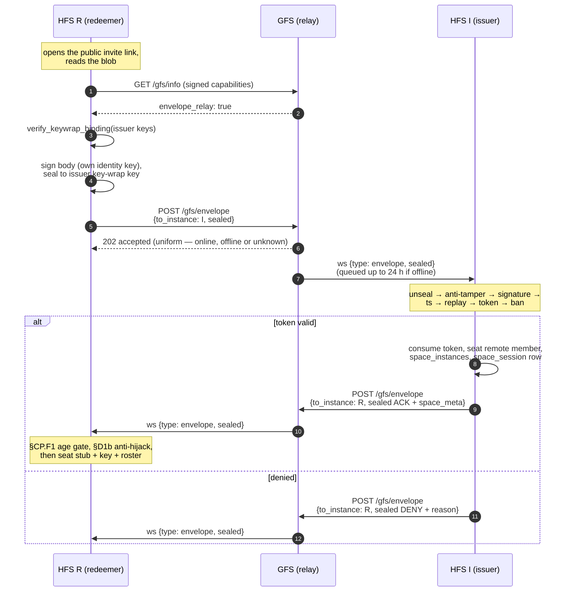
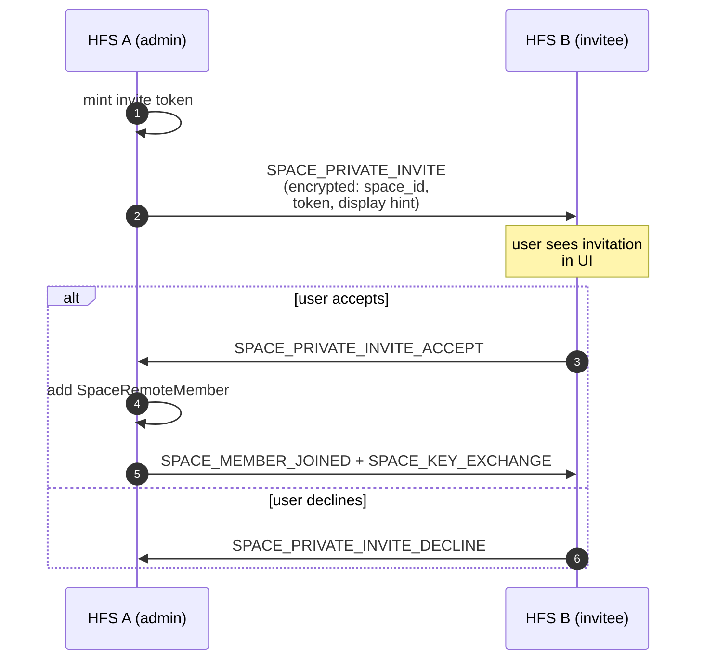
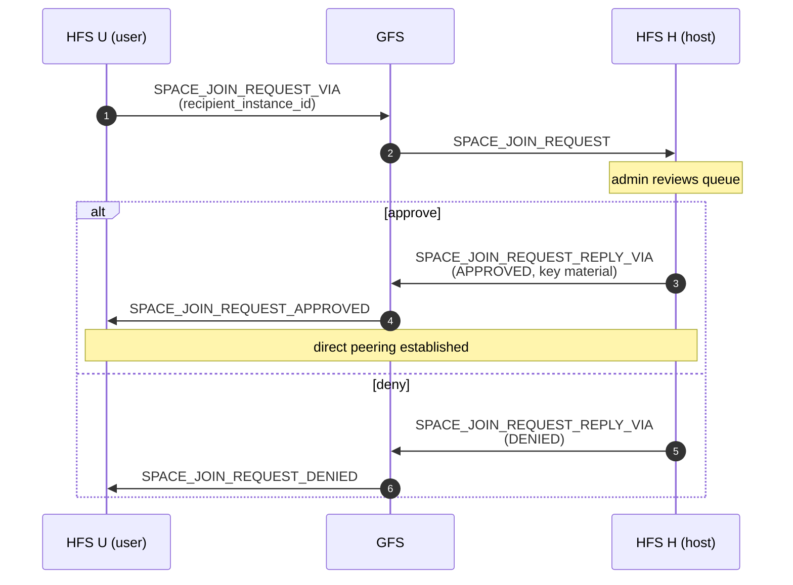

# Invites & Join Requests

Cross-household membership — how a user on HFS A ends up as a member
of a space hosted on HFS B. Two flows: admin-initiated private invites
and user-initiated join requests. Both are designed so GFS can relay
without ever seeing which space, which user, or which household.

## Scope

- **HFS**: mints invite tokens, stores pending invitations, handles
  accept/decline, publishes the resulting `SPACE_MEMBER_JOINED` event.
- **GFS**: only acts as an opaque relay between instances that are not
  yet directly paired — `POST /gfs/envelope` for the built §D2b
  bootstrap path (see [The relay leg](#the-relay-leg--post-gfsenvelope)),
  and the documented-but-unbuilt `_VIA` events it supersedes.

## Event types

**Private invites** (admin → specific remote user)

`SPACE_PRIVATE_INVITE`, `SPACE_PRIVATE_INVITE_ACCEPT`,
`SPACE_PRIVATE_INVITE_DECLINE`, `SPACE_REMOTE_MEMBER_REMOVED`.

**Open invites / join requests**

`SPACE_INVITE`, `SPACE_INVITE_VIA`, `SPACE_ACCEPT`,
`SPACE_JOIN_REQUEST`, `SPACE_JOIN_REQUEST_VIA`,
`SPACE_JOIN_REQUEST_REPLY_VIA`, `SPACE_JOIN_REQUEST_APPROVED`,
`SPACE_JOIN_REQUEST_DENIED`, `SPACE_JOIN_REQUEST_EXPIRED`,
`SPACE_JOIN_REQUEST_WITHDRAWN`.

**Token-based invite redeem** (receiver-initiated, no admin approval —
the token IS the approval)

`SPACE_INVITE_TOKEN_REDEEM`, `SPACE_INVITE_TOKEN_REDEEM_ACK`,
`SPACE_INVITE_TOKEN_REDEEM_DENY`.

**Bootstrap invite redeem** (no pre-existing relationship at all — §D2b,
v_29; see ["Bootstrap redeem"](#bootstrap-redeem--an-invite-link-from-a-stranger-d2b-v_29))

`SPACE_INVITE_BOOTSTRAP_REDEEM`, `SPACE_INVITE_BOOTSTRAP_REDEEM_ACK`,
`SPACE_INVITE_BOOTSTRAP_REDEEM_DENY`.

Used when a member shares a `socialhome://invite#…` code with someone
on a paired peer instance. The receiver pastes the code locally; their
backend recognises ``issuer_instance_id`` as a CONFIRMED peer and
sends ``SPACE_INVITE_TOKEN_REDEEM`` to the issuer carrying the token
and the receiving user's identity. The issuer validates the token
(exists, not expired, ``uses_remaining > 0``), atomically decrements,
seats the receiver as a ``SpaceRemoteMember`` + records the
``(space, instance)`` mapping, then sends ``SPACE_INVITE_TOKEN_REDEEM_ACK``
back with ``{space_id, role, space_meta}`` — where ``space_meta`` is the
full ``build_space_snapshot_for_federation`` blob (config + cover/icon
bytes + content key + member roster). Any failure (token unknown, expired,
exhausted, banned, persistence error) → ``SPACE_INVITE_TOKEN_REDEEM_DENY``
with a string ``reason``.

The receiver awaits the ACK on a nonce-keyed Future inside the
``POST /api/spaces/join`` handler (10 s timeout). On success it seats the
join **locally** from the ACK's ``space_meta``: a stub ``spaces`` row
(``stub_space_from_metadata``), the cover/icon bytes, the content key, its
own ``space_members`` row, the ``(space, instance)`` mapping, and the rest
of the roster as ``SpaceRemoteMember`` rows — so ``/api/spaces`` shows the
space immediately. (An older issuer that ships no ``space_meta`` falls back
to the mapping-only behaviour.) The endpoint returns ``{space_id, role}``
like the local path; on DENY returns 422 with the reason; on timeout 504.

**§CP.F1 age gate:** the receiver enforces the host's ``min_age`` (carried
in ``space_meta``) against the redeeming user **before** persisting
anything — a protected minor below the bar is refused locally (nothing
seated: no stub, content key, membership, or mapping) and the handler
returns 403 ``"This space is restricted to users aged N+."`` The
redeemer's household is the only party that knows the redeemer's declared
age, so it must run this check; the host's per-token seat of the remote
member is inert without the receiver's mapping + key.

**§D1b anti-hijack:** before seating, the receiver refuses any ACK (and any
``SPACE_PRIVATE_INVITE``) whose ``space_id`` collides with a space it
**already holds under a different host** — otherwise a malicious issuer
could ship a snapshot that clobbers that space's config + imports a foreign
content key. The check (``can_seat_remote_stub``) compares the
**authenticated** envelope sender against the existing row's
``owner_instance_id``, never the issuer-controlled ``meta.owner_instance_id``
(which a malicious host could spoof). A brand-new space, or a re-seat by the
same owning host, is always allowed. Mirrors the host-authority guard on the
``SPACE_CONFIG_CHANGED`` inbound path. The stub's stored ``owner_instance_id``
is likewise the authenticated sender, **not** the snapshot's claimed owner
(``stub_space_from_metadata`` ignores ``meta.owner_instance_id``) — so a
forged owner can't be stamped on a new stub and later trusted by the guard.

When the receiving HFS is **not** directly paired with the issuer
(the user pasted a code from a friend-of-a-friend), the redeem flows
through the federation mesh — see [`spaces.md` → "Mesh routing
(SPACE_ROUTED)"](spaces.md#mesh-routing-space_routed). The
``SPACE_INVITE_TOKEN_REDEEM`` envelope is sealed under an ephemeral
X25519 key only the issuer can read; relays forward the opaque
ciphertext along a source-route discovered via
``SPACE_FIND_ROUTE`` / ``SPACE_ROUTE_FOUND``. The ACK / DENY rides
the reply leg of the same envelope so the discovery cost is paid
once per redeem regardless of hop count.

## Bootstrap redeem — an invite link from a stranger (§D2b, v_29)

Everything above assumes the two households already know each other:
the token redeem needs the issuer to be a CONFIRMED peer, or to sit at
the end of a mesh chain of confirmed peers. Somebody who is handed an
invite link by a household they have never federated with satisfies
neither, and used to get *"no route to issuer — pair with them, or with
one of their household's peers"*.

**Possession of a valid, unexpired, unexhausted invite token IS the
authorization.** The space owner minted it deliberately, so the redeem
runs straight through — no approval prompt, no admin queue.

This path supersedes the `SPACE_INVITE_VIA` / `SPACE_JOIN_REQUEST_VIA`
design above **for the invite-link case**. Those `_VIA` flows are
documented but unbuilt; a bootstrap redeem is not a request for
permission, so it has no reply-to-admin leg at all.

### Event types

`SPACE_INVITE_BOOTSTRAP_REDEEM`, `SPACE_INVITE_BOOTSTRAP_REDEEM_ACK`,
`SPACE_INVITE_BOOTSTRAP_REDEEM_DENY`.

These are **not** §24.11 envelopes. They are the `kind` discriminators
of a JSON body sealed inside an opaque blob (see the wire shape below);
the enum entries exist so the wire strings live in one place.

### Transport — an opaque blob through the connection server

The invite blob is served from a **public** page on the connection
server (GFS) to anyone who opens the link, so it must not carry the
issuer's `inbox_url` — that would publish a household's network address
to strangers. Neither side ever learns the other's address on this path.

The blob carries `{invite_token, space_id, display_hint,
issuer_instance_id, issuer_identity_pk, issuer_keywrap_pk,
issuer_keywrap_sig, issuer_proto_version, expires_at}` plus the base URL
of the connection server that serves it (`via_gfs.gfs_url` in the
`socialhome://invite#…` code). The two key fields are public keys, not
addresses: the Ed25519 identity key that the instance id is derived from,
and the static X25519 **key-wrap** key with its self-signature under that
identity.

The redeeming household seals its request to that key-wrap key and hands
the ciphertext to the GFS addressed to `issuer_instance_id`; the GFS
pushes it to that household over its existing socket. The issuer opens
it, validates, and replies through the same relay, sealed to the
redeemer's key-wrap key — which rode *inside* the request.

### Client leg — the household side of the relay

- **Out:** `POST {gfs_base}/gfs/envelope` with exactly
  `{"to_instance", "sealed"}` (`services/gfs_envelope_sender.py`). The body
  is rebuilt from the recipient id + the sealed box rather than forwarded,
  so no caller can add a third field; there is no `from_instance` and no
  household transport signature, the same identity-free discipline
  `POST /gfs/publish` follows. The answer is a uniform
  `202 {"status":"accepted"}` for anything well-formed — a sender learns
  nothing about the recipient — with `400` / `413` / `429` for malformed,
  oversize or throttled. Every non-2xx is a transport failure, logged at
  INFO with the server's name and never the blob.
- **In:** the GFS pushes `{"type":"envelope","sealed":{…}}` on `/gfs/ws`;
  `services/gfs_ws_client.py` routes it to
  `SpaceInviteTokenRedeemCoordinator.handle_relayed_envelope`, which opens
  and validates it (the fail-closed order below). Unknown frame types keep
  being ignored at DEBUG.
- **Which server:** the blob is minted per connection server, so the
  redeemer hands its request to the one that served the invite
  (`InviteBootstrapHint.gfs_url`) and the issuer answers on the one the
  request arrived on — a household paired with several servers never
  replies somewhere the requester isn't listening.
- **Capability gate:** the household relays only through a server whose
  **signed** `/gfs/info` capability block (verified against the key pinned
  for that pairing) carries `envelope_relay: true`. An older server has no
  such route, so the redeem fails immediately with *"this connection server
  can't relay invites yet"* instead of a 404 behind a ten-second timeout.
  A server the redeeming household isn't connected to at all fails the same
  way, naming that instead.

### Wire shape

Outer (all the relay sees):

```json
{"to_instance": "<32 hex>",
 "sealed": {"kem_suite": "x25519", "eph_pk": "…", "ciphertext": "…"}}
```

Inner (the sealed plaintext — JSON, Ed25519-signed over its canonical
sorted-key bytes with the sender's own identity key):

```json
{"kind": "space_invite_bootstrap_redeem",
 "sig_suite": "ed25519",
 "invite_token": "…", "space_id": "…",
 "redeem_nonce": "<hex>", "ts": "<tz-aware ISO-8601>",
 "instance_id": "…", "identity_pk": "<hex>",
 "keywrap_pk": "<hex>", "keywrap_sig": "<b64url>",
 "display_name": "…", "proto_version": 29,
 "redeemer_user_id": "…", "redeemer_public_key": "…",
 "redeemer_display_name": "…",
 "signature": "<hex>"}
```

The reply mirrors it with the issuer's identity + key-wrap material and
either `{space_id, role, space_meta}` (ACK — the same
`build_space_snapshot_for_federation` blob the §D2 path returns,
content key and roster included) or `{reason}` (DENY).

The routing envelope is **identity-free** — the #677 lesson. The
sender's identity, the token, the space, the users, the nonce and the
signature all live inside the ciphertext, so the relay sees a recipient
id, a blob size and a timing, and nothing else. Both `sig_suite` and
`kem_suite` are validated against a supported set with no
default-on-missing (`docs/crypto.md` → "The suite contract").

**Why the key-wrap key and not the identity key?** An Ed25519 key can't
do ECDH, and this codebase has no Ed25519→X25519 conversion.
`federation/keywrap_seal.py` is the static-recipient sealed box built
for exactly this situation ("seal to a household that is not a paired
peer, using a key learned from the GFS"), and it ships
`verify_keywrap_binding` to defeat a GFS substituting a key-wrap key it
controls. `routed_crypto.py`'s sealing is the wrong tool here: it
negotiates a *target ephemeral* key over an online `SPACE_FIND_ROUTE`
round-trip, and there is no mesh path to run one over.

### The relay leg — `POST /gfs/envelope`

The connection server half of the transport above. It is what the
`_VIA` relay design at the top of this page described but never built,
and it **supersedes** it: `SPACE_INVITE_VIA` /
`SPACE_JOIN_REQUEST_VIA` / `SPACE_JOIN_REQUEST_REPLY_VIA` wrapped a
§24.11 envelope (with its `from_instance`) in a GFS hop; this carries an
end-to-end sealed blob whose routing envelope names **only the
recipient**. New work uses this leg; the `_VIA` event types stay
documented and unimplemented.

Request:

```json
POST /gfs/envelope
{"to_instance": "<instance id>",
 "sealed": {"kem_suite": "x25519", "eph_pk": "…", "ciphertext": "…"}}
```

Response, always:

```json
202 {"status": "accepted"}
```

**Unauthenticated on purpose.** The sender is deliberately anonymous —
the point of the relay is that neither household learns the other's
address and the server learns neither's relationship to the other. There
is no identity on the wire to authenticate, so a per-IP sliding window
(`ENVELOPE_MAX_PER_MINUTE`, 30/min → 429) is the accountability handle,
the same posture `POST /gfs/publish` takes.

**The 202 is uniform.** Recipient online, recipient offline, recipient
not registered on that server at all — byte-identical response in every
case. Anything else would be a presence/existence oracle: an anonymous
caller could walk instance ids and learn which households use the server
and which are awake. An envelope for an unknown, pending or banned
recipient is dropped server-side, logged at DEBUG, and stored nowhere.
Malformed bodies are a 400 and anything over
`ENVELOPE_MAX_BODY_BYTES` (320 KiB, sized from the ACK's `space_meta`
under the household's own 256 KiB sealed-blob cap) a 413 — both are
about the bytes the caller sent, so neither says anything about the
recipient.

**Store and forward.** A live `/gfs/ws` socket receives
`{"type": "envelope", "sealed": {…}}` and nothing else. Otherwise the
blob waits in `gfs_envelope_queue` for `ENVELOPE_QUEUE_TTL_SECONDS`
(24 h — an issuer household may simply be asleep overnight, and dropping
would make an invite link fail for exactly that reason), capped at
`ENVELOPE_QUEUE_MAX_PER_RECIPIENT` (200, oldest evicted), and is drained
in order on that household's next authenticated hello, each row deleted
only after its frame went out. Expired rows are swept by the GFS
maintenance loop.

**What the server must never do**, and what its tests pin: parse or log
the sealed content, store or log any sender attribute (there is none),
return anything that distinguishes one recipient from another, or
forward a frame to anybody but `to_instance`. The `sealed` dict is
checked for exactly its three non-empty string keys — an extra key is a
400, so no routing hint or sender id rides along — and the suite tag is
never validated server-side, since it is the recipient's to enforce and
a relay that gated on it would have to be redeployed before households
could move to the Phase-2 hybrid suite.

A household discovers the leg from the **signed** capability block on
`GET /gfs/info` (`"envelope_relay": true`, verified against the GFS key
it pinned at pair time), so it only attempts a bootstrap redeem against
a server that proved it can carry one.

Implementation: `global_server/envelope_relay.py` (constants,
validation, deliver-or-queue), `global_server/routes/envelope.py` (the
HTTP surface), `global_server/routes/ws.py` (the drain on hello),
`global_server/migrations/0011_envelope_queue.sql`.

### Fail-closed order (issuer side)

Cheapest check first; every rung has its own regression test.

1. **Process-wide rate limit** — before the unseal, so a flood costs a
   list append rather than an AES-GCM open.
2. **Size / shape caps** on the sealed blob.
3. **Unseal** with our key-wrap private key; an unknown `kem_suite` is
   rejected outright, never defaulted.
4. **Shape caps** on the plaintext, JSON parse, known `kind`,
   right-leg `kind`.
5. **Signature suite** against `SUPPORTED_BOOTSTRAP_SIG_SUITES`.
6. **Anti-tamper identity check** (§4.1.2) —
   `derive_instance_id(identity_pk)` must equal the claimed
   `instance_id`, so nobody can keep a victim's id while signing with
   their own keypair.
7. **Signature** over the canonical bytes, verified against the body's
   own `identity_pk` (TOFU — the token is the authorization; the key
   only has to be self-consistent). On the reply leg the identity is
   additionally **pinned** to the one the invite blob advertised.
8. **Timestamp** — tz-aware, ±300 s, same window as §24.11.
9. **Replay** — the `redeem_nonce` goes through the same
   `crypto.ReplayCache` + durable `federation_replay_cache` table the
   §24.11 pipeline uses, namespaced `invite-bootstrap:<nonce>` so it
   can never collide with an envelope `msg_id`.
10. **Per-sender rate limit**, once the signature has proven who the
    sender is.
11. **Key-wrap binding** of the redeemer's own key — we refuse to seal
    a space snapshot (content key included) to a key nobody vouched for.
12. **Token** — `consume_invite_token`, a single atomic UPDATE guarding
    `uses_remaining > 0` and the expiry. Unknown / expired / exhausted
    → DENY.
13. **Ban check** (§13.7) — a ban overrides a valid token.
14. **§CP.F1 age gate** — run by the *redeemer* against the host's
    `min_age` from the ACK's `space_meta`, before any local
    persistence, exactly as on the §D2 path.

Every denial ships the existing DENY shape with a human-readable
`reason`; a failed DENY is logged and swallowed (the redeemer then just
times out, which is what a dropped frame looks like anyway).

### Why the §24.11 pipeline is bypassed

The pipeline resolves signing keys from a CONFIRMED `remote_instances`
row, which by definition does not exist for a stranger. §11 pairing has
the identical problem and solves it the same way — a self-signed,
TOFU-verified body dispatched ahead of the pipeline (see
[`pairing.md`](pairing.md)). The pipeline itself is untouched; no
ordinary event gets a weaker check.

### What this deliberately does NOT create

A bootstrap redeem seats a **space-scoped** `remote_instances` row —
`InstanceSource.space_session`, the value the schema has carried since
§13 and nothing had ever used. It is CONFIRMED (the space needs a keyed
instance row to federate against) but it is **not a social peer**:

| Surface | Behaviour for a `space_session` row |
|---|---|
| DM send / relay graph | excluded |
| Profile sync (`USER_UPDATED`), user roster (`USERS_SYNC`) | excluded |
| Presence (`USER_ONLINE` / `IDLE` / `OFFLINE`) | excluded |
| Friends constellation, calendar invitee picker, app peer picker | excluded |
| Moments, highlights ("all paired" audience), URL / capability fan-out | excluded |
| Public-space directory snapshot | excluded |
| Auto-pair vouching relay (§11 trust transit) | excluded |
| Space events, roster, content key, mesh relaying | **works normally** |

No `PairingConfirmed` is published either — that event kicks off the
user-roster sync, the DM-history backfill and the public-space snapshot,
none of which a space-scoped relationship is entitled to. An existing
row is never overwritten or re-keyed by an invite link.

Session keys for the row come from a static-static X25519 exchange over
the two published key-wrap keys (each already verified as bound to its
identity), HKDF'd into the usual directional pair, so each side's send
key is the other's receive key with no extra round-trip.

### Flow


```mermaid
sequenceDiagram
    autonumber
    participant R as HFS R (redeemer)
    participant G as GFS (relay)
    participant I as HFS I (issuer)
    Note over R: opens the public invite link,<br/>reads the blob
    R->>G: GET /gfs/info (signed capabilities)
    G-->>R: envelope_relay: true
    R->>R: verify_keywrap_binding(issuer keys)
    R->>R: sign body (own identity key),<br/>seal to issuer key-wrap key
    R->>G: POST /gfs/envelope<br/>{to_instance: I, sealed}
    G-->>R: 202 accepted (uniform — online, offline or unknown)
    G->>I: ws {type: envelope, sealed}<br/>(queued up to 24 h if offline)
    Note over I: unseal → anti-tamper → signature →<br/>ts → replay → token → ban
    alt token valid
        I->>I: consume token, seat remote member,<br/>space_instances, space_session row
        I->>G: POST /gfs/envelope<br/>{to_instance: R, sealed ACK + space_meta}
        G->>R: ws {type: envelope, sealed}
        Note over R: §CP.F1 age gate, §D1b anti-hijack,<br/>then seat stub + key + roster
    else denied
        I->>G: POST /gfs/envelope<br/>{to_instance: R, sealed DENY + reason}
        G->>R: ws {type: envelope, sealed}
    end
```

### Version gate

The redeemer gates the attempt on `issuer_proto_version` **from the
blob** — there is no peer row to run `peer_supports` against, which is
exactly why the blob carries it. Below
`FederationCapability.MIN_FOR_INVITE_BOOTSTRAP_REDEEM` (v_29) the
redeemer fails immediately with the unchanged *"no route to issuer —
pair with them, or with one of their household's peers"* rather than
burning a timeout on a household that has no handler for the envelope.

### Open: reaching a bootstrap member afterwards

Seating works; **ongoing delivery does not, yet**. The relay above carries
the redeem handshake only — nothing re-uses it for space traffic. Neither household
holds an address for the other (by design — the blob is public), and a
`space_session` peer may have no mesh path either, so
`remote_inbox_url` is empty and the direct transports have nothing to
dial. The pair does hold matching session keys, so the missing piece is
purely a carrier. The options, for the owner to choose:

1. **Relay every space envelope for this pair through the GFS**, sealed
   the same way. Simple and consistent with the bootstrap itself; costs
   the GFS traffic and gives it per-pair timing metadata.
2. **Exchange addresses inside the sealed ACK** once the token has
   authorized the join. Restores direct/HTTPS delivery, but publishes
   each household's address to the other — which the token arguably
   already authorizes, unlike the public blob.
3. **Promote to a mesh path when one exists** — treat the GFS as the
   fallback and prefer `SPACE_ROUTED` whenever discovery finds a chain.

### Token lifetime

Invite tokens minted through the SPA now carry a default expiry
(`DEFAULT_INVITE_TOKEN_TTL_SECONDS`, 7 days) and the endpoint accepts
`ttl_seconds` (`0` = never). Before this they were immortal until
exhausted — tolerable when only a paired peer could redeem one, not when
a stranger can. Callers that mint their own short-lived tokens
(`invite_remote_user`, remote join-request approval: 5 minutes) pass an
explicit `expires_at` and are unchanged.

## Flow — private invite (paired peers)


```mermaid
sequenceDiagram
    autonumber
    participant A as HFS A (admin)
    participant B as HFS B (invitee)
    A->>A: mint invite token
    A->>B: SPACE_PRIVATE_INVITE<br/>(encrypted: space_id,<br/>token, display hint)
    Note over B: user sees invitation<br/>in UI
    alt user accepts
        B->>A: SPACE_PRIVATE_INVITE_ACCEPT
        A->>A: add SpaceRemoteMember
        A->>B: SPACE_MEMBER_JOINED + SPACE_KEY_EXCHANGE
    else user declines
        B->>A: SPACE_PRIVATE_INVITE_DECLINE
    end
```

### Private invite over the federation mesh (v_6+)

The sealed `SPACE_PRIVATE_INVITE` payload carries `host_identity_pk` —
the inviting household's Ed25519 identity public key. A mesh invitee never
pairs with the host, so this is the only way it can later verify the
host's signatures on the §25.6 catch-up stream; it is persisted on the
space stub only when `derive_instance_id(pk)` matches the authenticated
sender. Absent on an older sender (the field is additive, no capability
bump — a receiver that finds it missing keeps the previous behaviour). See
[`sync.md` → "Authenticating a chunk from an unpaired
host"](sync.md#authenticating-a-chunk-from-an-unpaired-host).


When the invitee's household is **not** directly paired with the
admin, `SpaceService` falls back to mesh routing transparently —
the four private-invite envelopes (`SPACE_PRIVATE_INVITE`,
`_ACCEPT`, `_DECLINE`, `SPACE_REMOTE_MEMBER_REMOVED`) ride
`SPACE_ROUTED` along a chain of confirmed v_6+ peers discovered
via `SPACE_FIND_ROUTE` / `SPACE_ROUTE_FOUND`. Each direction is
its own forward leg with a fresh discovery (the admin / invitee
may take arbitrary time between actions, so we don't try to keep
the reply-leg ephemerals warm). The same rule holds for a routed
leg that is *not* a short request/response — a §25.6 catch-up
stream re-consults discovery per chunk and therefore re-keys
through the origin's cache expiry rather than holding one
ephemeral open for the whole stream (see
[`../crypto.md`](../crypto.md) → "Routed-envelope seal"). See [`spaces.md` → "Mesh routing
(SPACE_ROUTED)"](spaces.md#mesh-routing-space_routed) for the
envelope shape; the inner event payload is unchanged.

If neither a direct pair nor a discovered mesh route reaches the
invitee, `invite_remote_user` raises `SpacePermissionError("no
path to invitee household")` — operators see the same 422
response they'd get today for an unconfirmed peer. SPA picker
extensions to surface mesh-only invitees are an explicit
follow-up; today the picker still lists confirmed-pair members
only. Indirect invites use the receiver-initiated
[`socialhome://invite#…` token-redeem flow](#token-based-invite-redeem-receiver-initiated-no-admin-approval--the-token-is-the-approval)
instead.

## Flow — join request via GFS relay

Used when a user wants to join a public space hosted on an HFS they
aren't paired with. The GFS forwards the opaque `_VIA` envelope
without ever decrypting it.


```mermaid
sequenceDiagram
    autonumber
    participant U as HFS U (user)
    participant G as GFS
    participant H as HFS H (host)
    U->>G: SPACE_JOIN_REQUEST_VIA<br/>(recipient_instance_id)
    G->>H: SPACE_JOIN_REQUEST
    Note over H: admin reviews queue
    alt approve
        H->>G: SPACE_JOIN_REQUEST_REPLY_VIA<br/>(APPROVED, key material)
        G->>U: SPACE_JOIN_REQUEST_APPROVED
        Note over U,H: direct peering established
    else deny
        H->>G: SPACE_JOIN_REQUEST_REPLY_VIA<br/>(DENIED)
        G->>U: SPACE_JOIN_REQUEST_DENIED
    end
```

## Receiver-side handoff (SPA)

The SPA layers three equivalent artifacts on top of the same backend
invite token so the receiver can choose the easiest channel:

- **Invite code** — `socialhome://invite#<base64url(JSON)>`. Single-line,
  chat-safe. The receiver pastes it into their own Social Home's
  Spaces → "Join with invite code" card. The payload sits in the URL
  fragment so a stray paste into a browser address bar never sends the
  token to anyone's server logs.
- **Link** — an HTTPS URL anchored on the issuer's `document.baseURI`
  (so the HA Supervisor ingress prefix is honoured rather than skipped).
  Lands on `SpaceJoinLanding` which redeems the token via
  `POST /api/spaces/join`. When the receiver follows this link from
  the wrong instance, the landing renders the same token back as an
  invite code + QR so the receiver can finish the handoff on their own
  home.
- **QR** — encodes the `socialhome://invite#…` form. For same-room
  handoffs.

The wire contract between client and server is unchanged: only
`{token}` ever travels in the `POST /api/spaces/join` body. The
metadata in the encoded JSON (space_id, space_display_hint,
issuer_instance_url) is for client-side preview + wrong-instance
detection only — the server never sees it.

## Zero-leak guarantee (§D1b)

Every field that would identify which space, which invitee, or which
admin is inside the encrypted payload. GFS sees only:

- `event_type` (category, not target)
- `from_instance` / `to_instance` (routing)
- `epoch` (for replay cache)

This holds even when both the inviter and invitee are brand-new to
each other — the invitation carries enough material for the invitee
to pair with the host after accepting, not before.

## Removal

`SPACE_REMOTE_MEMBER_REMOVED` is the counterpart to
`SPACE_MEMBER_LEFT` for cross-household membership: when an admin
removes a remote user, the host broadcasts this event to the user's
home instance so the UI clears local state.

## Implementation

Backend (federation + persistence):

- `socialhome/services/federation_inbound/space_invites.py` —
  inbound handlers.
- `socialhome/federation/private_invite_handler.py` — encrypted
  private-invite logic.
- `socialhome/services/space_service.py` —
  `invite_remote_user()`, `accept_remote_invite()`,
  `decline_remote_invite()`, `request_join_remote()`,
  `create_invite_token()`, `accept_invite_token()`.
- `socialhome/repositories/space_invitation_repo.py` — pending
  invitations.
- `socialhome/routes/spaces.py` — REST endpoints
  (`/api/spaces/{id}/invite-tokens`, `/api/spaces/{id}/remote-invites`,
  `/api/spaces/join`, `/api/remote_invites/{token}/accept|decline`).
- `socialhome/federation/invite_token_redeem.py` — receiver-side
  coordinator for the ``SPACE_INVITE_TOKEN_REDEEM`` /
  ``_ACK`` / ``_DENY`` round-trip; transparently ships via
  ``SPACE_ROUTED`` for non-paired issuers and falls back to direct
  delivery for paired ones.

SPA (issuer + receiver side):

- `client/src/lib/spaceInviteCode.ts` — `socialhome://invite#…`
  build / decode. Decoder accepts the URI form, raw JSON, and bare
  hex tokens.
- `client/src/components/SpaceInviteDialog.tsx` — issuer-side share
  dialog with code / link / QR.
- `client/src/components/RemoteInviteDialog.tsx` — admin-side
  targeted-peer picker over `/api/friends`.
- `client/src/features/spaces/SpaceJoinByCodeCard.tsx` — receiver-side
  paste-or-scan card on the Spaces dashboard.
- `client/src/features/spaces/SpaceJoinLanding.tsx` — legacy
  `/join?token=…` deep-link handler with wrong-instance fallback.

## Spec references

§D1b (zero-leak cross-household invites),
§25.8.20 (session keys in accepted invites),
§25.8.21 (encryption-first rule).
