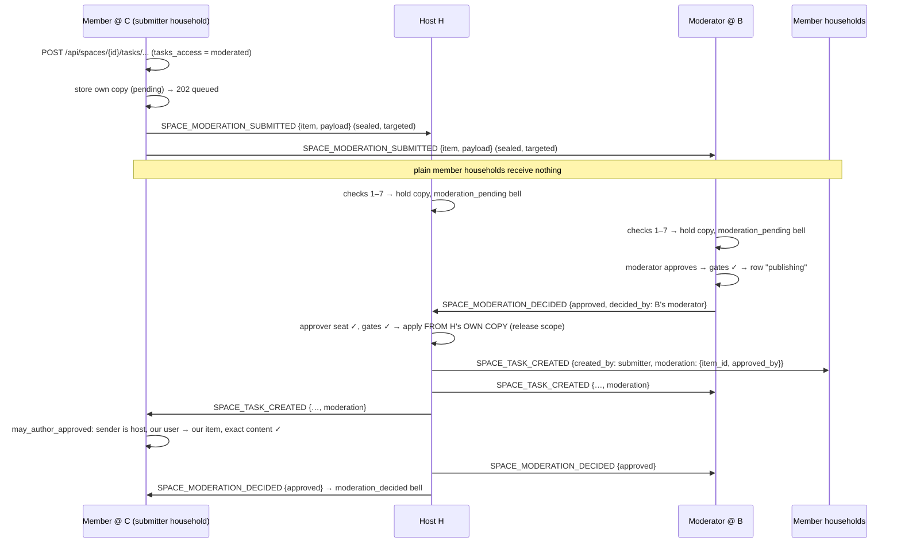

# Federated moderation

"Reviewed" (`moderated`, §4.3) across households. A plain member's new
item — and their edit / delete of somebody else's — waits in a moderation
queue until content authority (owner, admin or moderator) approves it.
Since v_43 that works in spaces whose members live on several households:
the item travels from the submitter's household to every household that
may review it, and any of them may approve or reject. The **host alone
applies** an approved item — from its own stored copy, still as the
submitter's — whichever household's moderator approved it.

What queues, the caps, expiry, resume and the REST surface are described in
[`spaces.md` — Moderation queue](./spaces.md#moderation-queue). This page is
the wire protocol.

## Scope

- **HFS**: full participant.
  - **Submitter household** — holds its own copy of the item (the author's
    `GET …/moderation/mine` pending strip) and sends it to the reviewers.
  - **Reviewer households** — the space's **host** and every household
    holding a **live `admin` or `moderator` seat** in `space_remote_members`.
    Each holds a copy (same id everywhere), shows it in the Moderation tab
    to its local content authority, and may decide it. A reviewer
    household's approval goes to the host, which applies the item; a
    rejection is decided where it is made.
  - **Plain member households** — never see a pending item. They receive the
    approved content like any other write.
- **GFS**: never sees a pending item. Submissions and decisions are pairwise,
  sealed sends (see *Confidentiality*); nothing is published to a
  connection server.

## Event types

- `SPACE_MODERATION_SUBMITTED` — submitter household → host + reviewer
  households. Classified as a space **write** (`SPACE_WRITE_EVENT_TYPES`):
  a Follower household may not send one and an archived space takes none.
- `SPACE_MODERATION_DECIDED` — two uses. An **approval** from a reviewer
  household goes to the **host only** (a request: publish this item); the
  host, once it applied the item, announces the approval to the reviewer
  households and the submitter's household. A **rejection** goes from the
  deciding household to the host, the reviewers and the submitter's
  household. Classified as a **reader** event
  (`SPACE_READER_EVENT_TYPES`): a decision is a verdict, not content, and a
  reject still lands in an archived space; its handler admits it only from
  content authority.

Both are in `SPACE_SESSION_ALLOWED_EVENT_TYPES` (a link-joined member
submits; a link-joined moderator decides).

There is no event for the approved content and no signed approval token:
the **host** applies the item from its own copy and emits it as the
ordinary `SPACE_*` write
(`SPACE_POST_CREATED`, `SPACE_TASK_CREATED`, `SPACE_STICKY_UPDATED`, …,
plus a post's `SPACE_SCHEDULE_CREATED` / `BAZAAR_LISTING_CREATED`) through
`broadcast_to_space_members`, authored by the submitter, with an **approval
block** inside the sealed payload:

```json
{"actor_user_id": "<submitter>", "moderation": {"item_id": "…", "approved_by": "<approver>"}}
```

Expiry is local and deterministic (the same `expires_at` everywhere) — no
event.

### Bodies (all inside the encrypted payload)

| Event | Body |
|---|---|
| `SPACE_MODERATION_SUBMITTED` | `space_id`, `item_id`, `feature`, `action` (`create` / `edit` / `delete`), `target_id`, `submitted_by`, `payload` (the feature handler's item payload), `snapshot`, `submitted_at`, `expires_at` |
| `SPACE_MODERATION_DECIDED` | `space_id`, `item_id`, `decision` (`approved` / `rejected`), `decided_by`, `decided_at`, `reason?` |

Plaintext on the envelope: the routing `space_id` only (encryption-first,
§25.8.21). `space_id` is repeated inside the payload because a mesh-routed
envelope carries no routing field.

## Confidentiality

| Path | Guarantee |
|---|---|
| Submitter → reviewer (paired) | One `send_with_mesh_fallback` per target — never `broadcast_to_space_members` — sealed under the pairwise session key. Only the host and live admin / moderator seat households are targets. |
| Submitter → reviewer (mesh) | The same send seals it end-to-end under `SPACE_ROUTED` for the target's ephemeral X25519 key: every relay sees ciphertext only. |
| Submitter → reviewer (link-joined, §D2b) | The pairwise session, carried by the connection-server relay as an opaque sealed envelope — the GFS can't read it. |
| Media of a pending post | `SpaceMediaSyncService.enqueue_for_post(…, target_instance_ids=<the reviewers>)` — the bytes go to the reviewer households only. |
| A plain member household | Never a target. A submission that reaches a household with no local content-authority member anyway (misdirected) is dropped and not stored. |
| Approved content | The ordinary write: `broadcast_to_space_members` to member households only. |
| Decisions | Pairwise, sealed: an approval request to the host only; the host's announcement and any rejection to the host, the reviewers and the submitter's household. |
| Queued retries | The outbox re-checks a retried `SPACE_MODERATION_SUBMITTED` at send time and drops it when the target no longer reviews the space. |
| A household that stops reviewing | When it loses its last content-authority seat in the space, it expires the pending items of other households' members it holds and NULLs their content (its own members' items stay). |

A reviewer household's local content authority sees pending items through
the Moderation tab, the `space.moderation.*` frames and the title-only
`moderation_pending` bell — exactly as on the host.

## Receiver rules

### `SPACE_MODERATION_SUBMITTED`

Checked in order; any failure is a WARNING and stores nothing.

1. This household is the host, or holds ≥1 **local** content-authority
   member of the space.
2. `submitted_by` holds a live writer seat on the **sending** household
   (`acts_for`) and is not banned.
3. A create's `target_id` is owner-bound to `submitted_by` in this space
   (`owner_bound_id_refused`; a legacy unbound id is refused too).
4. The feature is on, its level **here** is `moderated`, and the space is
   not archived (the archived gate refuses the envelope first).
5. The feature's handler validates the payload with the live codecs and
   caps; media references must be local (`api/media/…`) — a remote URL
   is dropped, coordinates are cut to 4 decimals. The "before" snapshot is
   rebuilt from **this** household's copy of the target; the sender's is
   ignored.
6. Caps: 20 pending per (space, submitter), 50 per (space, sending
   household), 500 per space, 256 KiB per item; `expires_at` is clamped to
   at most 14 days ahead, `submitted_at` to at most 5 minutes ahead and at
   most 14 days before `expires_at`.
7. Stored once (`INSERT OR IGNORE`): a replay changes nothing — and a
   decision that overtook the submission left a contentless tombstone
   under that id, so the late submission is never stored as pending.

Local content authority gets the `moderation_pending` bell (title only).

### `SPACE_MODERATION_DECIDED`

The sender has content authority (`has_content_authority`) and `decided_by`
is a content-authority user seated on it (`moderates_as`, live seats; from
the host also one of our own users by our roster's role).

- **An approval from a non-host** is acted on by the **host** only: it
  checks the approver's live seat on the sender and runs every gate of a
  local approve for that approver — expiry, archived space, feature off,
  the feature's level (`admin_only` → an admin), the submitter still a
  writer — then applies the item **from its own stored payload** through
  the feature's normal persist path (`approved_by` = the approver) and
  announces the approval. Any other household ignores it.
- **An approval from the host**, or **a rejection** from any reviewer, is
  recorded on the held row. The first decision wins — **except that an
  approval may overturn a rejection when the approver's role is at least
  the rejecter's** (owner > admin > moderator). The host decides this from
  the seats it holds for both (a rejecter it can't place counts as a
  moderator): a moderator cannot overturn an owner's or admin's rejection —
  it stands everywhere — while an admin or owner may overturn a
  moderator's. Every copy then converges on what the host published (an
  approval the host announces also claims a rejected row). The submitter's
  household notifies the submitter (`moderation_decided`, title only).
- **No item held yet**: a contentless **tombstone** keeps the decision (at
  most 200 live per deciding household; beyond that the decision is
  dropped with a WARNING; tombstones older than 14 days are deleted by the
  hourly expiry sweep). A submission that arrives later fills in the
  tombstone's content and keeps its decided status. Approving a tombstone
  that never received its content answers 409 `ALREADY_DECIDED`.

Decided payloads are purged after the usual retention.

### Content with an approval block

`SpaceAuthorship.may_author_approved(event, space, author)` decides; it is
used in place of `may_author` for creates and in place of the `moderated`
rule in `access_admits` for edits / deletes:

- the event is a reviewable content write;
- the sender is the space's **host** — only the host applies a queue
  item, so only the host can release one (a moderator household cannot
  make one up);
- `approved_by` is a content-authority user (live seats — a demoted
  moderator fails); under `admin_only` the approver must be an admin;
- the author holds a live writer seat and is not banned;
- when the author is one of **our** users, we hold the item (defence in
  depth — the host is the roster authority already): same id, space and
  submitter, same feature / kind of write / target, status pending,
  approved or rejected, and **exactly** the item's content
  (`federation/moderation_approval.py`): a create carries the item's value
  in every field the receiver stores, and nothing the item never set (no
  recurrence, archive stamp, other creator, mirror origin); an edit
  carries the patch and every other content field equal to the row we
  hold (layout fields — a task's or sticky's position — are free). The
  check **fails closed**: every key the event carries is either routing /
  bookkeeping its event type may carry freely (ids, timestamps the
  receiver derives, layout) or content a rule compares — a key nobody
  classified, a new wire field or an alias the receiver also reads,
  refuses the release until it is. Any household holding the item checks
  it the same way.
- Accepted from the host, a release moves the held row to approved.

A create's owner-bound id still binds to the author. A plain member's
create (or edit of someone else's row) without a valid block is refused
under `moderated` on every v_43 receiver — posts included, whatever
version the sender advertises.

## Sequence



## Compatibility

- **v_43** (`MIN_FOR_FEDERATED_MODERATION`). Submissions skip a reviewer
  household below v_43. A host below v_43 makes a stub's submit fail
  **409 `HOST_TOO_OLD`** (nothing stored, nothing sent). Setting any feature
  to `moderated` while a member household is below v_43 answers 409
  `PEERS_TOO_OLD` until applied anyway (`force`). A v_42 receiver refuses a
  release from a non-host household (it never learnt the block) — content
  approved off the host reaches v_43 households only. A household below
  v_43 that takes a seat in a space keeping a non-post feature Reviewed
  gets the local admins the `moderation_unavailable` notice.
- A v_42 host's release (actor = approver, no block) is still admitted from
  the host (`release_ok`).

## Residuals

- **The host is trusted to publish what it holds.** Only the host releases
  items, and a plain member household — which holds no item — accepts the
  host's release on the host's word, as it accepts the host's relay of any
  member's row today. The submitter's own household and every reviewer
  household refuse a release that differs from their copy in any field.
  Because the host applies from its own copy, a submitter that sent
  different payloads to different reviewers gains nothing: only the host's
  copy is ever published.
- **Approval needs the host online.** A reviewer household's approval is a
  request to the host (queued in the outbox while the host is
  unreachable); the item reads "publishing" there until the host's
  announcement arrives. If the host refuses it (the item expired, the
  level changed), the row stays pending and the moderator may decide again.
- **Concurrent edits.** A household holding an edit item whose target was
  changed meanwhile by another write refuses the release (its copy no
  longer matches); the host's §25.6 sync converges it.
- **Submission flooding.** A household can keep up to 50 pending items per
  space at each reviewer household (and each submitter 20), each kept at
  most 14 days; the caps bound storage, not the review burden.
- **An approved event does not RSVP its creator** when approved on a
  household that is not the creator's (the approver can't speak for them),
  and its feed card is not queued in their name there.
- **Clock skew around `expires_at`**: the approver checks its own copy's
  expiry; an author's household that already expired its copy refuses the
  release.

## Implementation

- `socialhome/services/space_moderation_federation.py` —
  `SpaceModerationFederation`: targets, sends, the two inbound handlers and
  their receiver checks.
- `socialhome/services/space_moderation_service.py` — the queue: submit,
  approve (the host inside `release_scope`; elsewhere a release request),
  `release_remote`, reject, `store_received`, `apply_decision`,
  `note_release`, `record_early_decision`, `drop_held_for_others`.
- `socialhome/services/moderation_release.py` — the release scope and
  `with_release` used by every content outbound bridge.
- `socialhome/federation/moderation_approval.py` — which events carry a
  release, and the item ↔ wire content digest.
- `socialhome/federation/space_authorship.py` —
  `SpaceAuthorship.may_author_approved`, the approval path of
  `access_admits`.
- Tests: `tests/protocol/test_space_moderation_federated.py` (four real
  households), `tests/services/test_space_moderation_federation.py`,
  `tests/federation/test_moderation_approval.py`.

## Spec refs

§4.3 (feature access levels, `moderated`), §24.11 (inbound pipeline and
authorship), §25.8.21 (encryption-first), §D2b (link-joined households).
