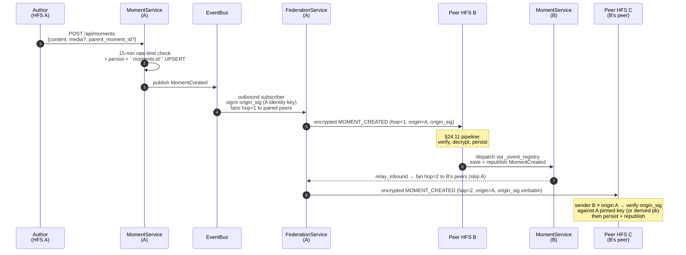

# Momentum

Household-broadcast posts pillar — a *moment* is a one-shot post
(text + optional image / ≤ 15-second video) that fans out to every
paired peer **and their paired peers, up to 3 hops**. Replies are
themselves moments and carry a ``parent_moment_id`` that pins them
to a thread root.

## Scope

- **HFS**: full participant. Authors post moments, peers receive and
  re-broadcast through a hop-counted relay (max 3 hops).
- **GFS**: uninvolved. Moments are personal-scope.

## Event types

`MOMENT_CREATED`, `MOMENT_DELETED`, `MOMENT_REACTED`,
`MOMENT_REACTION_REMOVED`.

Plaintext fields on every envelope: `event_type`, `from_instance`,
`to_instance`, `moment_id`, `origin_instance_id`, `hop_count`. Routing
data only — everything else (`content`, `media_url`, `media_type`,
`duration_ms`, `parent_moment_id`, `expires_at`, `author_user_id`,
`reactor_user_id`, `emoji`, and the v_35 origin signature
`origin_identity_pk` / `origin_sig` / `origin_sig_suite`) lives inside the
encrypted payload (§25.8.21).

## Retention

* Absolute on-disk cap: **7 days** (``moments.expires_at`` is
  ``created_at + 7 days``).
* Visibility cap: **24 hours** for moments where the local viewer
  doesn't follow the author. ``moment_repo.list_visible_to`` collapses
  the absolute cap to 24 h via a ``user_follows`` lookup against the
  viewer's row.
* The retention scheduler runs hourly and deletes anything past the
  absolute cap — live moments and delete tombstones alike; reactions
  cascade.

## Hashtags

A moment's content is scanned at save time for ASCII ``#tag`` tokens
(charset ``[A-Za-z0-9_]``, max 32 chars). Up to ten tags per post are
lowercased and stored in ``moment_hashtags`` (composite PK
``(moment_id, tag)``). The same regex runs on the SPA so the rendered
chip and the indexed row stay in lockstep. Federated edits / relay
updates rewrite the row set on each ``save`` so the trending list is
always derived from the *current* content.

* ``GET /api/moments/archive?tag=<name>`` filters to a single tag.
* ``GET /api/moments/hashtags`` returns the trending tags inside the
  viewer's visibility window — block-aware and follow-aware via the
  same filter as ``list_visible_to`` so a blocked author's tag never
  surfaces.

## Rate limit

One **top-level** moment per author per 15 minutes.
``moment_repo.count_recent_for_author`` ignores rows where
``parent_moment_id IS NOT NULL`` so back-and-forth replies are
unconstrained. Reactions are exempt.

## 3-hop relay

```
              hop=1                 hop=2                 hop=3
A (author)  ────►  B (paired)  ────►  C (B's paired)  ────►  D (C's paired)
                                       (skips A)              (skips A and B)
```

* The author's instance fans the envelope with
  ``hop_count = 1`` and ``origin_instance_id = self``.
* Receivers persist (PRIMARY KEY on ``moments.id`` makes the second
  receipt a no-op) and republish ``MomentCreated`` on the local bus
  for the realtime layer.
* The inbound handler then calls
  ``MomentFederationOutbound.relay_inbound``, which bumps
  ``hop_count`` and re-fans to every paired peer **except**
  ``origin_instance_id`` and the immediate ``from_instance``.
* When ``hop_count >= MOMENT_MAX_HOPS`` (3), the relay short-circuits.

The receive-side dedupe and the explicit exclusion list together
prevent fan-out loops that could form in a fully-connected mesh.

## Per-user max-hops visibility (§Momentum-relay-policy)

The wire cap (3) governs how far a moment is *relayed*. **What each
user sees** is a separate, per-user knob: ``moments.max_hops`` in
``users.preferences_json`` (default 3, clamped to 1..3).

* ``max_hops = 1`` — only moments authored by direct paired peers.
* ``max_hops = 2`` — direct peers plus their peers.
* ``max_hops = 3`` — every relayed moment (default).

The recipient instance writes the inbound ``hop_count`` onto the
``moments`` row; ``list_visible_to`` adds ``AND m.hop_count <= ?``
against the viewer's preference so the inbox respects it.

### Pure pass-through

If **no local user** can see an inbound moment under their
``max_hops`` and per-viewer ``user_blocks``, the recipient instance
**skips the local persist** but **still relays** onward. This
keeps the household acting as a transparent forwarder when no one
locally subscribes — saves disk + retention work without breaking
the mesh. The check is ``moment_repo.has_visible_recipient(...)``.

### Flagged-relay block

The relay path is gated by :class:`RelayPolicy`. Two negative
signals stop both ingress and onward fan-out:

* The source instance is on the household's
  ``household_instance_bans`` table (set by the operator from the
  Settings → Federation page).
* There is at least one ``status='pending'`` row in
  ``content_reports`` against the moment id OR the author user id.
  Local moderation overrides federation fan-out — neither persist
  nor relay run while a report is open.

Per-user ``user_blocks`` are intentionally NOT consulted here.
Personal block lists stay private; tying them to the relay would
couple two trust models and leak block-list shape to peers.

## Authority

* **1-hop direct** (``from_instance == origin_instance_id``): the
  sending peer must be the author's home instance. Inbound rejects on
  mismatch.
* **2/3-hop relay** (``from_instance != origin_instance_id``): the
  moment must carry its **origin signature** (v_35, below), and the
  ``origin_instance_id`` must match the author's home instance lookup.
  Unknown authors (``USER_UPDATED`` envelope hasn't landed yet) are
  accepted on first sight once the signature verifies.
* **Never ours:** a moment whose claimed origin is this household, or
  whose author is one of our own users, is refused on every path — those
  only originate here.
* **Stored row wins:** a `MOMENT_CREATED` / `MOMENT_DELETED` naming a
  moment id this household holds is applied only when the stored author
  and origin match the payload. A delete tombstone (below) still binds
  its id to its author and origin.
* **Creator-bound id (v_36):** because the first household to name a
  moment id here decides whose it is (the stored row, or a delete's
  tombstone), a moment's id commits to its author
  (`federation/owner_bound_id.py`, the unscoped `moment` kind — no space
  component, the commitment covers the author alone). A `MOMENT_CREATED`
  or `MOMENT_DELETED` naming a bound id for any other author, or under an
  unknown suite nibble, is refused at WARNING before either binding could
  form: not stored, not tombstoned, not relayed — the public (GFS) inbound
  applies the same check. The author's own early delete still sticks. A
  legacy (uuid4) id keeps the first-come rule. See
  [`capabilities.md`](./capabilities.md) (v_36).
* **Reactions** (`MOMENT_REACTED` / `_REMOVED`) are honoured only for a
  moment authored here, from a reactor homed on the sending household;
  the published author is the stored one.
* Refused events are logged at WARNING and never relayed
  (`tests/protocol/test_moment_scope.py`).

### Origin signature (v_35)

Moments relayed by another household are checked against the household
that posted them. Every relay re-sends a moment under its own envelope
signature, so the §24.11 pipeline proves only the last hop; the origin
household therefore signs each `MOMENT_CREATED` / `MOMENT_DELETED` it
authors with its Ed25519 identity key
(`socialhome/federation/moment_origin.py`, wire shape in
[`crypto.md`](../crypto.md)). The signature covers the event type, the
suite and every stored field — never `hop_count` — and relays forward it
verbatim.

* A receiver handed a moment by a household other than its claimed origin
  verifies the signature against the key it pins for that origin, or, for
  a friend-of-friend origin it never paired with, against the shipped
  `origin_identity_pk` provided `derive_instance_id(pk) ==
  origin_instance_id`.
* **Deletes** follow the same rule: a relayed `MOMENT_DELETED` removes a
  moment only when the origin signed it; the author's own household can
  still delete directly.
* **Refused** — unsigned relays naming a v_35+ origin or an origin with no
  `remote_instances` row, a signature that does not verify, a shipped key
  that disagrees with the pinned one or does not derive to the origin, and
  any unknown `origin_sig_suite`. Refused events are logged at WARNING and
  never relayed (`tests/protocol/test_moment_origin_signature.py`).
* **Legacy window** — an unsigned relay whose origin this household holds a
  row for at `proto_version` < 35 is accepted and logged at INFO; it closes
  as origins upgrade. See [`capabilities.md`](./capabilities.md) (v_35).

### Deletes stick

The origin signature proves who made a moment, not that it still exists:
a relay can hold a genuinely signed `MOMENT_CREATED` and re-send it after
the origin deleted the moment, and relays deliver out of order, so a
delete can arrive before its create. A verified delete is therefore never
forgotten until the moment could no longer be shown anyway:

* **Tombstone.** Every accepted `MOMENT_DELETED` — and a local delete by
  the author or an admin, and a GFS-relayed public delete — keeps the
  `moments` row with content, media, tags and reactions wiped and
  `deleted_at` set. The tombstone keeps the row's own `expires_at`.
* **Held delete.** A delete for a moment this household has not stored
  yet inserts the tombstone directly, expiring after the maximum moment
  lifetime (7 days from receipt; no create for it can outlive that). The
  delete still travels on, so households that do hold the moment apply it
  (pure pass-through households tombstone too, so they stop relaying a
  replay).
* **Refused create.** A `MOMENT_CREATED` for a tombstoned id is refused
  (INFO log): not stored, not relayed. The repo's upsert also never
  writes over a tombstone, so no path can bring one back.
* **Sweep.** The retention scheduler removes expired tombstones with the
  expired moments. A create that is itself past its `expires_at` is
  refused (INFO) and not relayed, so the sweep never re-opens the window.
* Tombstones live in SQLite and survive a restart
  (`tests/protocol/test_moment_delete_tombstone.py`).

## Mermaid sequence — local author posts a moment



## Notifications

``NotificationService`` subscribes to the moment + follow bus
events and writes a :class:`Notification` row to the recipient's
bell when:

| Event                          | Recipient                | Type                |
|--------------------------------|--------------------------|---------------------|
| ``MomentReactionChanged``      | The moment author        | ``moment_reacted``  |
| ``MomentCreated`` (with parent)| The parent moment author | ``moment_replied``  |
| ``UserFollowed``               | The followed user        | ``user_followed``   |

Cleared reactions (``emoji is None``) don't fire a new
notification — the original reaction was the signal. Self-
reactions, self-replies, and self-follows are silent. Recipients
who live on a peer instance get the notification on *their*
instance after the federation event lands, not on the actor's
instance.

## Block + report

* **Block.** The viewer's personal block list (``user_blocks``) is
  consulted by ``moment_repo.list_visible_to`` so a blocked author's
  moments never surface — same plumbing the Highlights pillar uses.
* **Report.** ``POST /api/moments/{id}/report`` files a
  ``content_reports`` row with ``target_type='moment'``. The same
  table also accepts ``target_type='highlight'`` (filed via
  ``POST /api/highlights/{id}/report``) so admin triage runs through one
  queue at ``/api/admin/reports?status=pending``.

## Implementation pointers

- Schema: `socialhome/migrations/0001_initial.sql` — `moments`,
  `moment_reactions`, `user_follows`. ``moments.author_user_id`` is
  plain text (no FK) so federated remote-author rows live alongside
  local rows. `0057_moment_tombstone.sql` adds `moments.deleted_at`
  (delete tombstones).
- Domain: `socialhome/domain/moment.py` (caps + dataclasses);
  events at `socialhome/domain/events.py`.
- Repo: `socialhome/repositories/moment_repo.py`.
- Service: `socialhome/services/moment_service.py`.
- Outbound federation:
  ``socialhome/services/moment_federation_outbound.py``.
- Inbound federation: handler block in
  ``socialhome/services/federation_inbound_service.py`` (registered
  by ``attach_to`` for the four ``MOMENT_*`` event types). Calls
  ``moment_outbound.relay_inbound`` for the 3-hop relay step.
- Realtime push:
  ``socialhome/services/realtime_service.py`` — broadcasts
  ``moment.created`` / ``moment.deleted`` to the household and
  ``moment.reaction_changed`` only to the author's WS sessions.
- Routes: `socialhome/routes/moments.py`.
- Retention scheduler:
  `socialhome/infrastructure/moment_retention_scheduler.py`.
- Frontend: `client/src/features/momentum/`,
  `client/src/store/blocks.ts` (re-used).

## Spec refs

- §24.11 inbound validation pipeline (encryption-first applies).
- §25.8.21 every field encrypted unless required for routing.
- §Momentum (this page) for the retention + relay model.
