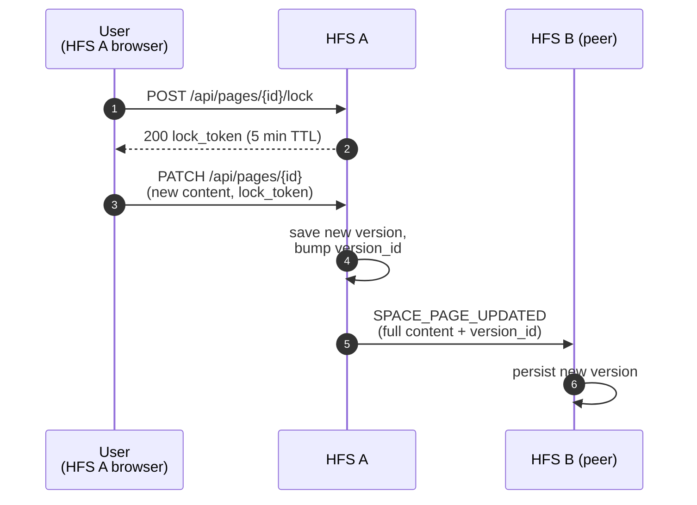
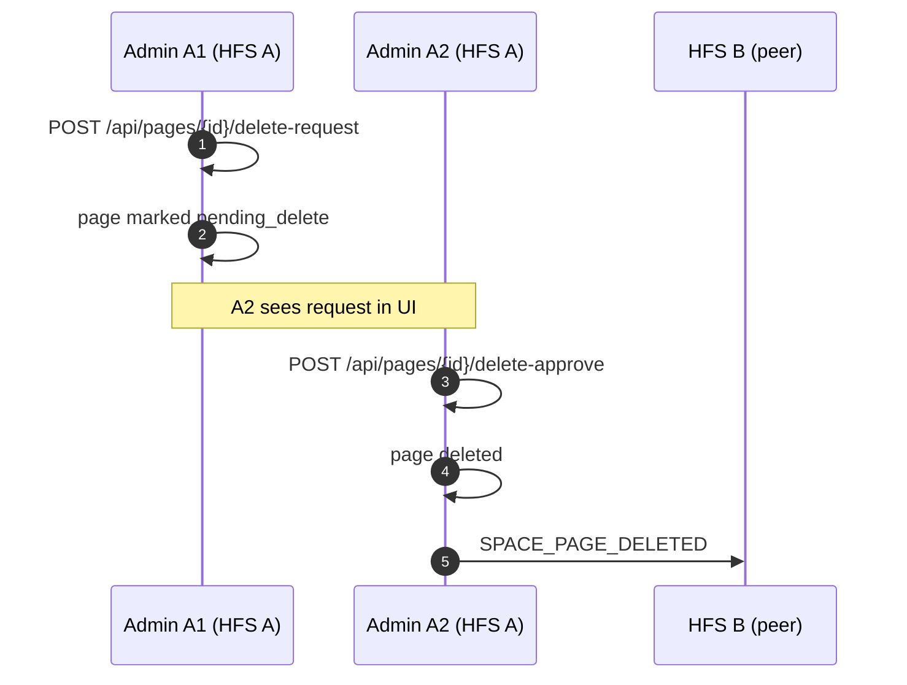

# Pages

Space pages are wiki-style shared documents inside a space. Unlike
posts — which are append-only — pages are mutable, versioned, and
lock-protected so two editors don't clobber each other.

## Scope

- **HFS**: authoritative for pages it hosts; federates edits to every
  peer member.
- **GFS**: uninvolved. Pages never leave the space's peer mesh.

## Event types

`SPACE_PAGE_CREATED`, `SPACE_PAGE_UPDATED`, `SPACE_PAGE_DELETED`.

Locking is local to the owning HFS and not federated — the API
returns a lock token, and only the lock holder can PATCH. Federated
peers see the resulting `SPACE_PAGE_UPDATED` event once the edit
commits.

## Flow — edit with lock

## Flow — delete with two-admin approval

Deleting a page requires a second admin to approve, preventing a
single compromised admin from destroying space history.

## Version history

Every PATCH produces a new row in `space_page_versions`. The API
exposes `GET /api/pages/{id}/versions` to list them and
`POST /api/pages/{id}/revert` to restore a previous version — which
itself is just another PATCH and federates as a normal
`SPACE_PAGE_UPDATED`.

## Conflict resolution

When two peers emit `SPACE_PAGE_UPDATED` for the same page concurrently
(possible after a network partition), the receiver keeps the event
with the higher `version_id`. If `version_id` ties, the tie-break is
the author's `instance_id` lexicographically. The losing edit is
preserved in history — it's not lost, just not current.

`POST /api/spaces/{id}/pages/{pid}/resolve-conflict` lets an admin
force-pick a winner on their local HFS and re-broadcast.

## Implementation

- `socialhome/services/page_service.py` — CRUD + lock + versions.
- `socialhome/services/federation_inbound/space_content.py` —
  `SPACE_PAGE_*` handlers.
- `socialhome/repositories/page_repo.py`,
  `page_version_repo.py`.
- `socialhome/routes/page_routes.py` — REST endpoints.

## Spec references

§13.7 (space pages),
§13.7.3 (two-admin deletion),
§D1b (encryption-first).
