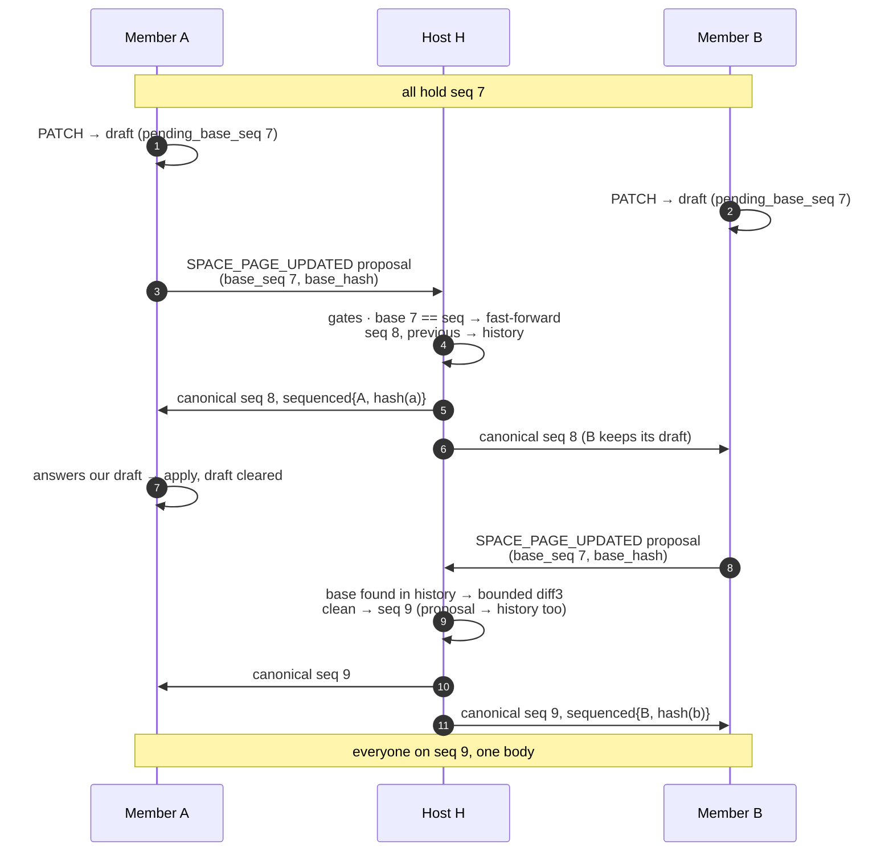
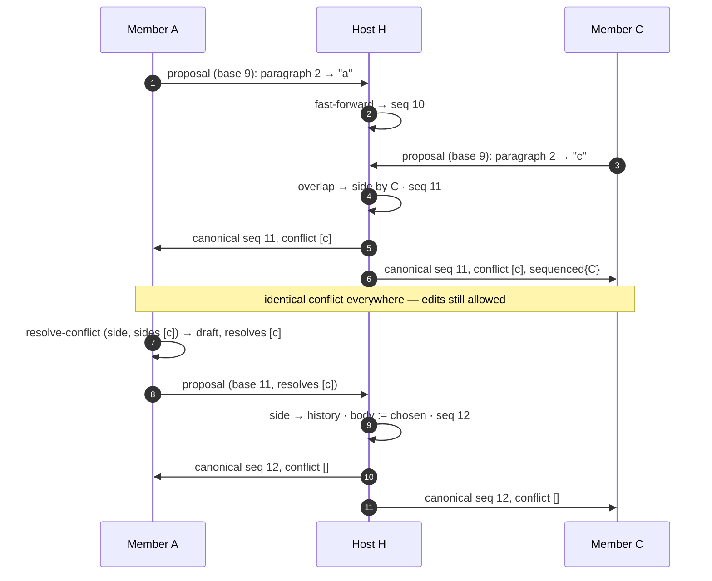

# Pages

Space pages are wiki-style shared Markdown documents inside a space. Every
member household holds a copy of each page and any writer may edit it,
but since v_48 one household decides the order of versions: the space's
**host** (`space.owner_instance_id`). Members send their edits to the
host as *proposals*. The host merges each one into the current version,
or keeps it beside the current version as a conflict side. It numbers
every version it commits (`seq`) and broadcasts it. Members mirror the
host by `seq`. The host's order is the only order, so every household
ends in the same state. A decentralised merge could not promise that: an
adversarial review showed non-associative merges, lost undos, spurious
conflicts after history caps, and households holding different conflict
sets.

## Scope

- **Host**: the only sequencer of its pages. It holds the canonical row,
  the `seq`, a history of 50 rows (where merge bases are looked up), and
  the open conflict sides.
- **Member households**: mirror the host's versions by `seq`. Each holds
  at most one **optimistic local draft** per page (`pending_base_seq` is
  set). The editor keeps working on the draft until the host answers.
- **GFS**: uninvolved. Pages never leave the space's member mesh.
- **Household pages** (`/api/pages`) never federate. Their edit locks and
  two-step delete are local only.

A household applies v_48 rules when it is the host, or when
`peer_supports(owner, 48)`. Otherwise it is **legacy**: last write wins,
as before (see [Mixed fleets](#mixed-fleets)).

## Event types

`SPACE_PAGE_CREATED`, `SPACE_PAGE_UPDATED`, `SPACE_PAGE_DELETED`. Every
field below except the routing fields (`space_id`) rides inside the
encrypted payload (§25.8.21). Deletes are not sequenced: any writer
broadcasts `SPACE_PAGE_DELETED` to the member households, as before.

### Proposal — member → host only

Sent by `PageProposalForwarder` with `send_with_mesh_fallback(to=owner)`,
never broadcast. It is a `SPACE_PAGE_UPDATED`, or a `SPACE_PAGE_CREATED`
for a page the member created (`base_seq` 0).

| Field | Meaning |
|---|---|
| `id` / `page_id`, `space_id` | the page; routing |
| `title`, `content`, `cover_image_url` | the whole draft |
| `actor_user_id` | the draft's editor (the host's access check) |
| `base_seq` | the host `seq` the draft was made from (0 for a create) |
| `base_hash` | the version hash of that base (omitted for a create) |
| `resolves` | optional, ≤5 side ids this draft resolves |
| `created_by` | creates only: the creator, bound to the id (v_36) |

A payload without `base_seq` comes from a pre-v_48 sender. A malformed
one is dropped (WARNING): a negative or non-integer `base_seq`, a bad
`base_hash`, more than 5 `resolves`, or a bad hash in them.

### Canonical version — host → every member household

Broadcast through `broadcast_to_space_members` whenever the host commits
a change. To a member below v_48 the host sends only the plain fields
(`legacy_payload`, `legacy_below=48`). For the proposer, the broadcast
doubles as the acknowledgement.

| Field | Meaning |
|---|---|
| `id` / `page_id`, `space_id`, `title`, `content` | the version |
| `actor_user_id` (+ `created_by` on CREATED) | who edited / created |
| `cover_image_url`, `updated_at`, `last_editor_user_id` | the rest of the state |
| `seq` | the host's sequence number (monotonic per page) |
| `version_hash` | its version hash |
| `conflict` | the open sides, exactly: `[{side_id, title, content, cover, by, base_seq, at}]` (≤3) |
| `sequenced` | which proposal this answers: `{proposer_instance, proposal_hash, outcome}` |
| `moderation` | approval block of a moderation release (v_43) |

### Acknowledgement / refusal — host → proposer

This is a targeted `SPACE_PAGE_UPDATED`, sent only when nothing was
committed (a duplicate or a refusal), and only to a proposer at v_48 or
above. It carries the current state and `seq`, plus `sequenced` with
`outcome: "applied" | "refused"` and, for a refusal, a `reason`:

| `reason` | When |
|---|---|
| `access` | the gates refused it: the named `actor_user_id` is not seated on the sending household (checked at **every** access level, so no household ever edits as — or evicts the side of — another household's user), the owner-bound id, or the space's `pages` access level. Not sent when the write is *held* for an actor whose seat has not reached the host yet (it is replayed when it does) |
| `gone` | the page no longer exists on the host (`base_seq ≥ 1`); the payload carries no state, `seq: 0` |
| `rate_limited` | more than 120 proposals / minute from that household for that space; carries **no page state** (the member keeps its draft for the next tick) |
| `bad_base` | the proposal is malformed (bad `base_seq` / `base_hash` / `resolves`, a missing or over-long title). The member keeps its draft (retried on the tick) — never discarded |
| `archived` | the space is archived on the host: the post-decrypt archived gate refuses the write and tells the page handler (`FederationService.add_archived_write_listener`). Only a sender holding a **live writer seat** hears back — anyone else gets silence, so the refusal is no oracle — and the answer carries **no page state**; the member restores its own draft base |

At most **one refusal per (sender, page) per minute**, and at most 30 per
(sender, space) per minute, go out, so bad proposals cannot turn the host
into an amplifier.

## Version identity

`version_hash = "sha256:" + hex(sha256(canonical JSON))` over
`{"content", "cover", "title"}` (sorted keys, `,` and `:` separators,
UTF-8). The `sha256:` prefix is the suite tag, and a receiver rejects
anything but `^sha256:[0-9a-f]{64}$`. The hash only *recognises* a
version: it validates a proposal's base, spots duplicates, and matches an
answer to the draft it settles. It never orders versions; `seq` alone
does that.

## Host rules

`PageConflictService.sequence` (and `commit_local`, the host's own edits)
runs these steps in order:

1. **Replays are not proposals.** A resume replay (marked
   `replay: true`) is ignored, held page or not — a member can never roll
   the host back nor bring back a page deleted here. So is, for a page the
   host holds, a payload carrying `seq` (a version shape) or a
   `SPACE_PAGE_CREATED` without `base_seq`. A live `SPACE_PAGE_UPDATED` without `base_seq` is a
   pre-v_48 (or not-yet-upgraded) sender's update, based on the current
   version.
2. **Gates.** Malformed → `bad_base`. A page this household no longer
   holds, proposed with `base_seq ≥ 1` → `gone`. Then the owner-bound id
   (creates; a create must be its creator's own write), the actor's seat
   on the sender (`acts_for`, every access level — held, not refused,
   while the roster gossip catches up; a demoted, read-only author still
   edits their own page) and the space's `pages` access level; a refusal
   is `refused`/`access`.
3. **Rate limit.** 120 proposals per minute per (proposer household,
   space) (`rate_limiter.py`). Beyond that it is `refused`/`rate_limited`.
4. Under the **per-page lock**:
   - **`resolves`.** The listed sides are retired; they will be written
     to history.
   - **Duplicate.** If the proposal's hash equals the current version or
     an open side, and nothing was resolved, it is a no-op plus an
     `applied` ack — unless the page was never sequenced (`seq` 0, a
     pre-v_48 row): then it is committed as `seq` 1 and broadcast as
     `SPACE_PAGE_CREATED`, so every member household gets it.
   - **Seq floor.** `base_seq > seq` means the member holds a newer seq
     than the host: the host was **restored from a backup**. `seq` never
     regresses: the host raises its floor to `base_seq` and commits the
     proposal above it (`base_seq + 1`) — fast-forward only when its
     `base_hash` is the host's current copy, else merged against a known
     base or kept as a side, a duplicate still committed — so every member
     takes the result. Until a member proposes, the restored host's own
     edits sit below the members' seq and are not mirrored (they reach
     members with the next proposal's commit).
   - **Base check.** A proposal that is
     the current body (a resolution keeping it) changes no body. One
     equal to an open side makes that side current. With
     `base_seq == seq` and the base hash matching the current version (or
     no `base_seq` at all — a pre-v_48 sender), it **fast-forwards**.
   - **Merge.** Otherwise the base is looked up by `base_hash`, in the
     current version or the history. If found, a bounded three-way merge
     runs. A clean merge becomes the new version, and the merged-in
     proposal is **also written to history**, so the proposer's next
     draft (rebased on what it sent) finds its base. Overlapping changes,
     an over-budget diff, or a title / cover changed differently on both
     sides make the proposal a conflict side. So does an unknown base, or
     a base that is one of the open sides (the proposer continues a
     version kept apart).
   - **Sides.** Each user has at most one side; a newer one retires the
     older. There are at most 3 sides and at most 160 KiB of side bodies
     in total. On overflow the oldest side moves to history: **never
     refused, never lost.** Conflicts **never block edits**.
   - **Commit.** If the body or the sides changed, retired sides go to
     history, and the previous body goes to history if the body changed.
     Then `seq += 1`, the row is saved and the sides are set exactly — all
     in **one transaction** (`commit_version`); the sides snapshotted under
     the lock ship with that `seq`. After the commit,
     `PageUpdated` / `PageCreated` carries the canonical fields to the
     outbound broadcast. A new side also emits
     `PageConflictEmitted(federated)`. If nothing changed, the host sends
     only a targeted ack.

Creates: a proposed create (`base_seq` 0 + `created_by`) becomes the page
at `seq` 1 and is broadcast as `SPACE_PAGE_CREATED`. The host's own
create is `seq` 1 too.

### Bounded merge

Paragraph blocks (separated by blank lines) are interned. The common
prefix and suffix are trimmed, then a Myers O(ND) diff runs with an ops
budget (`OPS_BUDGET` 200 000 steps, trace copies included); exhausting
the budget means a conflict, never an unbounded CPU burn under the lock.
Hunks of the two sides that touch no common base region both apply, and
identical changes apply once. Two different insertions at one point both
apply, **the current body's first, then the proposal's** (the sequencer
decides the order). Any other overlap is a conflict. Bodies over 128 KiB
or 2000 paragraphs are never merged. The merge runs in
`asyncio.to_thread`. The adversarial `["a"]*2000` vs `["a","b"]*1000`
finishes far under 250 ms with event-loop lag under 100 ms (a test checks
this).

## Member rules

`PageConflictService.mirror` handles a version from the host (live, sync
or resume) under the page lock. "Our draft" means `pending_base_seq` is
set; "answers it" means `sequenced.proposer_instance` is this household
and `proposal_hash` is the hash of the draft.

| Incoming | No draft | Draft, not answered | Draft answered |
|---|---|---|---|
| refusal | — | — | settle (any `seq`): `rate_limited` keeps the draft; `gone` keeps the words but stops proposing; anything else restores the host's version (or the draft's base when the refusal carries no state) |
| `seq` > local | apply; previous body → history; sides := `conflict` | if the version already holds the draft (as its body or as one of its sides) → settle like an answer; else keep the draft on top, the host's version → history, `seq` updated, sides := `conflict` | apply; draft and its base cleared; sides := `conflict` |
| `seq` == local | ignored | ignored (an answer to an older proposal only releases the next draft) | apply / settle |
| `seq` < local | ignored | ignored | **late answer** (it arrived after a newer version): settle — the draft is sequenced; the newest host version mirrored meanwhile (the newest history row) is shown |

So a draft settles whatever order the host's versions arrive in, and even
if its own answer is lost (a resent proposal the host already absorbed is
answered `applied` at the current `seq`). A forwarder entry for a page with
no pending draft is dropped, so a settle never strands the page.

- Only the **host's** versions are mirrored. A version from another
  member household of a page held here is ignored (DEBUG). An unknown page
  that another (pre-v_48) member creates is stored with the usual gates,
  **unsequenced** (`seq` 0). A forged `seq` from a member moves nothing,
  live or by chunk or resume.
- Members do **not** re-run the access level on a host version (its
  `actor_user_id` may be seated on any household; the host already
  gated the edit). For a new page they check only the owner-bound id and
  authorship. When a moderation block is present they also run the v_43
  release check against a held item.
- A new side emits `PageConflictEmitted(federated=true)` (WS
  `page.conflict`). An answer to one of our proposals emits
  `PageProposalSettled` (WS `page.sequenced` with `outcome` / `reason`).

### Drafts and the forwarder

- **A local edit under a v_48 host** is saved as the draft. The first
  edit records its base: a `space_page_snapshots` row with `side='base'`
  (title, content, cover, `seq`, pending `resolves`).
  `pending_base_seq` keeps the original base until the host answers.
  `PageUpdated(proposal=True)` is never broadcast.
- **`PageProposalForwarder` is stop and wait**: at most one outstanding
  proposal per page. The next one goes out when the host answers. When
  the host answers an *earlier* proposal while the user kept editing,
  the forwarder **rebases** the newer draft on what it sent
  (`rebase_draft`: base := that proposal, `base_seq` := the answering
  `seq`). Without the rebase, two of the user's own successive edits
  would look like a conflict.
- **While the host is marked unreachable nothing is sent**, so no outbox
  rows pile up. A direct send that failed is already in the outbox and
  stays the outstanding one. Drafts flush on `ConnectionReachable(owner)`,
  at startup and every 30 minutes. The host recognises a resent proposal
  by its hash and simply acknowledges it.
- **The host's own edits** are sequenced at once (`commit_local`, a
  fast-forward over the current version).

## Resolution

Any writer the space's `pages` level admits for an **edit** may resolve
a conflict. `POST …/resolve-conflict` checks `sides` (the hashes the user
saw) against the open set; if they differ it answers 409 `STALE`. It
picks the body (`side`, `merged_content`, two-way `mine` / `theirs`) and
writes it as an ordinary edit with `resolves` = every open side. On the
host that commits at once; on a member it is a draft proposed like any
other edit. The host retires the sides and broadcasts, and every
household converges.

## Sync and resume

- **§25.6 sync**: `pages` records carry `seq`, `version_hash` and
  `conflict`. An unacknowledged draft never leaves a household: the page
  is exported as the canonical version the draft was made from (or not at
  all, for a create the host has not sequenced). A record from the
  **host** with `seq` is mirrored by `seq` — even before we have seen the
  host's v_48 capabilities — so it never overwrites a newer version and
  never reverts one. A record from any other household never updates a
  held page, and a new page lands with `seq` 0. **The host takes no page
  record at all**: a member's new page reaches it as a create proposal,
  never as an unsequenced row it would hold but never broadcast. Under a
  pre-v_48 host, records without `seq` are taken as before.
- **Resume** (`SPACE_SYNC_RESUME`): a member replays **no page to the
  v_48 host** (its own drafts reach it as proposals). To anyone else each
  page replays as `SPACE_PAGE_CREATED` with `seq`, `version_hash`,
  `last_editor_user_id` and `conflict` (to a v_48 peer), drafts as their
  canonical base. Only the host's replay updates a held page.
- **Host versions under a stale view**: a member that has not yet seen the
  host's v_48 capabilities still mirrors a host payload carrying `seq` as
  the host's version (live or sync), never last write wins.

## Moderation

Approvals are applied by the host only. A queued edit or resolution
stores `base_seq`. On approval, if the page's `seq` moved the host
answers 409 `STALE`. **Force** fast-forwards the item's patch over the
current version and **never merges** it, keeping the approval bound to
exactly that patch. A resolution whose sides changed is `STALE` even when
forced. See [`moderation.md`](./moderation.md).

## Mixed fleets

- **Host below v_48**: last write wins everywhere, exactly as before.
  Edits broadcast to every member household, and a held page takes the
  newest write; the replaced body goes to history.
- **A v_48 member that sees its host as older** broadcasts last write
  wins, but still names its base (`base_seq` / `base_hash`), so a v_48
  host merges a delayed copy instead of letting it overwrite newer edits.
- **Host at v_48 with a member below**: the host sends that member the
  plain fields. The member's own update, broadcast without `base_seq`, is
  taken by the host as a proposal based on the current version (last
  write wins at the host) and then sequenced. v_48 members ignore the old
  member's direct copy and receive the host's version instead.

## Edge cases

- **Gates first**: a refused or forged proposal changes nothing and is
  answered `refused`/`access`.
- **Archived space**: content is dropped by the post-decrypt archived
  gate, which tells the page sequencer: the host answers a member's
  proposal `refused`/`archived`, and the member restores the canonical
  version and stops waiting (local writes in an archived space are 403).
- **Seq bounds**: no `seq` above `2**53` is committed or accepted, and one
  proposal can raise a restored host's floor by at most `2**20`; a larger
  claim moves nothing (the edit is kept as a side one step up), so nobody
  can wedge a page at the ceiling.
- **Resume replays are marked** (`replay: true`): a v_48 host never takes
  one for a proposal, never lets one create a page. A last-write-wins
  create from a household with a stale view of its host carries
  `base_seq: 0`, so the host sequences it as the create it is.
- **Ownership transfer while drafts are pending** *(known limitation)*:
  a member's draft is proposed to whichever household hosts the space
  when the forwarder sends it. If the space's host changes while drafts
  are pending, the new host does not hold the old host's history or
  sides, so a draft based on the old host's `seq` arrives with an unknown
  base and becomes a conflict side there (nothing is lost; a user
  resolves it), and an outstanding proposal to the old host is only
  re-sent on the next flush.
- **Delete while pending or conflicted**: `SPACE_PAGE_DELETED` removes
  the page, its open sides and the draft base. A later proposal for it is
  answered `gone`, the member keeps the words, and the SPA offers "Save
  as new page".
- **Same-household concurrency**: `base_updated_at` still answers
  409 `stale_update` between two tabs of one household.
- **Restart**: the forwarder's outstanding proposal lives in memory. After
  a restart the draft is resent and the host deduplicates it by hash.

## Flow — proposal, merge, canonical version

```mermaid
sequenceDiagram
    autonumber
    participant A as Member A
    participant H as Host H
    participant B as Member B
    Note over A,B: all hold seq 7
    A->>A: PATCH → draft (pending_base_seq 7)
    B->>B: PATCH → draft (pending_base_seq 7)
    A->>H: SPACE_PAGE_UPDATED proposal<br/>(base_seq 7, base_hash)
    H->>H: gates · base 7 == seq → fast-forward<br/>seq 8, previous → history
    H->>A: canonical seq 8, sequenced{A, hash(a)}
    H->>B: canonical seq 8 (B keeps its draft)
    A->>A: answers our draft → apply, draft cleared
    B->>H: SPACE_PAGE_UPDATED proposal<br/>(base_seq 7, base_hash)
    H->>H: base found in history → bounded diff3<br/>clean → seq 9 (proposal → history too)
    H->>A: canonical seq 9
    H->>B: canonical seq 9, sequenced{B, hash(b)}
    Note over A,B: everyone on seq 9, one body
```

## Flow — conflict and resolution

```mermaid
sequenceDiagram
    autonumber
    participant A as Member A
    participant H as Host H
    participant C as Member C
    A->>H: proposal (base 9): paragraph 2 → "a"
    H->>H: fast-forward → seq 10
    C->>H: proposal (base 9): paragraph 2 → "c"
    H->>H: overlap → side by C · seq 11
    H->>A: canonical seq 11, conflict [c]
    H->>C: canonical seq 11, conflict [c], sequenced{C}
    Note over A,C: identical conflict everywhere — edits still allowed
    A->>A: resolve-conflict (side, sides [c]) → draft, resolves [c]
    A->>H: proposal (base 11, resolves [c])
    H->>H: side → history · body := chosen · seq 12
    H->>A: canonical seq 12, conflict []
    H->>C: canonical seq 12, conflict []
```

## Creator-bound ids (v_36)

A new space page's id is owner-bound to its `created_by` and space
(`federation/owner_bound_id.py`, kind `space-page`). The live create
handlers (the host's proposal gate, a member's create of an unknown page)
and the §25.6 sync receiver refuse a bound id claimed for anybody else.
Space stickies bind their `author` the same way (kind `space-sticky`).
Legacy (uuid4) ids keep the first-come rule. See
[`spaces.md`](./spaces.md) and the v_36 row in
[`capabilities.md`](./capabilities.md).

## Implementation

- `socialhome/domain/page_version.py`: version hash, conflict side,
  draft base, scalar merge.
- `socialhome/services/page_conflict_service.py`: the bounded diff3, the
  host sequencer (`sequence`, `commit_local`, `host_create`), the member
  mirror (`mirror`, `member_draft`, `rebase_draft`), the wire parsers and
  the per-page lock.
- `socialhome/services/page_proposal_forwarder.py`: stop-and-wait
  proposals to the host.
- `socialhome/services/space_page_service.py`: local create / edit /
  delete / resolve by mode, access levels, `PageModerationHandler`.
- `socialhome/services/page_federation_outbound.py`: the canonical
  broadcast plus the legacy payload. Proposals are never broadcast.
- `socialhome/services/federation_inbound/space_content.py`: host
  proposal / member mirror routing.
- `socialhome/federation/sync/space/{exporters/pages.py,receiver.py,resume.py}`:
  sync records and resume by `seq`.
- `socialhome/repositories/page_repo.py`: `seq` / `pending_base_seq`,
  history, conflict sides and the draft base (`space_page_snapshots`).
- `socialhome/migrations/0072_space_page_seq.sql`.
- Tests: `tests/protocol/test_space_page_host_sequencing.py`.

## Spec references

§4.4.4.1 (concurrent edits / conflict resolution),
§13.7 (space pages),
§D1b (encryption-first).
