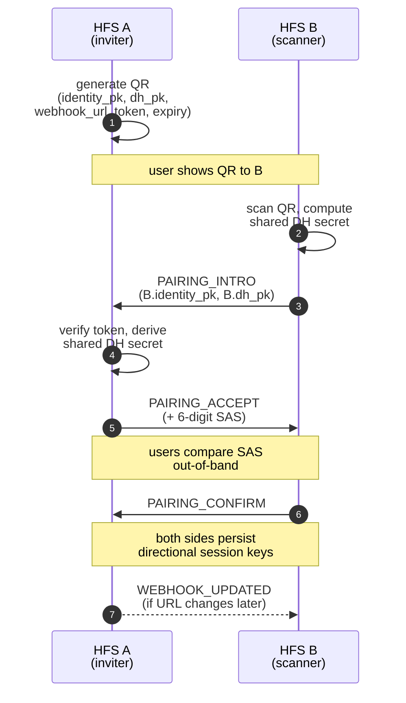
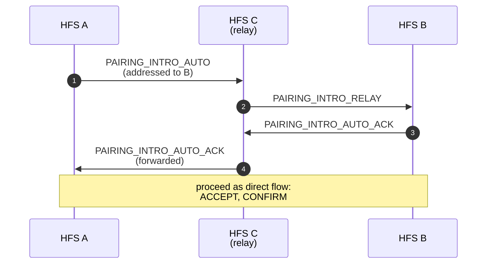

# Pairing

The one-time handshake that establishes an end-to-end encrypted trust
relationship between two HFS instances. All subsequent federation
traffic between the pair rides on the directional session keys derived
here.

## Scope

- **HFS**: full participant. Scans / presents a QR code, runs the
  three-message DH handshake, stores the resulting session keys.
- **GFS**: uninvolved. Pairing is strictly peer-to-peer.

## Event types

`PAIRING_INTRO`, `PAIRING_INTRO_RELAY`, `PAIRING_INTRO_AUTO`,
`PAIRING_INTRO_AUTO_ACK`, `PAIRING_ACCEPT`, `PAIRING_CONFIRM`,
`PAIRING_ABORT`, `UNPAIR`, `WEBHOOK_UPDATED`.

## Flow — direct QR handshake

## Flow — auto-pair via relay

When two instances can't scan each other's QR but share a mutual peer
`C`, they can bootstrap trust via `C`. The relay sees only opaque
ciphertext; the two endpoints derive the session keys themselves.

## Key derivation

Each side holds an **Ed25519 identity key** (long-lived) and generates
a fresh **X25519 DH keypair** per pairing. The shared secret feeds
HKDF-SHA256 to produce two directional AES-256-GCM keys:

- `key_self_to_remote` — encrypts outbound envelopes.
- `key_remote_to_self` — decrypts inbound envelopes.

Both are stored alongside the peer in `remote_instances` with a
`PairingStatus.CONFIRMED` row. See `docs/crypto.md` for the full key
schedule.

## Unpairing

`UNPAIR` is a polite notice that the session keys are about to be
forgotten. The receiver marks the peer as unpaired and drops any
pending outbound envelopes. `UNPAIR` is the only federation event that
the receiver still decrypts with a key it's about to delete.

## Implementation

- `socialhome/federation/pairing_coordinator.py` — state machine for
  direct + auto-pair flows.
- `socialhome/services/federation_inbound/pairing.py` — inbound
  handlers (one per event type, registered with the dispatch registry).
- `socialhome/routes/pairing_routes.py` — REST endpoints used by the
  UI (`/api/pairing/*`).
- `socialhome/crypto.py` — key derivation primitives.

## Spec references

§11 (Instance Pairing & Encrypted Webhooks),
§25.8.20 (session key derivation),
§S-13/S-14 (SAS verification and answer-origin audits).
