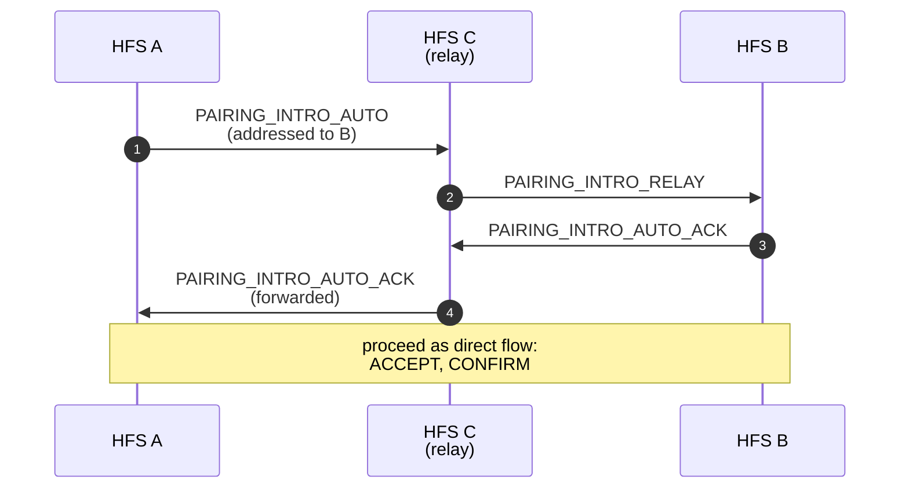
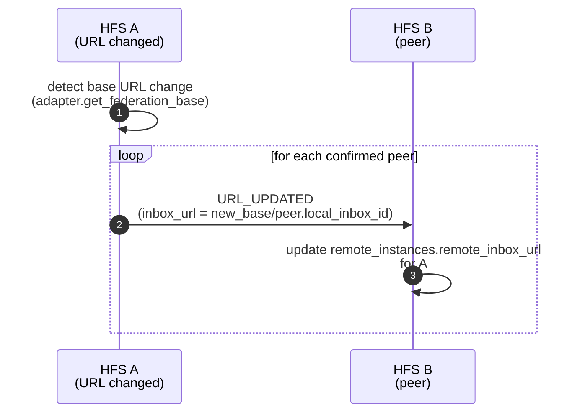

# Pairing

The one-time handshake that establishes an end-to-end encrypted trust
relationship between two HFS instances. All subsequent federation
traffic between the pair rides on the directional session keys derived
here.

## Scope

- **HFS**: full participant. Scans / presents a QR code, runs the
  three-message DH handshake, stores the resulting session keys.
- **GFS**: uninvolved. Pairing is strictly peer-to-peer.

## Event types

`PAIRING_INTRO`, `PAIRING_INTRO_RELAY`, `PAIRING_INTRO_AUTO`,
`PAIRING_INTRO_AUTO_ACK`, `PAIRING_ACCEPT`, `PAIRING_CONFIRM`,
`PAIRING_ABORT`, `UNPAIR`, `URL_UPDATED`.

## Flow — direct QR handshake

The handshake runs on a **dedicated plaintext bootstrap transport**
(`POST /api/pairing/peer-accept` and `POST /api/pairing/peer-confirm`)
rather than the §24.11 federation inbox. The §24.11 pipeline starts
with a `RemoteInstance` lookup that doesn't exist until pairing
completes — classic bootstrap chicken-and-egg. Both bootstrap
endpoints are public; the body's Ed25519 signature is the auth
(TOFU on first contact, plus the SAS round-trip closes the MITM
window).

```mermaid
sequenceDiagram
    autonumber
    participant A as HFS A<br/>(inviter)
    participant B as HFS B<br/>(scanner)

    A->>A: generate QR<br/>(own_inbox_id, identity_pk,<br/>dh_pk, inbox_url, token, expiry)
    Note over A,B: user shows QR to B

    B->>B: scan QR → accept_pairing()<br/>derives shared DH secret,<br/>stores local RemoteInstance for A
    B->>A: POST /api/pairing/peer-accept<br/>(B.identity_pk, B.dh_pk,<br/>B.inbox_url, B.display_name,<br/>token, SAS, Ed25519 signature)

    A->>A: handle_peer_accept: TOFU verify sig,<br/>derive shared secret, KEK-encrypt keys,<br/>save RemoteInstance for B,<br/>publish PairingAcceptReceived
    A-->>A: WS pairing.accept_received →<br/>admin UI auto-fills SAS digits

    Note over A,B: admins compare SAS<br/>out-of-band

    A->>A: admin enters SAS → confirm_pairing()<br/>flips local RemoteInstance → CONFIRMED
    A->>B: POST /api/pairing/peer-confirm<br/>(token, A.instance_id, Ed25519 signature)

    B->>B: handle_peer_confirm: verify sig<br/>with stored A.identity_pk,<br/>flip local RemoteInstance → CONFIRMED,<br/>publish PairingConfirmed

    Note over A,B: both sides hold CONFIRMED pair;<br/>normal §24.11 federation starts here.
    A-->>B: URL_UPDATED<br/>(if URL changes later)
```

## Flow — auto-pair via relay

When two instances can't scan each other's QR but share a mutual peer
`C`, they can bootstrap trust via `C`. The relay sees only opaque
ciphertext; the two endpoints derive the session keys themselves.



## Key derivation

Each side holds an **Ed25519 identity key** (long-lived) and generates
a fresh **X25519 DH keypair** per pairing. The shared secret feeds
HKDF-SHA256 to produce two directional AES-256-GCM keys:

- `key_self_to_remote` — encrypts outbound envelopes.
- `key_remote_to_self` — decrypts inbound envelopes.

Both are stored alongside the peer in `remote_instances` with a
`PairingStatus.CONFIRMED` row. See `docs/crypto.md` for the full key
schedule.

## URL rotation — `URL_UPDATED`

When this instance's externally-reachable inbox URL changes — admin
rotates `external_url` in standalone mode, Nabu Casa Remote UI flips
on/off in HA mode, or a reverse-proxy gets reconfigured — every
confirmed peer is told so their `remote_inbox_url` tracks the move.
Without this, the next envelope delivery silently fails with a
"No instance found" rejection at the stale URL.



Payload: `{"inbox_url": "<full per-peer URL>"}`. The URL is
per-peer: sender appends the recipient's `local_inbox_id` to the new
base, so each `URL_UPDATED` envelope delivers to exactly one peer
with that peer's own secret path.

Validation at the receiver: the envelope is already signature-verified
by the §24.11 inbound pipeline. The handler additionally rejects
empty URLs and unsupported schemes (anything that isn't `http://` or
`https://`).

## Unpairing

`UNPAIR` is a polite notice that the session keys are about to be
forgotten. The receiver marks the peer as unpaired and drops any
pending outbound envelopes. `UNPAIR` is the only federation event that
the receiver still decrypts with a key it's about to delete.

## Implementation

- `socialhome/federation/pairing_coordinator.py` — state machine for
  direct + auto-pair flows, plus `handle_peer_accept` /
  `handle_peer_confirm` for the bootstrap transport.
- `socialhome/federation/peer_pairing_client.py` — outbound HTTP
  client for `/api/pairing/peer-{accept,confirm}`. Signs bodies with
  Ed25519 using this instance's identity seed.
- `socialhome/routes/pairing_peer.py` — the two public bootstrap
  endpoints.
- `socialhome/routes/pairing.py` — local-only admin routes used by
  the UI (`/api/pairing/initiate`, `/accept`, `/confirm`).
- `socialhome/services/federation_inbound/pairing.py` — §24.11
  inbound handlers for already-paired peers (covers
  `PAIRING_INTRO_RELAY`, `URL_UPDATED`, `UNPAIR`).
- `socialhome/services/url_update_outbound.py` — outbound fan-out of
  `URL_UPDATED` when this instance's base URL changes.
- `socialhome/crypto.py` — key derivation primitives.

## Spec references

§11 (Instance Pairing & Encrypted Inboxes),
§25.8.20 (session key derivation),
§S-13/S-14 (SAS verification and answer-origin audits).
