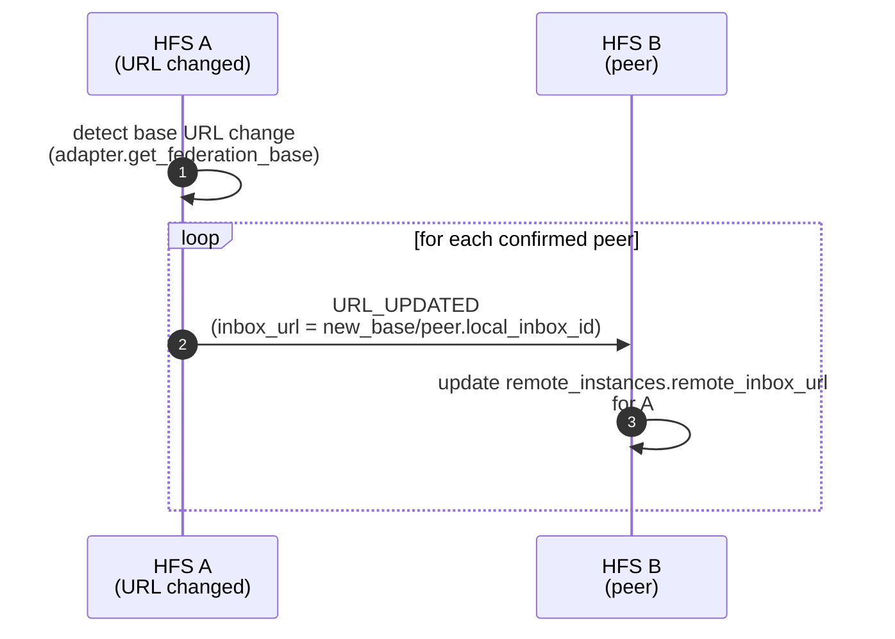

# Pairing

The one-time handshake that establishes an end-to-end encrypted trust
relationship between two HFS instances. All subsequent federation
traffic between the pair rides on the directional session keys derived
here.

## Scope

- **HFS**: full participant. Scans / presents a QR code, runs the
  three-message DH handshake, stores the resulting session keys.
- **GFS**: uninvolved. Pairing is strictly peer-to-peer.

**Not a pairing:** the §D2b invite-link bootstrap redeem
([`invites.md`](./invites.md)) also short-circuits the §24.11 pipeline
with a self-signed, TOFU-verified body, but it is not a handshake — it
creates a **space-scoped** `remote_instances` row
(`InstanceSource.space_session`) that is excluded from DMs, the user
roster, presence, the friends constellation and the auto-pair vouching
relay, and it publishes no `PairingConfirmed`. It runs over the
connection server rather than the inbox URL, so "GFS: uninvolved" stays
true of pairing itself.

## Event types

`PAIRING_INTRO`, `PAIRING_INTRO_RELAY`, `PAIRING_INTRO_AUTO`,
`PAIRING_INTRO_AUTO_ACK`, `PAIRING_INTRO_AUTO_ACK_VIA`,
`PAIRING_ACCEPT`, `PAIRING_CONFIRM`, `PAIRING_PEER_ACCEPT`,
`PAIRING_PEER_CONFIRM`, `PAIRING_ABORT`, `UNPAIR`, `URL_UPDATED`.

## Flow — direct QR handshake

The bootstrap handshake rides the **federation inbox URL** as two
plaintext, Ed25519-signed federation events: `PAIRING_PEER_ACCEPT`
(B → A) and `PAIRING_PEER_CONFIRM` (A → B). The receiving
federation-inbox view peeks the body's `event_type` and dispatches
pairing events directly to the pairing coordinator — short of the
§24.11 pipeline, which assumes a confirmed `RemoteInstance` row that
doesn't exist until pairing completes.

The federation inbox path is the only public surface peers reach
through the HA / HAOS Supervisor Ingress proxy, so anchoring the
bootstrap there is what keeps QR pairing working under those modes.
Auth is the body's Ed25519 signature (TOFU on first contact, plus
the SAS round-trip to close the MITM window).

```mermaid
sequenceDiagram
    autonumber
    participant A as HFS A<br/>(inviter)
    participant B as HFS B<br/>(scanner)

    A->>A: generate QR<br/>(own_inbox_id, identity_pk,<br/>dh_pk, inbox_url, token, expiry)
    Note over A,B: user shows QR to B

    B->>B: scan QR → accept_pairing()<br/>derives shared DH secret,<br/>stores local RemoteInstance for A
    B->>A: POST {A.inbox_url}<br/>{event_type: PAIRING_PEER_ACCEPT,<br/>B.identity_pk, B.dh_pk,<br/>B.inbox_url, B.display_name,<br/>token, SAS, home_lat?, home_lon?,<br/>Ed25519 signature}

    A->>A: federation-inbox view dispatches<br/>PAIRING_PEER_ACCEPT → handle_peer_accept:<br/>TOFU verify sig, derive shared secret,<br/>KEK-encrypt keys, save RemoteInstance for B,<br/>publish PairingAcceptReceived
    A-->>A: WS pairing.accept_received →<br/>admin UI auto-fills SAS digits

    Note over A,B: admins compare SAS<br/>out-of-band

    A->>A: admin enters SAS → confirm_pairing()<br/>flips local RemoteInstance → CONFIRMED
    A->>B: POST {B.inbox_url}<br/>{event_type: PAIRING_PEER_CONFIRM,<br/>token, A.instance_id, Ed25519 signature}

    B->>B: federation-inbox view dispatches<br/>PAIRING_PEER_CONFIRM → handle_peer_confirm:<br/>verify sig with stored A.identity_pk,<br/>flip local RemoteInstance → CONFIRMED,<br/>publish PairingConfirmed

    Note over A,B: both sides hold CONFIRMED pair;<br/>normal §24.11 federation starts here.
    A-->>B: URL_UPDATED<br/>(if URL changes later)
```

### `PAIRING_PEER_ACCEPT` body fields

| Field | Required | Notes |
|---|---|---|
| `event_type` | yes | `"PAIRING_PEER_ACCEPT"` |
| `identity_pk` | yes | B's Ed25519 public key (base64). |
| `dh_pk` | yes | B's X25519 ephemeral DH public key (base64). |
| `inbox_url` | yes | B's federation inbox base URL. |
| `display_name` | no | B's household display name. |
| `token` | yes | The pairing token from A's QR / copy code. |
| `verification_code` | yes | SAS digits to be verified out-of-band. |
| `sig_suite` | no | `"ed25519+mldsa65"` when B supports hybrid PQ signatures. |
| `pq_identity_pk` | no | B's ML-DSA-65 public key (when `sig_suite` is hybrid). |
| `pq_algorithm` | no | PQ algorithm name (when `sig_suite` is hybrid). |
| `home_lat` | no | B's household latitude, truncated to 4 decimal places. Sent only when both `home_lat` and `home_lon` are available (HA / HAOS mode, or operator-configured). See [home-location.md](./home-location.md). |
| `home_lon` | no | B's household longitude, truncated to 4 decimal places. |
| `signature` | yes | Ed25519 signature over the body (TOFU auth). |

When `home_lat` / `home_lon` are present, A records them on B's newly-created
`remote_instances` row immediately — the map pin is available as soon as the
pair is confirmed, without waiting for a separate `LOCAL_HOME_LOCATION_CHANGED`
broadcast.

## Manual code fallback — `socialhome://` URL scheme

The QR path fails the moment a camera is missing or denied, the QR is
too small to focus on a phone screen, or the two households are
pairing remotely (over chat / SMS / email). To keep pairing possible
in those cases, the SPA exposes a **copy/paste pairing code** as an
equal-weight peer to the QR — not a hidden fallback.

The code is a single-line `socialhome://` URL that survives chat
copy/paste round-trips. Two shapes:

- **Instance pairing (households)** — `socialhome://pair#<base64url(JSON)>`.
  The fragment carries the exact same JSON object the QR encodes
  (`token`, `instance_id`, `identity_pk`, `dh_pk`, `inbox_url`,
  `expires_at`, plus the optional post-quantum `pq_*` fields).
  Encoding the payload in the **URL fragment** (`#…`) — rather than
  a query string — keeps it client-side: a stray paste into a
  browser address bar never sends the secret to a third party's
  server logs, because fragments are not transmitted on HTTP
  requests.

- **GFS pairing** — `socialhome://gfs-pair/{base_url}?token={token}`.
  Direct migration of the GFS landing's previous `sh://gfs-pair/…`
  scheme. The pairing token is single-use with a 10-minute TTL
  (§24.7.4) — short enough to make casual reuse a non-issue, long
  enough for a screenshot ↔ paste handoff in another room.

### Back-compat

The scanner-side paste field accepts both the new `socialhome://pair#…`
URL and **raw multi-field JSON** (what the older QR codes encoded
directly). A code in flight in someone's chat thread keeps working
across the 5-minute token TTL.

### Where it shows up

- **Inviter side** — the modal renders the QR and the
  `socialhome://pair#…` code in a peer card, side-by-side on desktop
  and stacked under an OR divider on mobile. A "Copy code" button
  next to the card writes the URL to the clipboard.
- **Scanner side** — a two-method picker (Scan QR / Paste code) at
  the top of the scan step replaces the previous camera-with-buried-
  fallback layout. Both methods are equal-weight cards. The paste
  textarea decodes whichever shape the user provides.
- **GFS landing page** — the server-rendered HTML (`GET /` on a GFS)
  renders the `socialhome://gfs-pair/…` URL next to the QR with a
  small inline-JS Copy code button. The QR encodes the same URL.

## Flow — auto-pair via relay

When two instances can't scan each other's QR but share a mutual peer
`C`, they can bootstrap trust via `C`. The relay sees only opaque
ciphertext; the two endpoints derive the session keys themselves.

```mermaid
sequenceDiagram
    autonumber
    participant A as HFS A
    participant B as HFS B<br/>(relay — vouches for both)
    participant C as HFS C<br/>(target)
    A->>B: PAIRING_INTRO_AUTO<br/>{target_id: C, a_dh_pk, a_inbox_url}
    B->>C: PAIRING_INTRO_AUTO<br/>{from_a_*, vouch_sig over A's identity}
    Note over C: admin one-clicks "approve"<br/>(no QR scan, vouched by B)
    C->>B: PAIRING_INTRO_AUTO_ACK_VIA<br/>{to_a_id, c_pk, c_dh_pk, ack_sig}
    B->>A: PAIRING_INTRO_AUTO_ACK<br/>(forwarded — both hops over established trust)
    Note over A,C: A↔C now CONFIRMED;<br/>federation envelopes flow normally.
```

The ack rides through `B` rather than directly C → A because A
holds only a `PENDING_SENT` row for C (no identity key yet) — a
direct C → A envelope would fail the §24.11 inbound signature
check. Both legs of the ack are over established trust (A↔B and
B↔C are confirmed pairs, set up via QR before the auto-pair flow
started).

## Roster catch-up on pair-confirm — `USERS_SYNC`

Pairing carries the *instance's* metadata but no per-user roster.
Without a roster push, the peer's local ``remote_users`` mirror sits
empty until each member of the freshly-paired household happens to
edit their profile — at which point the existing
``USER_UPDATED`` outbound fans the change. In practice this means
the household sees only the admin (or whoever first touched their
profile) on the Friends dashboard / DM picker.

`UsersSyncOutbound` closes the gap. On `PairingConfirmed` it sends
a single `USERS_SYNC` envelope to the new peer:

```
{"users": [
  {"user_id", "username", "display_name", "bio", "picture_hash",
   "picture_webp_base64": <optional bytes>},
  ...
]}
```

The receiver-side handler (`FederationInboundService._on_users_sync`)
iterates the list and upserts each row through the same
``_upsert_remote_user`` path ``USER_UPDATED`` uses, so the inbound
code is unchanged. The per-pair user-visibility filter applies on
the sender — admins who have hidden a user from a peer keep that
user out of the snapshot.

When every local user is hidden from the peer (or there are no
local users at all), the envelope is suppressed entirely — no
empty-roster sync.

## Per-pair user visibility

The admin Connection-Detail modal toggles which **local** users
surface to a paired peer. Default-visible: a household member shows
up unless an admin has explicitly hidden them via
`PATCH /api/pairing/connections/{instance_id}/visible-users`. State
lives in `peer_user_visibility`; the sender-side gates read it
through the `VisibilityMixin` on each outbound service.

**Semantic: hide = remove.** A hide flips three things in one
admin click:

1. The peer is told to forget the user — `USER_REMOVED` fires and
   the peer's inbound handler marks the row
   `remote_users.deprovisioned_at`, dropping the user from
   `/api/friends`, the DM picker, member lists, and autocomplete.
2. The peer **cascade-purges** every moment, highlight, and DM
   conversation that user is involved in — hard delete on the
   peer's side so no orphan content from the hidden user lingers.
3. Future user-scoped envelopes from that user are dropped two
   different ways (sender + receiver, defence-in-depth — see
   below).

Un-hide fires `USER_UPDATED`, which un-sets `deprovisioned_at` on
the peer's `remote_users` row. The user re-appears, but the
purged content does **not** come back — un-hiding is a fresh
start, not a rewind.

**Sender-side gates** (efficient + privacy-respecting). Every
direct-fan-out user-scoped event is gated through the
`peer_user_visibility` lookup before the envelope is built. The
plaintext never hits the wire and never gets decrypted on the
blocked peer's process:

- `USER_UPDATED`, `USERS_SYNC` (profile catch-up)
- `USER_ONLINE`, `USER_IDLE`, `USER_OFFLINE` (session presence)
- `DM_MESSAGE`, `DM_MESSAGE_DELETED`, `DM_MESSAGE_REACTION`,
  `DM_MEDIA_BLOB`, `DM_USER_TYPING`
- `DM_RELAY` (at the originating node only — forwarding hops
  handle opaque ciphertext and cannot gate)
- `DM_HISTORY_CHUNK` (filtered at the conversation level:
  cross-household DMs are 1:1, so a hidden local participant
  suppresses the entire conversation's catch-up; the
  `DM_HISTORY_COMPLETE` envelope still fires so the requester's
  state machine terminates cleanly)
- `HIGHLIGHT_CREATED`, `HIGHLIGHT_FRAME_APPENDED`,
  `HIGHLIGHT_DELETED`, `HIGHLIGHT_FRAME_DELETED`,
  `HIGHLIGHT_FRAME_VIEWED`, `HIGHLIGHT_FRAME_REACTED`,
  `HIGHLIGHT_FRAME_REACTION_REMOVED`
- `MOMENT_CREATED`, `MOMENT_DELETED`, `MOMENT_REACTED`,
  `MOMENT_REACTION_REMOVED`

**Receiver-side backstop**. `MomentFederationOutbound` runs a 3-hop
relay (`relay_inbound`) — a household that's *not* the originator
re-broadcasts moments to its own peers, so a moment from a hidden
user can leak back to the blocked peer via that relay. The mid-path
relayer has no visibility into the originator's per-pair hide
policy, so the sender-side gate can't help. §24.11 step 11
(`make_check_deprovisioned_author`) closes the hole: every inbound
user-scoped envelope is checked against the receiver's
`remote_users.deprovisioned_at`, and dropped silently if the
author has been purged. The step runs after `persist_replay` so
the relayer's outbox sees a 200 OK and stops redelivering.

The deprovisioned-author filter covers the same event-type list as
the sender gates, keyed off the per-event-type author field
(`sender_user_id` / `reactor_user_id` / `viewer_user_id` /
`author_user_id` / `user_id`).

Space-scoped events (`SPACE_POST_CREATED`, `SPACE_COMMENT_*`,
`SPACE_STICKY_*`, `SPACE_CALENDAR_*`, etc.) are **not** gated by
this toggle — spaces own their own audience model.

Wire compat: zero. No new event types, no payload-field additions,
no `proto_version` bump. The sender simply doesn't emit some
envelopes, and the receiver drops some that arrive via relay.

## Key derivation

Each side holds an **Ed25519 identity key** (long-lived) and generates
a fresh **X25519 DH keypair** per pairing. The shared secret feeds
HKDF-SHA256 to produce two directional AES-256-GCM keys:

- `key_self_to_remote` — encrypts outbound envelopes.
- `key_remote_to_self` — decrypts inbound envelopes.

Both are stored alongside the peer in `remote_instances` with a
`PairingStatus.CONFIRMED` row. See `docs/crypto.md` for the full key
schedule.

## Local alias — household-only rename of a paired peer

The peer's `display_name` is whatever it sent on the federation
handshake. When it's empty or cryptic (e.g. the truncated
`instance_id`, "z7k63zfi") the admin is stuck with that name in
every UI surface — Friends dashboard, Connections list, DM picker.

The `remote_instances.local_alias` column (added in migration
`0005`) lets the admin pick a name they want to see for the
connection without renaming the peer remotely. The choice is
**never federated** — purely local UX state. Storage rules:

- `NULL` (default) → SPA falls back to `display_name`.
- Set via `PATCH /api/pairing/connections/{instance_id}/alias`
  with `{"alias": "Brother's house"}` (admin-only, 80-char cap).
- Cleared by posting `{"alias": null}` or a whitespace-only string.

The HTTP read shapes (`GET /api/pairing/connections`,
`GET /api/friends`) return `display_name` already resolved to the
effective value — the SPA renders one field and gets the alias
preference for free. The raw federated name stays available as
`federated_display_name` so the manage modal can show "They
advertise themselves as <federated_name>" alongside the editable
alias input.

A subsequent `save_instance` (e.g. URL rotation) preserves the
alias because the upsert doesn't touch the `local_alias` column.

## Pairing wizard — "Configure sharing" step

After the SAS verification succeeds and the pair is confirmed, the pairing
wizard advances to a **Configure sharing** step instead of closing
immediately. The step shows the `<ShareHomeToggle/>` component for the
just-paired peer, defaulting to ON (`share_home = true`). Operators can
flip it before hitting the final **Done** button; the change is applied via
`PATCH /api/pairing/connections/{instance_id}` with `{"share_home": false}`
and fires the one-shot null-coord revoke envelope described in
[home-location.md](./home-location.md#revoking-access). Leaving the toggle
ON (the default) requires no extra API call.

This step only appears for household pairings (the QR and copy-code flows);
GFS pairings do not expose the toggle.

## Federation inbox base — per-adapter shape

The pairing coordinator works with a "federation inbox base" URL —
the string a peer would POST to with a per-peer suffix appended.
What that string actually is depends on the platform adapter:

- **Standalone** — adapter owns the route. Returns
  `{external_url}/federation/inbox`; the addon listens on
  `/federation/inbox/{inbox_id}` directly.
- **HA / HAOS** — addon sits behind HA Core. The HA integration
  pushes the bare external URL (Nabu Casa Remote UI or admin-set
  `external_url`) via `PUT /api/ha/integration/federation-base`
  and registers an HA Core HTTP view at
  `/api/socialhome/inbox/{inbox_id}` that forwards into the addon's
  own `/federation/inbox/{inbox_id}`. The adapter splices that
  path onto the pushed value, so callers see
  `{external_url}/api/socialhome/inbox`. The append is idempotent —
  a future integration that ever pushes the full path won't cause
  a double-append.

Every adapter returns `None` until the URL is configured; the
pairing route surfaces that as a 422 `NOT_CONFIGURED` so the admin
knows to wire it up before issuing a QR.

## URL rotation — `URL_UPDATED`

When this instance's externally-reachable inbox URL changes — admin
rotates `external_url` in standalone mode, Nabu Casa Remote UI flips
on/off in HA mode, or a reverse-proxy gets reconfigured — every
confirmed peer is told so their `remote_inbox_url` tracks the move.
Without this, the next envelope delivery silently fails with a
"No instance found" rejection at the stale URL.


```mermaid
sequenceDiagram
    autonumber
    participant A as HFS A<br/>(URL changed)
    participant B as HFS B<br/>(peer)
    A->>A: detect base URL change<br/>(adapter.get_federation_base)
    loop for each confirmed peer
        A->>B: URL_UPDATED<br/>(inbox_url = new_base/peer.local_inbox_id)
        B->>B: update remote_instances.remote_inbox_url<br/>for A
    end
```

Payload: `{"inbox_url": "<full per-peer URL>"}`. The URL is
per-peer: sender appends the recipient's `local_inbox_id` to the new
base, so each `URL_UPDATED` envelope delivers to exactly one peer
with that peer's own secret path.

Validation at the receiver: the envelope is already signature-verified
by the §24.11 inbound pipeline. The handler additionally rejects
empty URLs and unsupported schemes (anything that isn't `http://` or
`https://`).

## TTL + cleanup

`PAIRING_TTL_SECONDS = 300` — five minutes from the QR being issued
(or scanned) to the SAS being entered on both sides. Past that, every
handler in the coordinator rejects the in-progress message with
`Pairing session has expired`.

`PairingSessionPruneScheduler` (in
[`socialhome/infrastructure/`](../../socialhome/infrastructure/pairing_session_prune_scheduler.py))
runs once a minute and calls
[`federation_repo.cleanup_expired_pairings`](../../socialhome/repositories/federation_repo.py).
That call deletes the expired `pending_pairings` row AND any
PENDING_SENT / PENDING_RECEIVED `remote_instances` row whose
`local_inbox_id` matched it — so the SPA's pending handshake list
self-empties within ~1 minute of expiry. CONFIRMED rows are protected
by an explicit status filter (the real `confirm()` path deletes the
session before flipping the instance, so the scenario is defensive
rather than actual).

## Unpairing

`UNPAIR` is a polite notice that the session keys are about to be
forgotten. The receiver marks the peer as unpaired and drops any
pending outbound envelopes. `UNPAIR` is the only federation event that
the receiver still decrypts with a key it's about to delete.

## Implementation

- `socialhome/federation/pairing_coordinator.py` — state machine for
  direct + auto-pair flows, plus `handle_peer_accept` /
  `handle_peer_confirm` for the bootstrap transport.
- `socialhome/federation/peer_pairing_client.py` — outbound HTTP
  client that POSTs `PAIRING_PEER_ACCEPT` / `PAIRING_PEER_CONFIRM`
  bodies directly to the peer's federation `inbox_url`. Signs bodies
  with Ed25519 using this instance's identity seed.
- `socialhome/routes/federation.py` — `FederationInboxView` peeks the
  body's `event_type` and dispatches `PAIRING_PEER_ACCEPT` /
  `PAIRING_PEER_CONFIRM` to the pairing coordinator ahead of the
  §24.11 pipeline.
- `socialhome/routes/pairing.py` — local-only admin routes used by
  the UI (`/api/pairing/initiate`, `/accept`, `/confirm`).
- `socialhome/services/federation_inbound/pairing.py` — §24.11
  inbound handlers for already-paired peers (covers
  `PAIRING_INTRO_RELAY`, `URL_UPDATED`, `UNPAIR`).
- `socialhome/services/url_update_outbound.py` — outbound fan-out of
  `URL_UPDATED` when this instance's base URL changes.
- `socialhome/crypto.py` — key derivation primitives.

## Spec references

§11 (Instance Pairing & Encrypted Inboxes),
§25.8.20 (session key derivation),
§S-13/S-14 (SAS verification and answer-origin audits).
