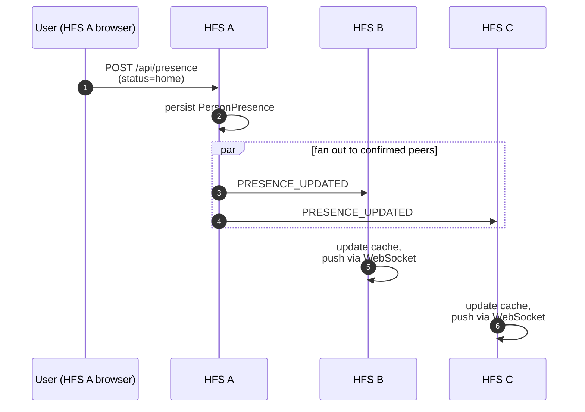

# Presence

Who is online, where they are, and what they're doing. Presence is
the lowest-latency, highest-volume federation event — every status
flicker or location update produces one envelope per paired peer.

## Scope

- **HFS**: both sides. Broadcasts the local user's presence to every
  confirmed peer; renders inbound presence for the UI.
- **GFS**: uninvolved. Presence never leaves the pair mesh.

## Event types

`PRESENCE_UPDATED`, `USER_UPDATED`, `USER_REMOVED`,
`USER_STATUS_UPDATED`, `USERS_SYNC`.

## Flow — status change

## GPS truncation (§25)

When a presence event carries a location, coordinates are truncated
to **4 decimal places** before persistence or federation. This is
~11 m of precision — enough for "at home / near home / away" UX
without exposing fine-grained movement.

`round(float(lat), 4)` and `round(float(lon), 4)` are applied at the
service boundary; the repository never sees full-precision values.

## Rate limiting

`POST /api/presence/location` is rate-limited to 10 updates per
minute per user. Above that, the latest update wins and the intermediate
ones are dropped. The federation layer batches location updates on a
short timer (currently 5 s) to keep the per-peer event rate bounded.

## Scoped visibility (§23.80)

A presence update may be restricted to specific spaces — e.g. "show
my location only to my family space, not the neighbourhood space."
The outbound service applies the per-space filter before selecting
which peers to broadcast to.

## USERS_SYNC

`USERS_SYNC` is a periodic snapshot of the sending instance's known
users — display names, avatar URLs, status strings. It lets a freshly
paired peer populate its directory without waiting for each user to
tick over organically. Rate: once every 24 h, plus on demand when a
new pairing is confirmed.

## Implementation

- `socialhome/services/presence_service.py` — local state +
  scheduler.
- `socialhome/services/federation_inbound/presence.py` — inbound
  handlers.
- `socialhome/repositories/presence_repo.py`.
- `socialhome/routes/presence_routes.py` — REST endpoints.

## Spec references

§23.21 (presence UX),
§25 (GPS truncation),
§23.80 (per-space visibility).
