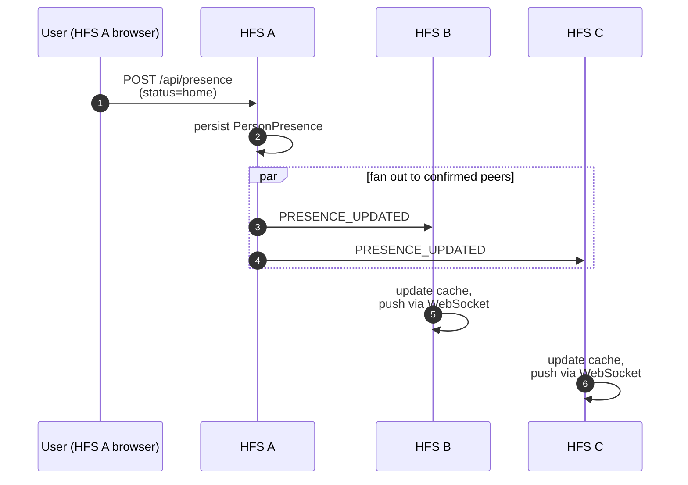

# Presence

Who is online, where they are, and what they're doing. Presence is
the lowest-latency, highest-volume federation event — every status
flicker or location update produces one envelope per paired peer.

## Scope

- **HFS**: both sides. Broadcasts the local user's presence to every
  confirmed peer; renders inbound presence for the UI.
- **GFS**: uninvolved. Presence never leaves the pair mesh.

## Event types

`PRESENCE_UPDATED`, `USER_UPDATED`, `USER_REMOVED`,
`USER_STATUS_UPDATED`, `USERS_SYNC`, `USER_ONLINE`, `USER_IDLE`,
`USER_OFFLINE`.

## Flow — status change



## GPS truncation (§25)

When a presence event carries a location, coordinates are truncated
to **4 decimal places** before persistence or federation. This is
~11 m of precision — enough for "at home / near home / away" UX
without exposing fine-grained movement.

`round(float(lat), 4)` and `round(float(lon), 4)` are applied at the
service boundary; the repository never sees full-precision values.

## Rate limiting

`POST /api/presence/location` is rate-limited to 10 updates per
minute per user. Above that, the latest update wins and the intermediate
ones are dropped. The federation layer batches location updates on a
short timer (currently 5 s) to keep the per-peer event rate bounded.

## Scoped visibility (§23.80)

A presence update may be restricted to specific spaces — e.g. "show
my location only to my family space, not the neighbourhood space."
The outbound service applies the per-space filter before selecting
which peers to broadcast to.

## Per-space presence is GPS-only (§23.8.6)

Two distinct fan-outs follow every household ``PresenceUpdated``:

1. **Household dashboard** — local `presence.updated` WS frame, includes
   `zone_name` (e.g. `"Office"`). HA-defined zone names are
   household-private data — they're consumed here and never propagate
   beyond.
2. **Per-space map** — for every space where the user has
   `location_share_enabled = 1` AND `feature_location = 1`,
   `SpaceLocationOutbound` emits:
   - a local WS frame `space_location_updated` to space members on
     this instance, payload `{space_id, user_id, lat, lon, accuracy_m,
     updated_at}`;
   - a sealed federation event `SPACE_LOCATION_UPDATED` to every
     remote member instance, encrypted payload `{user_id, lat, lon,
     accuracy_m, updated_at}`.

   **Both space-bound payloads strip `zone_name`.** HA zones do not
   reach a space. To label a member's pin on the space map, each
   space carries its own zone catalogue (see "Per-space zones" below);
   the client matches GPS to zones at render time.

When `lat`/`lon` is `None` (accuracy gate fired upstream) we skip
both space fan-outs entirely. The household dashboard still receives
`zone_name`, so the member stays visible there.

## Per-space zones (§23.8.7)

Each space owns a catalogue of named display circles (lat, lon,
radius_m). Live admin CRUD is replicated to remote member instances
via two sealed federation events under the space content key:

- `SPACE_ZONE_UPSERTED` — encrypted payload
  `{zone_id, space_id, name, latitude, longitude, radius_m, color,
  created_by, updated_at}`. Inbound handler upserts into the local
  `space_zones` table.
- `SPACE_ZONE_DELETED` — encrypted payload
  `{zone_id, space_id, deleted_by}`. Inbound handler deletes the
  matching row.

A remote member instance joining a space mid-life picks up the full
catalogue via the chunked `SPACE_SYNC_BEGIN/CHUNK` flow — the
`space_zones` resource rides between `polls` and the sentinel.

Local admin CRUD also fires a `space_zone_changed` WS frame to space
members on this instance so the admin UI redraws without polling.
The frame shape is `{type: "space_zone_changed", data: {space_id,
action: "upsert"|"delete", zone_id, zone: SpaceZone | null}}`.

## USERS_SYNC

`USERS_SYNC` is a periodic snapshot of the sending instance's known
users — display names, avatar URLs, status strings. It lets a freshly
paired peer populate its directory without waiting for each user to
tick over organically. Rate: once every 24 h, plus on demand when a
new pairing is confirmed.

## Implementation

- `socialhome/services/presence_service.py` — local state +
  scheduler.
- `socialhome/services/space_location_outbound.py` — space-bound
  GPS-only fan-out (§23.8.6).
- `socialhome/services/space_zone_service.py` — admin CRUD for the
  per-space zone catalogue (§23.8.7).
- `socialhome/services/space_zone_outbound.py` — federation
  fan-out for `SPACE_ZONE_UPSERTED` / `SPACE_ZONE_DELETED`.
- `socialhome/services/federation_inbound/space_content.py` —
  inbound zone handlers (mirror upserts/deletes into the local
  `space_zones` table).
- `socialhome/services/realtime_service.py` — local
  `space_zone_changed` WS broadcast.
- `socialhome/federation/sync/space/exporters/zones.py` — zones
  ride the chunked sync for late-joining remote members.
- `socialhome/repositories/space_zone_repo.py`.
- `socialhome/routes/space_zones.py` — REST CRUD.
- `socialhome/routes/spaces.py` —
  `PATCH /api/spaces/{id}/members/me/location-sharing` (§23.8.8).

## Online status (session presence)

Two presence signals coexist and stay independent: the **physical**
state above (`home`/`away`/`zone`/`not_home`) tracks where the user
*is*, and **session presence** below tracks whether the user has the
app *open* on any device. A user can be `home + offline` (HA reports
them at the house but the SH tab is closed) or `away + online`
(commuting, browsing on a phone). The frontend renders the two cues
side-by-side — never collapsed into a single field.

Mechanics:

- `WebSocketManager.register()` / `unregister()` track open WS
  sessions per user (the manager doesn't know what they mean — that's
  this layer's job).
- `OnlineStatusService` watches first/last-session transitions and
  publishes the four events:
  - `UserCameOnline` — first session opened.
  - `UserResumedActive` — was idle, became active again.
  - `UserWentIdle` — every session has been silent ≥ 5 minutes.
  - `UserWentOffline` — last session closed.
- Activity is reset on **any** inbound WS frame (typing, ping, etc.)
  — protocol-level heartbeats don't reach the message loop and
  therefore don't update the timer.
- Idle is computed across **all** sessions: a user with one active
  tab + one idle tab is *online*, not *idle*.
- `users.last_seen_at` is persisted on the *last* session closing,
  debounced to one write per 30 s per user — so a flaky-Wi-Fi
  reconnect storm doesn't turn into a write storm.

WS frames (sit in the `user.*` namespace, deliberately *not* `presence.*`,
so clients can't accidentally lump session presence and physical
presence into the same handler):

```json
{ "type": "user.online" | "user.idle" | "user.offline",
  "user_id": "u-anna",
  "last_seen_at": "ISO-8601 | null" }
```

`last_seen_at` is non-null only on `user.offline`. The fan-out targets
every other household member except the subject themselves
(self-frame suppression — the user's own UI hydrates `is_online: true`
from the `/api/presence` payload that loads on page mount).

Federation: every transition fans out to every confirmed peer as a
`USER_ONLINE` / `USER_IDLE` / `USER_OFFLINE` event. Encrypted payload
carries `{user_id, last_seen_at?}` (encryption-first per §25.8.21 —
only `event_type` and routing fields ride in plaintext). Peers apply
inbound events to an in-memory remote-state cache and republish a
local `UserCameOnline` / `UserWentIdle` / `UserWentOffline` so
`RealtimeService` fans the change to local viewers' WS sessions in
the same render tick a household-local change would land. The cache
is ephemeral on purpose — a peer restart re-emits the full set on
their side, so we never need to persist remote online state.

Implementation pointers:

- `socialhome/services/online_status_service.py` — first/last-session
  gate, idle scheduler, persistence debounce.
- `socialhome/services/realtime_service.py` — `_on_user_came_online`,
  `_on_user_resumed_active`, `_on_user_went_idle`,
  `_on_user_went_offline` translate domain events to WS frames.
- `socialhome/routes/ws.py` — `user_session_opened` /
  `user_session_closed` / `touch` hooks on the WS message loop.
- `socialhome/routes/presence.py` — `is_online` / `is_idle` /
  `last_seen_at` ride on every `GET /api/presence` row.
- `socialhome/routes/spaces.py` — same triple on every
  `GET /api/spaces/{id}/members` row.
- `client/src/components/Avatar.tsx` — `online` prop renders the
  green / amber dot.
- `client/src/store/presence.ts` — extends `PresenceEntry` and wires
  the three new WS handlers.

## Spec references

§23.21 (presence UX),
§25 (GPS truncation),
§23.80 (per-space visibility),
§23.8.6 (Space Member Map — GPS-only invariant),
§23.8.7 (Space Zones Admin),
§23.8.8 (Sharing visibility & opt-out),
§25.10.1 (federation events table).
