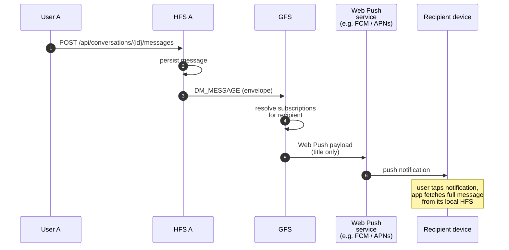
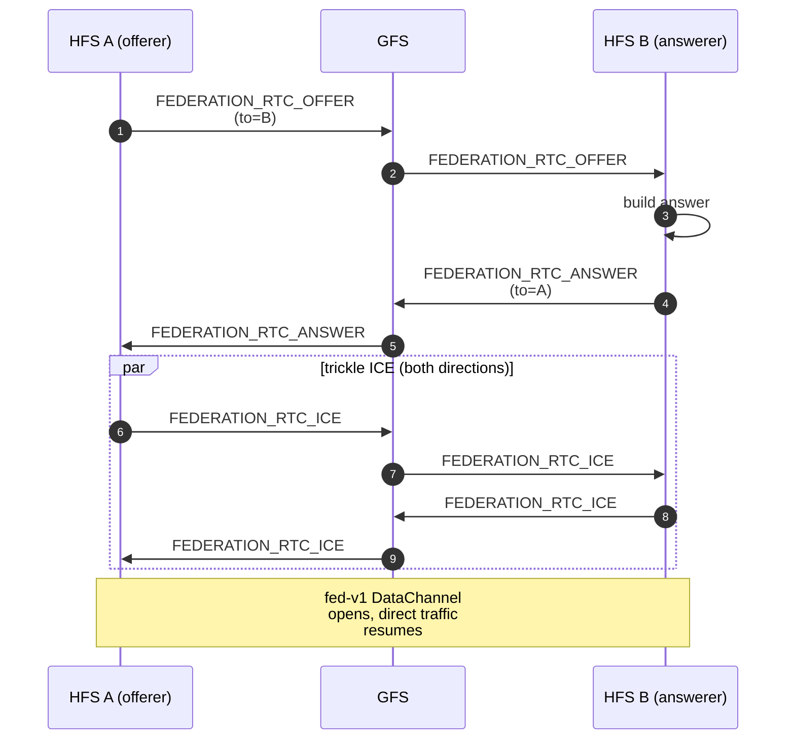

# Push & RTC Signalling Relay

Two GFS-mediated relay services that let an HFS reach a peer when a
direct channel isn't available:

1. **Push fan-out.** Delivers notifications to offline users via the
   Web Push protocol.
2. **RTC signalling relay.** Forwards the SDP offer/answer and ICE
   candidates needed to bootstrap a new WebRTC DataChannel between
   two peered HFS instances.

Both use the same principle: GFS sees the opaque encrypted envelope
and the routing metadata, never the payload.

## Scope

- **HFS**: subscribes to push, queues offline notifications, sends
  RTC signalling envelopes when bootstrapping a new peer connection.
- **GFS**: accepts signed envelopes, fans out Web Push to registered
  subscriptions, and routes RTC envelopes by destination instance id.

## Event types

RTC signalling:
`FEDERATION_RTC_OFFER`, `FEDERATION_RTC_ANSWER`, `FEDERATION_RTC_ICE`.

Push uses the same envelope types as the original content (e.g.
`SPACE_POST_CREATED`, `DM_MESSAGE`) — GFS wraps them in a Web Push
payload containing title + routing fields only. Body text is never
included (§25.3).

## Flow — push to an offline DM recipient

## Flow — RTC DataChannel bootstrap

Before two paired instances have a live DataChannel, the offerer
sends the SDP offer over HTTPS inbox (Tier 2). If that fails — peer
unreachable, NAT blocking UDP — the offer goes through GFS as a
signalling relay.

## Push privacy (§25.3)

The Web Push payload for a DM or a location message carries the
title and sender name, never the body. For other content types —
new space post, new comment, task assigned — the title is
"New post in Family" or similar, with no user-generated content. The
full content is fetched only when the user opens the notification,
which triggers an authenticated request to the user's own HFS.

## Subscription lifecycle

- `GET /api/push/vapid_public_key` — public key for Web Push
  subscription.
- `POST /api/push/subscribe` — device registers, HFS stores the
  subscription + endpoint.
- `POST /api/gfs/connections` — HFS registers with a GFS, declaring
  which subscriptions that GFS is allowed to deliver push to. The
  actual push delivery goes through the HFS's own push service with
  GFS only serving as the federation relay.

## Implementation

- `socialhome/services/push_service.py` — Web Push + subscription
  CRUD.
- `socialhome/global_server/rtc_transport.py` — in-memory RTC
  session store + relay routing.
- `socialhome/federation/strategies.py` — `TransportStrategy`
  protocol that selects inbox / DataChannel / relay.
- `socialhome/global_server/routes/rtc.py` — RTC signalling
  endpoints (`POST /gfs/rtc/offer`, `…/answer`, `…/ice`).
- `socialhome/global_server/federation.py` — inbound relay
  validation.

## Spec references

§24.12.5 (federation-level WebRTC signalling),
§25.3 (push privacy),
§25.8.21 (encryption-first rule, applied to relayed envelopes).
