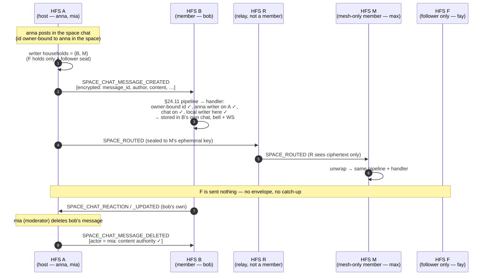

# Space chat

Every space has a chat next to its feed: a running conversation of the
space's **writers** (owner, admins, moderators, members). Each member
household keeps its own copy of it, a *system chat* on group-DM storage
(`conversations.system_scope = 'space'`, one per space). Messages travel
between member households as four `SPACE_CHAT_*` events over the space's
own transport. Federation capability **v_55**
(`FederationCapability.MIN_FOR_SPACE_CHAT`).

## Scope

- **HFS**: full participant. A household holding at least one writer seat
  stores the chat, fans its own users' messages out and applies the other
  households' messages.
- **Followers**: a follower (`SpaceRole.SUBSCRIBER`) neither reads nor
  posts the chat. A household whose people only follow the space is never
  sent a chat event, live or by catch-up. If such a household sends one
  anyway, the §24.11 writer gate drops it, and so does every receiver's
  handler.
- **GFS**: never sees chat content. The chat is never published to a
  GFS (no public relay, no `space_item`, no channel). It crosses a GFS in
  exactly one case: to a link-joined member household
  (`InstanceSource.SPACE_SESSION`), reached only through its relay seat.
  There each event is a sealed per-peer envelope, encrypted under that
  pair's session key exactly like a direct send, which the GFS forwards
  opaquely.
- **Older households** (below v_55): are skipped silently. They are never
  sent a chat event and never get the `chat_messages` catch-up, so their
  users simply see no chat.
- **Local only, never federated:** read receipts, delivery state, typing,
  mute and notification level.

v1 carries **text only**, plus a reply (to a message of the same chat) and
@-mentions. Media, voice notes, locations and highlight replies are
refused locally with `422`; the plan is to add them in a later version.

The space's admins switch the chat on or off with `features.chat`. It is
on by default (migration 0083 `spaces.feature_chat DEFAULT 1`), and the
toggle needs admin level, not owner. While it is off, the chat is hidden,
local writes are refused, inbound chat events are dropped and nothing is
streamed. The stored messages are kept.

## Event types

`SPACE_CHAT_MESSAGE_CREATED`, `SPACE_CHAT_MESSAGE_UPDATED`,
`SPACE_CHAT_MESSAGE_DELETED`, `SPACE_CHAT_REACTION`.

All four are space-content **writes** (`SPACE_WRITE_EVENT_TYPES`), so the
§24.11 follower gate and archive gate apply to them. All four are allowed
from a link-joined household (`SPACE_SESSION_ALLOWED_EVENT_TYPES`).
`SPACE_CHAT_MESSAGE_DELETED` still reaches an archived copy
(`ARCHIVED_ALLOWED_REMOVAL_TYPES`).

### Payloads

The envelope carries only the routing fields in plaintext: `event_type`,
the households and `space_id`. Every field below is inside the encrypted
payload, sealed per peer under the pair's session key, or end to end
under `SPACE_ROUTED` across a relay household. **No conversation id ever
travels**: each household maps `space_id` to its own chat.

| Event | Payload (all encrypted) |
|---|---|
| `SPACE_CHAT_MESSAGE_CREATED` | `space_id`, `message_id`, `author_user_id`, `content`, `reply_to_id` (or `null`), `created_at` |
| `SPACE_CHAT_MESSAGE_UPDATED` | `space_id`, `message_id`, `author_user_id`, `content`, `edited_at` |
| `SPACE_CHAT_MESSAGE_DELETED` | `space_id`, `message_id`, `author_user_id`, `actor_user_id` (the author, or a moderator / admin / owner) |
| `SPACE_CHAT_REACTION` | `space_id`, `message_id`, `user_id`, `emoji`, `action` (`"add"` / `"remove"`) |

Mentions are not a field. Each household resolves @-mentions on the
decrypted text against its own view of the chat's members, as for DMs and
space posts. A space chat keeps no seat rows for members on other
households: that view is its local seats plus the space roster's writers
on other households (`SpaceChatAccess.remote_seats` — never a follower,
a banned or a removed seat). The same roster feeds
`GET /api/conversations/{id}/members`, so the composer offers members of
every household and their messages carry their names.

**In the SPA** the chat is the Feed tab's **Feed | Chat** switch
(`SpaceFeedPage`, `?view=chat` — where chat notifications link), shown
to a member (never a follower) while `features.chat` is on. Owners,
admins and moderators get Delete on anyone's message; everybody on their
own.

**Message ids** are owner-bound (`federation/owner_bound_id.py`, kind
`space-chat-message`). The id commits to `(space_id, author_user_id)`, so
it is valid in this space for this author only. The binding applies from
the first release: a receiver refuses any other id shape, a legacy uuid
included.

## Who may do what

| Write | Rule on every receiving household |
|---|---|
| create | The author holds a live **writer** seat on the sending household (`SpaceAuthorship.may_author_writer`). The space host may also relay a remote writer's message, live or during catch-up (the same host rule as posts). The author is never a local user of the receiver, a follower, a banned user or the bot identity. The id must be owner-bound to that author in that space. A redelivery is a no-op. |
| edit | The author's own household only (`acts_for`, a writer seat). |
| delete | The author (any live seat on the sender), or **content authority**: a moderator, an admin, or the host acting as a named `actor_user_id` (`moderates_as`). Locally, `DELETE /api/conversations/{id}/messages/{mid}` lets the owner, admins and moderators delete anyone's message in their space's chat. |
| reaction | The reactor's own household, with a writer seat. |

Each receiving household also checks its own state before applying a
write. It must hold the space (not dissolved), have `features.chat` on, and
have at least one local writer seat. The message touched by an edit,
delete or reaction must belong to *this space's* chat here.

## Fan-out

`SpaceChatOutbound` follows the conversation bus events for a space
chat. It calls `broadcast_to_space_members` with:

- `only_instances`: the households holding at least one live writer seat
  in this household's roster mirror (`SpaceChatAudience`). A household
  with no live roster row yet (its seat gossip is still on the way) is
  left out, which fails closed; the catch-up fills it in later.
- a version gate per household: `FederationService.space_member_supports(…,
  MIN_FOR_SPACE_CHAT)`. A paired household is judged by its own
  advertisement, a mesh-only member by the version it claimed over the mesh.
  An unknown version fails closed.

Each per-peer send goes through `send_with_mesh_fallback`:

- a directly paired member gets it directly;
- a non-paired member gets it under `SPACE_ROUTED`, sealed to its
  ephemeral X25519 key, so a relay household sees ciphertext only;
- a link-joined member gets it through its `space_session` relay seat.

An event that arrived from another household carries `origin_instance_id`
and is never sent on again.

## Flow

## Catch-up (§25.6)

The `chat_messages` sync resource streams the provider's chat messages
that are not deleted and fall inside the space's retention window (the
whole chat when the space keeps forever; see
[`sync.md`](./sync.md#what-a-sync-streams)), oldest first and page by
page, encrypted under the space content key like every resource
(`ChatMessagesExporter`). No fixed count cuts it. The
provider gates it per requester. A requester must be at v_55 and hold a
writer seat (`SpaceChatAudience.may_receive`). Otherwise it gets no
exporter: a follower-only household gets the chat by catch-up no more than
live.

The receiver runs each record through the live create rule
(`SpaceChatInboundHandlers.apply_sync_records`), with the providing
household as the sender. That rule covers the owner-bound id, the author
being a writer the provider speaks for (or one the host relays), and the
idempotent insert. A record claiming another author's bound id is dropped
before it reaches the handler. Catch-up inserts are quiet: they ring no bell,
resolve no mention and send no WS frame. A chat that a catch-up creates
seats its readers at "now", so a joiner inherits no backlog as unread.

**Deletions converge.** The `chat_messages_deleted` resource streams
**before** the messages. It carries the provider's deletions inside the
same retention window (all of them when the space keeps forever) as
`{id, author_user_id}`, never content
(`ChatMessagesDeletedExporter`), and is gated per requester like the
messages. It is a removal resource, so it still lands in an archived copy.
Each record must be owner-bound to its author in the space. The provider
must also either speak for that author (any seat) or hold content
authority (host, admin or moderator household). If the message is held
here, it is deleted. If it is not, a **tombstone** is recorded: a deleted,
empty row of type `tombstone`, never listed or counted. The tombstone
means no later create or catch-up can bring the id back.

A live `SPACE_CHAT_MESSAGE_DELETED` for an id never held here gets the same
tombstone. That covers a delete that overtook its create, or one sent
while this household was offline and later replayed. The author check
reads the owner-bound id (the payload's `author_user_id`); a moderator
delete is checked with `moderates_as`. A delete is applied while the chat
is off here too, since a removal must reach every copy. So a household
that missed a moderator's delete can no longer keep the message, and as a
provider it never streams it on:

- if the deletion reaches it first, the message is tombstoned there;
- if the message reaches a joiner first, the joiner's own deletions stream
  (or the next one it receives) removes it.

## Retention

The space's `retention_days` also prunes its chat. Expired messages are
soft-deleted (content cleared, row kept) on every household that holds a
chat for the space (`SpaceRetentionScheduler`, via
`AbstractConversationRepo.prune_space_chat_messages`). Like any deleted
message, they also drop out of the search index. This differs from posts,
where only the host prunes, because each household keeps its own copy of
the chat.

## Residual: in-flight writes after a demotion

A member's seat is checked when an event arrives. A message sent just
before that member was demoted to follower, or banned, can still land on a
household where the roster change has not arrived yet. This is the same
window every space write has; the roster gossip closes it.

## Version gate

| Peer | Behaviour |
|---|---|
| ≥ v_55 writer household | live events + `chat_messages` catch-up |
| < v_55 | skipped silently (no fallback; its users see no chat) |
| follower-only household | never sent anything |

## Implementation pointers

- `socialhome/services/system_chat_policy.py`: `SpaceChatAccess`, which
  decides read and write live.
- `socialhome/services/space_chat_service.py`: the chat's lifecycle, the
  seat reconciler and `GET /api/spaces/{id}/chat`.
- `socialhome/services/space_chat_outbound.py`: `SpaceChatOutbound` and
  `SpaceChatAudience`.
- `socialhome/services/federation_inbound/space_chat.py`: the four inbound
  handlers and `apply_sync_records`.
- `socialhome/federation/space_authorship.py`: `may_author_writer`.
- `socialhome/federation/sync/space/exporters/chat_messages.py`: the
  catch-up exporter.
- `socialhome/services/dm_service.py`: text-only, owner-bound id and
  moderator delete for a space chat.

## Spec references

- §24.11 inbound pipeline (writer gate, archive gate, authorship)
- §25.6 space catch-up sync
- CLAUDE.md "Encryption-First Rule" and "non-member households MUST NOT see
  space content"
- Tests: `tests/protocol/test_space_chat_federation.py` (four-household
  round trip, follower-only and older household get nothing, plaintext
  tripwire), plus the space-content scope, authorship and archived
  matrices (`tests/protocol/test_space_content_{scope,authorship}.py`,
  `test_space_archived_inbound.py`)
