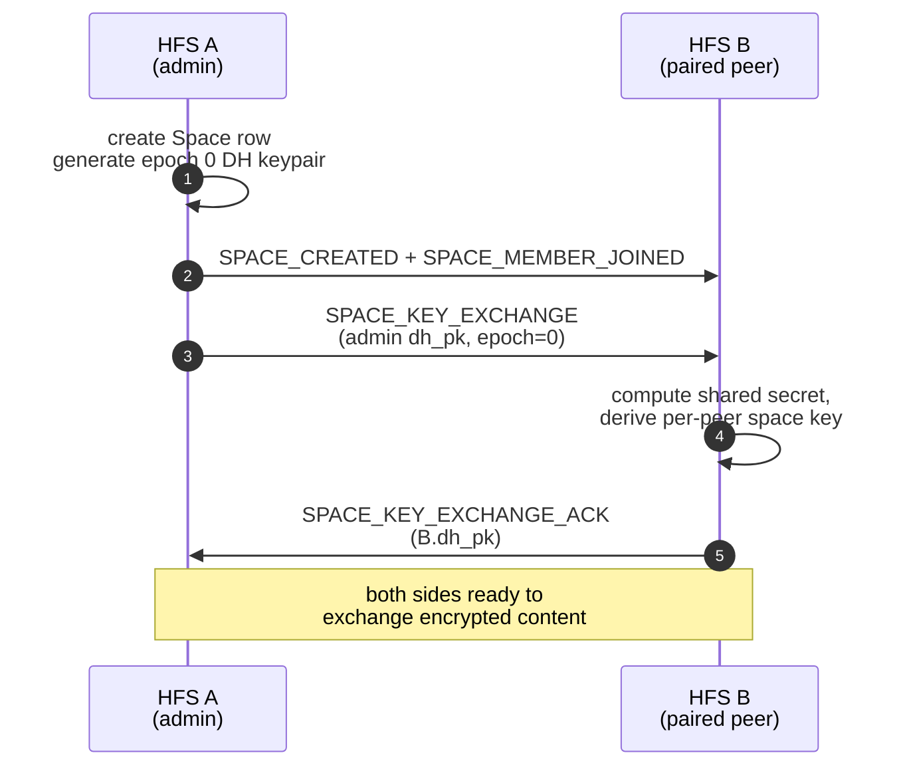
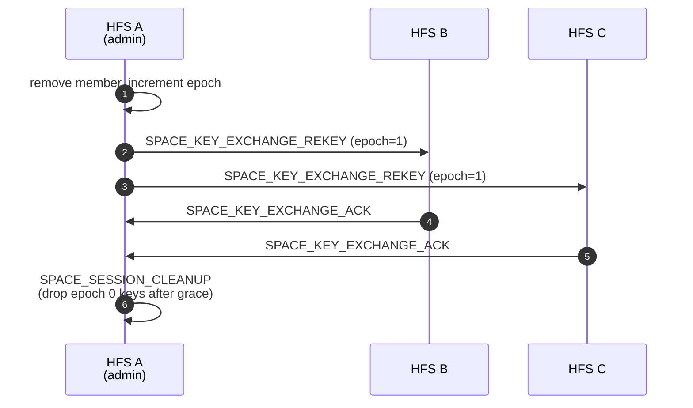

# Spaces

Spaces are the unit of content federation. A space is a group context
— family, neighbourhood, community — with its own membership, its
own encryption epoch, and its own content feed. Each space's membership
may span any number of paired HFS instances.

## Scope

- **HFS**: creates, dissolves, and mutates spaces; broadcasts
  membership and configuration events; runs per-space key exchange.
- **GFS**: only sees public spaces that are explicitly advertised
  (`PUBLIC_SPACE_ADVERTISE`). Private spaces are invisible to GFS.

## Event types

**Lifecycle / membership**

`SPACE_CREATED`, `SPACE_DISSOLVED`, `SPACE_CONFIG_CHANGED`,
`SPACE_MEMBER_JOINED`, `SPACE_MEMBER_LEFT`, `SPACE_MEMBER_BANNED`,
`SPACE_MEMBER_UNBANNED`, `SPACE_INSTANCE_LEFT`, `SPACE_AGE_GATE_UPDATED`.

**Key exchange**

`SPACE_KEY_EXCHANGE`, `SPACE_KEY_EXCHANGE_ACK`,
`SPACE_KEY_EXCHANGE_REKEY`, `SPACE_ADMIN_KEY_SHARE`,
`SPACE_SESSION_CLEANUP`.

## Flow — create + join

## Flow — rekey

Triggered when a member leaves or is banned. The admin generates a new
epoch and re-shares with every remaining member.

## Admin key share

`SPACE_ADMIN_KEY_SHARE` lets two admins hand each other the space's
current key material — used when ownership is transferred or a
co-admin is added so the new admin can decrypt pre-existing content
without a full resync.

## Age gate

`SPACE_AGE_GATE_UPDATED` propagates changes to a space's minimum-age
requirement (§child-protection). Members below the threshold on any
federated HFS are removed; the event carries the new threshold and a
reason code.

## Implementation

- `socialhome/services/space_service.py` — creation, membership
  mutations, permission guards.
- `socialhome/federation/sync/space/` — space-level sync machinery
  (shared with [sync.md](./sync.md)).
- `socialhome/services/federation_inbound/space_membership.py` —
  inbound handlers for `SPACE_CREATED`, `SPACE_MEMBER_JOINED`, etc.
- `socialhome/repositories/space_repo.py`,
  `space_remote_member_repo.py` — persistence.
- `socialhome/routes/space_routes.py` — REST endpoints
  (`/api/spaces/*`).

## Spec references

§13 (Federation: Spaces), §25.8.19 (STRUCTURAL_EVENTS retention),
§25.8.20 (per-space key derivation).
