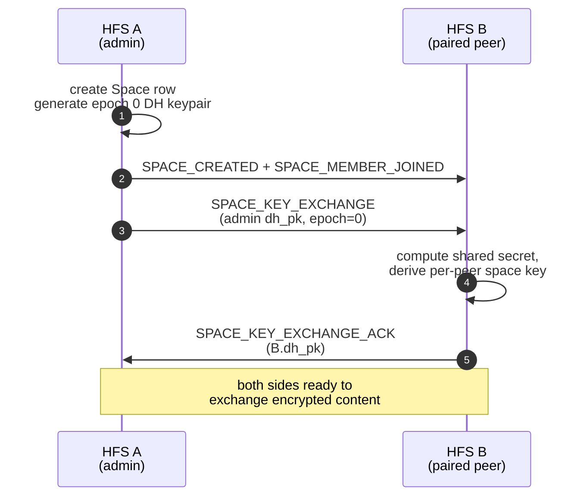
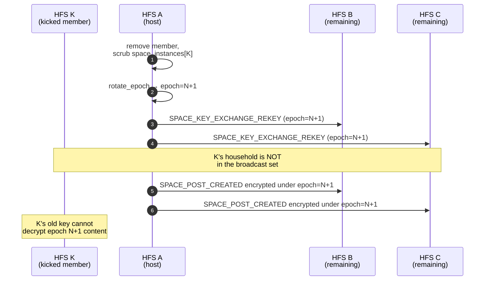
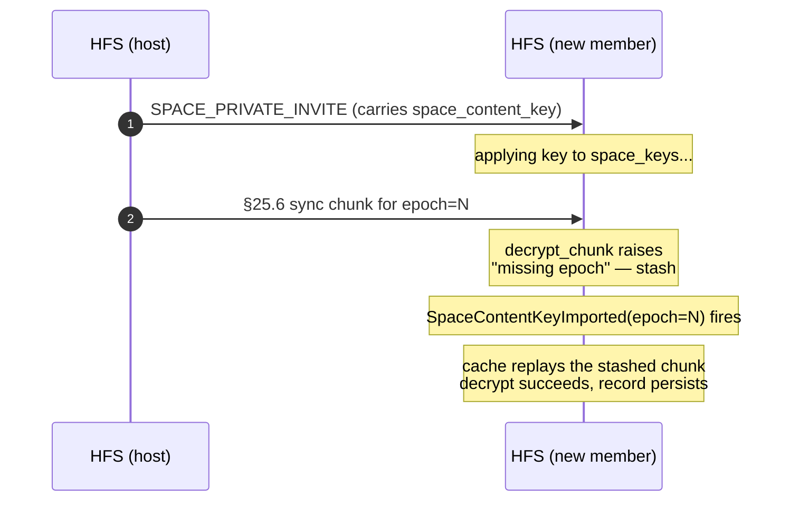
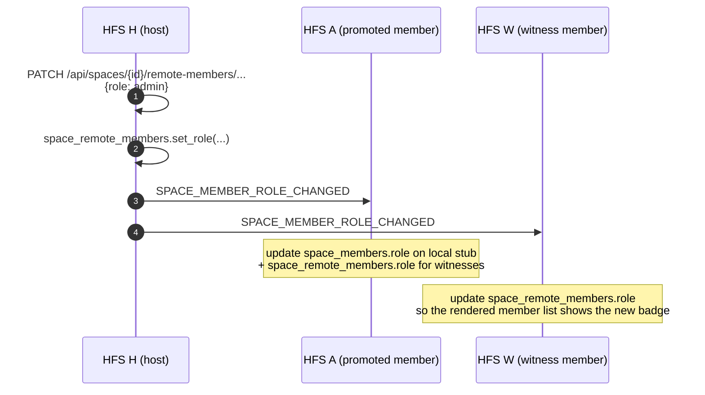
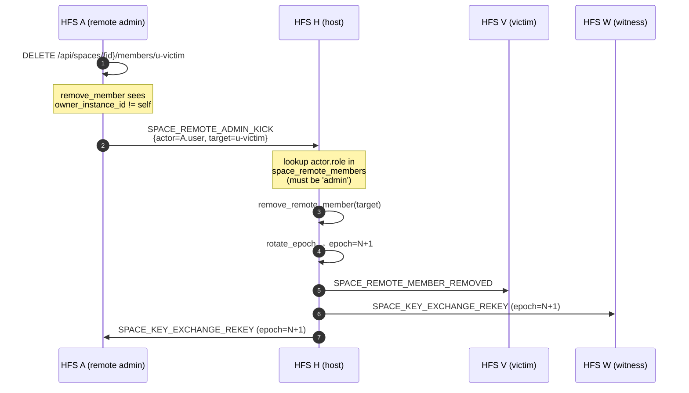
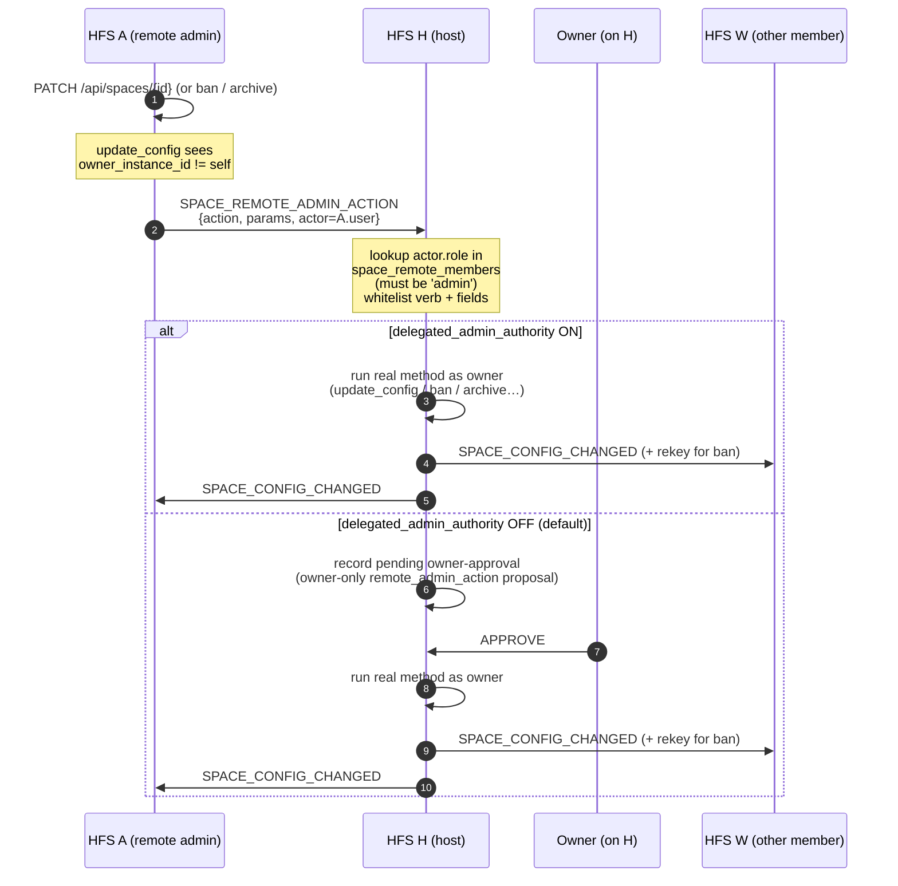
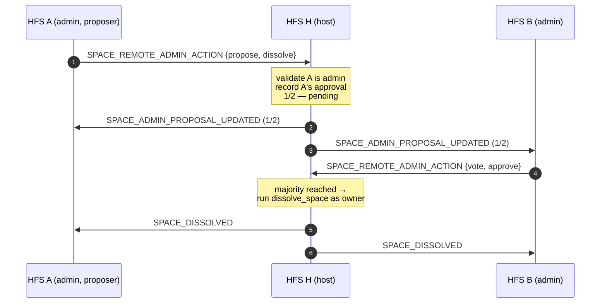
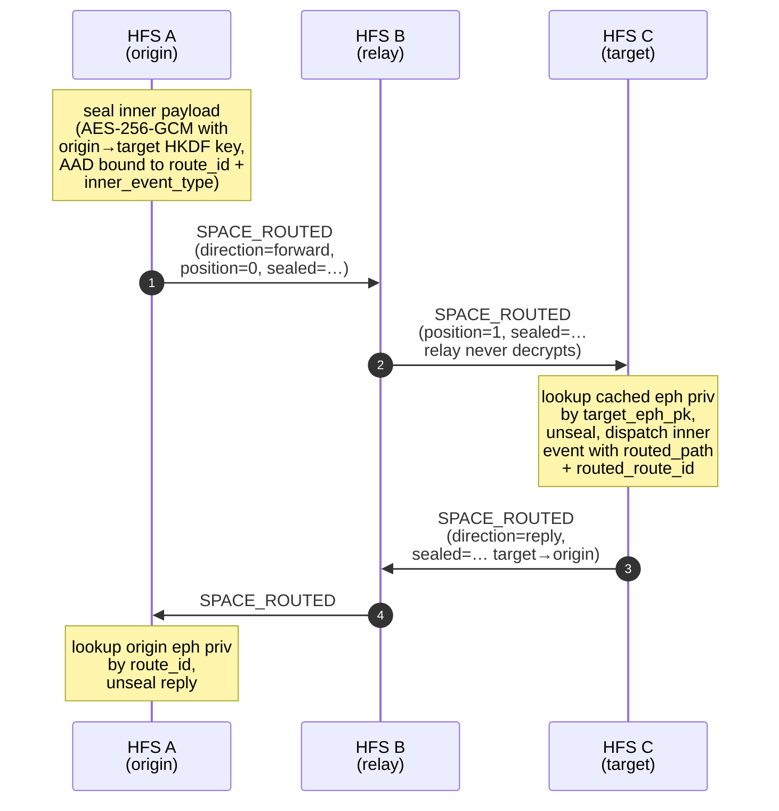

# Spaces

Spaces are the unit of content federation. A space is a group context
— family, neighbourhood, community — with its own membership, its
own encryption epoch, and its own content feed. Each space's membership
may span any number of paired HFS instances.

## Scope

- **HFS**: creates, dissolves, and mutates spaces; broadcasts
  membership and configuration events; runs per-space key exchange.
- **GFS**: only sees public spaces that are explicitly advertised
  (`PUBLIC_SPACE_ADVERTISE`). Private spaces are invisible to GFS.

## Event types

**Lifecycle / membership**

`SPACE_CREATED`, `SPACE_DISSOLVED`, `SPACE_CONFIG_CHANGED`,
`SPACE_MEMBER_JOINED`, `SPACE_MEMBER_LEFT`, `SPACE_MEMBER_BANNED`,
`SPACE_MEMBER_UNBANNED`, `SPACE_INSTANCE_LEFT`, `SPACE_AGE_GATE_UPDATED`.

From v_23, `SPACE_MEMBER_JOINED` / `SPACE_MEMBER_LEFT` are the
**peer-replicated, space-authority-signed roster gossip** — the host emits
them on every roster mutation and broadcasts to every member household so
each household's roster converges (not just the host's). See "Roster gossip"
below.

From v_24, `SPACE_CONFIG_CHANGED` is itself **space-authority-signed**: the
emitter (owner host OR a seed-holding delegated admin) signs the config
`space_meta` with the space's Ed25519 seed, and the receiver
(`_on_space_config_changed`) accepts the edit by verifying the signature
against `spaces.identity_public_key` — **the trust root is the authority
signature, not `from_instance == owner`**. This lets a delegated admin change
a space's config (name / description / emoji / features / join-mode /
retention / about) while the owner is offline; every member household,
including the offline owner on reconnect, accepts it. A present-but-invalid
signature is dropped (fail-closed); a non-owner edit with no signature is
dropped (legacy behaviour); an owner edit with no signature still applies via
the legacy `from_instance == owner` path. Concurrent same-`config_sequence`
edits from two admins converge by a deterministic
`(config_sequence, config_hlc, config_author_instance)` last-writer-wins
tie-break: at an equal sequence the LATER concurrent edit wins by Hybrid
Logical Clock (`spaces.config_hlc`, a physical-ms + logical counter that is
monotonic per node and causally consistent across nodes), with
`config_author_instance` as the final deterministic tiebreak. A legacy /
older sender ships `HLC(0,0)` so the HLC ties and the order reduces exactly
to the old `(config_sequence, author)` key (back-compat). An inbound edge
whose `config_hlc` physical time outruns the event's own §24.11-checked
envelope timestamp by more than the 300 s drift bound is dropped
(clock-abuse guard, keyed off the signed envelope ts so the drop is
deterministic across receivers). Toggling
`delegated_admin_authority` itself stays **owner-only**. See "Authority
signing" below.

**Key exchange**

`SPACE_KEY_EXCHANGE`, `SPACE_KEY_EXCHANGE_ACK`,
`SPACE_KEY_EXCHANGE_REKEY`, `SPACE_ADMIN_KEY_SHARE`,
`SPACE_SESSION_CLEANUP`.

**Cross-household admin**

`SPACE_MEMBER_ROLE_CHANGED` (v_8+), `SPACE_REMOTE_ADMIN_KICK` (v_9+),
`SPACE_REMOTE_ADMIN_ACTION` (v_15+), `SPACE_ADMIN_PROPOSAL_UPDATED`
(v_16+). Role propagation + remote admins running mutations on a space
hosted elsewhere + multi-admin approval of critical actions. See
"Cross-household admin promotion / kick / actions" and "Multi-admin
approval" below.

**Mesh routing (v_6+)**

`SPACE_ROUTED`, `SPACE_FIND_ROUTE`, `SPACE_ROUTE_FOUND`,
`SPACE_ROUTE_STALE` (v_28+). Generic source-routed envelope, the
discovery probe that finds the path, and the signed nack a restarted
target sends back so the origin re-discovers instead of waiting out its
route cache. See "Mesh routing (SPACE_ROUTED)" below.

**Space sync**

`SPACE_SYNC_BEGIN`, `SPACE_SYNC_OFFER`, `SPACE_SYNC_ANSWER`,
`SPACE_SYNC_ICE`, `SPACE_SYNC_CHUNK` (v_13+), `SPACE_SYNC_COMPLETE`,
`SPACE_SYNC_REJECTED` (v_20+), … — the reconnect content-sync handshake.
`SPACE_SYNC_REJECTED` is the membership backstop covered under "Dissolution"
below; the rest are the WebRTC/HTTPS content-streaming dance.

**GFS public-content relay (Phase 5)**

`SPACE_SUBSCRIBER_KEY_HANDOFF` (`space_subscriber_key_handoff`). These ride the
**content-blind GFS relay** (not a direct peer event), authorized by the
space-authority signature rather than `proto_version`, so they carry **no
`OURS` bump** — a non-subscriber simply never receives the frame.
`space_post_public` relays a public/global post (encrypted under the space
content key); `space_subscriber_key_handoff` (Phase 5b-b) delivers that content
key to a new GFS subscriber, **sealed** to the subscriber's published X25519
key-wrap pubkey (binding verified end-to-end before sealing — anti-GFS-
substitution) so the GFS never learns the key. The receiver re-verifies the
authority signature against its locally-pinned `spaces.identity_public_key`,
unseals with its key-wrap private key, and imports the key. Full flow:
[discovery.md](./discovery.md#subscriber-content-key-handoff-phase-5b-b).

## Flow — create + join


```mermaid
sequenceDiagram
    autonumber
    participant A as HFS A<br/>(admin)
    participant B as HFS B<br/>(paired peer)
    A->>A: create Space row<br/>generate epoch 0 DH keypair
    A->>B: SPACE_CREATED + SPACE_MEMBER_JOINED
    A->>B: SPACE_KEY_EXCHANGE<br/>(admin dh_pk, epoch=0)
    B->>B: compute shared secret,<br/>derive per-peer space key
    B->>A: SPACE_KEY_EXCHANGE_ACK<br/>(B.dh_pk)
    Note over A,B: both sides ready to<br/>exchange encrypted content
```

## Dissolution (host hard-deletes; members keep a read-only archive)

Dissolving a space is asymmetric: a **permanent removal** on the owner
host, but on every member household the local copy is **archived
read-only** rather than purged. A member's space is *their own local
copy* of shared content — silently deleting it when the owner ends the
space loses everything they had, so members instead keep a frozen,
clearly-labelled archive they choose when to remove.

1. **Host** (`SpaceService.dissolve_space`, owner-only): unpublish from
   any paired GFS; publish `SpaceConfigChanged(DISSOLVED)`, which (a)
   fans a `space.config.changed` WS frame to local tabs and (b) makes
   `SpaceConfigOutbound` broadcast `SPACE_DISSOLVED` (`{space_id}`) to
   every member household via `broadcast_to_space_members`. These run
   while the rows still exist (the broadcast + WS fan-out resolve
   recipients from the membership rows about to be deleted).
2. **Host purge**: `DELETE FROM spaces WHERE id=?`. Every space-scoped
   child table is `REFERENCES spaces(id) ON DELETE CASCADE` and the
   connection runs `PRAGMA foreign_keys=ON`, so the full content graph —
   posts, comments, members, gallery albums/items, calendar, pages,
   tasks, stickies, content keys, the media-outbox rows, location pins —
   drops in one statement. Media **files** (no FK) are collected before
   the delete and unlinked after (`services/space_purge.py`).
3. **Member** (inbound `SPACE_DISSOLVED` → `_on_dissolved`): verifies the
   event came from the space's `owner_instance_id` (drops it otherwise —
   a non-owner can't dissolve someone else's space), then **archives**
   its local copy read-only via `set_archived(space_id, True,
   reason="dissolved")` and publishes `RemoteSpaceDissolved`. The local
   content is kept; the space becomes read-only (`_require_writable_space`)
   and cannot be unarchived from the member side (`unarchive_space` refuses
   any space with an `archived_reason` set). `NotificationService` raises a
   one-time `space_dissolved` notification per local member
   (deduped by link). No purge, no media unlink on the member side.

`SPACE_DISSOLVED` carries only `{space_id}` and is in the outbox
`NEVER_DROP` set, so an offline member still receives it and archives its
copy once it reconnects. (`SPACE_CONFIG_CHANGED` is deliberately **not**
used for dissolve. It is also ignored once a space is in a terminal state:
`_on_space_config_changed` returns early when `archived_reason` is set, so
a late or replayed config snapshot can't revive a dissolved archive.)

### Reconnect backstop — `SPACE_SYNC_REJECTED` (v_20+)

`NEVER_DROP` makes the `SPACE_DISSOLVED` re-delivery best-effort, not
guaranteed: an outbox row can be pruned, or a member can be *removed* from a
space (a separate flow) while offline and never learn it. Either way the
member reconnects still believing it's a member, and its sync scheduler sends
`SPACE_SYNC_BEGIN` for the space. The host used to **silently drop** that
request when the requester wasn't a member (S-1), leaving an orphaned
read-write stub forever.

The backstop closes that gap. On a `SPACE_SYNC_BEGIN` from a non-member, the
host (`SyncSessionManager.begin_session` → `_handle_space_sync_begin`) replies
with a signed `SPACE_SYNC_REJECTED {sync_id, space_id, reason}` instead of
dropping it:

- `reason="dissolved"` — the `spaces` row is gone on the host (a dissolve
  purged it; a never-existed space collapses into this case too, so a
  dissolved space is indistinguishable from one that never existed).
- `reason="removed"` — the space still exists on the host but the requester
  is no longer in `space_instances`.

The `dissolved`/`removed` split is an existence signal: a peer that asks
about an *existing* space it isn't a member of learns the space exists
(`removed`) rather than getting silence. That signal is gated behind a
**confirmed, Ed25519-authenticated** peer, an **unguessable** `space_id`
(`uuid4().hex`, 122-bit) the peer must already hold, and the **5/h
per-peer+space rate limit** — so it can't be used to enumerate or
amplify-probe. Accepted as a deliberate, bounded relaxation of the S-1
silent drop in exchange for reconciling orphaned member stubs.

The member's `_on_sync_rejected` handler (sibling of `_on_dissolved`) applies
the **same** archive-not-delete treatment: it verifies the event came from the
space's `owner_instance_id` (a non-owner can't terminate your copy), checks the
reason is a known terminal value, and — if the copy isn't already terminally
archived — calls `set_archived(space_id, True, reason=reason)` and publishes
`RemoteSpaceDissolved`. The notification copy is reason-aware (`removed` →
"you're no longer a member"). An *admin*-archived copy (`archived_reason`
NULL) is still upgradable to a terminal reason here.

Guards: the request is rate-limited (S-6, 5/h per peer+space) **before** the
membership check, so the reply can't be used to amplify probes; the reply
target and `space_id` are bound to the Ed25519-verified envelope; and the send
is gated on `peer_supports(min_version=MIN_FOR_SPACE_SYNC_REJECTED)`.
**Best-effort backstop** — a sub-v_20 host keeps the silent drop, so a sub-v_20
member still relies on the normal `SPACE_DISSOLVED` broadcast/outbox.

## Archive (soft, reversible, federated read-only)

Distinct from dissolution: archiving **hides + freezes** a space without
deleting anything, and is reversible.

- `SpaceService.archive_space` / `unarchive_space` (owner / admin) set the
  `spaces.archived` flag and publish `SpaceConfigChanged` (`archived` /
  `unarchived`). Unlike dissolve, this rides the **normal**
  `SPACE_CONFIG_CHANGED` + `space_meta` path — `archived` is a `space_meta`
  field, so member households apply it through the same
  `stub_space_from_metadata` refresh used for any config edit. **No new
  event type or capability bump.**
- While archived the space stays **readable** but is **read-only**:
  `SpaceService._require_writable_space` rejects content writes (post /
  comment / edit / react) with a 403 on host *and* member, and it drops
  out of active space lists. Unarchiving ships `archived=false` and
  restores read-write everywhere.
- `archived` is independent of `dissolved`: `dissolved` means *gone*
  (`_require_space` 404s it), `archived` means *read-only-visible*.
- `archived_reason` (`NULL` | `'dissolved'` | `'removed'`) distinguishes a
  reversible admin archive (`NULL` — Unarchive available) from a
  remote-termination archive a member can't undo (`'dissolved'` when the
  owner dissolved the space; `'removed'` when the member was dropped from a
  still-existing space — set by the `SPACE_SYNC_REJECTED` backstop above).
  When set, `unarchive_space` refuses and the SPA shows a reason-aware
  "read-only archive" banner with no Unarchive control. The host never sets
  `archived_reason` on its own space (it purges); only member copies carry
  it, and it is never re-federated.

## Post-type allow-list (per-space feed composer gating)

A space admin chooses which post kinds members may compose in the feed
(`SpaceSettings` → "Post types"). The set lives on `SpaceFeatures.allowed_post_types`
(persisted as the `spaces.allow_post_*` columns) and is enforced on every
instance independently: `SpaceService.create_post` rejects a disallowed
type with `SpacePermissionError` (403), and the SPA composer hides the
disabled type buttons so members don't hit that wall.

- **Federation:** the set rides the **normal** `SPACE_CONFIG_CHANGED` +
  `space_meta` path — `allowed_post_types` is a `space_meta.features` field,
  applied by member households through the same `stub_space_from_metadata`
  refresh used for any config edit. This is what makes a member household
  enforce the host's restriction when *its* users compose (each instance
  gates `create_post` against its own stub).
- **Backward-compatible:** an older sender that omits the field → the
  receiver defaults to **all types allowed** (the historical behaviour).
  **No new event type or capability bump** — additive and fail-soft.

## Bazaar tab + opt-in feed announcement

The Bazaar is a first-class space tab (gated on `SpaceFeatures.bazaar`,
defaulting on, federated in `space_meta.features.bazaar`). Listings are
space-scoped (`bazaar_listings.space_id`) and browsed per-space via
`GET /api/spaces/{id}/bazaar`.

A listing is anchored to a `PostType.BAZAAR` wrapper post (the listing's
id, comment thread, and media host). Whether that post shows in the feed
is opt-in:

- `BazaarService.create_listing(announce_in_feed=False)` (the default)
  creates the wrapper with `space_posts.hidden_from_feed = 1`. The post is
  excluded from `list_feed` so the listing lives only in the Bazaar tab.
- `announce_in_feed=True` clears the flag → the listing's card also shows
  in the feed (the historical behaviour).
- **Federation:** `hidden_from_feed` rides the `SPACE_POST_CREATED`
  payload so member households mirror the same feed visibility. Absent on
  an older sender → the receiver defaults to **visible**. Additive +
  fail-soft — **no new event type or capability bump**.

## Flow — rekey

Triggered on every member-removal path (#121, PR #432): local kick,
ban, and §D1b cross-household kick. The host rotates the space's epoch
via `SpaceContentEncryption.rotate_epoch`, exports the new 32-byte
AES-256 key, and fires `SPACE_KEY_EXCHANGE_REKEY` to every remaining
member household via `broadcast_to_space_members`. The §D1b
audit-fix on `remove_remote_member` strips the kicked household's
`space_instances` row before the broadcast set is computed, so the
former member's household naturally never receives the new key.
Receivers persist via the same
`apply_space_content_key_from_metadata` helper the §D1b accept path
uses (re-wraps under local KEK so the at-rest invariant holds).

**Receiver authenticates the rotator before importing (security gate).**
A rekey *pins* the current epoch onto whatever key it carries (the
smallest-`rotated_by` collision rule below), so importing one from any
confirmed peer would let a routing relay or a removed-but-still-meshed
ex-member force every member household onto an attacker-chosen key — a
persistent content-key hijack + DoS. The inner `space_content_key` meta is
therefore **space-authority-signed**, exactly like `SPACE_CONFIG_CHANGED`
(Phase 4a): the rotator signs it with the space's Ed25519 seed
(`authority_sig` / `authority_sig_suite`), and the receiver accepts the
rekey only if **(a)** the §24.11-authenticated `from_instance` is the
space's `owner_instance_id` (owner back-compat — pre-authority owners emit
an unsigned rekey) **OR (b)** a valid `authority_sig` verifies against
`spaces.identity_public_key`. The trust root is the *signature*, not the
sender, so a delegated admin (seed-holder) can rotate while the owner is
offline. Fail-closed: a present-but-invalid / wrong-key / unknown-suite
signature DROPS (never falls through to the owner gate); a non-owner rekey
with no signature DROPS; and an authority-signed rekey with a blank
`rotated_by` DROPS (defence-in-depth — a legit rotator always stamps its
real instance id, so the smallest-wins tiebreak only ever compares
authenticated non-empty ids). The gate is scoped to the rekey handler
(`_on_key_exchange_rekey`); the §D1b *initial* key handoff in the invite
snapshot is authenticated by the invite flow and is unaffected.

The flow is fire-and-forget — no separate ACK event. If a peer misses
the broadcast (transport blip, household offline), the §25.6 direct-
space-sync handshake refreshes the key on the next sync cycle. Old
epoch keys stay on disk so historical content remains decryptable for
legitimate readers; only future content under the new epoch is gated.

Forward-secrecy bound: at the *transport* level — the kicked
household never receives the new key — and at the *at-rest* level on
the kicked household itself, because removing the member also drops
the local `space_members` row that gated their read access. A
malicious user with raw DB access still has the old keys (single KEK
per household), which is the documented at-rest threat model.

**Delegated admin + concurrent rotation (Phase 4b).** With
`delegated_admin_authority` ON, a seed-holding delegated admin can
ban/remove a member while the owner is offline: it tombstones the member
locally (the `SPACE_MEMBER_LEFT` roster gossip is space-authority-signed,
so every household — including the owner on reconnect — accepts it by
verifying the signature, not `from_instance`) and runs the same
`rotate_epoch` + `SPACE_KEY_EXCHANGE_REKEY` forward-secret rotation
instead of forwarding to the host. Two admins can therefore each mint
epoch N+1 with a *different* random key concurrently. To converge, every
`SPACE_KEY_EXCHANGE_REKEY` carries `rotated_by` (the minting household's
id), and `import_key` keeps the row whose `rotated_by` sorts
lexicographically **smallest** at an existing `(space_id, epoch)` — so
every receiver lands on the same key regardless of arrival order. A
NULL/absent `rotated_by` (pre-Phase-4b peer) never clobbers a stamped
row; both NULL degrades to last-writer-wins. The acting household's local
removal drops the member from `space_members` *before* rotation, so the
forward-secrecy ordering holds on the delegated path too. (Delegation
OFF / no seed → the old v_15 forward-to-host path; the host owns
rotation.) `rotated_by` and the authority signature fields
(`authority_sig` / `authority_sig_suite`) are additive optional fields on
an existing event — an older peer ignores them and imports via the owner
back-compat path — so no capability bump is required.


```mermaid
sequenceDiagram
    autonumber
    participant K as HFS K<br/>(kicked member)
    participant A as HFS A<br/>(host)
    participant B as HFS B<br/>(remaining)
    participant C as HFS C<br/>(remaining)
    A->>A: remove member,<br/>scrub space_instances[K]
    A->>A: rotate_epoch → epoch=N+1
    A->>B: SPACE_KEY_EXCHANGE_REKEY (epoch=N+1)
    A->>C: SPACE_KEY_EXCHANGE_REKEY (epoch=N+1)
    Note over K,C: K's household is NOT<br/>in the broadcast set
    A->>B: SPACE_POST_CREATED encrypted under epoch=N+1
    A->>C: SPACE_POST_CREATED encrypted under epoch=N+1
    Note over K: K's old key cannot<br/>decrypt epoch N+1 content
```

## Out-of-order key arrival

`PendingDecryptsCache` (#122, PR #433) handles the race where a
federation payload that needs the space content key lands before the
key has been imported. The classic case is §25.6 sync chunks arriving
during a §D1b accept handshake — the host starts shipping content
immediately after the invite envelope is accepted, but the receiver's
`apply_space_content_key_from_metadata` may not yet have committed
the new `space_keys` row.


```mermaid
sequenceDiagram
    autonumber
    participant H as HFS (host)
    participant N as HFS (new member)
    H->>N: SPACE_PRIVATE_INVITE (carries space_content_key)
    Note over N: applying key to space_keys...
    H->>N: §25.6 sync chunk for epoch=N
    Note over N: decrypt_chunk raises<br/>"missing epoch" — stash
    Note over N: SpaceContentKeyImported(epoch=N) fires
    Note over N: cache replays the stashed chunk<br/>decrypt succeeds, record persists
```

The cache is process-local and bounded (`DEFAULT_MAX_ENTRIES = 256`).
Restart wipes everything — the §25.6 sync handshake on the next
reconnect re-pulls anything that hadn't drained. Decrypt failures
that are NOT "missing epoch" (tampered ciphertext, wrong AAD,
malformed wire) drop as before — those are not race-recoverable and
stashing them would mask a real attack.

## Admin key share

`SPACE_ADMIN_KEY_SHARE` lets two admins hand each other the space's
current key material — used when ownership is transferred or a
co-admin is added so the new admin can decrypt pre-existing content
without a full resync.

## Roster gossip (v_23+)

The space roster is **peer-replicated** so every member household converges
its view, not just the host. On every roster mutation the host emits an
**authority-signed** `SPACE_MEMBER_JOINED` (seat / role upsert) or
`SPACE_MEMBER_LEFT` (remove / kick / ban) and broadcasts it to every member
household via `broadcast_to_space_members` (targets `space_instances` — the
non-member-relay rule holds; **never** `broadcast_to_all`). Before v_23 a
join/leave was host-only and other households learned implicitly via §25.6
sync or a fresh invite.

Trust is in the **signature, not the sender**. The payload carries
`authority_sig` + `authority_sig_suite` produced with the space's Ed25519
seed (`sign_authority_event`); a receiver verifies against the space's PUBLIC
key (`spaces.identity_public_key`) regardless of which household relayed it
(any seed-holder may emit — the owner today, delegated admins in later
phases). The signature is computed over the payload with the two signature
fields stripped via `strip_authority_sig_fields` — used identically on both
sides so the canonical bytes match.

Payload:
`{space_id, user_id, instance_id, display_name, user_pk, role,
member_version, roster_version, authority_sig, authority_sig_suite}`.
`member_version` (monotonic per `(space_id, user_id)`) and `roster_version`
are both sourced from the space's dedicated atomic `roster_sequence`
(migration 0036), decoupled from `config_sequence` so a role / ban / roster
mutation no longer bumps the config-LWW version (and a delegated admin's
offline config edit can't lag behind the owner at an equal sequence).
`roster_sequence` is backfilled from `config_sequence` once for continuity.
The receiver's
version-guarded CRDT merge (`apply_member_event`) converges regardless of
delivery order: a strictly-greater version wins, removal wins an
equal-version tie, and a stale/replayed event is dropped (a removed member is
never resurrected). The §D1b invite snapshot ships `member_version` per
roster entry + a `roster_version` so a freshly-invited joiner starts
already-converged. Gated per recipient on
`FederationCapability.MIN_FOR_SPACE_ROSTER_GOSSIP`; a sub-v_23 household is
skipped silently and keeps learning the roster via the snapshot / sync path.

A receiver DROPS the event (logged at WARNING) when the space is unknown
locally, the signature is absent / forged / signed by a key other than the
space seed, or the suite is unknown (crypto-suite rule — no default fallback).

```mermaid
sequenceDiagram
    autonumber
    participant H as HFS H (host / seed-holder)
    participant A as HFS A (member)
    participant W as HFS W (member)
    H->>H: roster mutation<br/>(add / remove / role / ban)
    H->>H: sign payload with space Ed25519 seed<br/>(member_version = roster_sequence)
    H->>A: SPACE_MEMBER_JOINED / _LEFT<br/>(authority_sig over the bare payload)
    H->>W: SPACE_MEMBER_JOINED / _LEFT
    Note over A,W: verify authority_sig against<br/>spaces.identity_public_key (NOT from_instance)
    Note over A,W: apply_member_event — version-guarded merge<br/>(removal-wins-tie; stale dropped)
```

## Cross-household admin promotion

`SPACE_MEMBER_ROLE_CHANGED` (#114, PR #434, v_8+) propagates a role
change for a remote member to every member household. The host emits
this on every `PATCH /api/spaces/{id}/remote-members/{instance}/{user}`
that flips between `'member'` and `'admin'`. Owner is intentionally
not assignable to a remote member — ownership carries local-only
privileges (dissolve, ownership transfer) that can't sensibly cross
households.


```mermaid
sequenceDiagram
    autonumber
    participant H as HFS H (host)
    participant A as HFS A (promoted member)
    participant W as HFS W (witness member)
    H->>H: PATCH /api/spaces/{id}/remote-members/...<br/>{role: admin}
    H->>H: space_remote_members.set_role(...)
    H->>A: SPACE_MEMBER_ROLE_CHANGED
    H->>W: SPACE_MEMBER_ROLE_CHANGED
    Note over A: update space_members.role on local stub<br/>+ space_remote_members.role for witnesses
    Note over W: update space_remote_members.role<br/>so the rendered member list shows the new badge
```

The role assignment is the foundation. The actual cross-household
admin *action* (kick) rides `SPACE_REMOTE_ADMIN_KICK` documented
below.

### Delegated-admin signing-seed share (`SPACE_ADMIN_KEY_SHARE`, v_22+)

A space's authority events are signed with the space's Ed25519 seed
(the private half of `identity_public_key`), which normally lives only
on the owner household. When the owner opts into
`SpaceFeatures.delegated_admin_authority`, `SPACE_ADMIN_KEY_SHARE`
hands that seed to a **remote admin** household so it can sign
space-authority events with the owner offline.

The owner sends on two edges: promoting a remote member to ADMIN
(`set_remote_member_role`), and flipping the flag False→True
(`update_config` distributes to every current remote admin household,
deduped by instance via `space_remote_members.role == 'admin'`). The
payload is `{space_id, space_seed: b64url(32-byte seed),
seed_suite: "ed25519-seed"}` and it travels **only** over the
encrypted peer-pair path (`send_with_mesh_fallback`) addressed to that
one household — **never broadcast**, because a non-member relay must
never see the signing key.

The receiver **fails closed**: it stores the seed only when the
§24.11-verified `from_instance` is the space's `owner_instance_id`,
its *own* local copy of the space has `delegated_admin_authority` ON,
the `seed_suite` is recognised (`SUPPORTED_SEED_SUITES`, no default
fallback), and the seed b64url-decodes to exactly 32 bytes. Anything
else is dropped (logged) and nothing is stored. Receipt is logged at
INFO as the key-blast-radius audit event. Turning the flag back off
does **not** revoke already-shared seeds — deeper revocation (seed
rotation) is a later phase.

Gated on `FederationCapability.MIN_FOR_SPACE_ADMIN_KEY_SHARE`: against
a sub-v_22 admin household (no handler) the owner SKIPS the send and
logs at WARNING rather than blasting a private key at a peer that
would drop it. There is no safe degraded path for distributing a
private signing key.

```mermaid
sequenceDiagram
    autonumber
    participant O as HFS O (owner)
    participant A as HFS A (remote admin)
    participant R as HFS R (relay / non-member)
    Note over O: delegated_admin_authority ON<br/>+ promote A to ADMIN (or flag flips on)
    O->>O: peer_supports(A, v_22)?
    O-->>A: SPACE_ADMIN_KEY_SHARE<br/>(encrypted peer-pair; seed + ed25519-seed suite)
    Note over R: never on the path — seed is<br/>NEVER broadcast / relayed
    A->>A: verify from_instance == owner<br/>+ local flag ON + 32-byte seed
    A->>A: set_space_seed(space_id, seed)<br/>(INFO audit log)
    Note over A: A can now sign space-authority<br/>events with O offline
```

#### Membership ops offline-of-owner (delegated invite + seat)

Once a delegated admin holds the seed, it can run the **full
invite → seat → key-handoff → roster-converge** flow with the owner
offline — no new event type and no capability bump; only the
*authorization* widens. `SpaceService.invite_remote_user` is gated by
`_require_admin_or_owner` (admin **or** owner, not owner-only): it mints
a local invite token and ships `SPACE_PRIVATE_INVITE` whose encrypted
`space_meta` already carries the current content key
(`build_space_snapshot_for_federation` → `export_current_key`). When the
invitee accepts, the seating household emits an authority-signed
`SPACE_MEMBER_JOINED` roster gossip (signed with the space seed via
`ensure_space_seed`); every member household verifies it against the
space public key and CRDT-merges (`apply_member_event`), so an owner that
was offline at seat-time converges its roster purely from the gossip —
it never had to process the accept.

The gate is delegation-aware. A **non-owner ADMIN** household may mint an
authoritative invite **only** when its local copy of the space has
`delegated_admin_authority` ON (it then holds the seed, so its JOINED
gossip is valid). With the flag OFF the invite is **forwarded to the host
as an owner-approval request** (Phase 6): `invite_remote_user` rides the
existing v_15 `SPACE_REMOTE_ADMIN_ACTION` with action `"invite"` and
params `{invitee_instance_id, invitee_user_id}` (no new event, no
capability bump), and the REST route returns `202
{"status":"pending_owner_approval"}`. The host records a pending
`remote_admin_action` proposal; on the owner's **approve** the host mints
the real `SPACE_PRIVATE_INVITE` as owner. (If the host is too old to
handle remote admin actions the forward raises `SpacePermissionError` —
the correct fail-closed fallback.) The **owner/host** can always invite,
regardless of the flag, minting directly and returning `201 {token}`. If
a delegation-ON, non-owner space ever lacks a seed (the Phase-1 share
never landed) the roster gossip is skipped gracefully but logged at
WARNING — an anomaly, not a silent drop.

#### Config edits offline-of-owner (`SPACE_CONFIG_CHANGED`, v_24+)

Phase 4a extends the same authority-signature model to a space's
**config** (name / description / emoji / features / join-mode /
retention / about). When a seed-holding delegated admin runs
`update_config` on a `delegated_admin_authority`-ON space hosted
elsewhere, `SpaceService.update_config` does **not** forward the v_15
`SPACE_REMOTE_ADMIN_ACTION` to the host — it executes the edit
**locally and authoritatively**: bumps `config_sequence`, persists the
row, and the `SpaceConfigOutbound` broadcast signs the config
`space_meta` with the space seed (`sign_authority_event`). With
delegation OFF or no seed held, it keeps the v_15 forward-to-host
behaviour — where, with delegation OFF, the host now records a pending
**owner-approval** rather than auto-executing (Phase 6a, see
"Cross-household admin actions" above).

Every member household — including the offline owner on reconnect —
applies the edit in `_on_space_config_changed` by verifying the
signature against `spaces.identity_public_key`, **not** by checking
`from_instance == owner_instance_id`. Fail-closed: a present-but-invalid
/ unknown-suite / wrong-key signature is dropped (never falls through to
the owner gate); a non-owner edit with no signature is dropped; an
owner edit with no signature still applies via the legacy path
(back-compat). The signed `space_meta` carries `config_author_instance`
(the editing household) and `config_hlc` (the space's Hybrid Logical
Clock); two admins editing concurrently from the same base
`config_sequence` converge deterministically by a
`(config_sequence, config_hlc, config_author_instance)` lexicographic
last-writer-wins tie-break. At an equal `config_sequence` the LATER edit
wins by HLC — a `"<physical_ms>-<counter>"` clock (`infrastructure/hlc.py`)
advanced once per local config edit by `increment_config_sequence`,
monotonic per node and causally consistent across nodes, so every receiver
derives the same total order — with `config_author_instance` (recorded in
`spaces.config_author_instance`, migration 0032) as the final tiebreak. A
legacy `"0-0"` HLC / older sender ties under the HLC and falls back to the
old `(config_sequence, author)` order, behaviour-identical to pre-0037
(`spaces.config_hlc`, migration 0037). A **clock-abuse guard** drops any
inbound edit whose `config_hlc` physical time outruns the event's own
§24.11-checked envelope timestamp by more than the 300 s drift bound
(`HLC_MAX_DRIFT_MS`) — keyed off the signed envelope ts, not local now, so
the drop is deterministic across receivers and a seed-holder can't stamp a
far-future HLC to win every config race. Toggling
`delegated_admin_authority` itself stays **owner-only** (it is the
owner's policy switch that distributes the seed). Gated on
`FederationCapability.MIN_FOR_ADMIN_AUTHORITATIVE_OPS`; a sub-v_24
member falls back to the owner-only gate and reconciles when the owner
re-broadcasts / §25.6 sync runs.

### Cross-household kick (phase 2, v_9+)

`SPACE_REMOTE_ADMIN_KICK` (PR #435, #114 phase 2) lets a promoted
remote admin actually kick a member. `SpaceService.remove_member`
detects when the space is hosted elsewhere
(`space.owner_instance_id != self.own_instance_id`) and federates
the kick command instead of mutating the local stub. The host
validates the actor's role from `space_remote_members.role` before
dispatching into its own local kick path — which already rotates
the epoch + broadcasts the new key via `SPACE_KEY_EXCHANGE_REKEY`.


```mermaid
sequenceDiagram
    autonumber
    participant A as HFS A (remote admin)
    participant H as HFS H (host)
    participant V as HFS V (victim)
    participant W as HFS W (witness)
    A->>A: DELETE /api/spaces/{id}/members/u-victim
    Note over A: remove_member sees<br/>owner_instance_id != self
    A->>H: SPACE_REMOTE_ADMIN_KICK<br/>{actor=A.user, target=u-victim}
    Note over H: lookup actor.role in<br/>space_remote_members<br/>(must be 'admin')
    H->>H: remove_remote_member(target)
    H->>H: rotate_epoch → epoch=N+1
    H->>V: SPACE_REMOTE_MEMBER_REMOVED
    H->>W: SPACE_KEY_EXCHANGE_REKEY (epoch=N+1)
    H->>A: SPACE_KEY_EXCHANGE_REKEY (epoch=N+1)
```

Owner cannot be kicked through this path — same invariant as
`remove_member`. Self-leaves on a remote space still run the local
path (the user is dropping their own stub membership; the host
learns via the existing `SPACE_MEMBER_LEFT` outbound).

### Cross-household admin actions (v_15+)

`SPACE_REMOTE_ADMIN_ACTION` generalises the kick to every other
admin-level mutation: **config edit** (name / emoji / features /
join-mode / retention), **ban / unban**, **archive / unarchive**, and
**invite** (a §D1b cross-household invite forwarded for owner approval
when delegation is OFF — see "Cross-household private invite" above; on
approve the host mints the `SPACE_PRIVATE_INVITE` as owner). The
remote admin's `SpaceService` method detects the space is hosted
elsewhere (`owner_instance_id != own`) and, via
`_forward_admin_action_if_remote`, ships an intent envelope carrying
`{action, params}` to the host instead of mutating the local stub
(which isn't authoritative and wouldn't federate). The host's
`apply_remote_admin_action` re-validates the actor's
`space_remote_members.role == admin`, whitelists the verb (+ for config
the field names), then **gates on the space's
`delegated_admin_authority` flag** (Phase 6a):

- **ON** (owner opted in) → the host runs the **real host method as the
  owner** immediately, so the result federates back to every member
  through the normal outbounds (`SPACE_CONFIG_CHANGED`, ban/unban,
  archive `space_meta`). (A seed-holding delegated admin normally signs
  authoritatively and acts locally rather than forwarding — see the
  v_24 config-edit path below — so this branch is the back-compat path
  for an admin household that still forwards.)
- **OFF** (default, least-privilege) → the host does **not** auto-execute.
  It records a **pending owner-approval**, reusing the v_16
  `space_admin_proposals` substrate as an **owner-only**
  `remote_admin_action` proposal (NOT a majority quorum). Only the space
  **owner** can approve it, via the normal proposal/vote route. On the
  owner's APPROVE the host runs the action as owner
  (`apply_approved_admin_action`) and it federates through the normal
  outbounds; an owner REJECT or the 7-day proposal expiry drops it.

This completes the `delegated_admin_authority` two-mode switch: ON =
admins act offline-of-owner autonomously; OFF = forwarded admin actions
become owner-approval requests. One event type carries all actions.

Hardening: a forwarded `update_config` can never change
`delegated_admin_authority` itself — it's owner-only and the host pins
it to the space's current value before running the edit, so neither a
delegation-ON self-authorized edit nor an owner-approved one can grant
or revoke delegation. Unknown / non-forwardable actions are dropped at
the door (no phantom approval is recorded).


```mermaid
sequenceDiagram
    autonumber
    participant A as HFS A (remote admin)
    participant H as HFS H (host)
    participant O as Owner (on H)
    participant W as HFS W (other member)
    A->>A: PATCH /api/spaces/{id}  (or ban / archive)
    Note over A: update_config sees<br/>owner_instance_id != self
    A->>H: SPACE_REMOTE_ADMIN_ACTION<br/>{action, params, actor=A.user}
    Note over H: lookup actor.role in<br/>space_remote_members<br/>(must be 'admin')<br/>whitelist verb + fields
    alt delegated_admin_authority ON
        H->>H: run real method as owner<br/>(update_config / ban / archive…)
        H->>W: SPACE_CONFIG_CHANGED (+ rekey for ban)
        H->>A: SPACE_CONFIG_CHANGED
    else delegated_admin_authority OFF (default)
        H->>H: record pending owner-approval<br/>(owner-only remote_admin_action proposal)
        O->>H: APPROVE
        H->>H: run real method as owner
        H->>W: SPACE_CONFIG_CHANGED (+ rekey for ban)
        H->>A: SPACE_CONFIG_CHANGED
    end
```

Scope is admin-level only. **Owner-only** actions — dissolve,
transfer-ownership, role assignment (`set_role` /
`set_remote_member_role`) — are NOT forwardable and stay host-local;
ownership privileges don't cross households. Against a host older than
v_15 (no handler) the forward raises `SpacePermissionError` rather
than silently mutating the stub, so the admin gets a clear
"host needs upgrading" error instead of a divergent local view.
Moderation approve/reject and zone/link edits are admin-level too and
can ride the same envelope once the host's moderation queue federates
to remote admins (follow-on).

## Multi-admin approval (v_16+)

Two actions are too high-stakes for one admin alone: **dissolving** a
space (permanent delete) and changing its **publication tier**
(`space_type` → public / global, which advertises it or auto-publishes
to GFS). These become *proposals* that execute only once a **majority of
the space's admins approve** — the owner is bound by the same rule, so no
single person can unilaterally delete or publish the group.

`SpaceApprovalService` (host-authoritative) owns the workflow:

- Any admin **proposes** (`POST /api/spaces/{id}/proposals`, or `DELETE
  /api/spaces/{id}` for a dissolve). The proposer auto-approves, so a
  **solo-admin space executes immediately** (majority of 1).
- Other admins **vote** (`POST /api/spaces/{id}/proposals/{pid}/vote`).
  The host recomputes the threshold against the *current* admin set after
  every vote: any **reject cancels**; once approvals exceed half the
  admins it **executes** the real `dissolve_space` / `update_config` as
  the owner, so the result federates through the normal outbounds.
- Proposals **expire** after 7 days if never approved.
- The electorate is every admin (local `space_members` owner/admin +
  remote `space_remote_members` admin). A remote admin proposes / votes
  via `SPACE_REMOTE_ADMIN_ACTION` (`propose` / `vote` verbs); the host
  re-validates they're a current admin (the proposer/voter household is
  bound to the signed envelope, never a payload claim). The host mirrors
  the open proposal + tally onto admin households with
  `SPACE_ADMIN_PROPOSAL_UPDATED` so their SPA renders it and can vote.


```mermaid
sequenceDiagram
    autonumber
    participant A as HFS A (admin, proposer)
    participant H as HFS H (host)
    participant B as HFS B (admin)
    A->>H: SPACE_REMOTE_ADMIN_ACTION {propose, dissolve}
    Note over H: validate A is admin<br/>record A's approval<br/>1/2 — pending
    H->>A: SPACE_ADMIN_PROPOSAL_UPDATED (1/2)
    H->>B: SPACE_ADMIN_PROPOSAL_UPDATED (1/2)
    B->>H: SPACE_REMOTE_ADMIN_ACTION {vote, approve}
    Note over H: majority reached →<br/>run dissolve_space as owner
    H->>A: SPACE_DISSOLVED
    H->>B: SPACE_DISSOLVED
```

Owner-only actions that are **not** quorum-gated and stay host-local:
transfer-ownership and role assignment. Reversible admin actions (name,
emoji, features, ban/unban, archive/unarchive) remain single-admin.

## Age gate

A space's `min_age` (§CP.F1 child-protection) is enforced on **every**
member-seating path so a protected minor below the threshold can't be
seated — locally (`add_member`, `approve_join_request`, `accept_invite_token`,
`accept_local_invite`, `subscribe`) **and** cross-household
(`accept_remote_invite`).

For a member household to enforce the host's gate locally it must know
`min_age`, so the gate **federates** two ways (the same additive/fail-soft
pattern as `allowed_post_types` — an older sender omitting the field →
`min_age` 0 → no restriction):

- **Join time:** `min_age` rides in the `space_meta` snapshot
  (`_space_metadata_for_federation`) carried by the §D1b invite, so a joiner's
  stub knows the gate before it seats anyone. The discovery `category` field
  also rides in `space_meta`.
- **Ongoing changes:** when the host changes the gate, `SPACE_AGE_GATE_UPDATED`
  broadcasts the new `{min_age}` to member households, which update their stub
  (`space_membership._on_age_gate`). The receiver applies `min_age` and ignores
  any legacy `target_audience` from older peers. The host is the only authority
  that broadcasts it; a member stub never does.

## Mesh routing (SPACE_ROUTED)

Two confirmed peers can exchange any federation event directly. When
the origin and target are **not** directly paired but are connected
via a chain of confirmed peers (`a ↔ b ↔ c`), the origin discovers a
path and ships the inner event inside a generic source-routed
envelope. Relays forward the envelope but never see its content —
the inner payload is sealed end-to-end with a per-route ephemeral
X25519+HKDF key that only the target can derive.

### Discovery (one round per session, ~5 min cached)

```mermaid
sequenceDiagram
    autonumber
    participant A as HFS A<br/>(origin)
    participant B as HFS B<br/>(relay)
    participant C as HFS C<br/>(target)
    A->>B: SPACE_FIND_ROUTE<br/>(request_id, target=C,<br/>hops_traversed=[A], max_hops)
    B->>C: SPACE_FIND_ROUTE<br/>(hops_traversed=[A, B])
    Note over C: target generates fresh<br/>X25519 ephemeral,<br/>caches priv (TTL 5 min),<br/>signs eph_pk with its<br/>Ed25519 identity key
    C->>B: SPACE_ROUTE_FOUND<br/>(request_id, path=[A, B, C],<br/>target_eph_pk,<br/>target_identity_pk, target_eph_sig)
    B->>A: SPACE_ROUTE_FOUND<br/>(relayed via cached caller;<br/>signature opaque)
    Note over A: verify sig + identity-id<br/>+ path ends at C;<br/>pick shortest path,<br/>random tie-break;<br/>cache (path, target_eph_pk)
```

`SPACE_FIND_ROUTE` floods over the federation graph bounded by
``max_hops`` (default 3, capped per-relay so a peer can't burn our
budget by inflating it). Each hop dedups on ``request_id``, refuses
to forward back through itself, and gates forwards on
``peer_supports(min_version=6)`` so sub-v_6 peers are invisible to the
mesh. ROUTE_FOUND responses ride back along the cached caller chain
(``request_id → caller_instance_id``, TTL 60 s).

#### Cache lifetimes are ordered, not equal

The target's cached ephemeral **private** half and the origin's cached
`(path, target_eph_pk)` are two different timers on two different
households, and the ordering between them is load-bearing:

| Side | Constant | Anchored on |
|---|---|---|
| target | `routed_crypto.DEFAULT_TARGET_EPH_TTL_S` (300 s) | key mint, on answering the probe |
| origin | `route_discovery.ROUTE_CACHE_TTL_S` (= 300 s − `ROUTE_CACHE_SAFETY_MARGIN_S`) | the moment the probe was **sent** |

The origin's window MUST close first. `discover_route` is cache-first,
so an origin whose window outlives the target's keeps re-sealing under
a private half the target has already dropped. Pre-v_28 the target's
only recourse was to discard the envelope, silently: there was no NACK,
and `send_with_mesh_fallback` had reported `ok=True` the moment the
first hop accepted the outer envelope. That is the mechanism behind
#648. The TTL ordering remains the first line of defence: the origin
TTL is derived from the target's rather than typed independently so the
two cannot drift apart, and probe-start anchoring removes the
discovery-latency overhang exactly.

The private half also dies with the process, so a **restarted** target
invalidates every pub an origin holds for it — and no TTL ordering can
see a restart coming. Since v_28 the target answers such an envelope
with a signed `SPACE_ROUTE_STALE` nack; the origin verifies it against
the identity key it pinned at discovery, invalidates the cached route,
re-discovers and retransmits the inner event **once** (see "Route-stale
nack" below), so a target restart costs one extra round trip instead of
up to `ROUTE_CACHE_TTL_S` of silently lost sends. Recovery is always
re-discovery (which rotates the ephemeral — the forward-secrecy-positive
direction), never a longer-lived or use-extended key: a host admitting a
`SPACE_SYNC_BEGIN` from a mesh-only requester calls
`RouteDiscoveryService.invalidate()` for that requester before it starts
streaming, so the stream is sealed under a key the requester's current
process actually holds. See [`sync.md` → "Mesh-only host
catch-up"](sync.md#mesh-only-host-catch-up).

#### Authenticating `target_eph_pk` (v_21+)

The origin seals real space content (post bodies, GPS, files, the §D2
invite token) under the `target_eph_pk` it learns from ROUTE_FOUND —
and that response is *relayed* and was, pre-v_21, **unauthenticated**.
A malicious confirmed peer that caught the `SPACE_FIND_ROUTE` flood
could answer `ROUTE_FOUND(path=[A, attacker], target_eph_pk=<its own
eph>)`, win the shortest-path tie-break, and make the origin seal
plaintext content under the attacker's key — the attacker then
decrypts it (the inner payload is **not** independently encrypted on
the mesh path). This broke the "a non-member relay can't read space
content" invariant.

The fix binds `target_eph_pk` to the target's **identity** key. Only
the genuine target can mint the eph key, so it signs it:

```
target_identity_pk : "<64 hex>"   # the target's Ed25519 identity public key
target_eph_sig     : "<b64url>"   # Ed25519 sig over
                                   #   b"space-route-found:v1:" + request_id
                                   #   + b":" + target_eph_pk
```

Relays forward both fields **opaquely** (they never generate or alter
them). The origin, before collecting a response, verifies **all** of:

1. `path` is non-empty and `path[-1] == target` (the route really ends
   at the asked-for target).
2. `derive_instance_id(target_identity_pk) == target` — the key belongs
   to the target instance. The `instance_id` **is** the SHA-256
   fingerprint of the identity key (§4.1.2), so this needs no prior
   pairing with the target.
3. `target_eph_sig` is a valid Ed25519 signature by that identity over
   the domain-separated, request-scoped signing bytes (so a signature
   can't be lifted onto another `request_id`).

Any failure drops the response (logged at WARNING); malformed hex /
base64url is treated as a failure, never propagated. **Fail-closed,
no fallback:** a sub-v_21 target ships no signature, so a patched
origin won't accept its ROUTE_FOUND — the target is mesh-*unreachable*
via discovery until it upgrades. A forgeable key is strictly worse
than a missing route, so the trade is intentional. Direct CONFIRMED
peers and the local short-circuit (target == self) are unaffected —
there is no relayed ROUTE_FOUND to trust.

### Forward + reply leg (any inner event)


```mermaid
sequenceDiagram
    autonumber
    participant A as HFS A<br/>(origin)
    participant B as HFS B<br/>(relay)
    participant C as HFS C<br/>(target)
    Note over A: seal inner payload<br/>(AES-256-GCM with<br/>origin→target HKDF key,<br/>AAD bound to route_id +<br/>inner_event_type)
    A->>B: SPACE_ROUTED<br/>(direction=forward,<br/>position=0, sealed=…)
    B->>C: SPACE_ROUTED<br/>(position=1, sealed=…<br/>relay never decrypts)
    Note over C: lookup cached eph priv<br/>by target_eph_pk,<br/>unseal, dispatch inner<br/>event with routed_path<br/>+ routed_route_id
    C->>B: SPACE_ROUTED<br/>(direction=reply,<br/>sealed=… target→origin)
    B->>A: SPACE_ROUTED
    Note over A: lookup origin eph priv<br/>by route_id,<br/>unseal reply
```

Forward and reply use **different** symmetric keys (HKDF info
strings ``socialhome/space_routed/origin-to-target`` vs ``…/target-
to-origin``). The AAD additionally binds ``route_id`` and
``inner_event_type``, with an ``|ack`` suffix on the reply leg so a
forward ciphertext can never be replayed as a reply. The KEM suite
is declared on the wire as ``kem_suite`` (currently
``"x25519"``); receivers reject unknown suites — this is the
forward-hook for the Phase-2 ML-KEM-768 hybrid migration documented
in [`crypto.md`](../crypto.md).

The wire shape of ``SPACE_ROUTED.payload``:

```
{
  "route_id":          "<32 hex>",       # unique per origin send
  "path":              ["a", "b", "c"],  # source-route inclusive
  "position":          0,                # next hop is path[position+1]
  "direction":         "forward"|"reply",
  "inner_event_type":  "<FederationEventType.value>",
  "sealed":            {
    "kem_suite":     "x25519",
    "origin_eph_pk": "<32 b64url>",
    "target_eph_pk": "<32 b64url>",
    "nonce":         "<12 b64url>",
    "ciphertext":    "<aead b64url>"
  }
}
```

### Route-stale nack (v_28+)

**Trigger.** On the forward leg the target looks up the ephemeral
private half for `sealed.target_eph_pk`. That half lives only in RAM,
so after a restart — or when an origin's cache has outlived the
target's key — the lookup misses. Instead of dropping the envelope, the
target signs `(route_id, stale_eph_pk)` with its Ed25519 **identity**
key and sends a `SPACE_ROUTE_STALE` to the hop the envelope arrived from
(`event.from_instance`, which `_on_routed` has already proved equals
`path[position]`). If that hop is pre-v_28 the target drops exactly as
before — a nack is never sent to a peer that cannot parse it.

```mermaid
sequenceDiagram
    autonumber
    participant A as HFS A<br/>(origin)
    participant B as HFS B<br/>(relay)
    participant C as HFS C<br/>(target)
    A->>B: SPACE_ROUTED<br/>(forward, position=0,<br/>sealed under C's OLD eph pk)
    B->>C: SPACE_ROUTED<br/>(position=1)
    Note over C: no eph priv for<br/>target_eph_pk (restarted);<br/>sign space-route-stale:v1:<br/>route_id:stale_eph_pk<br/>with identity key
    C->>B: SPACE_ROUTE_STALE<br/>(route_id, path=[A,B,C],<br/>position=2, target_identity_pk,<br/>stale_eph_pk, sig, sig_suite)
    Note over B: structural checks only,<br/>no sig verify; dedup;<br/>forward toward path[0]
    B->>A: SPACE_ROUTE_STALE<br/>(position=1, fields opaque)
    Note over A: pending record for route_id?<br/>verify sig vs pk pinned<br/>at discovery; invalidate route
    A->>B: SPACE_FIND_ROUTE<br/>(fresh probe; C mints<br/>a NEW eph key)
    B->>C: SPACE_FIND_ROUTE
    C-->>A: SPACE_ROUTE_FOUND<br/>(via B)
    A->>B: SPACE_ROUTED<br/>(same inner, new route_id,<br/>sealed under C's NEW eph pk)
    B->>C: SPACE_ROUTED
```

The wire shape of `SPACE_ROUTE_STALE.payload`:

```
{
  "route_id":           "<32 hex>",       # the SPACE_ROUTED send being nacked
  "path":               ["a", "b", "c"],  # copied from that envelope
  "position":           2,                # index of the hop that SENT this hop
  "target_identity_pk": "<64 hex>",       # target's Ed25519 identity public key
  "stale_eph_pk":       "<32 b64url>",    # the target_eph_pk nobody holds a priv for
  "sig":                "<b64url>",       # Ed25519 over
                                          #   b"space-route-stale:v1:" + route_id
                                          #   + b":" + stale_eph_pk
  "sig_suite":          "ed25519"
}
```

The signing bytes are domain-separated from `space-route-found:v1:` so
a captured `target_eph_sig` can never be replayed as a nack to tear
down a live route, and route-scoped so one nack cannot be lifted onto
another `route_id`. `sig_suite` follows the project-wide suite-tag rule
(see [`crypto.md`](../crypto.md)); receivers reject unknown suites
rather than falling back.

**Hop-by-hop walk-back.** `position` names the hop that *sent* this
nack hop (the target starts it at `len(path) - 1`, mirroring
`SPACE_ROUTED`); a relay at index `i` receives `position == i + 1` and
forwards to `path[i - 1]` with `position = i`. Each relay applies
structural checks only, in order, each a fail-soft drop:

1. well-formed payload, `len(path) ≤ 8` (the `SPACE_ROUTED` path cap);
2. `1 ≤ position < len(path)`;
3. `path[position] == event.from_instance` — the sender is the
   §24.11-authenticated previous hop (anti-spoof);
4. `path[position - 1] == self` — we really are the next hop;
5. `derive_instance_id(target_identity_pk) == path[-1]` — the carried
   key belongs to the instance the route ends at (§4.1.2);
6. dedup on `route_id` — checked *after* the structural checks so a
   malformed nack from a third party that knows the `route_id` cannot
   burn the slot for the genuine one.

Relays do **not** verify the signature. They hold nothing the origin
lacks (the identity pk travels in the payload and is bound to
`path[-1]` by step 5), the same bytes reach the origin either way, and a
relay that verified would be deciding on the origin's behalf which nacks
it gets to see. The forward to the next hop is gated on
`peer_supports(min_version=28)`; an older next hop ends the nack there.

**At the origin** (`position - 1 == 0`) the relay checks above have
already run. The origin then applies, in order, each a fail-closed drop:

1. `route_id` names a live pending record — one is kept per
   `send_routed` (target, pinned identity pk, inner event) for the
   ephemeral window (60 s), so a nack for a send we never made, or one
   that arrives too late, is a no-op;
2. `path[-1]` is that record's target;
3. `target_identity_pk` equals the identity pk the origin **pinned at
   discovery** (`RouteDiscoveryService.cached_target_identity_pk`) — a
   second, independent key binding on top of the relay-level derive
   check (a send that predates the pin falls back to re-deriving against
   the record's target; never to acceptance);
4. the signature verifies under that key and under a suite in
   `SUPPORTED_ROUTE_STALE_SIG_SUITES` — unknown suite → hard reject;
5. pop the pending record — one nack per envelope, consumed before the
   first `await` so a concurrent duplicate finds nothing;
6. `RouteDiscoveryService.invalidate(target)`;
7. rediscover (a fresh `SPACE_FIND_ROUTE`, which makes the target mint a
   new ephemeral) and `send_routed` the retained inner event **once**,
   flagged as a retry.

Step 7 is skipped — route invalidated, nothing resent — when the nacked
send was itself the retry (a target that nacks twice gets one `INFO`
line, not a loop), when the inner exceeds 64 KiB (media chunks ride the
durable `space_media_outbox`, which rediscovers on its own next attempt),
or when rediscovery finds no route. Success logs
`SPACE_ROUTE_STALE route_id=…: route to <target> invalidated,
rediscovered, retransmitted <event> as route_id=…` at `INFO`.

**Amplification bounds.** Dedup per `route_id` at every hop (a nack
visits each hop at most once; replays are no-ops); one retransmit per
original send (the retry's pending record is flagged so its own nack
cannot trigger another); a bounded pending table (2000 entries, oldest
expiry evicted first, ≤ 64 KiB retained inner each); and
`discover_route` single-flights per target and honours the negative
cooldown, so a burst of nacks for one target costs one flood.

**Older hops.** Every send of the nack — the target's and each relay's
— is gated on the receiver being ≥ v_28. A sub-v_28 hop drops the nack
(or never receives it) and the origin behaves exactly as before v_28: it
keeps sealing under the dead key until `ROUTE_CACHE_TTL_S` expires and
rediscovers naturally. The nack only shortens that outage; it never
widens the trust surface (see
[`capabilities.md`](./capabilities.md) for the v_28 row).

### What relays can and cannot see

| Field                | Relay sees? | Notes                                          |
|----------------------|-------------|------------------------------------------------|
| `route_id`           | yes         | nonce — opaque outside the routing layer       |
| `path`               | yes         | by construction (relay routes by `position`)   |
| `position`           | yes         | incremented per hop                            |
| `direction`          | yes         | needed for dedup carve-out                     |
| `inner_event_type`   | yes         | drives the AAD; relay never dispatches it      |
| `sealed.kem_suite`   | yes         | algorithm tag                                  |
| `sealed.*_eph_pk`    | yes         | public keys; harmless                          |
| `sealed.nonce`       | yes         |                                                |
| `sealed.ciphertext`  | yes (bytes) | undecipherable without the matching priv half  |
| **inner payload**    | **no**      | only the target can derive the seal key        |
| `SPACE_ROUTE_STALE.*` (v_28+) | yes | `route_id` / `path` / `position` / `target_identity_pk` / `stale_eph_pk` / `sig` / `sig_suite` — routing + validation data the relay already saw on the forward leg (`target_eph_pk`) or the discovery leg (identity pk); the nack carries **no content** |

For the discovery leg, relays also see ROUTE_FOUND's
`target_identity_pk` + `target_eph_sig` (v_21+) — public key + a
signature, harmless on their own and forwarded unaltered; the origin
verifies them to defeat key substitution (see "Authenticating
`target_eph_pk`" above).

### First consumer: token-redeem (`SPACE_INVITE_TOKEN_REDEEM`)

PR 1 (v_6) added receiver-initiated cross-instance redeem of
`socialhome://invite#…` codes. PR 2 makes the redeem transparently
ride the mesh when the receiver isn't directly paired with the
issuer — see [`invites.md`](./invites.md#flow--token-redeem-via-mesh).
Future event types (space content fanout to non-paired households,
cross-instance reactions) plug in by calling
`SpaceRoutedHandler.send_routed(...)` with their existing payload
shape — no per-event-type `_ROUTED` variants are needed.

## Implementation

- `socialhome/services/space_service.py` — creation, membership
  mutations, permission guards.
- `socialhome/federation/route_discovery.py` —
  `RouteDiscoveryService`: BFS-flooded probe + per-target ephemeral
  caching + 5-min route cache; `cached_target_identity_pk` exposes the
  identity pk pinned at discovery that a `SPACE_ROUTE_STALE` nack is
  held against.
- `socialhome/federation/routed_envelope.py` —
  `SpaceRoutedHandler`: forward / unwrap of `SPACE_ROUTED`; origin
  + target ephemeral state machines. Route-stale nack (v_28+):
  `_nack_stale_target_eph` (target), `_on_route_stale` (relay
  walk-back), `_on_route_stale_at_origin` (verify → invalidate →
  rediscover → retransmit once).
- `socialhome/federation/routed_crypto.py` — directional
  X25519+HKDF+AES-GCM seal/unseal primitives; KEM suite gating;
  `sign_route_stale` / `verify_route_stale` (+
  `SUPPORTED_ROUTE_STALE_SIG_SUITES`) for the nack signature.
- `socialhome/federation/sync/space/` — space-level sync machinery
  (shared with [sync.md](./sync.md)).
- `socialhome/services/federation_inbound/space_membership.py` —
  inbound handlers for `SPACE_CREATED`, `SPACE_MEMBER_JOINED`, etc.
- `socialhome/repositories/space_repo.py`,
  `space_remote_member_repo.py` — persistence.
- `socialhome/routes/space_routes.py` — REST endpoints
  (`/api/spaces/*`).

## Spec references

§13 (Federation: Spaces), §25.8.19 (STRUCTURAL_EVENTS retention),
§25.8.20 (per-space key derivation), §D2 (mesh routing).
