# Spaces

Spaces are the unit of content federation. A space is a group context
— family, neighbourhood, community — with its own membership, its
own encryption epoch, and its own content feed. Each space's membership
may span any number of paired HFS instances.

## Scope

- **HFS**: creates, dissolves, and mutates spaces; broadcasts
  membership and configuration events; runs per-space key exchange.
- **GFS**: only sees public spaces that are explicitly advertised
  (`PUBLIC_SPACE_ADVERTISE`). Private spaces are invisible to GFS.

## Event types

**Lifecycle / membership**

`SPACE_CREATED`, `SPACE_DISSOLVED`, `SPACE_CONFIG_CHANGED`,
`SPACE_MEMBER_JOINED`, `SPACE_MEMBER_LEFT`, `SPACE_ROSTER_SNAPSHOT` (v_32),
`SPACE_MEMBER_BANNED`, `SPACE_MEMBER_UNBANNED`, `SPACE_INSTANCE_LEFT`,
`SPACE_AGE_GATE_UPDATED`, `SPACE_MEMBER_PROFILE_UPDATED`.

`SPACE_MEMBER_PROFILE_UPDATED` carries a member's per-space display name
and picture. A receiver applies it only when its own roster mirror
(`space_remote_members`) holds a live seat for that user on the sending
household (looked up under the envelope's authenticated `from_instance`);
otherwise the event is dropped.

From v_23, `SPACE_MEMBER_JOINED` / `SPACE_MEMBER_LEFT` are the
**peer-replicated, space-authority-signed roster gossip** — the host emits
them on every roster mutation and broadcasts to every member household so
each household's roster converges (not just the host's). See "Roster gossip"
below.

**A cover / icon change carries the image.** `SPACE_CONFIG_CHANGED` for a
`cover_updated` / `icon_updated` edit ships the new WebP bytes in `space_meta`
(`cover_webp_base64` / `icon_webp_base64`, the same keys the join snapshot
uses), not just `cover_hash` / `icon_hash`. Before, every member (paired or
link-joined) kept the image from its join time. The bytes sit inside the
encrypted payload, and under the authority signature when the edit is signed.
They go only to space members (`broadcast_to_space_members`) and only on the
edit that changed the image, so a rename ships no bytes. They are bounded per
transport through `embed_space_images` / `ImageProcessor.fit_within`. A paired
or mesh-routed member gets the image under `SPACE_*_SNAPSHOT_MAX_BYTES`
(256 KiB cover / 64 KiB icon, ~1 MiB envelope). A member seated from an
invite link (`space_session`) sits behind the connection-server relay
(~191 KiB envelope), so `broadcast_to_space_members(..., relay_payload=…)`
sends it a separately signed variant under `SPACE_*_BOOTSTRAP_MAX_BYTES`
(64 / 16 KiB). The member applies the image only after the change passes
the owner / authority and last-writer-wins gates, so an out-of-order older
change cannot roll the picture back (`apply_space_images_from_config_change`).
Before storing, it checks the bytes: at most `SPACE_IMAGE_EMBED_MAX_BYTES`, and
a WebP that fully decodes (Pillow, off the event loop) within 1200 px / 256 px.
The join-snapshot path runs the same check. A shrunken rendition does not
digest to the host's hash, so the bytes are stored under the announced hash,
which works as a version tag. A cleared hash removes the stored image. No
protocol version is involved: an older member ignores the extra keys, as it
always ignored them on this event, and keeps today's hash-only behaviour.

From v_24, `SPACE_CONFIG_CHANGED` is itself **space-authority-signed**: the
emitter (owner host OR a seed-holding delegated admin) signs the config
`space_meta` with the space's Ed25519 seed, and the receiver
(`_on_space_config_changed`) accepts the edit by verifying the signature
against `spaces.identity_public_key` — **the trust root is the authority
signature, not `from_instance == owner`**. This lets a delegated admin change
a space's config (name / description / emoji / features / join-mode /
retention / about) while the owner is offline; every member household,
including the offline owner on reconnect, accepts it. A present-but-invalid
signature is dropped (fail-closed); a non-owner edit with no signature is
dropped (legacy behaviour); an owner edit with no signature still applies via
the legacy `from_instance == owner` path. Only the household that made an
edit broadcasts it, plus the owner, which relays an inbound admin edit to the
members once. A seed-holding admin never re-broadcasts a config it
*received*. Without that rule the owner's relay and the admin's echo bounced
the event back and forth indefinitely. Concurrent same-`config_sequence`
edits from two admins converge by a deterministic
`(config_sequence, config_hlc, config_author_instance)` last-writer-wins
tie-break: at an equal sequence the LATER concurrent edit wins by Hybrid
Logical Clock (`spaces.config_hlc`, a physical-ms + logical counter that is
monotonic per node and causally consistent across nodes), with
`config_author_instance` as the final deterministic tiebreak. A legacy /
older sender ships `HLC(0,0)` so the HLC ties and the order reduces exactly
to the old `(config_sequence, author)` key (back-compat). An inbound edge
whose `config_hlc` physical time outruns the event's own §24.11-checked
envelope timestamp by more than the 300 s drift bound is dropped
(clock-abuse guard, keyed off the signed envelope ts so the drop is
deterministic across receivers). Toggling
`delegated_admin_authority` itself stays **owner-only**. See "Authority
signing" below.

**Gallery (§23.119)**

`SPACE_GALLERY_ALBUM_CREATED` / `SPACE_GALLERY_ALBUM_UPDATED` /
`SPACE_GALLERY_ALBUM_DELETED` (v_33), `SPACE_GALLERY_ITEM_CREATED`,
`SPACE_GALLERY_ITEM_DELETED`. An item names its album by id, and a
receiver files it only into an album it already holds **for that space**
(`AbstractGalleryRepo.create_item_in_space`) — so the album has to arrive
first. Until v_33 albums reached another household only in the §25.6
initial sync: an album created after the other households joined existed
on its creator's household alone, and every item uploaded into it was
refused everywhere else (the picture bytes arrived over the media outbox,
the gallery rows never did). The album events carry
`{id, owner_user_id, name, description, cover_item_id, created_at,
updated_at}` inside the encrypted payload. The receiver:

- files the album under the gated space as an empty, non-system album,
  owned by a member seated on the sender (never the shared bot identity),
  within the local per-space album limit;
- treats an id it already holds as a redelivery of that album only for the
  same owner (a quiet no-op) — naming another owner or space is refused at
  WARNING, so an id can never be re-claimed for somebody else;
- from v_34, checks that a new album's id belongs to its creator. A space
  album id is **owner-bound** (`federation/owner_bound_id.py`): 32 hex
  characters shaped as a UUIDv8, carrying a random nonce, a suite nibble
  (`8` = SHA-256; an unknown one is refused, no fallback) and a commitment
  over `(kind, space_id, owner_user_id, nonce)`. The receiver recomputes it
  from the payload and refuses (WARNING) an id claimed for anyone else or
  for another space, so a shared album can only be announced by the
  household that created it — the first announcement no longer decides.
  The owner's household is implied: a `user_id` derives from its home
  instance's key and the authorship rule below binds it to the signer (or
  the host relaying it), so a host relay or resume replay stays valid. The
  §25.6 sync receiver applies the same check. The id is self-verifying, so
  no field, key or column was added. An id of any other shape (the uuid4
  of every earlier album, or one a sub-v_34 household creates) keeps the
  first-come rule, logged at INFO — the legacy window. A delete that
  arrives before an owner-bound album is remembered only when it comes
  from a moderator or from the owner's household (the delete now carries
  `owner_user_id`, which must be the owner the id commits to and be seated
  on the sender), so nobody else can pre-empt the album with a delete;
- remembers album deletes (a bounded in-memory record,
  `services/gallery_tombstones.py` — no table), so a delete that overtakes
  its create, or a replay / sync from a household that missed the delete,
  does not bring the album back;
- ignores an edit's `cover_item_id` when it names an item of another album,
  keeps one naming an item not held yet (rendered once it lands in this
  album), and clears the cover on an explicit `null`;
- removes the files an album or item delete leaves unreferenced
  (`media/cleanup.unlink_unreferenced`), stores item media only in the
  canonical `api/media/<name>` shape (`local_media_ref`), and re-publishes
  what it applied on the local bus with its origin, so this household's
  screens refresh while the outbound bridge never sends it back;
- never lets the wire touch the system "Posts" album (every household
  rebuilds its own from the posts).

A `SPACE_SYNC_RESUME` replay sends the space's recent album deletes, every
album (plus an update for each edited since `since`), then the items.
An item carries its full `url` as well as the thumbnail
(`GalleryItem.to_federation_dict`): both files follow over the media
outbox, and the `SPACE_MEDIA_BLOB` scope check accepts only files the
receiver's row names — without the `url` it refused the full-size picture
of every federated item.
A new upload's id is owner-bound to its uploader and space (v_36, below):
an item claimed for anybody else is refused, like an album (v_34).
Sent ungated — see the v_33, v_34 and v_36 rows in [`capabilities.md`](./capabilities.md).

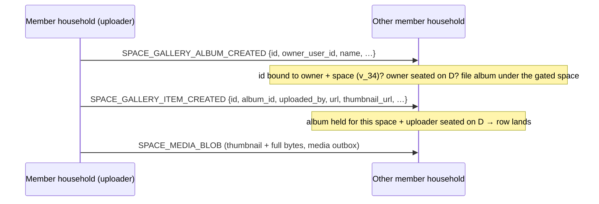
```mermaid
sequenceDiagram
    participant D as Member household (uploader)
    participant C as Other member household
    D->>C: SPACE_GALLERY_ALBUM_CREATED {id, owner_user_id, name, …}
    Note over C: id bound to owner + space (v_34)? owner seated on D? file album under the gated space
    D->>C: SPACE_GALLERY_ITEM_CREATED {id, album_id, uploaded_by, url, thumbnail_url, …}
    Note over C: album held for this space + uploader seated on D → row lands
    D->>C: SPACE_MEDIA_BLOB (thumbnail + full bytes, media outbox)
```

**Key exchange**

`SPACE_KEY_EXCHANGE`, `SPACE_KEY_EXCHANGE_ACK`,
`SPACE_KEY_EXCHANGE_REKEY`, `SPACE_ADMIN_KEY_SHARE`,
`SPACE_AUTHORITY_ROTATED` (v_44), `SPACE_SESSION_CLEANUP`.

`SPACE_AUTHORITY_ROTATED` is the owner's rotation of the space authority
key after an admin household is revoked — see
[Authority key rotation on admin revocation](#authority-key-rotation-on-admin-revocation-v_44).

`SPACE_SESSION_CLEANUP` is the teardown of a §D2b space-scoped seat: when
the last membership a link-joined household holds in any space we share
ends (kick, ban, leave, dissolve), we delete their `space_session`
`remote_instances` row and its session keys, and send this so they drop
their mirror. The receiver re-derives the answer from its own
`space_instances` rows rather than trusting the sender, so it cannot be
used to tear down a seat that is still carrying another shared space. See
[`invites.md`](./invites.md).

**Cross-household admin**

`SPACE_MEMBER_ROLE_CHANGED` (v_8+), `SPACE_REMOTE_ADMIN_KICK` (v_9+),
`SPACE_REMOTE_ADMIN_ACTION` (v_15+), `SPACE_ADMIN_PROPOSAL_UPDATED`
(v_16+), the `moderator` role (v_41). Role propagation + remote admins
running mutations on a space
hosted elsewhere + multi-admin approval of critical actions. See
"Cross-household admin promotion / kick / actions" and "Multi-admin
approval" below.

**Mesh routing (v_6+)**

`SPACE_ROUTED`, `SPACE_FIND_ROUTE`, `SPACE_ROUTE_FOUND`,
`SPACE_ROUTE_STALE` (v_28+). Generic source-routed envelope, the
discovery probe that finds the path, and the signed nack a restarted
target sends back so the origin re-discovers instead of waiting out its
route cache. See "Mesh routing (SPACE_ROUTED)" below.

**Space sync**

`SPACE_SYNC_BEGIN`, `SPACE_SYNC_OFFER`, `SPACE_SYNC_ANSWER`,
`SPACE_SYNC_ICE`, `SPACE_SYNC_CHUNK` (v_13+), `SPACE_SYNC_COMPLETE`,
`SPACE_SYNC_REJECTED` (v_20+), … — the reconnect content-sync handshake.
`SPACE_SYNC_REJECTED` is the membership backstop covered under "Dissolution"
below; the rest are the WebRTC/HTTPS content-streaming dance.

**GFS public-content relay (Phase 5)**

`SPACE_SUBSCRIBER_KEY_HANDOFF` (`space_subscriber_key_handoff`). These ride the
**content-blind GFS relay** (not a direct peer event), authorized by the
space-authority signature rather than `proto_version`, so they carry **no
`OURS` bump** — a non-subscriber simply never receives the frame.
`space_post_public` relays a public/global post (encrypted under the space
content key); `space_subscriber_key_handoff` (Phase 5b-b) delivers that content
key to a new GFS subscriber, **sealed** to the subscriber's published X25519
key-wrap pubkey (binding verified end-to-end before sealing — anti-GFS-
substitution) so the GFS never learns the key. The receiver re-verifies the
authority signature against its locally-pinned `spaces.identity_public_key`,
unseals with its key-wrap private key, and imports the key. Full flow:
[discovery.md](./discovery.md#subscriber-content-key-handoff-phase-5b-b).

## Flow — create + join

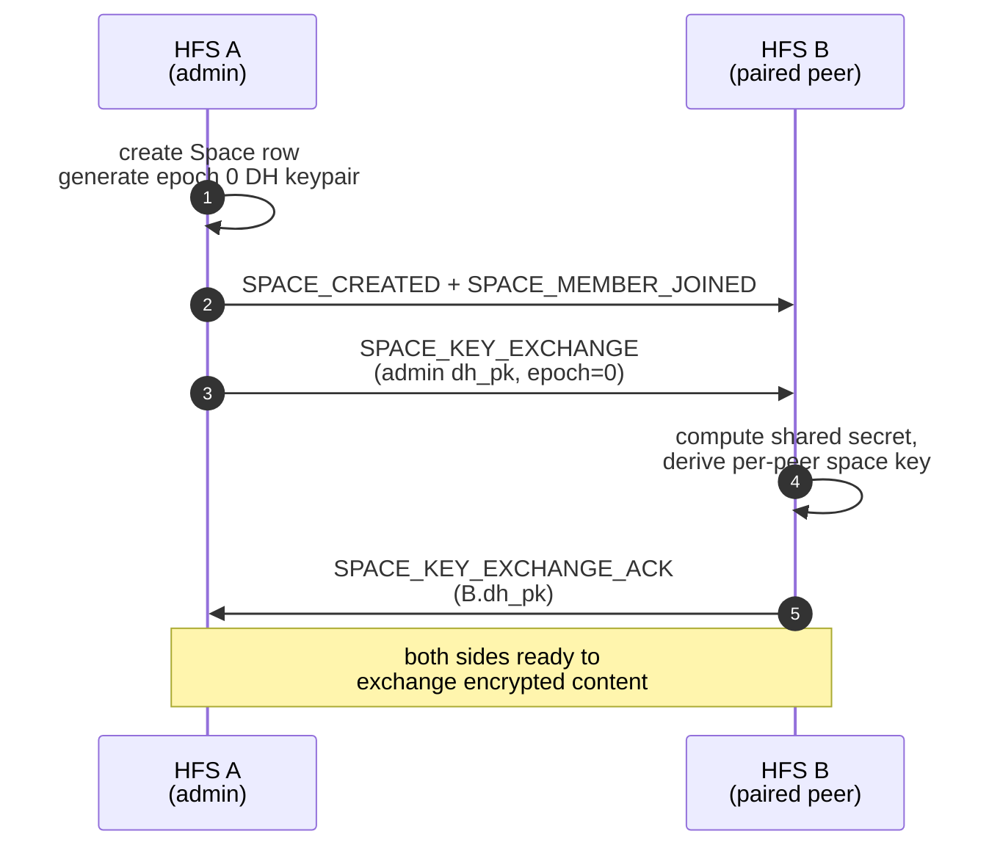
```mermaid
sequenceDiagram
    autonumber
    participant A as HFS A<br/>(admin)
    participant B as HFS B<br/>(paired peer)
    A->>A: create Space row<br/>generate epoch 0 DH keypair
    A->>B: SPACE_CREATED + SPACE_MEMBER_JOINED
    A->>B: SPACE_KEY_EXCHANGE<br/>(admin dh_pk, epoch=0)
    B->>B: compute shared secret,<br/>derive per-peer space key
    B->>A: SPACE_KEY_EXCHANGE_ACK<br/>(B.dh_pk)
    Note over A,B: both sides ready to<br/>exchange encrypted content
```

## Two kinds of follower (v_30)

"Follower" covers two seats that behave identically to a reader and differ
entirely in how the content reaches them:

| | GFS subscriber | Follower **household** |
|---|---|---|
| How they arrived | Walked up on their own through a connection-server listing (`allow_subscribers` on). | Redeemed a `subscriber` **invite link** the owner minted (see [invites.md](./invites.md)). |
| Seat on the host | None. The connection server holds the subscription; the host knows only "there are subscribers". | A real `space_remote_members` row with `role='subscriber'` (migration `0054`), plus a `space_instances` row. |
| Delivery | GFS relay of authority-signed, content-key-encrypted public/global events. | The ordinary member fan-out — `broadcast_to_space_members` over `space_instances`, on whatever transport that pair uses (`space_session` relay for a link-joined peer, direct/mesh for a paired one). |
| Content key | `SPACE_SUBSCRIBER_KEY_HANDOFF`, sealed to the subscriber's published X25519 key. | The §D1b handoff in the redeem ACK's `space_meta`, then every epoch rotation (rotation fans out over `space_instances`). |
| Applicable space types | public / global only, and only with `allow_subscribers` on. | Any space the owner mints a link for — an invite is the owner deciding for one named link, not a standing public policy. |
| In the roster | No. | Yes, exactly as a LOCAL subscriber is: `GET /api/spaces/{id}/members` emits `role` verbatim for both. |
| Revocation | Drop the subscription / turn `allow_subscribers` off; the next epoch rotation locks them out. | Kick or ban, like any member — seat tombstoned, household dropped from `space_instances` when its last seat goes, epoch rotated, and for a link-joined peer with no other shared space the `space_session` row revoked (`revoke_space_session_if_orphaned`). |

**Writes from a Follower household are refused by every household that
receives them.** It holds a valid content key, so it can produce a
well-formed, correctly-signed `SPACE_POST_CREATED` whatever its own local
gate says — and its own local gate *does* refuse, via the ordinary
`_assert_writable_member` on the redeemer's `space_members` row. Nobody
takes that on trust: step 12 of the §24.11 pipeline
(`make_check_space_writer` in `federation/inbound_validator.py`) drops the
envelope before dispatch.

The rule, precisely:

- **A household that holds only `subscriber` seats in the space — or only
  tombstoned ones — has every space-content write refused.** The decision
  is keyed on the signed `from_instance`, never on a payload author field
  (the sender writes those). A household holding at least one live
  `member` / `admin` seat may write, even if it also holds a follower
  seat.
- **Every receiving household enforces it, not just the host.** Space
  content fans out peer-to-peer from the *originating* household
  (`broadcast_to_space_members`), so a member household receives a
  follower's writes directly — and the follower learns every member
  household's instance id from the roster snapshot in its own redeem ACK.
- **The whole write vocabulary**
  (`SPACE_WRITE_EVENT_TYPES` in `domain/federation.py`): posts, comments,
  pages, tasks, polls, stickies, calendar events, RSVPs, schedules,
  gallery albums and items, bazaar listings / bids / offers, zones,
  timetables, location pins,
  media blobs — and every `*_UPDATED` / `*_DELETED` sibling, because
  editing or deleting somebody else's row is a write. The classification
  is exhaustive over the enum and pinned by a test, so a new space event
  type is refused-by-default until somebody classifies it.
- **One opt-in:** `SPACE_COMMENT_CREATED`, when the space has
  `allow_subscriber_comment` on **and** the payload's author names a live
  `subscriber` seat of that same household. (`allow_subscriber_react` has
  no inbound surface — space reactions are not federated events.)
- **A household the receiver holds no roster row for is not a writer** —
  except the space's **host**, the roster authority (a member stub written
  before roster mirroring may hold no row for it). Its write is **held**
  (bounded, expiring — see "Keeping the roster mirror complete" below) and
  replayed through these same gates when a seat for it lands, because the
  usual cause is a household that joined before the gossip seating it
  reached us; media bytes are refused outright. This replaced a
  roster-convergence leniency that passed such writes unchecked. The seat
  read still includes **tombstones**, so a kicked household is decided
  from its seat, not treated as unknown.
- **The mesh is not a way around it.** The inner event of a
  `SPACE_ROUTED` envelope is re-judged by the same gates after the unwrap
  (`run_post_decrypt_gates`); without that it would reach the handlers
  with neither this check nor the ban check.
- **An envelope that names no space is refused.** Every writer we ship
  sets the routing `space_id`, and the payload carries its own copy for
  the mesh path (where the routing field is deliberately absent so a relay
  cannot learn which space is served). One with neither cannot be
  attributed, and passing it would hand a follower every handler that
  keys on a bare row id.

## A household writes only for its own members

Inside one space, a content payload names people: the `author` of a post
or comment, the `created_by` of a task, page or event, the voter, the
RSVPing user, the uploader, the seller, the bidder. The sender writes those
fields, so every handler binds them to the one fact it cannot forge — the
receiver's own roster mirror, `space_remote_members`, keyed on
`(space_id, instance_id, user_id)` and looked up under the §24.11-signed
`from_instance` (`socialhome/federation/space_authorship.py`). A remote
`user_id` is derived from its home instance's key, so a live seat for
`(space, from_instance, user)` exists only when that user really is a
member of this space on the household that signed the envelope. A local
user of the receiver is never seated remotely, so no remote household can
act as one — only moderation (below) reaches a local user's rows.

| Family | Create | Edit / state change | Delete |
|---|---|---|---|
| Posts, comments | author seated (with a writer role) on the sender, or the host relaying a row of a user the space has a record of (§25.6 resume / §319.6 resync replay); from v_36 an owner-bound id must commit to that author and space | the author's household, or **content authority** — the host, or a household holding a live `admin` or `moderator` (v_41) seat | same as edit |
| Gallery albums (v_33) | owner seated on the sender (or the host's relay); from v_34 an owner-bound id must commit to that owner and space | the stored owner's household or **settings** authority — the host or an `admin` seat, never a `moderator` (the payload's owner is ignored) | same as edit |
| Gallery items | uploader seated on the sender (or the host's relay); from v_36 an owner-bound id must commit to that uploader and space | — | uploader's household or a moderator |
| Tasks, pages, stickies, calendar events | the claimed `created_by` / `author` seated on the sender (or the host's relay); a page that names nobody needs a writer household; from v_36 a new row's owner-bound id must commit to that creator and space | collaborative — any writer household (any member edits them locally); the stored attribution is kept, the payload's claim ignored | any writer household |
| Poll votes, schedule answers, bids | the voter / user / bidder seated on the sender — strictly, no host exception | — | — |
| RSVPs | the user seated on the sender; plus the two writes the calendar service makes for another household: the event creator's household or a moderator settling a `requested` RSVP (→ `going` / `waitlist`, or removed), and any writer household promoting a `waitlist` RSVP into a free seat | | |
| Poll close, schedule create / finalise | the wrapper post's author's household | | |
| Bazaar listing | the seller seated on the sender, on the seller's own wrapper post, once (a re-send is a no-op) | status (sold / expired / cancelled) and offer acceptance: the seller's household only (a non-seller's expiry of an ended listing is DEBUG noise — every household sweeps expiries, only the seller's announces) | — |
| Zones | settings authority only — the host or a live `admin` seat; a `moderator` seat is refused (the local service is admin-only); a new zone's `created_by` bound like a create | same | same |
| Timetables (v_39) | an admin household, recording the edit as **an admin** (`SpaceAuthorship.admin_as`: `updated_by` holds a live `admin` seat on the sender — never a `moderator`; from the host, the roster authority, any live writer seat on the host — the owner is mirrored as a member — or a relayed remote user with a live `admin` seat; never a follower); the id must be owner-bound to `created_by` in this space (no legacy window) and a new row's `created_by` bound like a create | same — last-writer-wins on `version` (a jump > 10 000 or a version near the cap refused); a tombstoned id never comes back | same, bound to `deleted_by`; an unseen id is tombstoned only when owner-bound to the payload's `created_by` in this space — see [`timetables.md`](./timetables.md) |

**Creator-bound ids (v_34 albums, v_36 everything else).** The rules
above bind the user a payload names to the signing household, but a new
row's *id* is picked by its creator and seen by every member household: a
household that has seen another household's new id could announce it
first for its own user, and the creator's real announcement would then
meet an id already held. So every new federated row with an owner carries
an **owner-bound id** (`federation/owner_bound_id.py`; wire shape in
[`crypto.md`](../crypto.md)) — a UUIDv8-shaped 32-hex id with a random
nonce, a suite nibble and a commitment over `(kind, space_id,
owner_user_id, nonce)`. Posts (and so the bazaar listing, poll and
schedule rows that follow their wrapper post) bind their `author`,
comments their `author`, gallery items their `uploaded_by`, calendar
events, tasks and pages their `created_by`, stickies their `author`.
Every path that files a new row recomputes the commitment and refuses
(WARNING) a claim of the id for anybody else, for another space, or under
an unknown suite nibble: the live create handlers, the §25.6 sync receiver
(the host's stream included), the host relay and `SPACE_SYNC_RESUME`
replay (which arrive as live events, and stay valid — the id binds the
owner, not the sender) and the public-space GFS relay (checked by the
relaying seed-holder and every subscriber). Collaborative rows are checked
only while not held yet; an edit keeps the stored attribution. An id of any
other shape — every earlier row's uuid4, a row from a household that does
not bind yet, a bot post — keeps the rules above (the legacy window; see
the v_34 and v_36 rows in [`capabilities.md`](./capabilities.md)).

A **read-only (`subscriber`) seat authors nothing**, with the one opt-in
the Follower gate already has: a comment, when the space turned
`allow_subscriber_comment` on. It may still change a row it already owns.

**A re-send of an existing post is an edit**, judged like one — the
author's household or a moderator; a bot post only a moderator — and it
keeps the row's author and every piece of state other people put on it
(pin, reactions, comment count, the moderation hold, feed visibility). A
deleted post stays deleted, and only a moderator may touch a post held by
moderation.

The bot bridge posts under the shared `system-integration` author, which is
no member: any writer household may create such a post, only a moderator
may change one.

**Media references.** A received post, comment or bazaar listing (live or
via the catch-up stream) keeps only media references in the shape a local
upload stores, `api/media/<name>`; anything else is dropped before the row
is written (`services/inbound_media_store.py:local_media_ref`). Deleting a
post only removes that post's own files: a file goes only once no other
row — in any space, the household feed, DMs, the gallery, a listing — still
references it (`media/cleanup.py:unlink_unreferenced`,
`repositories/media_reference_repo.py`). The same rule covers every other
delete path and the space purge.

### The §25.6 catch-up stream

A chunk from the space's **host** is taken whole — the host is the roster
and moderation authority. The scheduler also syncs with every confirmed
co-member household on a timer, so a chunk from any **other** provider is
held to the same rules as a live event: it may only *add* rows (never
overwrite one the receiver holds — author, content and moderation state
stand), each attributed to a member seated on that provider; the roster
and bans are the host's alone, and zones an admin household's (never a
v_41 `moderator` seat); timetables an admin household's, recorded as its
admin (`SpaceSyncReceiver._admit`).

### Keeping the roster mirror complete

The mirror is what authors are bound to, so it has to converge on every
member household, not only on the host:

- **Roster snapshot (v_32).** The host sends a member household its whole
  roster in one `SPACE_ROSTER_SNAPSHOT`: every live seat as a
  `SPACE_MEMBER_JOINED` entry and every removal as `SPACE_MEMBER_LEFT`, each
  individually authority-signed like live gossip and merged through the
  same CRDT (`apply_member_event`), so a receiver gains what it lacks and
  never regresses. A remote seat ships the version the host's mirror holds
  — which the host keeps equal to the last gossip it announced for that
  seat — and a host-local member the current `roster_sequence`. Sent when
  the host seats a household (its invitation's roster may be stale: a
  demotion or kick in between would otherwise never reach it), when a
  member household first advertises v_32, and on the periodic sync tick.
  Not sent after an invite-link redeem (the ACK's roster is taken at seat
  time, and the redeemer has no space row yet) nor, on the timer, to a
  link-joined household (a timed envelope over the connection-server relay
  would be new traffic metadata for it). The host signs a snapshot's
  entries, and the receiver verifies them, in a worker thread, off the
  event loop.
- **Held writes.** A write naming a user the space has **no record of at
  all** — or, at the Follower gate, coming from a household it holds no
  row for — may simply have beaten the gossip seating them. It is held in a
  bounded, expiring in-memory buffer
  (`socialhome/federation/pending_seat_buffer.py`: 256 entries, at most 64
  from any one sending household, 32 per key, 4 MiB, 15 min; media bytes
  never) and replayed through the same post-decrypt gates and handlers
  when the seat lands (`SpaceRemoteSeatLive`). A user seated on *another*
  household, or one who was removed, is known, so that is always a
  refusal, never held.

Known edges of the snapshot, all self-limiting:

- A **link-joined household** gets no periodic snapshot (see above); its
  mirror heals when it is seated again or first advertises v_32 after an
  upgrade, and live gossip keeps reaching it in between.
- A **v_32 receiver behind an older host** gets no snapshots at all — the
  host does not send them — and converges on live gossip and the §25.6
  catch-up stream as before.
- A **host-local member who leaves** is not in later snapshots (the host
  lists only its current local members, and has no tombstone row for them).
  That is harmless: such a seat names the host's own household, which may
  author in its own space anyway, so a stale one lets nobody write anything
  they could not already; the live `SPACE_MEMBER_LEFT` gossip still carries
  the departure.

A refusal is logged at WARNING and answers `status: ok`, so the sender's
outbox does not retry it; a benign no-op — a replayed delete of a row
already gone, a status change for a listing already settled — is logged at
DEBUG. `tests/protocol/test_space_content_authorship.py` runs every
row-writing event type, and every catch-up resource, against the real
registry and receiver — each with a positive control and a refused case —
and fails until a new type or resource has both.

## The routing `space_id` is authoritative for every mutation

The gates above judge a sender against **one** space — the one
`resolve_space_id(event)` (`socialhome/federation/space_scope.py`)
returns: the routing field first, the payload copy only as a fallback,
and a present-but-different payload copy is a refusal rather than a
tiebreak. That same id is the only space the event's writes may land in.
Content handlers pass it down and **the repositories enforce it**:

- every space-content mutator takes a `space_id` and scopes its statement
  with it (`… WHERE id=? AND space_id=?`);
- an upsert never moves a row between spaces — its `ON CONFLICT` clause
  does not rewrite `space_id` and does nothing when the existing row
  belongs to another space;
- a child row (a comment or reply, an RSVP, a task on a list, a poll vote
  or schedule answer, a gallery item, a bazaar listing / bid / accepted
  offer) is written only when its parent resolves to the same space, in
  the same statement or transaction as the write — never on the strength
  of a handler-side pre-read;
- a household's own, non-space rows (personal pages, household stickies,
  household gallery albums) are never reachable from a space-routed
  event.

A mutator that matches no row in the gated space reports it; the handler
drops the event, logs the refusal at WARNING and publishes no bus event.
The §25.6 catch-up stream (`SpaceSyncReceiver`) is held to the same rule:
records of a chunk for space A are written into space A or not at all,
whatever ids or `space_id` they carry. An RSVP that arrives before its
event is buffered together with the space it was received for and only
applied to an event of that space; since an RSVP is only accepted for a
user seated on the sender, no other household can occupy that buffer key
for the user.

The catch-up stream is not author-bound: the provider re-exports every
member's rows by design, and a sync session is one the receiver opened,
for one space, with a provider whose signature it verified.

Local REST callers go through the same scoped mutators with the space
they already resolved. Where a repository also serves the household
(non-space) surface — polls and the gallery — federation uses dedicated
`*_in_space` methods (`AbstractSpacePollRepo`,
`AbstractGalleryRepo.create_item_in_space` / `delete_item_in_space` /
`create_album_in_space` / `update_album_in_space` /
`delete_album_in_space`).
`tests/protocol/test_space_content_scope.py` walks every event type in
`SPACE_WRITE_EVENT_TYPES` against the real handler registry and fails
until each one has a cross-space case.

## Roster authority

Content is only half the promise. The other half is the roster itself: a
household that could rewrite seats, bans or members would simply promote
itself out of the read-only gate above.

**A roster mutation is applied only when it comes from the space's own
host (`spaces.owner_instance_id == event.from_instance`) or carries a
valid space-authority signature verified against
`spaces.identity_public_key`.** Not from a paired peer, not from a member
household, not from a household holding a Follower seat. Concretely:

- `SPACE_MEMBER_ROLE_CHANGED`, `SPACE_MEMBER_BANNED`,
  `SPACE_MEMBER_UNBANNED` and the `space_members` half of
  `SPACE_REMOTE_MEMBER_REMOVED` are **host-only**. An unknown space is
  refused too — there is no owner to compare the sender against.
- `SPACE_MEMBER_JOINED` / `SPACE_MEMBER_LEFT` (the v_23 roster gossip) are
  **authority-signed**, so a delegated admin can act while the owner is
  offline; the trust root is the signature, not the relay.
- `SPACE_PRIVATE_INVITE` is the host inviting one of our users, so it is
  refused for a space we already know under a different owner. Its
  `_ACCEPT` / `_DECLINE` are bound to the invitation they answer: the
  signed sender must be the invited household, the named user must be the
  invited user, and the invitation must still be pending — one invitation,
  one seat. (`expires_at` is not enforced: it is a 15-minute TTL inherited
  from the invite token, while the invitee's pending list has no expiry
  filter, so refusing on it would drop legitimate late accepts.) An
  accept never *raises* an existing live seat's role — promotion is the
  host's decision and rides `SPACE_MEMBER_ROLE_CHANGED`.
- The sender's OWN seat is the one exception, and it is not an exception
  to the rule: a household may drop the seat it holds
  (`SPACE_REMOTE_MEMBER_REMOVED` naming its own user) because that is a
  statement about itself.

One handler registration per event type is not guaranteed —
`EventDispatchRegistry.dispatch` runs **every** handler bound to a type, so
a guarded handler does not shadow an unguarded sibling. A protocol test
(`tests/protocol/test_space_roster_authority.py`) enumerates the real
registry for each roster-mutating type and drives a forged envelope
through every handler bound to it.

The §25.6 catch-up sync carries the same rule into the bulk path: a
`SPACE_SYNC_OFFER` is accepted only for a `sync_id` this household
actually requested and only from the household it asked, the session pins
that provider for every chunk, and each chunk's `space_id` is pinned to
the session's. Without those, an unsolicited offer minted a session with
no provider and no space, and its chunks wrote members (role included),
bans and content for any space at all.

Older peers: `role='subscriber'` is unstorable below v_30, so a follower's
roster gossip is gated on
`FederationCapability.MIN_FOR_REMOTE_SUBSCRIBER_ROLE`. A sub-v_30 peer
therefore holds no row for the follower and falls into the
convergence-leniency branch above — the seat only becomes enforceable
there once that household upgrades.

## `allow_subscribers` gates public readability

A space carries three independent dials:

| Dial | Question it answers | Values |
|---|---|---|
| `space_type` | where may this space be listed? | `private` / `household` / `public` / `global` |
| `join_mode` | how does a newcomer become a **member who can post**? | `invite_only` / `open` / `request` |
| `features.allow_subscribers` | may **strangers follow it read-only**? | off (default) / on |

`join_mode` has nothing to do with readability. That is `allow_subscribers`,
an explicit admin opt-in living on `SpaceFeatures` beside its two siblings
`allow_subscriber_comment` / `allow_subscriber_react` — the flags that say
what a follower may *do* once one exists. It federates with the rest of the
features block (`space_meta.features`, `SPACE_SYNC_BEGIN`), rides in the
signed space-config event, and is set through the ordinary
`PATCH /api/spaces/{id}` `features` path. The column default
(`0051_space_allow_subscribers.sql`) and the dataclass default are both
**off**.

**A public/global space with `allow_subscribers` off is listed for discovery
but is not publicly readable.** Its metadata (name, description, icon) is
still published to every paired connection server — that listing is how
people find the space and ask to be let in — but its **content stream stops
at the member households**:

- no post is relayed to the GFS (`services/space_public_outbound.py`, both
  the local-author and the owner-offline remote-author paths);
- the per-space AES-256 content key is never sealed to a GFS subscriber
  (`services/space_subscriber_key_outbound.py`, the `new_subscriber` handoff
  and every reconcile entry point), so a subscriber cannot open even a
  ciphertext it obtained some other way;
- the pre-signed `public_relay` hint is not attached to the member broadcast
  (`services/space_post_outbound.py`) — it exists only to let a seed-holding
  member run the GFS relay, which is dead for this space;
- `SpaceService.subscribe_to_space` refuses outright
  (`this space does not allow subscribers`), and so does the connection
  server's `POST /gfs/subscribe` (`403`).

Because the two dials are independent, all four combinations are meaningful
— an `invite_only` space with followers **on** is a legitimate broadcast
space (invited people post, anyone may read along), and an `open` space with
followers **off** is joinable by anyone but readable only once you have
joined.

Changing the flag on a **global** space re-publishes its metadata to every
paired connection server immediately, so the directory learns at once rather
than at the owner's next reconnect; a publish that lands the flag as off also
purges the subscriber seats taken while it was on.

**Members are unaffected.** Space content reaches member households through
`broadcast_to_space_members` over `space_instances`, which is independent of
the GFS relay and of the `public_relay` hint — including mesh-only remote
members reached via `SPACE_ROUTED`. Turning followers off removes the public
audience, never the federation.

See [`discovery.md`](./discovery.md) for the GFS-side view.

## Dissolution (host hard-deletes; members keep a read-only archive)

Dissolving a space is asymmetric: a **permanent removal** on the owner
host, but on every member household the local copy is **archived
read-only** rather than purged. A member's space is *their own local
copy* of shared content — silently deleting it when the owner ends the
space loses everything they had, so members instead keep a frozen,
clearly-labelled archive they choose when to remove.

1. **Host** (`SpaceService.dissolve_space`, owner-only): unpublish from
   any paired GFS; publish `SpaceConfigChanged(DISSOLVED)`, which (a)
   fans a `space.config.changed` WS frame to local tabs and (b) makes
   `SpaceConfigOutbound` broadcast `SPACE_DISSOLVED` (`{space_id}`) to
   every member household via `broadcast_to_space_members`. These run
   while the rows still exist (the broadcast + WS fan-out resolve
   recipients from the membership rows about to be deleted).
2. **Host purge**: `DELETE FROM spaces WHERE id=?`. Every space-scoped
   child table is `REFERENCES spaces(id) ON DELETE CASCADE` and the
   connection runs `PRAGMA foreign_keys=ON`, so the full content graph —
   posts, comments, members, gallery albums/items, calendar, pages,
   tasks, stickies, content keys, the media-outbox rows, location pins —
   drops in one statement. Media **files** (no FK) are collected before
   the delete and unlinked after, except any a row outside the space still
   references (`services/space_purge.py`).
3. **Member** (inbound `SPACE_DISSOLVED` → `_on_dissolved`): verifies the
   event came from the space's `owner_instance_id` (drops it otherwise —
   a non-owner can't dissolve someone else's space), then **archives**
   its local copy read-only via `set_archived(space_id, True,
   reason="dissolved")` and publishes `RemoteSpaceDissolved`. The local
   content is kept; the space becomes read-only (`_require_writable_space`)
   and cannot be unarchived from the member side (`unarchive_space` refuses
   any space with an `archived_reason` set). `NotificationService` raises a
   one-time `space_dissolved` notification per local member
   (deduped by link). No purge, no media unlink on the member side.

`SPACE_DISSOLVED` carries only `{space_id}` and is in the outbox
`NEVER_DROP` set, so an offline member still receives it and archives its
copy once it reconnects. (`SPACE_CONFIG_CHANGED` is deliberately **not**
used for dissolve. It is also ignored once a space is in a terminal state:
`_on_space_config_changed` returns early when `archived_reason` is set, so
a late or replayed config snapshot can't revive a dissolved archive.)

### Reconnect backstop — `SPACE_SYNC_REJECTED` (v_20+)

`NEVER_DROP` makes the `SPACE_DISSOLVED` re-delivery best-effort, not
guaranteed: an outbox row can be pruned, or a member can be *removed* from a
space (a separate flow) while offline and never learn it. Either way the
member reconnects still believing it's a member, and its sync scheduler sends
`SPACE_SYNC_BEGIN` for the space. The host used to **silently drop** that
request when the requester wasn't a member (S-1), leaving an orphaned
read-write stub forever.

The backstop closes that gap. On a `SPACE_SYNC_BEGIN` from a non-member, the
host (`SyncSessionManager.begin_session` → `_handle_space_sync_begin`) replies
with a signed `SPACE_SYNC_REJECTED {sync_id, space_id, reason}` instead of
dropping it:

- `reason="dissolved"` — the `spaces` row is gone on the host (a dissolve
  purged it; a never-existed space collapses into this case too, so a
  dissolved space is indistinguishable from one that never existed).
- `reason="removed"` — the space still exists on the host but the requester
  is no longer in `space_instances`.

The `dissolved`/`removed` split is an existence signal: a peer that asks
about an *existing* space it isn't a member of learns the space exists
(`removed`) rather than getting silence. That signal is gated behind a
**confirmed, Ed25519-authenticated** peer, an **unguessable** `space_id`
(`uuid4().hex`, 122-bit) the peer must already hold, and the **5/h
per-peer+space rate limit** — so it can't be used to enumerate or
amplify-probe. Accepted as a deliberate, bounded relaxation of the S-1
silent drop in exchange for reconciling orphaned member stubs.

The member's `_on_sync_rejected` handler (sibling of `_on_dissolved`) applies
the **same** archive-not-delete treatment: it verifies the event came from the
space's `owner_instance_id` (a non-owner can't terminate your copy), checks the
reason is a known terminal value, and — if the copy isn't already terminally
archived — calls `set_archived(space_id, True, reason=reason)` and publishes
`RemoteSpaceDissolved`. The notification copy is reason-aware (`removed` →
"you're no longer a member"). An *admin*-archived copy (`archived_reason`
NULL) is still upgradable to a terminal reason here.

Guards: the request is rate-limited (S-6, 5/h per peer+space) **before** the
membership check, so the reply can't be used to amplify probes; the reply
target and `space_id` are bound to the Ed25519-verified envelope; and the send
is gated on `peer_supports(min_version=MIN_FOR_SPACE_SYNC_REJECTED)`.
**Best-effort backstop** — a sub-v_20 host keeps the silent drop, so a sub-v_20
member still relies on the normal `SPACE_DISSOLVED` broadcast/outbox.

## Archive (soft, reversible, federated read-only)

Distinct from dissolution: archiving **hides + freezes** a space without
deleting anything, and is reversible.

- `SpaceService.archive_space` / `unarchive_space` (owner / admin) set the
  `spaces.archived` flag and publish `SpaceConfigChanged` (`archived` /
  `unarchived`). Unlike dissolve, this rides the **normal**
  `SPACE_CONFIG_CHANGED` + `space_meta` path — `archived` is a `space_meta`
  field, so member households apply it through the same
  `stub_space_from_metadata` refresh used for any config edit. **No new
  event type or capability bump.**
- While archived the space stays **readable** but is **read-only**:
  `SpaceService._require_writable_space` rejects content writes (post /
  comment / edit / react) with a 403 on host *and* member, and it drops
  out of active space lists. Unarchiving ships `archived=false` and
  restores read-write everywhere.
- `archived` is independent of `dissolved`: `dissolved` means *gone*
  (`_require_space` 404s it), `archived` means *read-only-visible*.
- `archived_reason` (`NULL` | `'dissolved'` | `'removed'`) distinguishes a
  reversible admin archive (`NULL` — Unarchive available) from a
  remote-termination archive a member can't undo (`'dissolved'` when the
  owner dissolved the space; `'removed'` when the member was dropped from a
  still-existing space — set by the `SPACE_SYNC_REJECTED` backstop above).
  When set, `unarchive_space` refuses and the SPA shows a reason-aware
  "read-only archive" banner with no Unarchive control. The host never sets
  `archived_reason` on its own space (it purges); only member copies carry
  it, and it is never re-federated.

### An archived space is read-only to peers too

The REST gate alone left a door open: a peer's federated write still
landed in a space archived here. Every inbound door now refuses new space
**content** in a space that is archived (or dissolved) locally —
one decision, `federation/space_scope.archive_refusal`, shared by:

- the §24.11 post-decrypt gate `check_space_archived`
  (`federation/inbound_validator.py`), which runs on the whole
  `SPACE_WRITE_EVENT_TYPES` vocabulary except removals — every create and
  `*_UPDATED` of posts, comments, pages, tasks, task lists, polls,
  stickies, calendar events, RSVPs, schedules, gallery albums and items,
  bazaar listings / bids / offers, zones, timetables, location pins and
  media blobs. Being a post-decrypt gate, it also covers the inner event
  of a `SPACE_ROUTED` unwrap, a held write replayed when its seat lands,
  and the §25.6 resume replay (which re-sends live events). It runs
  **before** `check_space_writer`, so such a write is refused, never held.
  The envelope is answered plain `{"status": "ok"}` — the same body every
  accepted envelope gets, dispatched or dropped — so the sender's outbox
  stops redelivering without learning that the space exists, is hosted
  here, or is archived (a distinct `dropped` reason was an oracle to any
  signed sender). The refusal is logged at INFO; a member's page proposal
  still gets its `refused/archived` answer, sent only to a household with a
  live writer seat;
- the §25.6 sync receiver (`SpaceSyncReceiver._admit`) for every resource
  except the roster (`ROSTER_RESOURCES`: `members`, `bans`,
  `member_pictures`);
- the GFS public-post relay consumer (`SpacePublicInbound`).

Who may still write content into an archived copy:

| Local state | Space host | Any other household |
|---|---|---|
| live | judged by the other gates | judged by the other gates |
| archived, `archived_reason` NULL (reversible) | **accepted** — the archive is the host's own decision, its API is read-only for the space, so what it still sends is pre-archive state a member missed (resume / catch-up); it could unarchive over the same signed channel anyway | refused |
| archived, `archived_reason` set (`dissolved` / `removed`), or `dissolved` | refused | refused |

The GFS relay frame names no household, so it is refused in every
archived state.

**Still applied** to an archived space, because none of it is a content
write (`SPACE_READER_EVENT_TYPES`): config (`SPACE_CONFIG_CHANGED` —
including the host's **unarchive**), dissolve / `SPACE_SYNC_REJECTED`,
roster and bans, content-key epochs, sync machinery, routing, invites, and
`SPACE_REPORT` (a report is about content, not content).

**Removals always propagate.** The `*_DELETED` content types
(`ARCHIVED_ALLOWED_REMOVAL_TYPES` in `domain/federation.py`: post, comment,
page, task, task list, sticky, calendar event, RSVP, gallery album, gallery
item, zone, timetable) pass the archive gate from any sender, on a reversibly
archived and a terminated copy alike. An author can still delete their own
post or comment in an archived space locally; if every peer dropped that
delete, the row would outlive its deletion on every other copy. Passing the
archive gate is not an authorization: the handler's authorship /
`may_mutate` check still decides whether that sender may remove that row.
The §25.6 sync stream carries no tombstones (the exporters ship live rows
only), so there is no sync-side removal to let through.

Receiver-side only — no protocol version bump: no wire shape changes, and
a sender of any version gets the same `status: ok` it gets for any other
dropped write.

## Post-type allow-list (per-space feed composer gating)

A space admin chooses which post kinds members may compose in the feed
(`SpaceSettings` → "Post types"). The set lives on `SpaceFeatures.allowed_post_types`
(persisted as the `spaces.allow_post_*` columns) and is enforced on every
instance independently: `SpaceService.create_post` rejects a disallowed
type with `SpacePermissionError` (403), and the SPA composer hides the
disabled type buttons so members don't hit that wall.

- **Federation:** the set rides the **normal** `SPACE_CONFIG_CHANGED` +
  `space_meta` path — `allowed_post_types` is a `space_meta.features` field,
  applied by member households through the same `stub_space_from_metadata`
  refresh used for any config edit. This is what makes a member household
  enforce the host's restriction when *its* users compose (each instance
  gates `create_post` against its own stub).
- **Backward-compatible:** an older sender that omits the field → the
  receiver defaults to **all types allowed** (the historical behaviour).
  **No new event type or capability bump** — additive and fail-soft.

## @-mentions (resolved per household, nothing on the wire)

`@handle` tokens in a space post or comment are resolved by **each
household independently**, on the decrypted content it stores, against its
**own view of the space's members** (local `space_members` seats +
`space_remote_members` seats; `SpaceMentionResolver`). A token only ever
resolves to a member, so a mention can never reach — or notify — a
non-member. Every publisher runs it: local create (+ moderation approve),
`SPACE_POST_CREATED` / `SPACE_COMMENT_CREATED` inbound, the GFS-relayed
public post, and bot-bridge posts (calendar-feed posts carry no member
text and are not parsed).

- **Grammar:** `@base` matches a member's public `handle` or login /
  remote username, case-insensitively. When two members share a base (an
  `anna` on two households) the bare `@anna` resolves to nobody (silence
  over the wrong person) and the composer inserts `@anna@<user_id prefix>`
  instead — `user_id` is global, so every member household resolves the
  qualified token identically. `GET /api/spaces/{id}/members` hands the SPA
  the exact token per row (`mention`).
- **`@here`** pages every member, so it is a privilege decided **on each
  receiving household** from what that household already holds — never
  from the post payload:
  - the space's **`allow_here_mention`** toggle (owner/admin config edit,
    default off) as this household mirrors it; and
  - the author's role **in this household's roster**: a local
    `owner`/`admin` `space_members` row, a remote **`admin`** seat in
    `space_remote_members`, or the host's owner (seated on
    `owner_instance_id` under the space's `owner_username` — a remote seat
    can't hold `owner`). Members, subscribers, bots and unknown authors are
    dropped.
  A disallowed `@here` is removed before the event is published; the user
  mentions next to it still count. Allowed, it notifies every member at
  `all` / `mentions` (not `muted`, not the author) once per post, at most
  one `@here` per author per space per 10 min (per household, in memory).
- **`allow_here_mention` travels like the rest of the config:** it is in
  `space_meta` (so it rides the authority-signed `SPACE_CONFIG_CHANGED`
  broadcast and the §D1b snapshot) and in the forwardable
  `update_config` fields for a cross-household admin. **No capability
  bump:** a receiver that predates it ignores the key and never notifies
  `@here` at all; a sender that predates it omits the key and the receiver
  reads it as **off** (fail closed). An admin on a household forwarding to
  an older host sees the toggle not stick (the old host drops the field).
- **No other wire / protocol change.** Content was already end-to-end
  encrypted to members; mentions are derived from it on receipt.
- **Edits:** an edit notifies only the members it **newly** mentions —
  mentions in the new body minus those already in the old one (by
  `user_id`), resolved on this household's member view. Local post /
  comment edits by the author (a moderator editing someone else's words
  mentions nobody) and inbound `SPACE_POST_UPDATED`,
  `SPACE_COMMENT_UPDATED` and a `SPACE_POST_CREATED` re-send of an existing
  post all diff the stored body against the new one — an inbound edit only
  when it comes from the author's own household (`acts_for`), so a
  moderator household's edit never reads as the author mentioning you.
  Nobody gets a generic
  "posted" bell for an edit; a mention bell follows the same level rules.
  `@here` counts only when the old body had none at all and the author may
  use it, and it is still under the per-author 10-min limit.
- **Notifications:** see `docs/api.md` → `/api/spaces/{id}/notif-prefs`
  (`space_mention` / `space_here` bells, title only per §25.3).

## Bazaar tab + opt-in feed announcement

The Bazaar is a first-class space tab (gated on `SpaceFeatures.bazaar`,
defaulting on, federated in `space_meta.features.bazaar`). Listings are
space-scoped (`bazaar_listings.space_id`) and browsed per-space via
`GET /api/spaces/{id}/bazaar`.

A listing is anchored to a `PostType.BAZAAR` wrapper post (the listing's
id, comment thread, and media host). Whether that post shows in the feed
is opt-in:

- `BazaarService.create_listing(announce_in_feed=False)` (the default)
  creates the wrapper with `space_posts.hidden_from_feed = 1`. The post is
  excluded from `list_feed` so the listing lives only in the Bazaar tab.
  The §25.6 catch-up sync enumerates posts through `list_for_sync`
  instead, which ships every non-deleted post **including** hidden
  anchors, flag intact: `bazaar_listings.post_id` references
  `space_posts(id)`, so a joiner that never received the anchor could not
  store the listing (the INSERT failed its FK and the listing silently
  never arrived — every unannounced listing, on every joiner, until
  2026-09). The receiver stores the flag with the row, so the joiner's
  feed stays exactly as clean as the provider's.
- `announce_in_feed=True` clears the flag → the listing's card also shows
  in the feed (the historical behaviour).
- **Federation:** `hidden_from_feed` rides the `SPACE_POST_CREATED`
  payload so member households mirror the same feed visibility. Absent on
  an older sender → the receiver defaults to **visible**. Additive +
  fail-soft — **no new event type or capability bump**.

## Timetable tab (opt-in)

`SpaceFeatures.timetable` (column `spaces.feature_timetable`, default
**off**, federated in `space_meta.features.timetable`) turns on shared
timetables for the space — a class plan the admins maintain and every
member reads, e.g. inside the Calendar tab. Writes are owner / admin-only,
locally and on every receiving household; the events
(`SPACE_TIMETABLE_UPSERTED` / `_DELETED`, v_39) go to member households
only. Full flow, authorization table and sync rules:
[`timetables.md`](./timetables.md).

## Link previews (author-built, receiver never fetches)

A `text` post with a web link carries an optional `link_preview` object
inside the encrypted `SPACE_POST_CREATED` payload:

```json
"link_preview": {
  "url": "https://example.com/story",
  "title": "…", "description": "…", "site_name": "…",
  "thumbnail_url": "api/media/<uuid>.webp"
}
```

- **Built once, by the author's household** (the composer's
  `POST /api/link-preview` and the create path share one server-side,
  SSRF-guarded builder — see `docs/architecture.md`). The image is the
  page's `og:image` re-encoded to a metadata-free WebP and shipped as an
  ordinary `SPACE_MEDIA_BLOB` correlated to the post; the blob is
  accepted only because the post row names it.
- **Receivers never fetch the URL.** `wire_link_preview` re-validates
  every field: `url` must be `http(s)` without credentials (else the whole
  card is dropped), text is clipped (title 300, description 500, site
  name 100), and `thumbnail_url` survives only as a local `api/media/…`
  reference — a remote image URL is discarded.
- The same object rides the §25.6 sync record and the resume replay of
  `SPACE_POST_CREATED`.
- **GFS public relay:** the card is part of the encrypted inner, signed by
  the author under a **separate** signature (`link_preview_sig`, suite
  `link_preview_sig_suite = "ed25519"`, domain
  `space-post-link-preview:v1:`, bound to post id / space / author).
  The main author signature's field set is unchanged, so a subscriber
  that predates previews still verifies the post and simply ignores the
  card; a current one keeps the card only when its signature verifies and
  rejects an unknown suite (card dropped, post kept).
- **No capability bump.** An older receiver ignores the unknown key and
  shows the post without a card — the default-if-missing ("no card") is
  correct, not silently wrong. Edits (`SPACE_POST_UPDATED`) carry content
  only: every household (author and receivers) keeps the card while the
  post's first link is unchanged and drops it when the edit changes or
  removes that link (`domain.link_preview.card_survives_edit`, derived
  from content both sides hold — no new field, no re-fetch).

## Writer certificates (v_49)

A **writer certificate** is the space authority key's per-epoch statement
that one household may write (`scope: "write"`) or only comment (`scope:
"comment"`) in a space. It is the foundation for members publishing over the
connection server without the host signing every post: one host-side
signature per seat per epoch, never per item. Format and suite:
[`../crypto.md`](../crypto.md) ("Space writer certificate"); code:
`socialhome/writer_cert.py`, `socialhome/domain/writer_cert.py`,
`socialhome/services/space_writer_cert_service.py`.

**Who issues, to whom.** Only a household holding the space seed — the
owner, or a delegated admin — and only while that seed is the private half
of the pinned space key (a seed left behind by a v_44 rotation mints
nothing). Entitlement is derived from the issuer's own roster and the
space's `posts` access level, never stored: a seat gets `write` only where
the level lets that role post directly — `OPEN`: owner / admin / moderator /
member; `MODERATED`: owner / admin / moderator (a plain member's post keeps
going through the host's review queue); `ADMIN_ONLY`: owner / admin. Other
writer seats get `comment`; a follower seat gets `comment` only while
`allow_subscriber_comment` is on; a household with several seats → one cert
at its strongest scope; no live seat → no cert.

**User binding (v2).** The cert also names the household's users that hold
its scope — `writer_user_ids`, signed by the space authority in a SECOND
signature (`users_sig`, suite `users_sig_suite`, see
[`../crypto.md`](../crypto.md)). The cert's own signature is unchanged, so a
v1 receiver still verifies it. A member-published `space_item` requires the
binding and its author must be in it; the host-relay path keeps accepting a
v1 cert. Because the binding lists users, the cert is re-issued at a new
epoch whenever a household's set of writer users SHRINKS — a user's seat
ending while the household keeps others, a demotion, or a `posts` access
change that stops a role posting directly (`SpaceService
.rotate_if_writer_scope_weakened` compares scope AND users; `update_config`
rotates when `posts_access` narrows anyone, and re-delivers certs in roster
snapshots when it widens). A user seated in a household that already holds
a seat gets the household a roster snapshot carrying its re-issued cert at
once, so the new user can publish without waiting for a rotation. The
binding is kept out of every plaintext copy of the cert: what reaches a
connection server is the v1 fields only.

**Comments and reactions use the same cert.** Comments have no access level
of their own, so no entitlement change: a `comment` cert lets its bound
users comment and react over the member relay, `write` adds posts and an
author's own post edits / deletes (per-type table in
[`discovery.md`](discovery.md#comments-reactions-and-own-edits--deletes-v_49)).
A comment-only user of a household holding a `write` cert is not in its
binding and comments on the host path.

**When.** On seating (the invite-link redeem ACK, and the roster snapshot a
paired joiner receives), on a role change that alters the household's write /
comment rights, on every content-key rotation (`SPACE_KEY_EXCHANGE_REKEY`)
and on every authority rotation (`SPACE_AUTHORITY_ROTATED`, signed with the
new key), plus the v_49 upgrade and the periodic roster-snapshot tick.

**Delivery — existing channels only.** Each household is delivered ITS OWN
cert, inside that household's encrypted per-peer envelope (a cert is not
secret — once its holder posts, it rides in the item's encrypted
`public_relay` to every member and on to subscribers — but nobody is handed
a cert for another household to store):

| Channel | Who it reaches | Where the cert sits |
|---|---|---|
| `SPACE_INVITE_TOKEN_REDEEM_ACK` (and the §D2b relayed ACK) | the redeeming household, link-joined ones included | `space_meta.writer_cert` |
| `SPACE_KEY_EXCHANGE_REKEY` | every member household, link-joined ones via the relay | top-level `writer_cert`, outside the authority-signed `space_content_key` (`broadcast_to_space_members(per_peer=…)` decorates each copy) |
| `SPACE_ROSTER_SNAPSHOT` (owner host) | the one household the snapshot is for | top-level `writer_cert` |
| `SPACE_AUTHORITY_ROTATED` (owner host) | each member household, per peer | top-level `writer_cert` |

Every channel is gated on `space_member_supports(…, MIN_FOR_MEMBER_GFS_PUBLISH)`
(v_49) — `peer_supports` for a household we hold a `remote_instances` row
for, and the mesh claim below for one we don't. The receiver keeps a cert only when it verifies against its pinned
space key, names its own identity key and this space, and it holds the
content key for that epoch — then on that epoch's `space_keys.writer_cert`.
It takes certs only from the owner (redeem ACK, roster snapshot, rotation
bundle) or a proven seed holder (an authority-signed rekey), and a stored
cert is replaced only by a newer one (`issued_at`; `write` wins a tie).

**Mesh-only member households.** A member the host reaches only over the
mesh (`SPACE_ROUTED` through a relay — in the federation demo, household d
in a space hosted by c) holds no `remote_instances` row on the host, by
design: that row is what the §24.11 inbox gates on (see migration 0045). Until
now the host therefore had no version to gate on and no identity key to put
in a cert, and such a member got no cert, writer key or channel grant. Now
the member tells the host both, as a **mesh claim**
(`socialhome/federation/mesh_member_claim.py`) — `member_proto_version`
(its `OURS`) and `member_identity_pk` — riding only inside an
origin-authenticated routed inner payload:

* its `SPACE_PRIVATE_INVITE_ACCEPT` and its mesh `SPACE_INVITE_TOKEN_REDEEM`
  (so the seat's first credentials can follow at once), and
* an `INSTANCE_CAPABILITIES_UPDATED` (`proto_version` + the claim) sent with
  `send_with_mesh_fallback` to every space host it is not paired with and
  holds a non-follower seat with, by the space sync scheduler's mesh sweep
  (startup with retries, then each periodic tick, once per host per
  process). A public space we only follow over a GFS never triggers it —
  the GFS shields followers from hosts.

The inner payload is sealed end to end to the host and the v_31
routed-origin signature covers its ciphertext, so the relay can neither read
nor alter the claim; a relay that re-seals one in the member's name fails
that signature and is dropped before dispatch. The host
(`FederationService.record_mesh_member_claim`) takes a claim only from an
unwrapped routed event, only for a household it holds NO `remote_instances`
row for (a paired household's version comes from its own advertisement),
only when the key derives to the sender's instance id (§4.1.2 — nobody can
vouch for another household), and only onto `space_instances` rows the
household already holds (migration 0078: `proto_version`, `identity_pk`;
an UPDATE — a claim never creates membership). The version is a high-water
mark; lifetime = membership (a leave, kick or ban deletes the row and the
claim). When the version rises, the existing `PeerProtoVersionRaised`
catch-up re-sends the household its roster snapshot, which now reaches
mesh-only members too and carries its cert, writer key and grant — sealed
to it alone over `SPACE_ROUTED` like every per-peer copy. A mesh-only member
that never claimed (an older build) or claims below the threshold gets
nothing: fail closed. The cert's `instance_pk` is the claimed key, which is
the same key the v_31 routed-origin check verifies the member's envelopes
with.

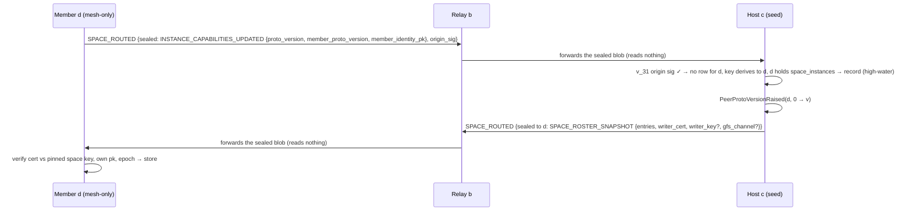
```mermaid
sequenceDiagram
    participant D as Member d (mesh-only)
    participant B as Relay b
    participant C as Host c (seed)
    D->>B: SPACE_ROUTED {sealed: INSTANCE_CAPABILITIES_UPDATED {proto_version, member_proto_version, member_identity_pk}, origin_sig}
    B->>C: forwards the sealed blob (reads nothing)
    C->>C: v_31 origin sig ✓ → no row for d, key derives to d, d holds space_instances → record (high-water)
    C->>C: PeerProtoVersionRaised(d, 0 → v)
    C->>B: SPACE_ROUTED {sealed to d: SPACE_ROSTER_SNAPSHOT {entries, writer_cert, writer_key?, gfs_channel?}}
    B->>D: forwards the sealed blob (reads nothing)
    D->>D: verify cert vs pinned space key, own pk, epoch → store
```

**Carried by items.** An author household puts its cert for the current
epoch in the relayed public-post inner (`public_relay.writer_cert`). It is
not part of the author signature — it authenticates itself against the
space key, and older subscribers ignore it.

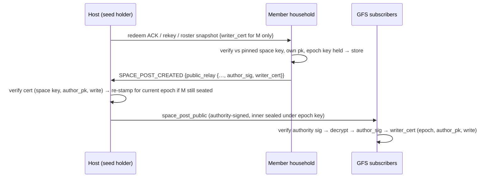
```mermaid
sequenceDiagram
    participant H as Host (seed holder)
    participant M as Member household
    participant G as GFS subscribers
    H->>M: redeem ACK / rekey / roster snapshot {writer_cert for M only}
    M->>M: verify vs pinned space key, own pk, epoch key held → store
    M->>H: SPACE_POST_CREATED {public_relay {…, author_sig, writer_cert}}
    H->>H: verify cert (space key, author_pk, write) → re-stamp for current epoch if M still seated
    H->>G: space_post_public (authority-signed, inner sealed under epoch key)
    G->>G: verify authority sig → decrypt → author_sig → writer_cert (epoch, author_pk, write)
```

**Verification and the migration tripwire.** A receiver that finds a cert
(`SpacePublicInbound`, and the relaying seed holder in
`SpacePublicOutbound._relay_remote_authored`) checks the suite, the
signature against the pinned space key, the space, the envelope's epoch, that
`instance_pk` equals the inner's `author_pk`, and `write` scope. A present
cert that fails drops the item with a WARNING. The relaying host re-stamps a
cert only while the author household still holds a seat that permits a post
(never a `comment` cert onto a post). An item with NO cert is a pre-v_49
author and keeps today's behaviour — authorized by the host's authority
signature — but the host relays such a hint only from an origin below v_49
whose pinned identity key is the inner's `author_pk` (a v_49 author always
attaches its cert; a hint without one is a stripped cert). For a mesh-only
origin we hold no `remote_instances` row for, the household key is the
`author_pk` that derives to its instance id — the same self-authentication
the v_31 routed-origin check verified its envelope with — so mesh members
keep the relay and can be re-stamped. That no-cert
branch is the migration tripwire: once every member household ships v_49 it
can become a refusal.

**Epoch freshness.** A cert is valid for its whole epoch, so receivers bound
the epoch too: a **member-authorized** (cert-only) item is accepted only at
the newest content epoch the receiver holds, or at the previous one for
`WRITER_CERT_EPOCH_GRACE_S` (10 min) after the newest key arrived there
(`space_keys.created_at`) — `SpaceWriterCertService.check_item`. The grace
lets a post sealed just before a rotation land; it needs no seed holder
online (an expiry on the cert would). A **host-signed** item — every
GFS-relayed item today, which the host re-stamped at its own current epoch —
skips the gate: the authority signature is the authorizer, and a stale epoch
there is late delivery, not revocation. A catch-up or backfill path must not
run the gate either.

**Revocation = rotation.** Any change that weakens a household's rights
rotates the content key, so its old cert dies with the epoch: a role change
from write to comment or none (remote or local), a household leaving the
space (`SPACE_INSTANCE_LEFT`, see "Member leave (v_49)"),
`allow_subscriber_comment` turned off while a follower seat exists,
and — as before — every kick and ban. Promotions do not rotate; the new
cert is delivered in a roster snapshot, and turning follower comments on
sends each follower household its `comment` cert at once.

**Residuals.** A revoked writer can still post until the rotation reaches a
receiver, plus the 10-minute grace — and if no seed holder is online to
rotate, until one is. Before this release demotion did not rotate at all.

**Writer group key (v_50, strict spaces).** Where the owner set
`gfs_publish_mode = "strict"`, the same four channels also carry
`writer_key` — the epoch's writer group key (`{writer_key_suite, space_id,
epoch, writer_seed, writer_key_cert}`, derived from the space seed per epoch)
— next to the cert, only to a v_50 household holding a publishing scope
(`write` and `comment` get the same key). The receiver verifies it against
the pinned space key and keeps it KEK-wrapped on `space_keys.writer_key`; it
signs the household's anonymous publishes to the connection server (see
[`discovery.md`](./discovery.md#member-publish-strict-mode-v_50)). It
rotates with the epoch, so revocation = rotation covers it too; the switch
to strict rotates once so the key arrives with a fresh epoch. The setting is
owner-only: a member household takes it only from the owner household's own
`SPACE_CONFIG_CHANGED` (a delegated admin's signed config can't flip it), and
the host pins it like `allow_subscribers`.

**Private spaces and the connection server (`private_gfs`, 2026-10-04).**
Whether a PRIVATE space touches a connection server at all is an
**owner-only** feature flag, `SpaceFeatures.private_gfs` — OFF for every new
private space, federated in `SPACE_CONFIG_CHANGED`, taken by a member
household only from the owner household's own config and pinned on the host
(like `gfs_publish_mode`; a forwarded `update_config` is pinned too). OFF:
no `gfs`-type invite link (only `internal` links — see
[`invites.md`](./invites.md#the-link-type-gfs-or-internal)), no channel, no
grant. ON: `gfs` links are allowed and the space gets the channel below,
with a seat for every member household. Turning it OFF is refused with `409
PRIVATE_GFS_LINK_MEMBERS` while link-joined (`space_session`) households are
still members; otherwise the host deletes the `gfs` links, unregisters the
channel and rotates the content key.

**Private-space channel grant (v_51).** In a PRIVATE space whose owner turned
`private_gfs` ON and that has a remote member household, the same four
channels also carry `gfs_channel` — the household's per-epoch grant for the
space's opaque connection-server channel (`{channel_suite, space_id,
channel_id, channel_pk, epoch, epoch_offset, gfs_ids, binding_sig_suite,
binding_sig, channel_pass, channel_cert?, writer_key?}`), to every v_51
member household with a live seat — a pass for every member household (a
reader gets a pass-only grant), a cert or writer key for writers. It is bound
to the space by the authority key, verified against the pinned space key and
kept KEK-wrapped on `space_keys.gfs_channel`; a snapshot's grant is taken
only from the host. See
[`discovery.md`](./discovery.md#private-spaces-opaque-channels-v_51).

## Flow — rekey

Triggered on every member-removal path (#121, PR #432): local kick,
ban, and §D1b cross-household kick. The host rotates the space's epoch
via `SpaceContentEncryption.rotate_epoch`, exports the new 32-byte
AES-256 key, and fires `SPACE_KEY_EXCHANGE_REKEY` to every remaining
member household via `broadcast_to_space_members`. The §D1b
audit-fix on `remove_remote_member` strips the kicked household's
`space_instances` row before the broadcast set is computed, so the
former member's household naturally never receives the new key.
Receivers persist via the same
`apply_space_content_key_from_metadata` helper the §D1b accept path
uses (re-wraps under local KEK so the at-rest invariant holds).

**Receiver authenticates the rotator before importing (security gate).**
A rekey *pins* the current epoch onto whatever key it carries (the
smallest-`rotated_by` collision rule below), so importing one from any
confirmed peer would let a routing relay or a removed-but-still-meshed
ex-member force every member household onto an attacker-chosen key — a
persistent content-key hijack + DoS. The inner `space_content_key` meta is
therefore **space-authority-signed**, exactly like `SPACE_CONFIG_CHANGED`
(Phase 4a): the rotator signs it with the space's Ed25519 seed
(`authority_sig` / `authority_sig_suite`), and the receiver accepts the
rekey only if **(a)** the §24.11-authenticated `from_instance` is the
space's `owner_instance_id` (owner back-compat — pre-authority owners emit
an unsigned rekey) **OR (b)** a valid `authority_sig` verifies against
`spaces.identity_public_key`. The trust root is the *signature*, not the
sender, so a delegated admin (seed-holder) can rotate while the owner is
offline. Fail-closed: a present-but-invalid / wrong-key / unknown-suite
signature DROPS (never falls through to the owner gate); a non-owner rekey
with no signature DROPS; and an authority-signed rekey with a blank
`rotated_by` DROPS (defence-in-depth — a legit rotator always stamps its
real instance id, so the smallest-wins tiebreak only ever compares
authenticated non-empty ids). The gate is scoped to the rekey handler
(`_on_key_exchange_rekey`); the §D1b *initial* key handoff in the invite
snapshot is authenticated by the invite flow and is unaffected.

The flow is fire-and-forget — no separate ACK event. If a peer misses
the broadcast (transport blip, household offline), the §25.6 direct-
space-sync handshake refreshes the key on the next sync cycle. Old
epoch keys stay on disk so historical content remains decryptable for
legitimate readers; only future content under the new epoch is gated.

Forward-secrecy bound: at the *transport* level — the kicked
household never receives the new key — and at the *at-rest* level on
the kicked household itself, because removing the member also drops
the local `space_members` row that gated their read access. A
malicious user with raw DB access still has the old keys (single KEK
per household), which is the documented at-rest threat model.

**Delegated admin + concurrent rotation (Phase 4b).** With
`delegated_admin_authority` ON, a seed-holding delegated admin can
ban/remove a member while the owner is offline: it tombstones the member
locally (the `SPACE_MEMBER_LEFT` roster gossip is space-authority-signed,
so every household — including the owner on reconnect — accepts it by
verifying the signature, not `from_instance`) and runs the same
`rotate_epoch` + `SPACE_KEY_EXCHANGE_REKEY` forward-secret rotation
instead of forwarding to the host. Two admins can therefore each mint
epoch N+1 with a *different* random key concurrently. To converge, every
`SPACE_KEY_EXCHANGE_REKEY` carries `rotated_by` (the minting household's
id), and `import_key` keeps the row whose `rotated_by` sorts
lexicographically **smallest** at an existing `(space_id, epoch)` — so
every receiver lands on the same key regardless of arrival order. A
NULL/absent `rotated_by` (pre-Phase-4b peer) never clobbers a stamped
row; both NULL degrades to last-writer-wins. The acting household's local
removal drops the member from `space_members` *before* rotation, so the
forward-secrecy ordering holds on the delegated path too. (Delegation
OFF / no seed → the old v_15 forward-to-host path; the host owns
rotation.) `rotated_by` and the authority signature fields
(`authority_sig` / `authority_sig_suite`) are additive optional fields on
an existing event — an older peer ignores them and imports via the owner
back-compat path — so no capability bump is required.

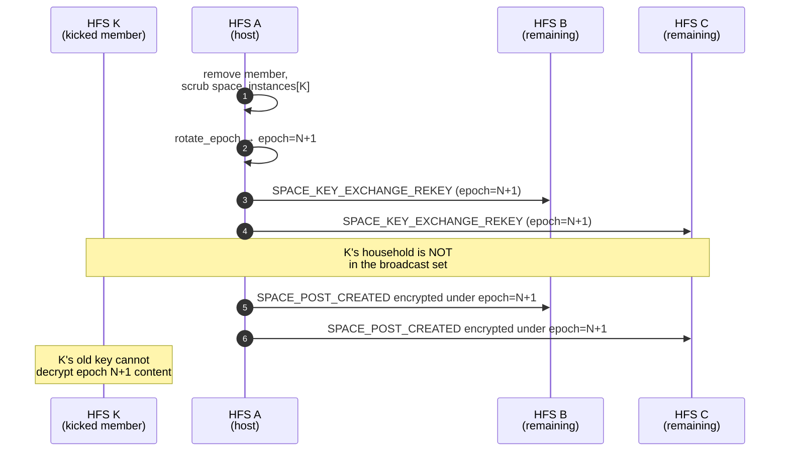
```mermaid
sequenceDiagram
    autonumber
    participant K as HFS K<br/>(kicked member)
    participant A as HFS A<br/>(host)
    participant B as HFS B<br/>(remaining)
    participant C as HFS C<br/>(remaining)
    A->>A: remove member,<br/>scrub space_instances[K]
    A->>A: rotate_epoch → epoch=N+1
    A->>B: SPACE_KEY_EXCHANGE_REKEY (epoch=N+1)
    A->>C: SPACE_KEY_EXCHANGE_REKEY (epoch=N+1)
    Note over K,C: K's household is NOT<br/>in the broadcast set
    A->>B: SPACE_POST_CREATED encrypted under epoch=N+1
    A->>C: SPACE_POST_CREATED encrypted under epoch=N+1
    Note over K: K's old key cannot<br/>decrypt epoch N+1 content
```

## Out-of-order key arrival

`PendingDecryptsCache` (#122, PR #433) handles the race where a
federation payload that needs the space content key lands before the
key has been imported. The classic case is §25.6 sync chunks arriving
during a §D1b accept handshake — the host starts shipping content
immediately after the invite envelope is accepted, but the receiver's
`apply_space_content_key_from_metadata` may not yet have committed
the new `space_keys` row.

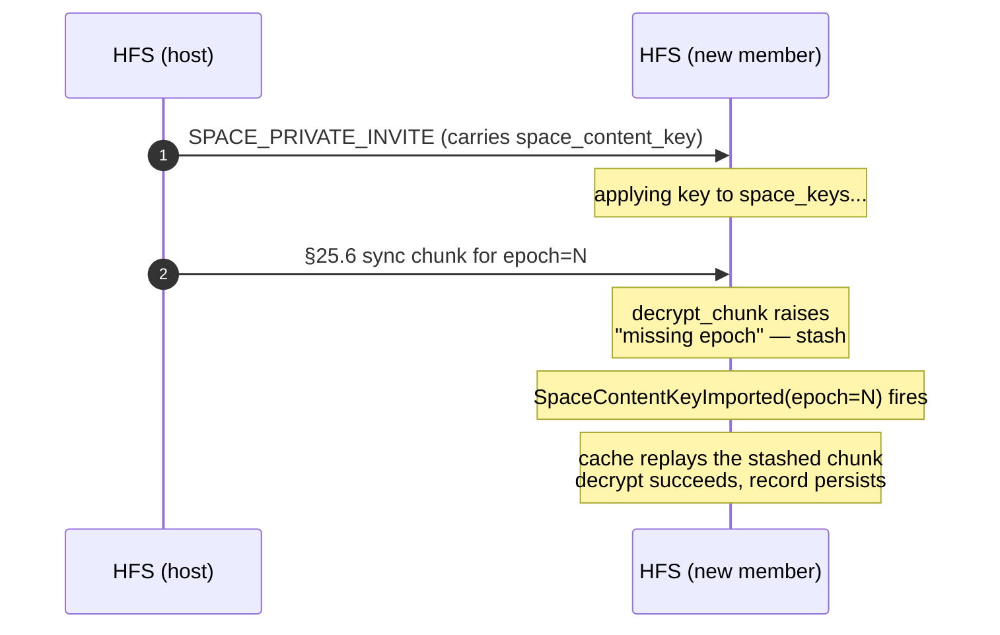
```mermaid
sequenceDiagram
    autonumber
    participant H as HFS (host)
    participant N as HFS (new member)
    H->>N: SPACE_PRIVATE_INVITE (carries space_content_key)
    Note over N: applying key to space_keys...
    H->>N: §25.6 sync chunk for epoch=N
    Note over N: decrypt_chunk raises<br/>"missing epoch" — stash
    Note over N: SpaceContentKeyImported(epoch=N) fires
    Note over N: cache replays the stashed chunk<br/>decrypt succeeds, record persists
```

The cache is process-local and bounded (`DEFAULT_MAX_ENTRIES = 256`).
Restart wipes everything — the §25.6 sync handshake on the next
reconnect re-pulls anything that hadn't drained. Decrypt failures
that are NOT "missing epoch" (tampered ciphertext, wrong AAD,
malformed wire) drop as before — those are not race-recoverable and
stashing them would mask a real attack.

## Admin key share

`SPACE_ADMIN_KEY_SHARE` lets two admins hand each other the space's
current key material — used when ownership is transferred or a
co-admin is added so the new admin can decrypt pre-existing content
without a full resync.

## Roster gossip (v_23+)

The space roster is **peer-replicated** so every member household converges
its view, not just the host. On every roster mutation the host emits an
**authority-signed** `SPACE_MEMBER_JOINED` (seat / role upsert) or
`SPACE_MEMBER_LEFT` (remove / kick / ban) and broadcasts it to every member
household via `broadcast_to_space_members` (targets `space_instances` — the
non-member-relay rule holds; **never** `broadcast_to_all`). Before v_23 a
join/leave was host-only and other households learned implicitly via §25.6
sync or a fresh invite.

Trust is in the **signature, not the sender**. The payload carries
`authority_sig` + `authority_sig_suite` produced with the space's Ed25519
seed (`sign_authority_event`); a receiver verifies against the space's PUBLIC
key (`spaces.identity_public_key`) regardless of which household relayed it
(any seed-holder may emit — the owner today, delegated admins in later
phases). The signature is computed over the payload with the two signature
fields stripped via `strip_authority_sig_fields` — used identically on both
sides so the canonical bytes match.

Payload:
`{space_id, user_id, instance_id, display_name, user_pk, role,
member_version, roster_version, authority_sig, authority_sig_suite}`.
`member_version` (monotonic per `(space_id, user_id)`) and `roster_version`
are both sourced from the space's dedicated atomic `roster_sequence`
(migration 0036), decoupled from `config_sequence` so a role / ban / roster
mutation no longer bumps the config-LWW version (and a delegated admin's
offline config edit can't lag behind the owner at an equal sequence).
`roster_sequence` is backfilled from `config_sequence` once for continuity.
The receiver's
version-guarded CRDT merge (`apply_member_event`) converges regardless of
delivery order: a strictly-greater version wins, removal wins an
equal-version tie, and a stale/replayed event is dropped (a removed member is
never resurrected). The §D1b invite snapshot ships `member_version` per
roster entry + a `roster_version` so a freshly-invited joiner starts
already-converged. Gated per recipient on
`FederationCapability.MIN_FOR_SPACE_ROSTER_GOSSIP`; a sub-v_23 household is
skipped silently and keeps learning the roster via the snapshot / sync path.

A receiver DROPS the event (logged at WARNING) when the space is unknown
locally, the signature is absent / forged / signed by a key other than the
space seed, or the suite is unknown (crypto-suite rule — no default fallback).

```mermaid
sequenceDiagram
    autonumber
    participant H as HFS H (host / seed-holder)
    participant A as HFS A (member)
    participant W as HFS W (member)
    H->>H: roster mutation<br/>(add / remove / role / ban)
    H->>H: sign payload with space Ed25519 seed<br/>(member_version = roster_sequence)
    H->>A: SPACE_MEMBER_JOINED / _LEFT<br/>(authority_sig over the bare payload)
    H->>W: SPACE_MEMBER_JOINED / _LEFT
    Note over A,W: verify authority_sig against<br/>spaces.identity_public_key (NOT from_instance)
    Note over A,W: apply_member_event — version-guarded merge<br/>(removal-wins-tie; stale dropped)
```

## Space roles (v_41)

One role per seat, ordered `owner > admin > moderator > member >
subscriber` (`SpaceRole`, `domain/space.py`). Authority comes in two
tiers, each one frozenset that every guard — local and federated — reads:

| Tier | Roles | What it covers |
|---|---|---|
| **Settings** (`SETTINGS_AUTHORITY_ROLES`) | owner, admin | config, features, access levels, members and roles, invites, bans / kicks, ownership, key rotation, archive / delete, zones, timetables, bots, themes, `@here`, join requests, multi-admin votes, the delegated signing seed, renaming / deleting someone else's whole gallery album |
| **Content** (`CONTENT_AUTHORITY_ROLES`) | owner, admin, **moderator** | the moderation queue of every feature (list / approve / reject), editing and deleting other people's posts and comments, deleting single gallery items, deciding RSVP requests on someone else's event; bypasses `MODERATED` for one's own writes |
| **Writer** (`WRITER_ROLES`) | owner, admin, moderator, member | creating content |

An `ADMIN_ONLY` feature stays owner / admin only — a moderator is
refused like a member (see [Feature access levels](#feature-access-levels-v_42)). Role-exact `admin` checks stay role-exact: a
remote `moderator` seat never drives `SPACE_REMOTE_ADMIN_ACTION` /
`SPACE_REMOTE_ADMIN_KICK` (dropped), is not in `list_admin_instances`
(never receives `SPACE_ADMIN_KEY_SHARE`), and is not a multi-admin
voter. On the federated side `SpaceAuthorship.is_admin_household` /
`admin_as` are the settings tier (zones, timetables) and
`has_content_authority` / `moderates_as` the content tier (`may_mutate`,
a moderation-held post's re-edit, gallery item deletes, RSVP overrides);
`may_mutate(settings=True)` and the album-tombstone check keep a whole
album on the settings tier.

**Who may change a role** (`role_change_allowed`): the owner sets
`admin` / `moderator` / `member` on any non-owner seat; an admin moves a
seat only between `member` and `moderator`; nobody else changes roles.
On a member stub the change is forwarded to the host (v_47, see
[Forwarded role changes](#forwarded-role-changes-v_47)). Nobody *joins* as a moderator: an invite link refuses
the role and `SEATABLE_REMOTE_ROLES` omits it — though a household already
seated as a moderator that re-redeems its link (a lost ACK) is re-ACKed with
the seat it holds (`REACKABLE_REMOTE_ROLES`).

**Older peers.** The roster gossip and snapshot are authority-signed, so
a JOINED carries `role: "moderator"` to everyone; every v_30+ receiver
coerces an unknown role down to `member` (`mirrorable_remote_role`), and a
moderator's JOINED rides the v_30 floor like a subscriber's. A moderator's
LEFT (kick, ban, leave) is signed as `role: "member"` and is **not**
floored, so the removal reaches every v_23+ household.
`SPACE_MEMBER_ROLE_CHANGED` is different — a v_40 receiver drops an
unknown role, so a demoted admin would stay `admin` there — so a household
below v_41 is sent the same event with `role: "member"`
(`broadcast_to_space_members(legacy_payload=…, legacy_below=…)`); the §25.6
`members` stream likewise ships a moderator as `member` to a requester
below v_41. Promoting a user whose **home** household is below v_41 is
refused (403, code `HOUSEHOLD_UPGRADE_REQUIRED`).

## Feature access levels (v_42)

A space sets one access level per collaborative feature —
`posts_access`, `pages_access`, `tasks_access` (task lists included),
`stickies_access`, `calendar_access` (`SpaceFeatureAccess`, part of the
federated `features` block):

| Level | Who may create / edit / delete |
|---|---|
| `open` | every writer seat (owner, admin, moderator, member) |
| `moderated` ("Reviewed") | a member's **new** item, and their edit / delete of **somebody else's** item, waits in the moderation queue until content authority approves it — on any household holding a content-authority seat (federated moderation, v_43, [`moderation.md`](./moderation.md)); own edits / deletes, layout moves and content authority's own writes proceed |
| `admin_only` | the owner and admins only — moderators and members are read-only for that feature (layout moves — a task reorder, a sticky drag — included) |

Never gated: comments, reactions, poll votes, schedule answers, bazaar
bids / offers, RSVPs and reminders, task comments, closing one's own poll
or settling one's own listing.

The decision is the pure `SpaceFeatures.access_decision(feature, role=,
action=, owns_target=)` → `proceed` / `queue` / `deny`, over a
`ContentAction` (`create`, `edit`, `delete`, `layout`):

| Feature | create | edit | delete | layout |
|---|---|---|---|---|
| posts (every type, polls attached to one too) | create | own edit / a bazaar listing's title | own delete | — |
| pages | create | update, resolve-conflict | delete | — |
| tasks + lists | task / list create | any field, status change, column move, list rename | delete, archive / unarchive, list delete | reorder |
| stickies | create | content, colour | delete | position move |
| calendar | create | update | delete | — |

**Every household enforces its own copy** — the host and each member
household's stub alike (under `moderated`, a read-only seat keeps the
edit / delete of its own item it always had). A local write is refused with 403 and the stable
code `ACCESS_ADMIN_ONLY` (`{"feature": …}`) before it can federate
(`ContentAccessMixin._gate`, in `SpaceService`, `SpaceTaskService`,
`StickyService`, `SpaceCalendarService`, `SpacePageService`; the bot
bridge gates a bot's post on its creator; poll / schedule-poll attach is a
posts create). Two bridges honour the `posts` level for the feed card they
mint: an announced calendar event is mirrored into the feed only when its
creator could post straight away (`SpaceCalendarService` drops the
announcement at the source, `CalendarFeedBridge` re-checks on every
household by the creator's local or mirrored seat), and a finalised
schedule poll adds no calendar event under an `admin_only` calendar.

**Every receiver enforces it again.** Every collaborative write payload —
page / task / task-list / sticky / calendar-event created / updated /
deleted, and post created / updated / deleted — carries `actor_user_id`
(the user who made the write) inside the sealed payload. After the event
family's authorship rule (above), `SpaceAuthorship.access_admits` checks
the receiver's own copy of the level:

1. `open` → admitted.
2. A **create's actor is its author** (`author` / `created_by`): a payload
   `actor_user_id` that names anybody else is refused, so an admin
   household cannot pass its plain member's row off as its admin's (by
   naming the admin or by naming nobody). The one exception is a
   moderation release: a v_42 host's release names the approver as actor;
   a v_43 release names the author and carries the approval block
   (`moderation: {item_id, approved_by}`), which `may_author_approved`
   judges instead of this rule — from the space's **host** only (it alone
   applies queue items). The host relaying a remote member's
   existing row (resume replay) is admitted, as `may_author` admits it.
3. A named actor must hold a live writer seat on the **sending** household
   (`acts_for`) — a household cannot borrow another household's admin. An
   edit / delete of the actor's own row accepts any live seat (a demoted
   author). An actor this household has no record of yet is held until the
   roster gossip seats them (the pending-seat buffer), like a create's
   author.
4. `admin_only` → the actor is an admin as the sender records it
   (`admin_as`; the host's owner, mirrored as a plain `member` seat of the
   host, passes). An edit / delete naming **no** actor is refused from a
   v_42 sender (every v_42 producer names one); from a household that
   advertised less than v_42 — or never advertised — the sending household
   must hold settings authority (`is_admin_household`). The shared bot
   identity gets that household rule only on a **bot's own row** (an
   admin-configured bot's post); as the actor of an edit / delete of
   anybody else's row it is refused.
5. `moderated` → every feature (posts too, from a v_43 sender) admits only
   a content-authority actor (`moderates_as`; from an older sender naming
   nobody, a content-authority household — `has_content_authority`), an
   edit / delete of the actor's own row, a layout move (a sticky drag with
   unchanged content and colour; a task whose only change is its position),
   and a **valid release** (the approval block, v_43). A plain member's
   create, or edit / delete of someone else's row, without one is exactly a
   write that waits for review — every household submits it to the
   reviewers instead — so it is **refused, fail closed, on every receiver**
   (WARNING): a modified member household cannot publish past review —
   posts included, whatever version the sender advertises (an older
   household is named by `PEERS_TOO_OLD` when Reviewed is set). A bot's post
   needs a content-authority household. As locally, a task's
   **assignee** owns its status and position: an edit naming an assignee of
   the held task that changes nothing else is judged as their own row's.

   *Actor-less older senders.* A household below v_42 (or one that never
   advertised) names no `actor_user_id`, so its write is judged by the
   **household**: admitted when the sender is the host or holds a live
   `admin` / `moderator` seat (`has_content_authority`), refused otherwise.
   The residual mirrors `ADMIN_ONLY`'s: a pre-v_42 household with one
   moderator seat passes for all of its users' writes — it gains nothing a
   v_42 household couldn't by naming that moderator, and it shows in
   `PEERS_TOO_OLD` whenever a level is raised. A v_42 sender that names
   nobody is refused.

**Residual — `proto_version` is self-declared.** A household is judged as
"older" by what it advertises in `INSTANCE_CAPABILITIES_UPDATED`. One that
holds an admin seat could under-advertise (claim v_41, or never advertise)
to keep the household fallback for actor-less edits / deletes — only of
rows `may_mutate` already lets it touch, never a create (always judged by
its author). It gains nothing a household with an admin seat couldn't do by
naming that admin, and an under-advertising household shows up in the
admin's `PEERS_TOO_OLD` list whenever a level is raised.

GFS-relayed public / global posts (`space_public_inbound`) are not
re-checked against the level: they arrive inside an envelope signed by the
**space authority** (the owner, or a delegated admin holding the space
seed), which is settings authority already.

A refusal logs at WARNING and changes nothing. A member household's §25.6
sync stream is held to the same rule per record (its creator, as a
`create`); the host's stream is taken whole.

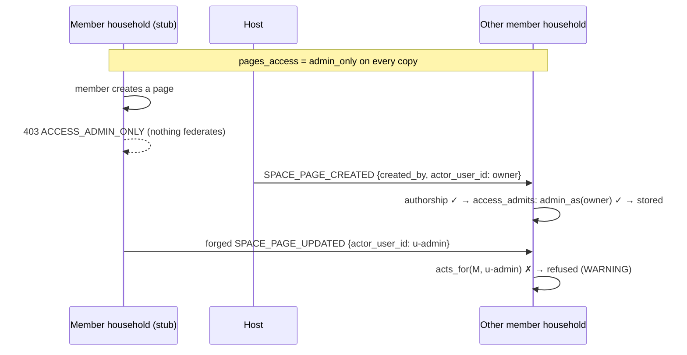
```mermaid
sequenceDiagram
    participant M as Member household (stub)
    participant H as Host
    participant O as Other member household
    Note over M,O: pages_access = admin_only on every copy
    M->>M: member creates a page
    M-->>M: 403 ACCESS_ADMIN_ONLY (nothing federates)
    H->>O: SPACE_PAGE_CREATED {created_by, actor_user_id: owner}
    O->>O: authorship ✓ → access_admits: admin_as(owner) ✓ → stored
    M->>O: forged SPACE_PAGE_UPDATED {actor_user_id: u-admin}
    O->>O: acts_for(M, u-admin) ✗ → refused (WARNING)
```

**Older households.** A v_41 household neither enforces a level for its own
people nor names an actor. Raising a level (any feature off `open`) while a
member household is below v_42 answers 409 `PEERS_TOO_OLD`
`{"households": [{instance_id, display_name, proto_version}]}`; the admin
re-sends the PATCH with `"force": true` to apply it anyway. A host applying
a forwarded remote-admin config edit re-runs the check with its own,
complete view of the member households — only an explicit "apply anyway"
(`force`, carried on the forwarded edit) overrides it there. When the host
refuses, it applies the rest of the edit and keeps every access level as it
was (WARNING); the forwarding admin's PATCH answered `forwarded: true`, so
their settings page says the host decides and shows the level in force —
the config broadcast that follows updates it either way.

## Moderation queue

Under `moderated` every household that may review an item holds its own
copy (`space_moderation_queue`, `SpaceModerationService`, the same id
everywhere): the submitter's household, the space's **host**, and every
household holding a live `admin` or `moderator` seat. Items and decisions
travel between them as `SPACE_MODERATION_SUBMITTED` /
`SPACE_MODERATION_DECIDED` — targeted, sealed sends, never to a plain
member household (v_43, see [`moderation.md`](./moderation.md)). Any
reviewer household may decide an item; an **approval is applied by the
host alone**, which replays the write from its own stored copy through the
feature's normal persist path, so the released content federates exactly
like a direct write, as the submitter's, with the approval block.

**What queues** — `SpaceFeatures.access_decision` answers `queue` for a
plain member's:

* create of any item (a post with its poll / schedule poll / Bazaar
  listing, a page, a task or list, a sticky, a calendar event);
* edit / delete / archive of an item somebody else owns (a task's
  assignees own its status and column moves).

Never queued: own edits / deletes, layout (a same-column task reorder, a
sticky move), comments, reactions, RSVPs, reminders, and every write by the
owner, an admin or a moderator.

**Where it holds** — on every household with content authority (v_43):

* `PATCH /api/spaces/{id}` setting any feature to `moderated` while a
  member household is below v_43 answers **409 `PEERS_TOO_OLD`** (the
  households listed) until re-sent with `force: true`; a forwarded
  remote-admin edit asking for it is applied without the level change
  (WARNING) unless forced.
* A member household submits through the federation: a host below v_43
  answers **409 `HOST_TOO_OLD`** — nothing stored, nothing sent. A
  reviewer household below v_43 is skipped.
* When a household **below v_43** takes its first seat in a space that
  keeps a feature other than posts `moderated`, the space's local owner /
  admins get one `moderation_unavailable` notification ("Reviewed isn't
  available for Tasks in … for members of a household that needs an
  update"): that household cannot submit, and every receiver refuses its
  members' direct changes. It is pushed once per (space, household); a
  v_43 household warns nobody.
* **Personal bots.** Under `moderated` posts a member-scope bot (its
  maker's voice) is refused — `POST /api/bot-bridge/spaces/{id}` answers 403
  `BOT_POSTS_REVIEWED` — rather than queued: a bot is an unattended
  automation, and queuing would silently fill its maker's pending cap and
  publish time-critical notices hours late. A bot made by content authority,
  and a space-scope bot an admin set up, keep posting.
* **Posts queue like every other feature:** a member's post queues on
  their own household and goes to the reviewers (v_43); only a v_42 member
  household still sends it straight on.

**Life of an item.** Submit validates the payload with the live path's
codecs, mints the new item's owner-bound id up front (approval is
idempotent, the item stays the submitter's), stores the proposed state in
`payload_json` and — for an edit — the old values of exactly the changed
fields in `current_snapshot` (the full row for a delete), and answers 202.
Caps: 20 pending per submitter per space, 500 per space (429
`QUEUE_FULL`), 256 KiB per payload (413), a rejection reason ≤ 500
characters. Approve claims the row with a conditional `UPDATE … WHERE
status='pending'` (two moderators approving at once persist it once), checks
the feature's level for the **approver** (`admin_only` → admins only), and
replays it; a page edit whose page changed since submit is 409 `STALE`
until approved with `force` (latest wins); a task / sticky / event edit is
latest-wins per field; an edit of a deleted item expires (410
`TARGET_GONE`), a delete of one is a no-op approval; a disabled feature or
archived space is 409 `FEATURE_UNAVAILABLE` (reject still works); an author
who left is expired. An approved post's `created_at` is the moment of
**approval**, not of submission, so it lands at the top of the feed when it
appears (the queue item keeps `submitted_at`); the post id is still the one
minted at submit. Items expire after 7 days, and the content of
decided / expired items is NULLed 7 days later
(`ModerationExpiryScheduler`, hourly). Approving an item past `expires_at`
expires it (410 `EXPIRED`). Any household whose user holds content
authority approves (there is no `NOT_HOST` any more): on the host the item
is applied at once (an item a moderator rejected may still be approved by an
admin or the owner — an equal or higher role; a moderator never overturns
an admin's or owner's rejection); on a reviewer household the same gates run and the
approval is sent to the host (`200 {status: "publishing"}`; the item reads
"Approved — publishing…" until the host's announcement arrives — this
needs the host online).

**A failure part-way never reopens published content.** If the apply fails
before the item's primary write landed, the claim is released — and only
from the status this approve claimed, so it can never reopen an item
decided meanwhile. If the content already landed (the post, the event,
the edit reads back as proposed) and only a later step failed — the poll /
schedule / listing riding with a post, a bus publish, a federation enqueue
— the item **stays approved** (WARNING) and the approve answers
`complete: false`; approving the approved item again creates whatever is
still missing (attachment creation is idempotent) and answers
`complete: true`. A post's attachments can't share one transaction with it
(separate repos, each publishing its own event), hence resumable rather
than atomic. Two guards keep a resume from ever duplicating:

* **One apply per item at a time.** While an approve or resume of an item
  runs, another answers 409 `IN_PROGRESS` (a double-click, two moderators).
  A household is one process with one database writer, so an in-process
  check-and-add serialises it without any new column.
* **Create-once in the repo.** Each attachment is written once per post in
  one transaction — the poll row and its options, the schedule and its
  slots (`INSERT … ON CONFLICT(post_id) DO NOTHING`, children only when the
  parent was new), the listing (an insert that never updates) — and its
  event is published only by the call that created it.

A resume runs the same checks as an approve first (expiry, archived space,
feature off, the feature's level for the approver, the author still a
writer); it never changes a published item's status.

**Who sees pending content** — only its submitter (`GET …/moderation/mine`,
the `space.moderation.mine` receipt frame) and the space's content
authority (`GET …/moderation`, `space.moderation.*` frames,
`moderation_pending` bell) — on the households that hold it. No feed,
list, search index, sync stream, export or backup carries it, and the
only federation event that does is `SPACE_MODERATION_SUBMITTED`, sent to
the reviewer households alone (see [`moderation.md`](./moderation.md#confidentiality)); the submitter's
`moderation_decided` bell is title-only and never carries the reason. The
media a pending item will publish is kept by the orphan sweep (its payload
counts as a reference) until it is decided.

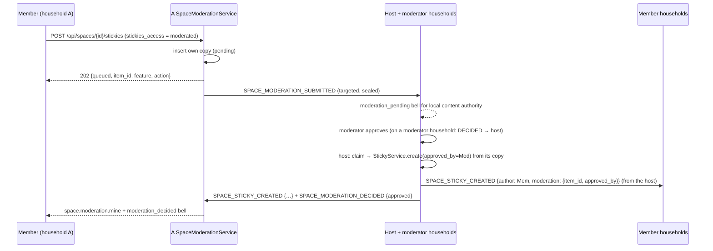
```mermaid
sequenceDiagram
    participant Mem as Member (household A)
    participant A as A SpaceModerationService
    participant R as Host + moderator households
    participant O as Member households
    Mem->>A: POST /api/spaces/{id}/stickies (stickies_access = moderated)
    A->>A: insert own copy (pending)
    A-->>Mem: 202 {queued, item_id, feature, action}
    A->>R: SPACE_MODERATION_SUBMITTED (targeted, sealed)
    R-->>R: moderation_pending bell for local content authority
    R->>R: moderator approves (on a moderator household: DECIDED → host)
    R->>R: host: claim → StickyService.create(approved_by=Mod) from its copy
    R->>O: SPACE_STICKY_CREATED {author: Mem, moderation: {item_id, approved_by}} (from the host)
    R->>A: SPACE_STICKY_CREATED {…} + SPACE_MODERATION_DECIDED {approved}
    A-->>Mem: space.moderation.mine + moderation_decided bell
```

## Cross-household admin promotion

`SPACE_MEMBER_ROLE_CHANGED` (#114, PR #434, v_8+) propagates a role
change for a remote member to every member household. The host emits
this on every `PATCH /api/spaces/{id}/remote-members/{instance}/{user}`
that moves a seat between `'member'`, `'moderator'` (v_41) and
`'admin'`. Owner is intentionally not assignable to a remote member —
ownership carries local-only privileges (dissolve, ownership transfer)
that can't sensibly cross households.

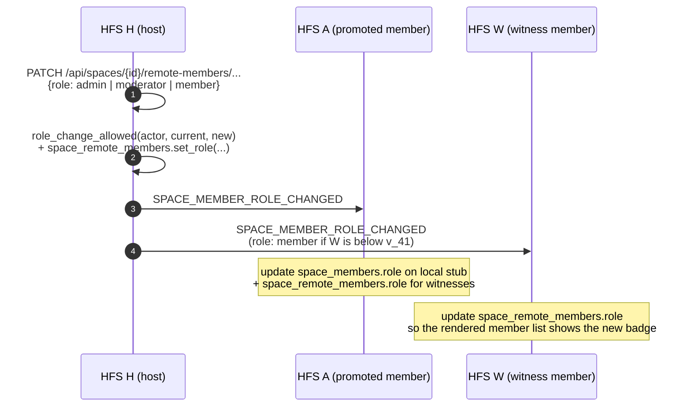
```mermaid
sequenceDiagram
    autonumber
    participant H as HFS H (host)
    participant A as HFS A (promoted member)
    participant W as HFS W (witness member)
    H->>H: PATCH /api/spaces/{id}/remote-members/...<br/>{role: admin | moderator | member}
    H->>H: role_change_allowed(actor, current, new)<br/>+ space_remote_members.set_role(...)
    H->>A: SPACE_MEMBER_ROLE_CHANGED
    H->>W: SPACE_MEMBER_ROLE_CHANGED<br/>(role: member if W is below v_41)
    Note over A: update space_members.role on local stub<br/>+ space_remote_members.role for witnesses
    Note over W: update space_remote_members.role<br/>so the rendered member list shows the new badge
```

The role assignment is the foundation. The actual cross-household
admin *action* (kick) rides `SPACE_REMOTE_ADMIN_KICK` documented
below.

### Forwarded role changes (v_47)

The host's roster is the one every household trusts, so a role is never
rewritten on a stub. An admin on a member household who changes a role
(`PATCH /members/{user_id}` or `/remote-members/{instance}/{user}`) has
it **forwarded**: the stub checks what it can (the actor is an admin
there, `role_change_allowed` against its mirror, the target isn't the
owner) and ships `SPACE_REMOTE_ADMIN_ACTION` with action
`set_member_role` and params `{instance_id, user_id, from_role, role}` (all inside
the encrypted payload; `instance_id` is the target's home household — the
host's own id for a host-local member). The route answers 202
`{forwarded: true}`; the SPA says "Sent to the space's host".

The host re-checks everything with its own data before it runs or queues
anything (`_validate_forwarded_role_change`):

- the actor's live seat on the **signed sender** (`from_instance`) must be
  `admin` — a moderator, a member, a demoted admin, or an actor named on
  another household is dropped;
- `role_change_allowed(actor_role, target_role, new_role)` for **that
  seat's** role — never the owner's, so an admin's request stays
  member ↔ moderator even when the owner approves it;
- the target seat exists and isn't the owner; the role is assignable;
- the seat still holds `from_role` (the role the stub saw) — a request
  that waited in an outbox or for the owner's approval can't undo a newer
  decision;
- the v_41 moderator floor on the target's home household.

Then the usual `delegated_admin_authority` gate applies: ON → applied
immediately; OFF → an owner-only approval, and on APPROVE the actor's seat
is read again and the change re-validated. The approval runs as the
proposal's signer-bound `proposed_by_*`, and a `remote_admin_action`
proposal can only be opened by this gate — the `propose` verb (and the
local proposals route) refuse it, so nobody hand-builds one naming another
actor. The owner's card reads "make Carol a moderator"; a newer request
for the same seat replaces the older, and a household holds at most 20
open requests per space (the cap is checked first; a replacement only
ever replaces the same household's own request). An applied change federates
like a host-local one (`SPACE_MEMBER_ROLE_CHANGED` + roster gossip), which
is how the stub learns it; its Members list refetches on the resulting
`space.config.changed` frame. **There is no refusal echo** (same as a
forwarded config edit): a change the host declines simply never shows up.
Since only the owner (who sits on the host) may grant or revoke admin, the
forward path never moves an admin seat — no signing-seed share and no
v_44 rotation can be triggered through it.

A host below v_47 drops the unknown action silently, so the stub gates
the forward on `peer_supports(host, MIN_FOR_FORWARDED_ROLE_CHANGE)` and
answers 409 `HOST_TOO_OLD` (`feature: "role_change"`) instead. A forward
that reached nobody and was not queued (no route, unknown host) answers
503 `HOST_UNREACHABLE` — for every forwarded admin action — so the SPA
never says "sent" for nothing. The stub knows the owner's seat from the
host's invite roster and the host's own roster snapshot, which now ships
the owner's seat as `role: "owner"` (`spaces.owner_user_id`, migration
0070; every v_32+ receiver mirrors that row as `member`, as before). It
marks the seat `owner` in its member list and refuses a role change on it.
After `transfer_ownership` the host's config carries the new
`owner_username`; the stub records it and forgets the old owner seat until
the next snapshot from the host names the new one. A signed config from a
seed holder can't move ownership.

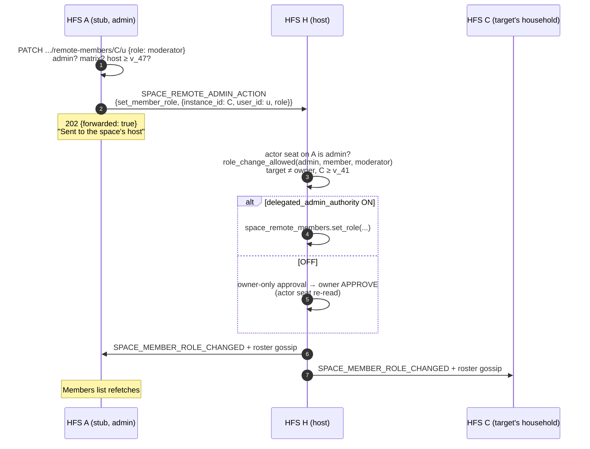
```mermaid
sequenceDiagram
    autonumber
    participant A as HFS A (stub, admin)
    participant H as HFS H (host)
    participant C as HFS C (target's household)
    A->>A: PATCH .../remote-members/C/u {role: moderator}<br/>admin? matrix? host ≥ v_47?
    A->>H: SPACE_REMOTE_ADMIN_ACTION<br/>{set_member_role, {instance_id: C, user_id: u, role}}
    Note over A: 202 {forwarded: true}<br/>"Sent to the space's host"
    H->>H: actor seat on A is admin?<br/>role_change_allowed(admin, member, moderator)<br/>target ≠ owner, C ≥ v_41
    alt delegated_admin_authority ON
        H->>H: space_remote_members.set_role(...)
    else OFF
        H->>H: owner-only approval → owner APPROVE<br/>(actor seat re-read)
    end
    H->>A: SPACE_MEMBER_ROLE_CHANGED + roster gossip
    H->>C: SPACE_MEMBER_ROLE_CHANGED + roster gossip
    Note over A: Members list refetches
```

### Delegated-admin signing-seed share (`SPACE_ADMIN_KEY_SHARE`, v_22+)

A space's authority events are signed with the space's Ed25519 seed
(the private half of `identity_public_key`), which normally lives only
on the owner household. When the owner opts into
`SpaceFeatures.delegated_admin_authority`, `SPACE_ADMIN_KEY_SHARE`
hands that seed to a **remote admin** household so it can sign
space-authority events with the owner offline.

The owner sends on two edges: promoting a remote member to ADMIN
(`set_remote_member_role`), and flipping the flag False→True
(`update_config` distributes to every current remote admin household,
deduped by instance via `space_remote_members.role == 'admin'`). The
payload is `{space_id, space_seed: b64url(32-byte seed),
seed_suite: "ed25519-seed"}` and it travels **only** over the
encrypted peer-pair path (`send_with_mesh_fallback`) addressed to that
one household — **never broadcast**, because a non-member relay must
never see the signing key.

The receiver **fails closed**: it stores the seed only when the
§24.11-verified `from_instance` is the space's `owner_instance_id`,
its *own* local copy of the space has `delegated_admin_authority` ON,
the `seed_suite` is recognised (`SUPPORTED_SEED_SUITES`, no default
fallback), and the seed b64url-decodes to exactly 32 bytes. Anything
else is dropped (logged) and nothing is stored. Receipt is logged at
INFO as the key-blast-radius audit event. From v_44 the share also
carries `key_epoch` and, once the key has rotated, the owner's
`authority_cert`; the receiver applies the cert first and then **refuses a
seed that is not the private half of the key it pins** (that check closes
an older gap where any 32 bytes were stored). Revoking an admin household,
or turning the flag back off, rotates the key — see
[Authority key rotation on admin revocation](#authority-key-rotation-on-admin-revocation-v_44).

**Trust boundary.** A seed-holding admin household can sign anything the
space key signs — roster gossip and roster snapshots included — so it can
seat, re-role or remove members in every household's roster mirror, and
through that decide whose content the §24.11 authorship rule accepts.
Sharing the seed makes that household a co-authority of the space, not
just an admin; the owner opts into it per space. From v_44 that authority
ends with the admin seat: the owner rotates the key the moment the
household's last admin seat goes (or the flag is turned off).

Gated on `FederationCapability.MIN_FOR_SPACE_ADMIN_KEY_SHARE`: against
a sub-v_22 admin household (no handler) the owner SKIPS the send and
logs at WARNING rather than blasting a private key at a peer that
would drop it. There is no safe degraded path for distributing a
private signing key.

```mermaid
sequenceDiagram
    autonumber
    participant O as HFS O (owner)
    participant A as HFS A (remote admin)
    participant R as HFS R (relay / non-member)
    Note over O: delegated_admin_authority ON<br/>+ promote A to ADMIN (or flag flips on)
    O->>O: peer_supports(A, v_22)?
    O-->>A: SPACE_ADMIN_KEY_SHARE<br/>(encrypted peer-pair; seed + ed25519-seed suite)
    Note over R: never on the path — seed is<br/>NEVER broadcast / relayed
    A->>A: verify from_instance == owner<br/>+ local flag ON + 32-byte seed
    A->>A: set_space_seed(space_id, seed)<br/>(INFO audit log)
    Note over A: A can now sign space-authority<br/>events with O offline
```

#### Membership ops offline-of-owner (delegated invite + seat)

Once a delegated admin holds the seed, it can run the **full
invite → seat → key-handoff → roster-converge** flow with the owner
offline — no new event type and no capability bump; only the
*authorization* widens. `SpaceService.invite_remote_user` is gated by
`_require_admin_or_owner` (admin **or** owner, not owner-only): it mints
a local invite token and ships `SPACE_PRIVATE_INVITE` whose encrypted
`space_meta` already carries the current content key
(`build_space_snapshot_for_federation` → `export_current_key`). When the
invitee accepts, the seating household emits an authority-signed
`SPACE_MEMBER_JOINED` roster gossip (signed with the space seed via
`ensure_space_seed`); every member household verifies it against the
space public key and CRDT-merges (`apply_member_event`), so an owner that
was offline at seat-time converges its roster purely from the gossip —
it never had to process the accept.

The gate is delegation-aware. A **non-owner ADMIN** household may mint an
authoritative invite **only** when its local copy of the space has
`delegated_admin_authority` ON (it then holds the seed, so its JOINED
gossip is valid). With the flag OFF the invite is **forwarded to the host
as an owner-approval request** (Phase 6): `invite_remote_user` rides the
existing v_15 `SPACE_REMOTE_ADMIN_ACTION` with action `"invite"` and
params `{invitee_instance_id, invitee_user_id}` (no new event, no
capability bump), and the REST route returns `202
{"status":"pending_owner_approval"}`. The host records a pending
`remote_admin_action` proposal; on the owner's **approve** the host mints
the real `SPACE_PRIVATE_INVITE` as owner. (If the host is too old to
handle remote admin actions the forward raises `SpacePermissionError` —
the correct fail-closed fallback.) The **owner/host** can always invite,
regardless of the flag, minting directly and returning `201 {token}`. If
a delegation-ON, non-owner space ever lacks a seed (the Phase-1 share
never landed) the roster gossip is skipped gracefully but logged at
WARNING — an anomaly, not a silent drop.

#### Config edits offline-of-owner (`SPACE_CONFIG_CHANGED`, v_24+)

Phase 4a extends the same authority-signature model to a space's
**config** (name / description / emoji / features / join-mode /
retention / about). When a seed-holding delegated admin runs
`update_config` on a `delegated_admin_authority`-ON space hosted
elsewhere, `SpaceService.update_config` does **not** forward the v_15
`SPACE_REMOTE_ADMIN_ACTION` to the host — it executes the edit
**locally and authoritatively**: bumps `config_sequence`, persists the
row, and the `SpaceConfigOutbound` broadcast signs the config
`space_meta` with the space seed (`sign_authority_event`). With
delegation OFF or no seed held, it keeps the v_15 forward-to-host
behaviour — where, with delegation OFF, the host now records a pending
**owner-approval** rather than auto-executing (Phase 6a, see
"Cross-household admin actions" above).

Every member household — including the offline owner on reconnect —
applies the edit in `_on_space_config_changed` by verifying the
signature against `spaces.identity_public_key`, **not** by checking
`from_instance == owner_instance_id`. Fail-closed: a present-but-invalid
/ unknown-suite / wrong-key signature is dropped (never falls through to
the owner gate); a non-owner edit with no signature is dropped; an
owner edit with no signature still applies via the legacy path
(back-compat). The signed `space_meta` carries `config_author_instance`
(the editing household) and `config_hlc` (the space's Hybrid Logical
Clock); two admins editing concurrently from the same base
`config_sequence` converge deterministically by a
`(config_sequence, config_hlc, config_author_instance)` lexicographic
last-writer-wins tie-break. At an equal `config_sequence` the LATER edit
wins by HLC — a `"<physical_ms>-<counter>"` clock (`infrastructure/hlc.py`)
advanced once per local config edit by `increment_config_sequence`,
monotonic per node and causally consistent across nodes, so every receiver
derives the same total order — with `config_author_instance` (recorded in
`spaces.config_author_instance`, migration 0032) as the final tiebreak. A
legacy `"0-0"` HLC / older sender ties under the HLC and falls back to the
old `(config_sequence, author)` order, behaviour-identical to pre-0037
(`spaces.config_hlc`, migration 0037). A **clock-abuse guard** drops any
inbound edit whose `config_hlc` physical time outruns the event's own
§24.11-checked envelope timestamp by more than the 300 s drift bound
(`HLC_MAX_DRIFT_MS`) — keyed off the signed envelope ts, not local now, so
the drop is deterministic across receivers and a seed-holder can't stamp a
far-future HLC to win every config race. Toggling
`delegated_admin_authority` itself stays **owner-only** (it is the
owner's policy switch that distributes the seed). Gated on
`FederationCapability.MIN_FOR_ADMIN_AUTHORITATIVE_OPS`; a sub-v_24
member falls back to the owner-only gate and reconciles when the owner
re-broadcasts / §25.6 sync runs.

### Authority key rotation on admin revocation (v_44)

**Why.** A seed-holding admin household can sign everything the space key
signs — config, roster gossip and snapshots, content-key rekeys, GFS
relays, subscriber key handoffs and subscriber queries. Before v_44 the
seed was never taken back, so a household demoted from admin stayed a
co-authority forever.

**When.** The owner host rotates the space authority key under a per-space
lock (`SpaceAuthorityRotationService`) when, with
`delegated_admin_authority` ON, a household loses its **last** admin seat:

1. `set_remote_member_role` admin → moderator or admin → member;
2. `remove_remote_member` of an admin seat (also via
   `SPACE_REMOTE_ADMIN_KICK`);
3. a `ban` of a remote admin (the ban now takes the full cross-household
   removal path, so the seat is really tombstoned);
4. inbound on the owner: roster gossip / a snapshot that tombstones or
   lowers an admin seat — an admin household left, or a delegated admin
   removed another while the owner was offline;
5. inbound on the owner: `SPACE_REMOTE_MEMBER_REMOVED` with which a
   household drops its OWN admin seat;
6. `remove_remote_member` or `ban` of a seat that is ALREADY a tombstone
   whose last role was admin (it ended through a path that did not rotate);

and unconditionally when `delegated_admin_authority` goes ON → OFF (the
new seed is then shared with nobody). A household that keeps another admin
seat keeps the key. With delegation already OFF a revocation still rotates
when a seed was shared at the current key epoch
(`spaces.authority_seed_shared_epoch`). The triggers all publish
`SpaceAdminAuthorityRevoked`; the rotation service re-checks the seats
(tombstones keep the seat's last role, so no extra table is needed).

**Epoch.** A rotation's `key_epoch` is `max(current + 1, unix seconds)`
(capped at 2^63−1). An owner restored from a backup or Recovery Kit taken
before a rotation therefore still issues a HIGHER epoch than the one its
members hold — and the first boot after either restore rotates every hosted
space with an authority history (`RecoveryReconnectService
.maybe_rotate_space_authority`), so a key an admin revoked since the backup
is retired again. The restored roster and config are STALE (a household
kicked after the backup is listed live again, a later config edit is
missing), so that rotation is **not a baseline**: its bundle is marked
`baseline: false` and carries the cert plus a fresh content key whose
epoch is at least unix seconds (members may hold epochs the backup never
saw), and members keep the roster and config they have — unless they
missed an earlier rotation's baseline (see the missed-baseline catch-up
above). It also turns
`delegated_admin_authority` OFF on the owner — locally, no config
broadcast, since one would push the stale config as the newest edit — and
shares the new seed with NOBODY: the restored roster may name admins
revoked since the backup. With delegation off and no share at the new
epoch, a later revocation shares nothing either. The owner is notified
("Restored from backup: review space admins, then turn delegated admin
back on", translated through the notification catalog); turning delegation
back on shares the seed with the admins seated then. An owner that lost
the seed of an already-rotated space (`ensure_space_seed`) re-mints it the
same way — through a rotation, so members get a cert — never by swapping
the pin. Legacy spaces: migration 0066 marks every hosted space that holds its
seed as "seed shared at epoch 0", so a pre-v44 owner that turned delegation
off without retiring a shared seed still rotates on the next revocation.

**Owner-certified, not old-key-signed.** The new key is announced by an
`authority_cert` signed with the OWNER HOUSEHOLD's identity key
(`socialhome/authority_cert.py`) — the demoted household holds the old
space key and could otherwise sign a competing rotation. Receivers verify
it against keys they already have: `derive_instance_id(owner_pk)` must
equal the space's `owner_instance_id` (and `owner_pk` must equal the
stored host key when one is stored). The cert is
`{space_id, owner_instance_id, owner_pk, authority_pk,
authority_key_suite: "ed25519", key_epoch, issued_at,
cert_sig_suite: "ed25519", cert_sig}` — it names no member, no reason and
no revoked household.

**Steps on the owner.** (1) mint a fresh keypair at
`authority_key_epoch + 1` in one compare-and-set write; (2) sign the cert;
(3) rotate the content key, the rekey signed with the NEW key; (4) send
each member household `SPACE_AUTHORITY_ROTATED` over its encrypted
pairwise path — only `space_id` is plaintext; the payload carries the
cert, the owner's full `space_meta` (signed with the new key, including
the cert, `authority_key_epoch` and `config_sequence`), the content key
(signed with the new key) and the household's roster entries (as in a
roster snapshot, signed with the new key); (5) if delegation is still on,
re-share the new seed with the cert to every remaining admin household;
(6) re-publish a public / global space to every GFS that already lists it
(each re-pins from the cert; a rotation never tells a new GFS the space
exists), then re-seal the content key to GFS subscribers. The remaining
admins' seed share (step 5) is sent BEFORE the bundles, and the bundle and
legacy rekey go only to households that still hold a live seat — a
household whose last seat was just tombstoned (also through gossip, which
now drops it from `space_instances` like the owner's own removal path does)
gets neither the new content key nor the config or roster.

**Receiver rules** (`services/space_authority_pin.py`, one function every
path uses):

- unknown cert or key suite → refuse (no default);
- the binding checks above, and a 32-byte `authority_pk`;
- apply only when `key_epoch` is **higher** than the epoch held. The same
  epoch with the same key is a no-op; the same epoch with another key, or a
  lower epoch, is dropped at WARNING. A household that missed rotations
  jumps straight to the latest;
- the owner host ignores certs for its own spaces;
- applying moves the pin and the epoch and clears any seed held, in one
  write. Every verifier reads the pin from the row, so old-key signatures
  fail everywhere from then on;
- a payload that carries a cert inline (config `space_meta`, an invite, a
  redeem ACK, a roster snapshot) applies it BEFORE verifying its own
  signature.

For `SPACE_AUTHORITY_ROTATED` only — and only from the owner household
itself — the member then **resets to the owner's baseline**, because the
revoked household could have inflated all three with the old key: the
config `space_meta` is applied past last-writer-wins (its
`config_sequence` and HLC adopted); every listed seat takes the owner's
state and version, and seats of other households the owner does not list
are tombstoned at the owner's roster version; content-key epochs above
the bundle's are deleted and the bundle key installed regardless of
`rotated_by`. The reset is bounded three ways:

- it runs **at most once per key epoch**, claimed by compare-and-set on
  `spaces.authority_baseline_epoch` under a per-space lock, so a redelivered,
  replayed or concurrent bundle is a no-op;
- it only overrides state written **under an older key**: every config,
  seat and content key records the pin epoch it was written under
  (`spaces.authority_config_epoch`, `space_remote_members.authority_epoch`,
  `space_keys.authority_epoch`). A member that adopted the cert inline and
  then accepted newer owner traffic keeps it when the bundle arrives late;
- a roster longer than the verification cap is applied up to the cap, but
  nothing is tombstoned for being "missing" from it.
- the config reset is one conditional statement: it lands only while the
  member still pins that epoch and no config was applied under it yet, so
  an inline-cert edit racing the bundle is never rolled back;
- a bundle marked **`baseline: false`** (the post-restore rotation, below)
  carries the cert, a content key, the owner's (stale, restored) snapshot
  signed with the new key, and `prior_key_epoch` — the epoch the rotation
  replaced. A member that is caught up adopts the key, imports the content
  key as an ordinary owner rekey (checked against the new pin) and resets
  nothing. It still claims the epoch, so no baseline can follow at that
  epoch.
- **missed-baseline catch-up.** A member that moved its pin past a rotated
  key without that rotation's bundle (an inline cert, relayed by anyone) or
  never saw the owner's previous rotation at all (`prior_key_epoch` above
  its claimed baseline) may still hold what the revoked household inflated
  under the retired key. The first case is recorded durably at the moment
  the pin moves past the unclaimed epoch (`adopt_authority_key` stores it
  as "owed" in `authority_baseline_epoch`), so a newer cert delivered
  inline before the bundle — even by the revoked household itself — cannot
  hide it. On a `baseline: false` bundle such a member resets to the
  snapshot instead (config, roster, content key), overriding only state
  written under a key OLDER than the missed epoch: state written under the
  missed epoch's key (which the revoked household never held) stays, and
  the reset content key is stamped with the pin it is installed under.
  Because the snapshot is the restored (stale) roster, the catch-up never
  re-seats a household this member holds as removed at a member version at
  least the snapshot's — a removal grants nothing, so it stands. Owner state
  beats possibly-revoked state: the cost is the restore residuals below at
  that member.

**No old-key write after the pin moved.** Every authority-verified write —
a roster merge, a content-key import (rekey or subscriber handoff), a
config snapshot, a key-share seed — carries the pin it verified against and
lands only while that pin is still in force, checked in the same statement
(the config save and its epoch mark are one transaction). A bundle that
re-pins between a handler's verify and its write therefore turns the old-key
write into a logged no-op instead of a row stamped with the new epoch.

**Hardening on the owner.** On the household that hosts the space, an
inbound roster gossip / snapshot entry that would RAISE a seat's role is
refused outright (WARNING, nothing of it stored) — promotion is the owner's
own `set_remote_member_role`, and roles change only on the host. Otherwise
the demoted household could gossip itself back to admin and be handed the
new seed; dropping instead of capping keeps the host's row identical to
what the members hold.

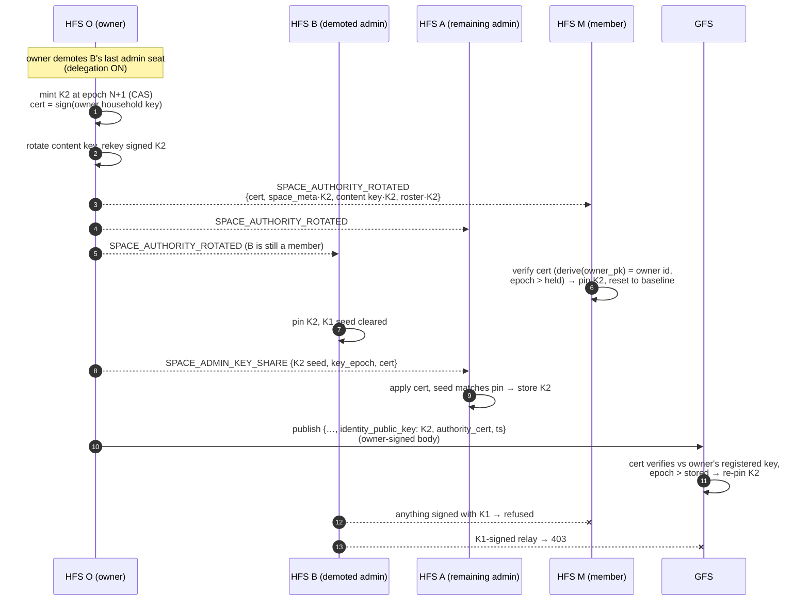
```mermaid
sequenceDiagram
    autonumber
    participant O as HFS O (owner)
    participant B as HFS B (demoted admin)
    participant A as HFS A (remaining admin)
    participant M as HFS M (member)
    participant G as GFS
    Note over O: owner demotes B's last admin seat<br/>(delegation ON)
    O->>O: mint K2 at epoch N+1 (CAS)<br/>cert = sign(owner household key)
    O->>O: rotate content key, rekey signed K2
    O-->>M: SPACE_AUTHORITY_ROTATED<br/>{cert, space_meta·K2, content key·K2, roster·K2}
    O-->>A: SPACE_AUTHORITY_ROTATED
    O-->>B: SPACE_AUTHORITY_ROTATED (B is still a member)
    M->>M: verify cert (derive(owner_pk) = owner id,<br/>epoch > held) → pin K2, reset to baseline
    B->>B: pin K2, K1 seed cleared
    O-->>A: SPACE_ADMIN_KEY_SHARE {K2 seed, key_epoch, cert}
    A->>A: apply cert, seed matches pin → store K2
    O->>G: publish {…, identity_public_key: K2, authority_cert, ts}<br/>(owner-signed body)
    G->>G: cert verifies vs owner's registered key,<br/>epoch > stored → re-pin K2
    B--xM: anything signed with K1 → refused
    B--xG: K1-signed relay → 403
```

**Mixed versions and residual windows.** `SPACE_AUTHORITY_ROTATED` and the
new key-share fields go only to households at or above v_44 (a mesh-only
member whose version is unknown also gets the bundle — an older one drops
the unknown type). A household below v_44 stays pinned to the old key: the
owner keeps reaching it with UNSIGNED config and rekeys over the
owner-from-instance path, its roster mirror freezes, and the version banner
names the gap. A GFS that does not advertise `authority_rotation` keeps
the old pin (the household warns and sends it no cert). An offline owner
rotates nothing until it is back. Before a receiver applies the cert it
still accepts old-key signatures. History the revoked household already
read stays read — forward secrecy holds from the rotation on. The baseline
reset can drop a remaining admin's edits made under the OLD key before the
member adopted the new one, and content posted under a deleted old-key
content epoch becomes unreadable at that member. A household that drops
off a mixed-version GFS or misses the bundle and every later cert-bearing
message stays on the old key until the owner's next config edit, roster
heal or catch-up reaches it. A config, roster or rekey signed with the old key that is
still in flight when a member adopts the new one is refused there and not
retried — the authoring admin's edit is lost at that member (the owner's
own edits converge on its next config edit or roster heal). A content
epoch an admin minted under the old key and that the bundle deletes leaves
anything encrypted under it unreadable at members that never imported it.
After a restore: a household kicked after the backup is listed live in
the restored roster, so it receives the post-restore content key until the
owner removes it again, and the owner's next config edit reasserts the
restored config over members' newer one. A member that missed an earlier
baseline resets to that restored snapshot on the post-restore bundle
(rolling back newer edits made under an older key there), except that it
keeps removals newer than the snapshot — so a kick the revoked household
forged under the old key also stands there until the owner re-adds the
seat. A rotation the
restored owner no longer knows about (made after the backup) AND that a
member never saw is caught by the authority epoch echo below (v_46) — as
long as at least one v_46 member household held it when the post-restore
bundle arrived. A member that joined after a rotation is not flagged by its first
adoption (its pin moves from the creation-time key), only once it moves
past a rotated key without that key's bundle.

#### Authority epoch echo (v_46)

The owner had no view of which authority epoch each member household holds,
so a rotation the restored owner forgot (made after the backup) stayed
invisible: the member that missed it kept what the revoked household
inflated. Every member household's `SPACE_SYNC_BEGIN` to the space's owner
(the periodic sync, every 30 min for a paired owner; the mesh catch-up for a
mesh-only one) now carries an optional, encrypted `authority_epoch_echo`:

```
{key_epoch, baseline_epoch, owed_epoch, forgotten_epoch,
 key_cert?, forgotten_cert?}
```

`key_epoch` is the pin, `baseline_epoch` / `owed_epoch` the claimed and owed
baselines (`spaces.authority_baseline_epoch`), and `forgotten_epoch` a
rotation epoch this household held that the owner no longer knows. A member
learns the last one from the post-restore bundle itself: its
`prior_key_epoch` (the epoch the owner's rotation replaced) is BELOW the pin
the member held, so the owner was restored from a backup taken before that
rotation. `key_cert` / `forgotten_cert` are the owner-signed
`authority_cert`s for those epochs: every household keeps the cert of the
key it pins (`spaces.authority_cert_json`, written wherever a cert is
applied), and on noticing a forgotten epoch it keeps that epoch's cert with
it (`spaces.authority_echo_json`) — durably, so a restart does not lose the
heal. It then sends a BEGIN to the owner at once (`SpaceAuthorityEchoDue`,
queued at security priority) and keeps echoing until a bundle NAMES the
epoch (`forgotten_key_epoch` at least as high) — nothing another household
can provoke clears it.

The echo is the member's claim; the owner never adopts it.

- **Rotation needs proof.** An epoch above the owner's own, or a forgotten
  epoch, counts only with the owner's OWN cert for it — verified against the
  owner household's identity key, which a restore keeps; a cert for another
  epoch, space or signer proves nothing. A real cert is not enough on its
  own: every member holds certs for epochs the owner superseded knowingly.
  So a forgotten epoch must also lie STRICTLY inside the restore window the
  post-restore rotation recorded — above the epoch it replaced (what the
  backup held), below the one it issued — and above any forgotten epoch
  already announced (`max_forgotten`). Echo-triggered and ordinary
  rotations never move the window; with no restore recorded, nothing can
  have been forgotten.
  The owner then rotates past it (`max(proven + 1, current + 1, unix
  seconds)`), marked `baseline: false` with `forgotten_key_epoch`. A member
  resets state written under a key OLDER than that epoch to the owner's
  snapshot, with the same rules as the missed-baseline catch-up (newer
  removals stand); one that applied the forgotten rotation's own baseline
  holds no such state, so for it the reset is a no-op. At most one such
  rotation per space per 6 hours; a proof arriving inside the window is
  kept (the highest one) and rotated past on the next echo once it opens; a
  rotation that rotates nothing (a lost race, an error) gives the window
  back and keeps the proof.
- **Without proof, at most a re-send.** A member behind on the key or its
  baseline (pin below the owner's, an owed baseline, a claimed baseline
  below the owner's epoch) gets the current bundle again, to that household
  only, at most once per household and space per hour. The owner stores the
  header of each rotation (`authority_echo_json`: kind, `prior_key_epoch`,
  the forgotten epochs announced), so the re-send says what the original
  said and names the highest forgotten epoch announced; a rotation with no
  header (made before v_46) is re-sent as a baseline.

Further bounds: only a household holding a writer seat (not a subscriber);
an epoch above wall-clock seconds + 1 day is ignored before any check; a
rejected echo spends no slot. The rotation and the re-send run as tasks,
off the inbound dispatch path, drained (bounded, then cancelled) on app
cleanup while the database is still up; nothing new starts after that.
After a restore, the post-restore rotation runs during startup BEFORE any
transport (GFS WebSocket, outbox, reconnect queue) starts, and until it has
run for that restore every echo is deferred (no rotation, no re-send): the
restored rows may still have delegation on and an admin list naming a
household revoked after the backup, so a rotation off them would share it a
fresh seed. While it is pending, an admin revocation still rotates (it never
waits) but shares the new seed with nobody, and a WARNING (once per boot)
says echo healing is paused. The post-restore rotation records the restore
marker on each space's header, so a retry after a partial failure rotates
only the spaces still missing — never overwriting a restore window already
recorded for that restore. The echo goes only to an owner at or above
v_46, or to a mesh-only owner whose version is unknown (an older one
ignores the field).

Residuals: a member that adopted the post-restore cert inline before the
bundle arrived cannot tell what the bundle replaced; a member that adopted
the forgotten epoch before upgrading to v_46 holds no cert for it and
cannot prove it; a mesh-only member echoes only on its catch-up syncs
(startup, and right after it learns of a forgotten epoch); a proof kept
through the window is in the owner's memory (the member re-echoes it); a
v_45 household neither echoes nor applies `forgotten_key_epoch`.

```mermaid
sequenceDiagram
    autonumber
    participant O as HFS O (owner, restored)
    participant A as HFS A (held e1)
    participant M as HFS M (missed e1)
    Note over O: restored from a backup taken before e1<br/>(pins e0, forgot e1)
    O-->>A: SPACE_AUTHORITY_ROTATED e2 {baseline:false, prior_key_epoch: e0}
    O-->>M: SPACE_AUTHORITY_ROTATED e2 {baseline:false, prior_key_epoch: e0}
    A->>A: prior e0 < held e1 → owner forgot e1
    M->>M: nothing missed as far as M knows
    A->>O: SPACE_SYNC_BEGIN {…, authority_epoch_echo:<br/>{forgotten_epoch: e1, forgotten_cert: cert(e1)}}
    O->>O: writer seat? cert(e1) signed by OUR household key?<br/>not handled yet, window open → rotate to e3
    O-->>M: SPACE_AUTHORITY_ROTATED e3 {baseline:false, forgotten_key_epoch: e1}
    M->>M: reset state written under keys older than e1<br/>(what the revoked household inflated)
    O-->>A: SPACE_AUTHORITY_ROTATED e3 (no-op reset; forgets the note)
```

### Cross-household kick (phase 2, v_9+)

`SPACE_REMOTE_ADMIN_KICK` (PR #435, #114 phase 2) lets a promoted
remote admin actually kick a member. `SpaceService.remove_member`
detects when the space is hosted elsewhere
(`space.owner_instance_id != self.own_instance_id`) and federates
the kick command instead of mutating the local stub. The host
validates the actor's role from `space_remote_members.role` before
dispatching into its own local kick path — which already rotates
the epoch + broadcasts the new key via `SPACE_KEY_EXCHANGE_REKEY`.

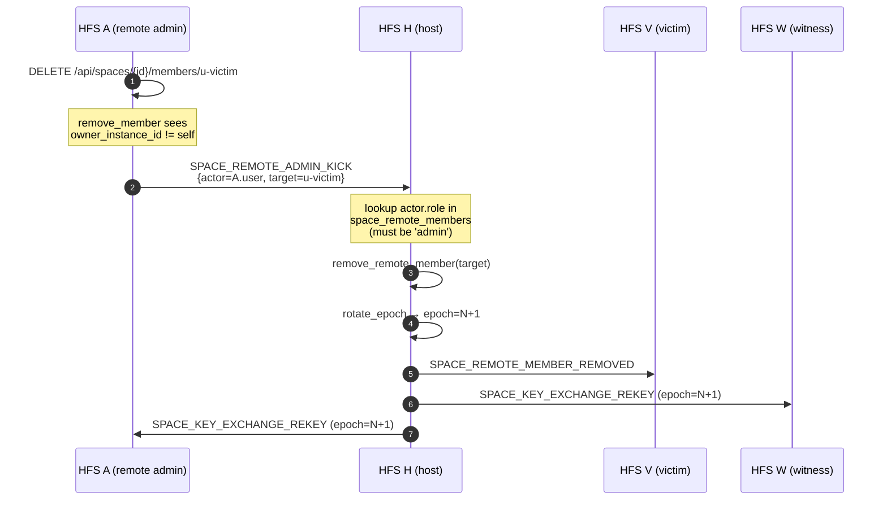
```mermaid
sequenceDiagram
    autonumber
    participant A as HFS A (remote admin)
    participant H as HFS H (host)
    participant V as HFS V (victim)
    participant W as HFS W (witness)
    A->>A: DELETE /api/spaces/{id}/members/u-victim
    Note over A: remove_member sees<br/>owner_instance_id != self
    A->>H: SPACE_REMOTE_ADMIN_KICK<br/>{actor=A.user, target=u-victim}
    Note over H: lookup actor.role in<br/>space_remote_members<br/>(must be 'admin')
    H->>H: remove_remote_member(target)
    H->>H: rotate_epoch → epoch=N+1
    H->>V: SPACE_REMOTE_MEMBER_REMOVED
    H->>W: SPACE_KEY_EXCHANGE_REKEY (epoch=N+1)
    H->>A: SPACE_KEY_EXCHANGE_REKEY (epoch=N+1)
```

Owner cannot be kicked through this path — same invariant as
`remove_member`. Self-leaves on a remote space run the local path (the
user drops their own stub membership) and then tell the host — see
"Member leave (v_49)" below.

### Member leave (v_49)

Before v_49 a member household's leave never reached the host: the local
path only emitted roster gossip, which needs the space seed. The host kept
the seat and the `space_instances` row, kept sending content keys, and kept
issuing the household a write cert. Now `SpaceService.remove_member` on a
member household (self-leave, space hosted elsewhere) sends the host
`SPACE_INSTANCE_LEFT {space_id, user_id}` — an existing event type, inside
the encrypted payload, authenticated by the envelope's signed
`from_instance`. A link-joined household sends it over the
connection-server relay (`/gfs/envelope`) like any other envelope.

The host (`SpaceService.on_remote_member_left`, dispatched by
`SpaceMembershipInboundHandlers._on_instance_left`) only ever ends seats
of the authenticated sender — a leave naming another household's user
changes nothing. It tombstones the seat(s); when the household's last seat
goes it removes the `space_instances` row **before** rotating, so the new
key never reaches the household that left; it gossips the roster change
(`SPACE_MEMBER_LEFT`); and it rotates the content key once — or, when an
admin seat ended under `delegated_admin_authority`, leaves that to the v_44
authority rotation (one epoch, not two). A link-joined household's §D2b
seat is then revoked like on a kick. Off the host the event keeps its old
meaning (stop fanning out to that household).

Gated on `peer_supports(host, MIN_FOR_MEMBER_GFS_PUBLISH)` (v_49): a host
below v_49 would read the event as "the whole household left" and drop the
row while other users of that household may still be seated, ending no
seat — so an older host is sent nothing, as before.

```mermaid
sequenceDiagram
    participant M as Member household
    participant H as Host
    participant O as Other members
    M->>M: remove_member(self) — drop local membership
    M->>H: SPACE_INSTANCE_LEFT {space_id, user_id} (signed from_instance)
    H->>H: tombstone M's seat; last seat → remove space_instances(M)
    H->>O: SPACE_MEMBER_LEFT (authority-signed gossip)
    H->>O: SPACE_KEY_EXCHANGE_REKEY (epoch N+1, each with its own writer_cert)
    Note over M: gets neither the new key nor a cert
```

### Cross-household admin actions (v_15+)

`SPACE_REMOTE_ADMIN_ACTION` generalises the kick to every other
admin-level mutation: **config edit** (name / emoji / features /
join-mode / retention), **ban / unban**, **archive / unarchive**, and
**invite** (a §D1b cross-household invite forwarded for owner approval
when delegation is OFF — see "Cross-household private invite" above; on
approve the host mints the `SPACE_PRIVATE_INVITE` as owner). The
remote admin's `SpaceService` method detects the space is hosted
elsewhere (`owner_instance_id != own`) and, via
`_forward_admin_action_if_remote`, ships an intent envelope carrying
`{action, params}` to the host instead of mutating the local stub
(which isn't authoritative and wouldn't federate). The host's
`apply_remote_admin_action` re-validates the actor's
`space_remote_members.role == admin`, whitelists the verb (+ for config
the field names), then **gates on the space's
`delegated_admin_authority` flag** (Phase 6a):

- **ON** (owner opted in) → the host runs the **real host method as the
  owner** immediately, so the result federates back to every member
  through the normal outbounds (`SPACE_CONFIG_CHANGED`, ban/unban,
  archive `space_meta`). (A seed-holding delegated admin normally signs
  authoritatively and acts locally rather than forwarding — see the
  v_24 config-edit path below — so this branch is the back-compat path
  for an admin household that still forwards.)
- **OFF** (default, least-privilege) → the host does **not** auto-execute.
  It records a **pending owner-approval**, reusing the v_16
  `space_admin_proposals` substrate as an **owner-only**
  `remote_admin_action` proposal (NOT a majority quorum). Only the space
  **owner** can approve it, via the normal proposal/vote route. On the
  owner's APPROVE the host runs the action as owner
  (`apply_approved_admin_action`) and it federates through the normal
  outbounds; an owner REJECT or the 7-day proposal expiry drops it.

This completes the `delegated_admin_authority` two-mode switch: ON =
admins act offline-of-owner autonomously; OFF = forwarded admin actions
become owner-approval requests. One event type carries all actions.

Hardening: a forwarded `update_config` can never change
`delegated_admin_authority` itself — it's owner-only and the host pins
it to the space's current value before running the edit, so neither a
delegation-ON self-authorized edit nor an owner-approved one can grant
or revoke delegation. Unknown / non-forwardable actions are dropped at
the door (no phantom approval is recorded). A forwarded
`retention_exempt_types` is sanitised on the host: values that are not a
`PostType` (a newer peer's type, garbage) are dropped rather than failing
the rest of the edit.

A forwarded `update_config` is an **edit**: an absent field means "leave it
alone", never "reset to the default". The SPA sends only the fields the admin
actually changed, and the forwarding household ships only the `features` keys
that differ from its copy (the host merges them onto its current features),
so a co-admin's rename can't carry stale or never-loaded values over the
host's. An edit with nothing left to forward sends nothing.

**Retention** (`retention_days`, `retention_exempt_types`) is config, not
content. It rides `space_meta` so every member household mirrors the host's
values (a co-admin's settings page shows them instead of "Forever"). An older
sender omits the keys, and the receiver then keeps what it already had. Only
the host **enforces** retention: the sweep skips spaces hosted elsewhere, so a
mirror never deletes posts on its own. On the host, an inbound
`SPACE_CONFIG_CHANGED` snapshot never overwrites the host's retention (a
delegated admin's mirror may be stale). It also never overwrites the host's
other local state: join code, geo-gate, bot toggle and dissolve bookkeeping.
A seed-holding delegated admin's retention change is applied to its mirror
and also forwarded to the host as an `update_config` carrying just those
fields.

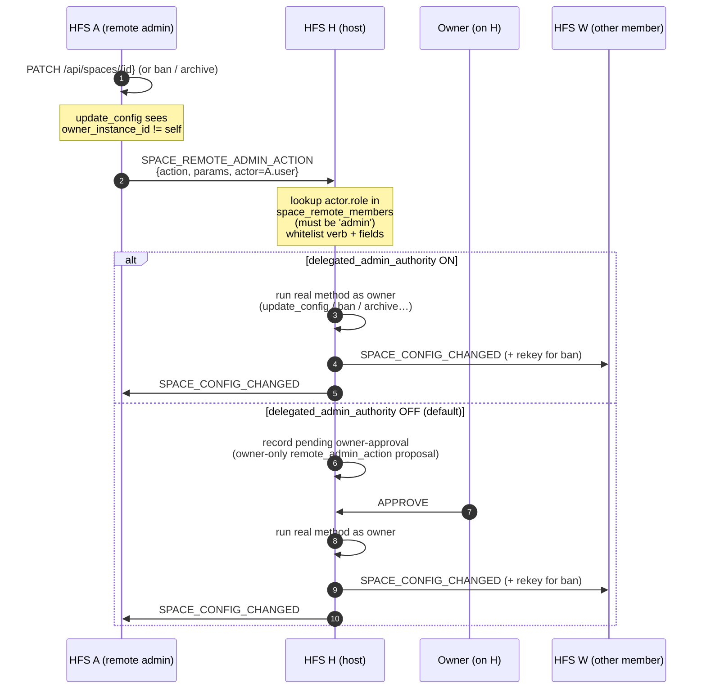
```mermaid
sequenceDiagram
    autonumber
    participant A as HFS A (remote admin)
    participant H as HFS H (host)
    participant O as Owner (on H)
    participant W as HFS W (other member)
    A->>A: PATCH /api/spaces/{id}  (or ban / archive)
    Note over A: update_config sees<br/>owner_instance_id != self
    A->>H: SPACE_REMOTE_ADMIN_ACTION<br/>{action, params, actor=A.user}
    Note over H: lookup actor.role in<br/>space_remote_members<br/>(must be 'admin')<br/>whitelist verb + fields
    alt delegated_admin_authority ON
        H->>H: run real method as owner<br/>(update_config / ban / archive…)
        H->>W: SPACE_CONFIG_CHANGED (+ rekey for ban)
        H->>A: SPACE_CONFIG_CHANGED
    else delegated_admin_authority OFF (default)
        H->>H: record pending owner-approval<br/>(owner-only remote_admin_action proposal)
        O->>H: APPROVE
        H->>H: run real method as owner
        H->>W: SPACE_CONFIG_CHANGED (+ rekey for ban)
        H->>A: SPACE_CONFIG_CHANGED
    end
```

Scope is admin-level only. **Owner-only** actions — dissolve,
transfer-ownership, granting or revoking admin — are NOT forwardable and
stay host-local; ownership privileges don't cross households. An admin's
member ↔ moderator change IS forwardable since v_47 (`set_member_role`,
below). Against a host older than
v_15 (no handler) the forward raises `SpacePermissionError` rather
than silently mutating the stub, so the admin gets a clear
"host needs upgrading" error instead of a divergent local view.
Moderation approve/reject no longer needs this envelope: since v_43 every
household with content authority holds the queue and decides it itself
([`moderation.md`](./moderation.md)). Zone/link edits are admin-level too
and can ride the same envelope (follow-on).

## Multi-admin approval (v_16+)

Two actions are too high-stakes for one admin alone: **dissolving** a
space (permanent delete) and changing its **publication tier**
(`space_type` → public / global, which advertises it or auto-publishes
to GFS). These become *proposals* that execute only once a **majority of
the space's admins approve** — the owner is bound by the same rule, so no
single person can unilaterally delete or publish the group.

`SpaceApprovalService` (host-authoritative) owns the workflow:

- Any admin **proposes** (`POST /api/spaces/{id}/proposals`, or `DELETE
  /api/spaces/{id}` for a dissolve). The proposer auto-approves, so a
  **solo-admin space executes immediately** (majority of 1).
- Other admins **vote** (`POST /api/spaces/{id}/proposals/{pid}/vote`).
  The host recomputes the threshold against the *current* admin set after
  every vote: any **reject cancels**; once approvals exceed half the
  admins it **executes** the real `dissolve_space` / `update_config` as
  the owner, so the result federates through the normal outbounds.
- Proposals **expire** after 7 days if never approved.
- The electorate is every admin (local `space_members` owner/admin +
  remote `space_remote_members` admin). A remote admin proposes / votes
  via `SPACE_REMOTE_ADMIN_ACTION` (`propose` / `vote` verbs); the host
  re-validates they're a current admin (the proposer/voter household is
  bound to the signed envelope, never a payload claim). The host mirrors
  the open proposal + tally onto admin households with
  `SPACE_ADMIN_PROPOSAL_UPDATED` so their SPA renders it and can vote.

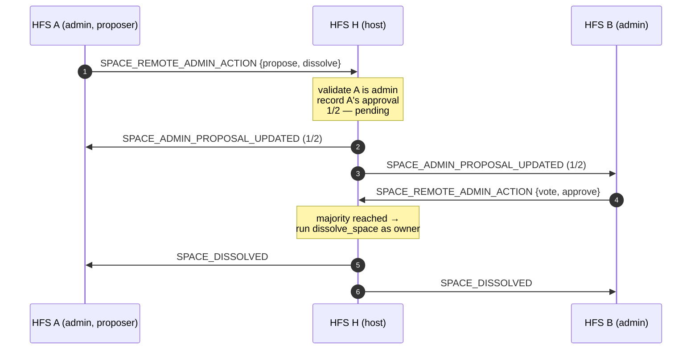
```mermaid
sequenceDiagram
    autonumber
    participant A as HFS A (admin, proposer)
    participant H as HFS H (host)
    participant B as HFS B (admin)
    A->>H: SPACE_REMOTE_ADMIN_ACTION {propose, dissolve}
    Note over H: validate A is admin<br/>record A's approval<br/>1/2 — pending
    H->>A: SPACE_ADMIN_PROPOSAL_UPDATED (1/2)
    H->>B: SPACE_ADMIN_PROPOSAL_UPDATED (1/2)
    B->>H: SPACE_REMOTE_ADMIN_ACTION {vote, approve}
    Note over H: majority reached →<br/>run dissolve_space as owner
    H->>A: SPACE_DISSOLVED
    H->>B: SPACE_DISSOLVED
```

Owner-only actions that are **not** quorum-gated and stay host-local:
transfer-ownership and role assignment. Reversible admin actions (name,
emoji, features, ban/unban, archive/unarchive) remain single-admin.

## Age gate

A space's `min_age` (§CP.F1 child-protection) is enforced on **every**
member-seating path so a protected minor below the threshold can't be
seated — locally (`add_member`, `approve_join_request`, `accept_invite_token`,
`accept_local_invite`, `subscribe`) **and** cross-household
(`accept_remote_invite`).

For a member household to enforce the host's gate locally it must know
`min_age`, so the gate **federates** two ways (the same additive/fail-soft
pattern as `allowed_post_types` — an older sender omitting the field →
`min_age` 0 → no restriction):

- **Join time:** `min_age` rides in the `space_meta` snapshot
  (`_space_metadata_for_federation`) carried by the §D1b invite, so a joiner's
  stub knows the gate before it seats anyone. The discovery `category` field
  also rides in `space_meta`.
- **Ongoing changes:** when the host changes the gate, `SPACE_AGE_GATE_UPDATED`
  broadcasts the new `{min_age}` to member households, which update their stub
  (`space_membership._on_age_gate`). The receiver applies `min_age` and ignores
  any legacy `target_audience` from older peers. The host is the only authority
  that broadcasts it; a member stub never does.

## Mesh routing (SPACE_ROUTED)

Two confirmed peers can exchange any federation event directly. When
the origin and target are **not** directly paired but are connected
via a chain of confirmed peers (`a ↔ b ↔ c`), the origin discovers a
path and ships the inner event inside a generic source-routed
envelope. Relays forward the envelope but never see its content —
the inner payload is sealed end-to-end with a per-route ephemeral
X25519+HKDF key that only the target can derive.

### Discovery (one round per session, ~5 min cached)

```mermaid
sequenceDiagram
    autonumber
    participant A as HFS A<br/>(origin)
    participant B as HFS B<br/>(relay)
    participant C as HFS C<br/>(target)
    A->>B: SPACE_FIND_ROUTE<br/>(request_id, target=C,<br/>hops_traversed=[A], max_hops)
    B->>C: SPACE_FIND_ROUTE<br/>(hops_traversed=[A, B])
    Note over C: target generates fresh<br/>X25519 ephemeral,<br/>caches priv (TTL 5 min),<br/>signs eph_pk with its<br/>Ed25519 identity key
    C->>B: SPACE_ROUTE_FOUND<br/>(request_id, path=[A, B, C],<br/>target_eph_pk,<br/>target_identity_pk, target_eph_sig)
    B->>A: SPACE_ROUTE_FOUND<br/>(relayed via cached caller;<br/>signature opaque)
    Note over A: verify sig + identity-id<br/>+ path ends at C;<br/>pick shortest path,<br/>random tie-break;<br/>cache (path, target_eph_pk)
```

`SPACE_FIND_ROUTE` floods over the federation graph bounded by
``max_hops`` (default 3, capped per-relay so a peer can't burn our
budget by inflating it). Each hop dedups on ``request_id``, refuses
to forward back through itself, and gates forwards on
``peer_supports(min_version=6)`` so sub-v_6 peers are invisible to the
mesh. ROUTE_FOUND responses ride back along the cached caller chain
(``request_id → caller_instance_id``, TTL 60 s).

#### Cache lifetimes are ordered, not equal

The target's cached ephemeral **private** half and the origin's cached
`(path, target_eph_pk)` are two different timers on two different
households, and the ordering between them is load-bearing:

| Side | Constant | Anchored on |
|---|---|---|
| target | `routed_crypto.DEFAULT_TARGET_EPH_TTL_S` (300 s) | key mint, on answering the probe |
| origin | `route_discovery.ROUTE_CACHE_TTL_S` (= 300 s − `ROUTE_CACHE_SAFETY_MARGIN_S`) | the moment the probe was **sent** |

The origin's window MUST close first. `discover_route` is cache-first,
so an origin whose window outlives the target's keeps re-sealing under
a private half the target has already dropped. Pre-v_28 the target's
only recourse was to discard the envelope, silently: there was no NACK,
and `send_with_mesh_fallback` had reported `ok=True` the moment the
first hop accepted the outer envelope. That is the mechanism behind
#648. The TTL ordering remains the first line of defence: the origin
TTL is derived from the target's rather than typed independently so the
two cannot drift apart, and probe-start anchoring removes the
discovery-latency overhang exactly.

The private half also dies with the process, so a **restarted** target
invalidates every pub an origin holds for it — and no TTL ordering can
see a restart coming. Since v_28 the target answers such an envelope
with a signed `SPACE_ROUTE_STALE` nack; the origin verifies it against
the identity key it pinned at discovery, invalidates the cached route,
re-discovers and retransmits the inner event **once** (see "Route-stale
nack" below), so a target restart costs one extra round trip instead of
up to `ROUTE_CACHE_TTL_S` of silently lost sends. Recovery is always
re-discovery (which rotates the ephemeral — the forward-secrecy-positive
direction), never a longer-lived or use-extended key: a host admitting a
`SPACE_SYNC_BEGIN` from a mesh-only requester calls
`RouteDiscoveryService.invalidate()` for that requester before it starts
streaming, so the stream is sealed under a key the requester's current
process actually holds. See [`sync.md` → "Mesh-only host
catch-up"](sync.md#mesh-only-host-catch-up).

#### Authenticating `target_eph_pk` (v_21+)

The origin seals real space content (post bodies, GPS, files, the §D2
invite token) under the `target_eph_pk` it learns from ROUTE_FOUND —
and that response is *relayed* and was, pre-v_21, **unauthenticated**.
A malicious confirmed peer that caught the `SPACE_FIND_ROUTE` flood
could answer `ROUTE_FOUND(path=[A, attacker], target_eph_pk=<its own
eph>)`, win the shortest-path tie-break, and make the origin seal
plaintext content under the attacker's key — the attacker then
decrypts it (the inner payload is **not** independently encrypted on
the mesh path). This broke the "a non-member relay can't read space
content" invariant.

The fix binds `target_eph_pk` to the target's **identity** key. Only
the genuine target can mint the eph key, so it signs it:

```
target_identity_pk : "<64 hex>"   # the target's Ed25519 identity public key
target_eph_sig     : "<b64url>"   # Ed25519 sig over
                                   #   b"space-route-found:v1:" + request_id
                                   #   + b":" + target_eph_pk
```

Relays forward both fields **opaquely** (they never generate or alter
them). The origin, before collecting a response, verifies **all** of:

1. `path` is non-empty and `path[-1] == target` (the route really ends
   at the asked-for target).
2. `derive_instance_id(target_identity_pk) == target` — the key belongs
   to the target instance. The `instance_id` **is** the SHA-256
   fingerprint of the identity key (§4.1.2), so this needs no prior
   pairing with the target.
3. `target_eph_sig` is a valid Ed25519 signature by that identity over
   the domain-separated, request-scoped signing bytes (so a signature
   can't be lifted onto another `request_id`).

Any failure drops the response (logged at WARNING); malformed hex /
base64url is treated as a failure, never propagated. **Fail-closed,
no fallback:** a sub-v_21 target ships no signature, so a patched
origin won't accept its ROUTE_FOUND — the target is mesh-*unreachable*
via discovery until it upgrades. A forgeable key is strictly worse
than a missing route, so the trade is intentional. Direct CONFIRMED
peers and the local short-circuit (target == self) are unaffected —
there is no relayed ROUTE_FOUND to trust.

### Forward + reply leg (any inner event)

```mermaid
sequenceDiagram
    autonumber
    participant A as HFS A<br/>(origin)
    participant B as HFS B<br/>(relay)
    participant C as HFS C<br/>(target)
    Note over A: seal inner payload<br/>(AES-256-GCM with<br/>origin→target HKDF key,<br/>AAD bound to route_id +<br/>inner_event_type)<br/>then SIGN the routing claim<br/>+ sealed material with A's<br/>Ed25519 identity key
    A->>B: SPACE_ROUTED<br/>(direction=forward,<br/>position=0, sealed=…<br/>+ origin_sig)
    B->>C: SPACE_ROUTED<br/>(position=1, sealed=…<br/>relay never decrypts,<br/>never alters origin_sig)
    Note over C: verify origin_sig against<br/>A's pinned identity key<br/>(or the shipped pub bound<br/>by derive_instance_id);<br/>then lookup cached eph priv<br/>by target_eph_pk,<br/>unseal, dispatch inner<br/>event with routed_path<br/>+ routed_route_id
    C->>B: SPACE_ROUTED<br/>(direction=reply,<br/>sealed=… target→origin<br/>+ C's origin_sig)
    B->>A: SPACE_ROUTED
    Note over A: verify C's origin_sig,<br/>lookup origin eph priv<br/>by route_id,<br/>unseal reply
```

Forward and reply use **different** symmetric keys (HKDF info
strings ``socialhome/space_routed/origin-to-target`` vs ``…/target-
to-origin``). The AAD additionally binds ``route_id`` and
``inner_event_type``, with an ``|ack`` suffix on the reply leg so a
forward ciphertext can never be replayed as a reply. The KEM suite
is declared on the wire as ``kem_suite`` (currently
``"x25519"``); receivers reject unknown suites — this is the
forward-hook for the Phase-2 ML-KEM-768 hybrid migration documented
in [`crypto.md`](../crypto.md).

The wire shape of ``SPACE_ROUTED.payload``:

```
{
  "route_id":          "<32 hex>",       # unique per origin send
  "path":              ["a", "b", "c"],  # source-route inclusive
  "position":          0,                # next hop is path[position+1]
  "direction":         "forward"|"reply",
  "inner_event_type":  "<FederationEventType.value>",
  "sealed":            {
    "kem_suite":     "x25519",
    "origin_eph_pk": "<32 b64url>",
    "target_eph_pk": "<32 b64url>",
    "nonce":         "<12 b64url>",
    "ciphertext":    "<aead b64url>",

    # v_31 origin authentication — see "Authenticating path[0]" below
    "origin_identity_pk": "<64 hex>",
    "origin_sig":         "<b64url>",
    "origin_sig_suite":   "ed25519"
  }
}
```

### Authenticating `path[0]` (v_31+)

The seal proves **confidentiality**, not **authorship**. The ephemeral
X25519 exchange is anonymous: any household that learned the target's
`target_eph_pk` — every peer that ever probed it with `SPACE_FIND_ROUTE`,
and every relay, since the pub travels in plaintext on the wire — can mint
its own ephemeral and produce a blob the target happily decrypts. And
`path[0]` arrives inside a payload the *previous hop* wrote: `_on_routed`
binds only `path[position]` (the authenticated sender) and `path[position+1]`
(us). Everything before that is a claim.

That claim is what the unwrap turns into the inner event's `from_instance`,
and `from_instance` is exactly what the §24.11 post-decrypt gates judge — the
mesh ban check, the v_30 Follower write gate, every owner-keyed handler. So
pre-v_31 a mesh peer `F` could probe `V`, then ship
`SPACE_ROUTED{path: [H, F, V], position: 1}` and have `V` persist its content
as if `H` — a genuine member household — had written it (#692).

Since v_31 the household at `path[0]` signs the leg with its Ed25519
**identity** key and the endpoint verifies before dispatch:

```
origin_identity_pk : "<64 hex>"   # the author's Ed25519 identity public key
origin_sig         : "<b64url>"   # Ed25519 over the signing bytes below
origin_sig_suite   : "ed25519"    # suite tag; an unknown value is rejected

b"space-routed-origin:v1:" + direction + b":" + route_id
  + b":" + "|".join(path) + b":" + inner_event_type
  + b":" + sha256(kem_suite|origin_eph_pk|target_eph_pk|nonce|ciphertext).hex()
```

Relays forward the three fields **opaquely**, exactly as they do the
ROUTE_FOUND signature. The endpoint verifies against a key it already holds:

1. the pinned `remote_instances.remote_identity_pk` when it has a row for
   `path[0]` (a paired peer, or one seated from an invite link) — the same
   key the §24.11 pipeline verifies that household's direct envelopes
   against; otherwise
2. the shipped `origin_identity_pk`, self-authenticating because an
   `instance_id` **is** the SHA-256 fingerprint of the identity key (§4.1.2).
   The mesh exists precisely to reach households we are *not* paired with, so
   without this fallback the fix would sever its main use case. A shipped pub
   that contradicts a pinned one is a drop.

The prefix binds the leg (`direction`), the send (`route_id`), the whole
source-route — and therefore both the origin and the target — and the inner
event type, so a captured signature cannot be lifted onto another route, leg,
target, or event type. The digest binds the sealed material, so a relay that
re-seals the payload under its own ephemeral (the one thing an anonymous seal
lets it do) invalidates the signature.

The digest deliberately covers the **ciphertext**, never the plaintext: every
byte it hashes is already visible to the relay, whereas signing the plaintext
would give a relay holding a guess at a low-entropy inner payload a
deterministic oracle to confirm it with — which the §25.8.21 encryption-first
rule forbids. Authenticity is unaffected, because the AEAD tag already binds
ciphertext to plaintext under a key the forger does not share with the target.

**Senders always sign.** The three fields are siblings of the KEM fields, not
part of the AEAD, so a pre-v_31 endpoint reads the sealed blob by name and
ignores them — the outbound is wire-additive and needs no
`peer_supports` gate (which is just as well: an origin frequently has no
`remote_instances` row for a mesh-only target to gate against).

**Receivers fail closed, with a named legacy window.** An unsigned inner
event is accepted only when the receiver holds a row for the claimed origin
AND that row's `proto_version` is below
`FederationCapability.MIN_FOR_ROUTED_ORIGIN_SIGNATURE` — logged at INFO so
the window is countable in the logs, and closing by itself as peers upgrade.
The version comes from a signed `INSTANCE_CAPABILITIES_UPDATED`, so an
attacker can only impersonate households that genuinely still lag. An
unsigned event naming a v_31+ origin, or one the receiver holds no row for
at all, is dropped at WARNING.

### Route-stale nack (v_28+)

**Trigger.** On the forward leg the target looks up the ephemeral
private half for `sealed.target_eph_pk`. That half lives only in RAM,
so after a restart — or when an origin's cache has outlived the
target's key — the lookup misses. Instead of dropping the envelope, the
target signs `(route_id, stale_eph_pk)` with its Ed25519 **identity**
key and sends a `SPACE_ROUTE_STALE` to the hop the envelope arrived from
(`event.from_instance`, which `_on_routed` has already proved equals
`path[position]`). If that hop is pre-v_28 the target drops exactly as
before — a nack is never sent to a peer that cannot parse it.

```mermaid
sequenceDiagram
    autonumber
    participant A as HFS A<br/>(origin)
    participant B as HFS B<br/>(relay)
    participant C as HFS C<br/>(target)
    A->>B: SPACE_ROUTED<br/>(forward, position=0,<br/>sealed under C's OLD eph pk)
    B->>C: SPACE_ROUTED<br/>(position=1)
    Note over C: no eph priv for<br/>target_eph_pk (restarted);<br/>sign space-route-stale:v1:<br/>route_id:stale_eph_pk<br/>with identity key
    C->>B: SPACE_ROUTE_STALE<br/>(route_id, path=[A,B,C],<br/>position=2, target_identity_pk,<br/>stale_eph_pk, sig, sig_suite)
    Note over B: structural checks only,<br/>no sig verify; dedup;<br/>forward toward path[0]
    B->>A: SPACE_ROUTE_STALE<br/>(position=1, fields opaque)
    Note over A: pending record for route_id?<br/>verify sig vs pk pinned<br/>at discovery; invalidate route
    A->>B: SPACE_FIND_ROUTE<br/>(fresh probe; C mints<br/>a NEW eph key)
    B->>C: SPACE_FIND_ROUTE
    C-->>A: SPACE_ROUTE_FOUND<br/>(via B)
    A->>B: SPACE_ROUTED<br/>(same inner, new route_id,<br/>sealed under C's NEW eph pk)
    B->>C: SPACE_ROUTED
```

The wire shape of `SPACE_ROUTE_STALE.payload`:

```
{
  "route_id":           "<32 hex>",       # the SPACE_ROUTED send being nacked
  "path":               ["a", "b", "c"],  # copied from that envelope
  "position":           2,                # index of the hop that SENT this hop
  "target_identity_pk": "<64 hex>",       # target's Ed25519 identity public key
  "stale_eph_pk":       "<32 b64url>",    # the target_eph_pk nobody holds a priv for
  "sig":                "<b64url>",       # Ed25519 over
                                          #   b"space-route-stale:v1:" + route_id
                                          #   + b":" + stale_eph_pk
  "sig_suite":          "ed25519"
}
```

The signing bytes are domain-separated from `space-route-found:v1:` so
a captured `target_eph_sig` can never be replayed as a nack to tear
down a live route, and route-scoped so one nack cannot be lifted onto
another `route_id`. `sig_suite` follows the project-wide suite-tag rule
(see [`crypto.md`](../crypto.md)); receivers reject unknown suites
rather than falling back.

**Hop-by-hop walk-back.** `position` names the hop that *sent* this
nack hop (the target starts it at `len(path) - 1`, mirroring
`SPACE_ROUTED`); a relay at index `i` receives `position == i + 1` and
forwards to `path[i - 1]` with `position = i`. Each relay applies
structural checks only, in order, each a fail-soft drop:

1. well-formed payload, `len(path) ≤ 8` (the `SPACE_ROUTED` path cap);
2. `1 ≤ position < len(path)`;
3. `path[position] == event.from_instance` — the sender is the
   §24.11-authenticated previous hop (anti-spoof);
4. `path[position - 1] == self` — we really are the next hop;
5. `derive_instance_id(target_identity_pk) == path[-1]` — the carried
   key belongs to the instance the route ends at (§4.1.2);
6. dedup on `route_id` — checked *after* the structural checks so a
   malformed nack from a third party that knows the `route_id` cannot
   burn the slot for the genuine one.

Relays do **not** verify the signature. They hold nothing the origin
lacks (the identity pk travels in the payload and is bound to
`path[-1]` by step 5), the same bytes reach the origin either way, and a
relay that verified would be deciding on the origin's behalf which nacks
it gets to see. The forward to the next hop is gated on
`peer_supports(min_version=28)`; an older next hop ends the nack there.

**At the origin** (`position - 1 == 0`) the relay checks above have
already run. The origin then applies, in order, each a fail-closed drop:

1. `route_id` names a live pending record — one is kept per
   `send_routed` (target, pinned identity pk, the ephemeral key sealed
   under, the inner event) for the **route-cache window**
   (`ROUTE_CACHE_TTL_S`, 270 s): the span during which the origin could
   still be sealing under a stale key. Not the 60 s ephemeral window — a
   relay's outbox retry ladder can deliver a stale-sealed envelope to a
   rebooted target well after that, and its nack must still land on a
   live record. A nack for a send we never made, or one past the window,
   is a no-op;
2. `path[-1]` is that record's target;
3. `target_identity_pk` equals the identity pk the origin **pinned at
   discovery** (`RouteDiscoveryService.cached_target_identity_pk`) — a
   second, independent key binding on top of the relay-level derive
   check (a send that predates the pin falls back to re-deriving against
   the record's target; never to acceptance);
4. `stale_eph_pk` equals the ephemeral key the origin **sealed under for
   this `route_id`**. Without this the target is a signing oracle: an
   on-path relay could forward the envelope with a garbage
   `target_eph_pk`, collect the target's genuine signature over it, and
   tear down a live route on demand. A nack the target signed for any
   other key is rejected here;
5. the signature verifies under that key and under a suite in
   `SUPPORTED_ROUTE_STALE_SIG_SUITES` — unknown suite → hard reject;
6. pop the pending record — one nack per envelope, consumed before the
   first `await` so a concurrent duplicate finds nothing;
7. `RouteDiscoveryService.invalidate_if_eph(target, stale_eph_pk)` — the
   cached route is dropped only while it **still points at the stale
   key**. After a reboot the nacks for every envelope sealed under the
   old key trickle back one at a time; the first rebuilds the route, and
   the rest must not evict it again (five envelopes, one flood, not five);
8. rediscover (cache-first — a route already rebuilt by an earlier nack
   is reused with no flood; otherwise a fresh `SPACE_FIND_ROUTE`, which
   makes the target mint a new ephemeral) and `send_routed` the retained
   inner event **once**, flagged as a retry.

Step 8 is skipped — route invalidated, nothing resent — when the nacked
send was itself the retry (a target that nacks twice gets one `INFO`
line, not a loop) or when the inner exceeds 64 KiB (media chunks ride the
durable `space_media_outbox`, which rediscovers on its own next attempt).
When rediscovery finds **no route** the origin does not give up at once:
the nack's own trigger is "the target just rebooted", and the two-second
discovery window routinely closes before the target is back — its late
`ROUTE_FOUND` is then cached but would otherwise resend nothing. So the
origin defers **exactly one** more attempt until past the discovery
negative cooldown (plus a 5 s margin); that attempt is cache-first, so a
late answer that landed meanwhile costs no flood. A second miss gives
up. The deferral is tracked apart from the pending record, which stays
the sole authority on whether a nack refers to a live send — reusing the
record would let a replayed nack match again. Success logs
`SPACE_ROUTE_STALE route_id=…: route to <target> invalidated,
rediscovered, retransmitted <event> as route_id=…` at `INFO` — with
`already rebuilt` in place of `invalidated` when the conditional
eviction found the cache no longer pointing at the nacked key (a sibling
nack, or the rebooted target's own catch-up `SPACE_SYNC_BEGIN`, had
already refreshed the route), so nothing was torn down and the retransmit
rode the fresh route. The deferred attempt's success line carries the
same core plus a `(deferred attempt)` suffix.

**Amplification bounds.** Dedup per `route_id` at every hop (a nack
visits each hop at most once; replays are no-ops); one retransmit per
original send (the retry's pending record is flagged so its own nack
cannot trigger another) plus at most one deferred re-attempt; a
bounded pending table (2000 entries, oldest
expiry evicted first, ≤ 64 KiB retained inner each); and
`discover_route` single-flights per target and honours the negative
cooldown, so a burst of nacks for one target costs one flood.

**Older hops.** Every send of the nack — the target's and each relay's
— is gated on the receiver being ≥ v_28. A sub-v_28 hop drops the nack
(or never receives it) and the origin behaves exactly as before v_28: it
keeps sealing under the dead key until `ROUTE_CACHE_TTL_S` expires and
rediscovers naturally. The nack only shortens that outage; it never
widens the trust surface (see
[`capabilities.md`](./capabilities.md) for the v_28 row).

### What relays can and cannot see

| Field                | Relay sees? | Notes                                          |
|----------------------|-------------|------------------------------------------------|
| `route_id`           | yes         | nonce — opaque outside the routing layer       |
| `path`               | yes         | by construction (relay routes by `position`)   |
| `position`           | yes         | incremented per hop                            |
| `direction`          | yes         | needed for dedup carve-out                     |
| `inner_event_type`   | yes         | drives the AAD; relay never dispatches it      |
| `sealed.kem_suite`   | yes         | algorithm tag                                  |
| `sealed.*_eph_pk`    | yes         | public keys; harmless                          |
| `sealed.nonce`       | yes         |                                                |
| `sealed.ciphertext`  | yes (bytes) | undecipherable without the matching priv half  |
| **inner payload**    | **no**      | only the target can derive the seal key        |
| `SPACE_ROUTE_STALE.*` (v_28+) | yes | `route_id` / `path` / `position` / `target_identity_pk` / `stale_eph_pk` / `sig` / `sig_suite` — routing + validation data the relay already saw on the forward leg (`target_eph_pk`) or the discovery leg (identity pk); the nack carries **no content** |

For the discovery leg, relays also see ROUTE_FOUND's
`target_identity_pk` + `target_eph_sig` (v_21+) — public key + a
signature, harmless on their own and forwarded unaltered; the origin
verifies them to defeat key substitution (see "Authenticating
`target_eph_pk`" above).

### Third tier: no path at all (the connection-server relay)

Direct peer, then mesh — and then a household that has neither. A member
seated from an invite link (§D2b, [`invites.md`](./invites.md)) holds a
`source = space_session` row with an **empty `remote_inbox_url`**: the
pair deliberately never exchanged an address, so there is nothing to dial
and no chain of confirmed peers to route along either. Its envelopes ride
a third transport tier, the connection server's opaque envelope relay.

`FederationTransport.send` picks it on `source = space_session` — never
RTC (its signalling travels over the peer relationship this pair does not
have), never the HTTPS inbox (there is no URL). `GfsRelayTransport`
(`federation/gfs_relay_transport.py`) seals the **whole** §24.11
envelope — plaintext routing fields included — to the peer's static
key-wrap key and hands the connection server `{to_instance, sealed}`.
The same discipline as a mesh relay, against a different adversary: a
mesh relay sees `SPACE_ROUTED` and no content; the GFS sees a recipient,
a size and a timing, and no content, no sender and no space.

Inbound, the receiver unseals, recognises the `space_relay_envelope`
marker and runs the **unmodified** §24.11 pipeline — so a relayed space
event is checked exactly like one off the DataChannel. Media does not
fit the relay's 320 KiB body cap and is refused locally with a WARNING;
see *Delivery afterwards* in [`invites.md`](./invites.md).

### First consumer: token-redeem (`SPACE_INVITE_TOKEN_REDEEM`)

PR 1 (v_6) added receiver-initiated cross-instance redeem of
`socialhome://invite#…` codes. PR 2 makes the redeem transparently
ride the mesh when the receiver isn't directly paired with the
issuer — see [`invites.md`](./invites.md#flow--token-redeem-via-mesh).
Future event types (space content fanout to non-paired households,
cross-instance reactions) plug in by calling
`SpaceRoutedHandler.send_routed(...)` with their existing payload
shape — no per-event-type `_ROUTED` variants are needed.

## Implementation

- `socialhome/services/space_service.py` — creation, membership
  mutations, permission guards.
- `socialhome/services/content_access.py` — `ContentAccessMixin`, the
  per-feature access gate every local write path asks;
  `socialhome/federation/space_authorship.py` —
  `SpaceAuthorship.access_admits`, the receiver's.
- `socialhome/services/space_moderation_service.py` —
  `SpaceModerationService`, the moderation queue (held by every reviewer
  household, v_43 — see [`moderation.md`](./moderation.md)) and its
  per-(feature, action) handler registry; the handlers live with their
  content services (`PageModerationHandler`, `TaskModerationHandler`,
  `StickyModerationHandler`, `CalendarModerationHandler`) and in
  `space_post_moderation.py` (`PostModerationHandler`, the queued-post
  round trip and `SpacePostAttachments`);
  `socialhome/infrastructure/moderation_expiry_scheduler.py` — the hourly
  expiry + payload purge.
- `socialhome/federation/route_discovery.py` —
  `RouteDiscoveryService`: BFS-flooded probe + per-target ephemeral
  caching + 5-min route cache; `cached_target_identity_pk` exposes the
  identity pk pinned at discovery that a `SPACE_ROUTE_STALE` nack is
  held against.
- `socialhome/federation/routed_envelope.py` —
  `SpaceRoutedHandler`: forward / unwrap of `SPACE_ROUTED`; origin
  + target ephemeral state machines. Route-stale nack (v_28+):
  `_nack_stale_target_eph` (target), `_on_route_stale` (relay
  walk-back), `_on_route_stale_at_origin` (verify → invalidate →
  rediscover → retransmit once).
- `socialhome/federation/routed_crypto.py` — directional
  X25519+HKDF+AES-GCM seal/unseal primitives; KEM suite gating;
  `sign_route_stale` / `verify_route_stale` (+
  `SUPPORTED_ROUTE_STALE_SIG_SUITES`) for the nack signature.
- `socialhome/federation/sync/space/` — space-level sync machinery
  (shared with [sync.md](./sync.md)).
- `socialhome/services/federation_inbound/space_membership.py` —
  inbound handlers for `SPACE_CREATED`, `SPACE_MEMBER_JOINED`, etc.
- `socialhome/authority_cert.py` — the owner-signed authority cert (v_44);
  `socialhome/services/space_authority_pin.py` — `apply_authority_cert`
  (every receiver) and `owner_authority_cert` (the owner);
  `socialhome/services/space_authority_rotation_service.py` — the owner's
  rotation and the member's `SPACE_AUTHORITY_ROTATED` handler.
- `socialhome/repositories/space_repo.py`,
  `space_remote_member_repo.py` — persistence.
- `socialhome/routes/space_routes.py` — REST endpoints
  (`/api/spaces/*`).

## Spec references

§13 (Federation: Spaces), §25.8.19 (STRUCTURAL_EVENTS retention),
§25.8.20 (per-space key derivation), §D2 (mesh routing).
