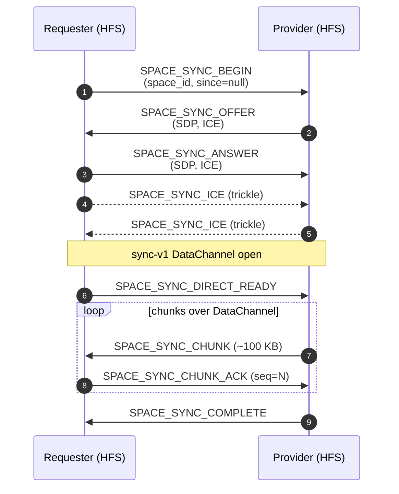
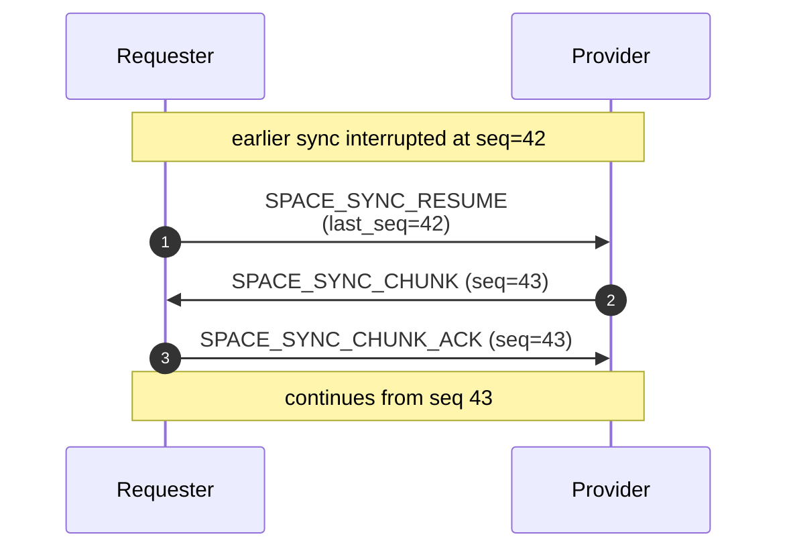

# Sync

When a new peer joins an existing space, it needs the historical
content the space already has — posts, comments, pages, tasks,
calendar events, stickies. That one-time bulk catch-up is the **sync
protocol**. Ongoing live updates afterwards are covered by
[feeds](./feeds.md) and the other content pages.

## Scope

- **HFS**: both sides. Requester asks for a snapshot; provider exports
  + streams chunks; requester acks and commits.
- **GFS**: uninvolved. Sync is strictly peer-to-peer. Preferred
  transport is the `sync-v1` WebRTC DataChannel; falls back to
  chunked inbox.

## Event types

`SPACE_SYNC_BEGIN`, `SPACE_SYNC_CHUNK`, `SPACE_SYNC_CHUNK_ACK`,
`SPACE_SYNC_RESUME`, `SPACE_SYNC_COMPLETE`,
`SPACE_SYNC_OFFER`, `SPACE_SYNC_ANSWER`, `SPACE_SYNC_ICE`,
`SPACE_SYNC_DIRECT_READY`, `SPACE_SYNC_DIRECT_FAILED`,
`SPACE_SYNC_REQUEST_MORE`.

## Tiered transport

- **Tier 2 — HTTPS inbox.** The bootstrap path. Always available; used
  until the dedicated sync DataChannel is up. Chunks are POSTed one by
  one to the provider's inbox.
- **Tier 3 — DataChannel (`sync-v1`).** Separate from the `fed-v1`
  routine channel so a large sync doesn't block live events. Once the
  DataChannel is negotiated the requester sends
  `SPACE_SYNC_DIRECT_READY` and subsequent chunks flow over it.

## Flow — happy path, upgrades to DataChannel

## Flow — resume after disconnect

## Backpressure

The DataChannel carries its own high-water mark
(`set_buffered_amount_low_threshold`), but the provider also honours
application-level flow control: it will not send `seq=N+1` until it
has seen the `CHUNK_ACK` for some earlier window. This keeps memory
bounded even when the underlying SCTP buffer grows.

`SPACE_SYNC_REQUEST_MORE` lets the requester pull the next window
when it's finished writing the current one — useful on constrained
devices.

## DataChannel failure

If the DataChannel negotiation fails, the provider emits
`SPACE_SYNC_DIRECT_FAILED` and continues over HTTPS inbox. The sync
completes; only the transport changes.

## Round-robin signaling-node selection (cluster GFS)

When a Social Home instance is connected to a multi-node GFS cluster,
the load of relaying ICE candidates between requester and provider
must be spread across nodes rather than always landing on the
caller's preferred GFS. Spec §24.10.7.

- The provider, before generating `SPACE_SYNC_OFFER`, calls
  `POST /cluster/signaling-session` on its connected GFS node. The
  GFS picks the least-loaded online cluster node by weighted
  least-connections (min-heap on `(active_sync_sessions, node_id)`)
  and increments its counter, returning the chosen URL. The SH
  client wrapper that issues this call is
  `GfsConnectionService.request_signaling_node`.
- The provider includes that URL in the OFFER as `signaling_node`.
  Single-node deployments (or no paired GFS) return `null` and the
  field is omitted from the offer.
- The requester sends `SPACE_SYNC_ANSWER` and trickles `SPACE_SYNC_ICE`
  directly to `signaling_node`.
- On `SPACE_SYNC_DIRECT_READY` or `SPACE_SYNC_DIRECT_FAILED` the
  provider calls `POST /cluster/signaling-session/release` (via
  `GfsConnectionService.release_signaling_node`) to decrement the
  counter.

Counters are local-per-node (no consensus). They propagate via
`NODE_HEARTBEAT` so peers' selectors see fresh load on the next pick.
A node at `MAX_SIGNALING_SESSIONS = 200` is filtered out of the
candidate set; if every node is at the cap the GFS replies with
`503 {reason: "node_capacity"}` and the SH provider falls back to
relay sync.

## Implementation

- `socialhome/federation/sync/space/exporter.py` — provider
  streams chunks, resume support.
- `socialhome/federation/sync_rtc.py` — `sync-v1` DataChannel
  lifecycle (offer/answer/ICE/backpressure).
- `socialhome/services/federation_inbound/space_content.py` —
  chunk application on the requester side.
- `socialhome/federation/sync/space/provider.py` —
  `serialise_chunk()` and per-space authoritative snapshot.

## Spec references

§4.2.3 (Tier 2 / Tier 3 sync),
§24.12.3 (DataChannel sync details),
§25.6.2 (sync rate limits).
