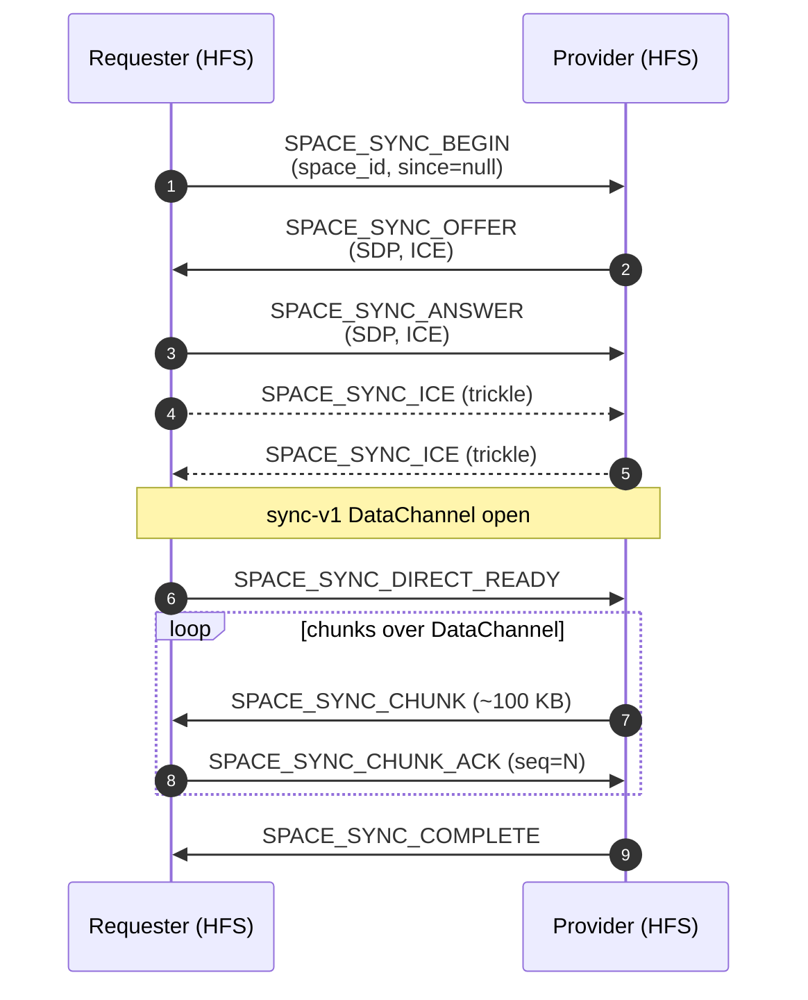
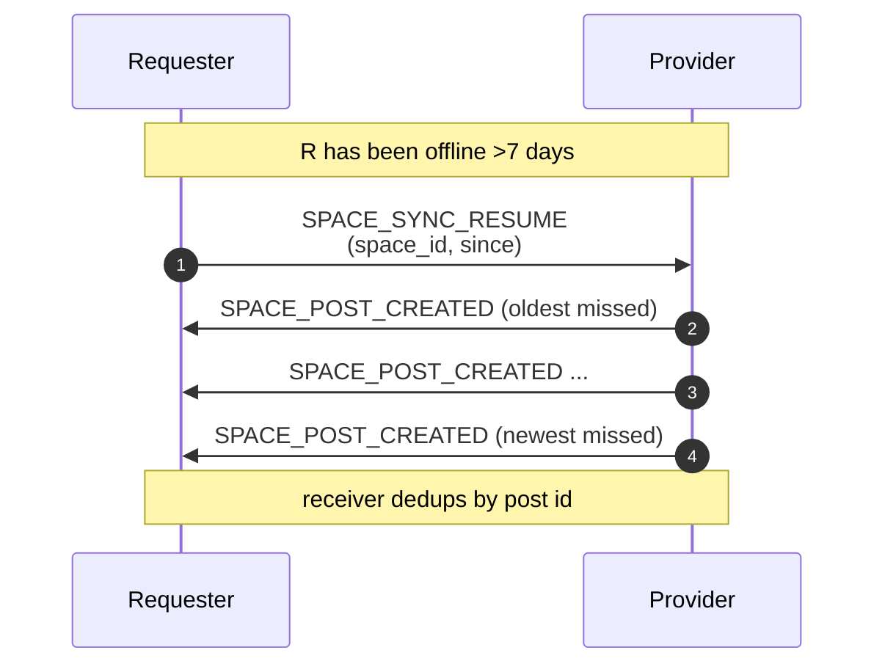

# Sync

When a new peer joins an existing space, it needs the historical
content the space already has — posts, comments, pages, tasks,
calendar events, stickies. That one-time bulk catch-up is the **sync
protocol**. Ongoing live updates afterwards are covered by
[feeds](./feeds.md) and the other content pages.

## Scope

- **HFS**: both sides. Requester asks for a snapshot; provider exports
  + streams chunks; requester acks and commits.
- **GFS**: uninvolved. Sync is strictly peer-to-peer. Preferred
  transport is the `sync-v1` WebRTC DataChannel; falls back to
  chunked inbox.

## Event types

`SPACE_SYNC_BEGIN`, `SPACE_SYNC_CHUNK`, `SPACE_SYNC_CHUNK_ACK`,
`SPACE_SYNC_RESUME`, `SPACE_SYNC_COMPLETE`,
`SPACE_SYNC_OFFER`, `SPACE_SYNC_ANSWER`, `SPACE_SYNC_ICE`,
`SPACE_SYNC_DIRECT_READY`, `SPACE_SYNC_DIRECT_FAILED`,
`SPACE_SYNC_REQUEST_MORE`.

## Tiered transport

- **Tier 2 — HTTPS inbox.** The bootstrap path. Always available; used
  until the dedicated sync DataChannel is up. Chunks are POSTed one by
  one to the provider's inbox.
- **Tier 3 — DataChannel (`sync-v1`).** Separate from the `fed-v1`
  routine channel so a large sync doesn't block live events. Once the
  DataChannel is negotiated the requester sends
  `SPACE_SYNC_DIRECT_READY` and subsequent chunks flow over it.

## Flow — happy path, upgrades to DataChannel

```mermaid
sequenceDiagram
    autonumber
    participant R as Requester (HFS)
    participant P as Provider (HFS)
    R->>P: SPACE_SYNC_BEGIN<br/>(space_id, since=null)
    P->>R: SPACE_SYNC_OFFER<br/>(SDP, ICE)
    R->>P: SPACE_SYNC_ANSWER<br/>(SDP, ICE)
    R-->>P: SPACE_SYNC_ICE (trickle)
    P-->>R: SPACE_SYNC_ICE (trickle)
    Note over R,P: sync-v1 DataChannel open
    R->>P: SPACE_SYNC_DIRECT_READY
    loop chunks over DataChannel
        P->>R: SPACE_SYNC_CHUNK (~100 KB)
        R->>P: SPACE_SYNC_CHUNK_ACK (seq=N)
    end
    P->>R: SPACE_SYNC_COMPLETE
```

## Flow — long-offline catch-up

When a peer reconnects after the 7-day outbox-retention window has
expired (spec §4.4.1), the requester asks each provider for events
newer than the last `created_at` it persisted locally. The provider
replies with a **burst of individual federation events** —
`SPACE_POST_CREATED`, `SPACE_TASK_CREATED`, etc. — that the receiver's
existing inbound handlers apply by primary key (re-deliveries are
idempotent).

```mermaid
sequenceDiagram
    autonumber
    participant R as Requester
    participant P as Provider
    Note over R,P: R has been offline >7 days
    R->>P: SPACE_SYNC_RESUME<br/>(space_id, since)
    P->>R: SPACE_POST_CREATED (oldest missed)
    P->>R: SPACE_POST_CREATED ...
    P->>R: SPACE_POST_CREATED (newest missed)
    Note over R,P: receiver dedups by post id
```

Implemented by `socialhome/federation/sync/space/resume.py`
(`SpaceSyncResumeProvider`). Today's cut replays:

- `SPACE_POST_CREATED` — posts (`space_post_repo.list_since`)
- `SPACE_COMMENT_CREATED` — comments on those posts
  (`space_post_repo.list_comments_since`, JOIN through `space_posts`)
- `SPACE_TASK_CREATED` — tasks (`space_task_repo.list_since`)
- `SPACE_PAGE_CREATED` — pages (`page_repo.list_since`)
- `SPACE_STICKY_CREATED` — stickies (`sticky_repo.list_since`)
- `SPACE_CALENDAR_EVENT_CREATED` — calendar events
  (`space_calendar_repo.list_events_since`, RRULEs included)
- `SPACE_GALLERY_ITEM_CREATED` — gallery items, joined via
  `gallery_items.album_id` → `gallery_albums.space_id`. Albums
  themselves still ride the chunked initial sync (§4.2.3); only items
  push per-event. Wire payload is the §S-9 thumbnail-only projection
  — full files are fetched on demand. Both rows record the owning /
  uploading `user_id` with **no** foreign key, because that user lives
  on the originating household — the same reason `space_posts.author`
  carries none. Before migration 0046 those columns referenced the local
  `users` table, so a synced album or item could not be inserted at all
  and a member household received the image bytes and no rows (#650).

Each resource is capped at `MAX_PER_RESOURCE = 500` events per request
— receivers paginate by re-issuing with the new high-water mark.

## Backpressure

The DataChannel carries its own high-water mark
(`set_buffered_amount_low_threshold`), but the provider also honours
application-level flow control: it will not send `seq=N+1` until it
has seen the `CHUNK_ACK` for some earlier window. This keeps memory
bounded even when the underlying SCTP buffer grows.

`SPACE_SYNC_REQUEST_MORE` lets the requester pull the next window
when it's finished writing the current one — useful on constrained
devices.

## DataChannel failure (HTTPS fallback)

A space sync session has two transports:

- **DataChannel** — `session.transport_mode = "rtc"`. The requester
  fires `SPACE_SYNC_BEGIN {prefer_direct: true}`; the provider sends
  `SPACE_SYNC_OFFER`; ICE trickles via `SPACE_SYNC_ICE`; chunks ride
  the `sync-v1` channel.
- **HTTPS inbox** — `session.transport_mode = "https"`. The requester
  fires `SPACE_SYNC_BEGIN {prefer_direct: false}`; the provider skips
  the SDP / ICE dance and ships `SPACE_SYNC_CHUNK` federation events
  straight into the inbox. Slower per chunk but always reachable.

The requester chooses RTC first. After it dispatches the `ANSWER` it
spawns a 15-second `wait_ready` watcher (`SyncRtcSession.wait_ready`):

- DataChannel opens → emit `SPACE_SYNC_DIRECT_READY` and start
  consuming chunks off the channel.
- Timeout / channel never opens → emit `SPACE_SYNC_DIRECT_FAILED
  {reason: "ice_timeout"}`. The provider's `_handle_space_sync_direct_failed`
  calls `trigger_relay_sync`, which mints a fresh `SPACE_SYNC_BEGIN
  {prefer_direct: false}` and the provider re-admits the session in
  HTTPS mode.

The HTTPS chunk handler (`_handle_space_sync_chunk`) validates that the
envelope's `from_instance` matches the session's recorded provider and
then forwards the inner payload to `SpaceSyncReceiver.on_chunk` — the
same pipeline RTC chunks go through. The receiver verifies the
per-chunk signature, decrypts, persists. Tier 3 (`sync_mode="full"`)
still aborts on `DIRECT_FAILED` per §25.8.18.

## Mesh-only host catch-up

### Authenticating a chunk from an unpaired host

Every chunk carries a per-resource signature the receiver verifies against
the **sender's** Ed25519 identity key. For a directly-paired host that key
comes from the `remote_instances` row — but a mesh-joined member has no
such row for the host, so the receiver found no key and dropped every
chunk (silently, at DEBUG: *"sync chunk from unknown instance"*). That was
the last layer of #648, and the reason the symptom looked like a content
bug: the stub, the content key and the media bytes all arrive.

The fallback key is `spaces.host_identity_pk` on the local stub
(migration 0045), which:

- arrives in the **sealed** `SPACE_PRIVATE_INVITE` payload (§25.8.21 — it
  is not envelope plaintext);
- is stored only when `derive_instance_id(pk)` equals the envelope's
  authenticated sender, so a sender can only ever assert its own real key
  (an instance id *is* the hash of its identity key — the same binding
  v_21 uses for `target_eph_pk`);
- is accepted only when the stub names that same household as the space's
  host, so one household cannot sign another's space content;
- authorises exactly one thing: signatures on content for that space. It
  grants no pairing and is not consulted by the §24.11 inbound pipeline.

An older host that ships no key leaves the column `NULL` and the previous
behaviour stands (fine for a paired host, no sync for a mesh one).

A household that joined a space over the **mesh** — no direct pair with
the host — is invisible to both of `SpaceSyncScheduler`'s usual
triggers, because `PairingConfirmed` and the periodic sweep each walk
CONFIRMED peers. Historically that meant such a member's only catch-up
was the single `begin_mesh_catchup_sync` fired from
`accept_remote_invite`; if that stream failed, nothing ever retried and
the space stayed permanently empty (#648).

Two additions close it:

- **Trigger** — a startup sweep (~45 s after boot, once the
  capabilities exchange has settled) plus every periodic tick walk the
  local spaces whose `owner_instance_id` is neither us nor a confirmed
  peer, and call `begin_mesh_catchup_sync` for each. That path — unlike
  `enqueue_sync_for_space` — registers the requester-side receive
  session the routed `SPACE_SYNC_CHUNK` replies need. Attempts are
  capped (`MAX_MESH_CATCHUP_ATTEMPTS`) so an unreachable host can't burn
  the host-side 5/h `(requester, space)` BEGIN budget.
- **Watermark** — "already caught up" is the protocol's own
  end-of-stream signal, never a content check: the provider emits the
  `__complete__` sentinel unconditionally (even for a space with zero
  rows), the receiver publishes `SpaceSyncComplete`, and the scheduler
  records `(space_id, host)`. A legitimately empty space therefore
  completes on the first attempt and is never re-BEGUN — a
  "has no posts" heuristic would loop on it forever.

Since a requester restart loses its in-memory `sync_id` as well as its
ephemeral privates, re-issuing BEGIN with a **fresh** `sync_id` is the
only way to recover it; a chunk arriving for the old session is dropped
as an unknown `sync_id`. The host side of the same fix is in
[`spaces.md` → "Cache lifetimes are ordered, not
equal"](spaces.md#cache-lifetimes-are-ordered-not-equal).

A host whose chunks keep failing gives up after
`MAX_CONSECUTIVE_CHUNK_FAILURES` rather than pushing a whole space's
metadata into a path that is not working — each mesh attempt costs a BFS
plus a 3-hop signed round. The requester's next BEGIN is the recovery.

One failure reason is exempt from that budget. After a route flood that
found nothing, `RouteDiscoveryService` arms a `ROUTE_NEGATIVE_COOLDOWN_S`
(30 s) negative cooldown during which `discover_route` returns "no route"
*immediately, without probing* — anti-flood, so a per-chunk loop can't
re-flood every mesh-capable peer once per chunk. The chunk loop has no
delay between chunks, so a single missed discovery window used to fail
`MAX_CONSECUTIVE_CHUNK_FAILURES` chunks within milliseconds and abandon
the whole stream, turning a two-second race into a permanent loss.
`send_with_mesh_fallback` therefore reports that case as the distinct
`route_cooldown` delivery error (with the remaining window in
`retry_after_s`), and the provider waits it out and retries the *same*
chunk instead of spending a strike — bounded by `MAX_ROUTE_COOLDOWN_WAITS`
per stream and `MAX_ROUTE_COOLDOWN_WAIT_S` per wait, so a household that
is genuinely unreachable still terminates the stream. At most one flood
per cooldown period per stream still reaches the wire.

## Round-robin signaling-node selection (cluster GFS)

When a Social Home instance is connected to a multi-node GFS cluster,
the load of relaying ICE candidates between requester and provider
must be spread across nodes rather than always landing on the
caller's preferred GFS. Spec §24.10.7.

- The provider, before generating `SPACE_SYNC_OFFER`, calls
  `POST /cluster/signaling-session` on its connected GFS node. The
  GFS picks the least-loaded online cluster node by weighted
  least-connections (min-heap on `(active_sync_sessions, node_id)`)
  and increments its counter, returning the chosen URL. The SH
  client wrapper that issues this call is
  `GfsConnectionService.request_signaling_node`.
- The provider includes that URL in the OFFER as `signaling_node`.
  Single-node deployments (or no paired GFS) return `null` and the
  field is omitted from the offer.
- The requester sends `SPACE_SYNC_ANSWER` and trickles `SPACE_SYNC_ICE`
  directly to `signaling_node`.
- On `SPACE_SYNC_DIRECT_READY` or `SPACE_SYNC_DIRECT_FAILED` the
  provider calls `POST /cluster/signaling-session/release` (via
  `GfsConnectionService.release_signaling_node`) to decrement the
  counter.

Counters are local-per-node (no consensus). They propagate via
`NODE_HEARTBEAT` so peers' selectors see fresh load on the next pick.
The same heartbeat also carries each node's live connected-client count
(GFS↔SH WebSocket sessions); peers mirror it in memory so the admin
portal's Cluster tab shows per-node load across the whole cluster. That
count is ephemeral (never persisted) and fail-soft — a heartbeat that
omits it leaves the last-known value untouched, so an older peer never
clobbers it to zero.
A node at `MAX_SIGNALING_SESSIONS = 200` is filtered out of the
candidate set; if every node is at the cap the GFS replies with
`503 {reason: "node_capacity"}` and the SH provider falls back to
relay sync.

## Implementation

- `socialhome/federation/sync/space/exporter.py` — provider
  streams chunks, resume support.
- `socialhome/federation/sync_rtc.py` — `sync-v1` DataChannel
  lifecycle (offer/answer/ICE/backpressure).
- `socialhome/services/federation_inbound/space_content.py` —
  chunk application on the requester side.
- `socialhome/federation/sync/space/provider.py` —
  `serialise_chunk()` and per-space authoritative snapshot.

## Spec references

§4.2.3 (Tier 2 / Tier 3 sync),
§24.12.3 (DataChannel sync details),
§25.6.2 (sync rate limits).
