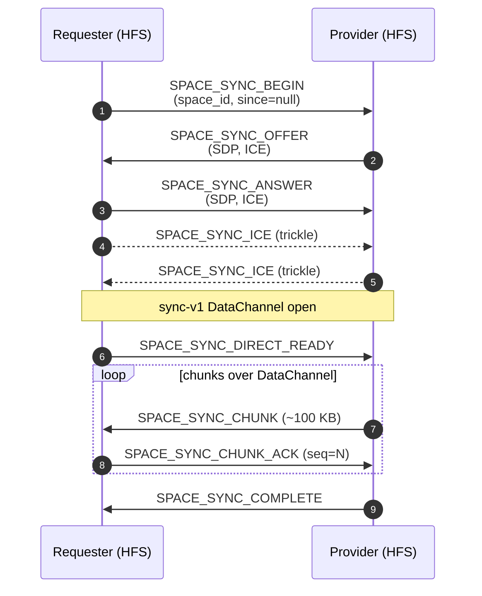
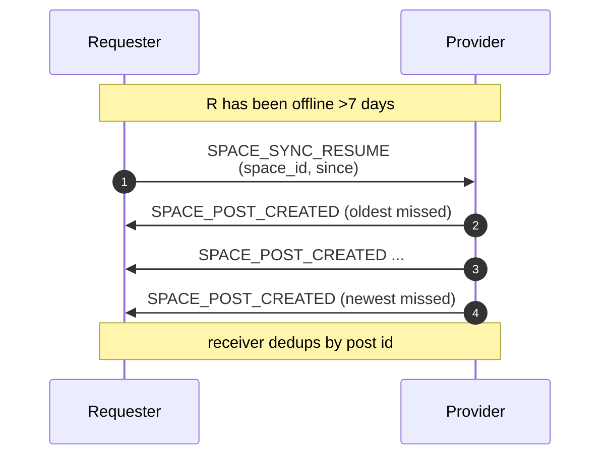

# Sync

When a new peer joins an existing space, it needs the historical
content the space already has — posts, comments, pages, tasks,
calendar events, stickies. That one-time bulk catch-up is the **sync
protocol**. Ongoing live updates afterwards are covered by
[feeds](./feeds.md) and the other content pages.

## Scope

- **HFS**: both sides. Requester asks for a snapshot; provider exports
  + streams chunks; requester acks and commits.
- **GFS**: uninvolved. Sync is strictly peer-to-peer. Preferred
  transport is the `sync-v1` WebRTC DataChannel; falls back to
  chunked inbox.

## Event types

`SPACE_SYNC_BEGIN`, `SPACE_SYNC_CHUNK`, `SPACE_SYNC_CHUNK_ACK`,
`SPACE_SYNC_RESUME`, `SPACE_SYNC_COMPLETE`,
`SPACE_SYNC_OFFER`, `SPACE_SYNC_ANSWER`, `SPACE_SYNC_ICE`,
`SPACE_SYNC_DIRECT_READY`, `SPACE_SYNC_DIRECT_FAILED`,
`SPACE_SYNC_REQUEST_MORE`.

## Tiered transport

- **Tier 2 — HTTPS inbox.** The bootstrap path. Always available; used
  until the dedicated sync DataChannel is up. Chunks are POSTed one by
  one to the provider's inbox.
- **Tier 3 — DataChannel (`sync-v1`).** Separate from the `fed-v1`
  routine channel so a large sync doesn't block live events. Once the
  DataChannel is negotiated the requester sends
  `SPACE_SYNC_DIRECT_READY` and subsequent chunks flow over it.

## Flow — happy path, upgrades to DataChannel

```mermaid
sequenceDiagram
    autonumber
    participant R as Requester (HFS)
    participant P as Provider (HFS)
    R->>P: SPACE_SYNC_BEGIN<br/>(space_id, since=null)
    P->>R: SPACE_SYNC_OFFER<br/>(SDP, ICE)
    R->>P: SPACE_SYNC_ANSWER<br/>(SDP, ICE)
    R-->>P: SPACE_SYNC_ICE (trickle)
    P-->>R: SPACE_SYNC_ICE (trickle)
    Note over R,P: sync-v1 DataChannel open
    R->>P: SPACE_SYNC_DIRECT_READY
    loop chunks over DataChannel
        P->>R: SPACE_SYNC_CHUNK (~100 KB)
        R->>P: SPACE_SYNC_CHUNK_ACK (seq=N)
    end
    P->>R: SPACE_SYNC_COMPLETE
```

## Flow — long-offline catch-up

When a peer reconnects after the 7-day outbox-retention window has
expired (spec §4.4.1), the requester asks each provider for events
newer than the last `created_at` it persisted locally. The provider
replies with a **burst of individual federation events** —
`SPACE_POST_CREATED`, `SPACE_TASK_CREATED`, etc. — that the receiver's
existing inbound handlers apply by primary key (re-deliveries are
idempotent).

```mermaid
sequenceDiagram
    autonumber
    participant R as Requester
    participant P as Provider
    Note over R,P: R has been offline >7 days
    R->>P: SPACE_SYNC_RESUME<br/>(space_id, since)
    P->>R: SPACE_POST_CREATED (oldest missed)
    P->>R: SPACE_POST_CREATED ...
    P->>R: SPACE_POST_CREATED (newest missed)
    Note over R,P: receiver dedups by post id
```

Implemented by `socialhome/federation/sync/space/resume.py`
(`SpaceSyncResumeProvider`). Today's cut replays:

- `SPACE_POST_CREATED` — posts (`space_post_repo.list_since`)
- `SPACE_COMMENT_CREATED` — comments on those posts
  (`space_post_repo.list_comments_since`, JOIN through `space_posts`)
- `SPACE_TASK_CREATED` — tasks (`space_task_repo.list_since`)
- `SPACE_PAGE_CREATED` — pages (`page_repo.list_since`)
- `SPACE_STICKY_CREATED` — stickies (`sticky_repo.list_since`)
- `SPACE_CALENDAR_EVENT_CREATED` — calendar events
  (`space_calendar_repo.list_events_since`, RRULEs included)
- `SPACE_GALLERY_ITEM_CREATED` — gallery items, joined via
  `gallery_items.album_id` → `gallery_albums.space_id`. The albums go
  out first (v_33; never the system "Posts" album): the album deletes
  recorded since `since` as `SPACE_GALLERY_ALBUM_DELETED`, every album of
  the space as `SPACE_GALLERY_ALBUM_CREATED` (a no-op for one the receiver
  holds) and those edited since `since` as `SPACE_GALLERY_ALBUM_UPDATED`
  — the receiver files an item only into an album it already holds, and an
  album made, edited or deleted while it was offline is state it lacks
  whether or not anything was uploaded since. Live, albums push their own
  `SPACE_GALLERY_ALBUM_*` lifecycle events (see
  [`spaces.md`](./spaces.md)). Wire payload is the §S-9 thumbnail projection **plus
  the full `url`** (`GalleryItem.to_federation_dict`): the on-demand
  full-file fetch S-9 describes was never built, the sender pushes both
  files over the media outbox, and the receiver's row must name the full
  file or the `SPACE_MEDIA_BLOB` scope check refuses it. Both rows record the owning /
  uploading `user_id` with **no** foreign key, because that user lives
  on the originating household — the same reason `space_posts.author`
  carries none. Before migration 0046 those columns referenced the local
  `users` table, so a synced album or item could not be inserted at all
  and a member household received the image bytes and no rows (#650).

Each resource is capped at `MAX_PER_RESOURCE = 500` events per request
— receivers paginate by re-issuing with the new high-water mark.

## What a sync streams

The provider walks `RESOURCE_ORDER` (`federation/sync/space/exporter.py`)
— roster first (`bans`, `members`, `member_pictures`), then content, each
live resource preceded by its tombstones:

`posts_deleted`, `posts`, `comments_deleted`, `comments`, `task_lists`,
`task_lists_deleted`, `tasks_deleted`, `tasks`, `tasks_archived`,
`pages_deleted`, `pages`, `stickies_deleted`, `stickies`,
`calendar_deleted`, `calendar`, `gallery_albums_deleted`, `gallery`,
`gallery_items_deleted`, `polls`, `schedules`, `space_zones_deleted`,
`space_zones`, `bazaar`, `timetables`, `chat_messages_deleted`,
`chat_messages`.

(Comment tombstones follow the posts, and gallery-item tombstones the
gallery, because a host stub for an id never held needs its parent — the
post, the album — held here first.)

A receiver drops a resource it does not know (DEBUG), so a new resource
needs no capability gate: an older receiver ignores it, and a newer
receiver simply gets nothing from an older provider.

**No fixed size limit — the space's retention window.** What streams is
what the space's retention keeps (`federation/sync/space/window.py`):

- `retention_days` set → live posts (and the comments, polls, schedules
  and bazaar listings that hang on them) and chat messages created at or
  after `now − retention_days`; post types in `retention_exempt_json` at
  any age, as the retention sweep keeps them. The chat's deletions use the
  same window (every household prunes its own chat).
- no retention (keep forever) → **everything**.
- **always in full**, whatever the retention:
  - **gallery** items — nothing prunes them (the retention sweep touches
    posts and chat only), so a window would hide from a joiner photos the
    host still shows;
  - the **post and comment tombstones** — only the host runs the post
    sweep, which soft-deletes expired posts without telling anyone; a
    member household never sweeps, so these tombstones are how a
    retention expiry (or any old delete) reaches it;
  - pages, task lists and tasks (and their tombstones) — not governed by
    retention;
  - the sticky, calendar-event, gallery and zone tombstones (migration
    0085) — none of these types is swept by retention.

**Bounded memory.** Exporters read their repo in keyset pages of
`SYNC_PAGE_SIZE` (200) rows — on the row id, or `(deleted_at, id)` for
the page / task tombstones — so a page never repeats or skips a row, and
`ChunkBuilder` turns each page into ≤ 8 KB chunks (halving a page until a
chunk fits) before the next page is read. `seq_start` / `seq_end` run on
across pages. The provider's catch-up media walks the same rows the same
way. No export holds a whole resource in memory, however big the space,
so there is no safety ceiling on the count.

**Order is storage order.** Keyset paging orders by the row id: posts and
the post tombstones newest-stored first; comments, their tombstones and
the chat (messages and deletions) **oldest-stored first** — a reply is
stored after what it answers, so it streams after it (before paging the
chat streamed by `created_at`, which can differ for a message relayed
late).

**Periodic re-syncs ship no media.** The scheduler re-syncs every
(confirmed peer × shared space) every 30 minutes. Those BEGINs carry
`sync_mode: "incremental"`; the provider then re-streams the rows but
skips the catch-up media walk — the live media outbox already delivered
every blob created since, and re-enqueueing every post / gallery /
listing blob of the space per peer per tick re-shipped the whole space's
bytes. Pairing, a deferred retry, an authority echo, mesh catch-up and
"Sync now" stay `"initial"` and enqueue the media. An older provider
treats `"incremental"` as it always did (a full stream with media).
*Known remaining cost* (follow-up): an incremental session still re-reads
and re-encrypts every row in the window (idempotent on the receiver).
Streaming only rows changed since the last completed sync needs a
per-row change stamp the tables lack (reactions, deletes and moderation
leave no timestamp) plus a per-peer watermark.

**Long streams are not reaped mid-way.** A session's `last_activity` is
stamped on every chunk (the provider on each shipped chunk, the requester
on each received one); `SyncSessionManager.reap_stale` closes sessions
**idle** for `STALE_SESSION_TTL_SECONDS` (30 min) rather than ones that
began that long ago, so a big stream outliving the TTL keeps going instead
of being torn down and restarted from scratch.

### Post and comment tombstones

A post or comment delete keeps the row (`deleted = 1`, content cleared):
the same soft-deleted row a member-published delete that overtook its
create leaves (v_49). `posts_deleted` streams `{id, post_id, author,
type, created_at, moderated}` — plus `actor_user_id`, the moderator, for
a moderator removal (`space_posts.moderated_by`, migration 0084) — and
`comments_deleted` `{id, comment_id, post_id, author, created_at}`; never
content. Before them, a household that missed a
`SPACE_POST_DELETED` / `SPACE_COMMENT_DELETED` kept the row forever and,
as a catch-up provider, re-spread it to every joiner. On the receiver
(`SpaceSyncReceiver._persist_post_tombstones` /
`_persist_comment_tombstones`):

- a row held live **in this space** is soft-deleted (a comment also
  lowers its post's count) and `PostDeleted` / `CommentDeleted` is
  published with the provider as origin, so nothing is re-broadcast;
- a **member** household's record is admitted only under the live
  delete rule: the held row's author's household or one with content
  authority (`may_mutate`), and for a post the space's `posts` level for
  the user who made it — exactly the live event's `actor_user_id` check:
  a moderator removal names its moderator, who must be seated on the
  provider and pass `moderates_as` (`admin_as` under `ADMIN_ONLY`); the
  author's own delete names nobody and counts as the author's when the
  provider speaks for the author. A removal recorded before 0084 names
  nobody and passes a restricted level only from the host;
- from the **host**, an id never held gets the soft-deleted row — only
  for an id owner-bound to the record's `author` in **this** space (and,
  for a comment, on a post held here), so a stale copy streamed later
  cannot create it and no space's id can be squatted. A post stub keeps
  the record's `type` (so a retention-exempt type stays exempt) and its
  moderator. A member household's record never stubs.

A live `SPACE_POST_DELETED` whose `actor_user_id` is not the author records
that moderator too, so the household can name them when it relays the
delete later.

A comment record carrying `deleted: true` from an older provider (which
streamed deleted comments as plain records) is never stored as a live
empty comment: from the host it is applied as a `comments_deleted`
tombstone, from anyone else it is dropped.

Tripwire: `tests/protocol/test_space_post_tombstones.py` (§27.9).

### Sticky, calendar-event, gallery and zone tombstones

A space sticky, calendar event, gallery album / item or zone delete keeps
its row (migration 0085): `deleted_at` / `deleted_by` set, content blanked
(a sticky's text, an event's summary / times / location / cover, an
album's name, an item's files and caption, a zone's name and circle). An
event's RSVPs and reminders go with it, and an album's items are
tombstoned in place (both by trigger). Every read skips a tombstone, every
upsert refuses one, so an id never comes back. Household stickies and
albums never federate and are still deleted outright.

Each type streams its tombstones as its own resource
(`exporters/{stickies_deleted,calendar_deleted,gallery_deleted,zones_deleted}.py`,
shared shape in `row_tombstones.py`), keyset-paged on the row id, never
windowed. A record is identity only: `{id, <owner>, created_at}` — the
owner under the live record's key (`author` / `created_by` /
`owner_user_id` / `uploaded_by` / `created_by`), plus `album_id` for an
item and `actor_user_id` (the tombstone's `deleted_by`) when one is
recorded; never content, never a coordinate. On the receiver
(`SpaceSyncReceiver._persist_{sticky,calendar,album,item,zone}_tombstones`):

- a row held live **in this space** is tombstoned exactly as the live
  `*_DELETED` does — an event publishes `CalendarEventDeleted` (the feed
  bridge removes its announcement post), an album / item publishes
  `GalleryAlbumDeleted` / `GalleryItemDeleted` with the provider as origin
  and unlinks the files no other row still names;
- a **member** household's record is admitted only under the type's live
  delete rule, reused, not forked: stickies / calendar events — a writer
  household, the space's `stickies` / `calendar` level for the
  `actor_user_id` it names, who must be seated on it
  (`_writer_delete_admits`, shared with tasks, task lists and pages); an
  item — its uploader's household or content authority (`may_mutate`); an
  album — its owner's household or settings authority (host / admin, not a
  moderator); a zone — an admin household;
- from the **host**, an id never held gets a content-free stub — only for
  an id owner-bound to the record's owner in **this** space (an item also
  only under an album held live here), so a stale copy streamed later
  cannot create it and no space's id can be squatted. Zone ids are not
  owner-bound (`z_<random>`): a zone is never stubbed — a stale copy an
  admin household streams to a joiner lands, and the host's next stream
  tombstones it. A member household's record never stubs.

A live `SPACE_GALLERY_ALBUM_DELETED` for an album not held here yet (the
delete overtook the create) now leaves the same durable tombstone — under
the same owner-bound rule — instead of the in-memory record it replaced
(`GalleryAlbumTombstones`, forgotten on restart); a legacy (unbound) id,
or one sent without the owner it commits to, is no longer remembered. The
resume replay re-sends album deletes since `since` from these rows, with
the owner.

**A deleted post holds no poll.** Soft-deleting a space post (by its
author, a moderator, the retention sweep, a live `SPACE_POST_DELETED` or a
`posts_deleted` tombstone) drops its reply poll (options, votes) and
schedule poll (meta, slots, responses) by trigger, and a deleted post
takes no new one — a `schedules` record streamed for it is refused.

No protocol bump: an older receiver drops the unknown resources (and keeps
the gap these close).

Tripwire: `tests/protocol/test_space_more_tombstones.py` (§27.9).

## Backpressure

The DataChannel carries its own high-water mark
(`set_buffered_amount_low_threshold`), but the provider also honours
application-level flow control: it will not send `seq=N+1` until it
has seen the `CHUNK_ACK` for some earlier window. This keeps memory
bounded even when the underlying SCTP buffer grows.

`SPACE_SYNC_REQUEST_MORE` lets the requester pull the next window
when it's finished writing the current one — useful on constrained
devices.

## DataChannel failure (HTTPS fallback)

A space sync session has two transports:

- **DataChannel** — `session.transport_mode = "rtc"`. The requester
  fires `SPACE_SYNC_BEGIN {prefer_direct: true}`; the provider sends
  `SPACE_SYNC_OFFER`; ICE trickles via `SPACE_SYNC_ICE`; chunks ride
  the `sync-v1` channel.
- **HTTPS inbox** — `session.transport_mode = "https"`. The requester
  fires `SPACE_SYNC_BEGIN {prefer_direct: false}`; the provider skips
  the SDP / ICE dance and ships `SPACE_SYNC_CHUNK` federation events
  straight into the inbox. Slower per chunk but always reachable.

The requester chooses RTC first. After it dispatches the `ANSWER` it
spawns a 15-second `wait_ready` watcher (`SyncRtcSession.wait_ready`):

- DataChannel opens → emit `SPACE_SYNC_DIRECT_READY` and start
  consuming chunks off the channel.
- Timeout / channel never opens → the requester's ICE watcher emits
  `SPACE_SYNC_DIRECT_FAILED {reason: "ice_timeout"}` to the provider so it
  releases its half-session (its RTC handle), and the
  **requester** — not the provider — re-issues the BEGIN via
  `trigger_relay_sync` (`SPACE_SYNC_BEGIN {prefer_direct: false}`). The
  provider must not mint a BEGIN of its own here: a bounced BEGIN would land
  back at the requester as an event it doesn't expect. Which side retries is
  decided by the originating direction of DIRECT_FAILED (see
  `_handle_space_sync_direct_failed`); the provider only owns the retry when
  it was the one that sent DIRECT_FAILED (e.g. rate-limited).

**Freeing the session.** When the end-of-stream sentinel lands, the
requester sends `SPACE_SYNC_COMPLETE {sync_id, space_id}` to the provider
(`send_with_mesh_fallback`) and closes its own session. The provider then
frees its slot, but only when the sender is the household the stream went
to. Before this, nothing sent that event. The provider held every finished
stream's session until the 30-minute stale reaper, so after three syncs a
household could not be served by that provider for half an hour. Older
providers already close on `SPACE_SYNC_COMPLETE`, so there is no
capability gate.

**A provider with no free slot.** The provider admits at most 3
concurrent syncs per household (S-6) and caps its signalling sessions
overall (S-8). A BEGIN refused for lack of a slot is answered
`SPACE_SYNC_DIRECT_FAILED {reason: "too_many_sessions" | "node_capacity"}`.
That refusal spends **none** of the requester's 5 / h budget for the space:
the provider checks capacity before it charges the hourly bucket. No
session was made, so nothing is relayed. The requester forgets the
request and publishes `SpaceSyncDeferred`. `SpaceSyncScheduler` then asks
again after 20 s, 40 s, 60 s and so on, up to 6 times, until that
(space, provider) sync completes. Before this, a household that restarted
and asked one host for more than 3 spaces at once lost the rest until the
30-minute tick. A `rate_limited` refusal is not retried; the periodic tick
covers it.

**Direct-only vs mesh-capable legs.** `SPACE_SYNC_OFFER`, `SPACE_SYNC_ANSWER`,
`SPACE_SYNC_ICE` and `SPACE_SYNC_DIRECT_READY` only make sense on the direct
path — ICE cannot traverse a relay, so the provider never offers a mesh-only
requester (it forces HTTPS mode), and the requester ignores an `OFFER` from,
or skips `DIRECT_READY` toward, a provider it holds no CONFIRMED row for (debug
log, no send). Every other leg — `SPACE_SYNC_BEGIN` (including the relay
re-BEGIN), `SPACE_SYNC_DIRECT_FAILED`, `SPACE_SYNC_REJECTED`, `SPACE_SYNC_CHUNK`
— goes through `send_with_mesh_fallback`, which is plain `send_event` for a
paired peer and a `SPACE_ROUTED` envelope for a mesh-only one. A bare
`send_event` toward an unpaired household is an un-queued `unknown_instance`
drop, so no sync helper uses one for a possibly-unpaired counterpart.

The HTTPS chunk handler (`_handle_space_sync_chunk`) validates that the
envelope's `from_instance` matches the session's recorded provider and
then forwards the inner payload to `SpaceSyncReceiver.on_chunk` — the
same pipeline RTC chunks go through. The receiver verifies the
per-chunk signature, decrypts, persists. Tier 3 (`sync_mode="full"`)
still aborts on `DIRECT_FAILED` per §25.8.18.

A space that is **archived here** is a read-only snapshot to sync as well:
`SpaceSyncReceiver._admit` drops every content resource (anything but the
roster — `members`, `bans`, `member_pictures`) unless the provider is the
host of a *reversibly* archived space; a terminated copy (`archived_reason`
set) takes content from nobody. Removals still land: the tombstone resources
(`REMOVAL_RESOURCES` — `posts_deleted`, `comments_deleted`,
`task_lists_deleted`, `tasks_deleted`, `pages_deleted`,
`stickies_deleted`, `calendar_deleted`, `gallery_albums_deleted`,
`gallery_items_deleted`, `space_zones_deleted`,
`chat_messages_deleted`) pass the archive gate as live `*_DELETED`
events do. The resume replay above is a burst of live
events, so the §24.11 `check_space_archived` gate refuses it the same way.
See [`spaces.md`](./spaces.md#an-archived-space-is-read-only-to-peers-too).

## Mesh-only host catch-up

### Authenticating a chunk from an unpaired host

Every chunk carries a per-resource signature the receiver verifies against
the **sender's** Ed25519 identity key. For a directly-paired host that key
comes from the `remote_instances` row — but a mesh-joined member has no
such row for the host, so the receiver found no key and dropped every
chunk (silently, at DEBUG: *"sync chunk from unknown instance"*). That was
the last layer of #648, and the reason the symptom looked like a content
bug: the stub, the content key and the media bytes all arrive.

The fallback key is `spaces.host_identity_pk` on the local stub
(migration 0045), which:

- arrives in the **sealed** `SPACE_PRIVATE_INVITE` payload (§25.8.21 — it
  is not envelope plaintext);
- is stored only when `derive_instance_id(pk)` equals the envelope's
  authenticated sender, so a sender can only ever assert its own real key
  (an instance id *is* the hash of its identity key — the same binding
  v_21 uses for `target_eph_pk`);
- is accepted only when the stub names that same household as the space's
  host, so one household cannot sign another's space content;
- authorises exactly one thing: signatures on content for that space. It
  grants no pairing and is not consulted by the §24.11 inbound pipeline.

An older host that ships no key leaves the column `NULL` and the previous
behaviour stands (fine for a paired host, no sync for a mesh one).

A household that joined a space over the **mesh** — no direct pair with
the host — is invisible to both of `SpaceSyncScheduler`'s usual
triggers, because `PairingConfirmed` and the periodic sweep each walk
CONFIRMED peers. Historically that meant such a member's only catch-up
was the single `begin_mesh_catchup_sync` fired from
`accept_remote_invite`; if that stream failed, nothing ever retried and
the space stayed permanently empty (#648).

Two additions close it:

- **Trigger** — a startup sweep (~45 s after boot, once the
  capabilities exchange has settled) plus every periodic tick walk the
  local spaces whose `owner_instance_id` is neither us nor a confirmed
  peer **and in which we hold a local seat other than a follower
  (`subscriber`) one**, and call `begin_mesh_catchup_sync` for each. A
  PUBLIC space we only follow over a GFS (or merely mirror from a
  listing, with no seat) is skipped: contacting its host would tell it we
  exist and are interested, and the GFS shields followers from hosts. The
  same filter governs the mesh version announcement (see
  [`spaces.md`](spaces.md#writer-certificates-v_49)). That path — unlike
  `enqueue_sync_for_space` — registers the requester-side receive
  session the routed `SPACE_SYNC_CHUNK` replies need. Attempts are
  capped (`MAX_MESH_CATCHUP_ATTEMPTS`) so an unreachable host can't burn
  the host-side 5/h `(requester, space)` BEGIN budget.
- **Watermark** — "already caught up" is the protocol's own
  end-of-stream signal, never a content check: the provider emits the
  `__complete__` sentinel unconditionally (even for a space with zero
  rows), the receiver publishes `SpaceSyncComplete`, and the scheduler
  records `(space_id, host)`. A legitimately empty space therefore
  completes on the first attempt and is never re-BEGUN — a
  "has no posts" heuristic would loop on it forever.

Since a requester restart loses its in-memory `sync_id` as well as its
ephemeral privates, re-issuing BEGIN with a **fresh** `sync_id` is the
only way to recover it; a chunk arriving for the old session is dropped
as an unknown `sync_id`. The host side of the same fix is in
[`spaces.md` → "Cache lifetimes are ordered, not
equal"](spaces.md#cache-lifetimes-are-ordered-not-equal).

A host whose chunks keep failing gives up after
`MAX_CONSECUTIVE_CHUNK_FAILURES` rather than pushing a whole space's
metadata into a path that is not working — each mesh attempt costs a BFS
plus a 3-hop signed round. The requester's next BEGIN is the recovery.

One failure reason is exempt from that budget. After a route flood that
found nothing, `RouteDiscoveryService` arms a `ROUTE_NEGATIVE_COOLDOWN_S`
(30 s) negative cooldown during which `discover_route` returns "no route"
*immediately, without probing* — anti-flood, so a per-chunk loop can't
re-flood every mesh-capable peer once per chunk. The chunk loop has no
delay between chunks, so a single missed discovery window used to fail
`MAX_CONSECUTIVE_CHUNK_FAILURES` chunks within milliseconds and abandon
the whole stream, turning a two-second race into a permanent loss.
`send_with_mesh_fallback` therefore reports that case as the distinct
`route_cooldown` delivery error (with the remaining window in
`retry_after_s`), and the provider waits it out and retries the *same*
chunk instead of spending a strike — bounded by `MAX_ROUTE_COOLDOWN_WAITS`
per stream and `MAX_ROUTE_COOLDOWN_WAIT_S` per wait, so a household that
is genuinely unreachable still terminates the stream. At most one flood
per cooldown period per stream still reaches the wire.

## No GFS on the sync path

The OFFER, ANSWER and every `SPACE_SYNC_ICE` candidate travel between the
two households as signed federation events (`send_event` for a paired peer,
`SPACE_ROUTED` over the mesh) — the GFS never carries sync signalling and
is never told that a sync is happening. The OFFER payload is exactly
`{sync_id, sdp_offer, ice_servers}`.

Earlier builds (spec §24.10.7, "round-robin signaling-node selection") had
the provider call `POST /cluster/signaling-session` on its GFS before every
direct sync and `POST /cluster/signaling-session/release` on
`SPACE_SYNC_DIRECT_READY` / `SPACE_SYNC_DIRECT_FAILED`. Both bodies carried
`from_instance`, a random `sync_id` and a household Ed25519 signature, so the
GFS learned **which household** began a direct sync, **when**, and **how long**
the ICE phase lasted — per sync. The returned `signaling_node` URL was put in
the OFFER, but no requester ever read it: ICE never went to a GFS node. The
round trip bought no load spreading and leaked activity metadata, so it is
gone:

- households never call `/cluster/signaling-session` or its `/release`;
- the provider's OFFER no longer carries `signaling_node`;
- a requester ignores `signaling_node` in an OFFER from an older provider
  and answers over federation as always;
- the GFS keeps answering both endpoints so older households still sync
  (legacy only — no current household path reaches them).

Cluster nodes still share load over `NODE_HEARTBEAT`: the legacy
signaling counters, plus each node's live connected-client count
(GFS↔SH WebSocket sessions), which peers mirror in memory so the admin
portal's Cluster tab shows per-node load across the whole cluster. That
count is ephemeral (never persisted) and fail-soft — a heartbeat that
omits it leaves the last-known value untouched, so an older peer never
clobbers it to zero. A heartbeat also carries `url`, the sender's advertised
cluster URL (`[cluster] advertise_url`, else `base_url`): a shared-seed
sibling's row URL follows it (as it does the sibling's `NODE_HELLO`), so a
redeployed alloc on a new port is reached there within one heartbeat
interval. A heartbeat always names its recipient (`to`), so replaying it to
another node cannot roll a row back; an approved node's URL never moves, a
sibling announcing the receiver's own URL is refused (WARNING), and an older
peer that omits `url` leaves the row unchanged.

Tripwire: `tests/protocol/test_gfs_no_sync_signaling.py` (§27.9) — no
household module may name the endpoint or put `signaling_node` on the wire,
and the sync handlers make no HTTP request.

## Implementation

- `socialhome/federation/sync/space/exporter.py` — provider
  streams chunks, resume support.
- `socialhome/federation/sync_rtc.py` — `sync-v1` DataChannel
  lifecycle (offer/answer/ICE/backpressure).
- `socialhome/services/federation_inbound/space_content.py` —
  chunk application on the requester side.
- `socialhome/federation/sync/space/provider.py` —
  `serialise_chunk()` and per-space authoritative snapshot.
- `socialhome/federation/sync/space/window.py` — the retention window
  (`SyncWindow`, `SyncWindows`) and keyset paging (`SYNC_PAGE_SIZE`,
  `iter_pages`, `iter_tombstone_pages`).
- `socialhome/federation/sync/space/exporters/{posts_deleted,comments_deleted}.py`
  and `receiver.py` (`_persist_post_tombstones`,
  `_persist_comment_tombstones`) — post / comment tombstones.
- `socialhome/federation/sync/space/exporters/{row_tombstones,stickies_deleted,calendar_deleted,gallery_deleted,zones_deleted}.py`
  and `receiver.py` (`_persist_{sticky,calendar,album,item,zone}_tombstones`,
  `_writer_delete_admits`) — the migration-0085 tombstones.

## Spec references

§4.2.3 (Tier 2 / Tier 3 sync),
§24.12.3 (DataChannel sync details),
§25.6.2 (sync rate limits).
