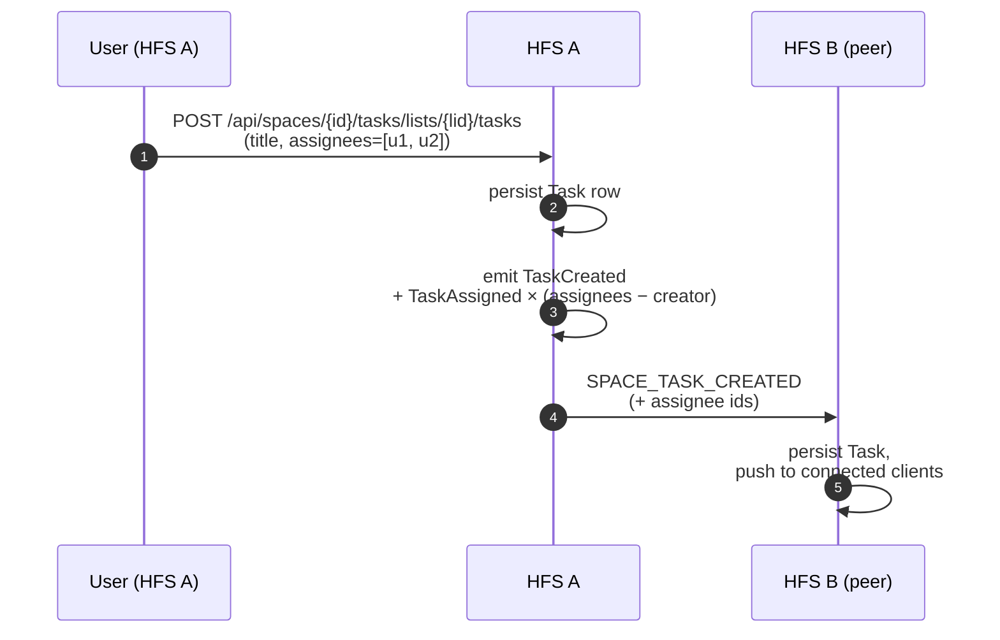
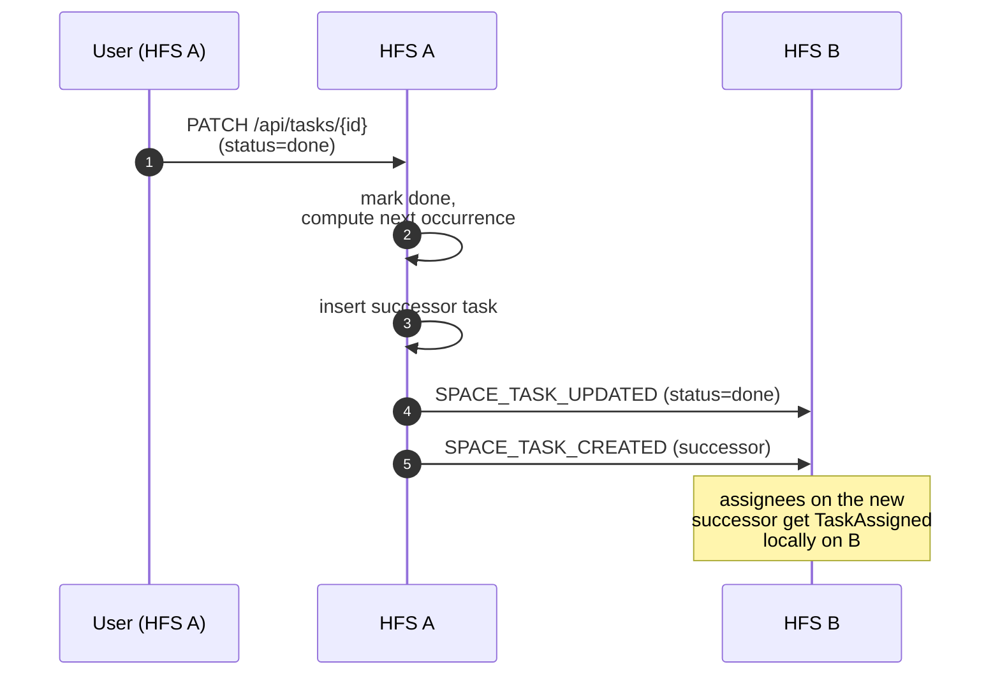

# Tasks

Task lists and individual tasks inside a space. Each HFS keeps a local
copy; edits federate to every member instance.

## Scope

- **HFS**: both sides. Creates, assigns, completes, and deletes tasks;
  broadcasts each edit as a federation event.
- **GFS**: uninvolved.

## Event types

`SPACE_TASK_CREATED`, `SPACE_TASK_UPDATED`, `SPACE_TASK_DELETED`,
plus the task-list wrappers carried implicitly inside the task's
`list_id` field (lists are created locally and their creation is
announced via a wrapper update).

## Flow — create + assign

## Flow — complete a recurring task

A task with a non-empty `rrule` re-spawns on completion: the original
task flips to `done`, and a fresh successor is inserted with the next
due date computed from the rule.

## Edit & delete

`_UPDATED` carries the whole Task row. `_DELETED` carries the
`task_id` only. Both are idempotent: the receiver upserts by ID.

Priority, due date, checklist items, and attachments ride on the
`task_updated` envelope as a diff on the full payload — pragmatic,
not minimal-diff, because tasks are small.

## Attachments

Attachments federate as references, not blobs: the event carries a
`media_id` resolvable via the owning HFS's `/api/media/{id}` endpoint.
For private spaces, the media endpoint returns 404 to unauthenticated
requests; authenticated cross-HFS requests are bearer-authorised via
the space membership. This keeps large files off the federation
envelopes but still lets every member see them.

## Implementation

- `socialhome/services/task_service.py`,
  `socialhome/services/space_task_service.py`.
- `socialhome/services/federation_inbound/space_content.py` —
  `SPACE_TASK_*` handlers.
- `socialhome/repositories/task_repo.py` — `SqliteTaskRepo`,
  `SqliteSpaceTaskRepo`.
- `socialhome/utils/rrule.py` — recurrence rule parser.
- `socialhome/routes/task_routes.py` — REST endpoints.

## Spec references

§13.6 (space tasks),
§13.6.4 (recurrence).
