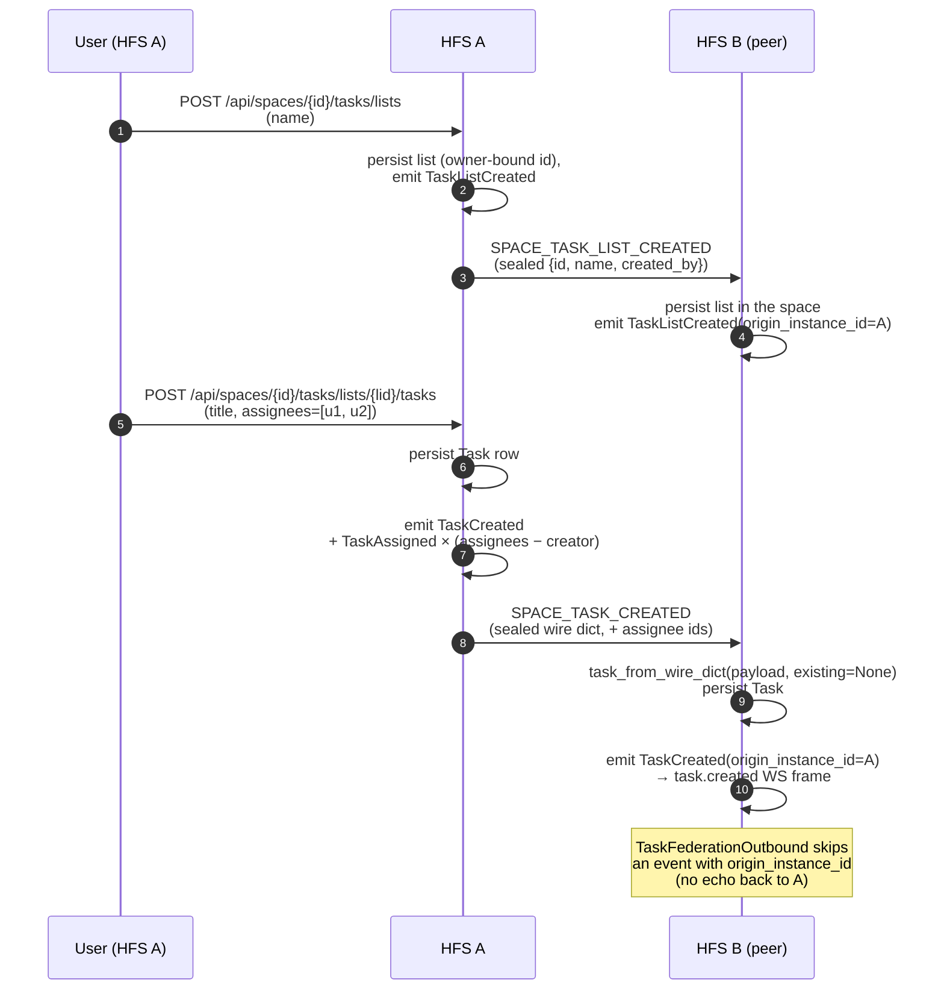
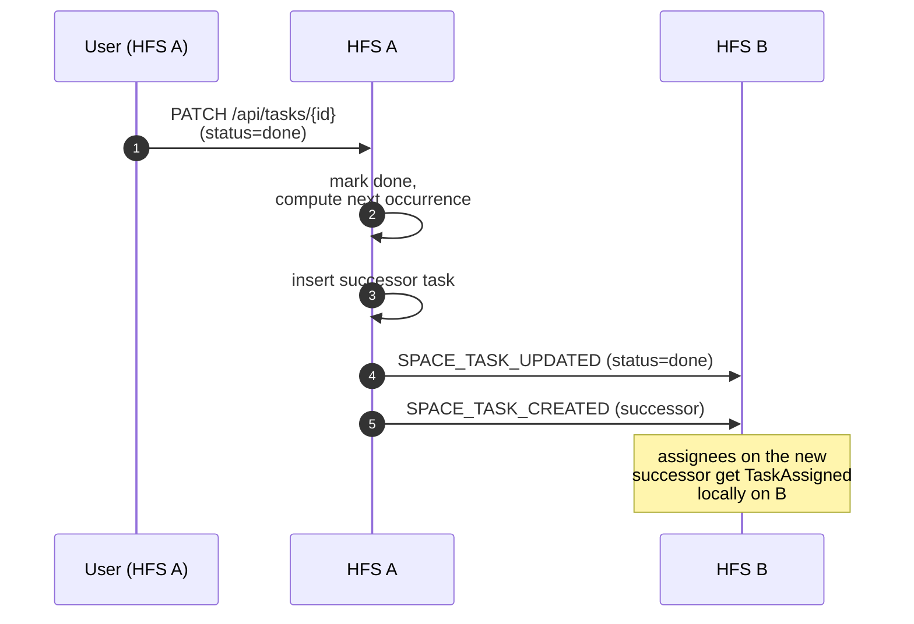

# Tasks

Task lists and individual tasks inside a space. Each HFS keeps a local
copy; edits federate to every member instance.

## Scope

- **HFS**: both sides. Creates, assigns, completes, and deletes tasks;
  broadcasts each edit as a federation event.
- **GFS**: uninvolved.

## Event types

`SPACE_TASK_CREATED`, `SPACE_TASK_UPDATED`, `SPACE_TASK_DELETED`, and
(v_40) the list lifecycle `SPACE_TASK_LIST_CREATED`,
`SPACE_TASK_LIST_UPDATED` (rename) and `SPACE_TASK_LIST_DELETED`. A
receiver stores a task only under a list it already holds in that space,
so a list federates before (and independently of) its tasks; the
`task_lists` §25.6 sync resource streams ahead of `tasks`, and the
`SPACE_SYNC_RESUME` replay sends lists created since `since` before the
tasks. A task that overtakes its list's create is refused (WARNING) and
healed by the list's event or the sync stream — a task never creates its
list. Deleting a list cascades to its tasks on every household. All
events fan out with `broadcast_to_space_members` to member households
only, every field inside the sealed payload.

**Legacy list ids.** `SPACE_TASK_LIST_CREATED` is new in v_40 and every
v_40 household mints owner-bound list ids, so a live (or resume-replayed)
create of a legacy uuid4 list id is refused at WARNING, and a member
household's `task_lists` sync stream may only add bound ids. A pre-v_40
list reaches a member household only through its **host's** sync stream
(taken whole) — otherwise a household seated in two spaces could
first-come squat one space's legacy list id under the other.

**Deletes, renames and catch-up.** A list delete keeps the row as a
tombstone (`space_task_lists.deleted_at`, migration `0069`) recording
who authorised it (`deleted_by`: the deleting user, or the approver of a
reviewed delete) and takes the list's tasks with it (a trigger; since
`0071` it tombstones them in place, see below). A tombstoned id never comes back
in its space — an upsert, a live or replayed `SPACE_TASK_LIST_CREATED`
(DEBUG, "deleted here"), and a sync record of the list or of a task
filed under it all skip it. A household that missed a delete learns it
two ways, both carrying `{id, space_id, created_by, actor_user_id}`
(`actor_user_id` = `deleted_by`, v_42):

- the **`task_lists_deleted`** §25.6 sync resource, streamed right after
  `task_lists`:
  - a list held live **in that space** is tombstoned. From a member
    household only under the live delete rule — a writer household, the
    actor seated on it, and the space's `tasks` level admitting the
    delete for that actor (`ADMIN_ONLY`: an admin; `MODERATED`: content
    authority or the list's creator; an actor-less record from a v_42
    household is refused). Refusals are summarised in one line per
    chunk, not one WARNING per record;
  - from the **host** only, an id never held here gets a content-free
    stub, so a stale copy streamed later cannot create it — but only if
    the id is owner-bound to `created_by` in **this** space. List ids are
    global, so a stub for another space's id would block that space's
    real list on this household; a legacy or mismatched id is skipped
    (INFO), and a tombstone naming a list held in another space is
    refused (WARNING, one line per chunk);
  - like a live delete it still lands in a space archived here; a
    separate resource rather than a flag on `task_lists`, so an older
    household drops it as unknown instead of reading a tombstone as a
    live list — no capability bump.
- the **`SPACE_SYNC_RESUME`** replay, which sends every list deleted at
  or after `since` as `SPACE_TASK_LIST_DELETED` ahead of the lists,
  judged by the live handler like any delete (so it converges under a
  restricted level when the deleter is seated on the replaying
  household — the host's own people always are).

A rename stamps `space_task_lists.updated_at` (an unchanged name, which
every host sync re-sends, does not). The resume replay sends the lists
created **or renamed** at or after `since` (second precision, so `>=`)
as `SPACE_TASK_LIST_CREATED`, which a household holding the list
applies as a rename; a list unchanged since `since` is not re-sent, so
a co-member that missed a rename does not re-send its old name. Two
renames that cross are last-writer-wins by arrival, as for the live
`SPACE_TASK_LIST_UPDATED` — there is no version on a list. The host's
`task_lists` stream (taken whole) heals a missed rename too.

**Limits.** The sync stream carries **every** list tombstone of the
space, newest delete first, read page by page (no fixed count: a
household that missed any number of deletes in one outage converges).
Tasks are not governed by the space's `retention_days`, so no retention
window applies either. The resume replay carries at most 500 since
`since` per request and the receiver re-issues for more. Tombstones are
**never pruned**, like `space_timetables` tombstones: a row is a few dozen
bytes, and pruning one would let a household offline past the window
resurrect the list. They cascade away with the space.

**Single-task deletes** follow the same design (migration `0071`). A
task delete keeps the row as a tombstone (`space_tasks.deleted_at`,
`deleted_by` as for lists) with its content blanked — title,
description, assignees, labels, priority, due date and recurrence are gone; only
the id, list, creator and timestamps stay. An archived task is the same
row, so it tombstones alike. A tombstoned id never comes back in its
space: an upsert, a live or replayed `SPACE_TASK_CREATED` /
`_UPDATED` (DEBUG, "deleted here"), and a `tasks` / `tasks_archived`
sync record all skip it. A household that missed a delete learns it
two ways, both carrying `{id, space_id, list_id, created_by,
actor_user_id}` (the live `SPACE_TASK_DELETED` shape plus
`created_by`; `actor_user_id` = `deleted_by`):

- the **`tasks_deleted`** §25.6 sync resource, streamed after
  `task_lists_deleted` and before `tasks`, with the same rules as
  `task_lists_deleted`: a task held live in that space is tombstoned
  (from a member household only under the live delete rule — writer
  household, actor seated on it, the `tasks` level admitting the delete
  with the task's creator as row owner; refusals one line per chunk);
  from the **host** only, a never-held id gets a stub if it is
  owner-bound (kind `space-task`) to `created_by` in **this** space
  **and** its `list_id` is a list live here in this space
  (`space_tasks.list_id` is a FK — the `task_lists` stream ahead of it
  normally delivers the list first); a task named in another space is
  refused (WARNING). It lands in a space archived here, and an older
  household drops the unknown resource (at DEBUG, before decrypting) —
  no capability bump: a v_N peer that never streams it just doesn't heal
  others, and a v_N receiver keeps the pre-0071 behaviour.
- the **`SPACE_SYNC_RESUME`** replay, which sends every task deleted at
  or after `since` as `SPACE_TASK_DELETED` after the lists and before the
  live tasks (tombstones are never replayed as `SPACE_TASK_CREATED`),
  judged by the live handler like any delete. An older receiver applies
  it as a plain delete and ignores `created_by`.

**With list tombstones.** Since `0071` a list delete's trigger
tombstones the list's live tasks **in place** (the list's `deleted_at` /
`deleted_by`, content blanked) instead of deleting them, as `0069` did —
a hard-deleted task id could be re-filed by its owner under another live
list of the space. A task tombstoned before its list keeps its own
`deleted_by`. Tasks of a deleted list are not streamed or replayed as
task tombstones: the list's tombstone covers them, and its trigger
tombstones them on the receiver too, so nothing is shipped twice. A
task tombstone naming a list tombstoned here is a quiet no-op. Same limits as lists: the stream carries every task
tombstone, page by page; the replay at most 500 since `since` per
request; and they are never pruned (they cascade away with their list or space).

**Received text is sanitised** like REST input (control / bidi /
spoofing characters removed) and cut to fit — title ≤ 200, list name
≤ 100, description ≤ 5000, labels ≤ 10 × 32, assignees ≤ 10 strings; a
title or list name with nothing visible left is dropped at WARNING. A
`position` that is not a finite integer in the signed 64-bit range
keeps the held value.

List payload: `{id, space_id, name, created_by}` (`_UPDATED` carries
`{id, space_id, name}`, `_DELETED` `{id, space_id}`). New list ids are
owner-bound to `created_by` (kind `space-task-list`); writes are
collaborative like tasks — any writer household may rename or delete a
list, a new list's `created_by` must be a member seated on the sender,
and a rename keeps the list's original creator.

## Flow — create + assign

```mermaid
sequenceDiagram
    autonumber
    participant U as User (HFS A)
    participant A as HFS A
    participant B as HFS B (peer)
    U->>A: POST /api/spaces/{id}/tasks/lists<br/>(name)
    A->>A: persist list (owner-bound id),<br/>emit TaskListCreated
    A->>B: SPACE_TASK_LIST_CREATED<br/>(sealed {id, name, created_by})
    B->>B: persist list in the space<br/>emit TaskListCreated(origin_instance_id=A)
    U->>A: POST /api/spaces/{id}/tasks/lists/{lid}/tasks<br/>(title, assignees=[u1, u2])
    A->>A: persist Task row
    A->>A: emit TaskCreated<br/>+ TaskAssigned × (assignees − creator)
    A->>B: SPACE_TASK_CREATED<br/>(sealed wire dict, + assignee ids)
    B->>B: task_from_wire_dict(payload, existing=None)<br/>persist Task
    B->>B: emit TaskCreated(origin_instance_id=A)<br/>→ task.created WS frame
    Note over B: TaskFederationOutbound skips<br/>an event with origin_instance_id<br/>(no echo back to A)
```

## Flow — complete a recurring task

A task with a non-empty `rrule` re-spawns on completion: the original
task flips to `done`, and a fresh successor is inserted with the next
due date computed from the rule.

```mermaid
sequenceDiagram
    autonumber
    participant U as User (HFS A)
    participant A as HFS A
    participant B as HFS B
    U->>A: PATCH /api/tasks/{id}<br/>(status=done)
    A->>A: mark done,<br/>compute next occurrence
    A->>A: insert successor task
    A->>B: SPACE_TASK_UPDATED (status=done)
    A->>B: SPACE_TASK_CREATED (successor)
    Note over B: assignees on the new<br/>successor get TaskAssigned<br/>locally on B
```

## Edit & delete

`_CREATED` / `_UPDATED` carry the whole task in the wire form below;
`_DELETED` carries `id`, `list_id` and `space_id`. All are idempotent:
the receiver upserts / deletes by id (scoped to the path space). After
a write the receiver publishes `TaskCreated` / `TaskUpdated` /
`TaskDeleted` with `origin_instance_id` set to the sending household,
so its local members see the change live (`task.*` WS frame to the
space) and the outbound bridge never echoes it back. Reordering a list
(`POST /api/spaces/{id}/tasks/lists/{lid}/reorder`) federates as one
`SPACE_TASK_UPDATED` per moved task.

## Wire payload (v_40)

One codec — `task_to_wire_dict(task, space_id)` /
`task_from_wire_dict(payload, existing=)` in `socialhome/domain/task.py`
— serves the live `SPACE_TASK_*` events, the `tasks` /
`tasks_archived` §25.6 sync records and the `SPACE_SYNC_RESUME` replay,
so they cannot drift. Every field rides inside the sealed payload:

| Field | Type | Notes |
|---|---|---|
| `id`, `list_id`, `space_id` | string | required (`id`, `list_id`, `title`) |
| `title`, `description` | string / string or null | |
| `status` | `todo` / `in_progress` / `done` | |
| `position` | int | ordering key within the list |
| `created_by` | user id | owner-bound id input (v_36) |
| `created_at`, `updated_at` | ISO 8601 | |
| `due_date` | `YYYY-MM-DD` or null | |
| `assignees` | array of user ids | |
| `recurrence` | `{rrule, last_spawned_at}` or null | |
| `recurrence_parent_id` | string or null | |
| `archived_at` | ISO 8601 or null | |
| `priority` | `low` / `medium` / `high` / `urgent` or null | **always present** (v_40) |
| `labels` | array of ≤ 10 strings of ≤ 32 chars | v_40; normalised on receipt |

**Merge rule.** A key that is absent keeps the value already held
(the default for a new row); a key that is present is authoritative —
`null` / `[]` clears it. An unknown `priority` value (from a newer
build) keeps the held one.

**v_39 senders.** A payload without the `priority` key comes from a
v_39 household. Its inbound path stored remote tasks without
`due_date`, `archived_at` or the recurrence, so the values it sends
back in an edit are not its user's intent. For a task already held,
those fields — and `priority` / `labels`, which it never knew — count
as absent, so a v_39 edit (title, status, assignees, …) applies without
wiping them. For a new task there is nothing to wipe and its fields are
taken as sent.

## Attachments

Attachments federate as references, not blobs: the event carries a
`media_id` resolvable via the owning HFS's `/api/media/{id}` endpoint.
For private spaces, the media endpoint returns 404 to unauthenticated
requests; authenticated cross-HFS requests are bearer-authorised via
the space membership. This keeps large files off the federation
envelopes but still lets every member see them.

## Creator-bound ids (v_36)

A new space task's id is owner-bound to its `created_by` and space
(`federation/owner_bound_id.py`, kind `space-task`): the live create
handler (for a task not held yet) and the §25.6 sync receiver refuse
a bound id claimed for anybody else, so only the creator's household
can announce it. Tasks are collaborative, so only the
attribution was at stake; edits keep it. Legacy (uuid4) ids keep the
first-come rule. See [`spaces.md`](./spaces.md) and the v_36 row in
[`capabilities.md`](./capabilities.md).

## Implementation

- `socialhome/domain/task.py` — `Task`, `TaskPriority`,
  `normalize_labels`, `UNSET`, and the wire codec
  (`task_to_wire_dict` / `task_from_wire_dict`).
- `socialhome/services/task_service.py` — `TaskService` (household) and
  `SpaceTaskService` (space), including the minimal RRULE evaluator.
- `socialhome/services/task_federation_outbound.py` — `SPACE_TASK_*`
  fan-out via `broadcast_to_space_members`.
- `socialhome/services/federation_inbound/space_content.py` —
  `SPACE_TASK_*` inbound handlers.
- `socialhome/federation/sync/space/exporters/tasks.py`,
  `tasks_archived.py`, `tasks_deleted.py`, `task_lists.py`,
  `task_lists_deleted.py`, `receiver.py`, `resume.py` — §25.6 sync (list
  and task tombstones included) and the resume replay.
- `socialhome/repositories/task_repo.py` — `SqliteTaskRepo`,
  `SqliteSpaceTaskRepo`.
- `socialhome/routes/tasks.py` — REST endpoints.

## Spec references

§13.6 (space tasks),
§13.6.4 (recurrence).
