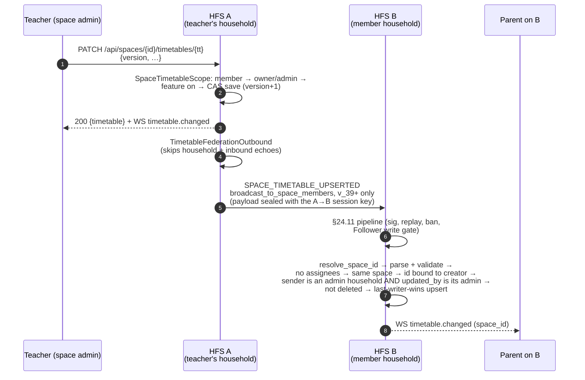

# Space timetables

A space can hold shared **timetables** — a class *Stundenplan* the
teacher posts in a class space, a club's weekly training plan. A space
timetable is space-wide (no per-person assignees): every member reads it,
only the space's **owners / admins** change it. It is the household
timetable's data model (weekly grid, per-date overrides, school weeks,
holidays), federated to every member household as one upserted aggregate.
Members can pin one to their Home, where today's lessons join the Today
card.

## Scope

- **HFS**: the admin's household applies the edit locally and fans the
  whole timetable out to the space's member households; every receiving
  household re-checks who may write it before storing it.
- **GFS**: uninvolved. Timetables never ride the public-space relay, and a
  household on the mesh that is not a space member only ever relays
  ciphertext (`SPACE_ROUTED`).

The feature is off by default: a space admin turns on
`SpaceFeatures.timetable` (column `spaces.feature_timetable`, federated in
`space_meta.features.timetable` like every other tab toggle). While it is
off, every `/api/spaces/{id}/timetables…` call answers
`403 FEATURE_DISABLED`.

## Event types

`SPACE_TIMETABLE_UPSERTED`, `SPACE_TIMETABLE_DELETED` (v_39), plus the
`timetables` resource of the §25.6 space sync.

| Event | Plaintext (routing) | Sealed payload |
|---|---|---|
| `SPACE_TIMETABLE_UPSERTED` | `event_type`, `from_instance`, `to_instance`, `space_id` | `{space_id, timetable}` — the full `to_wire_dict` (schema, id, name, created/updated by + at, version, week start, tz, colour, days, defaults, entries, overrides, validity, `assignees: []`) |
| `SPACE_TIMETABLE_DELETED` | same | `{space_id, timetable_id, deleted_at, deleted_by, created_by}` |

Both are classified in `SPACE_WRITE_EVENT_TYPES` (a Follower household may
not send them) and `SPACE_SESSION_ALLOWED_EVENT_TYPES` (a link-joined
member household receives them). The domain `validate` caps a timetable at
96 KiB of wire JSON. That is what fits the tightest path: a §25.6 sync chunk
shipped over HTTPS to a link-joined member is sealed twice (space content
key, then the per-peer session key, ~1.78× plus signatures) and must pass
the connection-server relay's ~232 KiB envelope cap; the same chunk over the
sync DataChannel must stay under libdatachannel's 256 KiB SCTP max message
size. (128 KiB did not fit the relay path.)

**Why no extra `SpaceContentEncryption` layer on the live events:** every
`SPACE_TIMETABLE_*` envelope is sealed pairwise for its one recipient
household (`FederationService._seal_envelope`, the per-peer session key),
a path through a non-member relay is `SPACE_ROUTED` end to end, and the
sync chunks are encrypted under the space content key — the "raise
`RuntimeError` when `SpaceContentEncryption` is missing" rule guards the GFS
public-space relay, which timetables never use.

## Flow — an admin edits the class timetable

A delete follows the same path: `SpaceTimetableScope.delete` tombstones
the row (`deleted_at`, content cleared) and emits `TimetableDeleted`
(carrying the row's `created_by`); the receiver tombstones the id in its
space — even an id it never saw, so a create that the delete overtook
can't land later — **but an unseen id only when it is owner-bound to the
payload's `created_by` in this space**. Without that, an admin of any
space shared with the receiver could pre-tombstone another space's
timetable id under its own space (the tombstone owns the id, so every later
upsert of it would be dropped), and junk ids would grow the table.

## Authorization

| Who | Read | Create / edit / delete |
|---|---|---|
| Space owner / admin (local) | yes | yes |
| Space member / follower (local) | yes | 403 |
| Not a member | 403 | 403 |
| Remote household with a live `admin` seat, writing as that admin | — | applied |
| Remote admin household writing as its plain member / another household's admin / our local user | — | refused (WARNING) |
| Remote member or follower household | — | refused |
| The space host, writing as any user with a live writer seat (`member` / `admin`) on the host — the owner included — or relaying a remote user whose own live seat is `admin` | — | applied |
| The space host, writing as its follower, or relaying a remote plain member / follower | — | refused |
| A banned user, a removed (tombstoned) seat, a blank / local / bot editor | — | refused |

**Why the host may record a plain member's edit.** The roster wire mirrors
the space's **owner** as a plain `member` seat (a remote seat has no owner
role), and a member household — especially a mesh-only or invite-link one,
which gets no user roster from the host — holds no other record of who the
owner is. Requiring an `admin` seat would refuse every live edit by the
owner (the teacher) there, and a mesh-only household, once its first
catch-up completes, never syncs again until it restarts. Accepting the
host's writer seats costs nothing: the host is the roster authority and
could authority-sign any of its users into an `admin` seat anyway, and an
honest host never emits a plain member's edit — its local service refuses
one (`SpaceAuthorship.admin_as`).

Additional receiver rules:

- **Ids are owner-bound from day one** (kind `space-timetable`,
  `federation/owner_bound_id.py`): every timetable id must commit to its
  `created_by` in this space; any other shape, or a commitment to anyone /
  anywhere else, is refused — there is no legacy window. A timetable new to
  the receiver also needs a `created_by` the sender speaks for.
- **Space scope**: an id the receiver holds in another space is refused
  (and the repo's upsert re-checks it in SQL).
- **Last-writer-wins** on `(version, updated_at, updated_by)`: an older or
  replayed copy is a DEBUG no-op; a tombstone is never overwritten. A copy
  whose version jumps more than 10 000 past the held one, or sits within
  10 000 of the 2³¹−1 cap, is refused at WARNING (live, sync, and in the
  repo's SQL) — a hostile moderator can't freeze a timetable out of every
  later editor's reach.
- **Timestamps** (`created_at`, `updated_at`, a delete's `deleted_at`) are
  normalised to UTC while parsing and must fall in 1970–2199; anything else
  (including an offset that overflows on conversion) is dropped at WARNING.
- **Hostile payloads** (malformed, wrong schema, out of bounds, over the
  wire cap, assignees set) are dropped at WARNING; the handler never raises.

## Sync (§25.6)

`TimetablesExporter` streams a space's live timetables as wire dicts. A
chunk from the host is applied whole (after the same parse / bound-id
checks); a chunk from another member household is admitted per record only
when that household is an admin household (`is_admin_household` — a v_41
`moderator` seat does not count) and the record's `updated_by` is
its admin (and, for a timetable new here, it speaks for `created_by`).
Deletes are not streamed — no other resource streams its tombstones: a
joiner has nothing to delete, an offline member gets the live
`SPACE_TIMETABLE_DELETED` from the outbox, and a held tombstone refuses any
later copy. A peer below v_39 drops the unknown resource.

## Capability

v_39, `FederationCapability.MIN_FOR_SPACE_TIMETABLE` (space-scoped).
**Gated, no fallback**: a member household below v_39 is not sent either
event — the Timetable tab is simply absent for its members. See
[`capabilities.md`](./capabilities.md).

## Home pins

`users.preferences_json.timetable_home_pins` (a list of space-timetable
ids, written by the SPA) adds those timetables to the caller's Today card
(`GET /api/me/corner` → `today_timetable`). A pin into a space the user
left, or whose timetable feature is off, is silently ignored
(`SpaceTimetableService.pinned_for_user`). Nothing federates.

## Implementation

- `socialhome/services/timetable_service.py` — `TimetableEditorMixin`
  (the shared editing surface), `SpaceTimetableService` /
  `SpaceTimetableScope` (membership, owner/admin, feature gate, owner-bound
  ids, 10-per-space cap, tombstoning delete, home pins).
- `socialhome/routes/timetables.py` — `_SpaceTimetablesBase` and the
  `SpaceTimetable*View` classes (`/api/spaces/{space_id}/timetables…`).
- `socialhome/services/timetable_federation_outbound.py` — the fan-out.
- `socialhome/services/federation_inbound/space_content.py` —
  `_on_timetable_upserted` / `_on_timetable_deleted`,
  `_timetable_write_allowed`.
- `socialhome/federation/space_authorship.py` — `admin_as`.
- `socialhome/federation/sync/space/exporters/timetables.py`,
  `socialhome/federation/sync/space/receiver.py` (`timetables` resource).
- `socialhome/repositories/timetable_repo.py` — `SqliteSpaceTimetableRepo`
  (CAS save, last-writer-wins `apply_remote`, `tombstone`).
- Tests: `tests/protocol/test_space_timetable_federation.py`, and the
  timetable rows of `test_space_content_scope.py` /
  `test_space_content_authorship.py`.

## Spec references

§13 (Federation: Spaces), §24.11 (inbound validation + authorship),
§25.6 (space sync), §25.8.21 (encryption-first).
